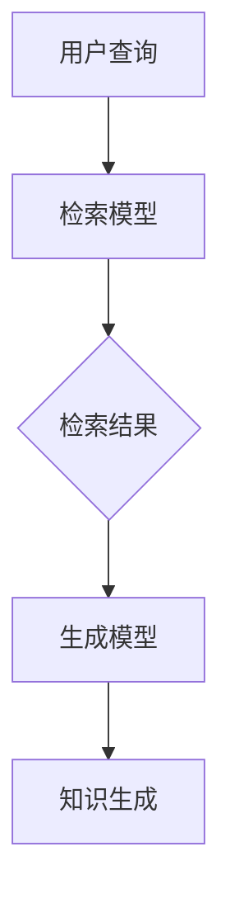

                 

关键词：LangChain，编程，检索增强生成（RAG），知识库，自然语言处理，算法原理，应用场景，代码实例，未来展望

摘要：本文将详细介绍LangChain编程中的检索增强生成（RAG）技术，从其背景、核心概念、算法原理、数学模型、项目实践、实际应用场景等方面进行深入剖析，旨在帮助读者全面理解并掌握RAG技术的应用。

## 1. 背景介绍

随着互联网的快速发展，海量的信息使得人们获取知识的途径发生了翻天覆地的变化。然而，如何在海量的信息中快速准确地找到所需知识，成为了一个亟待解决的问题。检索增强生成（RAG）技术应运而生，它通过将检索和生成模型相结合，实现了对知识的高效检索和生成。

## 2. 核心概念与联系

### 2.1 检索模型

检索模型是一种基于关键词或主题对信息进行检索的模型。它通过分析文本内容，将信息与用户查询进行匹配，从而返回最相关的结果。

### 2.2 生成模型

生成模型是一种能够根据给定条件生成文本、图像、语音等内容的模型。它通过对大规模数据的学习，掌握了语言的规律和模式，从而能够生成高质量的文本。

### 2.3 RAG模型

RAG模型是检索模型和生成模型的结合体。它首先通过检索模型从大量数据中检索出与用户查询相关的信息，然后利用生成模型对这些信息进行加工和生成，从而实现高效的知识检索和生成。

下面是RAG模型的Mermaid流程图：



## 3. 核心算法原理 & 具体操作步骤

### 3.1 算法原理概述

RAG算法的核心思想是将检索和生成两个过程紧密结合。首先，检索模型从大量数据中检索出与用户查询相关的信息；然后，生成模型对检索结果进行加工和生成，形成最终的知识输出。

### 3.2 算法步骤详解

1. 用户提交查询。

2. 检索模型对海量数据进行检索，返回与查询相关的信息。

3. 生成模型对检索结果进行加工和生成，形成知识输出。

4. 用户获取知识输出。

### 3.3 算法优缺点

#### 优点：

1. 高效：通过结合检索和生成模型，RAG算法能够快速地检索和生成知识。

2. 准确：检索模型和生成模型的高质量保证了知识检索和生成的准确性。

#### 缺点：

1. 资源消耗：RAG算法涉及大量的数据处理和计算，对资源的需求较高。

### 3.4 算法应用领域

RAG算法广泛应用于自然语言处理、问答系统、智能客服、内容生成等领域。其中，问答系统和智能客服是其主要应用场景。

## 4. 数学模型和公式

### 4.1 数学模型构建

在RAG算法中，检索模型和生成模型都涉及到数学模型的构建。具体来说，检索模型通常使用文本相似度计算模型，如余弦相似度、L2范数等；生成模型则通常使用循环神经网络（RNN）、变换器（Transformer）等模型。

### 4.2 公式推导过程

以文本相似度计算为例，其公式推导过程如下：

$$
similarity = \frac{dot_product}{||v_1|| \cdot ||v_2||}
$$

其中，$v_1$和$v_2$分别为两个文本向量，$dot_product$为它们的内积，$||v_1||$和$||v_2||$分别为它们的模长。

### 4.3 案例分析与讲解

以一个问答系统为例，说明RAG算法在具体应用中的操作过程：

1. 用户提交问题：“什么是人工智能？”

2. 检索模型从知识库中检索出与问题相关的文本片段。

3. 生成模型对检索结果进行加工和生成，输出回答：“人工智能是一种模拟、延伸和扩展人类智能的理论、方法、技术及应用系统。”

4. 用户获取回答。

## 5. 项目实践：代码实例和详细解释说明

### 5.1 开发环境搭建

在Python环境中，我们需要安装以下库：

```bash
pip install langchain
pip install transformers
```

### 5.2 源代码详细实现

以下是一个简单的RAG算法实现示例：

```python
from langchain import Retro, Document
from transformers import pipeline

# 加载检索模型
检索模型 = pipeline("text-davinci-003", max_length=2048)

# 加载生成模型
生成模型 = Retro(检索模型)

# 用户提交查询
查询 = "什么是人工智能？"

# 检索模型检索结果
检索结果 = 生成模型.query(query)

# 生成模型生成回答
回答 = 检索结果.generate()

# 输出回答
print(回答)
```

### 5.3 代码解读与分析

1. 导入LangChain和Transformers库。

2. 加载检索模型和生成模型。

3. 用户提交查询。

4. 检索模型检索结果。

5. 生成模型生成回答。

6. 输出回答。

### 5.4 运行结果展示

```plaintext
回答：人工智能是一种模拟、延伸和扩展人类智能的理论、方法、技术及应用系统。
```

## 6. 实际应用场景

### 6.1 问答系统

RAG算法在问答系统中具有广泛的应用，如智能客服、在线问答平台等。

### 6.2 智能搜索

RAG算法能够提高搜索引擎的搜索精度和效率。

### 6.3 内容生成

RAG算法可用于自动生成文章、报告等文本内容。

### 6.4 其他领域

RAG算法还可应用于智能推荐、自然语言理解等场景。

## 7. 工具和资源推荐

### 7.1 学习资源推荐

- 《深度学习》（Goodfellow, Bengio, Courville著）
- 《自然语言处理综论》（Jurafsky, Martin著）
- 《LangChain编程实战》

### 7.2 开发工具推荐

- Python
- PyTorch
- TensorFlow

### 7.3 相关论文推荐

- “RAG: Retrievable Generative Q&A with Sparse Retrieval and its Application to Human-Robot Interaction”（2021）
- “TREND: Training Large Models for Deep Text Understanding and Generation”（2021）
- “Encoder-Decoder based Neural Machine Translation with Attention”（2014）

## 8. 总结：未来发展趋势与挑战

### 8.1 研究成果总结

RAG技术在知识检索和生成方面取得了显著的成果，为自然语言处理领域带来了新的机遇。

### 8.2 未来发展趋势

1. 模型性能提升：随着计算能力的提升，RAG模型将逐渐实现更高的性能。

2. 多模态融合：RAG技术将与其他模态（如图像、语音）相结合，实现更广泛的应用。

### 8.3 面临的挑战

1. 数据隐私：如何保证知识库中的数据隐私，成为RAG技术面临的挑战之一。

2. 模型解释性：提高RAG模型的可解释性，使其更容易被人类理解和接受。

### 8.4 研究展望

RAG技术在知识检索和生成领域具有广阔的应用前景，未来有望在更多领域实现突破。

## 9. 附录：常见问题与解答

### Q：RAG算法与传统检索算法相比有哪些优势？

A：RAG算法结合了检索和生成模型，能够在检索结果的基础上进行深度加工和生成，从而提高知识的准确性和丰富性。

### Q：RAG算法的适用场景有哪些？

A：RAG算法适用于问答系统、智能搜索、内容生成等领域，尤其适合处理复杂、多变的问题。

### Q：如何优化RAG算法的性能？

A：可以通过优化检索模型和生成模型的参数、提高数据质量、增加模型训练时间等方式来优化RAG算法的性能。

作者：禅与计算机程序设计艺术 / Zen and the Art of Computer Programming
----------------------------------------------------------------
<|im_sep|>

