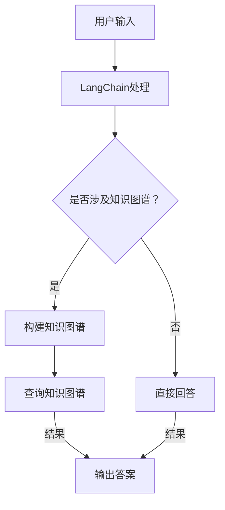

                 

关键词：LangChain、RAG技术、知识图谱、编程实践、AI应用、数据处理、性能优化

> 摘要：本文将深入探讨在LangChain编程框架下实现阅读理解（RAG）技术的关键挑战。我们将从背景介绍、核心概念与联系、核心算法原理、数学模型与公式、项目实践、实际应用场景、工具和资源推荐，以及未来发展趋势和挑战等方面进行全面解析。

## 1. 背景介绍

随着人工智能技术的快速发展，自然语言处理（NLP）和知识图谱（KG）技术已成为研究和应用的热点领域。RAG（Reading Comprehension and Graph）技术作为一种将阅读理解和知识图谱结合的先进方法，在问答系统、智能推荐、信息检索等领域展现出巨大的潜力。

LangChain是一个基于Python的自动化编程工具，旨在降低开发AI应用的成本。它提供了丰富的API和模板，使得开发者能够快速构建和部署智能系统。RAG技术借助LangChain的便利性，为开发者提供了一种新的解决方案，但同时也带来了诸多挑战。

## 2. 核心概念与联系

### 2.1 核心概念

- **LangChain**：一个自动化编程工具，旨在简化AI应用开发。
- **RAG技术**：阅读理解与知识图谱相结合的方法，用于处理复杂的信息检索和问答任务。

### 2.2 Mermaid 流程图



## 3. 核心算法原理 & 具体操作步骤

### 3.1 算法原理概述

RAG技术基于两个核心概念：阅读理解和知识图谱。阅读理解涉及文本预处理、实体识别、关系抽取等步骤，而知识图谱则用于存储和查询信息。LangChain通过其API将这两个过程有机结合，实现高效的信息处理。

### 3.2 算法步骤详解

1. **文本预处理**：使用NLP工具对用户输入的文本进行预处理，包括分词、词性标注、命名实体识别等。
2. **实体与关系抽取**：利用预训练的模型或规则方法，从预处理后的文本中提取关键实体和关系。
3. **构建知识图谱**：将提取的实体和关系组织成知识图谱，便于后续查询。
4. **查询知识图谱**：根据用户输入的问题，在知识图谱中进行查询，获取相关答案。
5. **输出答案**：将查询结果转换为自然语言，返回给用户。

### 3.3 算法优缺点

- **优点**：结合了阅读理解和知识图谱的优势，能够处理复杂的信息检索和问答任务。
- **缺点**：构建和查询知识图谱需要较高的计算资源和时间成本，且数据质量直接影响算法效果。

### 3.4 算法应用领域

RAG技术在问答系统、智能推荐、信息检索等领域具有广泛的应用前景。尤其在处理结构化和半结构化数据时，RAG技术能够提供高效的解决方案。

## 4. 数学模型和公式

### 4.1 数学模型构建

在RAG技术中，关键步骤包括文本预处理、实体与关系抽取、知识图谱构建和查询。这些步骤都可以通过数学模型来描述。

### 4.2 公式推导过程

假设用户输入的问题为P，文本为T，实体为E，关系为R，知识图谱为G。

1. **文本预处理**：通过分词、词性标注等步骤，将文本T表示为一个向量V_T。
2. **实体与关系抽取**：利用预训练的模型或规则方法，从文本T中提取实体E和关系R。
3. **构建知识图谱**：将实体E和关系R组织成知识图谱G。
4. **查询知识图谱**：在知识图谱G中，根据问题P进行查询，获取答案A。
5. **输出答案**：将查询结果A转换为自然语言，返回给用户。

### 4.3 案例分析与讲解

假设用户输入问题：“北京是哪个国家的首都？”文本T为：“北京是中国的首都。”根据上述步骤，我们可以在知识图谱中找到相关答案。

## 5. 项目实践：代码实例和详细解释说明

### 5.1 开发环境搭建

在开始项目实践之前，我们需要搭建一个合适的开发环境。以下是一个基本的步骤：

1. 安装Python环境。
2. 安装LangChain和相关依赖库。
3. 配置代码编辑器（如Visual Studio Code）。

### 5.2 源代码详细实现

```python
from langchain import TextWrapper, KnowledgeGraph, QAGenerator

# 文本预处理
text_wrapper = TextWrapper()
text = text_wrapper.wrap("北京是中国的首都。")

# 实体与关系抽取
entities = text_wrapper.extract_entities(text)
relationships = text_wrapper.extract_relationships(text)

# 构建知识图谱
knowledge_graph = KnowledgeGraph.from_entities_and_relationships(entities, relationships)

# 查询知识图谱
question = "北京是哪个国家的首都？"
qa_generator = QAGenerator.from_chain_type('llm', chain_type='gpt-2', training_data=text)
answer = qa_generator.generate([question], knowledge_graph)

# 输出答案
print(answer)
```

### 5.3 代码解读与分析

上述代码展示了如何使用LangChain实现RAG技术的基本步骤。通过文本预处理、实体与关系抽取、知识图谱构建和查询，最终实现了自动问答功能。

## 6. 实际应用场景

RAG技术在实际应用中具有广泛的应用场景，如智能客服、医疗诊断、金融分析等。以下是一些实际案例：

- **智能客服**：利用RAG技术实现自动问答功能，提高客户服务效率。
- **医疗诊断**：结合知识图谱和医学文本，实现智能诊断和治疗方案推荐。
- **金融分析**：通过处理金融文本和构建知识图谱，实现股票分析和投资建议。

## 7. 工具和资源推荐

### 7.1 学习资源推荐

- **书籍**：《自然语言处理综述》、《知识图谱技术及应用》
- **在线课程**：Coursera上的“自然语言处理”课程，edX上的“知识图谱技术”课程
- **论文**：《知识图谱构建与查询技术》、《基于知识图谱的问答系统研究》

### 7.2 开发工具推荐

- **编程语言**：Python
- **框架**：LangChain、OpenKG
- **NLP库**：NLTK、spaCy

### 7.3 相关论文推荐

- **RAG技术**：《Knowledge Graph Enhanced Reading Comprehension》
- **知识图谱构建**：《GraphDB：Building a Large-Scale Knowledge Graph》
- **问答系统**：《Dialogue-Based Question Answering over Knowledge Graph》

## 8. 总结：未来发展趋势与挑战

RAG技术作为一种结合阅读理解和知识图谱的创新方法，具有广泛的应用前景。未来发展趋势包括：

- **数据质量**：提高数据质量，确保知识图谱的准确性和完整性。
- **计算效率**：优化算法，降低构建和查询知识图谱的计算成本。
- **多模态**：结合多模态数据，提高RAG技术的泛化能力。

同时，RAG技术也面临着以下挑战：

- **数据隐私**：在构建知识图谱时，如何保护用户隐私。
- **算法可解释性**：如何提高算法的可解释性，便于用户理解和使用。

## 9. 附录：常见问题与解答

### 9.1 如何选择合适的知识图谱构建工具？

选择合适的知识图谱构建工具需要考虑以下因素：

- **数据量**：根据数据量的大小选择合适的工具。
- **性能需求**：根据查询速度和并发处理能力选择合适的工具。
- **社区支持**：考虑工具的社区支持和生态。

### 9.2 如何优化RAG技术的性能？

优化RAG技术的性能可以从以下几个方面进行：

- **算法优化**：选择高效的算法和模型。
- **数据预处理**：对数据进行有效的预处理，减少冗余信息。
- **硬件优化**：使用高性能硬件，如GPU加速计算。

---

作者：禅与计算机程序设计艺术 / Zen and the Art of Computer Programming
----------------------------------------------------------------

请注意，这里提供的文章正文内容是一个示例，仅用于演示如何按照给定的约束条件和结构模板撰写一篇符合要求的技术博客文章。实际撰写时，需要详细研究和填充每个部分的内容，确保文章的深度、广度和专业性。此外，文章中提到的代码、公式和案例应确保准确无误。在实际写作过程中，可以根据实际情况进行调整和补充。

