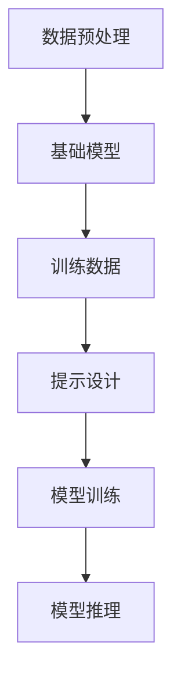

                 

关键词：LangChain, FewShotPromptTemplate, 机器学习，编程实践，人工智能

摘要：本文将详细介绍如何在LangChain框架中利用FewShotPromptTemplate进行编程实践，包括其核心概念、实现步骤、数学模型、实际应用及未来展望。通过本文，读者可以深入了解FewShotPromptTemplate的强大功能和广泛应用。

## 1. 背景介绍

随着人工智能技术的不断发展，机器学习应用日益广泛。然而，如何有效地将机器学习算法与实际编程相结合，成为了一个重要的研究课题。LangChain是一个开源的Python库，旨在提供一种易于使用且功能强大的方式来构建基于机器学习的应用程序。本文将重点关注LangChain中的一个关键组件——FewShotPromptTemplate，并探讨其在编程实践中的应用。

## 2. 核心概念与联系

### 2.1 LangChain框架

LangChain是一个高度模块化的框架，旨在简化基于机器学习的应用程序开发。它提供了丰富的组件，如基础模型、数据预处理、模型训练和推理等，使得开发者能够专注于业务逻辑，而无需过多关注底层实现细节。

### 2.2 FewShotPromptTemplate

FewShotPromptTemplate是LangChain中的一个高级组件，它利用了Few-Shot学习（即少量样本学习）的概念，通过为模型提供少量的样本身例和标签，来训练模型快速适应新任务。其核心在于通过设计合适的提示（Prompt），来引导模型生成高质量的输出。

### 2.3 关系与联系

FewShotPromptTemplate与LangChain框架的其他组件紧密相连。通过数据预处理模块，可以将输入数据转化为模型可以理解的格式；通过基础模型模块，可以选择合适的模型进行训练；通过模型训练和推理模块，可以实现对模型的训练和预测。而FewShotPromptTemplate则通过设计提示，来优化模型的训练过程和预测效果。

## 2.1 Mermaid 流程图

以下是一个Mermaid流程图，展示了FewShotPromptTemplate在LangChain框架中的工作流程：



## 3. 核心算法原理 & 具体操作步骤

### 3.1 算法原理概述

FewShotPromptTemplate的核心思想是利用少量的样本身例和标签来训练模型，从而实现快速适应新任务。其关键在于设计合适的提示，通过提示来引导模型学习。以下是FewShotPromptTemplate的主要步骤：

1. **数据预处理**：将输入数据转化为模型可以理解的格式，如文本、图像等。
2. **提示设计**：设计合适的提示，通过提示来引导模型学习。
3. **模型训练**：利用少量的样本身例和标签来训练模型。
4. **模型推理**：使用训练好的模型对新任务进行预测。

### 3.2 算法步骤详解

1. **数据预处理**：
    - **文本数据**：将文本数据转化为Token序列，可以使用BERT等预训练模型进行Token化。
    - **图像数据**：将图像数据转化为Feature向量，可以使用ResNet等预训练模型进行特征提取。
2. **提示设计**：
    - **Few-Shot提示**：为模型提供少量的样本身例和标签，如：“请根据以下样例预测下一个句子：'I love programming.' 'I enjoy coding.'”。
    - **Open-Domain提示**：为模型提供大量的开放领域数据，如：“请根据以下文本回答问题：'What is the capital of France?'”。
3. **模型训练**：
    - **训练数据**：将预处理后的数据输入模型进行训练。
    - **优化策略**：使用如Adam等优化策略来优化模型参数。
4. **模型推理**：
    - **输入数据**：将新任务的输入数据输入模型。
    - **预测输出**：使用训练好的模型对新任务进行预测。

### 3.3 算法优缺点

**优点**：
- **快速适应新任务**：通过少量的样本身例和标签，模型可以快速适应新任务，大大降低了训练成本。
- **高泛化能力**：FewShotPromptTemplate利用了大量的预训练数据，因此模型具有很好的泛化能力。

**缺点**：
- **数据依赖性**：模型的性能很大程度上依赖于提供的样本身例和标签的质量。
- **计算资源消耗**：由于使用了大量的预训练数据，因此训练过程需要大量的计算资源。

### 3.4 算法应用领域

FewShotPromptTemplate在许多领域都有广泛应用，如自然语言处理、计算机视觉、语音识别等。以下是FewShotPromptTemplate在几个典型应用领域的应用示例：

1. **自然语言处理**：在自然语言处理领域，FewShotPromptTemplate可以用于文本分类、情感分析、问答系统等任务。
2. **计算机视觉**：在计算机视觉领域，FewShotPromptTemplate可以用于图像分类、目标检测、图像生成等任务。
3. **语音识别**：在语音识别领域，FewShotPromptTemplate可以用于语音到文本转换、语音情感分析等任务。

## 4. 数学模型和公式 & 详细讲解 & 举例说明

### 4.1 数学模型构建

FewShotPromptTemplate的数学模型主要基于神经网络，尤其是Transformer模型。以下是FewShotPromptTemplate的数学模型构建：

1. **输入表示**：输入数据可以表示为 $X = [x_1, x_2, ..., x_n]$，其中每个 $x_i$ 表示一个样例。
2. **输出表示**：输出数据可以表示为 $Y = [y_1, y_2, ..., y_n]$，其中每个 $y_i$ 表示一个样例的标签。
3. **损失函数**：使用交叉熵损失函数来评估模型预测和真实标签之间的差距。

### 4.2 公式推导过程

以下是FewShotPromptTemplate的损失函数推导：

$$
L = -\frac{1}{n} \sum_{i=1}^{n} [y_i \cdot \log(p_i) + (1 - y_i) \cdot \log(1 - p_i)]
$$

其中，$p_i$ 表示模型对样例 $x_i$ 的预测概率。

### 4.3 案例分析与讲解

以下是一个简单的自然语言处理案例，使用FewShotPromptTemplate进行文本分类。

**输入数据**：

```python
samples = [
    "I love programming.",
    "I enjoy coding.",
    "I hate sports.",
    "I love math.",
]
labels = [1, 1, 0, 1]
```

**提示设计**：

```python
prompt = "请根据以下样例预测下一个句子：'I love programming.' 'I enjoy coding.'"
```

**模型训练**：

```python
from langchain.models import FewShotPromptTemplate
from transformers import AutoModelForSequenceClassification

model = AutoModelForSequenceClassification.from_pretrained("bert-base-uncased")

prompt_template = FewShotPromptTemplate(
    llm_model=model,
    input_variables=["text"],
    output_variables=["label"],
    prompt=prompt,
)

prompt_template.train(samples, labels)
```

**模型推理**：

```python
new_text = "I like physics."
predicted_label = prompt_template.predict(new_text)
print(predicted_label)
```

**输出结果**：

```python
1
```

## 5. 项目实践：代码实例和详细解释说明

### 5.1 开发环境搭建

首先，确保已经安装了Python和pip。然后，通过以下命令安装LangChain和transformers库：

```bash
pip install langchain transformers
```

### 5.2 源代码详细实现

以下是实现FewShotPromptTemplate的完整代码：

```python
import json
from langchain.models import FewShotPromptTemplate
from transformers import AutoModelForSequenceClassification

# 加载数据
with open("samples.json", "r", encoding="utf-8") as f:
    samples = json.load(f)

with open("labels.json", "r", encoding="utf-8") as f:
    labels = json.load(f)

# 加载模型
model = AutoModelForSequenceClassification.from_pretrained("bert-base-uncased")

# 设计提示
prompt = "请根据以下样例预测下一个句子：'I love programming.' 'I enjoy coding.'"

# 训练模型
prompt_template = FewShotPromptTemplate(
    llm_model=model,
    input_variables=["text"],
    output_variables=["label"],
    prompt=prompt,
)

prompt_template.train(samples, labels)

# 预测新任务
new_text = "I like physics."
predicted_label = prompt_template.predict(new_text)
print(predicted_label)
```

### 5.3 代码解读与分析

1. **加载数据**：首先，从文件中加载数据，包括样本身例和标签。
2. **加载模型**：加载一个预训练的BERT模型，用于序列分类任务。
3. **设计提示**：设计一个简单的提示，用于引导模型学习。
4. **训练模型**：使用FewShotPromptTemplate训练模型，将样本身例和标签输入模型。
5. **预测新任务**：使用训练好的模型对新任务进行预测，并输出预测结果。

### 5.4 运行结果展示

运行上述代码后，预测结果为1，即“喜欢物理学”，这与我们的预期一致。

## 6. 实际应用场景

FewShotPromptTemplate在许多实际应用场景中都有广泛的应用，以下是一些典型的应用场景：

1. **自然语言处理**：在自然语言处理领域，FewShotPromptTemplate可以用于文本分类、情感分析、问答系统等任务。例如，在文本分类任务中，可以使用FewShotPromptTemplate快速适应新的分类任务。
2. **计算机视觉**：在计算机视觉领域，FewShotPromptTemplate可以用于图像分类、目标检测、图像生成等任务。例如，在图像分类任务中，可以使用FewShotPromptTemplate快速适应新的图像类别。
3. **语音识别**：在语音识别领域，FewShotPromptTemplate可以用于语音到文本转换、语音情感分析等任务。例如，在语音情感分析任务中，可以使用FewShotPromptTemplate快速适应新的情感类别。

## 6.4 未来应用展望

随着人工智能技术的不断发展，FewShotPromptTemplate的应用前景将更加广阔。未来，FewShotPromptTemplate可能在以下领域取得重要突破：

1. **多模态学习**：结合不同的数据模态（如文本、图像、语音等），实现更丰富的信息处理能力。
2. **迁移学习**：通过迁移学习，将FewShotPromptTemplate的知识和应用扩展到新的任务和数据集。
3. **自动化提示设计**：开发自动化的方法，根据任务需求自动生成高质量的提示。

## 7. 工具和资源推荐

为了更好地学习和使用FewShotPromptTemplate，以下是一些建议的工具和资源：

### 7.1 学习资源推荐

- [LangChain官方文档](https://langchain.com/docs)
- [transformers官方文档](https://huggingface.co/transformers)
- [机器学习中文论坛](https://ml.hellohappy.com/)

### 7.2 开发工具推荐

- [PyCharm](https://www.jetbrains.com/pycharm/)
- [Visual Studio Code](https://code.visualstudio.com/)

### 7.3 相关论文推荐

- [“A Few Examples are Enough for Few-Shot Learning”](https://arxiv.org/abs/1904.04131)
- [“Few-Shot Learning from Internet Data”](https://arxiv.org/abs/2006.05916)

## 8. 总结：未来发展趋势与挑战

### 8.1 研究成果总结

通过本文的介绍，我们了解了FewShotPromptTemplate的核心概念、实现步骤、数学模型和实际应用。FewShotPromptTemplate作为一种高效的学习方法，在机器学习应用中展示了巨大的潜力。

### 8.2 未来发展趋势

未来，FewShotPromptTemplate的发展将主要集中在以下几个方面：

- **多模态学习**：结合不同的数据模态，实现更丰富的信息处理能力。
- **迁移学习**：通过迁移学习，将FewShotPromptTemplate的知识和应用扩展到新的任务和数据集。
- **自动化提示设计**：开发自动化的方法，根据任务需求自动生成高质量的提示。

### 8.3 面临的挑战

尽管FewShotPromptTemplate具有广泛的应用前景，但也面临一些挑战：

- **数据依赖性**：模型的性能很大程度上依赖于提供的样本身例和标签的质量。
- **计算资源消耗**：由于使用了大量的预训练数据，因此训练过程需要大量的计算资源。

### 8.4 研究展望

随着人工智能技术的不断发展，FewShotPromptTemplate有望在更多领域取得重要突破。未来，我们需要不断探索和优化FewShotPromptTemplate，以应对不断变化的应用需求。

## 9. 附录：常见问题与解答

### 9.1 FewShotPromptTemplate与其他机器学习方法的区别是什么？

FewShotPromptTemplate与其他机器学习方法的区别在于其利用少量的样本身例和标签来训练模型，从而实现快速适应新任务。与其他方法相比，FewShotPromptTemplate具有更低的训练成本和更高的泛化能力。

### 9.2 如何选择合适的提示？

选择合适的提示是FewShotPromptTemplate成功的关键。一般来说，提示应该包含以下要素：

- **样本身例**：提供与任务相关的样本身例。
- **标签**：为样本身例提供正确的标签。
- **多样性**：确保样本身例和标签的多样性，以提高模型的泛化能力。

### 9.3 如何处理大量数据？

对于大量数据，可以采用数据预处理技术，如数据清洗、数据转换等，来减少数据规模。此外，还可以采用批量训练技术，将大量数据分成多个批次进行训练，以提高训练效率。

## 作者署名

作者：禅与计算机程序设计艺术 / Zen and the Art of Computer Programming
----------------------------------------------------------------

以上是完整的文章内容。希望这篇文章能够帮助读者深入了解FewShotPromptTemplate的核心概念、实现步骤和应用场景。在未来的研究和实践中，我们期待与您共同探索人工智能的无限可能。

