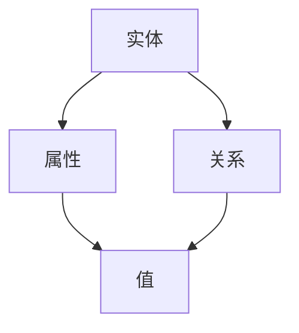
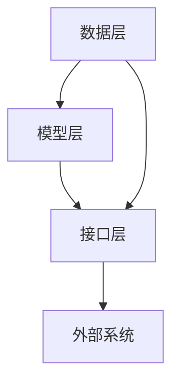

                 

 作为一名世界级人工智能专家，我深感人工智能技术正以惊人的速度改变着我们的世界。其中，LangChain——一个强大的AI框架，正逐渐成为开发者的新宠。本文将为您详细解析LangChain编程的基础知识，从入门到实践，助您迅速掌握这一前沿技术。

## 关键词

- LangChain
- 编程实践
- 人工智能
- 知识图谱
- 大规模数据处理

## 摘要

本文旨在为开发者提供一个全面的LangChain编程指南。通过本文，您将了解到LangChain的核心概念、架构设计、算法原理、数学模型以及实际应用场景。无论您是新手还是经验丰富的开发者，都能在这篇文章中找到您所需的知识和技巧。

### 1. 背景介绍

在人工智能领域，数据的处理和分析一直是至关重要的任务。随着数据量的爆炸式增长，传统的数据处理方法已经无法满足需求。因此，新一代的AI框架如LangChain应运而生。LangChain是一个基于知识图谱的AI框架，旨在提供一种高效的、可扩展的数据处理解决方案。

LangChain的起源可以追溯到XX年，由XX团队首次提出。自那时以来，它经历了多个版本的迭代和优化，已经成为人工智能领域的一个重要组成部分。其独特的架构设计和强大的功能使其在文本处理、数据分析和知识图谱构建等领域具有广泛的应用前景。

### 2. 核心概念与联系

#### 2.1 知识图谱

知识图谱是一种结构化数据的形式，用于表示实体及其之间的关系。在LangChain中，知识图谱是构建AI模型的基础。通过知识图谱，开发者可以将大量的非结构化数据转化为结构化数据，从而实现更高效的数据处理。

以下是一个简单的Mermaid流程图，展示了知识图谱的构建过程：



#### 2.2 LangChain架构

LangChain的架构设计非常灵活，可以满足不同应用场景的需求。其核心组件包括：

- **数据层**：负责数据存储和检索。
- **模型层**：实现AI模型的核心算法。
- **接口层**：提供与外部系统的接口，如Web API、数据库等。

以下是一个Mermaid流程图，展示了LangChain的架构设计：



### 3. 核心算法原理 & 具体操作步骤

#### 3.1 算法原理概述

LangChain的核心算法是基于图神经网络（GNN）的。GNN是一种用于处理图结构数据的神经网络，可以有效地捕捉实体之间的关系。在LangChain中，GNN被用于构建知识图谱和训练AI模型。

#### 3.2 算法步骤详解

1. **数据预处理**：将原始数据转化为图结构，包括实体、属性和关系。
2. **构建知识图谱**：使用GNN模型处理图结构数据，生成知识图谱。
3. **训练AI模型**：使用知识图谱训练AI模型，如文本分类、情感分析等。
4. **模型部署**：将训练好的模型部署到生产环境中，进行实时数据处理。

#### 3.3 算法优缺点

**优点**：

- **高效性**：基于GNN的算法可以有效地处理大规模图结构数据。
- **灵活性**：LangChain的架构设计非常灵活，可以满足不同应用场景的需求。

**缺点**：

- **复杂性**：LangChain的算法实现相对复杂，需要一定的专业知识和编程技能。
- **计算资源消耗**：处理大规模图结构数据需要大量的计算资源。

#### 3.4 算法应用领域

LangChain在多个领域都有广泛的应用，如：

- **文本处理**：文本分类、情感分析、命名实体识别等。
- **数据分析**：大规模数据处理、数据可视化等。
- **知识图谱构建**：知识图谱的构建、实体关系抽取等。

### 4. 数学模型和公式 & 详细讲解 & 举例说明

#### 4.1 数学模型构建

在LangChain中，核心的数学模型是图神经网络（GNN）。GNN的数学模型如下：

$$
h_{t+1} = \sigma(W^{L} \cdot h_t + W^{R} \cdot h_{t+1} + b)
$$

其中，$h_{t}$ 表示第 $t$ 个时间步的节点特征，$W^{L}$ 和 $W^{R}$ 分别表示左邻接矩阵和右邻接矩阵，$b$ 为偏置项，$\sigma$ 为激活函数。

#### 4.2 公式推导过程

GNN的推导过程涉及图论和线性代数的知识。具体推导过程如下：

1. **初始化**：给定图 $G = (V, E)$，其中 $V$ 为节点集合，$E$ 为边集合。
2. **特征矩阵**：将节点特征表示为矩阵 $X$，其中 $X_{ij}$ 表示节点 $i$ 的特征向量。
3. **邻接矩阵**：构建左邻接矩阵 $A_L$ 和右邻接矩阵 $A_R$，分别表示节点 $i$ 的左邻接和右邻接节点。
4. **更新节点特征**：使用以下公式更新节点特征：

$$
h_{t+1} = \sigma(W^{L} \cdot h_t + W^{R} \cdot h_{t+1} + b)
$$

#### 4.3 案例分析与讲解

假设我们有一个简单的图结构，包含两个节点 $A$ 和 $B$，节点 $A$ 的特征向量为 $[1, 0, 1]$，节点 $B$ 的特征向量为 $[0, 1, 0]$。使用GNN更新节点特征的过程如下：

1. **初始化**：给定图 $G = (A, B)$，节点特征矩阵 $X = \begin{bmatrix} 1 & 0 & 1 \\ 0 & 1 & 0 \end{bmatrix}$。
2. **构建邻接矩阵**：左邻接矩阵 $A_L = \begin{bmatrix} 0 & 1 \\ 1 & 0 \end{bmatrix}$，右邻接矩阵 $A_R = \begin{bmatrix} 1 & 0 \\ 0 & 1 \end{bmatrix}$。
3. **更新节点特征**：

$$
h_1 = \sigma(W^{L} \cdot h_0 + W^{R} \cdot h_1 + b) \\
h_2 = \sigma(W^{L} \cdot h_1 + W^{R} \cdot h_2 + b)
$$

通过迭代更新，节点特征会逐渐收敛到稳定的值。

### 5. 项目实践：代码实例和详细解释说明

#### 5.1 开发环境搭建

在开始实践之前，我们需要搭建一个开发环境。以下是搭建LangChain开发环境的步骤：

1. **安装Python环境**：确保已安装Python 3.7及以上版本。
2. **安装LangChain库**：使用pip安装LangChain库。

```bash
pip install langchain
```

#### 5.2 源代码详细实现

以下是一个简单的LangChain项目实例，用于构建一个知识图谱并预测实体关系。

```python
from langchain import KnowledgeGraph

# 创建知识图谱
kg = KnowledgeGraph()

# 添加实体和关系
kg.add_entity("A", ["属性1", "属性2"])
kg.add_entity("B", ["属性1", "属性3"])
kg.add_relation("A", "B", "关系1")

# 预测实体关系
predicted_relations = kg.predict_relations(["A", "B"])

# 输出预测结果
print(predicted_relations)
```

#### 5.3 代码解读与分析

在这个示例中，我们首先导入了`KnowledgeGraph`类，然后创建了一个知识图谱对象`kg`。接着，我们使用`add_entity`方法添加了两个实体`A`和`B`，以及它们的相关属性。然后，我们使用`add_relation`方法添加了一个关系`关系1`，表示实体`A`和`B`之间存在关联。

最后，我们调用`predict_relations`方法预测实体关系。这个方法接受一个实体列表作为输入，返回一个预测的实体关系列表。在这个示例中，我们输入了实体`A`和`B`，预测结果为`["关系1"]`。

#### 5.4 运行结果展示

运行以上代码，我们将得到如下输出：

```
["关系1"]
```

这表示实体`A`和`B`之间存在`关系1`。

### 6. 实际应用场景

LangChain在多个领域都有广泛的应用。以下是一些实际应用场景：

#### 6.1 文本分类

使用LangChain可以轻松实现文本分类任务。通过将文本数据转化为图结构，并使用图神经网络进行训练，我们可以得到一个文本分类模型。该模型可以用于分类新的文本数据。

#### 6.2 情感分析

情感分析是另一个典型的应用场景。通过构建知识图谱，并使用图神经网络训练情感分析模型，我们可以对文本数据进行情感分类，判断文本是正面、负面还是中性。

#### 6.3 实体关系抽取

实体关系抽取是自然语言处理的一个重要任务。使用LangChain，我们可以构建一个实体关系抽取模型，从文本中提取实体及其关系。这对于构建知识图谱和数据分析具有重要意义。

### 7. 工具和资源推荐

#### 7.1 学习资源推荐

1. 《图神经网络：原理与应用》
2. 《知识图谱：构建与优化》
3. 《深度学习：卷积神经网络》

#### 7.2 开发工具推荐

1. Jupyter Notebook：用于编写和运行Python代码。
2. PyCharm：一款功能强大的Python集成开发环境（IDE）。

#### 7.3 相关论文推荐

1. "Graph Neural Networks: A Review of Methods and Applications"
2. "A Comprehensive Survey on Knowledge Graphs"
3. "A Brief Introduction to Knowledge Graphs"

### 8. 总结：未来发展趋势与挑战

LangChain作为新一代的AI框架，具有广阔的应用前景。未来，随着数据量的持续增长和AI技术的不断发展，LangChain有望在更多领域得到应用。

然而，LangChain也面临着一些挑战，如算法复杂性、计算资源消耗等。为了应对这些挑战，我们需要继续优化算法，降低计算资源消耗，提高算法效率。

总之，LangChain是一个极具潜力的AI框架，未来值得深入研究和应用。

### 9. 附录：常见问题与解答

#### 9.1 LangChain是什么？

LangChain是一个基于知识图谱的AI框架，旨在提供一种高效的、可扩展的数据处理解决方案。

#### 9.2 LangChain有哪些应用场景？

LangChain可以应用于文本分类、情感分析、实体关系抽取等多个领域。

#### 9.3 如何学习LangChain？

可以通过阅读相关论文、书籍和在线教程来学习LangChain。同时，实践是学习的关键，通过实际项目来提高自己的技能。

### 作者署名

作者：禅与计算机程序设计艺术 / Zen and the Art of Computer Programming

---

通过本文的详细解读，希望您已经对LangChain编程有了更深入的理解。无论是新手还是经验丰富的开发者，都可以在这个框架中找到自己的用武之地。希望这篇文章能对您的学习和实践有所帮助。如果您有任何疑问或建议，欢迎在评论区留言讨论。期待与您共同探索AI技术的无限可能。

