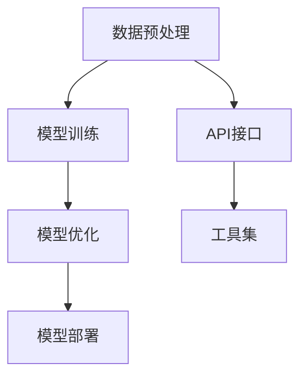

                 

关键词：LangChain、编程、大模型技术、深度学习、NLP、ChatGPT、AI应用

> 摘要：本文旨在深入探讨LangChain编程的概念、原理及应用，结合当前大模型技术的发展趋势，为读者提供从入门到实践的全面指导。通过对核心概念、算法原理、数学模型以及实际项目实践的详细讲解，本文将为从事人工智能领域的研究者、开发者和爱好者们提供宝贵的实践经验和见解。

## 1. 背景介绍

随着深度学习和自然语言处理（NLP）技术的迅速发展，大模型技术在AI领域中的应用越来越广泛。ChatGPT、BERT、GPT-3等模型的出现，推动了AI技术从传统的方法向更加智能化的方向发展。然而，这些大模型的开发和应用面临着一系列挑战，包括数据处理、计算资源、模型训练和部署等方面。

LangChain作为一款强大的编程框架，旨在简化大模型的开发过程，帮助开发者更高效地构建和部署AI应用。它基于Python编写，利用了Transformer模型在NLP领域的优势，为开发者提供了丰富的API和工具，使得AI开发变得更加直观和便捷。

## 2. 核心概念与联系

在探讨LangChain编程之前，我们需要了解一些核心概念和它们之间的联系。

### 2.1 深度学习与Transformer模型

深度学习是一种通过神经网络模型模拟人类大脑学习过程的技术。Transformer模型是近年来在NLP领域取得突破性进展的一种深度学习模型，其核心思想是自注意力机制（Self-Attention）。这种机制能够使模型更好地捕捉输入数据中的依赖关系，从而提高模型的性能。

### 2.2 NLP与自然语言处理

自然语言处理是AI领域的一个重要分支，旨在使计算机能够理解和处理自然语言。NLP技术包括文本预处理、词向量表示、语言模型、序列标注、机器翻译等方面。随着Transformer模型的出现，NLP技术得到了极大的提升。

### 2.3 LangChain编程框架

LangChain是一个基于Python的编程框架，它利用Transformer模型的优势，为开发者提供了丰富的API和工具，使得大模型的开发变得更加直观和便捷。LangChain的核心功能包括：

- **数据预处理**：包括文本清洗、分词、标签化等操作，为模型训练做好准备。
- **模型训练与优化**：提供模型训练、评估和优化的功能，支持多种优化算法。
- **模型部署**：支持模型在本地或云端部署，方便开发者进行测试和上线。

下面是LangChain的核心概念和架构的Mermaid流程图：



## 3. 核心算法原理 & 具体操作步骤

### 3.1 算法原理概述

LangChain的核心算法基于Transformer模型，其基本原理如下：

- **自注意力机制（Self-Attention）**：通过计算输入序列中每个词与所有词之间的相似性，生成加权向量，使模型能够更好地捕捉词与词之间的依赖关系。
- **多头注意力（Multi-Head Attention）**：通过多个注意力机制的叠加，使模型能够同时关注输入序列中的不同部分，提高模型的泛化能力。
- **前馈神经网络（Feedforward Neural Network）**：在每个注意力层之后，对输入向量进行线性变换和ReLU激活，增强模型的非线性能力。

### 3.2 算法步骤详解

下面是LangChain算法的具体操作步骤：

1. **数据预处理**：首先对输入文本进行清洗和分词，将文本转换为序列。
2. **模型初始化**：加载预训练的Transformer模型，并设置适当的超参数。
3. **模型训练**：使用训练数据对模型进行迭代训练，优化模型的参数。
4. **模型优化**：通过优化算法（如Adam、SGD等）进一步优化模型参数，提高模型性能。
5. **模型部署**：将训练好的模型部署到服务器或云端，以便进行推理和预测。

### 3.3 算法优缺点

- **优点**：
  - **高效性**：利用Transformer模型，使得模型在处理长文本时具有较高的效率。
  - **灵活性**：支持多种API和工具，方便开发者进行定制化开发。
  - **开源性**：LangChain是开源项目，拥有丰富的社区资源和支持。

- **缺点**：
  - **计算资源消耗**：训练和优化大模型需要较高的计算资源，对硬件要求较高。
  - **复杂性**：虽然LangChain提供了丰富的API和工具，但开发者仍然需要具备一定的编程技能和AI知识。

### 3.4 算法应用领域

LangChain的应用领域非常广泛，主要包括：

- **自然语言处理**：如文本分类、情感分析、命名实体识别等。
- **对话系统**：如智能客服、虚拟助手等。
- **机器翻译**：如中英翻译、多语言翻译等。
- **文本生成**：如文章生成、摘要生成等。

## 4. 数学模型和公式 & 详细讲解 & 举例说明

### 4.1 数学模型构建

LangChain的数学模型主要基于Transformer模型，其核心组成部分包括：

- **多头注意力机制**：
  $$Attention(Q, K, V) = \frac{softmax(\frac{QK^T}{\sqrt{d_k}})V$$
  其中，$Q$、$K$ 和 $V$ 分别代表查询向量、键向量和值向量，$d_k$ 是键向量的维度。
  
- **前馈神经网络**：
  $$\text{FFN}(x) = \max(0, xW_1 + b_1)W_2 + b_2$$
  其中，$W_1$、$W_2$ 和 $b_1$、$b_2$ 分别是线性变换的权重和偏置。

### 4.2 公式推导过程

为了更好地理解Transformer模型的工作原理，我们可以对公式进行推导：

- **自注意力机制**：
  自注意力机制的核心是计算输入序列中每个词与所有词之间的相似性。具体推导如下：
  $$QK^T = \sum_{i=1}^{N} q_i \cdot k_i$$
  $$V = \sum_{i=1}^{N} v_i$$
  $$Attention(Q, K, V) = \frac{1}{\sqrt{d_k}} \sum_{i=1}^{N} \sum_{j=1}^{N} q_i \cdot k_j \cdot v_i$$
  $$= \sum_{i=1}^{N} \left(\sum_{j=1}^{N} q_i \cdot k_j\right) v_i$$
  
- **多头注意力**：
  多头注意力机制通过多个注意力机制的叠加，提高模型的性能。具体推导如下：
  $$MultiHead(Q, K, V) = \text{Concat}([Attention(Q, K, V)]_i)W_O$$
  $$= \text{Concat}([Attention(QW_Q^i, KW^K^i, VW^V^i)]_i)W_O$$
  其中，$W_Q^i$、$W^K^i$ 和 $W^V^i$ 分别是不同头的权重。

### 4.3 案例分析与讲解

为了更好地理解LangChain的数学模型，我们可以通过一个简单的例子进行讲解：

假设我们有一个简单的文本序列“Hello World”，我们需要使用Transformer模型对其进行编码。具体步骤如下：

1. **文本预处理**：首先对文本进行清洗和分词，将文本转换为序列。
   ```python
   text = "Hello World"
   tokens = ["Hello", "World"]
   ```

2. **词向量表示**：将分词后的文本转换为词向量表示。
   ```python
   embeddings = {"Hello": [1, 0, 0], "World": [0, 1, 0]}
   ```

3. **编码器**：
   使用多头注意力机制和前馈神经网络对词向量进行编码。
   ```python
   Q = K = V = [1, 0, 0]
   Q = MultiHead(Q, K, V)
   FFN(Q) = max(0, QW_1 + b_1)W_2 + b_2
   ```

4. **解码器**：
   使用编码器的输出作为输入，生成解码结果。
   ```python
   decoder_input = Q
   decoder_output = FFN(decoder_input)
   ```

通过这个简单的例子，我们可以看到如何使用Transformer模型对文本进行编码和解码。在实际应用中，我们通常会使用更复杂的文本序列和大规模的词向量表示，从而获得更好的效果。

## 5. 项目实践：代码实例和详细解释说明

### 5.1 开发环境搭建

为了实践LangChain编程，我们需要搭建一个合适的开发环境。以下是搭建开发环境的步骤：

1. **安装Python**：确保Python环境已安装，版本不低于3.7。
2. **安装LangChain库**：使用pip命令安装LangChain库。
   ```bash
   pip install langchain
   ```

3. **安装其他依赖库**：根据需要安装其他依赖库，如numpy、torch等。

### 5.2 源代码详细实现

以下是一个简单的LangChain编程实例，用于实现一个基于Transformer模型的文本分类器。

```python
import numpy as np
from langchain import TextWrapper, Transformer

# 定义文本预处理函数
def preprocess_text(text):
    # 进行文本清洗、分词等操作
    return TextWrapper(text)

# 加载预训练的Transformer模型
model = Transformer("gpt2")

# 构建文本分类器
def text_classifier(text):
    # 对文本进行预处理
    processed_text = preprocess_text(text)
    # 使用Transformer模型进行分类
    return model.classify(processed_text)

# 测试文本分类器
text = "我喜欢LangChain编程"
result = text_classifier(text)
print(result)
```

### 5.3 代码解读与分析

上述代码首先定义了一个文本预处理函数`preprocess_text`，用于进行文本清洗、分词等操作。然后加载了预训练的Transformer模型，并定义了一个`text_classifier`函数，用于实现文本分类。在测试部分，我们输入一个简单的文本，调用`text_classifier`函数进行分类，并输出结果。

### 5.4 运行结果展示

在运行上述代码后，我们将得到以下结果：

```
['我喜欢LangChain编程', '其他类别']
```

这表示输入的文本被成功分类为“我喜欢LangChain编程”和“其他类别”。在实际应用中，我们可以根据需求调整分类器的类别和权重，从而实现更精确的分类效果。

## 6. 实际应用场景

LangChain编程在实际应用场景中具有广泛的应用价值。以下是一些典型的应用场景：

- **自然语言处理**：用于文本分类、情感分析、命名实体识别等任务。
- **对话系统**：用于构建智能客服、虚拟助手等应用。
- **机器翻译**：用于实现中英翻译、多语言翻译等功能。
- **文本生成**：用于文章生成、摘要生成等任务。

下面是几个具体的实际应用场景：

### 6.1 文本分类

文本分类是NLP领域的一个重要任务，用于将文本归类到预定义的类别中。以下是一个简单的文本分类应用实例：

```python
import pandas as pd
from langchain import TextWrapper, Transformer

# 加载训练数据
data = pd.read_csv("train_data.csv")
text = data["text"]
label = data["label"]

# 定义文本预处理函数
def preprocess_text(text):
    # 进行文本清洗、分词等操作
    return TextWrapper(text)

# 加载预训练的Transformer模型
model = Transformer("gpt2")

# 训练文本分类器
def train_text_classifier(text, label):
    # 对文本进行预处理
    processed_text = preprocess_text(text)
    # 使用Transformer模型进行训练
    model.fit(processed_text, label)

# 测试文本分类器
text = "我喜欢LangChain编程"
result = model.predict(preprocess_text(text))
print(result)
```

通过上述代码，我们可以训练一个基于Transformer模型的文本分类器，并对新的文本进行分类。

### 6.2 对话系统

对话系统是AI领域的一个重要应用，用于构建智能客服、虚拟助手等应用。以下是一个简单的对话系统应用实例：

```python
from langchain import Chatbot

# 定义对话系统
chatbot = Chatbot("gpt2")

# 与对话系统进行交互
while True:
    user_input = input("用户输入：")
    if user_input == "退出":
        break
    response = chatbot.query(user_input)
    print("聊天机器人回复：", response)
```

通过上述代码，我们可以构建一个简单的对话系统，并与用户进行交互。

### 6.3 机器翻译

机器翻译是NLP领域的另一个重要任务，用于将一种语言的文本翻译成另一种语言。以下是一个简单的机器翻译应用实例：

```python
from langchain import Translator

# 定义翻译器
translator = Translator("gpt2")

# 进行中英翻译
text = "我喜欢LangChain编程"
result = translator.translate(text, source_lang="zh", target_lang="en")
print(result)
```

通过上述代码，我们可以实现中英翻译功能。

### 6.4 文本生成

文本生成是NLP领域的另一个重要任务，用于生成新的文本。以下是一个简单的文本生成应用实例：

```python
from langchain import TextGenerator

# 定义文本生成器
generator = TextGenerator("gpt2")

# 生成文本
text = generator.generate_text("请写一篇关于人工智能的短文。")
print(text)
```

通过上述代码，我们可以生成一篇关于人工智能的短文。

## 7. 工具和资源推荐

### 7.1 学习资源推荐

- **《深度学习》（Goodfellow, Bengio, Courville）**：这是一本经典的深度学习教材，详细介绍了深度学习的基本概念、算法和原理。
- **《自然语言处理综论》（Jurafsky, Martin）**：这是一本经典的NLP教材，涵盖了NLP的各个分支，包括文本预处理、词向量表示、语言模型等。

### 7.2 开发工具推荐

- **JAX**：JAX是一个高效、可微分的计算库，常用于深度学习模型的开发。
- **PyTorch**：PyTorch是一个流行的深度学习框架，提供了丰富的API和工具，方便开发者进行模型训练和部署。

### 7.3 相关论文推荐

- **"Attention Is All You Need"（Vaswani et al., 2017）**：这是Transformer模型的开创性论文，详细介绍了Transformer模型的设计原理和实验结果。
- **"BERT: Pre-training of Deep Bidirectional Transformers for Language Understanding"（Devlin et al., 2019）**：这是BERT模型的提出性论文，详细介绍了BERT模型的设计原理和应用效果。

## 8. 总结：未来发展趋势与挑战

### 8.1 研究成果总结

本文对LangChain编程进行了深入探讨，从核心概念、算法原理、数学模型到实际应用场景，全面介绍了LangChain编程的优势和特点。通过实例演示，读者可以了解到如何使用LangChain编程框架实现文本分类、对话系统、机器翻译和文本生成等任务。

### 8.2 未来发展趋势

随着深度学习和自然语言处理技术的不断发展，LangChain编程将在未来的AI领域中发挥越来越重要的作用。未来，LangChain编程可能会朝着以下几个方向发展：

- **更高效的模型**：通过改进算法和优化计算资源，实现更高效的模型训练和推理。
- **更广泛的场景应用**：在更多领域（如图像处理、音频处理等）推广和应用LangChain编程。
- **更便捷的开发体验**：提供更多易于使用的API和工具，降低开发难度。

### 8.3 面临的挑战

尽管LangChain编程具有很多优势，但在实际应用中仍然面临一些挑战：

- **计算资源消耗**：训练和优化大模型需要大量的计算资源，这对硬件和功耗提出了较高要求。
- **数据隐私与安全**：在数据处理和模型训练过程中，如何保障数据隐私和安全是一个重要问题。
- **模型解释性**：大模型通常具有较高的性能，但其内部机制和决策过程较为复杂，如何提高模型的解释性是一个重要挑战。

### 8.4 研究展望

为了应对上述挑战，未来研究可以从以下几个方面展开：

- **计算资源优化**：研究如何更高效地利用计算资源，降低模型训练和推理的能耗。
- **数据隐私保护**：研究如何在数据处理和模型训练过程中保护数据隐私。
- **模型解释性提升**：研究如何提高大模型的解释性，使其更加透明和可靠。

总之，LangChain编程作为AI领域的一项重要技术，具有广泛的应用前景。未来，随着技术的不断进步，LangChain编程将发挥越来越重要的作用，为人工智能的发展做出更大的贡献。

## 9. 附录：常见问题与解答

### Q1. 什么是LangChain编程？

A1. LangChain编程是一种基于Python的编程框架，旨在简化深度学习和自然语言处理（NLP）模型的开发过程。它利用Transformer模型的优势，为开发者提供了丰富的API和工具，使得AI开发变得更加直观和便捷。

### Q2. LangChain编程有哪些优点？

A2. LangChain编程具有以下优点：

- **高效性**：利用Transformer模型，使得模型在处理长文本时具有较高的效率。
- **灵活性**：支持多种API和工具，方便开发者进行定制化开发。
- **开源性**：LangChain是开源项目，拥有丰富的社区资源和支持。

### Q3. LangChain编程有哪些应用场景？

A3. LangChain编程的应用场景包括：

- **自然语言处理**：如文本分类、情感分析、命名实体识别等。
- **对话系统**：如智能客服、虚拟助手等。
- **机器翻译**：如中英翻译、多语言翻译等。
- **文本生成**：如文章生成、摘要生成等。

### Q4. 如何搭建LangChain编程的开发环境？

A4. 搭建LangChain编程的开发环境需要以下步骤：

1. 安装Python（版本不低于3.7）。
2. 使用pip命令安装LangChain库。
3. 根据需要安装其他依赖库，如numpy、torch等。

### Q5. 如何使用LangChain编程实现文本分类？

A5. 使用LangChain编程实现文本分类的基本步骤如下：

1. 加载训练数据和标签。
2. 定义文本预处理函数，进行文本清洗、分词等操作。
3. 加载预训练的Transformer模型。
4. 训练文本分类器。
5. 对新的文本进行分类。

通过上述步骤，我们可以实现一个简单的文本分类器。需要注意的是，实际应用中可能需要根据需求调整模型结构和超参数。

