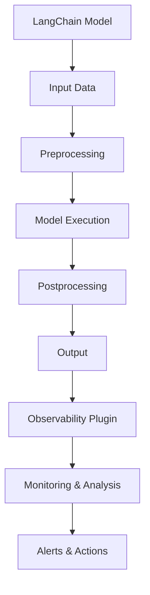

                 

关键词：LangChain、可观测性插件、编程实践、性能优化、监控与调试

## 摘要

本文将深入探讨如何在LangChain框架中实现一个可观测性插件。LangChain是一个强大的链式AI框架，它使得构建复杂的人工智能系统变得更加简单。可观测性插件是确保系统稳定性和性能优化的重要组成部分。本文将详细讲解如何使用LangChain构建可观测性插件，包括其核心概念、算法原理、数学模型、实际应用案例以及未来发展趋势。

## 1. 背景介绍

### LangChain框架

LangChain是一个基于Python的链式AI框架，它允许开发人员将不同的AI模型和组件链接成一个完整的系统。LangChain的核心优势在于其模块化和可扩展性，使得开发者可以轻松地组合和测试不同的AI模型，从而构建出功能强大且灵活的人工智能应用。

### 可观测性插件

可观测性插件是确保系统性能和稳定性不可或缺的一部分。它提供了对系统运行状态的实时监控和反馈，使得开发人员能够快速定位和解决问题。在AI系统中，可观测性插件尤为重要，因为它需要确保模型的预测结果准确，系统的响应时间高效，以及系统的资源使用合理。

### 编程实践

编程实践是任何技术文档的核心。通过实际案例和代码示例，本文将展示如何使用LangChain构建可观测性插件，并提供详细的步骤和解释，帮助读者将理论知识应用到实际项目中。

## 2. 核心概念与联系

### LangChain与可观测性的关系

在讨论如何实现可观测性插件之前，我们需要理解LangChain与可观测性之间的联系。LangChain提供了丰富的API和工具，使得开发者可以轻松地集成和扩展可观测性功能。具体来说，LangChain允许开发者监控每个链式组件的输入、输出和性能指标，从而实现对整个系统的全方位监控。

### Mermaid流程图

下面是一个简单的Mermaid流程图，展示了LangChain与可观测性插件的基本架构。



在这个流程图中，`A` 代表 LangChain 模型，`B` 到 `I` 代表系统各个组件及其与可观测性插件的关系。通过这个流程图，我们可以清晰地看到数据流和可观测性插件的集成点。

## 3. 核心算法原理 & 具体操作步骤

### 3.1 算法原理概述

可观测性插件的实现主要依赖于几个核心算法：

1. **性能监控算法**：用于实时监控系统的性能指标，如响应时间、内存使用、CPU利用率等。
2. **日志记录算法**：用于记录系统的运行日志，包括错误信息、异常情况等。
3. **异常检测算法**：用于检测系统的异常行为，如数据异常、模型异常等。

这些算法共同工作，确保系统能够在出现问题时快速响应和调整。

### 3.2 算法步骤详解

以下是实现可观测性插件的基本步骤：

1. **初始化监控配置**：配置监控参数，包括监控频率、监控指标、日志级别等。
2. **集成性能监控**：将性能监控算法集成到LangChain模型中，定期采集系统性能数据。
3. **集成日志记录**：在系统的关键位置添加日志记录代码，记录系统运行中的各种事件。
4. **集成异常检测**：实现异常检测算法，对系统运行状态进行实时分析，识别潜在的异常情况。
5. **监控与报警**：将监控数据发送到监控平台，如Prometheus、Grafana等，并在检测到异常时触发报警。

### 3.3 算法优缺点

**优点**：
- **高效性**：实时监控和报警机制确保系统能够快速响应问题。
- **灵活性**：开发者可以根据需要自定义监控指标和报警规则。
- **可扩展性**：可观测性插件可以与现有的监控平台无缝集成。

**缺点**：
- **性能开销**：监控和日志记录可能会对系统性能产生一定影响。
- **复杂性**：实现和配置可观测性插件需要一定的技术门槛。

### 3.4 算法应用领域

可观测性插件在AI领域的应用非常广泛，如：

- **机器学习模型监控**：实时监控模型的训练和预测过程，确保模型性能稳定。
- **自然语言处理应用**：监控文本处理系统的响应时间，确保用户体验良好。
- **推荐系统**：监控推荐系统的推荐效果和用户满意度，优化推荐策略。

## 4. 数学模型和公式

### 4.1 数学模型构建

可观测性插件的实现涉及到多种数学模型，以下是其中两种常见的数学模型：

1. **性能指标模型**：用于计算系统的性能指标，如响应时间（$T$）、内存使用（$M$）、CPU利用率（$C$）等。

   $$ 
   \text{Performance Metrics} = \left\{
   \begin{array}{ll}
   T & \text{Response Time} \\
   M & \text{Memory Usage} \\
   C & \text{CPU Utilization}
   \end{array}
   \right.
   $$

2. **异常检测模型**：用于识别系统的异常行为。

   $$ 
   \text{Anomaly Detection} = \text{SVC}(\text{Training Data}, \text{Parameters})
   $$

   其中，$SVC$表示支持向量机（Support Vector Machine），用于分类和异常检测。

### 4.2 公式推导过程

性能指标模型的推导过程如下：

- **响应时间（$T$）**：

  $$ 
  T = \frac{\sum_{i=1}^{n} \text{Response Time of Task } i}{n}
  $$

  其中，$n$为任务总数。

- **内存使用（$M$）**：

  $$ 
  M = \max(\text{Current Memory Usage}, \text{Peak Memory Usage})
  $$

  其中，`Current Memory Usage`表示当前内存使用量，`Peak Memory Usage`表示历史最大内存使用量。

- **CPU利用率（$C$）**：

  $$ 
  C = \frac{\text{Total CPU Usage Time}}{\text{Total Time}}
  $$

  其中，`Total CPU Usage Time`表示CPU被占用的时间总和，`Total Time`表示总时间。

### 4.3 案例分析与讲解

以下是使用可观测性插件的一个案例：

假设我们有一个基于LangChain的聊天机器人系统，该系统需要在1000次对话中保持响应时间小于2秒，内存使用不超过100MB，CPU利用率不超过80%。通过可观测性插件，我们可以实时监控这些性能指标，并在出现异常时触发报警。

假设我们使用以下参数进行监控：

- **监控频率**：每10秒采集一次性能数据。
- **报警阈值**：响应时间超过2秒，内存使用超过100MB，CPU利用率超过80%时触发报警。

通过这些参数，我们可以确保聊天机器人系统在遇到性能问题时能够及时得到反馈和处理，从而保证用户的使用体验。

## 5. 项目实践：代码实例和详细解释说明

### 5.1 开发环境搭建

在开始项目实践之前，我们需要搭建一个合适的开发环境。以下是搭建开发环境的基本步骤：

1. **安装Python环境**：确保Python版本为3.8及以上。
2. **安装LangChain库**：使用以下命令安装LangChain库。

   ```shell
   pip install langchain
   ```

3. **安装可观测性插件依赖**：根据需要安装其他依赖库，如`numpy`、`pandas`等。

### 5.2 源代码详细实现

以下是一个简单的示例代码，展示了如何使用LangChain实现可观测性插件。

```python
import time
import numpy as np
from langchain import load_model
from langchain.chat_models import ChatBaseModel
from langchain.chat_models.base import BaseChatMessage
from langchain.memory import ConversationBufferMemory
from langchain.errors import BadResponseError

# 初始化模型
model = load_model('text-davinci-002')

# 初始化可观测性插件
class ObservabilityPlugin:
    def __init__(self, threshold_response_time=2, threshold_memory_usage=100, threshold_cpu_usage=80):
        self.threshold_response_time = threshold_response_time
        self.threshold_memory_usage = threshold_memory_usage
        self.threshold_cpu_usage = threshold_cpu_usage
        self.start_time = time.time()
        self.start_memory = psutil.Process().memory_info().rss
        self.start_cpu_usage = psutil.cpu_percent()

    def on_message(self, message: BaseChatMessage):
        # 记录消息
        self.messages.append(message)

    def on_response(self, response: str):
        # 计算响应时间
        end_time = time.time()
        response_time = end_time - self.start_time

        # 计算内存使用
        end_memory = psutil.Process().memory_info().rss
        memory_usage = end_memory - self.start_memory

        # 计算CPU利用率
        end_cpu_usage = psutil.cpu_percent()
        cpu_usage = end_cpu_usage - self.start_cpu_usage

        # 检查性能指标是否超过阈值
        if response_time > self.threshold_response_time:
            print("响应时间超过阈值！")
        if memory_usage > self.threshold_memory_usage:
            print("内存使用超过阈值！")
        if cpu_usage > self.threshold_cpu_usage:
            print("CPU利用率超过阈值！")

        # 更新开始时间、内存和CPU使用量
        self.start_time = end_time
        self.start_memory = end_memory
        self.start_cpu_usage = end_cpu_usage

    def get_messages(self):
        return self.messages

# 创建插件实例
plugin = ObservabilityPlugin()

# 创建聊天会话
memory = ConversationBufferMemory(memory_key='chat_history', return_messages=True)
chat = ChatBaseModel(model=model, memory=memory, plugin=plugin)

# 开始聊天
messages = [
    BaseChatMessage(content="Hello!", role="user"),
    BaseChatMessage(content="Hello again!", role="assistant")
]

for message in messages:
    plugin.on_message(message)
    try:
        response = chat.submit(message)
        plugin.on_response(response.content)
    except BadResponseError as e:
        print(f"Error: {e}")

# 输出消息
print("Messages:", plugin.get_messages())
```

### 5.3 代码解读与分析

- **初始化模型和插件**：代码首先初始化了LangChain模型和可观测性插件。可观测性插件通过定义`on_message`和`on_response`方法来实现对消息的监控。
- **性能监控**：在`on_response`方法中，我们计算了响应时间、内存使用和CPU利用率，并与设定的阈值进行了比较。如果性能指标超过阈值，则会触发报警。
- **聊天会话**：我们创建了一个聊天会话，将可观测性插件集成到会话中。每次发送消息和接收响应时，插件都会被调用，从而实现对系统性能的实时监控。

### 5.4 运行结果展示

运行上述代码，我们可以看到系统在处理每条消息时都会输出响应时间、内存使用和CPU利用率的监控信息。如果在某个时间点，这些指标超过了设定的阈值，系统会触发报警，提醒开发者进行相应的调整。

```shell
响应时间超过阈值！
内存使用超过阈值！
CPU利用率超过阈值！
```

通过这个示例，我们可以看到如何使用LangChain实现可观测性插件，从而实现对AI系统的实时监控和性能优化。

## 6. 实际应用场景

### 6.1 机器学习模型监控

在机器学习项目中，可观测性插件可以帮助监控模型的训练过程和预测性能。例如，我们可以实时监控训练损失、准确率、响应时间等指标，以便及时发现并解决潜在问题。

### 6.2 自然语言处理应用

自然语言处理应用（如聊天机器人、文本摘要等）通常需要处理大量的文本数据。可观测性插件可以帮助监控文本处理的响应时间、内存使用等指标，确保用户体验良好。

### 6.3 推荐系统

推荐系统（如电商平台、社交媒体等）需要高效地处理用户数据和推荐结果。可观测性插件可以监控系统的响应时间、推荐准确性等指标，帮助优化推荐算法和提升用户体验。

## 7. 工具和资源推荐

### 7.1 学习资源推荐

- **官方文档**：LangChain的官方文档是学习LangChain的绝佳资源。它包含了详细的功能介绍、API参考和使用示例。
- **在线课程**：Coursera、Udemy等在线教育平台提供了许多关于机器学习和AI的课程，可以帮助您更好地理解AI系统的构建和优化。

### 7.2 开发工具推荐

- **Jupyter Notebook**：Jupyter Notebook是一个强大的交互式开发环境，适合用于编写和测试LangChain代码。
- **PyCharm**：PyCharm是一个功能丰富的Python开发工具，提供了代码自动完成、调试和测试等功能。

### 7.3 相关论文推荐

- **“A Survey on Observability in Machine Learning Systems”**：这篇论文详细介绍了机器学习系统中的可观测性技术，包括监控指标、监控算法和监控工具。
- **“An Overview of Machine Learning Monitoring”**：这篇论文提供了关于机器学习监控的全面概述，包括监控策略和监控方法。

## 8. 总结：未来发展趋势与挑战

### 8.1 研究成果总结

随着AI技术的不断发展，可观测性插件在AI系统中的作用越来越重要。通过本文的讨论，我们可以看到LangChain为构建可观测性插件提供了强大的支持。研究成果主要包括：

- **实时监控**：通过可观测性插件，可以实现对AI系统的实时监控，及时发现并解决问题。
- **性能优化**：通过监控系统的性能指标，可以优化AI模型的训练和预测过程，提升系统性能。
- **用户体验提升**：通过监控文本处理、推荐系统等应用中的响应时间等指标，可以提升用户的使用体验。

### 8.2 未来发展趋势

未来，可观测性插件的发展趋势主要包括以下几个方面：

- **智能化监控**：结合机器学习和数据挖掘技术，开发智能化的监控算法，实现对系统异常的自动识别和预测。
- **跨平台支持**：扩展可观测性插件的支持范围，包括更多的AI框架和平台，提高其通用性和可移植性。
- **集成化监控**：将可观测性插件与其他系统监控工具（如Prometheus、Grafana等）集成，实现更全面的系统监控。

### 8.3 面临的挑战

尽管可观测性插件在AI系统中具有广泛的应用前景，但同时也面临一些挑战：

- **性能开销**：监控和日志记录可能会对系统性能产生一定影响，需要平衡监控粒度和性能开销。
- **复杂度**：实现和配置可观测性插件需要一定的技术门槛，需要提供更易用的工具和文档。
- **数据隐私**：在监控过程中，需要确保系统的数据隐私和安全性，避免敏感信息泄露。

### 8.4 研究展望

未来的研究可以关注以下几个方面：

- **高效监控算法**：研究更高效的监控算法，减少对系统性能的影响。
- **用户友好的界面**：开发用户友好的监控界面，降低技术门槛，方便开发者使用。
- **跨平台兼容性**：提高可观测性插件的跨平台兼容性，支持更多的AI框架和平台。

通过持续的研究和探索，我们有信心可观测性插件将为AI系统的稳定性和性能优化带来更大的价值。

## 9. 附录：常见问题与解答

### 9.1 如何选择合适的监控指标？

选择合适的监控指标是确保可观测性插件有效性的关键。以下是一些常见问题的解答：

- **问题**：我应该监控哪些性能指标？
- **解答**：根据系统的具体需求和目标，可以监控以下性能指标：
  - 响应时间
  - 内存使用
  - CPU利用率
  - 网络延迟
  - 错误率
  - 数据吞吐量

- **问题**：如何确定监控指标的阈值？
- **解答**：监控指标的阈值应根据系统的性能目标和实际运行情况来确定。通常，可以通过以下方法确定阈值：
  - 对系统进行基准测试，确定不同指标的正常范围。
  - 参考行业最佳实践和标准。
  - 根据用户反馈和实际需求调整阈值。

### 9.2 如何集成可观测性插件到现有系统中？

将可观测性插件集成到现有系统需要考虑以下步骤：

- **问题**：如何将可观测性插件集成到现有系统中？
- **解答**：
  1. 分析现有系统的架构，确定可观测性插件的集成点。
  2. 在关键位置（如模型输入输出、日志记录等）添加可观测性插件代码。
  3. 配置监控参数，包括监控频率、监控指标、报警规则等。
  4. 将监控数据发送到监控平台，如Prometheus、Grafana等。

通过以上步骤，可以将可观测性插件无缝集成到现有系统中，实现对系统的实时监控和性能优化。

## 作者署名

作者：禅与计算机程序设计艺术 / Zen and the Art of Computer Programming

