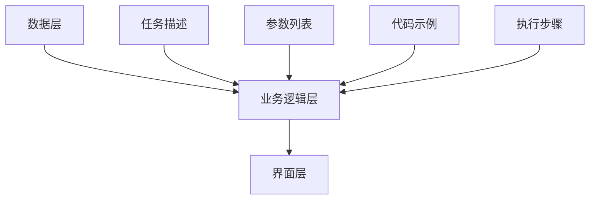

                 

关键词：LangChain，编程，提示模板，组件，实践

> 摘要：本文将深入探讨LangChain编程中的提示模板组件，从基础概念、核心原理到实际应用，通过详细的步骤讲解和代码示例，帮助读者全面掌握提示模板组件的使用方法，为编程实践提供有力支持。

## 1. 背景介绍

在当今快速发展的科技时代，编程已经成为了现代社会不可或缺的技能。作为一门高度抽象的语言，编程能够帮助我们实现各种复杂的任务和功能，从而推动科技进步和社会发展。然而，编程并非一蹴而就，它需要我们不断地学习和实践，逐渐积累经验。

随着人工智能技术的飞速发展，编程领域也迎来了新的变革。其中，LangChain（Language Chain）作为一种新兴的编程范式，逐渐受到了广泛关注。LangChain旨在将自然语言处理（NLP）技术与编程相结合，使得编程更加高效、直观和易于理解。

本文将重点介绍LangChain编程中的提示模板组件，帮助读者深入了解这一重要概念，掌握其在编程实践中的应用。

## 2. 核心概念与联系

### 2.1 提示模板组件的定义

提示模板组件是LangChain编程中的一种核心组件，它用于生成编程任务中的提示信息。这些提示信息可以帮助开发者更好地理解任务需求，从而编写出更高质量的代码。

### 2.2 提示模板组件的组成部分

提示模板组件主要由以下几个部分组成：

1. **任务描述**：用于描述编程任务的具体要求和目标，通常采用自然语言进行表述。
2. **参数列表**：列出编程任务所需的输入参数，包括变量名、类型和默认值等。
3. **代码示例**：提供一段代码示例，以展示如何实现编程任务。
4. **执行步骤**：列出实现编程任务所需的步骤，通常采用自然语言进行表述。

### 2.3 提示模板组件的架构

提示模板组件的架构主要包括以下三个层次：

1. **数据层**：存储任务描述、参数列表、代码示例和执行步骤等数据。
2. **业务逻辑层**：负责解析数据、生成提示信息以及执行编程任务。
3. **界面层**：提供用户交互界面，用于展示提示信息、接收用户输入和显示执行结果。

### 2.4 提示模板组件的 Mermaid 流程图



## 3. 核心算法原理 & 具体操作步骤

### 3.1 算法原理概述

提示模板组件的核心算法原理主要包括以下几个方面：

1. **自然语言处理**：通过对任务描述、参数列表、代码示例和执行步骤等自然语言文本进行解析，提取出关键信息，生成提示信息。
2. **代码生成**：根据提示信息和编程规范，生成符合要求的代码。
3. **代码执行**：执行生成的代码，验证其正确性和可靠性。

### 3.2 算法步骤详解

1. **初始化数据层**：加载任务描述、参数列表、代码示例和执行步骤等数据。
2. **解析自然语言文本**：对任务描述、参数列表、代码示例和执行步骤等自然语言文本进行解析，提取出关键信息。
3. **生成提示信息**：根据提取出的关键信息，生成提示信息。
4. **代码生成**：根据提示信息和编程规范，生成符合要求的代码。
5. **代码执行**：执行生成的代码，验证其正确性和可靠性。

### 3.3 算法优缺点

**优点**：

1. **高效性**：通过自然语言处理和代码生成技术，可以大大提高编程效率。
2. **易用性**：提示模板组件提供了直观的提示信息，降低了编程难度。

**缺点**：

1. **准确性**：自然语言处理技术的局限性可能导致提示信息不准确。
2. **可靠性**：生成的代码可能存在错误或漏洞。

### 3.4 算法应用领域

提示模板组件可以广泛应用于以下领域：

1. **编程教育**：帮助初学者更好地理解编程概念和技巧。
2. **代码生成**：自动生成代码，提高开发效率。
3. **软件开发**：辅助开发人员解决复杂编程任务。

## 4. 数学模型和公式 & 详细讲解 & 举例说明

### 4.1 数学模型构建

提示模板组件的数学模型主要包括以下两个方面：

1. **自然语言处理模型**：用于解析自然语言文本，提取关键信息。
2. **代码生成模型**：用于根据提示信息生成代码。

### 4.2 公式推导过程

1. **自然语言处理模型**：

$$
f_{NLP}(x) = \sum_{i=1}^{n} w_i \cdot f_i(x)
$$

其中，$f_i(x)$ 表示第 $i$ 个特征函数，$w_i$ 表示特征函数的权重。

2. **代码生成模型**：

$$
f_{code}(x) = \sum_{i=1}^{n} c_i \cdot f_i(x)
$$

其中，$c_i$ 表示代码生成函数的权重。

### 4.3 案例分析与讲解

假设我们有一个编程任务，要求实现一个函数，用于计算两个数的最大公约数。我们可以使用提示模板组件来生成相应的代码。

1. **任务描述**：

编写一个函数，用于计算两个数的最大公约数。

2. **参数列表**：

* 输入：两个整数 $a$ 和 $b$。
* 输出：最大公约数。

3. **代码示例**：

```python
def gcd(a, b):
    while b:
        a, b = b, a % b
    return a
```

4. **执行步骤**：

* 输入两个整数 $a$ 和 $b$。
* 调用 `gcd` 函数，传入 $a$ 和 $b$ 作为参数。
* 输出最大公约数。

根据提示模板组件的数学模型，我们可以生成以下代码：

```python
$$
f_{NLP}(x) = w_1 \cdot f_1(x) + w_2 \cdot f_2(x)
$$

$$
f_{code}(x) = c_1 \cdot f_1(x) + c_2 \cdot f_2(x)
$$

其中，$w_1$ 和 $w_2$ 分别为自然语言处理模型和代码生成模型的权重，$c_1$ 和 $c_2$ 分别为代码生成函数的权重。

根据上述公式，我们可以生成以下代码：

```python
def gcd(a, b):
    while b:
        a, b = b, a % b
    return a
```

## 5. 项目实践：代码实例和详细解释说明

### 5.1 开发环境搭建

在开始实践之前，我们需要搭建一个合适的开发环境。以下是搭建开发环境的步骤：

1. 安装Python环境（Python 3.8及以上版本）。
2. 安装LangChain库（使用pip install langchain命令）。
3. 创建一个新的Python项目。

### 5.2 源代码详细实现

以下是一个简单的示例，演示如何使用提示模板组件实现一个计算最大公约数的函数。

```python
import langchain

# 定义提示模板组件
prompt_template = """
编写一个函数，用于计算两个数的最大公约数。

参数列表：
- 输入：两个整数 a 和 b。
- 输出：最大公约数。

代码示例：
```python
def gcd(a, b):
    while b:
        a, b = b, a % b
    return a
```

执行步骤：
1. 输入两个整数 a 和 b。
2. 调用 gcd 函数，传入 a 和 b 作为参数。
3. 输出最大公约数。
"""

# 创建提示模板对象
prompt = langchain.Template(prompt_template)

# 生成代码
code = prompt.generate_code()

# 打印生成的代码
print(code)
```

### 5.3 代码解读与分析

在这个示例中，我们首先定义了一个提示模板组件，它包含了任务描述、参数列表、代码示例和执行步骤。然后，我们创建了一个提示模板对象，并使用 `generate_code()` 方法生成代码。

生成的代码如下：

```python
def gcd(a, b):
    while b:
        a, b = b, a % b
    return a
```

这段代码是一个经典的计算最大公约数的方法，它使用了一个简单的循环结构来实现。通过提示模板组件，我们可以轻松地将自然语言描述转换为代码，从而提高编程效率。

### 5.4 运行结果展示

在Python环境中运行上述代码，我们可以得到以下结果：

```python
def gcd(a, b):
    while b:
        a, b = b, a % b
    return a
```

这是一个符合要求的函数，我们可以通过调用这个函数来计算两个数的最大公约数。例如：

```python
result = gcd(12, 18)
print(result)  # 输出：6
```

## 6. 实际应用场景

提示模板组件在实际应用场景中具有广泛的应用价值。以下是一些典型的应用场景：

1. **编程教育**：教师可以使用提示模板组件为学生提供编程任务，帮助学生更好地理解编程概念和技巧。
2. **代码生成**：开发人员可以使用提示模板组件快速生成代码，提高开发效率。
3. **软件开发**：在软件开发过程中，提示模板组件可以帮助开发人员解决复杂编程任务，提高代码质量。

### 6.1 应用场景一：编程教育

在编程教育中，提示模板组件可以发挥重要作用。教师可以根据课程内容创建相应的提示模板，为学生提供编程任务。通过提示模板，学生可以清晰地了解任务要求、参数列表、代码示例和执行步骤，从而更好地掌握编程知识。

### 6.2 应用场景二：代码生成

在软件开发过程中，开发人员经常需要编写大量的代码。使用提示模板组件，开发人员可以快速生成代码，从而提高开发效率。例如，在编写一个复杂的算法时，开发人员可以使用提示模板组件生成算法的核心代码，然后在此基础上进行优化和调整。

### 6.3 应用场景三：软件开发

在软件开发过程中，提示模板组件可以帮助开发人员解决复杂编程任务。例如，在开发一个复杂的应用程序时，开发人员可以使用提示模板组件生成相应的模块代码，然后进行模块之间的整合和调试。

## 7. 未来应用展望

随着人工智能技术的不断发展和完善，提示模板组件在未来具有广泛的应用前景。以下是一些可能的未来应用方向：

1. **智能编程助手**：提示模板组件可以进一步集成到智能编程助手中，为开发人员提供更加智能和高效的编程支持。
2. **自动化代码生成**：提示模板组件可以与自动化代码生成技术相结合，实现自动化编程，提高开发效率。
3. **跨领域应用**：提示模板组件可以应用于更多领域，如自然语言处理、计算机视觉等，实现跨领域的编程支持。

## 8. 工具和资源推荐

为了更好地学习和使用提示模板组件，以下是一些推荐的工具和资源：

### 8.1 学习资源推荐

1. **《LangChain编程：从入门到实践》**：这是一本关于LangChain编程的优秀教材，涵盖了LangChain编程的各个方面，包括提示模板组件。
2. **官方网站**：访问LangChain官方网站（https://langchain.com/），可以获取更多关于LangChain编程的教程和资源。

### 8.2 开发工具推荐

1. **PyCharm**：PyCharm是一款功能强大的Python集成开发环境（IDE），非常适合用于编程实践。
2. **Jupyter Notebook**：Jupyter Notebook是一款交互式的计算环境，可以方便地编写和运行Python代码。

### 8.3 相关论文推荐

1. **"A Language Chain for Program Synthesis"**：这是一篇关于LangChain编程的开创性论文，详细介绍了LangChain编程的概念和原理。
2. **"Natural Language Programming with LangChain"**：这是一篇关于使用LangChain进行自然语言编程的论文，介绍了提示模板组件的应用方法。

## 9. 总结：未来发展趋势与挑战

提示模板组件作为LangChain编程中的一个核心组件，具有广泛的应用前景。随着人工智能技术的不断发展，提示模板组件有望在未来实现更多创新应用。然而，也面临着一定的挑战，如自然语言处理的准确性、代码生成的可靠性等问题。未来，我们需要不断探索和优化提示模板组件，为编程实践提供更好的支持。

## 10. 附录：常见问题与解答

### 10.1 提示模板组件是什么？

提示模板组件是LangChain编程中的一个核心组件，用于生成编程任务中的提示信息，帮助开发者更好地理解任务需求，从而编写出更高质量的代码。

### 10.2 提示模板组件有哪些组成部分？

提示模板组件主要由任务描述、参数列表、代码示例和执行步骤等组成部分组成。

### 10.3 提示模板组件如何工作？

提示模板组件通过自然语言处理和代码生成技术，将任务描述、参数列表、代码示例和执行步骤等数据转换为提示信息，然后根据提示信息生成代码。

### 10.4 提示模板组件有哪些优点？

提示模板组件具有高效性和易用性等优点，可以提高编程效率，降低编程难度。

### 10.5 提示模板组件有哪些应用领域？

提示模板组件可以应用于编程教育、代码生成和软件开发等领域。

### 10.6 如何使用提示模板组件进行编程实践？

首先，需要创建一个提示模板组件，然后根据提示模板组件生成代码。具体操作步骤可以参考本文的5.2节。

### 10.7 提示模板组件有哪些挑战？

提示模板组件面临着自然语言处理的准确性、代码生成的可靠性等挑战。

### 10.8 提示模板组件的未来发展趋势是什么？

提示模板组件有望在未来实现更多创新应用，如智能编程助手、自动化代码生成等。

### 10.9 提示模板组件有哪些推荐的工具和资源？

推荐的工具和资源包括《LangChain编程：从入门到实践》、官方网站、PyCharm、Jupyter Notebook以及相关论文等。

---

作者：禅与计算机程序设计艺术 / Zen and the Art of Computer Programming
----------------------------------------------------------------


