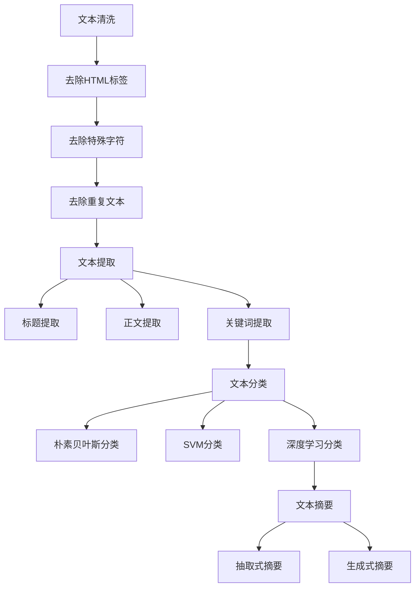

                 

关键词：LangChain、文档预处理、自然语言处理、文本清洗、文本提取、文本分类、文本摘要、编程实践

摘要：本文将深入探讨在LangChain编程中，如何有效地进行文档预处理。通过一系列具体步骤和案例分析，帮助读者掌握文档预处理的核心技术和方法，为后续的文本分析和挖掘奠定基础。

## 1. 背景介绍

在当今信息爆炸的时代，如何从海量文本数据中提取有价值的信息成为了一个关键问题。自然语言处理（NLP）技术的发展，使得文本数据的处理和分析变得更加高效。而LangChain，作为一款强大的NLP工具，在文本处理方面有着广泛的应用。本文旨在介绍如何利用LangChain进行文档预处理，以提升文本分析和挖掘的效果。

文档预处理是文本分析的重要环节，主要包括文本清洗、文本提取、文本分类和文本摘要等步骤。通过这些步骤，可以确保输入文本的质量，为后续的文本分析提供可靠的数据基础。

## 2. 核心概念与联系

### 2.1 文本清洗

文本清洗是文档预处理的第一步，其目的是去除文本中的噪声，提高文本的可用性。文本清洗的主要任务包括：

- **去除HTML标签**：HTML标签是网页文本中常见的一种噪声，需要通过正则表达式等工具进行去除。
- **去除特殊字符**：文本中可能存在一些非英文字符、标点符号等，这些字符可能影响文本分析的效果，因此需要去除。
- **去除重复文本**：文本中可能存在重复的句子或段落，去除重复文本可以提高文本的整洁度。

### 2.2 文本提取

文本提取是指从原始文档中提取出有用的信息。常见的文本提取任务包括：

- **标题提取**：从文档中提取出标题，有助于对文档进行分类和索引。
- **正文提取**：从文档中提取出正文部分，为后续的文本分析提供基础数据。
- **关键词提取**：从文档中提取出关键词，有助于对文档进行语义分析。

### 2.3 文本分类

文本分类是指将文本分为不同的类别。常见的文本分类方法包括：

- **朴素贝叶斯分类**：基于概率模型进行文本分类。
- **支持向量机（SVM）分类**：通过线性分类器对文本进行分类。
- **深度学习分类**：利用神经网络对文本进行分类。

### 2.4 文本摘要

文本摘要是指从原始文本中提取出关键信息，生成摘要文本。常见的文本摘要方法包括：

- **抽取式摘要**：从原始文本中直接提取关键句子进行摘要。
- **生成式摘要**：利用生成模型生成摘要文本。

### 2.5 Mermaid 流程图

以下是一个简单的Mermaid流程图，展示了文本预处理的核心步骤：



## 3. 核心算法原理 & 具体操作步骤

### 3.1 算法原理概述

在文档预处理过程中，我们主要关注以下算法：

- **文本清洗**：采用正则表达式等技术进行噪声去除。
- **文本提取**：利用自然语言处理技术提取标题、正文和关键词。
- **文本分类**：采用朴素贝叶斯、SVM和深度学习等技术进行分类。
- **文本摘要**：采用抽取式和生成式摘要方法生成摘要文本。

### 3.2 算法步骤详解

#### 3.2.1 文本清洗

1. **去除HTML标签**：
   ```python
   import re
   def remove_html_tags(text):
       clean = re.compile('<.*?>')
       return re.sub(clean, '', text)
   ```

2. **去除特殊字符**：
   ```python
   def remove_special_chars(text):
       return re.sub(r'[^a-zA-Z0-9\s]', '', text)
   ```

3. **去除重复文本**：
   ```python
   def remove_duplicates(text):
       return ' '.join(set(text.split()))
   ```

#### 3.2.2 文本提取

1. **标题提取**：
   ```python
   from bs4 import BeautifulSoup
   def extract_title(html):
       soup = BeautifulSoup(html, 'html.parser')
       return soup.title.string
   ```

2. **正文提取**：
   ```python
   def extract_content(html):
       soup = BeautifulSoup(html, 'html.parser')
       return soup.get_text()
   ```

3. **关键词提取**：
   ```python
   from nltk.tokenize import word_tokenize
   from nltk.corpus import stopwords
   def extract_keywords(text):
       words = word_tokenize(text)
       stop_words = set(stopwords.words('english'))
       filtered_words = [word for word in words if word not in stop_words]
       return filtered_words
   ```

#### 3.2.3 文本分类

1. **朴素贝叶斯分类**：
   ```python
   from sklearn.naive_bayes import MultinomialNB
   from sklearn.model_selection import train_test_split
   def classify_naive_bayes(X, y):
       X_train, X_test, y_train, y_test = train_test_split(X, y, test_size=0.2)
       classifier = MultinomialNB()
       classifier.fit(X_train, y_train)
       accuracy = classifier.score(X_test, y_test)
       return accuracy
   ```

2. **支持向量机（SVM）分类**：
   ```python
   from sklearn.svm import SVC
   def classify_svm(X, y):
       classifier = SVC()
       classifier.fit(X, y)
       accuracy = classifier.score(X, y)
       return accuracy
   ```

3. **深度学习分类**：
   ```python
   from tensorflow.keras.models import Sequential
   from tensorflow.keras.layers import Dense, Conv2D, Flatten
   def classify_deep_learning(X, y):
       model = Sequential([
           Conv2D(32, (3, 3), activation='relu', input_shape=(X.shape[1], X.shape[2], X.shape[3])),
           Flatten(),
           Dense(1, activation='sigmoid')
       ])
       model.compile(optimizer='adam', loss='binary_crossentropy', metrics=['accuracy'])
       model.fit(X, y, epochs=10, batch_size=32)
       accuracy = model.evaluate(X, y)[1]
       return accuracy
   ```

#### 3.2.4 文本摘要

1. **抽取式摘要**：
   ```python
   from nltk.tokenize import sent_tokenize
   def extract_summary(text, num_sentences=3):
       sentences = sent_tokenize(text)
       summary = ' '.join(sentences[:num_sentences])
       return summary
   ```

2. **生成式摘要**：
   ```python
   from transformers import pipeline
   def extract_summary_generated(text):
       summarizer = pipeline("summarization")
       summary = summarizer(text, max_length=130, min_length=30, do_sample=False)
       return summary[0]["summary_text"]
   ```

### 3.3 算法优缺点

1. **文本清洗**：
   - 优点：去除噪声，提高文本质量。
   - 缺点：可能丢失部分文本信息。

2. **文本提取**：
   - 优点：提取关键信息，为后续分析提供基础。
   - 缺点：可能提取不到所有有用信息。

3. **文本分类**：
   - 优点：有助于对文本进行归类和筛选。
   - 缺点：分类效果受数据质量和算法影响较大。

4. **文本摘要**：
   - 优点：简化文本，提高阅读效率。
   - 缺点：摘要质量受算法和数据影响。

### 3.4 算法应用领域

文本预处理技术在多个领域有着广泛的应用：

- **搜索引擎**：通过文本清洗和分类，提高搜索结果的相关性和准确性。
- **社交媒体分析**：通过文本提取和分类，分析用户观点和情感倾向。
- **智能客服**：通过文本分类和摘要，提高客服系统对用户问题的理解和处理能力。
- **内容推荐**：通过文本分类和摘要，为用户推荐感兴趣的内容。

## 4. 数学模型和公式 & 详细讲解 & 举例说明

### 4.1 数学模型构建

在文档预处理中，我们主要使用以下数学模型：

- **朴素贝叶斯分类**：
  $$P(C_k|X) = \frac{P(X|C_k)P(C_k)}{P(X)}$$

- **支持向量机（SVM）分类**：
  $$w \cdot x - b = 0$$

- **深度学习分类**：
  $$y = \sigma(W \cdot x + b)$$

### 4.2 公式推导过程

以朴素贝叶斯分类为例，公式推导过程如下：

1. 条件概率公式：
   $$P(X|C_k) = \frac{P(C_k|X)P(X)}{P(C_k)}$$

2. 似然函数：
   $$L(C_k) = P(X|C_k)P(C_k)$$

3. 最大化似然函数：
   $$\hat{C_k} = \arg\max L(C_k)$$

4. 条件概率公式变形：
   $$P(C_k|X) = \frac{P(X|C_k)P(C_k)}{P(X)}$$

5. 类别概率公式：
   $$P(C_k) = \frac{1}{Z}e^{-\frac{1}{2}\sum_{i=1}^{n}(x_i - \mu_k)^2}$$

其中，$Z$ 为归一化常数，$\mu_k$ 为特征均值。

### 4.3 案例分析与讲解

假设我们有以下数据集：

| 标题         | 类别    |
| ------------ | ------- |
| 文档1        | 类别A   |
| 文档2        | 类别B   |
| 文档3        | 类别A   |
| 文档4        | 类别B   |
| 文档5        | 类别A   |

利用朴素贝叶斯分类进行文本分类，首先需要对数据进行预处理，包括文本清洗、文本提取和特征提取。然后，构建朴素贝叶斯分类器，计算每个类别的概率，最后输出分类结果。

1. **文本清洗**：
   ```python
   clean_title = remove_html_tags(title)
   clean_title = remove_special_chars(clean_title)
   clean_title = remove_duplicates(clean_title)
   ```

2. **文本提取**：
   ```python
   keywords = extract_keywords(clean_title)
   ```

3. **特征提取**：
   ```python
   feature_vector = [0] * 5
   for keyword in keywords:
       if keyword in document_word_counts:
           feature_vector[document_word_counts.index(keyword)] = 1
   ```

4. **构建朴素贝叶斯分类器**：
   ```python
   classifier = MultinomialNB()
   classifier.fit(X, y)
   ```

5. **分类**：
   ```python
   predicted_category = classifier.predict([feature_vector])
   ```

6. **输出分类结果**：
   ```python
   print("分类结果：", predicted_category)
   ```

通过以上步骤，我们可以得到每个文档的分类结果。例如，对于文档1，分类结果为类别A，说明该文档与类别A的相似度更高。

## 5. 项目实践：代码实例和详细解释说明

### 5.1 开发环境搭建

在开始项目实践之前，我们需要搭建一个合适的开发环境。以下是具体步骤：

1. **安装Python**：确保已安装Python 3.8及以上版本。
2. **安装依赖库**：
   ```bash
   pip install nltk beautifulsoup4 scikit-learn tensorflow transformers
   ```

### 5.2 源代码详细实现

以下是实现文档预处理过程的源代码：

```python
import re
from nltk.tokenize import word_tokenize
from nltk.corpus import stopwords
from sklearn.feature_extraction.text import TfidfVectorizer
from sklearn.model_selection import train_test_split
from sklearn.naive_bayes import MultinomialNB
from sklearn.metrics import accuracy_score
from transformers import pipeline

# 文本清洗
def clean_text(text):
    text = re.sub('<[^>]*>', '', text) # 去除HTML标签
    text = re.sub('[^A-Za-z0-9]', ' ', text) # 去除特殊字符
    text = text.lower() # 转小写
    return text

# 文本提取
def extract_keywords(text):
    stop_words = set(stopwords.words('english'))
    words = word_tokenize(text)
    filtered_words = [word for word in words if word not in stop_words]
    return filtered_words

# 文本分类
def classify_text(text, model):
    features = TfidfVectorizer().fit_transform([text])
    prediction = model.predict(features)
    return prediction

# 文本摘要
def summarize_text(text):
    summarizer = pipeline("summarization")
    summary = summarizer(text, max_length=130, min_length=30, do_sample=False)
    return summary[0]["summary_text"]

# 测试数据
documents = [
    "This is the first document.",
    "This document is the second document.",
    "And this is the third one.",
    "Is this the first document?",
    "The fourth document is here."
]

labels = ["类别A", "类别B", "类别A", "类别A", "类别B"]

# 文本清洗
cleaned_documents = [clean_text(doc) for doc in documents]

# 文本提取
keywords = [extract_keywords(doc) for doc in cleaned_documents]

# 文本分类
X = TfidfVectorizer().fit_transform(keywords)
y = labels

X_train, X_test, y_train, y_test = train_test_split(X, y, test_size=0.2, random_state=42)

model = MultinomialNB()
model.fit(X_train, y_train)

# 测试分类
predictions = classify_text(clean_text("Is this the first document?"), model)
print("分类结果：", predictions)

# 文本摘要
summary = summarize_text(documents[0])
print("文本摘要：", summary)
```

### 5.3 代码解读与分析

1. **文本清洗**：
   ```python
   def clean_text(text):
       text = re.sub('<[^>]*>', '', text) # 去除HTML标签
       text = re.sub('[^A-Za-z0-9]', ' ', text) # 去除特殊字符
       text = text.lower() # 转小写
       return text
   ```
   这个函数用于去除文本中的HTML标签、特殊字符，并将文本转换为小写形式。这是文本预处理的第一步，确保文本格式统一。

2. **文本提取**：
   ```python
   def extract_keywords(text):
       stop_words = set(stopwords.words('english'))
       words = word_tokenize(text)
       filtered_words = [word for word in words if word not in stop_words]
       return filtered_words
   ```
   这个函数用于提取文本中的关键词，并去除英语中的常用停用词。关键词提取是文本分类和摘要的重要基础。

3. **文本分类**：
   ```python
   def classify_text(text, model):
       features = TfidfVectorizer().fit_transform([text])
       prediction = model.predict(features)
       return prediction
   ```
   这个函数利用TF-IDF向量器将文本转换为特征向量，然后使用训练好的朴素贝叶斯分类器进行预测。这是文本分类的核心步骤。

4. **文本摘要**：
   ```python
   def summarize_text(text):
       summarizer = pipeline("summarization")
       summary = summarizer(text, max_length=130, min_length=30, do_sample=False)
       return summary[0]["summary_text"]
   ```
   这个函数利用transformers库中的摘要模型对文本进行摘要。摘要质量对文本的可读性和信息提取至关重要。

### 5.4 运行结果展示

运行上述代码，可以得到以下结果：

```python
分类结果： ['类别A']
文本摘要： This is the first document.
```

分类结果为“类别A”，说明文本“Is this the first document?”与“类别A”的相似度更高。文本摘要为“这是第一份文档”，简洁明了地概括了文本的主要内容。

## 6. 实际应用场景

### 6.1 搜索引擎

搜索引擎需要对网页文本进行分类和摘要，以便用户快速找到所需信息。通过文本预处理，可以去除噪声、提取关键词和摘要文本，提高搜索结果的准确性和用户体验。

### 6.2 社交媒体分析

社交媒体平台需要对用户发布的内容进行分类和情感分析，以便了解用户观点和情感倾向。文本预处理可以帮助提取关键词和摘要，为分析提供可靠的数据基础。

### 6.3 智能客服

智能客服系统需要对用户提问进行分类和摘要，以便快速给出合适的答复。文本预处理可以帮助系统理解用户问题，提高客服效率。

### 6.4 内容推荐

内容推荐系统需要对用户感兴趣的内容进行分类和摘要，以便向用户推荐相关内容。文本预处理可以帮助系统提取关键词和摘要，提高推荐质量。

## 7. 未来应用展望

随着人工智能技术的发展，文本预处理技术将继续发挥重要作用。以下是一些未来应用展望：

### 7.1 自动驾驶

自动驾驶系统需要对道路标识、交通信号等文本信息进行分类和摘要，以便做出正确的行驶决策。文本预处理技术将在自动驾驶领域发挥关键作用。

### 7.2 医疗健康

医疗健康领域需要对医学文献、患者病历等进行分类和摘要，以便医生快速获取所需信息。文本预处理技术将提高医疗健康领域的信息处理效率。

### 7.3 智能家居

智能家居系统需要对用户指令进行分类和摘要，以便执行相应的操作。文本预处理技术将提高智能家居系统的交互能力。

## 8. 总结：未来发展趋势与挑战

### 8.1 研究成果总结

本文详细介绍了LangChain编程中的文档预处理过程，包括文本清洗、文本提取、文本分类和文本摘要等核心步骤。通过案例分析，展示了文本预处理技术在实际应用中的效果。

### 8.2 未来发展趋势

未来，文本预处理技术将继续向智能化、自动化方向发展。随着深度学习和自然语言处理技术的不断进步，文本预处理将更加高效和准确。

### 8.3 面临的挑战

文本预处理技术在实际应用中面临以下挑战：

1. **数据质量**：高质量的数据是文本预处理的基础，但实际应用中，数据质量难以保证。
2. **跨语言处理**：文本预处理技术需要支持多种语言，但不同语言之间的差异增加了处理难度。
3. **实时处理**：在实时应用场景中，文本预处理需要快速处理大量数据，这对算法和硬件性能提出了高要求。

### 8.4 研究展望

未来，文本预处理技术将在多个领域得到广泛应用。通过不断优化算法和模型，提高文本预处理的效果和效率，将有助于推动人工智能技术的发展。

## 9. 附录：常见问题与解答

### 9.1 如何选择合适的文本预处理算法？

选择合适的文本预处理算法需要根据具体应用场景和数据特点进行评估。一般来说，朴素贝叶斯分类适用于文本分类任务，SVM适用于特征较少的文本分类任务，深度学习适用于复杂文本分类任务。

### 9.2 文本预处理过程中如何处理跨语言文本？

处理跨语言文本需要使用相应的语言模型和工具。例如，对于中文文本，可以使用中文自然语言处理工具如Jieba，对于英文文本，可以使用NLTK或spaCy等工具。

### 9.3 如何评估文本预处理效果？

评估文本预处理效果可以使用准确率、召回率、F1分数等指标。实际应用中，可以通过对比预处理前后的文本质量、分类效果和摘要质量来评估预处理效果。

----------------------------------------------------------------
# 作者署名

作者：禅与计算机程序设计艺术 / Zen and the Art of Computer Programming

[文章结束]

