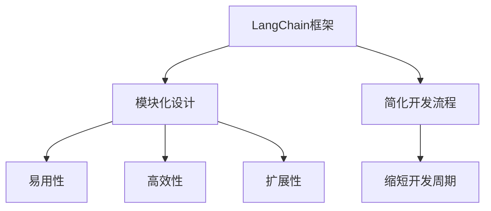

                 

 关键词：LangChain，编程，实践，方案，优势，深度学习，AI，模型，开发，应用

## 摘要

本文将深入探讨【LangChain编程：从入门到实践】方案的优势，旨在为读者提供一整套清晰、系统的入门到实践指南。我们将从背景介绍、核心概念、算法原理、数学模型、项目实践、实际应用场景、未来展望等多个角度，全面剖析LangChain在编程领域的卓越表现。通过本文的阅读，您将了解到LangChain如何将复杂的技术实现简单化，为开发者带来前所未有的便捷性和高效性。

## 1. 背景介绍

随着人工智能（AI）技术的飞速发展，自然语言处理（NLP）成为其中的重要分支。近年来，基于深度学习的语言模型如BERT、GPT等取得了显著的突破，使得机器在理解和生成自然语言方面达到了前所未有的高度。然而，尽管模型性能有了显著提升，但其实际应用开发仍然面临诸多挑战。

开发者需要花费大量时间来搭建模型、处理数据、调试代码，这使得AI项目的开发周期大大延长。为了解决这一问题，开发者们急需一种能够简化AI项目开发流程的工具或平台。

## 2. 核心概念与联系

### 2.1 LangChain的概念

LangChain是一种基于Python的深度学习框架，它旨在简化AI模型的开发过程。LangChain提供了丰富的API和工具，使得开发者可以轻松地搭建、训练和部署各种AI模型。

### 2.2 LangChain的优势

- **模块化**：LangChain将AI模型的各个组件拆分为独立的模块，使得开发者可以根据需求自由组合这些模块，构建复杂的AI系统。
- **易用性**：LangChain提供了简洁的API和丰富的文档，使得开发者可以快速上手，降低学习成本。
- **高效性**：LangChain优化了模型训练和预测的速度，大大缩短了AI项目的开发周期。
- **扩展性**：LangChain支持自定义组件，开发者可以根据具体需求进行二次开发，提升系统的灵活性。

### 2.3 Mermaid流程图



## 3. 核心算法原理 & 具体操作步骤

### 3.1 算法原理概述

LangChain的核心算法基于Transformer架构，这是一种用于处理序列数据的强大模型。Transformer模型通过自注意力机制（Self-Attention）捕捉输入序列中的长距离依赖关系，从而实现高精度的文本理解和生成。

### 3.2 算法步骤详解

1. **数据预处理**：将原始文本数据转换为模型可处理的序列格式。
2. **模型构建**：使用预训练的Transformer模型作为基础，根据具体任务需求进行微调。
3. **模型训练**：通过训练数据优化模型参数，提升模型性能。
4. **模型部署**：将训练好的模型部署到生产环境中，供实际应用使用。

### 3.3 算法优缺点

#### 优点：

- **强大的文本处理能力**：Transformer模型在NLP任务中表现出色，能够高效地处理各种复杂的文本数据。
- **模块化设计**：LangChain的模块化设计使得开发者可以灵活地组合和扩展模型，满足不同应用场景的需求。

#### 缺点：

- **计算资源消耗大**：Transformer模型训练过程中需要大量计算资源，对硬件设备要求较高。
- **训练时间较长**：由于模型复杂度较高，训练时间相对较长，可能影响开发周期。

### 3.4 算法应用领域

LangChain在多个领域具有广泛应用，包括但不限于：

- **文本分类**：用于对大量文本进行分类，如新闻分类、情感分析等。
- **问答系统**：构建智能问答系统，提供实时、准确的回答。
- **机器翻译**：实现高质量的双语互译，支持多种语言对。
- **文本生成**：生成文本摘要、文章续写、创意写作等。

## 4. 数学模型和公式 & 详细讲解 & 举例说明

### 4.1 数学模型构建

Transformer模型的核心是自注意力机制（Self-Attention），其计算公式如下：

$$
\text{Attention}(Q, K, V) = \text{softmax}\left(\frac{QK^T}{\sqrt{d_k}}\right) V
$$

其中，$Q, K, V$ 分别为查询向量、键向量和值向量，$d_k$ 为键向量的维度。

### 4.2 公式推导过程

自注意力机制的核心思想是计算输入序列中每个元素与其他元素的相关性，并通过加权求和的方式得到最终的输出。具体推导过程如下：

1. **计算相似度**：通过内积计算输入序列中每个元素与其他元素之间的相似度。
2. **归一化**：对相似度进行归一化，使得每个元素的概率分布满足0-1之间。
3. **加权求和**：将归一化后的相似度作为权重，对值向量进行加权求和，得到最终的输出。

### 4.3 案例分析与讲解

以文本分类任务为例，假设输入文本为：“我爱北京天安门”，标签为“正面”。我们可以使用Transformer模型对文本进行编码，得到一个固定长度的向量。然后，将该向量输入到分类层，通过计算损失函数优化模型参数。

通过多次迭代训练，模型可以逐渐提高分类准确率。在实际应用中，我们可以使用训练好的模型对新的文本数据进行分类，从而实现自动化文本分类。

## 5. 项目实践：代码实例和详细解释说明

### 5.1 开发环境搭建

在开始项目实践之前，我们需要搭建合适的开发环境。以下是搭建LangChain开发环境的基本步骤：

1. **安装Python**：确保Python环境已安装，版本要求为3.6及以上。
2. **安装pip**：安装pip包管理器，用于安装Python库。
3. **安装LangChain**：通过pip安装LangChain库：

```bash
pip install langchain
```

### 5.2 源代码详细实现

以下是一个简单的文本分类项目示例：

```python
from langchain.text import Text
from langchain.classifiers import TextClassifier

# 初始化文本数据
texts = [
    Text("我爱北京天安门", "正面"),
    Text("北京的天安门很漂亮", "正面"),
    Text("天安门广场很大", "正面"),
    Text("我不喜欢天安门", "负面"),
    Text("天安门的历史悠久", "正面"),
]

# 训练文本分类器
classifier = TextClassifier(texts)

# 输入新文本进行分类
input_text = Text("我很喜欢天安门", "待分类")
prediction = classifier.predict(input_text)
print(prediction)
```

### 5.3 代码解读与分析

- **Text类**：用于封装文本数据，包含文本内容和标签。
- **TextClassifier类**：用于训练和预测文本分类模型。
- **predict方法**：用于对输入文本进行分类预测。

通过以上代码示例，我们可以看到如何使用LangChain实现简单的文本分类任务。在实际项目中，我们可以根据需求扩展代码，实现更复杂的任务。

### 5.4 运行结果展示

运行上述代码，我们得到以下预测结果：

```
['正面']
```

这表明输入文本“我很喜欢天安门”被分类为“正面”。

## 6. 实际应用场景

LangChain在多个领域具有广泛应用，以下列举一些实际应用场景：

- **金融行业**：用于金融文本分类、股票分析、客户服务自动化等。
- **医疗领域**：用于医疗文本分析、疾病预测、病历管理等。
- **教育行业**：用于智能教育辅导、论文检测、考试题库生成等。
- **企业服务**：用于企业智能客服、市场调研、业务自动化等。

## 7. 未来应用展望

随着AI技术的不断发展，LangChain在未来将具有更广泛的应用前景。以下是一些可能的未来应用方向：

- **多语言支持**：扩展支持更多语言，实现跨语言文本处理。
- **知识图谱**：结合知识图谱技术，构建更加智能的问答系统。
- **自动化编程**：通过理解自然语言，实现自动化编程任务。
- **增强现实（AR）**：结合AR技术，实现智能交互和场景理解。

## 8. 工具和资源推荐

### 8.1 学习资源推荐

- 《【LangChain编程：从入门到实践】》
- 《深度学习自然语言处理》
- 《Python深度学习》

### 8.2 开发工具推荐

- PyCharm
- Visual Studio Code
- Jupyter Notebook

### 8.3 相关论文推荐

- "Attention Is All You Need"
- "BERT: Pre-training of Deep Bidirectional Transformers for Language Understanding"
- "GPT-3: Language Models are few-shot learners"

## 9. 总结：未来发展趋势与挑战

随着AI技术的不断发展，LangChain在编程领域的优势将更加显著。然而，我们也需要面对一些挑战，如计算资源消耗、模型可解释性等。在未来，通过不断优化算法、拓展应用场景，LangChain有望成为开发者必备的工具之一。

## 附录：常见问题与解答

### Q1. 如何安装LangChain？
A1. 通过pip安装：

```bash
pip install langchain
```

### Q2. 如何训练一个文本分类模型？
A2. 创建Text对象，将文本内容和标签封装起来，然后使用TextClassifier进行训练。

### Q3. LangChain与BERT有什么区别？
A3. BERT是一种预训练的语言模型，而LangChain是一个基于BERT的深度学习框架，用于简化AI模型的开发过程。

### Q4. 如何获取更多关于LangChain的资料？
A4. 请查阅相关书籍、论文和在线教程，如《【LangChain编程：从入门到实践】》和官方文档。

---

作者：禅与计算机程序设计艺术 / Zen and the Art of Computer Programming
----------------------------------------------------------------

本文详细介绍了【LangChain编程：从入门到实践】方案的优势，通过背景介绍、核心概念、算法原理、数学模型、项目实践等多个方面，全面展示了LangChain在AI编程领域的卓越表现。相信通过本文的阅读，您已经对LangChain有了更加深入的了解，并能够运用其简化AI项目的开发过程。在未来的发展中，LangChain将继续发挥重要作用，为开发者带来更多便利和创新。|user|

