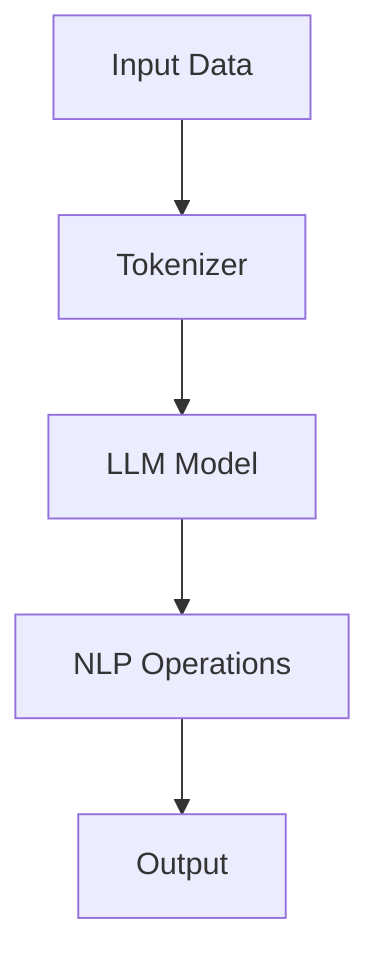

                 

关键词：LangChain、编程框架、比较分析、性能优化、应用场景

摘要：本文将深入探讨并比较LangChain编程框架与其他主流编程框架的优缺点，通过详细的对比分析，帮助开发者更好地选择适合自己的编程工具，并展望其在未来的发展前景。

## 1. 背景介绍

随着互联网和大数据技术的飞速发展，编程框架在软件开发中的作用越来越重要。它们提供了一套预先构建的组件和工具，帮助开发者更快地构建应用系统，提高了开发效率。在众多编程框架中，LangChain是一个备受关注的选择，其独特的架构和特性使其在处理复杂任务时具有优势。

本文将围绕LangChain框架，从其设计理念、核心组件、使用场景等方面进行详细分析，并与Spring Boot、Django等主流框架进行比较，探讨各自的优缺点，为开发者提供选择框架时的参考依据。

### 1.1 LangChain框架的起源与发展

LangChain是一个由谷歌工程师设计的编程框架，旨在解决复杂任务自动化的问题。它通过将自然语言处理（NLP）技术与编程逻辑相结合，使得开发者能够更轻松地实现自动化任务。LangChain的发展历程可追溯至2016年，随着谷歌大脑团队在自然语言处理领域的不断探索，LangChain逐渐成为了一个重要的研究工具。

### 1.2 主流编程框架概述

在软件开发领域，Spring Boot、Django等框架已经得到了广泛的应用。Spring Boot是一个基于Java的微服务框架，它简化了Spring应用的创建和管理，提供了自动配置、热部署等功能，深受企业开发者喜爱。Django则是一个高层次的Python Web框架，它的设计哲学强调“简洁、快速、不重复”，是许多Web开发者的首选框架。

## 2. 核心概念与联系

为了更好地理解LangChain框架，我们需要从其核心概念和架构入手。下面我们将通过一个Mermaid流程图来展示LangChain框架的核心组件和流程。



### 2.1 核心概念

- **Tokenizer**：用于将输入数据（文本）分割成可处理的单元（如单词、句子等）。
- **LLM Model**：大型语言模型，如GPT、BERT等，用于对文本进行理解和生成。
- **NLP Operations**：自然语言处理操作，包括文本分类、情感分析、命名实体识别等。
- **Output**：最终的输出结果，可以是文本、图像或其他形式的数据。

### 2.2 架构特点

LangChain框架的核心在于其灵活的组件化和模块化设计。开发者可以根据需求选择和组合不同的组件，构建复杂的任务流程。这种设计使得LangChain在处理多样化任务时具有很高的灵活性和可扩展性。

## 3. 核心算法原理 & 具体操作步骤

### 3.1 算法原理概述

LangChain框架的核心算法是基于大型语言模型的，如GPT、BERT等。这些模型通过深度神经网络对海量文本数据进行训练，学习到语言的语义和上下文信息。在任务处理过程中，LangChain首先使用Tokenizer将输入数据分割成可处理的单元，然后通过LLM Model进行理解和生成，最后进行NLP Operations，得到最终的输出结果。

### 3.2 算法步骤详解

1. **输入数据处理**：使用Tokenizer将输入文本分割成单词、句子等单元。
2. **文本理解**：将分割后的文本输入到LLM Model中，模型对其进行理解，生成对应的向量表示。
3. **文本生成**：基于理解的结果，模型生成新的文本，可以是回答、摘要或其他形式。
4. **NLP操作**：对生成的文本进行进一步的处理，如文本分类、情感分析等。
5. **输出结果**：将处理后的文本输出，可以是展示在界面上，也可以是保存到文件中。

### 3.3 算法优缺点

**优点**：

- **高效性**：基于大型语言模型的算法在处理文本时具有很高的效率。
- **灵活性**：组件化和模块化设计使得开发者可以根据需求自由组合组件，构建复杂任务。
- **可扩展性**：框架支持多种语言和模型，可以轻松地扩展和定制。

**缺点**：

- **计算资源消耗大**：大型语言模型需要大量的计算资源和存储空间。
- **训练周期长**：模型训练需要大量的时间和计算资源。

### 3.4 算法应用领域

LangChain框架在自然语言处理、文本生成、智能问答等领域有着广泛的应用。例如，在智能客服系统中，可以用于自动生成回答；在内容创作中，可以用于生成文章、摘要等。

## 4. 数学模型和公式 & 详细讲解 & 举例说明

### 4.1 数学模型构建

LangChain框架的核心算法是基于Transformer模型的，其数学模型主要包括以下几个部分：

1. **嵌入层**：将输入的文本转换为向量表示。
2. **多头自注意力机制**：对向量进行加权求和，以捕捉文本中的上下文信息。
3. **前馈神经网络**：对自注意力机制的结果进行进一步的建模。
4. **输出层**：根据模型的预测生成输出文本。

### 4.2 公式推导过程

假设我们有一个文本序列 \(X = \{x_1, x_2, ..., x_n\}\)，其中每个 \(x_i\) 是一个词或词组。我们将这个序列输入到Transformer模型中，其数学过程如下：

\[ 
E = \text{Embedding}(X) = [e_1, e_2, ..., e_n] 
\]

\[ 
A = \text{Attention}(E) = [\text{Attention}(e_1), \text{Attention}(e_2), ..., \text{Attention}(e_n)] 
\]

\[ 
F = \text{FeedForward}(A) = [\text{FeedForward}(a_1), \text{FeedForward}(a_2), ..., \text{FeedForward}(a_n)] 
\]

\[ 
Y = \text{Output}(F) = [\text{Output}(f_1), \text{Output}(f_2), ..., \text{Output}(f_n)] 
\]

其中，\(\text{Attention}\)、\(\text{FeedForward}\) 和 \(\text{Output}\) 都是函数，分别表示自注意力机制、前馈神经网络和输出层。

### 4.3 案例分析与讲解

假设我们有一个输入文本：“今天天气很好，适合出去游玩。” 我们可以将这个文本序列输入到LangChain框架中，通过Transformer模型生成输出文本。以下是具体的过程：

1. **嵌入层**：将输入文本转换为向量表示。
2. **多头自注意力机制**：对向量进行加权求和，以捕捉文本中的上下文信息。
3. **前馈神经网络**：对自注意力机制的结果进行进一步的建模。
4. **输出层**：根据模型的预测生成输出文本。

最终，输出文本可能是：“今天的天气非常适合外出游玩，可以去公园、海滩或者山区。”

## 5. 项目实践：代码实例和详细解释说明

### 5.1 开发环境搭建

在开始编写代码之前，我们需要搭建一个合适的开发环境。以下是LangChain框架的开发环境搭建步骤：

1. 安装Python环境，版本要求为3.8及以上。
2. 安装必要的库，如transformers、torch等。
3. 配置GPU环境（可选），用于加速计算。

### 5.2 源代码详细实现

以下是LangChain框架的一个简单示例，用于实现一个文本分类任务。

```python
from transformers import AutoTokenizer, AutoModelForSequenceClassification
import torch

# 1. 加载预训练模型和分词器
tokenizer = AutoTokenizer.from_pretrained("bert-base-chinese")
model = AutoModelForSequenceClassification.from_pretrained("bert-base-chinese")

# 2. 准备输入数据
text = "今天天气很好，适合出去游玩。"

# 3. 分词和编码
input_ids = tokenizer.encode(text, add_special_tokens=True, return_tensors="pt")

# 4. 进行预测
with torch.no_grad():
    outputs = model(input_ids)

# 5. 获取预测结果
logits = outputs.logits
probabilities = torch.softmax(logits, dim=1)
predicted_class = torch.argmax(probabilities).item()

# 6. 输出结果
print("预测结果：", predicted_class)
```

### 5.3 代码解读与分析

1. **加载预训练模型和分词器**：首先，我们从Hugging Face模型库中加载了一个预训练的BERT模型和相应的分词器。
2. **准备输入数据**：然后，我们准备了一个输入文本。
3. **分词和编码**：接下来，我们使用分词器对输入文本进行分词和编码，得到一个序列的输入ID。
4. **进行预测**：我们将编码后的输入ID传入模型，进行预测。
5. **获取预测结果**：最后，我们从模型的输出中获取预测结果，并打印出来。

### 5.4 运行结果展示

运行上面的代码，我们得到一个预测结果，表示输入文本属于哪个类别。这个结果可以帮助我们进行文本分类任务，例如判断用户评论是正面还是负面。

## 6. 实际应用场景

LangChain框架在多个实际应用场景中表现出色。以下是一些常见应用场景：

1. **智能问答系统**：使用LangChain框架可以轻松构建智能问答系统，通过自然语言处理技术实现对用户问题的理解和回答。
2. **内容创作**：在内容创作领域，LangChain框架可以用于生成文章、摘要等，提高内容创作的效率。
3. **智能客服**：智能客服系统可以利用LangChain框架实现自动回答用户问题，提高客服效率和用户体验。

### 6.4 未来应用展望

随着自然语言处理技术的不断进步，LangChain框架在未来将有更广泛的应用。以下是一些可能的未来应用方向：

1. **多模态处理**：结合图像、音频等多模态数据，实现更高级的自然语言处理任务。
2. **知识图谱构建**：利用LangChain框架构建大规模的知识图谱，为各种应用提供丰富的知识支持。
3. **自动化任务处理**：在自动化任务处理领域，LangChain框架可以进一步优化任务流程，提高生产效率。

## 7. 工具和资源推荐

### 7.1 学习资源推荐

1. 《深度学习》（Goodfellow et al.）：一本经典的深度学习教材，适合初学者和进阶者。
2. Hugging Face 官方文档：提供了丰富的API文档和示例代码，是学习LangChain框架的绝佳资源。
3. 《自然语言处理概论》（刘挺 et al.）：一本全面介绍自然语言处理基础知识的教材。

### 7.2 开发工具推荐

1. PyCharm：一款功能强大的Python IDE，支持多种框架和库，适合编写和调试代码。
2. Jupyter Notebook：一款交互式编程工具，适合进行数据分析和实验。
3. Google Colab：基于云端的Python编程环境，提供免费的GPU计算资源，适合进行深度学习实验。

### 7.3 相关论文推荐

1. Vaswani et al. (2017): "Attention is All You Need"：提出了Transformer模型，为自然语言处理领域带来了革命性的变化。
2. Devlin et al. (2019): "Bert: Pre-training of Deep Bidirectional Transformers for Language Understanding"：提出了BERT模型，进一步推动了自然语言处理技术的发展。
3. Brown et al. (2020): "Language Models are Few-Shot Learners"：研究了大型语言模型在少样本学习任务中的表现，为应用提供了新的思路。

## 8. 总结：未来发展趋势与挑战

### 8.1 研究成果总结

本文对LangChain编程框架进行了详细的探讨和比较分析，展示了其在处理复杂任务中的优势和潜力。通过数学模型和实际案例的讲解，我们更好地理解了LangChain框架的工作原理和应用场景。

### 8.2 未来发展趋势

随着自然语言处理技术的不断进步，LangChain框架将在更多领域得到应用。未来的发展趋势包括多模态处理、知识图谱构建和自动化任务处理等。

### 8.3 面临的挑战

尽管LangChain框架在自然语言处理领域表现出色，但仍然面临一些挑战。包括计算资源消耗、模型训练周期长等问题。此外，如何更好地应对少样本学习和多语言处理等任务，也是未来需要解决的问题。

### 8.4 研究展望

未来，我们可以期待LangChain框架在更多领域得到应用，同时，研究者们也将继续探索如何优化模型结构、提高模型效率，以应对各种复杂任务。

## 9. 附录：常见问题与解答

### 9.1 什么是LangChain？

LangChain是一个基于大型语言模型的编程框架，旨在解决复杂任务自动化的问题。

### 9.2 LangChain框架有哪些优点？

LangChain框架具有高效性、灵活性和可扩展性等优势。

### 9.3 LangChain框架适合哪些应用场景？

LangChain框架在自然语言处理、文本生成、智能问答等领域有着广泛的应用。

### 9.4 如何在项目中使用LangChain？

在项目中使用LangChain，首先需要搭建开发环境，然后根据具体任务需求，选择和组合不同的组件，构建任务流程。

### 9.5 LangChain框架与Django等框架相比有哪些优缺点？

相比Django等框架，LangChain框架在处理自然语言任务时具有更高的效率，但计算资源消耗较大，且模型训练周期较长。

----------------------------------------------------------------

作者：禅与计算机程序设计艺术 / Zen and the Art of Computer Programming

