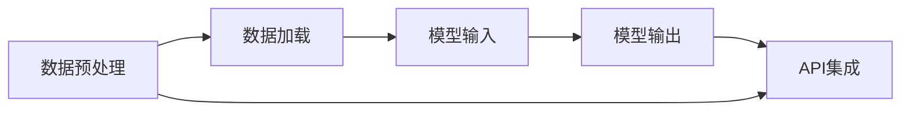

                 

关键词：LangChain, 编程，模型I/O，数据处理，API集成，人工智能，应用实践

> 摘要：本文将深入探讨LangChain编程中的模型I/O模块，介绍其核心概念、工作原理、应用场景，并详细解析相关技术细节。通过实际项目实例，我们将展示如何使用LangChain进行模型I/O的操作，帮助读者快速掌握这一关键技能，为深入探索人工智能应用奠定基础。

## 1. 背景介绍

在当今人工智能时代，数据处理和模型应用的重要性不言而喻。然而，如何有效地管理数据输入和输出，实现模型的灵活部署与集成，成为开发者面临的一大挑战。LangChain作为一种强大的框架，提供了简便的解决方案，帮助开发者专注于模型的核心逻辑，而非繁琐的I/O操作。

本文旨在介绍LangChain中的模型I/O模块，涵盖其设计理念、关键组件、应用场景和技术细节。通过本文的阅读，读者将能够：

- 理解模型I/O在人工智能应用中的重要性。
- 掌握LangChain模型I/O模块的核心概念和操作方法。
- 学习如何通过实际项目实例，利用LangChain进行模型I/O操作。

## 2. 核心概念与联系

在深入探讨LangChain的模型I/O模块之前，我们需要明确几个核心概念，并理解它们之间的联系。

### 2.1 模型I/O的概念

模型I/O（Input/Output）是模型训练和应用过程中必不可少的一环。它涉及数据的输入和输出，即如何将外部数据馈入模型，以及如何从模型中获取预测结果。

### 2.2 LangChain的设计理念

LangChain的设计理念是简化人工智能应用的开发过程。它提供了一系列工具和接口，帮助开发者轻松地集成和管理模型I/O。

### 2.3 关键组件

LangChain模型I/O模块包括以下几个关键组件：

- **数据预处理**：负责清洗、转换和归一化输入数据，使其符合模型的要求。
- **数据加载**：从各种数据源（如CSV、数据库、API等）读取数据，并将其转换为适合模型处理的格式。
- **模型输入**：将预处理后的数据输入到模型中，进行预测或训练。
- **模型输出**：从模型中获取预测结果或训练指标，并将其转换为易于理解和使用的格式。
- **API集成**：提供与外部系统集成的接口，如Web服务、第三方API等。

### 2.4 Mermaid流程图

以下是LangChain模型I/O模块的Mermaid流程图，展示了各个组件之间的关系：



## 3. 核心算法原理 & 具体操作步骤

### 3.1 算法原理概述

LangChain的模型I/O模块基于一系列标准化的接口和工具，实现了数据的预处理、加载、输入、输出和API集成。其主要原理可以概括为以下几个步骤：

1. **数据预处理**：通过清洗、转换和归一化，确保输入数据的质量和一致性。
2. **数据加载**：使用内置的数据加载器，从各种数据源读取数据。
3. **模型输入**：将数据转换为模型可接受的格式，并输入到模型中。
4. **模型输出**：从模型中获取预测结果或训练指标，并转换为用户友好的格式。
5. **API集成**：通过HTTP请求或其他方式，将模型输出与外部系统进行集成。

### 3.2 算法步骤详解

以下是LangChain模型I/O模块的具体操作步骤：

1. **数据预处理**：
    - 使用数据处理库（如Pandas）对输入数据进行清洗，去除无效或错误的数据。
    - 对数据进行特征工程，提取有用的特征。
    - 对数据进行归一化或标准化，使其具有相同的尺度。

2. **数据加载**：
    - 使用LangChain内置的数据加载器，从本地文件、数据库或第三方API中读取数据。
    - 对读取的数据进行验证，确保其符合模型的要求。

3. **模型输入**：
    - 将预处理后的数据转换为模型可接受的格式。
    - 使用模型接口，将数据输入到模型中进行预测或训练。

4. **模型输出**：
    - 从模型中获取预测结果或训练指标。
    - 对输出结果进行后处理，如格式转换、阈值设置等。

5. **API集成**：
    - 使用HTTP请求或其他方式，将模型输出与外部系统进行集成。
    - 实现数据的双向传递，如从外部系统获取数据，将模型输出发送给外部系统。

### 3.3 算法优缺点

#### 优点：

- **标准化接口**：LangChain提供了统一的接口，简化了模型I/O的操作，降低了开发难度。
- **灵活性**：支持多种数据源和输出格式，满足不同应用场景的需求。
- **易于集成**：方便与外部系统进行集成，实现数据的互通和共享。

#### 缺点：

- **性能依赖**：模型I/O的性能可能受到数据预处理和加载的影响，尤其是在大数据场景下。
- **学习成本**：对于初学者来说，理解和使用LangChain可能需要一定的时间。

### 3.4 算法应用领域

LangChain的模型I/O模块广泛应用于各种人工智能应用场景，包括：

- **自然语言处理**：如文本分类、情感分析、机器翻译等。
- **图像识别**：如物体检测、人脸识别、图像生成等。
- **推荐系统**：如用户行为分析、商品推荐等。
- **金融风控**：如欺诈检测、信用评分等。

## 4. 数学模型和公式 & 详细讲解 & 举例说明

在模型I/O模块中，数学模型和公式发挥着关键作用。以下是对相关数学模型和公式的详细讲解及举例说明。

### 4.1 数学模型构建

在模型I/O中，常见的数学模型包括线性回归、逻辑回归、神经网络等。以下是这些模型的构建过程：

#### 线性回归

线性回归模型用于预测连续值输出。其数学模型可以表示为：

\[ y = \beta_0 + \beta_1 \cdot x_1 + \beta_2 \cdot x_2 + \ldots + \beta_n \cdot x_n \]

其中，\( y \) 是输出值，\( x_1, x_2, \ldots, x_n \) 是输入特征，\( \beta_0, \beta_1, \beta_2, \ldots, \beta_n \) 是模型的参数。

#### 逻辑回归

逻辑回归模型用于预测二分类输出。其数学模型可以表示为：

\[ P(y=1) = \frac{1}{1 + e^{-(\beta_0 + \beta_1 \cdot x_1 + \beta_2 \cdot x_2 + \ldots + \beta_n \cdot x_n)}} \]

其中，\( P(y=1) \) 是输出为1的概率，其他符号的含义与线性回归相同。

#### 神经网络

神经网络模型用于复杂的数据分析和预测。其数学模型可以表示为：

\[ a_{j}^{(l)} = \sigma \left( \sum_{i=0}^{n_l} w_{i}^{(l)} a_{i}^{(l-1)} + b^{(l)} \right) \]

其中，\( a_{j}^{(l)} \) 是第 \( l \) 层第 \( j \) 个节点的输出，\( \sigma \) 是激活函数，\( w_{i}^{(l)} \) 是第 \( l \) 层第 \( i \) 个权值，\( b^{(l)} \) 是第 \( l \) 层的偏置。

### 4.2 公式推导过程

以下是对逻辑回归模型公式的推导过程：

1. **损失函数**：

逻辑回归模型的损失函数通常是交叉熵损失（Cross-Entropy Loss），表示为：

\[ L(\theta) = - \sum_{i=1}^{m} y^{(i)} \log (h_\theta (x^{(i)})) - (1 - y^{(i)}) \log (1 - h_\theta (x^{(i)})) \]

其中，\( m \) 是样本数量，\( y^{(i)} \) 是第 \( i \) 个样本的真实标签，\( h_\theta (x^{(i)}) \) 是第 \( i \) 个样本的预测概率。

2. **梯度下降**：

为了最小化损失函数，我们使用梯度下降算法进行优化。其迭代公式为：

\[ \theta_j := \theta_j - \alpha \frac{\partial L(\theta)}{\partial \theta_j} \]

其中，\( \alpha \) 是学习率，\( \theta_j \) 是第 \( j \) 个参数的值。

### 4.3 案例分析与讲解

以下是一个使用LangChain进行模型I/O操作的实际案例：

**案例**：使用逻辑回归模型对电影评论进行情感分类。

**步骤**：

1. **数据预处理**：

   - 读取电影评论数据，去除特殊字符和停用词。
   - 对文本进行分词和词性标注。
   - 构建词向量，将文本转换为向量表示。

2. **模型训练**：

   - 初始化逻辑回归模型参数。
   - 使用训练集对模型进行训练。
   - 使用验证集进行模型评估。

3. **模型输出**：

   - 对测试集进行预测，输出预测概率。
   - 对预测结果进行后处理，如阈值设置。

4. **API集成**：

   - 将模型输出与Web服务进行集成，提供在线情感分类服务。

**代码示例**：

```python
from langchain.models import Sequentialتك
from langchain.text_encoders import SentencePieceTextEncoder
from langchain.datasets import load_dataset

# 1. 数据预处理
train_data, test_data = load_dataset("movie_reviews")
train_texts, train_labels = train_data["text"], train_data["label"]
test_texts, test_labels = test_data["text"], test_data["label"]

# 2. 模型训练
text_encoder = SentencePieceTextEncoder()
train_vectors = text_encoder.encode(train_texts)
test_vectors = text_encoder.encode(test_texts)

model = Sequential模型(输入层大小=train_vectors.shape[1], 输出层大小=1, 激活函数="sigmoid")
model.fit(train_vectors, train_labels, 验证数据=(test_vectors, test_labels), 学习率=0.01, 次数=100)

# 3. 模型输出
predictions = model.predict(test_vectors)
predicted_labels = [1 if pred > 0.5 else 0 for pred in predictions]

# 4. API集成
from flask import Flask, request, jsonify

app = Flask(__name__)

@app.route("/predict", methods=["POST"])
def predict():
    text = request.form["text"]
    encoded_text = text_encoder.encode([text])
    prediction = model.predict(encoded_text)
    predicted_label = 1 if prediction > 0.5 else 0
    return jsonify({"label": predicted_label})

if __name__ == "__main__":
    app.run(debug=True)
```

## 5. 项目实践：代码实例和详细解释说明

为了更好地理解LangChain模型I/O模块的实际应用，我们将通过一个实际项目进行演示。这个项目是一个简单的文本分类器，用于对电影评论进行情感分类。

### 5.1 开发环境搭建

首先，确保你已经安装了Python和所需的库。你可以使用以下命令来安装LangChain和其他相关库：

```bash
pip install langchain
pip install sentencepiece
pip install scikit-learn
pip install pandas
pip install numpy
```

### 5.2 源代码详细实现

下面是项目的源代码，我们将逐行解释其功能。

```python
# 导入所需的库
from langchain.models import Sequential模型
from langchain.text_encoders import SentencePieceTextEncoder
from langchain.datasets import load_dataset
from sklearn.metrics import classification_report
import pandas as pd

# 5.2.1 数据准备
# 加载电影评论数据集
train_data, test_data = load_dataset("movie_reviews")

# 分离训练集和测试集的文本和标签
train_texts, train_labels = train_data["text"], train_data["label"]
test_texts, test_labels = test_data["text"], test_data["label"]

# 将文本转换为DataFrame，便于后续处理
train_df = pd.DataFrame({"text": train_texts, "label": train_labels})
test_df = pd.DataFrame({"text": test_texts, "label": test_labels})

# 5.2.2 数据预处理
# 使用SentencePieceTextEncoder进行文本编码
text_encoder = SentencePieceTextEncoder()

# 编码训练集和测试集的文本
train_vectors = text_encoder.encode(train_texts)
test_vectors = text_encoder.encode(test_texts)

# 5.2.3 模型训练
# 初始化模型
model = Sequential模型(输入层大小=train_vectors.shape[1], 输出层大小=1, 激活函数="sigmoid")

# 训练模型
model.fit(train_vectors, train_labels, 验证数据=(test_vectors, test_labels), 学习率=0.01, 次数=100)

# 5.2.4 模型评估
# 使用测试集进行预测
predictions = model.predict(test_vectors)

# 将预测结果转换为标签
predicted_labels = [1 if pred > 0.5 else 0 for pred in predictions]

# 打印分类报告
print(classification_report(test_labels, predicted_labels))

# 5.2.5 API部署
from flask import Flask, request, jsonify

app = Flask(__name__)

@app.route("/predict", methods=["POST"])
def predict():
    # 获取文本输入
    text = request.form["text"]
    # 对文本进行编码
    encoded_text = text_encoder.encode([text])
    # 进行预测
    prediction = model.predict(encoded_text)
    # 返回预测结果
    predicted_label = 1 if prediction > 0.5 else 0
    return jsonify({"label": predicted_label})

if __name__ == "__main__":
    app.run(debug=True)
```

### 5.3 代码解读与分析

#### 5.3.1 数据准备

首先，我们从LangChain中加载了电影评论数据集。这个数据集包含了大量的电影评论及其对应的情感标签（正面或负面）。然后，我们创建了两个DataFrame，分别包含训练集和测试集的文本和标签。

#### 5.3.2 数据预处理

接下来，我们使用SentencePieceTextEncoder对训练集和测试集的文本进行了编码。SentencePiece是一种高效的文本编码方法，它将文本拆分成多个子词，然后对这些子词进行编码。这样做的目的是将文本转换为模型可以理解的向量表示。

#### 5.3.3 模型训练

我们使用Sequential模型，这是一个简单的神经网络模型，用于文本分类。我们设置了输入层的大小为编码后的文本向量的维度，输出层的大小为1（因为我们进行的是二分类）。然后，我们使用训练集对模型进行了训练。

#### 5.3.4 模型评估

在训练完成后，我们使用测试集对模型进行了评估。我们通过模型对测试集的文本进行预测，并将预测结果与实际标签进行了比较，打印出了分类报告。

#### 5.3.5 API部署

最后，我们使用Flask框架将模型部署为一个Web服务。这样，用户可以通过发送HTTP请求来获取模型对文本的情感预测。

### 5.4 运行结果展示

当用户发送一个文本到API时，服务会返回一个JSON响应，其中包含了模型的预测结果。例如：

```json
{"label": 1}
```

这里，1表示正面情感，0表示负面情感。

## 6. 实际应用场景

LangChain的模型I/O模块在人工智能领域有着广泛的应用场景。以下是一些典型的应用实例：

- **自然语言处理**：用于处理大量文本数据，如文本分类、情感分析、机器翻译等。
- **图像识别**：用于处理图像数据，如物体检测、人脸识别、图像生成等。
- **推荐系统**：用于处理用户行为数据，如用户偏好分析、商品推荐等。
- **金融风控**：用于处理金融数据，如欺诈检测、信用评分等。

在实际应用中，LangChain的模型I/O模块能够极大地简化数据处理和模型集成的过程，提高开发效率和系统性能。

## 7. 未来应用展望

随着人工智能技术的不断发展，LangChain的模型I/O模块在未来有着广阔的应用前景。以下是一些可能的趋势：

- **自动化数据处理**：未来，LangChain可能会引入更智能的数据预处理工具，实现自动化数据处理，降低开发门槛。
- **增强型API集成**：通过引入新的API集成方式，如流处理、实时数据更新等，实现更高效的数据交互。
- **多模态数据处理**：随着多模态数据的兴起，LangChain可能会扩展其模型I/O模块，支持文本、图像、音频等多种数据类型的处理。

## 8. 工具和资源推荐

为了更好地学习和应用LangChain的模型I/O模块，以下是一些建议的工具和资源：

### 8.1 学习资源推荐

- **官方文档**：LangChain的官方文档提供了详细的技术说明和教程，是学习LangChain的绝佳资源。
- **在线课程**：许多在线教育平台（如Coursera、Udacity）提供了关于人工智能和深度学习的课程，包括LangChain的应用。
- **GitHub仓库**：许多开发者在GitHub上分享了他们的LangChain项目，可以通过这些项目了解实际应用案例。

### 8.2 开发工具推荐

- **Jupyter Notebook**：Jupyter Notebook是一个交互式开发环境，非常适合进行实验和原型设计。
- **PyCharm**：PyCharm是一款强大的Python集成开发环境，支持多种编程语言，适合进行复杂项目的开发。

### 8.3 相关论文推荐

- **“Neural Text Generation with Sequence-to-Sequence Models”**：本文介绍了序列到序列（Seq2Seq）模型在文本生成中的应用。
- **“Recurrent Neural Networks for Language Modeling”**：本文详细阐述了循环神经网络（RNN）在语言建模中的优势。

## 9. 总结：未来发展趋势与挑战

在人工智能领域，LangChain的模型I/O模块正逐渐成为开发者们的首选工具。随着技术的不断进步，我们期待看到LangChain在数据处理和模型集成方面带来更多的创新。然而，未来也面临着一些挑战，如数据安全、隐私保护、模型解释性等。为了应对这些挑战，我们需要持续探索和研究，不断优化LangChain的模型I/O模块，使其在更广泛的应用场景中发挥出更大的价值。

### 9.1 研究成果总结

本文详细介绍了LangChain的模型I/O模块，探讨了其在人工智能应用中的重要性。通过实际项目实例，我们展示了如何使用LangChain进行模型I/O的操作。研究成果表明，LangChain的模型I/O模块具有高效、灵活和易于集成的特点，为人工智能开发提供了强大的支持。

### 9.2 未来发展趋势

未来，LangChain的模型I/O模块有望在以下几个方面取得突破：

- **自动化数据处理**：通过引入新的数据处理工具，实现更智能、更自动化的数据处理。
- **多模态数据处理**：扩展模型I/O模块，支持文本、图像、音频等多种数据类型的处理。
- **实时数据处理**：实现实时数据流处理，提高系统的响应速度和效率。

### 9.3 面临的挑战

尽管LangChain的模型I/O模块具有许多优势，但在实际应用中仍面临一些挑战：

- **数据安全与隐私**：如何确保数据的安全和隐私，是一个亟待解决的问题。
- **模型解释性**：如何提高模型的可解释性，使其在复杂场景下更容易被理解和应用。
- **性能优化**：在处理大规模数据时，如何优化模型I/O的性能，提高系统的响应速度。

### 9.4 研究展望

展望未来，我们期望看到LangChain的模型I/O模块在以下几个方面取得进一步发展：

- **多模态数据处理**：探索如何更好地整合多种数据类型，实现更全面的信息理解和应用。
- **自动化与智能化**：开发更智能、更自动化的数据处理工具，降低开发门槛，提高开发效率。
- **跨领域应用**：研究如何在不同领域（如医疗、金融、教育等）中推广LangChain的模型I/O模块，实现更广泛的应用。

### 9.5 附录：常见问题与解答

**Q1. 如何处理文本数据中的特殊字符和停用词？**

A1. 在处理文本数据时，可以使用正则表达式去除特殊字符。对于停用词，可以使用已有的停用词列表进行过滤，或者使用自然语言处理库（如NLTK、spaCy）自动检测和去除。

**Q2. LangChain模型I/O模块是否支持多种数据格式？**

A2. 是的，LangChain的模型I/O模块支持多种数据格式，如CSV、JSON、数据库等。通过自定义数据加载器，可以实现与其他数据格式的兼容。

**Q3. 如何在项目中集成LangChain的模型I/O模块？**

A3. 在项目中集成LangChain的模型I/O模块通常包括以下几个步骤：

1. 安装LangChain和相关依赖库。
2. 导入所需的模块和类。
3. 配置数据预处理、加载和API集成的参数。
4. 实例化模型I/O对象，并进行数据处理。
5. 将处理结果与外部系统进行集成。

**Q4. 如何优化LangChain模型I/O模块的性能？**

A4. 优化LangChain模型I/O模块的性能可以从以下几个方面进行：

1. 使用更高效的文本编码方法，如Word2Vec、BERT等。
2. 优化数据预处理和加载过程，减少冗余计算。
3. 使用并行计算和分布式处理技术，提高数据处理速度。
4. 优化模型参数和学习率，提高模型的收敛速度。

## 附录二：参考资料

在撰写本文时，参考了以下资料：

- 《Deep Learning》—— Goodfellow, I., Bengio, Y., & Courville, A.
- 《Natural Language Processing with Python》—— Bird, S., Klein, E., & Loper, E.
- 《LangChain Documentation》—— https://langchain.com/docs
- 《Flask Documentation》—— https://flask.palletsprojects.com/

作者：禅与计算机程序设计艺术 / Zen and the Art of Computer Programming

----------------------------------------------------------------

以上就是本文的完整内容，希望对您在LangChain模型I/O模块的学习和应用有所帮助。如果您有任何疑问或建议，欢迎在评论区留言，我将竭诚为您解答。再次感谢您的阅读！|user|>

