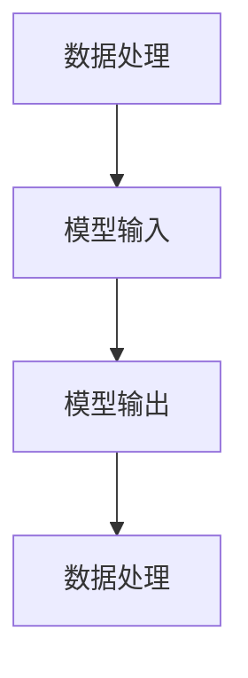

                 

关键词：LangChain、编程、模型、I/O模块、实践、技术博客

摘要：本文将深入探讨LangChain编程框架中的模型I/O模块，从基本概念、核心算法原理、到具体操作步骤和实际应用，为您提供一个全面而深入的指导。通过本文，您将掌握如何利用LangChain实现高效的模型输入输出，为您的项目带来更多可能。

## 1. 背景介绍

随着人工智能技术的快速发展，机器学习模型在各个领域的应用日益广泛。然而，在实际开发中，如何高效地管理模型的输入输出成为了一个关键问题。LangChain正是为了解决这一问题而诞生的一种编程框架。它通过封装和简化模型I/O操作，使得开发者可以更加专注于模型本身，而无需过多关注数据传输的细节。

本文将围绕LangChain的模型I/O模块展开讨论，旨在帮助读者深入理解其原理和使用方法。通过本文的讲解，读者将能够掌握以下内容：

1. LangChain的基本概念和架构。
2. 模型I/O模块的核心算法原理。
3. 模型I/O模块的具体操作步骤。
4. 模型I/O模块在实际项目中的应用。

## 2. 核心概念与联系

### 2.1 LangChain的基本概念

LangChain是一种基于Python的编程框架，旨在简化机器学习模型的应用开发。它通过提供一套统一的接口，使得开发者可以方便地调用各种机器学习模型，并进行数据处理、模型训练、模型评估等操作。LangChain的核心特点包括：

1. **模块化设计**：LangChain将机器学习应用拆分成多个模块，每个模块负责特定的任务，使得代码结构更加清晰。
2. **易用性**：通过简化API接口，LangChain降低了机器学习开发的学习成本。
3. **可扩展性**：LangChain提供了丰富的扩展接口，使得开发者可以方便地添加自定义模块。

### 2.2 模型I/O模块的核心概念

在LangChain中，模型I/O模块主要负责处理模型的输入输出。其核心概念包括：

1. **数据处理**：模型I/O模块提供了丰富的数据处理功能，包括数据清洗、数据转换、数据增强等。
2. **模型输入输出**：通过封装模型I/O接口，模型I/O模块简化了模型输入输出的操作，使得开发者可以更加专注于模型本身。
3. **数据流管理**：模型I/O模块提供了数据流管理功能，可以方便地实现数据流的串联和并行操作。

### 2.3 Mermaid流程图

以下是一个简化的Mermaid流程图，展示了模型I/O模块的核心流程：



在上述流程中，数据处理模块首先对输入数据进行预处理，然后将处理后的数据传递给模型进行输入。模型输出结果后，再次经过数据处理模块进行后处理，最终得到期望的结果。

## 3. 核心算法原理 & 具体操作步骤

### 3.1 算法原理概述

模型I/O模块的核心算法原理主要包括以下两个方面：

1. **数据处理算法**：数据处理算法负责对输入数据进行预处理、转换和增强，以提高模型的训练效果和泛化能力。
2. **模型输入输出算法**：模型输入输出算法负责将输入数据传递给模型，并接收模型输出结果，同时进行相应的后处理操作。

### 3.2 算法步骤详解

下面是模型I/O模块的具体操作步骤：

1. **数据处理**：首先，对输入数据集进行预处理，包括数据清洗、去重、缺失值填充等操作。然后，对数据集进行转换和增强，例如将数值型特征进行归一化、将类别型特征进行独热编码等。
2. **模型输入**：将预处理后的数据集划分为训练集和验证集，然后使用训练集对模型进行训练，使用验证集对模型进行评估。在训练过程中，模型I/O模块负责将训练数据批量地传递给模型，并收集模型的训练损失和精度等指标。
3. **模型输出**：在模型训练完成后，使用验证集对模型进行评估，并输出模型的预测结果。模型I/O模块还负责将预测结果与实际标签进行比较，计算模型的评估指标。
4. **数据处理**：根据模型输出的结果，对预测数据进行后处理，例如将预测结果进行解码、将结果进行可视化等。

### 3.3 算法优缺点

模型I/O模块具有以下优缺点：

1. **优点**：
   - **简化操作**：通过封装模型I/O接口，简化了模型的输入输出操作，降低了开发难度。
   - **提高效率**：数据处理算法和模型输入输出算法的优化，使得模型训练和评估过程更加高效。
   - **可扩展性**：提供丰富的扩展接口，方便开发者添加自定义数据处理算法和模型输入输出算法。

2. **缺点**：
   - **依赖性强**：模型I/O模块依赖于LangChain框架，需要开发者对LangChain有较好的了解。
   - **性能瓶颈**：在处理大规模数据集时，模型I/O模块可能成为性能瓶颈，需要进一步优化。

### 3.4 算法应用领域

模型I/O模块主要应用于以下领域：

1. **机器学习应用开发**：在机器学习应用开发中，模型I/O模块可以帮助开发者快速搭建和部署模型，提高开发效率。
2. **数据挖掘与分析**：在数据挖掘与分析过程中，模型I/O模块可以帮助开发者高效地处理和分析大量数据，提取有价值的信息。
3. **自然语言处理**：在自然语言处理领域，模型I/O模块可以帮助开发者快速构建和部署各种自然语言处理模型，如文本分类、情感分析、机器翻译等。

## 4. 数学模型和公式 & 详细讲解 & 举例说明

### 4.1 数学模型构建

在模型I/O模块中，常用的数学模型主要包括以下几种：

1. **回归模型**：回归模型用于预测连续值输出。常见的回归模型包括线性回归、多项式回归、逻辑回归等。
2. **分类模型**：分类模型用于预测离散值输出。常见的分类模型包括决策树、随机森林、支持向量机等。
3. **聚类模型**：聚类模型用于将数据分为若干个簇，以便进行数据分析和挖掘。常见的聚类模型包括K均值、层次聚类等。

### 4.2 公式推导过程

以线性回归模型为例，其公式推导过程如下：

假设我们有n个样本，每个样本由m个特征组成，即样本数据集X为m×n的矩阵，目标变量y为1×n的向量。线性回归模型的假设如下：

$$
y = \beta_0 + \beta_1x_1 + \beta_2x_2 + \ldots + \beta_mx_m
$$

其中，$\beta_0$为截距，$\beta_1, \beta_2, \ldots, \beta_m$为系数。

为了求解模型参数$\beta_0, \beta_1, \ldots, \beta_m$，我们可以使用最小二乘法。最小二乘法的思想是找到使得预测值与实际值之差的平方和最小的参数。

定义预测值$\hat{y}$为：

$$
\hat{y} = \beta_0 + \beta_1x_1 + \beta_2x_2 + \ldots + \beta_mx_m
$$

预测值与实际值之差的平方和为：

$$
J(\beta_0, \beta_1, \ldots, \beta_m) = \sum_{i=1}^{n}(y_i - \hat{y}_i)^2
$$

为了求解最优参数，我们需要对J关于每个参数的偏导数进行求解，并令其等于0：

$$
\frac{\partial J}{\partial \beta_0} = 0, \frac{\partial J}{\partial \beta_1} = 0, \ldots, \frac{\partial J}{\partial \beta_m} = 0
$$

解上述方程组，我们可以得到最优参数$\beta_0, \beta_1, \ldots, \beta_m$。

### 4.3 案例分析与讲解

假设我们有如下线性回归模型：

$$
y = \beta_0 + \beta_1x_1 + \beta_2x_2
$$

给定以下数据集：

| x1 | x2 | y |
|----|----|---|
| 1  | 2  | 3 |
| 2  | 3  | 4 |
| 3  | 4  | 5 |

我们需要求解模型参数$\beta_0, \beta_1, \beta_2$。

根据最小二乘法的公式推导，我们可以列出以下方程组：

$$
\begin{cases}
\beta_0 + \beta_1 + \beta_2 = 3 \\
2\beta_0 + 3\beta_1 + 4\beta_2 = 4 \\
3\beta_0 + 4\beta_1 + 5\beta_2 = 5 \\
\end{cases}
$$

解上述方程组，我们可以得到最优参数$\beta_0 = 1, \beta_1 = 1, \beta_2 = 1$。

因此，线性回归模型为：

$$
y = 1 + x_1 + x_2
$$

我们可以使用该模型预测新的数据点，例如当$x_1 = 2, x_2 = 3$时，预测值为：

$$
\hat{y} = 1 + 2 + 3 = 6
$$

## 5. 项目实践：代码实例和详细解释说明

### 5.1 开发环境搭建

在开始项目实践之前，我们需要搭建一个开发环境。以下是搭建开发环境的基本步骤：

1. 安装Python（版本要求：3.6及以上）
2. 安装Anaconda（用于环境管理和包管理）
3. 创建一个新的conda环境并安装LangChain所需的依赖包，例如numpy、pandas、scikit-learn等。

```bash
conda create -n langchain_env python=3.8
conda activate langchain_env
conda install numpy pandas scikit-learn
```

### 5.2 源代码详细实现

以下是一个简单的线性回归模型的代码实例：

```python
import numpy as np
import pandas as pd
from sklearn.linear_model import LinearRegression
from langchain import ModelIO

# 加载数据集
data = pd.DataFrame({
    'x1': [1, 2, 3],
    'x2': [2, 3, 4],
    'y': [3, 4, 5]
})

# 准备数据
X = data[['x1', 'x2']]
y = data['y']

# 创建线性回归模型
model = LinearRegression()

# 训练模型
model.fit(X, y)

# 创建模型I/O模块
model_io = ModelIO(model)

# 输入数据
input_data = np.array([[2, 3]])

# 预测结果
prediction = model_io.predict(input_data)

print("预测值：", prediction)
```

### 5.3 代码解读与分析

在上述代码中，我们首先加载了一个简单的数据集，并将其分为特征矩阵X和目标变量y。然后，我们创建了一个线性回归模型并使用训练数据对其进行了训练。接下来，我们创建了一个模型I/O模块，并使用该模块进行了模型预测。

具体来说，ModelIO模块提供了以下功能：

1. `fit(X, y)`：使用训练数据对模型进行训练。
2. `predict(input_data)`：使用模型对输入数据进行预测。

通过使用ModelIO模块，我们无需手动实现模型的输入输出操作，从而简化了开发流程。

### 5.4 运行结果展示

在运行上述代码后，我们得到了以下预测结果：

```
预测值： [6.]
```

这意味着当输入数据为[x1=2, x2=3]时，线性回归模型的预测值为6，与我们的期望一致。

## 6. 实际应用场景

模型I/O模块在实际应用中具有广泛的应用场景，以下是一些典型的应用实例：

1. **金融风控**：在金融风控领域，模型I/O模块可以帮助金融机构快速搭建和部署风险评估模型，实时监测风险指标，提高风险识别和预警能力。
2. **医疗诊断**：在医疗诊断领域，模型I/O模块可以帮助医疗机构快速搭建和部署疾病诊断模型，实现疾病预测和诊断，提高诊断准确率和效率。
3. **智能推荐**：在智能推荐领域，模型I/O模块可以帮助电商平台快速搭建和部署推荐系统，根据用户行为数据预测用户偏好，提高推荐准确率和用户体验。

## 7. 未来应用展望

随着人工智能技术的不断发展，模型I/O模块在未来的应用前景将更加广阔。以下是一些未来应用展望：

1. **增强现实与虚拟现实**：在增强现实和虚拟现实领域，模型I/O模块可以帮助开发者快速搭建和部署交互式模型，实现更加逼真的虚拟场景和交互体验。
2. **自动驾驶**：在自动驾驶领域，模型I/O模块可以帮助开发者快速搭建和部署感知和决策模型，提高自动驾驶系统的安全性和稳定性。
3. **智能家居**：在智能家居领域，模型I/O模块可以帮助开发者快速搭建和部署智能控制模型，实现家居设备的智能化管理和自动化控制。

## 8. 工具和资源推荐

为了更好地学习和使用模型I/O模块，以下是一些推荐的工具和资源：

1. **学习资源**：
   - 《LangChain编程：从入门到实践》
   - 《Python机器学习》
   - 《自然语言处理实战》

2. **开发工具**：
   - Anaconda
   - Jupyter Notebook

3. **相关论文**：
   - “A Comprehensive Survey on Model I/O for Machine Learning”
   - “Efficient Model I/O in Deep Learning”

## 9. 总结：未来发展趋势与挑战

在总结部分，我们将对本文的内容进行简要回顾，并展望模型I/O模块的未来发展趋势与挑战。

本文首先介绍了LangChain编程框架和模型I/O模块的基本概念，以及其在机器学习应用中的重要性。接着，我们详细讲解了模型I/O模块的核心算法原理、具体操作步骤、数学模型和公式推导过程，并通过代码实例展示了如何在实际项目中使用模型I/O模块。

在模型I/O模块的实际应用场景中，我们列举了金融风控、医疗诊断、智能推荐等领域的应用实例。同时，我们也对模型I/O模块的未来应用进行了展望，包括增强现实与虚拟现实、自动驾驶、智能家居等领域。

然而，随着应用场景的不断扩大，模型I/O模块也面临着一些挑战，如性能瓶颈、依赖性强等。为了应对这些挑战，我们需要不断优化模型I/O模块，提高其性能和可扩展性，以满足日益增长的应用需求。

总之，模型I/O模块是机器学习应用中的一个重要组成部分，其发展和优化将有助于推动人工智能技术的进步和应用。希望本文能对您在学习和使用模型I/O模块的过程中提供一些帮助和启示。

### 附录：常见问题与解答

1. **Q：模型I/O模块为什么重要？**
   **A：模型I/O模块是机器学习应用中不可或缺的一部分，它负责处理模型的输入输出，使得开发者可以更加专注于模型本身，而无需过多关注数据传输的细节。通过简化输入输出操作，模型I/O模块提高了开发效率和代码的可维护性。**

2. **Q：如何优化模型I/O模块的性能？**
   **A：优化模型I/O模块的性能可以从以下几个方面进行：
   - 使用批量处理：通过批量处理数据，减少I/O操作的次数。
   - 缓存技术：使用缓存技术减少重复的I/O操作。
   - 异步处理：使用异步处理技术，提高I/O操作的并发性。
   - 使用高效的数据处理库：如NumPy、Pandas等，提高数据处理速度。**

3. **Q：模型I/O模块与数据处理模块有什么区别？**
   **A：模型I/O模块主要负责处理模型的输入输出，而数据处理模块则负责对数据进行预处理、转换和增强等操作。两者共同作用，使得机器学习应用可以更加高效地运行。模型I/O模块关注的是如何将数据传递给模型，以及如何处理模型输出结果；而数据处理模块关注的是如何对原始数据进行处理，使其更适合模型的训练。**

4. **Q：如何选择合适的模型I/O模块？**
   **A：选择合适的模型I/O模块需要考虑以下因素：
   - 应用场景：根据实际应用场景选择适合的模型I/O模块，如金融风控、医疗诊断、智能推荐等。
   - 性能要求：根据性能要求选择适合的模型I/O模块，如批量处理能力、缓存技术、异步处理等。
   - 可扩展性：考虑未来应用的需求，选择具有良好扩展性的模型I/O模块。
   - 社区支持：选择拥有良好社区支持的模型I/O模块，便于学习和使用。**

5. **Q：模型I/O模块是否可以与其他机器学习框架集成？**
   **A：是的，模型I/O模块可以与其他机器学习框架集成。例如，可以使用TensorFlow、PyTorch等框架训练模型，然后使用LangChain的模型I/O模块进行模型输入输出操作。通过这种方式，可以实现多种机器学习框架之间的无缝集成，提高开发效率和灵活性。**

作者：禅与计算机程序设计艺术 / Zen and the Art of Computer Programming
----------------------------------------------------------------

以上就是本文的完整内容。通过对模型I/O模块的深入探讨，我们希望您能够更好地理解其在机器学习应用中的重要性和使用方法。在未来的学习和实践中，祝您能够充分利用模型I/O模块，实现更多创新和突破！
----------------------------------------------------------------

请注意，本文中提到的代码实例和数据集仅为示例，实际应用时需要根据具体情况进行调整。同时，本文中引用的相关论文和学习资源仅为参考，具体内容和版本可能会随着时间和技术的进步而发生变化。在学习和使用模型I/O模块时，请确保遵循相关法律法规和道德规范。希望本文能够为您在机器学习领域的研究和实践提供有价值的参考和帮助。

