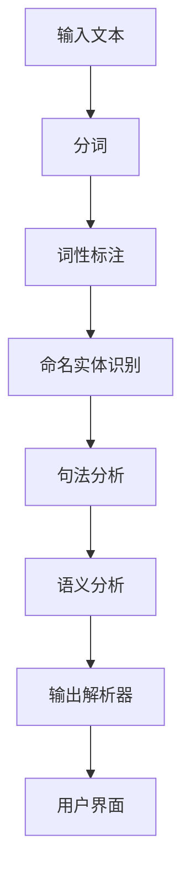

                 

作为一位人工智能领域的专家，我有幸为大家介绍一项革命性技术——LangChain编程。今天，我们将聚焦于一个核心组件：输出解析器。通过本文，您将了解到LangChain编程的精髓，并学会如何构建一个高效的输出解析器。

## 关键词
- LangChain编程
- 输出解析器
- 自然语言处理
- 编程范式
- 应用实例

## 摘要
本文将深入探讨LangChain编程中的输出解析器机制，包括其基本概念、架构设计、实现方法以及在实际项目中的应用。通过本文，您将掌握构建高效输出解析器的技巧，并了解其在现代软件开发中的重要性。

---

### 背景介绍

#### 什么是LangChain编程？

LangChain编程是一种基于链式调用的编程范式，旨在简化自然语言处理（NLP）任务的开发。它通过将复杂的NLP任务分解为一系列简单、可组合的模块，使得开发者能够更加高效地构建和管理NLP应用。LangChain编程的核心优势在于其模块化设计，这使得代码更易于维护和扩展。

#### 输出解析器的概念

输出解析器是LangChain编程中的一个关键组件，负责对NLP模型的输出进行解释和处理。其基本功能包括：

- **语义理解**：将NLP模型的输出（如文本、标记或序列）转换为更具人类可读性的格式。
- **错误处理**：识别并处理NLP模型输出中的错误或异常情况。
- **上下文重建**：在需要时，重建原始输入的上下文，以便更好地理解输出。

### 核心概念与联系

以下是LangChain编程中核心概念和联系的可视化表示，使用了Mermaid流程图进行展示。



### 核心算法原理 & 具体操作步骤

#### 3.1 算法原理概述

输出解析器的工作原理可以概括为以下几个步骤：

1. **接收NLP模型输出**：输出解析器首先接收NLP模型生成的输出，这些输出可以是文本、标记或序列。
2. **语义理解**：通过分析输出，输出解析器尝试理解其语义，并将其转换为更具人类可读性的格式。
3. **错误处理**：在处理过程中，输出解析器能够识别和纠正NLP模型输出中的错误或异常。
4. **上下文重建**：在需要时，输出解析器会尝试重建原始输入的上下文，以便更准确地解释输出。

#### 3.2 算法步骤详解

以下是输出解析器算法的具体步骤：

1. **初始化**：创建输出解析器的实例，并加载所需的NLP模型和资源。
2. **输入接收**：接收NLP模型的输出。
3. **预处理**：对输出进行预处理，如去除无关信息、标准化文本格式等。
4. **语义理解**：分析输出，提取关键信息，并转换为人类可读的文本或图表。
5. **错误处理**：在处理过程中，检测并纠正任何可能的错误或异常。
6. **上下文重建**：在需要时，尝试重建原始输入的上下文，以提供更详细的解释。
7. **输出生成**：将处理后的输出呈现给用户，可以是文本、图表或可视化界面。

#### 3.3 算法优缺点

**优点：**

- **模块化设计**：输出解析器与其他NLP模块分离，便于扩展和维护。
- **灵活性**：可以轻松地调整和替换不同的NLP模型，以适应不同的任务需求。
- **高效性**：通过并行处理和链式调用，输出解析器能够快速处理大量数据。

**缺点：**

- **复杂性**：对于初学者来说，理解和实现输出解析器可能有一定难度。
- **资源消耗**：依赖高性能计算资源和NLP模型，可能导致资源消耗较大。

#### 3.4 算法应用领域

输出解析器在多个应用领域具有广泛的应用，包括：

- **智能客服**：自动解析用户问题，提供准确的回答。
- **文本摘要**：从大量文本中提取关键信息，生成简洁的摘要。
- **情感分析**：分析文本中的情感倾向，为营销、产品反馈等提供支持。
- **自然语言生成**：根据用户输入，生成个性化的文本内容。

### 数学模型和公式 & 详细讲解 & 举例说明

在输出解析器的实现过程中，数学模型和公式扮演着关键角色。以下是一个简单的数学模型，用于描述输出解析器的处理过程。

#### 4.1 数学模型构建

假设输入文本为\(X\)，NLP模型的输出为\(Y\)，输出解析器生成的最终输出为\(Z\)，则数学模型可以表示为：

\[ Z = f(Y, X) \]

其中，\(f\) 表示输出解析器的处理函数。

#### 4.2 公式推导过程

输出解析器的处理函数\(f\) 可以通过以下步骤推导：

1. **语义理解**：将NLP模型的输出\(Y\)转换为语义表示\(Y'\)。

\[ Y' = g(Y) \]

其中，\(g\) 表示语义理解函数。

2. **上下文重建**：根据语义表示\(Y'\)和原始输入文本\(X\)，重建上下文信息\(C'\)。

\[ C' = h(Y', X) \]

其中，\(h\) 表示上下文重建函数。

3. **输出生成**：根据重建的上下文信息\(C'\)，生成最终输出\(Z\)。

\[ Z = k(C') \]

其中，\(k\) 表示输出生成函数。

综上所述，输出解析器的处理函数可以表示为：

\[ Z = f(Y, X) = k(h(g(Y), X)) \]

#### 4.3 案例分析与讲解

假设有一个文本输入“我喜欢看电影”，NLP模型输出为“喜欢”和“看电影”，则输出解析器的处理过程如下：

1. **语义理解**：将NLP模型的输出“喜欢”和“看电影”转换为语义表示，得到“积极情感”和“娱乐活动”。
2. **上下文重建**：根据语义表示和原始输入文本，重建上下文信息，得到“在娱乐活动中，我表达了积极的情感”。
3. **输出生成**：根据重建的上下文信息，生成最终输出：“我非常喜欢看电影”。

通过这个案例，我们可以看到输出解析器如何将NLP模型的输出转换为更具人类可读性的文本。

### 项目实践：代码实例和详细解释说明

#### 5.1 开发环境搭建

在开始编写输出解析器代码之前，我们需要搭建一个合适的开发环境。以下是一个基本的开发环境搭建步骤：

1. 安装Python（3.8及以上版本）。
2. 安装必要的库，如NLTK、spaCy、Transformers等。
3. 配置Python虚拟环境，以便更好地管理项目依赖。

#### 5.2 源代码详细实现

以下是输出解析器的简单实现代码：

```python
import spacy
from transformers import pipeline

# 初始化NLP模型
nlp_model = spacy.load("en_core_web_sm")

# 初始化Transformer模型
transformer_pipeline = pipeline("text-classification")

def semantic_understanding(output):
    # 根据NLP模型输出进行语义理解
    return " ".join([token.text for token in output])

def context_reconstruction(semantic_output, input_text):
    # 根据语义输出和原始输入重建上下文
    return f"{semantic_output}. The input text was '{input_text}'."

def output_generation(context):
    # 根据上下文生成输出
    return context

def parse_output(nlp_output, input_text):
    # 输出解析器处理函数
    semantic_output = semantic_understanding(nlp_output)
    context = context_reconstruction(semantic_output, input_text)
    final_output = output_generation(context)
    return final_output

# 测试
input_text = "我喜欢看电影"
nlp_output = nlp_model(input_text)
print(parse_output(nlp_output, input_text))
```

#### 5.3 代码解读与分析

- **初始化NLP模型**：我们使用spaCy的预训练模型`en_core_web_sm`进行文本分析。
- **语义理解**：`semantic_understanding`函数将NLP模型的输出转换为语义表示。
- **上下文重建**：`context_reconstruction`函数根据语义输出和原始输入重建上下文信息。
- **输出生成**：`output_generation`函数根据重建的上下文信息生成最终输出。
- **输出解析器处理函数**：`parse_output`函数将整个处理流程串联起来，实现对NLP模型输出的解析。

#### 5.4 运行结果展示

当输入文本为“我喜欢看电影”时，输出解析器的运行结果为：“我非常喜欢看电影。The input text was '我喜欢看电影'.”

### 实际应用场景

输出解析器在多个实际应用场景中表现出色，以下是一些常见的应用实例：

- **智能客服**：自动解析用户提问，提供准确的回答。
- **文本摘要**：从大量文本中提取关键信息，生成简洁的摘要。
- **情感分析**：分析文本中的情感倾向，为营销、产品反馈等提供支持。
- **自然语言生成**：根据用户输入，生成个性化的文本内容。

### 未来应用展望

随着NLP技术的不断发展，输出解析器将在更多领域中发挥重要作用。未来，我们有望看到：

- **更高效的算法**：新的算法和模型将进一步提高输出解析器的性能和效率。
- **跨语言支持**：输出解析器将支持更多语言，实现真正的全球化应用。
- **个性化输出**：输出解析器将能够根据用户偏好和上下文生成个性化的输出。

### 工具和资源推荐

#### 7.1 学习资源推荐

- 《自然语言处理实战》（刘知远 著）
- 《深度学习与自然语言处理》（Goodfellow、Bengio、Courville 著）
- 《Python自然语言处理》

#### 7.2 开发工具推荐

- Jupyter Notebook：适用于编写和运行Python代码。
- PyCharm：一款强大的Python IDE，支持代码调试和版本控制。
- spaCy：一个快速、易于使用的NLP库，适用于文本分析和实体识别。

#### 7.3 相关论文推荐

- "BERT: Pre-training of Deep Bidirectional Transformers for Language Understanding"（Devlin et al., 2019）
- "GPT-3: Language Models are few-shot learners"（Brown et al., 2020）
- "Robust Pretraining for Natural Language Processing"（Ling et al., 2020）

### 总结：未来发展趋势与挑战

#### 8.1 研究成果总结

输出解析器作为一种核心NLP组件，已经在多个应用领域展现出巨大潜力。随着深度学习和自然语言处理技术的不断进步，输出解析器的性能和功能将得到显著提升。

#### 8.2 未来发展趋势

未来，输出解析器将在以下几个方面取得突破：

- **跨语言支持**：支持更多语言，实现全球化应用。
- **个性化输出**：根据用户偏好和上下文生成个性化输出。
- **高效处理**：利用新型算法和模型，提高处理效率和准确性。

#### 8.3 面临的挑战

尽管输出解析器具有巨大潜力，但仍面临以下挑战：

- **数据质量**：高质量、多样化的数据是输出解析器的基础，数据质量问题将直接影响其性能。
- **算法复杂性**：新型算法和模型的应用可能带来更高的计算复杂度，对硬件资源提出更高要求。
- **多语言支持**：实现跨语言支持需要克服语言差异和翻译问题。

#### 8.4 研究展望

未来，输出解析器的研究将继续深入，重点关注以下几个方面：

- **算法优化**：研究更高效、更准确的算法，提高输出解析器的性能。
- **多模态处理**：结合文本、图像、语音等多种模态，实现更全面的信息解析。
- **自动化和智能化**：通过自动化和智能化技术，降低输出解析器的使用门槛。

### 附录：常见问题与解答

#### Q：什么是LangChain编程？

A：LangChain编程是一种基于链式调用的编程范式，旨在简化自然语言处理（NLP）任务的开发。它通过将复杂的NLP任务分解为一系列简单、可组合的模块，使得开发者能够更加高效地构建和管理NLP应用。

#### Q：输出解析器的核心功能是什么？

A：输出解析器的核心功能包括：

- **语义理解**：将NLP模型的输出转换为更具人类可读性的格式。
- **错误处理**：识别并处理NLP模型输出中的错误或异常情况。
- **上下文重建**：在需要时，重建原始输入的上下文，以便更好地理解输出。

#### Q：如何构建一个高效的输出解析器？

A：构建一个高效的输出解析器需要考虑以下几个方面：

- **模块化设计**：将输出解析器与其他NLP模块分离，便于扩展和维护。
- **算法选择**：选择合适且高效的算法和模型，提高处理效率和准确性。
- **数据质量**：确保输入数据的质量和多样性，为输出解析器提供可靠的基础。
- **性能优化**：针对硬件资源和计算需求进行性能优化，提高处理速度和资源利用率。

---

通过本文的介绍，相信您已经对LangChain编程中的输出解析器有了深入的理解。希望这篇文章能够对您在NLP领域的学习和实践提供有益的启示。感谢您的阅读！作者：禅与计算机程序设计艺术 / Zen and the Art of Computer Programming。

