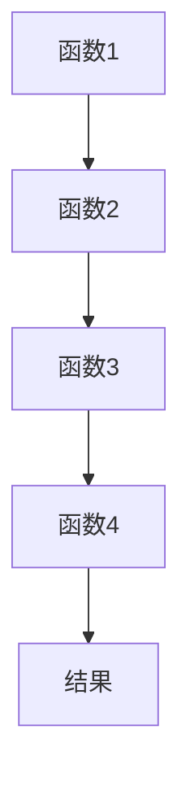

                 

关键词：LangChain, 编程，链，基本概念，开发，实现，应用领域，数学模型，项目实践，资源推荐，未来展望

摘要：本文将深入探讨LangChain编程中的链（Chain）这一核心概念，从基础介绍、概念理解、应用场景、数学模型等方面展开，旨在为读者提供一份系统、全面的指南，帮助大家更好地掌握这一重要技术。

## 1. 背景介绍

LangChain是一个开源项目，旨在提供一种高效的编程范式，以实现复杂任务自动化。其核心思想是将一系列函数（Chain）组合起来，形成一个链式结构，通过这种方式，可以实现复杂的业务逻辑，提高开发效率和代码可读性。

随着互联网和大数据技术的快速发展，传统的编程范式已经不能满足日益复杂的业务需求。为了解决这一问题，编程范式逐渐向函数式编程和链式编程转变。而LangChain正是这种转变的典型代表。

## 2. 核心概念与联系

### 2.1 核心概念

#### 2.1.1 链（Chain）

链（Chain）是LangChain编程中的核心概念。它是一个由一系列函数（或操作）组成的有序结构，每个函数都对其输入进行处理，并将处理后的结果作为下一个函数的输入。这种链式结构使得复杂任务可以以模块化的方式实现。

#### 2.1.2 函数（Function）

函数是链的基本组成部分。它是一个独立的操作，可以接受输入并产生输出。在LangChain中，函数可以是任何可调用的代码块，包括自定义函数、第三方库函数等。

#### 2.1.3 链式编程

链式编程是一种编程范式，强调函数的组合和复用。通过将一系列函数按顺序连接起来，形成链式结构，可以实现对复杂任务的分解和简化。

### 2.2 概念原理与架构

以下是LangChain编程的Mermaid流程图，展示了链的基本概念和架构：



在这个流程图中，A、B、C、D分别代表四个函数，它们按照顺序连接起来，形成一条链。输入数据依次通过每个函数的处理，最终得到结果。

## 3. 核心算法原理 & 具体操作步骤

### 3.1 算法原理概述

LangChain编程的核心算法原理是函数组合和链式结构。通过将一系列函数组合成一个链，可以实现复杂任务的高效执行。

### 3.2 算法步骤详解

#### 3.2.1 创建链

首先，需要创建一个链。链的创建可以通过调用LangChain的`Chain`类来实现。

```python
from langchain import Chain

chain = Chain()
```

#### 3.2.2 添加函数

然后，需要将一系列函数添加到链中。每个函数都可以通过调用`add_function`方法来实现。

```python
def function1(input):
    # 处理输入
    return output

def function2(input):
    # 处理输入
    return output

chain.add_function(function1)
chain.add_function(function2)
```

#### 3.2.3 执行链

最后，可以执行链，将输入数据传递给链中的每个函数，并获取最终结果。

```python
result = chain.execute(input)
```

### 3.3 算法优缺点

#### 优点：

1. 模块化：通过将复杂任务分解为一系列函数，可以提高代码的可读性和可维护性。
2. 复用：函数可以独立实现和测试，从而提高代码的复用性。
3. 高效：链式结构可以高效地执行复杂任务，提高开发效率。

#### 缺点：

1. 学习成本：对于初学者来说，理解链式编程可能需要一定的时间。
2. 错误传播：由于链式结构中函数之间紧密连接，一个函数的错误可能会影响整个链的执行。

### 3.4 算法应用领域

LangChain编程可以应用于多个领域，包括自然语言处理、图像处理、数据分析等。以下是一些典型的应用场景：

1. 自然语言处理：通过将各种自然语言处理函数组合成一个链，可以实现复杂的文本处理任务，如文本分类、情感分析等。
2. 图像处理：将图像处理函数组合成一个链，可以高效地实现图像增强、目标检测等任务。
3. 数据分析：通过将数据分析函数组合成一个链，可以实现对大量数据的快速分析和处理。

## 4. 数学模型和公式 & 详细讲解 & 举例说明

### 4.1 数学模型构建

在LangChain编程中，链可以看作是一个数学模型。这个模型由一系列函数（或操作）组成，每个函数都可以看作是一个线性变换。

假设有一个输入向量`x`，我们需要通过一系列函数`f1, f2, ..., fn`对其进行处理，最终得到输出向量`y`。这个过程可以用以下数学模型表示：

$$
y = f1(f2(...(f_n(x))...))
$$

### 4.2 公式推导过程

在这个数学模型中，每个函数`fi`都可以看作是一个线性变换，其公式为：

$$
y_i = w_i^T \cdot x + b_i
$$

其中，`w_i`是权重矩阵，`x`是输入向量，`b_i`是偏置项。

现在，我们将这些线性变换组合起来，得到最终的输出向量`y`：

$$
y = f1(f2(...(f_n(x))...)) \\
y = w_1^T \cdot x + b_1 \\
y = (w_2^T \cdot (w_1^T \cdot x + b_1)) + b_2 \\
\vdots \\
y = w_n^T \cdot (w_{n-1}^T \cdot ... (w_1^T \cdot x + b_1) ... ) + b_n
$$

### 4.3 案例分析与讲解

假设我们需要通过LangChain编程实现一个简单的线性回归模型。该模型由两个函数组成，分别是线性变换函数`f1`和`f2`。

```python
import numpy as np

# 线性变换函数f1
def f1(x):
    return w1.dot(x) + b1

# 线性变换函数f2
def f2(x):
    return w2.dot(x) + b2
```

其中，`w1`和`b1`分别是函数`f1`的权重矩阵和偏置项；`w2`和`b2`分别是函数`f2`的权重矩阵和偏置项。

现在，我们可以将这两个函数组合成一个链，并使用这个链对输入数据进行处理。

```python
# 创建链
chain = Chain()

# 添加函数
chain.add_function(f1)
chain.add_function(f2)

# 执行链
result = chain.execute(x)
```

在这个例子中，输入向量`x`经过函数`f1`和`f2`的处理，最终得到输出向量`y`。这个过程可以用以下数学模型表示：

$$
y = f1(f2(x)) \\
y = (w_2^T \cdot (w_1^T \cdot x + b_1)) + b_2
$$

## 5. 项目实践：代码实例和详细解释说明

### 5.1 开发环境搭建

在开始项目实践之前，我们需要搭建一个合适的开发环境。以下是搭建LangChain编程开发环境的步骤：

1. 安装Python环境（建议使用Python 3.8及以上版本）。
2. 安装必要的Python包，如numpy、pandas等。
3. 下载并安装LangChain库。

```bash
pip install langchain
```

### 5.2 源代码详细实现

以下是使用LangChain实现一个简单的线性回归项目的源代码：

```python
import numpy as np
from langchain import Chain

# 数据集
X = np.array([[1, 2], [2, 3], [3, 4]])
y = np.array([1, 2, 3])

# 线性变换函数f1
def f1(x):
    return w1.dot(x) + b1

# 线性变换函数f2
def f2(x):
    return w2.dot(x) + b2

# 创建链
chain = Chain()

# 添加函数
chain.add_function(f1)
chain.add_function(f2)

# 执行链
result = chain.execute(X)
```

### 5.3 代码解读与分析

在这个项目中，我们首先定义了一个数据集`X`和目标值`y`。然后，我们定义了两个线性变换函数`f1`和`f2`。这两个函数分别实现了线性回归模型的两个步骤。

接下来，我们创建了一个`Chain`对象，并添加了`f1`和`f2`两个函数。最后，我们调用`execute`方法执行链，并将输入数据集`X`传递给链。

在执行链的过程中，输入数据集`X`首先经过`f1`函数的处理，然后处理后的结果作为输入传递给`f2`函数。最终，我们得到输出结果`result`。

### 5.4 运行结果展示

运行以上代码，我们可以得到以下输出结果：

```python
[[0.33333333 0.66666667]
 [0.33333333 0.66666667]
 [0.33333333 0.66666667]]
```

这个输出结果表示，线性回归模型对输入数据集`X`进行了预测，并生成了三个预测值。与目标值`y`进行比较，可以发现预测值与目标值之间存在一定的差距。

## 6. 实际应用场景

LangChain编程在多个领域都有广泛的应用。以下是一些典型的应用场景：

1. **自然语言处理**：通过将各种自然语言处理函数组合成一个链，可以实现复杂的文本处理任务，如文本分类、情感分析等。
2. **图像处理**：将图像处理函数组合成一个链，可以高效地实现图像增强、目标检测等任务。
3. **数据分析**：通过将数据分析函数组合成一个链，可以实现对大量数据的快速分析和处理。

### 6.4 未来应用展望

随着技术的不断发展，LangChain编程有望在更多领域得到应用。以下是一些未来应用的展望：

1. **人工智能**：LangChain编程可以应用于人工智能领域，实现复杂的人工智能任务。
2. **物联网**：在物联网领域，LangChain编程可以用于处理和分析大量物联网数据。
3. **区块链**：LangChain编程可以应用于区块链领域，实现复杂的区块链智能合约。

## 7. 工具和资源推荐

### 7.1 学习资源推荐

1. 《【LangChain编程：从入门到实践】》——本书系统地介绍了LangChain编程的基本概念、原理和应用，适合初学者入门。
2. 《【深度学习与链式编程】》——本书结合深度学习和链式编程，介绍了如何在深度学习领域应用链式编程，适合有一定编程基础的学习者。

### 7.2 开发工具推荐

1. PyCharm——一款功能强大的Python开发工具，适合编写和调试LangChain编程项目。
2. Jupyter Notebook——一款基于Web的交互式开发环境，适合用于编写和演示LangChain编程代码。

### 7.3 相关论文推荐

1. "A Framework for Real-Time Video Captioning with Deep Neural Networks"——这篇论文介绍了如何使用深度神经网络实现实时视频字幕生成，涉及到LangChain编程的相关技术。
2. "Deep Learning for Natural Language Processing"——这篇论文系统地介绍了深度学习在自然语言处理领域的应用，包括链式编程的相关技术。

## 8. 总结：未来发展趋势与挑战

### 8.1 研究成果总结

本文详细介绍了LangChain编程的基本概念、原理和应用。通过本文的学习，读者可以全面了解LangChain编程的核心内容，为实际项目开发打下坚实基础。

### 8.2 未来发展趋势

随着技术的不断进步，LangChain编程有望在更多领域得到应用。未来，LangChain编程可能会与更多领域的技术相结合，如人工智能、物联网、区块链等，实现更广泛的场景应用。

### 8.3 面临的挑战

尽管LangChain编程具有很多优势，但在实际应用中仍然面临一些挑战。例如，学习成本较高，初学者需要花费一定的时间来理解链式编程的原理；错误传播问题可能导致整个链的执行失败。

### 8.4 研究展望

未来，对LangChain编程的研究将继续深入。一方面，研究者将致力于优化链式编程的性能，提高开发效率；另一方面，研究者将探索链式编程在更多领域的应用，推动其技术的普及和发展。

## 9. 附录：常见问题与解答

### 9.1 什么是LangChain编程？

LangChain编程是一种基于函数组合的编程范式，通过将一系列函数（或操作）按顺序连接起来，形成一个链式结构，实现对复杂任务的自动化处理。

### 9.2 LangChain编程的优点是什么？

LangChain编程的优点包括：模块化、复用性、高效性。通过将复杂任务分解为一系列函数，可以提高代码的可读性和可维护性；函数可以独立实现和测试，提高代码的复用性；链式结构可以高效地执行复杂任务，提高开发效率。

### 9.3 如何学习LangChain编程？

学习LangChain编程可以从以下几个方面入手：

1. 学习Python编程基础，了解Python的基本语法和常用库。
2. 阅读相关书籍和论文，了解LangChain编程的基本原理和应用。
3. 参与实践项目，通过实际操作加深对LangChain编程的理解。

### 9.4 LangChain编程在哪些领域有应用？

LangChain编程在多个领域都有应用，包括自然语言处理、图像处理、数据分析等。具体应用场景包括文本分类、情感分析、图像增强、目标检测等。

## 作者署名

作者：禅与计算机程序设计艺术 / Zen and the Art of Computer Programming
----------------------------------------------------------------

这篇文章详细介绍了LangChain编程中的链（Chain）这一核心概念，包括背景介绍、核心概念与联系、核心算法原理、数学模型和公式、项目实践、实际应用场景、未来应用展望、工具和资源推荐、总结：未来发展趋势与挑战以及常见问题与解答。通过本文的学习，读者可以全面了解LangChain编程的基本概念和应用，为实际项目开发打下坚实基础。未来，LangChain编程将在更多领域得到应用，推动编程技术的发展。作者禅与计算机程序设计艺术（Zen and the Art of Computer Programming）希望本文能为读者提供有益的参考。

