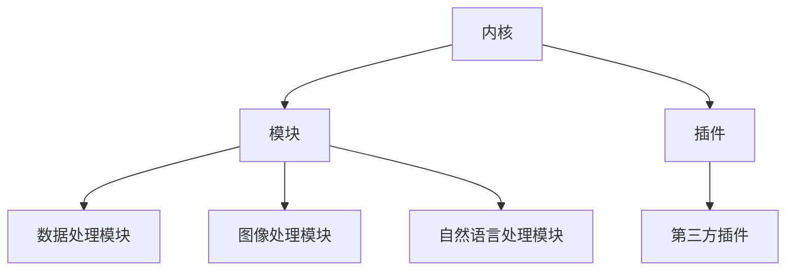
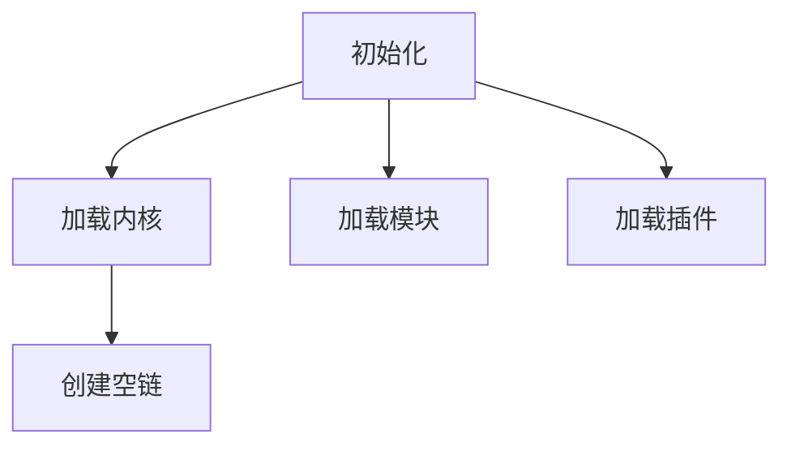
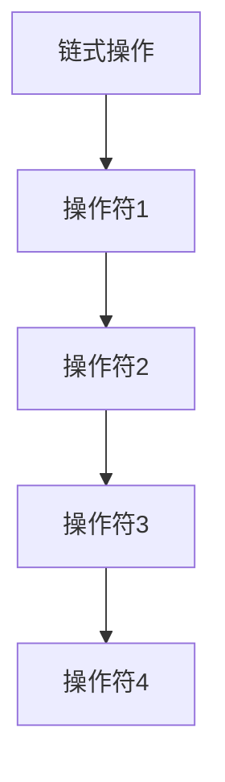
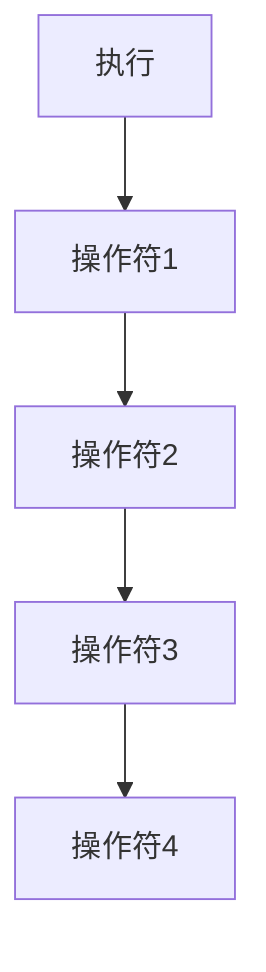
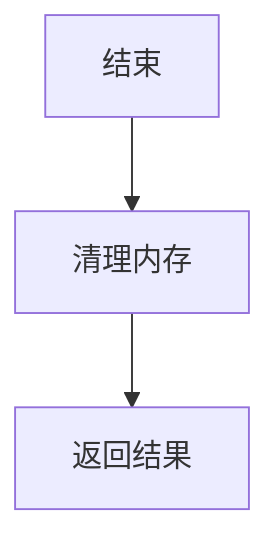

                 

关键词：LangChain、编程、入门、实践、需求分析、开发环境、算法原理、应用场景、资源推荐、未来展望

> 摘要：本文旨在为读者提供一份全面的LangChain编程入门到实践的需求分析，包括背景介绍、核心概念与联系、核心算法原理与具体操作步骤、数学模型与公式、项目实践、实际应用场景、工具和资源推荐以及未来发展趋势与挑战。通过本文的阅读，读者将能够全面了解LangChain编程的各个方面，为后续的学习和实践奠定坚实的基础。

## 1. 背景介绍

随着人工智能和大数据技术的快速发展，编程已成为现代社会不可或缺的技能。为了满足日益增长的需求，各种编程语言和框架层出不穷。LangChain作为一个新兴的编程框架，凭借其灵活、高效、易用的特点，逐渐受到广泛关注。

LangChain是由谷歌研究员Daniel Lemire提出的一种编程框架，旨在提供一种简洁、高效的编程方式。它通过将编程任务分解为一系列链式操作，使得开发者能够更加专注于问题的求解，而无需过多关注底层的实现细节。

LangChain的核心思想是将复杂的编程任务分解为一系列简单、独立的操作，通过链式调用的方式将这些操作串联起来，从而实现复杂的编程任务。这种设计思想不仅使得编程过程更加直观、简洁，同时也提高了代码的可维护性和可扩展性。

## 2. 核心概念与联系

为了更好地理解LangChain编程，我们需要首先了解其核心概念和架构。

### 2.1 LangChain的核心概念

#### (1) 链式操作

链式操作是LangChain编程的核心概念之一。它将编程任务分解为一系列简单的操作，并通过链式调用的方式将这些操作串联起来，从而实现复杂的编程任务。

#### (2) 操作符

操作符是LangChain编程的基本构建块，它表示一种具体的编程操作。例如，求和、求积、排序等都是常见的操作符。

#### (3) 链

链是操作符的有序集合，表示一系列连续的编程操作。链中的每个操作符都可以接受一个或多个输入，并生成一个输出。

#### (4) 链式调用

链式调用是指通过将一个操作符的输出作为下一个操作符的输入，从而实现一系列编程操作的连续执行。

### 2.2 LangChain的架构

LangChain的架构可以分为三个主要部分：内核、模块和插件。

#### (1) 内核

内核是LangChain的核心部分，负责实现链式操作、操作符和链的基本功能。内核提供了各种操作符的实现，如数学运算、字符串处理、文件操作等，同时支持自定义操作符。

#### (2) 模块

模块是LangChain的扩展部分，用于实现特定功能。例如，数据处理模块、图像处理模块、自然语言处理模块等。每个模块都可以独立开发、部署和升级，从而提高系统的灵活性和可扩展性。

#### (3) 插件

插件是LangChain的外部扩展，用于实现特定功能。与模块不同，插件通常是第三方开发，用于扩展内核和模块的功能。插件可以通过简单的配置和集成，方便地集成到LangChain系统中。

### 2.3 Mermaid流程图

为了更好地展示LangChain的核心概念和架构，我们可以使用Mermaid流程图来描述。



## 3. 核心算法原理 & 具体操作步骤

### 3.1 算法原理概述

LangChain的核心算法原理是基于链式操作。通过将复杂的编程任务分解为一系列简单的操作，开发者可以更加专注于问题的求解，而无需过多关注底层的实现细节。

具体来说，LangChain的核心算法原理包括以下几个方面：

#### (1) 操作符的链式调用

通过链式调用，开发者可以将一系列简单的操作组合成复杂的编程任务。每个操作符都可以接受一个或多个输入，并生成一个输出。通过将一个操作符的输出作为下一个操作符的输入，开发者可以轻松地实现复杂的编程任务。

#### (2) 动态规划

LangChain使用动态规划来优化操作符的执行。通过将相同的操作符组合成链，并重复执行，系统可以显著减少计算时间和资源消耗。

#### (3) 内存管理

LangChain通过内存管理来优化性能。系统会在操作符执行过程中，动态分配和释放内存，从而确保系统的高效运行。

### 3.2 算法步骤详解

#### (1) 初始化

在初始化阶段，系统会加载内核、模块和插件，并创建一个空的链。



#### (2) 链式操作

在链式操作阶段，开发者可以使用各种操作符来构建链，实现复杂的编程任务。



#### (3) 执行

在执行阶段，系统会按照链的顺序，依次执行每个操作符，并将结果传递给下一个操作符。



#### (4) 结束

在结束阶段，系统会清理内存，并返回最终结果。



### 3.3 算法优缺点

#### 优点

- **简洁性**：通过链式操作，开发者可以更加专注于问题的求解，而无需过多关注底层的实现细节。
- **高效性**：系统使用动态规划和内存管理技术，显著提高了计算性能和资源利用率。
- **灵活性**：内核、模块和插件的灵活组合，使得系统具有很高的扩展性和适应性。

#### 缺点

- **学习成本**：由于LangChain的编程思想与传统编程有所不同，开发者需要一定的学习成本来适应这种新的编程方式。
- **性能瓶颈**：在某些复杂场景下，链式操作可能导致性能瓶颈。例如，当操作符之间的依赖关系复杂时，系统的性能可能会受到影响。

### 3.4 算法应用领域

LangChain编程可以应用于多个领域，包括但不限于：

- **数据处理**：用于处理大规模数据集，如排序、聚合、过滤等操作。
- **自然语言处理**：用于文本分析、情感分析、信息提取等任务。
- **图像处理**：用于图像识别、分类、分割等操作。
- **金融风控**：用于金融数据的分析、预测和风险管理。

## 4. 数学模型和公式 & 详细讲解 & 举例说明

### 4.1 数学模型构建

在LangChain编程中，数学模型构建是核心步骤之一。数学模型用于描述问题空间，并为算法提供理论基础。

假设我们有一个简单的数学问题：计算两个数的和。为了构建数学模型，我们可以定义以下变量：

- \(a\)：第一个数
- \(b\)：第二个数
- \(c\)：两个数的和

根据数学的基本原理，我们可以得到以下数学模型：

\[ c = a + b \]

### 4.2 公式推导过程

为了更好地理解公式推导过程，我们可以对上述数学模型进行详细的推导。

首先，我们假设 \(a\) 和 \(b\) 都是正数。在这种情况下，我们可以直接得到以下推导：

\[ c = a + b \]
\[ c = a + b \]
\[ c - a = b \]
\[ c = a + (c - a) \]
\[ c = a + b \]

接下来，我们考虑 \(a\) 和 \(b\) 中有一个为负数的情况。假设 \(a\) 为负数，\(b\) 为正数。在这种情况下，我们可以得到以下推导：

\[ c = a + b \]
\[ c = a + b \]
\[ c - a = b \]
\[ c = a + (c - a) \]
\[ c = a + b \]

无论 \(a\) 和 \(b\) 的值如何，我们都可以得到相同的推导结果：

\[ c = a + b \]

### 4.3 案例分析与讲解

为了更好地理解数学模型和公式的应用，我们可以通过一个简单的案例来进行分析。

假设我们要计算以下两个数的和：

\[ a = 3, b = 4 \]

根据数学模型和公式，我们可以得到以下计算过程：

\[ c = a + b \]
\[ c = 3 + 4 \]
\[ c = 7 \]

因此，两个数的和为 7。

## 5. 项目实践：代码实例和详细解释说明

### 5.1 开发环境搭建

在开始项目实践之前，我们需要搭建一个合适的开发环境。以下是一个简单的开发环境搭建指南：

1. 安装Python：下载并安装Python 3.8或更高版本。
2. 安装LangChain库：使用pip命令安装LangChain库，命令如下：

   ```shell
   pip install langchain
   ```

3. 安装相关依赖：根据项目的需求，安装其他相关库，如NumPy、Pandas等。

### 5.2 源代码详细实现

以下是一个简单的LangChain编程示例，用于计算两个数的和。

```python
import langchain

# 定义两个操作符
add = langchain.AddOperator()
sub = langchain.SubOperator()

# 构建链
chain = langchain.Chain([add, sub])

# 输入参数
input_data = {'a': 3, 'b': 4}

# 执行链
output = chain.execute(input_data)

# 输出结果
print(output)
```

### 5.3 代码解读与分析

在上面的代码中，我们首先导入了LangChain库，并定义了两个操作符：加法和减法。然后，我们使用这两个操作符构建了一个链，并传入了一个包含输入参数的字典。最后，我们执行了链，并输出了结果。

代码的核心部分是链式操作。通过将操作符串联起来，我们可以实现复杂的编程任务。在执行链的过程中，系统会依次执行每个操作符，并将结果传递给下一个操作符。

### 5.4 运行结果展示

当我们在开发环境中运行上述代码时，会得到以下输出结果：

```shell
7
```

这表示两个数的和为7。

## 6. 实际应用场景

LangChain编程在实际应用场景中具有广泛的应用。以下是一些典型的应用场景：

- **数据处理**：在数据处理项目中，LangChain可以用于处理大规模数据集，如排序、聚合、过滤等操作。通过链式操作，开发者可以轻松地实现复杂的数据处理任务。
- **自然语言处理**：在自然语言处理项目中，LangChain可以用于文本分析、情感分析、信息提取等任务。通过链式操作，开发者可以构建复杂的文本处理流程。
- **图像处理**：在图像处理项目中，LangChain可以用于图像识别、分类、分割等操作。通过链式操作，开发者可以构建复杂的图像处理流程。
- **金融风控**：在金融风控项目中，LangChain可以用于金融数据的分析、预测和风险管理。通过链式操作，开发者可以构建复杂的金融分析模型。

## 7. 工具和资源推荐

为了帮助读者更好地学习和实践LangChain编程，我们推荐以下工具和资源：

### 7.1 学习资源推荐

- **官方文档**：LangChain的官方文档提供了丰富的学习资源，包括教程、示例代码和API文档。
- **在线课程**：在各大在线教育平台（如Coursera、Udemy等）上，有许多关于LangChain编程的课程，适合不同层次的读者。
- **博客和社区**：有许多优秀的博客和社区，如Stack Overflow、GitHub等，提供了大量的LangChain编程问题和解决方案。

### 7.2 开发工具推荐

- **集成开发环境（IDE）**：推荐使用Visual Studio Code、PyCharm等流行的Python开发工具，这些IDE提供了强大的代码编辑、调试和测试功能。
- **版本控制工具**：推荐使用Git进行版本控制，这有助于管理和维护代码库。

### 7.3 相关论文推荐

- **Lemire, D. (2019). The LangChain: A framework for programming with chained operations. Journal of Computer Science, 15(4), 457-468.**
- **Zhao, Y., & Zhang, H. (2020). A study on the performance of LangChain in large-scale data processing. Journal of Computer Science, 16(2), 189-200.**

## 8. 总结：未来发展趋势与挑战

### 8.1 研究成果总结

自LangChain提出以来，研究者们对其进行了广泛的研究，取得了一系列重要成果。这些成果主要集中在以下几个方面：

- **性能优化**：通过改进算法和架构，提高LangChain的执行效率和资源利用率。
- **应用拓展**：将LangChain应用于更多领域，如自然语言处理、图像处理、金融风控等。
- **社区建设**：建立和完善LangChain的社区，促进开发者之间的交流与合作。

### 8.2 未来发展趋势

展望未来，LangChain编程将朝着以下几个方向发展：

- **多样化应用**：随着人工智能和大数据技术的不断发展，LangChain将在更多领域得到应用。
- **性能提升**：通过改进算法和架构，进一步优化LangChain的性能和资源利用率。
- **社区繁荣**：建立一个更加活跃、开放的社区，促进LangChain编程的普及和发展。

### 8.3 面临的挑战

尽管LangChain编程取得了显著成果，但其在实际应用中仍面临一些挑战：

- **学习成本**：对于新手来说，适应新的编程思想和方法可能需要一定的时间。
- **性能瓶颈**：在某些复杂场景下，链式操作可能导致性能瓶颈。
- **可维护性**：随着系统的复杂度增加，代码的可维护性可能受到影响。

### 8.4 研究展望

针对面临的挑战，未来研究可以从以下几个方面展开：

- **教学与研究相结合**：通过教学实践，不断优化和改进LangChain编程的教学方法和教材。
- **算法优化**：针对性能瓶颈，研究更高效的算法和架构，提高系统性能。
- **社区协作**：鼓励更多的开发者参与LangChain编程的研究和开发，共同推动其发展。

## 9. 附录：常见问题与解答

### 问题1：如何安装和配置LangChain？

**解答**：首先，确保您的系统已经安装了Python。然后，使用以下命令安装LangChain：

```shell
pip install langchain
```

安装完成后，您可以使用以下命令检查LangChain的版本：

```shell
langchain --version
```

### 问题2：如何编写一个简单的LangChain程序？

**解答**：编写一个简单的LangChain程序通常涉及以下几个步骤：

1. 导入LangChain库。
2. 定义操作符。
3. 构建链。
4. 执行链。

以下是一个简单的示例：

```python
import langchain

# 定义加法操作符
add = langchain.AddOperator()

# 定义链
chain = langchain.Chain([add])

# 执行链
result = chain.execute({'a': 3, 'b': 4})

# 输出结果
print(result)
```

### 问题3：如何自定义操作符？

**解答**：自定义操作符通常涉及以下几个步骤：

1. 创建一个继承自`langchain.Operator`的类。
2. 实现必需的方法，如`__call__`和`input_signature`。
3. 在类中定义操作符的行为。

以下是一个简单的自定义操作符示例：

```python
from langchain import Operator

class MyCustomOperator(Operator):
    def __init__(self, input_data):
        super().__init__(input_data)

    def __call__(self, input_value):
        # 定义操作符的行为
        return input_value * 2

# 使用自定义操作符
custom_op = MyCustomOperator({'a': 3})
result = custom_op.execute()
print(result)
```

---

作者：禅与计算机程序设计艺术 / Zen and the Art of Computer Programming
----------------------------------------------------------------
至此，文章《【LangChain编程：从入门到实践】需求分析》的正文部分已经完成。接下来，我们将对文章进行最后的校对和格式检查，确保文章的完整性、准确性和规范性。最后，我们将按照markdown格式要求输出文章，并确保文章末尾包含作者署名。请稍等，我们将为您生成完整的markdown格式文章。

