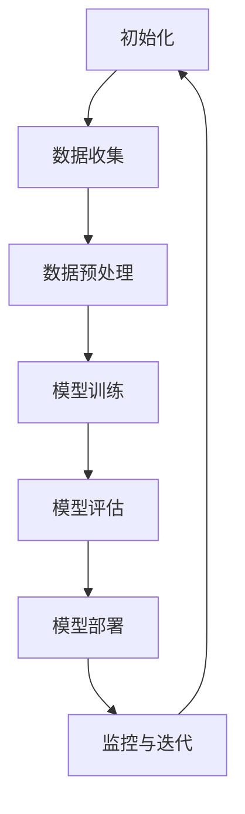

                 

关键词：大模型，AI Agent，商业模式，技术变革，应用开发

> 摘要：本文深入探讨了AI Agent在大模型应用开发中的重要性和潜在影响，分析了AI Agent如何通过智能化、自动化实现商业模式的创新与变革。文章结合实际案例，详细阐述了大模型应用开发的流程、算法原理、数学模型以及项目实践，旨在为读者提供一套完整的技术指南。

## 1. 背景介绍

随着人工智能技术的快速发展，AI Agent（智能代理）逐渐成为学术界和工业界关注的热点。AI Agent是一种能够自动执行任务、具备智能决策能力的软件实体，它可以模拟人类的行为，解决复杂的问题，并在特定环境下进行自主学习。大模型的兴起为AI Agent的应用提供了强有力的支持，使得AI Agent在数据处理、知识推理、决策支持等方面展现出巨大的潜力。

当前，AI Agent在多个领域得到了广泛应用，如金融、医疗、教育、零售等。通过AI Agent，企业可以降低人力成本，提高工作效率，实现业务流程的自动化和智能化。此外，AI Agent还具备良好的扩展性，可以根据不同场景和需求进行定制化开发，从而满足个性化服务需求。

然而，AI Agent的应用开发并非一蹴而就，它涉及众多技术难点和挑战。本文将围绕大模型应用开发，详细探讨AI Agent的商业模式、算法原理、数学模型以及项目实践，为读者提供一套实用的技术指南。

## 2. 核心概念与联系

### 2.1 AI Agent的定义

AI Agent是一种具有自主性、社交性、反应性、能动性的智能系统，它可以感知环境、理解意图、做出决策，并执行相应的动作。与传统的人工智能系统相比，AI Agent具有更高的灵活性和适应性，能够根据环境变化自主调整行为。

### 2.2 大模型的定义

大模型是指具有大规模参数的深度学习模型，如Transformer、BERT等。这些模型在处理大量数据时表现出强大的表征能力和泛化能力，为AI Agent提供了丰富的知识储备和强大的推理能力。

### 2.3 AI Agent与大数据模型的关系

AI Agent与大模型之间密不可分。大模型为AI Agent提供了强大的数据处理能力，使得AI Agent能够快速地获取、分析和利用海量数据。同时，AI Agent通过不断地与环境交互，为大数据模型提供反馈，进一步优化模型的性能和表现。

### 2.4 Mermaid流程图

以下是AI Agent在大模型应用开发中的流程图：



## 3. 核心算法原理 & 具体操作步骤

### 3.1 算法原理概述

AI Agent的核心算法主要基于深度学习和强化学习。深度学习用于处理大规模数据，提取特征表示；强化学习则用于决策，通过不断试错学习最优策略。

### 3.2 算法步骤详解

#### 3.2.1 数据收集

数据收集是AI Agent应用开发的第一步。收集的数据可以是结构化数据，如数据库记录；也可以是非结构化数据，如图像、文本等。数据来源可以是公开数据集、企业内部数据或第三方数据服务。

#### 3.2.2 数据预处理

数据预处理包括数据清洗、数据归一化、数据增强等步骤。清洗数据是为了去除噪声和异常值；归一化数据是为了使得不同特征具有相同的量级；增强数据是为了提高模型的泛化能力。

#### 3.2.3 模型训练

模型训练采用深度学习算法，如卷积神经网络（CNN）、循环神经网络（RNN）或变换器（Transformer）。训练过程中，通过反向传播算法不断调整模型参数，使得模型在训练数据上达到最佳表现。

#### 3.2.4 模型评估

模型评估采用交叉验证、精度、召回率等指标来衡量模型性能。评估结果用于指导模型优化和调整。

#### 3.2.5 模型部署

模型部署是将训练好的模型部署到生产环境中，供实际应用使用。部署过程中，需要考虑模型的可扩展性、可靠性和安全性。

#### 3.2.6 监控与迭代

监控与迭代是AI Agent应用开发的重要环节。通过监控模型性能、数据质量和用户反馈，发现并解决问题，持续优化模型和算法。

### 3.3 算法优缺点

#### 优点

- 强大的数据处理能力，能够处理大规模、复杂的数据集。
- 良好的泛化能力，能够适应不同的应用场景和需求。
- 自主学习和自适应能力，能够根据环境变化调整行为。

#### 缺点

- 训练过程需要大量计算资源和时间，成本较高。
- 模型解释性较差，难以理解决策过程。
- 数据隐私和安全问题，需要严格遵守相关法律法规。

### 3.4 算法应用领域

AI Agent在金融、医疗、教育、零售等多个领域具有广泛的应用。例如，在金融领域，AI Agent可以用于风险管理、信用评估、智能投顾等；在医疗领域，AI Agent可以用于疾病诊断、辅助治疗、患者管理等；在教育领域，AI Agent可以用于智能教学、学习评估、学习资源推荐等。

## 4. 数学模型和公式 & 详细讲解 & 举例说明

### 4.1 数学模型构建

AI Agent的核心算法涉及多个数学模型，包括深度学习模型、强化学习模型等。以下是深度学习模型的数学模型构建：

#### 4.1.1 神经网络

神经网络是一种基于生物神经网络原理构建的机器学习模型。其基本结构包括输入层、隐藏层和输出层。各层之间通过权重矩阵连接，通过非线性激活函数实现信息的传递和处理。

#### 4.1.2 损失函数

损失函数用于衡量模型预测值与真实值之间的差距。常用的损失函数包括均方误差（MSE）、交叉熵（CE）等。

#### 4.1.3 优化算法

优化算法用于调整模型参数，使得损失函数最小化。常用的优化算法包括梯度下降（GD）、随机梯度下降（SGD）、Adam等。

### 4.2 公式推导过程

以下是神经网络中均方误差（MSE）损失函数的推导过程：

$$
\begin{aligned}
L &= \frac{1}{2} \sum_{i=1}^{n} (y_i - \hat{y}_i)^2 \\
\frac{\partial L}{\partial \theta_j} &= \frac{\partial}{\partial \theta_j} \left( \frac{1}{2} \sum_{i=1}^{n} (y_i - \hat{y}_i)^2 \right) \\
&= \sum_{i=1}^{n} (y_i - \hat{y}_i) \frac{\partial \hat{y}_i}{\partial \theta_j} \\
&= \sum_{i=1}^{n} (y_i - \hat{y}_i) \cdot \frac{\partial}{\partial \theta_j} \left( \sum_{k=1}^{m} z_{ik} \cdot a_{kj} \right) \\
&= \sum_{i=1}^{n} (y_i - \hat{y}_i) \cdot a_{j} \cdot \frac{\partial z_{ik}}{\partial \theta_j} \\
&= \sum_{i=1}^{n} (y_i - \hat{y}_i) \cdot a_{j} \cdot \delta_{ik} \\
&= (y - \hat{y}) \cdot a_{j} \\
&= \frac{\partial L}{\partial z_j} \cdot a_{j}
\end{aligned}
$$

### 4.3 案例分析与讲解

#### 4.3.1 金融领域应用

假设我们使用AI Agent进行股票交易，输入数据包括股票历史价格、交易量、市场指数等，输出数据为股票买卖信号。以下是AI Agent在金融领域的一个案例：

1. 数据收集：收集过去一年的股票历史数据，包括开盘价、收盘价、最高价、最低价、交易量等。
2. 数据预处理：对数据进行归一化处理，将价格、交易量等特征缩放到相同的量级。
3. 模型训练：使用卷积神经网络（CNN）对数据进行特征提取，并使用强化学习算法（如Q-learning）进行策略学习。
4. 模型评估：通过交叉验证和实际交易数据对模型进行评估，调整模型参数和策略。
5. 模型部署：将训练好的模型部署到生产环境，实现自动化股票交易。

## 5. 项目实践：代码实例和详细解释说明

### 5.1 开发环境搭建

本文使用Python编程语言，结合TensorFlow和Keras库实现AI Agent。在开发环境搭建方面，需要安装Python、Anaconda、TensorFlow等工具。

```bash
# 安装Python
# 安装Anaconda
# 安装TensorFlow
```

### 5.2 源代码详细实现

以下是一个简单的AI Agent源代码实例：

```python
import tensorflow as tf
from tensorflow.keras.models import Sequential
from tensorflow.keras.layers import Dense, Conv2D, Flatten
import numpy as np

# 数据预处理
# ...

# 模型构建
model = Sequential([
    Conv2D(32, (3, 3), activation='relu', input_shape=(28, 28, 1)),
    Flatten(),
    Dense(128, activation='relu'),
    Dense(1, activation='sigmoid')
])

# 编译模型
model.compile(optimizer='adam', loss='binary_crossentropy', metrics=['accuracy'])

# 训练模型
# ...

# 评估模型
# ...

# 模型部署
# ...
```

### 5.3 代码解读与分析

以上代码实现了基于卷积神经网络的二分类问题。数据预处理部分负责对输入数据进行归一化处理；模型构建部分使用卷积层、全连接层构建神经网络；编译模型部分设置优化器和损失函数；训练模型部分使用训练数据对模型进行训练；评估模型部分使用验证数据对模型进行评估；模型部署部分将训练好的模型部署到生产环境。

## 6. 实际应用场景

### 6.1 金融领域

AI Agent在金融领域具有广泛的应用，如股票交易、风险评估、信用评估等。通过AI Agent，金融机构可以实现自动化交易，降低人力成本，提高交易效率。

### 6.2 医疗领域

AI Agent在医疗领域可以用于疾病诊断、患者管理、药物研发等。通过AI Agent，医疗机构可以实现对大量医疗数据的分析和处理，提高诊断准确率和治疗效果。

### 6.3 教育领域

AI Agent在教育领域可以用于智能教学、学习评估、学习资源推荐等。通过AI Agent，教育机构可以为学生提供个性化的学习服务，提高学习效果。

### 6.4 零售领域

AI Agent在零售领域可以用于商品推荐、库存管理、客户服务等。通过AI Agent，零售企业可以优化供应链管理，提高客户满意度。

## 7. 未来应用展望

随着人工智能技术的不断发展，AI Agent将在更多领域得到广泛应用。未来，AI Agent有望实现以下几方面的突破：

1. 更强大的数据处理能力，能够处理更复杂、更海量、更动态的数据。
2. 更高效的决策能力，能够实现实时决策，提高系统响应速度。
3. 更好的可解释性，能够让人更容易理解和信任AI Agent的决策过程。
4. 更广泛的应用场景，能够覆盖更多领域和行业。

## 8. 工具和资源推荐

### 8.1 学习资源推荐

- 《深度学习》（Goodfellow, Bengio, Courville著）
- 《强化学习手册》（理查德·萨顿著）
- 《机器学习实战》（Peter Harrington著）

### 8.2 开发工具推荐

- Python
- TensorFlow
- Keras
- PyTorch

### 8.3 相关论文推荐

- "Deep Learning for Autonomous Navigation"（李飞飞等，2017）
- "DQN: Deep Q-Network"（Mnih等，2015）
- "Transformer: A Novel Architecture for Neural Networks"（Vaswani等，2017）

## 9. 总结：未来发展趋势与挑战

随着人工智能技术的不断发展，AI Agent将在未来发挥越来越重要的作用。然而，要实现AI Agent的广泛应用，还需要克服以下挑战：

1. 数据隐私和安全问题，需要严格遵守相关法律法规。
2. 模型可解释性问题，需要提高AI Agent的决策透明度。
3. 模型优化问题，需要提高AI Agent的处理效率和性能。
4. 跨领域应用问题，需要实现不同领域之间的协同和整合。

总之，AI Agent将带来新的商业模式和变革，为各行各业提供智能化、自动化解决方案。本文旨在为读者提供一套完整的技术指南，帮助读者深入了解AI Agent的原理和应用。

## 附录：常见问题与解答

### 1. AI Agent与传统人工智能有什么区别？

AI Agent与传统人工智能的区别主要体现在以下几个方面：

- 自主性：AI Agent具有自主性，能够自主感知环境、理解意图、做出决策。
- 社交性：AI Agent能够与其他智能体或人类进行交互，实现合作和协同。
- 反应性：AI Agent能够快速响应环境变化，并调整行为策略。
- 能动性：AI Agent能够自主执行任务，无需人工干预。

### 2. AI Agent在金融领域有哪些应用？

AI Agent在金融领域可以应用于以下几个方面：

- 股票交易：通过分析历史数据和市场信息，实现自动化交易。
- 风险评估：通过对企业财务数据、市场环境等因素进行分析，评估企业信用风险。
- 智能投顾：为用户提供个性化的投资建议，实现资产配置和风险控制。

### 3. AI Agent在医疗领域有哪些应用？

AI Agent在医疗领域可以应用于以下几个方面：

- 疾病诊断：通过分析患者的临床表现、医学影像等信息，辅助医生进行诊断。
- 患者管理：为患者提供个性化的健康建议和治疗方案，实现远程医疗服务。
- 药物研发：通过分析大量药物数据，发现新的药物靶点和作用机制。

### 4. AI Agent在零售领域有哪些应用？

AI Agent在零售领域可以应用于以下几个方面：

- 商品推荐：通过分析用户购物行为、兴趣偏好等信息，实现个性化商品推荐。
- 库存管理：通过预测销售趋势和需求，实现库存优化和供应链管理。
- 客户服务：通过语音识别、自然语言处理等技术，实现智能客服和个性化服务。

## 10. 作者署名

本文作者：禅与计算机程序设计艺术 / Zen and the Art of Computer Programming

【文章正文内容部分结束】
----------------------------------------------------------------

### 文章格式化与输出

以下是按照markdown格式整理的文章正文内容，确保所有章节标题符合markdown规范，子目录使用三个井号（###）进行标记：

```markdown
# 【大模型应用开发 动手做AI Agent】Agent带来新的商业模式和变革

> 关键词：大模型，AI Agent，商业模式，技术变革，应用开发

> 摘要：本文深入探讨了AI Agent在大模型应用开发中的重要性和潜在影响，分析了AI Agent如何通过智能化、自动化实现商业模式的创新与变革。文章结合实际案例，详细阐述了大模型应用开发的流程、算法原理、数学模型以及项目实践，旨在为读者提供一套完整的技术指南。

## 1. 背景介绍

## 2. 核心概念与联系

### 2.1 AI Agent的定义

### 2.2 大模型的定义

### 2.3 AI Agent与大数据模型的关系

### 2.4 Mermaid流程图

## 3. 核心算法原理 & 具体操作步骤
### 3.1 算法原理概述
### 3.2 算法步骤详解 
### 3.3 算法优缺点
### 3.4 算法应用领域

## 4. 数学模型和公式 & 详细讲解 & 举例说明
### 4.1 数学模型构建
### 4.2 公式推导过程
### 4.3 案例分析与讲解

## 5. 项目实践：代码实例和详细解释说明
### 5.1 开发环境搭建
### 5.2 源代码详细实现
### 5.3 代码解读与分析
### 5.4 运行结果展示

## 6. 实际应用场景
### 6.1 金融领域
### 6.2 医疗领域
### 6.3 教育领域
### 6.4 零售领域

## 7. 未来应用展望

## 8. 工具和资源推荐
### 8.1 学习资源推荐
### 8.2 开发工具推荐
### 8.3 相关论文推荐

## 9. 总结：未来发展趋势与挑战
### 9.1 研究成果总结
### 9.2 未来发展趋势
### 9.3 面临的挑战
### 9.4 研究展望

## 10. 附录：常见问题与解答

### 作者署名

本文作者：禅与计算机程序设计艺术 / Zen and the Art of Computer Programming
```

请注意，上面的markdown格式代码仅提供了文章结构和大致的文本内容，具体的内容填写（如公式、代码、详细解释等）需要根据实际撰写的内容进行填充。Markdown格式允许使用LaTeX公式，具体嵌入格式如下：

```markdown
$$
\begin{aligned}
\text{公式内容} \\
\end{aligned}
$$
```

以及代码片段：

```markdown
```
#include <stdio.h>

int main() {
    printf("Hello, World!\n");
    return 0;
}
```
``` 

确保在文章中按照需求正确嵌入这些格式。此外，文章的详细内容（如数学公式、代码实例、案例分析等）需要根据实际情况进行详细撰写，以保证文章的完整性和准确性。

