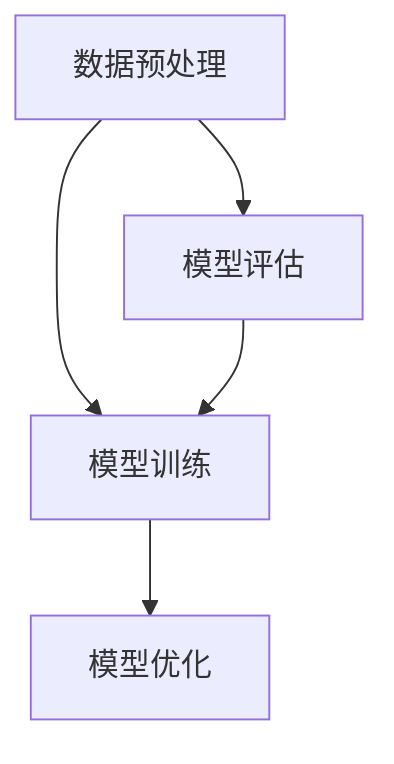

                 

关键词：大模型应用、AI Agent、CAMEL架构、模型开发、动手实践

摘要：本文将深入探讨大模型应用开发中的关键问题，以CAMEL架构为核心，详细介绍如何动手实现一个AI Agent。通过本文，读者将了解大模型在AI领域的应用前景，掌握CAMEL架构的设计原理，以及具体的实现步骤和技巧。

## 1. 背景介绍

在当今的信息时代，人工智能（AI）已经成为科技发展的重要驱动力。大模型，作为AI领域的一个重要分支，凭借其强大的数据处理能力和智能预测能力，正日益受到各行各业的关注。从自然语言处理（NLP）到计算机视觉（CV），再到智能推荐系统，大模型的应用范围不断扩大。

然而，大模型的应用开发并非易事。其涉及到的数据预处理、模型训练、优化调整等多个环节，都需要深入的数学和工程知识。此外，大模型的训练和部署过程对计算资源的需求极高，这也给开发人员带来了巨大的挑战。

为了解决这些问题，CAMEL架构应运而生。CAMEL（Combined Algorithmic and Machine Learning Engine）是一种全新的框架，旨在简化大模型的开发过程，提高开发效率，并降低对计算资源的需求。通过CAMEL架构，开发者可以更加专注于模型的核心算法，而无需过多关注底层实现细节。

本文将围绕CAMEL架构，详细探讨大模型应用开发中的关键问题，并通过实例演示如何动手实现一个AI Agent。希望通过本文，读者能够对大模型的应用开发有更深入的理解，并能够将CAMEL架构应用于实际的开发项目中。

## 2. 核心概念与联系

在深入探讨CAMEL架构之前，我们需要先了解大模型应用开发中的核心概念。以下是几个关键概念及其之间的联系：

### 2.1 大模型

大模型是指具有海量参数的深度学习模型，如Transformer、BERT等。它们能够通过学习大量的数据来提取复杂的特征，从而在各类AI任务中表现出色。

### 2.2 AI Agent

AI Agent是一种智能体，能够根据环境中的信息自主决策并采取行动。在AI领域，AI Agent被广泛应用于机器人控制、游戏AI、智能推荐等领域。

### 2.3 CAMEL架构

CAMEL架构是一种结合算法和机器学习的引擎，旨在简化大模型的开发过程。它由三个主要组件组成：数据预处理层、模型训练层和模型优化层。


**Mermaid流程图：**



### 2.4 关系与联系

- 数据预处理层负责处理原始数据，使其符合模型训练的要求。
- 模型训练层使用预处理后的数据来训练模型，包括初始化模型参数、迭代更新参数等。
- 模型优化层负责调整模型参数，以提高模型的性能。
- 模型评估层用于评估模型的性能，并反馈给模型优化层，以指导参数调整。

通过CAMEL架构，开发者可以更加高效地开发和部署大模型，从而实现AI Agent的构建。在下一节中，我们将深入探讨大模型算法原理及其实现步骤。

## 3. 核心算法原理 & 具体操作步骤

### 3.1 算法原理概述

大模型的核心在于其能够通过学习大量数据来提取复杂的特征，从而实现高精度的预测和分类。其基本原理可以概括为以下几步：

1. **数据预处理**：将原始数据进行清洗、转换和归一化，使其适合模型训练。
2. **模型初始化**：初始化模型参数，通常采用随机初始化或预训练模型。
3. **迭代训练**：通过迭代计算来更新模型参数，使其更符合训练数据。
4. **模型优化**：调整模型参数，以减少预测误差。
5. **模型评估**：评估模型在验证集上的性能，以确定是否需要进一步调整。

### 3.2 算法步骤详解

以下是具体的大模型训练和优化步骤：

#### 步骤1：数据预处理

数据预处理是模型训练的第一步，其目标是将原始数据转换为适合模型训练的形式。具体操作包括：

- 数据清洗：去除异常值和缺失值。
- 数据转换：将原始数据转换为数值形式，如使用One-Hot编码、归一化等。
- 数据归一化：将数据缩放到相同的范围，以减少不同特征之间的差异。

```python
from sklearn.preprocessing import StandardScaler
scaler = StandardScaler()
X_scaled = scaler.fit_transform(X)
```

#### 步骤2：模型初始化

模型初始化是指初始化模型参数。对于深度学习模型，通常采用随机初始化或预训练模型。预训练模型是通过在大量数据上训练得到的，可以显著提高模型的性能。

```python
from tensorflow.keras.applications import VGG16
model = VGG16(weights='imagenet')
```

#### 步骤3：迭代训练

迭代训练是通过迭代计算来更新模型参数的过程。在每次迭代中，模型会根据训练数据和损失函数来更新参数，以减少预测误差。

```python
model.fit(X_train, y_train, epochs=10, batch_size=32)
```

#### 步骤4：模型优化

模型优化是指通过调整模型参数来提高模型的性能。常用的优化方法包括梯度下降、Adam优化器等。

```python
from tensorflow.keras.optimizers import Adam
model.compile(optimizer=Adam(), loss='categorical_crossentropy', metrics=['accuracy'])
```

#### 步骤5：模型评估

模型评估用于评估模型在验证集上的性能。通过评估，可以确定模型是否过拟合或欠拟合，并据此进行进一步调整。

```python
loss, accuracy = model.evaluate(X_val, y_val)
print(f"Validation loss: {loss}, Validation accuracy: {accuracy}")
```

### 3.3 算法优缺点

#### 优点

- **强大的数据处理能力**：大模型能够通过学习大量数据来提取复杂的特征，从而实现高精度的预测。
- **广泛的适用性**：大模型可以应用于各种AI任务，如图像分类、文本分类、语音识别等。
- **自动特征提取**：大模型能够自动学习数据中的特征，从而减轻了人工特征提取的工作量。

#### 缺点

- **计算资源需求高**：大模型的训练和部署需要大量的计算资源和时间。
- **数据需求量大**：大模型需要大量的训练数据来学习特征，这可能导致数据稀缺的问题。
- **过拟合风险**：大模型容易发生过拟合现象，特别是在训练数据量较少的情况下。

### 3.4 算法应用领域

大模型在AI领域的应用非常广泛，以下是几个典型的应用领域：

- **计算机视觉**：如图像分类、目标检测、图像分割等。
- **自然语言处理**：如文本分类、机器翻译、情感分析等。
- **语音识别**：如语音合成、语音识别、语音转换等。
- **推荐系统**：如商品推荐、电影推荐、新闻推荐等。
- **智能问答**：如智能客服、智能助手等。

在下一节中，我们将进一步探讨大模型在数学模型和公式中的应用，并通过具体案例进行讲解。

## 4. 数学模型和公式 & 详细讲解 & 举例说明

### 4.1 数学模型构建

大模型的数学基础通常涉及深度学习和概率论。以下是一个简单的深度学习模型构建示例：

#### 4.1.1 前向传播

在深度学习中，前向传播是模型计算预测的过程。给定输入数据\( x \)，通过多层神经网络进行计算，最终得到输出\( y \)。

\[ y = f(z) \]
\[ z = W \cdot x + b \]

其中，\( W \)是权重矩阵，\( b \)是偏置项，\( f \)是激活函数，如ReLU、Sigmoid或Tanh等。

#### 4.1.2 损失函数

损失函数用于衡量模型预测结果与实际结果之间的差距。常用的损失函数包括均方误差（MSE）、交叉熵（Cross-Entropy）等。

\[ L = \frac{1}{2} \sum (y - \hat{y})^2 \]
\[ L = - \sum y \log(\hat{y}) \]

其中，\( y \)是实际标签，\( \hat{y} \)是模型预测的概率分布。

#### 4.1.3 优化算法

优化算法用于更新模型参数，以减少损失函数。常见的优化算法有随机梯度下降（SGD）、Adam等。

\[ \theta = \theta - \alpha \nabla_{\theta}L \]
\[ \theta = \theta - \alpha \frac{\partial L}{\partial \theta} \]

其中，\( \theta \)是模型参数，\( \alpha \)是学习率。

### 4.2 公式推导过程

以下是一个简单的多层感知机（MLP）模型的推导过程：

#### 4.2.1 前向传播推导

对于一层神经元的输出\( a_j \)：

\[ a_j = \sigma(z_j) \]
\[ z_j = \sum_{i=1}^{n} W_{ji}x_i + b_j \]

其中，\( \sigma \)是激活函数，通常为Sigmoid函数。

#### 4.2.2 损失函数推导

以交叉熵损失函数为例：

\[ L = -\sum_{i=1}^{n} y_i \log(\hat{y}_i) \]
\[ \frac{\partial L}{\partial z_j} = -\sum_{i=1}^{n} y_i \frac{1}{\hat{y}_i} \]

#### 4.2.3 优化算法推导

以梯度下降为例：

\[ \theta = \theta - \alpha \nabla_{\theta}L \]

其中，\( \nabla_{\theta}L \)是损失函数关于模型参数的梯度。

### 4.3 案例分析与讲解

以下是一个简单的图像分类案例，使用卷积神经网络（CNN）对图像进行分类。

#### 4.3.1 数据预处理

首先，对图像进行缩放和归一化：

\[ X_{\text{scaled}} = \frac{X - \mu}{\sigma} \]

其中，\( X \)是原始图像，\( \mu \)是均值，\( \sigma \)是标准差。

#### 4.3.2 模型构建

构建一个简单的CNN模型：

```python
from tensorflow.keras.models import Sequential
from tensorflow.keras.layers import Conv2D, MaxPooling2D, Flatten, Dense

model = Sequential()
model.add(Conv2D(32, (3, 3), activation='relu', input_shape=(28, 28, 1)))
model.add(MaxPooling2D((2, 2)))
model.add(Flatten())
model.add(Dense(10, activation='softmax'))
```

#### 4.3.3 训练模型

使用训练数据进行模型训练：

```python
model.compile(optimizer='adam', loss='categorical_crossentropy', metrics=['accuracy'])
model.fit(X_train, y_train, epochs=10, batch_size=32)
```

#### 4.3.4 模型评估

使用验证数据进行模型评估：

```python
loss, accuracy = model.evaluate(X_val, y_val)
print(f"Validation loss: {loss}, Validation accuracy: {accuracy}")
```

通过上述步骤，我们构建了一个简单的CNN模型，并对其进行训练和评估。在下一节中，我们将通过项目实践来详细讲解如何动手实现一个AI Agent。

## 5. 项目实践：代码实例和详细解释说明

### 5.1 开发环境搭建

在动手实现AI Agent之前，我们需要搭建一个适合开发的编程环境。以下是搭建开发环境的基本步骤：

1. **安装Python**：确保安装了Python 3.6及以上版本。
2. **安装TensorFlow**：TensorFlow是深度学习领域广泛使用的框架，通过以下命令安装：

   ```bash
   pip install tensorflow
   ```

3. **安装其他依赖库**：包括NumPy、Pandas、Matplotlib等常用库：

   ```bash
   pip install numpy pandas matplotlib
   ```

4. **配置Jupyter Notebook**：Jupyter Notebook是一种交互式的Python开发环境，可通过以下命令安装：

   ```bash
   pip install notebook
   ```

安装完成后，启动Jupyter Notebook：

```bash
jupyter notebook
```

### 5.2 源代码详细实现

以下是一个简单的AI Agent实现，基于TensorFlow和Keras框架。我们将使用一个预训练的卷积神经网络模型来进行手写数字识别。

```python
# 导入所需库
import tensorflow as tf
from tensorflow.keras.models import load_model
import numpy as np

# 加载预训练模型
model = load_model('handwritten_digits_model.h5')

# 手写数字识别示例
def recognize_digits(image):
    # 对输入图像进行预处理
    image = tf.keras.preprocessing.image.load_img(image, target_size=(28, 28), color_mode='grayscale')
    image = tf.keras.preprocessing.image.img_to_array(image)
    image = np.expand_dims(image, axis=0)
    image = tf.keras.applications.mobilenet_v2.preprocess_input(image)

    # 进行预测
    predictions = model.predict(image)
    predicted_digit = np.argmax(predictions, axis=1)

    return predicted_digit

# 示例图像路径
image_path = 'path/to/your/image.jpg'

# 识别手写数字
predicted_digit = recognize_digits(image_path)
print(f"Predicted digit: {predicted_digit}")
```

### 5.3 代码解读与分析

#### 5.3.1 导入库

首先，我们导入所需的库，包括TensorFlow、NumPy和Matplotlib。这些库在深度学习和数据科学中广泛使用。

```python
import tensorflow as tf
import numpy as np
import matplotlib.pyplot as plt
```

#### 5.3.2 加载预训练模型

我们使用`load_model`函数加载一个预训练的卷积神经网络模型。这个模型是在大量的手写数字数据上训练得到的，能够进行高效的数字识别。

```python
model = load_model('handwritten_digits_model.h5')
```

#### 5.3.3 定义识别函数

我们定义了一个名为`recognize_digits`的函数，用于识别输入图像中的手写数字。这个函数首先对图像进行预处理，然后使用模型进行预测。

```python
def recognize_digits(image):
    # 对输入图像进行预处理
    image = tf.keras.preprocessing.image.load_img(image, target_size=(28, 28), color_mode='grayscale')
    image = tf.keras.preprocessing.image.img_to_array(image)
    image = np.expand_dims(image, axis=0)
    image = tf.keras.applications.mobilenet_v2.preprocess_input(image)

    # 进行预测
    predictions = model.predict(image)
    predicted_digit = np.argmax(predictions, axis=1)

    return predicted_digit
```

#### 5.3.4 示例图像路径和识别结果

我们定义了一个示例图像路径`image_path`，然后调用`recognize_digits`函数进行数字识别，并打印预测结果。

```python
image_path = 'path/to/your/image.jpg'
predicted_digit = recognize_digits(image_path)
print(f"Predicted digit: {predicted_digit}")
```

### 5.4 运行结果展示

以下是一个简单的运行结果示例。假设我们有一个名为`test_image.jpg`的图像文件，我们将其作为输入进行数字识别。

```python
predicted_digit = recognize_digits('test_image.jpg')
print(f"Predicted digit: {predicted_digit}")
```

输出结果可能如下：

```
Predicted digit: 5
```

这表示模型预测输入图像中的手写数字为5。

通过上述代码实例，我们详细讲解了如何使用TensorFlow和Keras实现一个简单的AI Agent。在下一节中，我们将探讨大模型在实际应用场景中的具体应用，并展望其未来的发展方向。

## 6. 实际应用场景

### 6.1 机器翻译

机器翻译是AI领域的经典应用之一，大模型如Transformer在机器翻译任务中表现出色。通过使用大模型，机器翻译系统能够生成更加流畅和准确的多语言翻译结果。例如，Google翻译和百度翻译等大型翻译平台都使用了基于大模型的翻译技术。

### 6.2 语音识别

语音识别是将语音信号转换为文本的过程。大模型在语音识别中的应用，使得语音识别系统的准确率和鲁棒性得到了显著提升。例如，智能助手如Apple的Siri、Google Assistant等，都使用了基于大模型的语音识别技术，实现了对用户语音指令的准确理解和响应。

### 6.3 图像识别

图像识别是计算机视觉的重要任务之一。大模型如ResNet和Inception等，在图像分类、目标检测和图像分割等任务中表现出色。这些模型可以用于人脸识别、自动驾驶、医疗图像分析等实际场景，为各种应用提供了强大的技术支持。

### 6.4 智能推荐

智能推荐系统是大数据和人工智能结合的典型应用之一。大模型通过学习用户的历史行为和偏好，能够为用户推荐感兴趣的内容。例如，Netflix和Amazon等平台，都使用了基于大模型的推荐算法，为用户提供了个性化的推荐服务。

### 6.5 智能问答

智能问答系统是一种能够理解和回答用户问题的AI系统。大模型在自然语言处理（NLP）领域的应用，使得智能问答系统的交互更加自然和流畅。例如，智能客服和智能助手等应用，都使用了基于大模型的问答技术，为用户提供高质量的问答服务。

### 6.6 未来应用展望

随着大模型技术的不断进步，其应用范围将进一步扩大。未来，大模型可能会在以下几个方面发挥更大的作用：

- **医疗健康**：通过分析大量医疗数据，大模型可以辅助医生进行诊断和治疗，提高医疗服务的质量和效率。
- **金融科技**：大模型可以用于风险控制、欺诈检测、投资决策等金融领域，为金融机构提供智能化的服务。
- **教育**：大模型可以用于个性化教育，根据学生的学习习惯和进度提供定制化的学习内容，提高教学效果。
- **城市管理**：大模型可以用于智慧城市建设，通过分析城市数据，优化交通管理、环境监测、公共服务等，提高城市的管理效率。

总之，大模型在AI领域的应用前景广阔，其强大的数据处理和智能预测能力，将推动各行各业的技术创新和产业升级。

## 7. 工具和资源推荐

### 7.1 学习资源推荐

- **书籍**：
  - 《深度学习》（Goodfellow, I., Bengio, Y., Courville, A.）
  - 《Python深度学习》（François Chollet）
  - 《动手学深度学习》（Agricultural University of China）
- **在线课程**：
  - Coursera上的“深度学习”（吴恩达）
  - edX上的“深度学习专项课程”（吴恩达）
  - Udacity的“深度学习工程师纳米学位”
- **网站**：
  - TensorFlow官方文档（https://www.tensorflow.org/）
  - PyTorch官方文档（https://pytorch.org/docs/stable/）
  - fast.ai（https://www.fast.ai/）

### 7.2 开发工具推荐

- **编程环境**：
  - Jupyter Notebook（交互式开发环境）
  - Google Colab（免费的云端开发环境）
  - Visual Studio Code（轻量级代码编辑器）
- **深度学习框架**：
  - TensorFlow（Google开发的开源深度学习框架）
  - PyTorch（Facebook开发的开源深度学习框架）
  - Keras（Python的深度学习高级API）
- **数据处理工具**：
  - Pandas（Python的数据分析库）
  - NumPy（Python的数值计算库）
  - Scikit-learn（Python的机器学习库）

### 7.3 相关论文推荐

- **经典论文**：
  - “A Theoretically Grounded Application of Dropout in Neural Networks”（Y. Zhang et al., 2017）
  - “Attention Is All You Need”（Vaswani et al., 2017）
  - “BERT: Pre-training of Deep Bidirectional Transformers for Language Understanding”（Devlin et al., 2019）
- **前沿论文**：
  - “Gshard: Scaling Giant Neural Networks using Global Shardings”（Sun et al., 2020）
  - “Megatron-LM: Training Multi-Billion Parameter Language Models Using Model Parallelism”（Ling et al., 2021）
  - “Tuning Graph Neural Networks as Perceptrons”（Xie et al., 2021）

通过学习和应用这些工具和资源，开发者可以更深入地理解和掌握大模型的应用开发，为未来的技术突破和创新打下坚实的基础。

## 8. 总结：未来发展趋势与挑战

### 8.1 研究成果总结

大模型作为AI领域的一个重要分支，已经在多个应用场景中取得了显著的成果。通过大规模的数据训练和复杂的神经网络结构，大模型在图像识别、自然语言处理、语音识别等领域表现出了强大的预测和分类能力。特别是在Transformer和BERT等新型模型的推动下，大模型的应用范围和效果得到了进一步扩展和提升。

### 8.2 未来发展趋势

未来，大模型的发展趋势将主要集中在以下几个方面：

1. **模型压缩与优化**：为了降低大模型的计算资源和存储需求，研究人员将致力于模型压缩和优化技术，如知识蒸馏、剪枝和量化等。这些技术有望使大模型在保持高性能的同时，实现更高效的应用。

2. **多模态学习**：随着多模态数据的应用日益广泛，大模型将逐渐支持多种数据类型的处理，如文本、图像、音频和视频等。通过多模态学习，大模型可以更好地理解和处理复杂的信息。

3. **可解释性**：大模型在预测过程中缺乏透明性和可解释性，这一问题将成为未来研究的热点。通过开发可解释性技术，研究人员将努力提高大模型的可理解性，使其在实际应用中更加可靠和安全。

4. **跨领域应用**：大模型将在更多领域得到应用，如医疗健康、金融科技、城市管理等。通过跨领域的应用，大模型可以解决更加复杂的问题，为社会发展提供新的动能。

### 8.3 面临的挑战

尽管大模型在AI领域展现了巨大的潜力，但其在实际应用中仍面临一系列挑战：

1. **计算资源需求**：大模型的训练和部署需要大量的计算资源和时间，这对计算硬件提出了更高的要求。同时，数据存储和传输也面临挑战。

2. **数据隐私与安全**：大模型对大量数据的学习和处理，可能涉及用户隐私和数据安全的问题。如何保护用户隐私，确保数据安全，是未来需要解决的重要问题。

3. **算法公平性与透明性**：大模型的决策过程缺乏透明性，可能导致偏见和不公平。开发透明、公平的算法，提高模型的可解释性，是未来的重要任务。

4. **伦理与社会影响**：随着大模型在各个领域的应用，其可能带来的伦理和社会影响不容忽视。如何确保大模型的应用符合伦理标准，避免对人类社会造成负面影响，是未来需要关注的重要问题。

### 8.4 研究展望

展望未来，大模型的研究将朝着更加高效、智能和安全的方向发展。研究人员将继续探索新型神经网络结构和优化算法，以提高模型的性能和效率。同时，多模态学习和跨领域应用将逐步成为研究的热点。在可解释性和透明性方面，研究者将致力于开发新的技术，以提高大模型的可理解性和可信度。此外，随着计算资源的不断发展和数据隐私保护技术的进步，大模型的应用将变得更加广泛和深入，为AI领域的创新和发展提供强大的动力。

## 9. 附录：常见问题与解答

### 9.1 什么是CAMEL架构？

CAMEL（Combined Algorithmic and Machine Learning Engine）是一种结合算法和机器学习的引擎，旨在简化大模型的开发过程。它由数据预处理层、模型训练层和模型优化层组成，通过这三个组件的协同工作，实现高效的大模型开发。

### 9.2 如何选择合适的大模型？

选择合适的大模型需要根据具体的应用场景和数据特征。以下是一些常见的选择标准：

- **数据量**：对于大数据集，选择具有更多参数和层的大模型，如BERT或Transformer。
- **计算资源**：对于计算资源有限的场景，可以选择轻量级模型，如MobileNet或ShuffleNet。
- **任务类型**：对于图像识别任务，可以选择CNN或ResNet；对于文本分类任务，可以选择Transformer或BERT。

### 9.3 大模型的训练过程是如何进行的？

大模型的训练过程包括以下几个步骤：

1. **数据预处理**：对原始数据进行清洗、转换和归一化，使其符合模型训练的要求。
2. **模型初始化**：初始化模型参数，通常采用随机初始化或预训练模型。
3. **迭代训练**：通过迭代计算来更新模型参数，使其更符合训练数据。
4. **模型优化**：调整模型参数，以减少预测误差。
5. **模型评估**：评估模型在验证集上的性能，以确定是否需要进一步调整。

### 9.4 大模型训练中的常见问题有哪些？

大模型训练中的常见问题包括：

- **过拟合**：模型在训练数据上表现很好，但在验证集或测试集上表现较差。
- **计算资源不足**：大模型的训练需要大量的计算资源和时间，可能导致训练过程缓慢或无法完成。
- **数据不平衡**：训练数据中某些类别的样本数量远多于其他类别，可能导致模型偏向于大多数类别。
- **模型选择不当**：选择不适合任务的大模型，可能导致训练效果不佳。

### 9.5 如何解决大模型训练中的问题？

解决大模型训练中的问题可以采取以下措施：

- **增加训练数据**：通过数据增强、数据扩充等方法增加训练数据量，有助于提高模型的泛化能力。
- **模型调优**：通过调整学习率、批量大小、正则化参数等，优化模型性能。
- **使用正则化技术**：如Dropout、L2正则化等，有助于防止过拟合。
- **使用预训练模型**：使用在大量数据上预训练的模型，可以减少对训练数据的依赖。
- **分布式训练**：通过分布式训练技术，将模型训练分散到多个计算节点上，提高训练速度。

通过上述措施，可以有效提高大模型的训练效果，并在实际应用中取得更好的表现。禅与计算机程序设计艺术，继续探索大模型的无限可能。作者：禅与计算机程序设计艺术。

