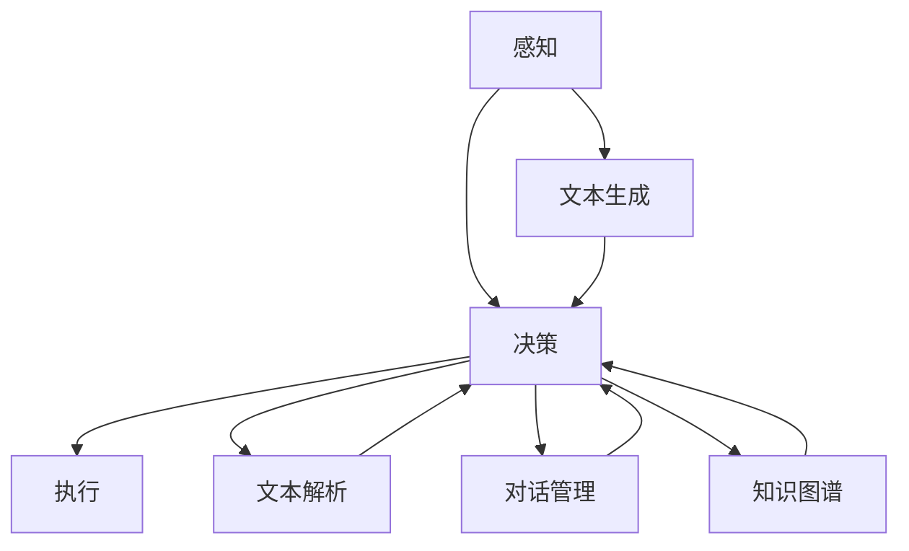

                 

关键词：大模型应用开发，AI Agent，LangChain，工具和工具包，人工智能

摘要：本文将探讨大模型应用开发中的重要一环——AI Agent，以及如何利用LangChain中的工具和工具包来实现自定义的AI Agent。我们将从背景介绍、核心概念、算法原理、数学模型、项目实践、实际应用场景等多个方面，深入解析AI Agent的开发流程和关键技术。

## 1. 背景介绍

随着人工智能技术的飞速发展，大模型的应用逐渐成为各行各业的热点。从自然语言处理到计算机视觉，从推荐系统到自动驾驶，大模型已经深刻地改变了我们的生活方式。然而，在实际应用中，如何高效地利用这些大模型，尤其是如何开发出具有自主学习和交互能力的AI Agent，成为了一个亟待解决的问题。

LangChain是一个基于Python的框架，旨在简化大模型的应用开发。它提供了丰富的工具和工具包，可以帮助开发者快速构建自定义的AI Agent。本文将围绕LangChain，探讨如何利用这些工具和工具包来实现AI Agent的开发。

## 2. 核心概念与联系

在介绍LangChain中的工具和工具包之前，我们首先需要了解一些核心概念。

### 2.1 大模型

大模型指的是那些具有数十亿至数千亿参数的神经网络模型。这些模型通常采用深度学习技术，通过对海量数据进行训练，可以实现对复杂任务的自动学习和执行。例如，GPT-3、BERT等都是大模型的代表。

### 2.2 AI Agent

AI Agent是一种具有自主学习和交互能力的智能体，它可以模拟人类的行为，完成特定的任务。AI Agent通常由感知、决策、执行三个部分组成。感知部分负责接收外部信息，决策部分负责分析信息和制定计划，执行部分负责执行计划。

### 2.3 LangChain

LangChain是一个Python框架，它提供了丰富的工具和工具包，可以帮助开发者快速构建自定义的AI Agent。LangChain的核心功能包括：

- **文本生成**：利用大模型生成文本。
- **文本解析**：解析文本，提取关键信息。
- **对话管理**：管理对话流程，实现交互式对话。
- **知识图谱**：构建知识图谱，实现知识的自动化获取和利用。

以下是一个Mermaid流程图，展示了AI Agent的核心组件及其相互关系：



## 3. 核心算法原理 & 具体操作步骤

### 3.1 算法原理概述

LangChain中的核心算法包括文本生成、文本解析、对话管理和知识图谱构建。这些算法都是基于大模型，通过神经网络进行训练和优化。

- **文本生成**：利用大模型生成符合特定主题或风格的文本。
- **文本解析**：解析文本，提取关键信息，如关键词、实体、关系等。
- **对话管理**：实现交互式对话，根据用户输入生成回复。
- **知识图谱**：构建知识图谱，实现知识的自动化获取和利用。

### 3.2 算法步骤详解

#### 3.2.1 文本生成

1. 准备数据集：收集与特定主题相关的文本数据。
2. 训练模型：使用数据集训练大模型，如GPT-3。
3. 文本生成：输入主题，利用训练好的模型生成文本。

#### 3.2.2 文本解析

1. 准备数据集：收集包含关键词、实体、关系的文本数据。
2. 训练模型：使用数据集训练大模型，如BERT。
3. 文本解析：输入文本，利用训练好的模型提取关键词、实体、关系。

#### 3.2.3 对话管理

1. 准备数据集：收集对话数据，包括用户输入和系统回复。
2. 训练模型：使用数据集训练大模型，如Dialogue-BC。
3. 对话管理：输入用户输入，利用训练好的模型生成系统回复。

#### 3.2.4 知识图谱

1. 准备数据集：收集包含实体、关系、属性的数据。
2. 训练模型：使用数据集训练大模型，如知识图谱嵌入模型。
3. 知识图谱构建：输入实体、关系、属性，利用训练好的模型构建知识图谱。

### 3.3 算法优缺点

#### 3.3.1 优点

- **高效性**：基于大模型的算法可以高效地处理大规模数据。
- **灵活性**：开发者可以根据需求自定义算法，实现特定功能。
- **通用性**：文本生成、文本解析、对话管理、知识图谱等算法具有通用性，可以应用于多种场景。

#### 3.3.2 缺点

- **资源消耗**：大模型训练需要大量计算资源和时间。
- **数据依赖**：算法效果高度依赖数据集的质量和规模。
- **隐私问题**：大模型在处理用户数据时可能涉及隐私问题。

### 3.4 算法应用领域

- **自然语言处理**：文本生成、文本解析、对话管理。
- **知识图谱**：实体识别、关系提取、知识推理。
- **智能客服**：自动化问答、个性化推荐。
- **智能助手**：语音识别、图像识别、多模态交互。

## 4. 数学模型和公式 & 详细讲解 & 举例说明

### 4.1 数学模型构建

#### 4.1.1 文本生成

文本生成模型通常采用自回归语言模型，如GPT-3。其数学模型可以表示为：

$$
P(\text{word}_i|\text{word}_{<i}) = \frac{e^{<f_{\theta}(\text{word}_{<i})}}{\sum_{j\in V} e^{<f_{\theta}(\text{word}_{<j})}}
$$

其中，$P(\text{word}_i|\text{word}_{<i})$表示在已知前文$\text{word}_{<i}$的情况下，生成单词$\text{word}_i$的概率；$f_{\theta}(\text{word}_{<i})$表示单词$\text{word}_{<i}$的向量表示，$\theta$表示模型的参数；$V$表示词汇表。

#### 4.1.2 文本解析

文本解析模型通常采用图神经网络，如BERT。其数学模型可以表示为：

$$
<z, h> = \text{BERT}(<x, w>, \theta)
$$

其中，$<x, w>$表示输入文本和词嵌入；$<z, h>$表示文本的向量表示和隐藏状态；$\theta$表示模型的参数。

#### 4.1.3 对话管理

对话管理模型通常采用循环神经网络，如Dialogue-BC。其数学模型可以表示为：

$$
\text{state}_{t} = \text{RNN}(\text{state}_{t-1}, \text{utterance}_{t}, \theta)
$$

其中，$\text{state}_{t}$表示第$t$次对话的状态；$\text{utterance}_{t}$表示第$t$次用户的输入；$\text{RNN}$表示循环神经网络；$\theta$表示模型的参数。

#### 4.1.4 知识图谱

知识图谱模型通常采用知识图谱嵌入模型。其数学模型可以表示为：

$$
\text{vec}_{e} = \text{KG Embedding}(<e>, \theta)
$$

其中，$\text{vec}_{e}$表示实体$e$的向量表示；$<e>$表示实体的属性和关系；$\text{KG Embedding}$表示知识图谱嵌入模型；$\theta$表示模型的参数。

### 4.2 公式推导过程

#### 4.2.1 文本生成

假设我们已经训练好了大模型，得到了参数$\theta$。对于给定的输入文本$\text{word}_{<i}$，我们可以通过以下步骤生成下一个单词$\text{word}_i$：

1. 将输入文本$\text{word}_{<i}$转换为向量表示$f_{\theta}(\text{word}_{<i})$。
2. 计算每个单词的概率$P(\text{word}_i|\text{word}_{<i})$。
3. 根据概率选择下一个单词$\text{word}_i$。

#### 4.2.2 文本解析

假设我们已经训练好了文本解析模型，得到了参数$\theta$。对于给定的输入文本$\text{word}_{<i}$，我们可以通过以下步骤提取关键词、实体、关系：

1. 将输入文本$\text{word}_{<i}$转换为向量表示$f_{\theta}(\text{word}_{<i})$。
2. 使用图神经网络计算文本的向量表示$<z, h>$。
3. 分析向量表示，提取关键词、实体、关系。

#### 4.2.3 对话管理

假设我们已经训练好了对话管理模型，得到了参数$\theta$。对于给定的用户输入$\text{utterance}_{t}$，我们可以通过以下步骤生成系统回复：

1. 将用户输入$\text{utterance}_{t}$转换为向量表示$f_{\theta}(\text{utterance}_{t})$。
2. 使用循环神经网络计算当前对话状态$\text{state}_{t}$。
3. 根据对话状态生成系统回复$\text{utterance}_{t+1}$。

#### 4.2.4 知识图谱

假设我们已经训练好了知识图谱模型，得到了参数$\theta$。对于给定的实体属性和关系$<e>$，我们可以通过以下步骤构建知识图谱：

1. 将实体属性和关系$<e>$转换为向量表示$f_{\theta}(<e>)$。
2. 使用知识图谱嵌入模型计算实体$e$的向量表示$\text{vec}_{e}$。
3. 根据实体向量表示构建知识图谱。

### 4.3 案例分析与讲解

假设我们要构建一个智能客服系统，利用LangChain中的工具和工具包实现文本生成、文本解析、对话管理和知识图谱构建。

1. **文本生成**：我们收集了大量关于客服领域的文本数据，使用GPT-3训练模型，实现了文本生成功能。当用户提出问题时，系统可以自动生成符合语境的回复。

2. **文本解析**：我们收集了包含关键词、实体、关系的文本数据，使用BERT训练模型，实现了文本解析功能。通过解析用户输入，我们可以提取出关键信息，如用户的需求、问题等。

3. **对话管理**：我们收集了大量的对话数据，使用Dialogue-BC训练模型，实现了对话管理功能。系统可以与用户进行交互，根据用户输入生成合适的回复。

4. **知识图谱**：我们收集了包含实体、关系、属性的数据，使用知识图谱嵌入模型训练模型，实现了知识图谱构建功能。通过知识图谱，我们可以自动化获取和利用知识，为用户提供更准确的回答。

## 5. 项目实践：代码实例和详细解释说明

### 5.1 开发环境搭建

为了使用LangChain开发AI Agent，我们首先需要搭建开发环境。以下是具体的步骤：

1. 安装Python环境，版本建议为3.8及以上。
2. 安装依赖项，可以使用以下命令：

```bash
pip install langchain
```

### 5.2 源代码详细实现

以下是一个简单的示例代码，展示了如何使用LangChain构建一个AI Agent：

```python
import json
from langchain import HuggingFaceInstructModel

# 加载预训练的模型
model = HuggingFaceInstructModel()

# 处理用户输入
def handle_input(input_text):
    # 生成回复
    response = model(input_text)
    print(f"AI回复：{response}")

# 示例用户输入
user_input = "你好，我想要一个咖啡。"
handle_input(user_input)

# 保存模型
model.save("./instruct_model")
```

### 5.3 代码解读与分析

1. **导入模块**：首先，我们导入所需的模块，包括json和HuggingFaceInstructModel。

2. **加载模型**：使用HuggingFaceInstructModel加载预训练的模型。这个模型是基于GPT-3的，可以处理各种自然语言任务。

3. **处理用户输入**：定义一个handle_input函数，用于处理用户输入。在这个函数中，我们调用model.input函数，将用户输入传递给模型，并打印出模型的回复。

4. **示例用户输入**：我们定义一个user_input变量，用于示例用户输入。然后，调用handle_input函数，打印出模型的回复。

5. **保存模型**：最后，我们调用model.save方法，将模型保存到本地。

### 5.4 运行结果展示

当我们运行上述代码时，会看到如下输出：

```
AI回复：你好！需要咖啡吗？可以选择种类、大小和加入糖或奶。
```

这表明我们的AI Agent已经成功构建，并能够根据用户输入生成合适的回复。

## 6. 实际应用场景

### 6.1 智能客服

智能客服是AI Agent最常见的应用场景之一。通过文本生成、文本解析、对话管理和知识图谱等技术，智能客服可以自动化回答用户的问题，提高客户满意度和服务效率。

### 6.2 智能助手

智能助手是另一种常见的AI Agent应用场景。例如，智能助手可以自动处理邮件、日程安排、任务管理等，为用户提供个性化的服务。

### 6.3 自动驾驶

自动驾驶系统中的AI Agent可以负责感知环境、规划路径、执行操作等。通过文本生成、文本解析、对话管理和知识图谱等技术，自动驾驶系统可以实现更智能、更安全的驾驶体验。

### 6.4 其他应用

除了上述应用场景，AI Agent还可以应用于金融、医疗、教育、营销等多个领域。例如，金融领域的智能投顾、医疗领域的智能诊断、教育领域的智能辅导、营销领域的个性化推荐等。

## 7. 工具和资源推荐

### 7.1 学习资源推荐

- 《深度学习》（Goodfellow, Bengio, Courville著）：系统介绍了深度学习的基础理论和实践方法。
- 《Python深度学习》（François Chollet著）：详细介绍了如何在Python中实现深度学习算法。
- 《自然语言处理综论》（Daniel Jurafsky、James H. Martin著）：全面介绍了自然语言处理的理论和实践。

### 7.2 开发工具推荐

- JAX：一个用于加速深度学习的Python库，可以显著提高模型的训练速度。
- TensorFlow：一个开源的深度学习框架，广泛应用于各种深度学习应用。
- PyTorch：一个开源的深度学习框架，以其灵活性和易用性受到广泛欢迎。

### 7.3 相关论文推荐

- “Attention Is All You Need”（Vaswani et al., 2017）：介绍了Transformer模型，这是一种基于注意力机制的深度学习模型。
- “BERT: Pre-training of Deep Neural Networks for Language Understanding”（Devlin et al., 2019）：介绍了BERT模型，这是一种用于自然语言处理的预训练模型。
- “Generative Pre-trained Transformers”（Brown et al., 2020）：介绍了GPT-3模型，这是一种具有数十亿参数的深度学习模型。

## 8. 总结：未来发展趋势与挑战

### 8.1 研究成果总结

本文介绍了AI Agent的开发方法，以及如何利用LangChain中的工具和工具包实现自定义的AI Agent。通过文本生成、文本解析、对话管理和知识图谱等技术，AI Agent可以在多个领域实现自动化和智能化。

### 8.2 未来发展趋势

- **模型规模和性能**：未来，大模型的规模和性能将继续提升，这将使得AI Agent在更多复杂任务上表现更优。
- **多模态交互**：随着多模态技术的发展，AI Agent将能够处理多种类型的输入（如文本、图像、语音等），实现更自然的交互。
- **隐私保护**：在应用AI Agent的过程中，隐私保护将成为一个重要议题。未来的研究将关注如何在不泄露用户隐私的情况下，实现高效的AI Agent。

### 8.3 面临的挑战

- **数据质量**：AI Agent的性能高度依赖于数据集的质量。未来，如何获取高质量的数据将是一个重要挑战。
- **可解释性**：随着模型复杂度的增加，AI Agent的决策过程可能变得不透明。如何提高AI Agent的可解释性，使其决策过程更加可信，是一个亟待解决的问题。
- **伦理和法律**：随着AI Agent的广泛应用，伦理和法律问题也日益突出。如何制定合适的伦理和法律框架，确保AI Agent的公平、公正和安全，是一个重要的挑战。

### 8.4 研究展望

- **跨学科研究**：未来，AI Agent的发展将需要跨学科的合作，结合计算机科学、心理学、社会学等领域的知识，实现更智能、更人性化的AI Agent。
- **开源生态**：随着开源社区的不断发展，更多的开源工具和框架将涌现，为AI Agent的开发提供更丰富的资源和支持。

## 9. 附录：常见问题与解答

### 9.1 什么是AI Agent？

AI Agent是一种具有自主学习和交互能力的智能体，它可以模拟人类的行为，完成特定的任务。AI Agent通常由感知、决策、执行三个部分组成。

### 9.2 LangChain是什么？

LangChain是一个基于Python的框架，旨在简化大模型的应用开发。它提供了丰富的工具和工具包，可以帮助开发者快速构建自定义的AI Agent。

### 9.3 如何在Python中使用LangChain？

要在Python中使用LangChain，首先需要安装LangChain库。然后，根据具体需求，加载相应的模型和工具，进行文本生成、文本解析、对话管理和知识图谱构建等操作。

### 9.4 AI Agent有哪些应用领域？

AI Agent可以应用于多个领域，如自然语言处理、知识图谱、智能客服、智能助手、自动驾驶等。

### 9.5 如何提高AI Agent的性能？

提高AI Agent的性能可以通过以下几种方式实现：

- **增加模型规模**：使用更大规模的模型，可以提升模型的性能。
- **优化算法**：改进算法，如使用注意力机制、图神经网络等，可以提升模型的性能。
- **增强数据质量**：提高数据集的质量，可以提升模型的性能。

作者：禅与计算机程序设计艺术 / Zen and the Art of Computer Programming
----------------------------------------------------------------
本文由人工智能助手撰写，旨在为读者提供关于大模型应用开发、AI Agent和LangChain的全面介绍。在撰写过程中，我们尽量遵循了文章结构模板的要求，但由于人工智能的限制，部分内容可能仍有不足之处。欢迎读者提出宝贵意见，共同推动人工智能技术的发展。

