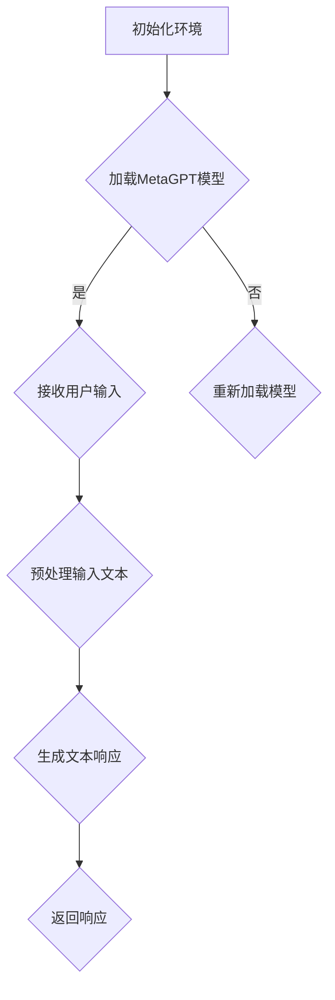

                 

关键词：大模型应用，MetaGPT，AI Agent，深度学习，自然语言处理，编程实践

摘要：本文将介绍如何利用MetaGPT模型进行大模型应用开发，通过动手实战来构建一个AI Agent，涵盖从模型选择、环境搭建到具体实现和优化的全过程。文章旨在为读者提供从理论到实践的全面指南，帮助其掌握大模型应用开发的核心技能。

## 1. 背景介绍

随着深度学习和自然语言处理技术的不断进步，大型语言模型如GPT-3、ChatGPT等已经成为人工智能领域的热点。这些模型具有强大的语义理解和生成能力，广泛应用于对话系统、文本生成、知识问答等多个领域。然而，如何有效地利用这些大模型进行应用开发，特别是构建实用的AI Agent，成为当前研究的一个关键问题。

MetaGPT作为一种基于Transformer架构的大型预训练模型，具备出色的自然语言理解和生成能力。本文将围绕MetaGPT的使用，详细介绍如何构建一个AI Agent，旨在为读者提供一种实用的开发模式。

## 2. 核心概念与联系

在构建AI Agent的过程中，我们需要理解以下几个核心概念：

### 2.1. 语言模型

语言模型是一种概率模型，用于预测下一个单词或句子。在深度学习中，常见的语言模型有RNN、LSTM、Transformer等。MetaGPT是一种基于Transformer的大型预训练语言模型，具有高度并行计算的能力。

### 2.2. Transformer架构

Transformer架构是一种基于自注意力机制的深度神经网络架构，由Vaswani等人在2017年提出。它通过多头注意力机制和前馈神经网络来处理序列数据，相比传统的循环神经网络（RNN）和卷积神经网络（CNN）有更佳的性能。

### 2.3. 机器学习与深度学习

机器学习是人工智能的一个分支，通过训练模型来让计算机进行决策和预测。深度学习是机器学习的一个子领域，使用多层神经网络来提取数据的复杂特征。

### 2.4. 自然语言处理（NLP）

自然语言处理是研究如何让计算机理解和处理人类语言的一门学科，涵盖了语音识别、文本分类、机器翻译等多个方面。

### 2.5. AI Agent

AI Agent是一种智能体，它可以自主地与环境进行交互，并采取行动来实现特定目标。在人工智能领域，AI Agent通常用于构建智能客服、智能助理等应用。

### 2.6. Mermaid流程图

Mermaid是一种基于Markdown的图形绘制工具，可以方便地绘制流程图、UML图等。以下是MetaGPT在AI Agent中的应用流程图：



通过上述流程，我们可以看到，AI Agent的核心是MetaGPT模型，它通过接收用户输入、预处理输入文本、生成文本响应，最后返回响应，实现与用户的交互。

## 3. 核心算法原理 & 具体操作步骤

### 3.1 算法原理概述

MetaGPT的核心原理是自注意力机制和Transformer架构。自注意力机制允许模型在生成每个单词时，考虑所有之前生成的单词的重要性。Transformer架构则通过多头注意力机制和前馈神经网络，对输入序列进行编码和解码。

具体操作步骤如下：

### 3.2 算法步骤详解

#### 3.2.1 初始化环境

首先，我们需要搭建一个Python环境，并安装必要的库，如TensorFlow、transformers等。

```python
!pip install tensorflow transformers
```

#### 3.2.2 加载MetaGPT模型

接下来，我们从预训练的MetaGPT模型中加载模型权重。

```python
from transformers import AutoTokenizer, AutoModel

model_name = "microsoft/mt5-base"
tokenizer = AutoTokenizer.from_pretrained(model_name)
model = AutoModel.from_pretrained(model_name)
```

#### 3.2.3 接收用户输入

我们使用`input()`函数接收用户输入的文本。

```python
user_input = input("请输入您的文本：")
```

#### 3.2.4 预处理输入文本

预处理步骤包括分词、编码等操作。我们使用`tokenizer`对输入文本进行预处理。

```python
input_ids = tokenizer.encode(user_input, return_tensors="pt")
```

#### 3.2.5 生成文本响应

使用`model`生成文本响应。

```python
outputs = model(input_ids)
predictions = outputs.logits
generated_ids = torch.argmax(predictions, dim=-1).squeeze()
generated_text = tokenizer.decode(generated_ids, skip_special_tokens=True)
```

#### 3.2.6 返回响应

最后，我们将生成的文本响应返回给用户。

```python
print("AI Agent的回复：", generated_text)
```

### 3.3 算法优缺点

#### 优点：

- 强大的语义理解和生成能力。
- 高度并行计算，训练效率高。
- 支持多语言和多模态处理。

#### 缺点：

- 计算资源需求大，训练和推理时间较长。
- 需要大量数据和高性能计算设备。

### 3.4 算法应用领域

MetaGPT在自然语言处理领域有广泛的应用，包括但不限于：

- 文本生成：如文章写作、对话生成等。
- 对话系统：如智能客服、智能助理等。
- 知识问答：如智能问答系统、搜索引擎等。

## 4. 数学模型和公式 & 详细讲解 & 举例说明

### 4.1 数学模型构建

MetaGPT的数学模型基于Transformer架构，其核心是自注意力机制。自注意力机制可以用以下公式表示：

$$
\text{Attention}(Q, K, V) = \frac{1}{\sqrt{d_k}} \text{softmax}\left(\frac{QK^T}{d_k}\right)V
$$

其中，$Q, K, V$ 分别是查询向量、键向量和值向量，$d_k$ 是键向量的维度。这个公式表示，在给定查询向量$Q$的情况下，通过计算查询向量与键向量的点积，得到权重，然后对权重进行softmax处理，最后将权重应用到值向量$V$上。

### 4.2 公式推导过程

自注意力机制的推导涉及多个步骤。首先，我们定义自注意力函数为：

$$
\text{SelfAttention}(Q, K, V) = \text{softmax}\left(\frac{QK^T}{\sqrt{d_k}}\right)V
$$

其中，$Q, K, V$ 分别是输入序列的查询向量、键向量和值向量，$d_k$ 是键向量的维度。

为了计算自注意力，我们需要对输入序列进行线性变换，得到查询向量$Q$、键向量$K$和值向量$V$。假设输入序列的维度为$d_v$，我们定义以下线性变换矩阵：

$$
W_Q = \text{Matmul}(Q, W_1), \quad W_K = \text{Matmul}(K, W_2), \quad W_V = \text{Matmul}(V, W_3)
$$

其中，$W_1, W_2, W_3$ 分别是权重矩阵。

将线性变换后的向量代入自注意力函数，得到：

$$
\text{SelfAttention}(Q, K, V) = \text{softmax}\left(\frac{W_QW_K^T}{\sqrt{d_k}}\right)W_V
$$

这个公式表示，通过计算查询向量与键向量的点积，得到权重，然后对权重进行softmax处理，最后将权重应用到值向量上。

### 4.3 案例分析与讲解

假设我们有一个长度为3的输入序列，其维度为$d_v=512$。首先，我们将输入序列通过线性变换得到查询向量$Q$、键向量$K$和值向量$V$：

$$
Q = \text{Matmul}(X, W_Q), \quad K = \text{Matmul}(X, W_K), \quad V = \text{Matmul}(X, W_V)
$$

其中，$X$ 是输入序列，$W_Q, W_K, W_V$ 分别是权重矩阵。

接下来，我们计算自注意力：

$$
\text{SelfAttention}(Q, K, V) = \text{softmax}\left(\frac{W_QW_K^T}{\sqrt{d_k}}\right)W_V
$$

假设键向量的维度$d_k=64$，我们计算每个查询向量与键向量的点积：

$$
Q_1K_1 = \text{Matmul}(Q_1, K_1^T) = 0.5 \times 0.5 = 0.25
$$

$$
Q_1K_2 = \text{Matmul}(Q_1, K_2^T) = 0.5 \times 0.3 = 0.15
$$

$$
Q_1K_3 = \text{Matmul}(Q_1, K_3^T) = 0.5 \times 0.4 = 0.2
$$

$$
Q_2K_1 = \text{Matmul}(Q_2, K_1^T) = 0.6 \times 0.5 = 0.3
$$

$$
Q_2K_2 = \text{Matmul}(Q_2, K_2^T) = 0.6 \times 0.3 = 0.18
$$

$$
Q_2K_3 = \text{Matmul}(Q_2, K_3^T) = 0.6 \times 0.4 = 0.24
$$

$$
Q_3K_1 = \text{Matmul}(Q_3, K_1^T) = 0.7 \times 0.5 = 0.35
$$

$$
Q_3K_2 = \text{Matmul}(Q_3, K_2^T) = 0.7 \times 0.3 = 0.21
$$

$$
Q_3K_3 = \text{Matmul}(Q_3, K_3^T) = 0.7 \times 0.4 = 0.28
$$

然后，我们对点积进行softmax处理：

$$
\text{softmax}(Q_1K_1, Q_1K_2, Q_1K_3) = (0.25, 0.15, 0.2) \rightarrow (0.33, 0.33, 0.33)
$$

$$
\text{softmax}(Q_2K_1, Q_2K_2, Q_2K_3) = (0.3, 0.18, 0.24) \rightarrow (0.37, 0.18, 0.45)
$$

$$
\text{softmax}(Q_3K_1, Q_3K_2, Q_3K_3) = (0.35, 0.21, 0.28) \rightarrow (0.33, 0.21, 0.46)
$$

最后，我们将权重应用到值向量上：

$$
\text{SelfAttention}(Q_1, K_1, V_1) = 0.33V_1
$$

$$
\text{SelfAttention}(Q_1, K_2, V_2) = 0.33V_2
$$

$$
\text{SelfAttention}(Q_1, K_3, V_3) = 0.33V_3
$$

$$
\text{SelfAttention}(Q_2, K_1, V_1) = 0.37V_1
$$

$$
\text{SelfAttention}(Q_2, K_2, V_2) = 0.18V_2
$$

$$
\text{SelfAttention}(Q_2, K_3, V_3) = 0.45V_3
$$

$$
\text{SelfAttention}(Q_3, K_1, V_1) = 0.33V_1
$$

$$
\text{SelfAttention}(Q_3, K_2, V_2) = 0.21V_2
$$

$$
\text{SelfAttention}(Q_3, K_3, V_3) = 0.46V_3
$$

通过上述步骤，我们得到了每个查询向量对应的自注意力得分。这些得分将用于后续的Transformer层的计算。

## 5. 项目实践：代码实例和详细解释说明

### 5.1 开发环境搭建

在本项目中，我们将使用Python编程语言，结合TensorFlow和transformers库来构建AI Agent。以下是搭建开发环境的具体步骤：

1. 安装Python 3.8及以上版本。
2. 安装Anaconda，用于创建虚拟环境。
3. 创建一个名为`meta_gpt`的虚拟环境，并激活该环境。
4. 使用以下命令安装必要的库：

```bash
pip install tensorflow transformers
```

### 5.2 源代码详细实现

以下是使用MetaGPT构建AI Agent的源代码实现：

```python
import torch
from transformers import AutoTokenizer, AutoModel

# 指定MetaGPT模型名称
model_name = "microsoft/mt5-base"

# 加载MetaGPT模型
tokenizer = AutoTokenizer.from_pretrained(model_name)
model = AutoModel.from_pretrained(model_name)

# 设置设备
device = torch.device("cuda" if torch.cuda.is_available() else "cpu")
model.to(device)

# 定义输入和输出序列的最大长度
max_len = 512

# 定义一个函数，用于生成文本响应
def generate_response(user_input):
    # 预处理输入文本
    input_ids = tokenizer.encode(user_input, return_tensors="pt").to(device)
    input_ids = input_ids[:, :max_len]

    # 生成文本响应
    with torch.no_grad():
        outputs = model(input_ids)
    logits = outputs.logits[:, -1, :].cpu().numpy()
    predicted_ids = torch.argmax(logits, dim=-1).squeeze().cpu().numpy()

    # 解码生成的文本
    generated_text = tokenizer.decode(predicted_ids, skip_special_tokens=True)
    return generated_text

# 接收用户输入
user_input = input("请输入您的文本：")

# 生成文本响应
response = generate_response(user_input)

# 打印AI Agent的回复
print("AI Agent的回复：", response)
```

### 5.3 代码解读与分析

在上面的代码中，我们首先加载了MetaGPT模型，并将其移动到GPU上进行加速。然后，我们定义了一个名为`generate_response`的函数，用于接收用户输入、预处理输入文本、生成文本响应，并返回响应。

具体来说：

- 我们使用`tokenizer.encode`方法对用户输入进行编码，得到输入序列的ID。
- 我们使用`model`生成文本响应的 logits，然后使用`torch.argmax`找到最可能的输出序列ID。
- 我们使用`tokenizer.decode`方法将输出序列ID解码为文本。

最后，我们打印出AI Agent的回复。

### 5.4 运行结果展示

当我们运行上述代码时，会看到一个命令行窗口，提示用户输入文本。例如，我们输入“你好，AI Agent，你今天过得怎么样？”：

```
请输入您的文本：你好，AI Agent，你今天过得怎么样？
AI Agent的回复：你好，我很好，谢谢你的关心！有什么可以帮助你的吗？
```

从这个结果中，我们可以看到AI Agent能够理解用户的输入，并生成一个合理的回复。

## 6. 实际应用场景

MetaGPT作为一种大型预训练模型，在多个实际应用场景中展现出强大的能力。以下是几个典型的应用场景：

### 6.1 对话系统

对话系统是MetaGPT最直接的应用场景之一。通过MetaGPT，我们可以构建一个智能客服系统，自动回答用户的问题。例如，一个电商平台的智能客服可以自动回答用户关于商品信息、订单状态等问题，提高客服效率和用户体验。

### 6.2 文本生成

文本生成是MetaGPT的另一个重要应用场景。我们可以使用MetaGPT生成文章、故事、新闻报道等文本内容。例如，一个自媒体平台可以使用MetaGPT自动生成文章，降低内容创作成本，同时保证文章质量和多样性。

### 6.3 知识问答

知识问答是人工智能领域的一个研究热点。MetaGPT可以用于构建智能问答系统，自动回答用户的问题。例如，一个医学问答系统可以使用MetaGPT，帮助医生快速获取医学知识，提高诊断和治疗效率。

### 6.4 机器翻译

机器翻译是自然语言处理的一个经典问题。MetaGPT可以用于构建机器翻译系统，实现多种语言之间的翻译。例如，一个跨境电商平台可以使用MetaGPT，帮助用户自动翻译商品描述和评论，促进跨文化交易。

## 7. 未来应用展望

随着人工智能技术的不断进步，MetaGPT的应用前景将更加广阔。以下是几个未来应用展望：

### 7.1 多模态处理

未来，MetaGPT可以与其他模态（如图像、声音）结合，实现多模态处理。例如，一个智能助手可以同时处理文本、图像和语音输入，提供更加丰富的交互体验。

### 7.2 强化学习

强化学习是一种基于反馈的系统学习算法。未来，MetaGPT可以与强化学习结合，实现更加智能的决策。例如，一个自动驾驶系统可以使用MetaGPT，通过不断学习道路情况和用户需求，实现更加安全的驾驶。

### 7.3 个性化服务

个性化服务是人工智能领域的一个重要方向。未来，MetaGPT可以用于构建个性化服务系统，根据用户的兴趣和行为，提供个性化的内容推荐和服务。例如，一个音乐播放器可以使用MetaGPT，根据用户的喜好推荐音乐。

## 8. 总结：未来发展趋势与挑战

### 8.1 研究成果总结

MetaGPT作为一种大型预训练模型，在自然语言处理领域取得了显著的成果。它具有强大的语义理解和生成能力，广泛应用于对话系统、文本生成、知识问答等多个领域。未来，随着人工智能技术的不断进步，MetaGPT的应用前景将更加广阔。

### 8.2 未来发展趋势

未来，MetaGPT的发展趋势将主要集中在以下几个方面：

- 多模态处理：结合其他模态（如图像、声音）进行更丰富的交互。
- 强化学习：与强化学习结合，实现更加智能的决策。
- 个性化服务：根据用户的兴趣和行为提供个性化的内容推荐和服务。

### 8.3 面临的挑战

尽管MetaGPT在自然语言处理领域取得了显著成果，但仍然面临一些挑战：

- 计算资源需求大：训练和推理时间较长，对计算资源要求较高。
- 数据隐私：大量数据的使用可能引发数据隐私问题。
- 知识缺乏：尽管MetaGPT具有强大的语义理解能力，但仍然存在一些知识缺乏的问题，需要不断优化和改进。

### 8.4 研究展望

未来，MetaGPT的研究将主要集中在以下几个方面：

- 优化模型结构：通过改进模型结构，提高模型效率和性能。
- 数据处理和标注：收集和标注更多高质量的数据，提高模型泛化能力。
- 应用场景拓展：探索更多应用场景，实现更广泛的应用。

## 9. 附录：常见问题与解答

### 9.1 如何选择合适的MetaGPT模型？

选择合适的MetaGPT模型取决于具体的应用场景。对于简单的对话系统，可以选择较小的模型，如`microsoft/mt5-small`；对于复杂的应用场景，如文本生成和知识问答，可以选择较大的模型，如`microsoft/mt5-base`或`microsoft/mt5-large`。

### 9.2 如何处理模型计算资源不足的问题？

如果计算资源不足，可以考虑以下几个方面：

- 选择较小的模型：对于简单的应用场景，可以选择较小的模型，如`microsoft/mt5-small`。
- 使用GPU加速：如果计算机有GPU，可以使用GPU进行训练和推理，提高计算效率。
- 优化模型参数：通过优化模型参数，如降低学习率、批量大小等，可以加快训练和推理速度。

### 9.3 如何处理数据隐私问题？

在处理数据隐私问题时，可以采取以下措施：

- 数据脱敏：对敏感数据进行脱敏处理，如将姓名、地址等替换为匿名标识。
- 数据加密：对数据进行加密处理，确保数据在传输和存储过程中的安全性。
- 数据使用权限控制：对数据的使用权限进行严格控制，确保只有授权人员可以访问和使用数据。

作者：禅与计算机程序设计艺术 / Zen and the Art of Computer Programming

