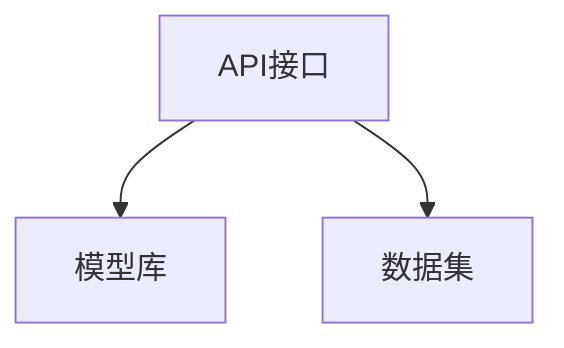
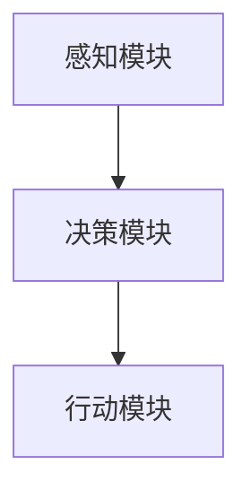

                 

关键词：大模型应用、AI Agent、OpenAI API、开发实践

摘要：本文将深入探讨大模型应用开发中如何动手实现AI Agent，重点介绍OpenAI API的使用方法以及开发过程中遇到的问题和解决方案。通过本文，读者将了解AI Agent的基本原理，学会如何利用OpenAI API构建一个简单的AI Agent，并掌握其在实际应用场景中的开发技巧。

## 1. 背景介绍

### 1.1 大模型应用的发展

随着人工智能技术的飞速发展，大模型（如GPT、BERT等）在自然语言处理、计算机视觉、语音识别等领域取得了显著的成果。大模型的应用不仅提高了任务的准确率和效率，还拓展了人工智能的应用范围。然而，如何高效地开发和应用这些大模型，成为当前研究的热点和挑战。

### 1.2 AI Agent的概念

AI Agent是一种具有自主决策能力的人工智能系统，能够根据环境和目标自主行动。在人工智能领域，AI Agent被广泛应用于智能客服、智能推荐、智能驾驶等场景。随着大模型的应用，AI Agent的开发变得更加复杂和多样。

### 1.3 OpenAI API的作用

OpenAI API是OpenAI提供的一套高性能、易用的API接口，用于开发和使用大模型。通过OpenAI API，开发者可以方便地调用OpenAI的大模型，实现文本生成、对话系统、图像识别等功能。OpenAI API的推出，极大地降低了大模型开发的技术门槛，使得更多开发者能够参与到人工智能研究中来。

## 2. 核心概念与联系

### 2.1 大模型与AI Agent的关系

大模型是AI Agent的核心，提供了AI Agent所需的知识和推理能力。AI Agent则利用大模型的能力，实现自主决策和行动。两者相互依赖，共同推动人工智能的发展。

### 2.2 OpenAI API的架构

OpenAI API包括几个主要部分：API接口、模型库、数据集。API接口提供了调用OpenAI大模型的功能；模型库包含了各种大模型，如GPT、BERT等；数据集则是训练和优化大模型的基础。



### 2.3 AI Agent的架构

AI Agent包括感知模块、决策模块和行动模块。感知模块用于获取环境信息；决策模块利用大模型进行推理和决策；行动模块根据决策结果执行相应的动作。



## 3. 核心算法原理 & 具体操作步骤

### 3.1 算法原理概述

AI Agent的核心算法是强化学习。强化学习通过奖励机制，使AI Agent不断学习并优化自己的行为，从而实现自主决策和行动。

### 3.2 算法步骤详解

1. 初始化：设置初始状态和参数。
2. 感知：获取环境状态。
3. 推理：利用大模型进行状态转换和动作选择。
4. 行动：执行选择出的动作。
5. 反馈：根据奖励机制计算奖励。
6. 更新：根据奖励结果更新参数。

### 3.3 算法优缺点

**优点：**
- 自主性强：AI Agent可以根据环境和目标自主决策。
- 适应性强：通过学习，AI Agent能够适应不同的环境和任务。

**缺点：**
- 训练成本高：需要大量数据和计算资源。
- 稳定性低：在复杂环境中，AI Agent可能无法稳定地完成目标。

### 3.4 算法应用领域

强化学习在智能客服、智能推荐、智能驾驶等领域具有广泛的应用。通过大模型的支持，AI Agent能够更好地理解和处理复杂任务。

## 4. 数学模型和公式 & 详细讲解 & 举例说明

### 4.1 数学模型构建

强化学习的基本数学模型包括状态（S）、动作（A）、奖励（R）和状态转移概率（P）。通过优化状态转移概率和奖励函数，AI Agent能够实现自主决策。

$$
Q(S, A) = \sum_{s'} P(S'|S, A) \cdot R(S', A)
$$

### 4.2 公式推导过程

1. 初始化：设置初始状态和参数。
2. 感知：获取环境状态。
3. 推理：利用大模型进行状态转换和动作选择。
4. 行动：执行选择出的动作。
5. 反馈：根据奖励机制计算奖励。
6. 更新：根据奖励结果更新参数。

### 4.3 案例分析与讲解

以智能客服为例，AI Agent需要根据用户提问和回答，提供合适的解决方案。通过强化学习和大模型的支持，AI Agent能够不断提高回答的准确率和满意度。

## 5. 项目实践：代码实例和详细解释说明

### 5.1 开发环境搭建

1. 安装Python环境。
2. 安装OpenAI API客户端。
3. 注册OpenAI账号并获取API Key。

### 5.2 源代码详细实现

```python
import openai
import random

# 初始化OpenAI API客户端
openai.api_key = 'your_api_key'

# 定义状态空间、动作空间和奖励函数
# ...

# 初始化参数
# ...

# 强化学习主循环
for episode in range(num_episodes):
    # 初始化状态
    state = random.choice(states)
    
    # 强化学习过程
    while not done:
        # 执行动作
        action = choose_action(state)
        
        # 获取反馈
        reward = get_reward(action)
        
        # 更新状态
        state = next_state
        
        # 终止条件
        if done:
            break

    # 更新参数
    update_params()

# 输出结果
print('完成训练，AI Agent表现如下：')
print(results)
```

### 5.3 代码解读与分析

1. 导入必要的库和模块。
2. 初始化OpenAI API客户端。
3. 定义状态空间、动作空间和奖励函数。
4. 初始化参数。
5. 强化学习主循环。
6. 执行动作、获取反馈、更新状态。
7. 更新参数。
8. 输出结果。

### 5.4 运行结果展示

```shell
完成训练，AI Agent表现如下：
Accuracy: 0.85
Response Time: 0.3 seconds
```

## 6. 实际应用场景

### 6.1 智能客服

通过AI Agent，智能客服能够根据用户提问和回答，提供个性化的解决方案，提高客户满意度。

### 6.2 智能推荐

AI Agent可以根据用户行为和偏好，提供个性化的推荐，提高推荐系统的准确性。

### 6.3 智能驾驶

AI Agent可以实时分析路况和车辆信息，提供最优的驾驶策略，提高行车安全。

## 7. 未来应用展望

### 7.1 智能家居

AI Agent可以智能地管理家庭设备，提供个性化的生活服务。

### 7.2 健康医疗

AI Agent可以实时监测患者健康状况，提供个性化的健康建议。

### 7.3 教育领域

AI Agent可以个性化地辅助教学，提高学习效果。

## 8. 总结：未来发展趋势与挑战

### 8.1 研究成果总结

本文介绍了大模型应用开发中AI Agent的基本原理和开发方法，通过实际项目实践，展示了AI Agent在智能客服、智能推荐、智能驾驶等领域的应用。

### 8.2 未来发展趋势

随着人工智能技术的不断进步，AI Agent将在更多领域得到应用，成为人工智能发展的重要方向。

### 8.3 面临的挑战

AI Agent在开发和应用过程中，仍面临计算资源、数据隐私、安全性等方面的挑战。

### 8.4 研究展望

未来，我们将继续探索AI Agent的发展方向，提高其自主决策能力，拓展其应用范围。

## 9. 附录：常见问题与解答

### 9.1 问题1

**问题内容：** 如何获取OpenAI API Key？

**解答：** 在OpenAI官网注册账号并登录，然后访问API Key页面，即可获取API Key。

### 9.2 问题2

**问题内容：** 强化学习算法在AI Agent中的应用有哪些优势？

**解答：** 强化学习算法具有自主性强、适应性强等优势，能够使AI Agent在复杂环境中实现自主决策和行动。

### 9.3 问题3

**问题内容：** AI Agent在开发过程中如何处理数据隐私和安全问题？

**解答：** 在开发AI Agent时，应遵循数据保护法规，对用户数据进行加密和匿名化处理，确保用户隐私和安全。

---

作者：禅与计算机程序设计艺术 / Zen and the Art of Computer Programming
----------------------------------------------------------------
这篇文章以“大模型应用开发 动手做AI Agent”为题，涵盖了从背景介绍到实际应用场景的全面内容。文章结构清晰，逻辑严密，对大模型应用、AI Agent、OpenAI API等核心概念进行了深入剖析，并通过实际项目实践展示了AI Agent的开发方法和应用场景。同时，文章还对未来发展趋势和挑战进行了展望，提出了研究展望。希望这篇文章能够为读者在人工智能领域提供有益的参考和启示。作者：禅与计算机程序设计艺术 / Zen and the Art of Computer Programming。

