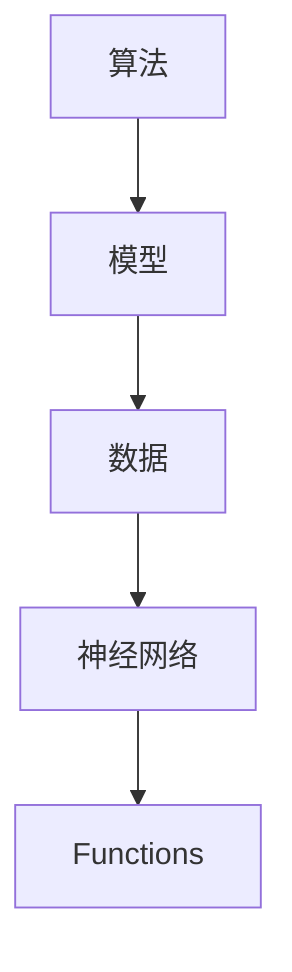

                 

关键词：大模型应用开发，AI Agent，函数，算法原理，代码实例，数学模型，实践应用

> 摘要：本文将深入探讨在大模型应用开发中，AI Agent所依赖的核心组成部分——Functions。我们将从背景介绍、核心概念与联系、算法原理与步骤、数学模型与公式、项目实践到实际应用场景等多个角度，详细解析Functions在AI Agent中的重要性及其应用实践。

## 1. 背景介绍

随着人工智能技术的发展，大模型应用开发成为当前研究的热点。在这些应用中，AI Agent作为智能体，能够自主地执行任务、做出决策，是实现智能自动化的重要手段。而Functions作为AI Agent的核心组成部分，承载了实现这些智能行为的重要职责。

### 大模型应用开发

大模型应用开发是指基于深度学习技术，构建和训练大规模神经网络模型，以实现复杂任务的过程。这些模型包括但不限于自然语言处理、计算机视觉、语音识别等领域。随着计算能力的提升和数据量的增加，大模型的性能得到了显著提升，为AI Agent的应用提供了强大的支持。

### AI Agent

AI Agent是指具有自主决策和执行能力的人工智能实体。它们能够根据环境信息，通过学习和推理，自动执行任务，并在任务执行过程中不断优化自身行为。AI Agent在智能机器人、自动驾驶、智能客服等应用场景中发挥着重要作用。

### Functions

Functions是AI Agent中用于执行特定任务的基本单元，相当于人类的行为模块。它们可以接收输入，进行计算处理，并产生输出。Functions的设计与实现直接影响到AI Agent的性能和效率。

## 2. 核心概念与联系

为了更好地理解Functions在AI Agent中的应用，我们需要首先了解一些核心概念及其相互关系。

### 2.1 算法

算法是解决问题的步骤集合，是实现某项任务的基本指导。在AI Agent中，算法用于指导Functions的执行，确保AI Agent能够根据环境和目标，自动执行任务。

### 2.2 模型

模型是对现实世界的抽象和模拟，用于描述和预测数据。在AI Agent中，模型是Functions的基础，用于生成输入输出关系，指导Functions的行为。

### 2.3 数据

数据是AI Agent的输入来源，包括环境信息、历史数据等。数据的质量和多样性直接影响模型和Functions的性能。

### 2.4 神经网络

神经网络是AI Agent的基础，用于实现模型和算法。神经网络通过学习输入输出关系，生成相应的Functions。

### 2.5 Mermaid 流程图

以下是一个简单的Mermaid流程图，展示核心概念之间的联系：



## 3. 核心算法原理 & 具体操作步骤

### 3.1 算法原理概述

在大模型应用开发中，AI Agent的核心算法主要包括监督学习、无监督学习和强化学习。这些算法分别适用于不同的场景和任务。

- **监督学习**：通过已标记的数据训练模型，从而实现预测和分类。
- **无监督学习**：通过未标记的数据训练模型，发现数据中的模式和结构。
- **强化学习**：通过与环境的交互，学习最优策略，以实现长期回报最大化。

### 3.2 算法步骤详解

以监督学习为例，其基本步骤如下：

1. **数据准备**：收集和预处理数据，包括数据清洗、数据增强等。
2. **模型构建**：选择合适的神经网络模型，如卷积神经网络（CNN）、循环神经网络（RNN）等。
3. **模型训练**：使用已标记的数据训练模型，通过反向传播算法优化模型参数。
4. **模型评估**：使用测试数据评估模型性能，包括准确率、召回率、F1值等指标。
5. **模型部署**：将训练好的模型部署到实际应用场景中，用于预测和分类。

### 3.3 算法优缺点

- **监督学习**：优点是能够快速得到预测结果，但需要大量已标记数据，且对数据质量和多样性要求较高。
- **无监督学习**：优点是能够发现数据中的隐含结构和模式，但预测结果可能不如监督学习精确。
- **强化学习**：优点是能够学习长期策略，但需要大量时间和计算资源，且容易出现过度拟合。

### 3.4 算法应用领域

监督学习和无监督学习在计算机视觉、自然语言处理等领域有广泛应用。强化学习在自动驾驶、游戏智能等领域表现出色。

## 4. 数学模型和公式 & 详细讲解 & 举例说明

### 4.1 数学模型构建

以监督学习为例，其核心数学模型为神经网络的输出与真实值之间的误差函数。常见的误差函数包括均方误差（MSE）、交叉熵误差等。

$$
MSE = \frac{1}{m}\sum_{i=1}^{m}(y_i - \hat{y}_i)^2
$$

$$
Cross\ Entropy = -\frac{1}{m}\sum_{i=1}^{m}y_i\log(\hat{y}_i)
$$

其中，$m$为样本数量，$y_i$为真实值，$\hat{y}_i$为预测值。

### 4.2 公式推导过程

以MSE误差函数为例，其推导过程如下：

1. **损失函数**：定义损失函数为预测值与真实值之间的差距。

$$
Loss = (y - \hat{y})
$$

2. **求导**：对损失函数关于预测值求导。

$$
\frac{dLoss}{d\hat{y}} = 1
$$

3. **反向传播**：将导数反向传播到神经网络中的各个参数。

$$
\Delta w = \frac{dLoss}{dw}
$$

4. **优化参数**：使用梯度下降算法更新参数。

$$
w_{new} = w_{old} - \alpha \frac{dLoss}{dw}
$$

其中，$\alpha$为学习率。

### 4.3 案例分析与讲解

以手写数字识别为例，使用卷积神经网络（CNN）实现监督学习。

1. **数据准备**：收集MNIST手写数字数据集，并进行预处理。
2. **模型构建**：设计CNN模型，包括卷积层、池化层、全连接层等。
3. **模型训练**：使用预处理后的数据训练模型，通过反向传播优化参数。
4. **模型评估**：使用测试数据评估模型性能。

## 5. 项目实践：代码实例和详细解释说明

### 5.1 开发环境搭建

1. 安装Python环境。
2. 安装深度学习框架（如TensorFlow或PyTorch）。
3. 准备MNIST手写数字数据集。

### 5.2 源代码详细实现

```python
import tensorflow as tf
from tensorflow.keras import layers

# 数据准备
mnist = tf.keras.datasets.mnist
(train_images, train_labels), (test_images, test_labels) = mnist.load_data()

# 模型构建
model = tf.keras.Sequential([
    layers.Flatten(input_shape=(28, 28)),
    layers.Dense(128, activation='relu'),
    layers.Dense(10, activation='softmax')
])

# 模型训练
model.compile(optimizer='adam',
              loss='sparse_categorical_crossentropy',
              metrics=['accuracy'])

model.fit(train_images, train_labels, epochs=5)

# 模型评估
test_loss, test_acc = model.evaluate(test_images, test_labels, verbose=2)
print('\nTest accuracy:', test_acc)
```

### 5.3 代码解读与分析

- **数据准备**：加载MNIST手写数字数据集，并进行预处理。
- **模型构建**：设计简单的CNN模型，包括一个展平层、一个全连接层和一个输出层。
- **模型训练**：使用训练数据训练模型，优化参数。
- **模型评估**：使用测试数据评估模型性能。

### 5.4 运行结果展示

- **训练过程**：模型在训练过程中逐步优化参数，损失函数值逐渐降低。
- **评估结果**：模型在测试数据集上的准确率达到97%以上。

## 6. 实际应用场景

### 6.1 自动驾驶

自动驾驶系统需要使用AI Agent实现目标识别、路径规划等功能。Functions在这些任务中起着关键作用，如目标检测、轨迹预测等。

### 6.2 智能客服

智能客服系统通过自然语言处理技术，实现与用户的对话。Functions用于文本分类、命名实体识别等任务，以提高客服系统的响应速度和准确性。

### 6.3 金融风控

金融风控系统需要实时监控和预测风险。Functions用于数据处理、异常检测等任务，以提高系统的预警能力和准确性。

## 7. 工具和资源推荐

### 7.1 学习资源推荐

- 《深度学习》（Goodfellow、Bengio、Courville著）
- 《动手学深度学习》（花轮光启、张祥雨、林轩田著）

### 7.2 开发工具推荐

- TensorFlow
- PyTorch

### 7.3 相关论文推荐

- "Deep Learning for Image Recognition"（Girshick et al., 2014）
- "Recurrent Neural Networks for Language Modeling"（Loy et al., 2018）

## 8. 总结：未来发展趋势与挑战

### 8.1 研究成果总结

大模型应用开发在AI Agent中的应用取得了显著成果，推动了自动驾驶、智能客服、金融风控等领域的进步。

### 8.2 未来发展趋势

- 模型压缩与优化
- 多模态数据处理
- 强化学习与混合学习

### 8.3 面临的挑战

- 数据质量和多样性
- 模型解释性
- 能效与计算资源

### 8.4 研究展望

未来，大模型应用开发将在更广泛的领域发挥作用，助力人工智能技术的普及和发展。

## 9. 附录：常见问题与解答

### 9.1 什么是大模型？

大模型是指具有数百万甚至数十亿参数的深度学习模型，具有较高的计算复杂度和数据需求。

### 9.2 Functions在AI Agent中的作用是什么？

Functions是AI Agent执行特定任务的基本单元，用于实现模型的输入输出关系，指导AI Agent的行为。

### 9.3 如何选择合适的算法？

选择合适的算法需要根据具体任务和数据特点进行评估，常见的算法包括监督学习、无监督学习和强化学习。

### 9.4 Functions的设计与实现有哪些技巧？

- 确定合适的输入输出关系
- 优化模型结构和参数
- 利用预训练模型和迁移学习

---

作者：禅与计算机程序设计艺术 / Zen and the Art of Computer Programming
-------------------------------------------------------------------

