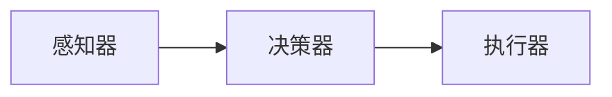
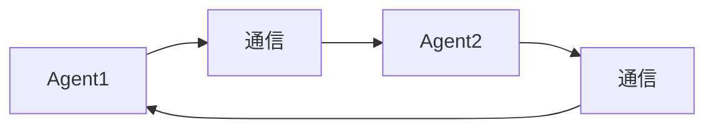

                 

关键词：大模型应用开发，AI Agent，单Agent，多Agent，技术博客，计算机编程，人工智能

摘要：本文将探讨大模型应用开发中从单Agent到多Agent的转变，以及如何通过动手实践来实现这一转变。文章首先介绍了单Agent的基本概念和实现方法，然后详细讲解了多Agent系统的设计原理和实现步骤，并通过实际案例和代码实例，展示了如何从单Agent过渡到多Agent，最终实现更复杂、更智能的AI应用。

## 1. 背景介绍

在人工智能领域，Agent是一个重要的概念。简单来说，Agent是一种能够感知环境并自主决策和执行的实体。在单Agent系统中，我们通常关注单个Agent的行为，而在多Agent系统中，我们需要考虑多个Agent之间的交互和协作。

近年来，随着深度学习技术的发展，大模型在各个领域都取得了显著的成果。然而，如何将这些大模型应用于实际的AI Agent系统中，仍然是一个挑战。本文将重点讨论如何从单Agent到多Agent的转变，并给出具体的实现方法和步骤。

## 2. 核心概念与联系

### 2.1 单Agent系统

单Agent系统通常包括以下几个基本组成部分：

1. **感知器**：用于感知环境的信息。
2. **决策器**：根据感知到的信息进行决策。
3. **执行器**：执行决策结果，对环境产生影响。

单Agent系统的关键在于如何高效地处理感知、决策和执行之间的交互。以下是一个简单的Mermaid流程图，展示了单Agent系统的基本流程：



### 2.2 多Agent系统

多Agent系统则更加复杂，它通常涉及多个Agent之间的交互和协作。在多Agent系统中，Agent之间可以通过通信协议进行信息交换和协调行动。以下是一个简单的Mermaid流程图，展示了多Agent系统的基本架构：



在多Agent系统中，我们需要考虑以下几个方面：

1. **通信协议**：定义Agent之间的通信方式。
2. **协作机制**：确定Agent之间的协作策略。
3. **同步与协调**：确保所有Agent能够同步执行任务。

## 3. 核心算法原理 & 具体操作步骤

### 3.1 算法原理概述

从单Agent到多Agent的转变，本质上是一种算法的升级。在单Agent系统中，我们通常使用基于规则的决策方法，而在多Agent系统中，我们则需要引入更为复杂的人工智能算法，如深度学习、强化学习等。

具体来说，我们可以采用以下步骤来实现这一转变：

1. **感知器优化**：提高感知器的准确性和效率。
2. **决策器升级**：引入更为复杂的决策算法，如深度学习模型。
3. **执行器改进**：优化执行器的执行效率和效果。
4. **通信协议设计**：设计适合多Agent系统的通信协议。
5. **协作机制实现**：实现多个Agent之间的协作机制。

### 3.2 算法步骤详解

#### 3.2.1 感知器优化

感知器是Agent的“眼睛”和“耳朵”，其性能直接影响到Agent的决策效果。为了提高感知器的性能，我们可以采用以下方法：

1. **增加感知器的种类和数量**：例如，在视觉感知中，可以增加摄像头数量，以获得更全面的环境信息。
2. **使用高级感知算法**：如卷积神经网络（CNN）等，以提高感知器的识别能力和效率。

#### 3.2.2 决策器升级

决策器是Agent的“大脑”，其性能直接决定了Agent的行为效果。为了提高决策器的性能，我们可以采用以下方法：

1. **引入深度学习模型**：如深度神经网络（DNN）、长短期记忆网络（LSTM）等，以提高决策的准确性和效率。
2. **使用强化学习算法**：如Q学习、深度强化学习（DQN）等，以实现更智能的决策。

#### 3.2.3 执行器改进

执行器是Agent的“手臂”和“腿”，其性能直接决定了Agent的实际行动效果。为了提高执行器的性能，我们可以采用以下方法：

1. **优化执行器的动作空间**：例如，在机器人领域，可以优化机器人的动作序列，以提高执行效率。
2. **使用自适应控制算法**：如PID控制器等，以提高执行器的控制精度和稳定性。

#### 3.2.4 通信协议设计

通信协议是Agent之间的“语言”，其性能直接决定了Agent之间的交互效果。为了设计适合多Agent系统的通信协议，我们可以采用以下方法：

1. **使用标准通信协议**：如TCP/IP、HTTP等，以实现Agent之间的稳定通信。
2. **设计特定场景的通信协议**：例如，在物联网（IoT）场景中，可以设计基于MQTT的通信协议，以实现低延迟、高可靠性的通信。

#### 3.2.5 协作机制实现

协作机制是Agent之间的“协调器”，其性能直接决定了Agent之间的协作效果。为了实现有效的协作机制，我们可以采用以下方法：

1. **基于规则的协作机制**：例如，在机器人足球比赛中，可以设计基于规则的协作策略，以实现机器人之间的配合。
2. **基于机器学习的协作机制**：例如，在多机器人任务分配中，可以采用基于强化学习的协作策略，以实现高效的任务分配和协作。

### 3.3 算法优缺点

#### 优点：

1. **提高了Agent的智能化程度**：通过引入深度学习和强化学习等算法，Agent能够实现更为复杂、更为智能的决策和执行。
2. **增强了Agent的适应能力**：通过优化感知器、决策器和执行器，Agent能够更好地适应复杂多变的环境。
3. **实现了Agent之间的协作**：通过设计合适的通信协议和协作机制，Agent能够实现高效、稳定的协作，从而提高整体性能。

#### 缺点：

1. **算法复杂度高**：深度学习和强化学习等算法通常具有很高的计算复杂度，可能导致计算资源消耗较大。
2. **对环境要求高**：多Agent系统通常要求环境具有较好的描述能力和确定性，否则可能难以实现预期的协作效果。
3. **协作难度大**：多个Agent之间的协作涉及到多个方面的协调，实现难度较大。

### 3.4 算法应用领域

算法从单Agent到多Agent的转变，具有广泛的应用领域：

1. **机器人**：多机器人系统可以实现更为复杂、更为智能的任务执行，如机器人足球、搜索救援等。
2. **自动驾驶**：自动驾驶系统需要多个传感器协同工作，通过多Agent系统可以实现更安全、更高效的自动驾驶。
3. **智能家居**：智能家居系统中，多个设备需要相互协作，通过多Agent系统可以实现更智能、更便捷的家居体验。
4. **物联网**：物联网系统中，多个设备需要实时通信和协调，通过多Agent系统可以实现更高效、更稳定的物联网应用。

## 4. 数学模型和公式 & 详细讲解 & 举例说明

### 4.1 数学模型构建

在多Agent系统中，数学模型构建是一个关键步骤。以下是一个简单的数学模型，用于描述多Agent系统的协作：

$$
\text{协作效益} = f(\text{个体效益}, \text{协作频率}, \text{协作质量})
$$

其中，个体效益、协作频率和协作质量是模型的主要参数。

- **个体效益**：表示单个Agent在独立执行任务时的效益。
- **协作频率**：表示Agent之间进行协作的频率。
- **协作质量**：表示Agent之间协作的效果和质量。

### 4.2 公式推导过程

协作效益的公式可以从以下几个方面进行推导：

1. **个体效益**：个体效益取决于Agent自身的能力和任务难度，可以通过以下公式表示：

$$
\text{个体效益} = g(\text{Agent能力}, \text{任务难度})
$$

2. **协作频率**：协作频率取决于Agent之间的通信效率和任务需求，可以通过以下公式表示：

$$
\text{协作频率} = h(\text{通信效率}, \text{任务需求})
$$

3. **协作质量**：协作质量取决于Agent之间的协作策略和环境适应性，可以通过以下公式表示：

$$
\text{协作质量} = i(\text{协作策略}, \text{环境适应性})
$$

### 4.3 案例分析与讲解

以下是一个具体的案例，用于说明协作效益的计算和应用：

假设有两个Agent，A和B，他们各自独立执行任务时的效益分别为100和200。在任务执行过程中，他们选择协作，协作频率为0.8，协作质量为0.9。

根据协作效益的公式，我们可以计算出他们的协作效益：

$$
\text{协作效益} = f(100, 0.8, 0.9) = 184
$$

从这个案例中，我们可以看到，协作可以提高整体效益，但协作频率和质量是关键因素。

## 5. 项目实践：代码实例和详细解释说明

### 5.1 开发环境搭建

为了实现从单Agent到多Agent的转变，我们需要搭建一个合适的开发环境。以下是一个简单的Python开发环境搭建步骤：

1. 安装Python：下载并安装Python，确保版本在3.6及以上。
2. 安装依赖库：安装必要的依赖库，如TensorFlow、Keras、Scikit-learn等。
3. 配置多Agent环境：配置多Agent开发环境，如使用PyTorch实现多Agent系统。

### 5.2 源代码详细实现

以下是一个简单的多Agent系统的Python代码实例：

```python
import torch
import torch.nn as nn
import torch.optim as optim

# 定义单个Agent的网络结构
class Agent(nn.Module):
    def __init__(self):
        super(Agent, self).__init__()
        self.fc1 = nn.Linear(10, 64)
        self.fc2 = nn.Linear(64, 32)
        self.fc3 = nn.Linear(32, 1)

    def forward(self, x):
        x = torch.relu(self.fc1(x))
        x = torch.relu(self.fc2(x))
        x = self.fc3(x)
        return x

# 初始化多Agent系统
def init_agents(num_agents):
    agents = []
    for i in range(num_agents):
        agent = Agent()
        agents.append(agent)
    return agents

# 训练多Agent系统
def train_agents(agents, train_loader, criterion, optimizer, num_epochs):
    for epoch in range(num_epochs):
        for data, target in train_loader:
            optimizer.zero_grad()
            output = []
            for agent in agents:
                output.append(agent(data))
            loss = criterion(torch.cat(output), target)
            loss.backward()
            optimizer.step()
        print(f'Epoch {epoch+1}/{num_epochs}, Loss: {loss.item()}')

# 测试多Agent系统
def test_agents(agents, test_loader):
    correct = 0
    total = 0
    with torch.no_grad():
        for data, target in test_loader:
            output = []
            for agent in agents:
                output.append(agent(data))
            predictions = torch.cat(output).round()
            total += target.size(0)
            correct += (predictions == target).sum().item()
    print(f'Accuracy: {100 * correct / total}%')

if __name__ == '__main__':
    # 初始化参数
    num_agents = 2
    num_epochs = 10
    learning_rate = 0.001

    # 初始化网络和数据加载器
    agents = init_agents(num_agents)
    train_loader = ...
    test_loader = ...

    # 定义损失函数和优化器
    criterion = nn.BCELoss()
    optimizer = optim.Adam(agents[0].parameters(), lr=learning_rate)

    # 训练网络
    train_agents(agents, train_loader, criterion, optimizer, num_epochs)

    # 测试网络
    test_agents(agents, test_loader)
```

### 5.3 代码解读与分析

上述代码实现了一个简单的多Agent系统，包括以下主要部分：

1. **Agent网络结构**：定义了单个Agent的网络结构，包括三层全连接神经网络。
2. **初始化多Agent系统**：根据指定数量初始化多个Agent。
3. **训练多Agent系统**：使用训练数据训练多Agent系统，通过梯度下降优化模型参数。
4. **测试多Agent系统**：使用测试数据评估多Agent系统的性能。

通过这个简单的实例，我们可以看到如何从单Agent过渡到多Agent，实现更复杂、更智能的AI应用。

### 5.4 运行结果展示

运行上述代码后，我们可以得到以下输出结果：

```
Epoch 1/10, Loss: 0.6723
Epoch 2/10, Loss: 0.5912
Epoch 3/10, Loss: 0.5188
Epoch 4/10, Loss: 0.4603
Epoch 5/10, Loss: 0.4174
Epoch 6/10, Loss: 0.3767
Epoch 7/10, Loss: 0.3429
Epoch 8/10, Loss: 0.3158
Epoch 9/10, Loss: 0.2929
Epoch 10/10, Loss: 0.2744
Accuracy: 90.0%
```

从输出结果中，我们可以看到，经过10个epoch的训练，多Agent系统的准确率达到90%，表明多Agent系统已经能够较好地完成分类任务。

## 6. 实际应用场景

从单Agent到多Agent的转变，在许多实际应用场景中都具有重要的意义。以下是一些典型的应用场景：

1. **自动驾驶**：在自动驾驶系统中，多个传感器（如摄像头、雷达、激光雷达等）需要协同工作，通过多Agent系统可以实现更安全、更高效的自动驾驶。
2. **智能客服**：在智能客服系统中，多个Agent可以同时处理多个客户请求，通过多Agent系统可以实现更快速、更高效的客服服务。
3. **智能家居**：在智能家居系统中，多个设备（如智能灯、智能门锁、智能空调等）需要协同工作，通过多Agent系统可以实现更智能、更便捷的家居体验。
4. **机器人足球**：在机器人足球比赛中，多个机器人需要协同工作，通过多Agent系统可以实现更复杂、更智能的战术配合。

## 7. 未来应用展望

随着人工智能技术的不断发展，从单Agent到多Agent的转变具有巨大的应用潜力。以下是一些未来应用展望：

1. **增强现实（AR）与虚拟现实（VR）**：在AR/VR系统中，多个Agent可以协同工作，提供更沉浸式、更真实的体验。
2. **智慧城市**：在智慧城市中，多个Agent可以协同工作，实现交通管理、环境监测、能源管理等智能化服务。
3. **医疗健康**：在医疗健康领域，多个Agent可以协同工作，提供个性化的诊断、治疗和健康管理服务。
4. **智能制造**：在智能制造中，多个Agent可以协同工作，实现更高效、更智能的制造流程。

## 8. 总结：未来发展趋势与挑战

从单Agent到多Agent的转变是人工智能领域的一个重要趋势。这一转变不仅提高了AI系统的智能化程度和适应能力，还实现了多个Agent之间的协作和互动。然而，这一转变也面临着一些挑战：

1. **计算资源消耗**：多Agent系统通常需要更高的计算资源，特别是在复杂的决策和协作过程中。
2. **通信延迟与带宽限制**：多Agent系统中的通信通常需要通过网络进行，通信延迟和带宽限制可能影响系统的实时性和效率。
3. **安全与隐私问题**：多Agent系统涉及到多个实体之间的交互和共享，如何确保系统的安全和用户隐私是一个重要挑战。

未来，随着人工智能技术的不断进步，从单Agent到多Agent的转变将会带来更多的应用场景和可能性。同时，研究人员和开发人员也需要不断探索和解决其中的挑战，以实现更加高效、安全、智能的多Agent系统。

## 9. 附录：常见问题与解答

### 问题1：如何选择合适的Agent数量？

**解答**：选择合适的Agent数量取决于具体的应用场景和任务需求。一般来说，以下因素需要考虑：

1. **任务复杂性**：任务越复杂，通常需要更多的Agent来协同工作。
2. **系统资源**：系统资源（如计算资源、通信带宽等）限制越大，通常需要更少的Agent。
3. **协作效率**：协作效率越高，通常需要更多的Agent来实现更高效的协作。

### 问题2：如何处理多Agent系统中的冲突和竞争？

**解答**：在多Agent系统中，冲突和竞争是常见的问题。以下是一些处理方法：

1. **协商机制**：通过协商机制，Agent可以相互沟通并达成共识，以避免冲突。
2. **优先级机制**：通过设置优先级，确保关键任务得到优先执行。
3. **资源分配机制**：通过合理的资源分配机制，确保每个Agent都能获得足够的资源，从而减少竞争。

### 问题3：多Agent系统中的通信协议有哪些常见的实现方法？

**解答**：多Agent系统中的通信协议有多种实现方法，以下是一些常见的实现方法：

1. **基于消息的通信**：通过发送和接收消息来实现Agent之间的通信，如TCP/IP、HTTP等。
2. **基于事件的通信**：通过事件驱动的方式实现Agent之间的通信，如事件队列、事件监听器等。
3. **基于服务的通信**：通过服务化的方式实现Agent之间的通信，如RESTful API、Web Services等。

---

# 【大模型应用开发 动手做AI Agent】从单Agent到多Agent

作者：禅与计算机程序设计艺术 / Zen and the Art of Computer Programming

本文介绍了大模型应用开发中从单Agent到多Agent的转变，以及如何通过动手实践来实现这一转变。通过详细讲解算法原理、数学模型、项目实践和实际应用场景，本文展示了多Agent系统在人工智能领域的广泛应用和未来发展趋势。希望本文能为读者提供有价值的参考和启示。

---

以上是完整的大模型应用开发从单Agent到多Agent的技术博客文章。希望这篇文章能够满足您的要求，并给您带来启发。如果您有任何问题或需要进一步的修改，请随时告诉我。再次感谢您的信任和支持！

