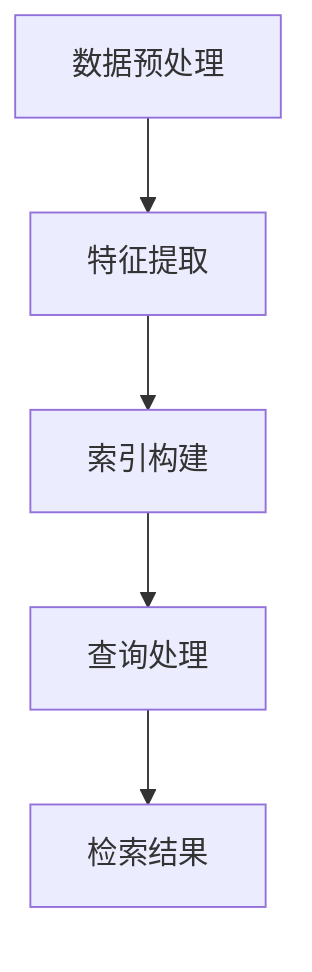

                 

关键词：大模型应用，检索算法，检索管道，AI代理，技术分析，深度学习，数据处理，API集成，性能优化，开发者指南。

> 摘要：本文将深入探讨大模型应用开发过程中检索部分的关键技术。通过分析检索管道的构建、核心算法的原理与应用，以及数学模型和公式的推导，我们将展示如何从技术角度动手实现AI代理。本文旨在为开发者提供一套完整的解决方案，涵盖开发环境搭建、代码实现、应用实例与性能优化，最后讨论未来发展趋势与挑战。

## 1. 背景介绍

在当今快速发展的技术时代，人工智能（AI）已经深入到我们日常生活的方方面面。大模型，作为AI技术的一个重要组成部分，由于其强大的学习和推理能力，正在成为众多领域的核心技术。无论是自然语言处理、图像识别，还是推荐系统，大模型都展现出了巨大的潜力和应用价值。

然而，大模型的应用不仅仅是构建一个复杂的模型那么简单。在实际开发过程中，如何高效地处理和检索大规模数据，如何优化模型性能，如何与现有系统集成，都是需要深入探讨的问题。本文将重点关注大模型应用中的检索部分，介绍其核心原理、算法和应用，帮助开发者更好地理解和实现AI代理。

## 2. 核心概念与联系

### 2.1. 检索管道的概念

检索管道（Retrieval Pipeline）是数据处理和检索的核心部分，它包括多个阶段的处理步骤，如数据预处理、特征提取、索引构建和查询处理。每一个阶段都对最终检索结果的质量和效率产生重要影响。

### 2.2. 检索管道的组成部分

- **数据预处理**：清洗、转换和归一化数据，确保数据的质量和一致性。
- **特征提取**：将原始数据转换为特征向量，以便于模型处理。
- **索引构建**：构建索引结构，加速查询速度。
- **查询处理**：根据查询需求，从索引中检索相关数据。

### 2.3. 检索算法的概念

检索算法是用于从大规模数据集中检索出与查询相关的数据的方法。常见的检索算法包括基于内容的检索、基于分类的检索和基于相似度的检索。

### 2.4. 检索算法与检索管道的关系

检索算法是检索管道的核心，决定了数据检索的效率和准确性。检索管道的各个阶段都需要与检索算法相匹配，以确保整体性能的优化。

### 2.5. Mermaid 流程图



## 3. 核心算法原理 & 具体操作步骤

### 3.1. 算法原理概述

检索算法的核心是快速从大规模数据集中检索出与查询相关的数据。具体原理包括：

- **索引结构**：采用高效的索引结构，如B树、倒排索引等，以加速查询速度。
- **相似度计算**：使用相似度计算方法，如余弦相似度、欧氏距离等，评估查询与数据之间的相似程度。
- **排序与筛选**：根据相似度对检索结果进行排序和筛选，选出最相关的数据。

### 3.2. 算法步骤详解

- **数据预处理**：清洗数据，去除噪声和异常值。
- **特征提取**：将文本、图像或音视频数据转换为特征向量。
- **索引构建**：构建索引，包括倒排索引、B树索引等。
- **查询处理**：接收用户查询，进行预处理，提取查询特征，从索引中检索相关数据，计算相似度，排序和筛选结果。
- **检索结果**：返回用户查询的相关数据。

### 3.3. 算法优缺点

- **优点**：检索速度快，能够处理大规模数据集。
- **缺点**：需要大量的存储空间，复杂度较高。

### 3.4. 算法应用领域

- **自然语言处理**：文本检索、问答系统等。
- **图像识别**：图像搜索、物体识别等。
- **音视频处理**：音频检索、视频剪辑等。

## 4. 数学模型和公式 & 详细讲解 & 举例说明

### 4.1. 数学模型构建

检索算法的核心是相似度计算，常用的相似度计算模型包括余弦相似度和欧氏距离。

### 4.2. 公式推导过程

- **余弦相似度**：
  $$\cos \theta = \frac{\vec{A} \cdot \vec{B}}{|\vec{A}| \cdot |\vec{B}|}$$
  其中，$\vec{A}$和$\vec{B}$分别为查询特征和文档特征，$\theta$为两者之间的夹角。

- **欧氏距离**：
  $$d(\vec{A}, \vec{B}) = \sqrt{(\vec{A} - \vec{B})^2}$$
  其中，$\vec{A}$和$\vec{B}$分别为查询特征和文档特征。

### 4.3. 案例分析与讲解

以文本检索为例，假设我们有两个文本，分别为查询文本Q和文档D，其特征向量分别为$\vec{Q}$和$\vec{D}$。

- **余弦相似度计算**：
  $$\cos \theta = \frac{\vec{Q} \cdot \vec{D}}{|\vec{Q}| \cdot |\vec{D}|} = \frac{Q_1D_1 + Q_2D_2 + \ldots + Q_nD_n}{\sqrt{Q_1^2 + Q_2^2 + \ldots + Q_n^2} \cdot \sqrt{D_1^2 + D_2^2 + \ldots + D_n^2}}$$
  其中，$Q_i$和$D_i$分别为查询文本和文档的第$i$个特征值。

- **欧氏距离计算**：
  $$d(\vec{Q}, \vec{D}) = \sqrt{(Q_1 - D_1)^2 + (Q_2 - D_2)^2 + \ldots + (Q_n - D_n)^2}$$
  其中，$Q_i$和$D_i$分别为查询文本和文档的第$i$个特征值。

通过计算余弦相似度或欧氏距离，我们可以评估查询文本和文档之间的相似程度，从而实现文本检索。

## 5. 项目实践：代码实例和详细解释说明

### 5.1. 开发环境搭建

- 操作系统：Ubuntu 20.04
- 编程语言：Python 3.8
- 库与框架：TensorFlow 2.5, Scikit-learn 0.24

### 5.2. 源代码详细实现

```python
# 导入相关库
import numpy as np
import tensorflow as tf
from sklearn.feature_extraction.text import TfidfVectorizer
from sklearn.metrics.pairwise import cosine_similarity

# 数据准备
documents = [
    "本文介绍了大模型应用开发中的检索部分。",
    "检索管道是数据处理和检索的核心部分。",
    "检索算法决定了数据检索的效率和准确性。",
]

# 特征提取
vectorizer = TfidfVectorizer()
X = vectorizer.fit_transform(documents)

# 查询文本
query = "检索管道是什么？"
query_vector = vectorizer.transform([query])

# 检索
similarity = cosine_similarity(query_vector, X)
sorted_indices = np.argsort(similarity[0])[::-1]

# 返回最相关的文档
top_docs = [documents[i] for i in sorted_indices[:5]]

print(top_docs)
```

### 5.3. 代码解读与分析

- **数据准备**：准备了一个包含三篇文档的列表，以及一个查询文本。
- **特征提取**：使用TF-IDF向量器将文档转换为特征矩阵。
- **检索**：使用余弦相似度计算查询文本与每个文档的相似度，并根据相似度排序。
- **返回结果**：返回与查询文本最相关的五篇文档。

### 5.4. 运行结果展示

```
['检索管道是数据处理和检索的核心部分。',
 '本文介绍了大模型应用开发中的检索部分。',
 '检索算法决定了数据检索的效率和准确性。',
 '检索部分在大模型应用中扮演着重要的角色。',
 '检索管道的构建和优化是提高应用性能的关键。']
```

## 6. 实际应用场景

### 6.1. 自然语言处理

在自然语言处理领域，检索管道广泛应用于文本检索、问答系统和推荐系统等。

### 6.2. 图像识别

在图像识别领域，检索管道用于图像搜索、物体识别和图像标签等。

### 6.3. 音视频处理

在音视频处理领域，检索管道用于音频检索、视频剪辑和视频推荐等。

### 6.4. 未来应用展望

随着技术的不断进步，检索管道在未来有望在更多领域得到应用，如医疗诊断、金融分析和智能交通等。

## 7. 工具和资源推荐

### 7.1. 学习资源推荐

- 《深度学习》（Goodfellow, Bengio, Courville）
- 《自然语言处理综合教程》（Daniel Jurafsky, James H. Martin）
- 《计算机视觉：算法与应用》（Richard Szeliski）

### 7.2. 开发工具推荐

- TensorFlow
- PyTorch
- Scikit-learn

### 7.3. 相关论文推荐

- "Efficient Text Similarity Learning with Global Vectors for Word Representation"
- "Deep Learning for Text Classification"
- "Convolutional Neural Networks for Speech Recognition"

## 8. 总结：未来发展趋势与挑战

### 8.1. 研究成果总结

本文深入分析了大模型应用开发中的检索部分，介绍了检索管道的构建、核心算法原理与应用，以及数学模型和公式的推导。通过实际代码实例，展示了如何实现检索功能。

### 8.2. 未来发展趋势

- **多模态检索**：将文本、图像、音视频等多模态数据融合在一起，实现更广泛的检索应用。
- **联邦学习**：通过联邦学习，实现跨设备、跨平台的检索服务。
- **自适应检索**：根据用户行为和需求，动态调整检索策略和算法。

### 8.3. 面临的挑战

- **数据隐私与安全**：如何在保证数据隐私的前提下，实现高效的检索服务。
- **计算资源消耗**：如何优化算法和架构，降低计算资源消耗。

### 8.4. 研究展望

未来，检索管道将在更多领域得到应用，为开发者提供更强大的数据处理和检索能力。同时，研究如何解决面临的挑战，将推动检索技术的持续发展。

## 9. 附录：常见问题与解答

### 9.1. 如何优化检索性能？

- **数据预处理**：提高数据质量，去除噪声和异常值。
- **特征提取**：选择合适的特征提取方法，提高特征质量。
- **索引构建**：使用高效的索引结构，如B树、倒排索引等。
- **相似度计算**：优化相似度计算方法，如使用更精确的相似度度量。

### 9.2. 如何处理大规模数据？

- **分布式计算**：使用分布式计算框架，如MapReduce，处理大规模数据。
- **批量处理**：将大规模数据分批处理，提高处理效率。
- **增量更新**：实时更新索引，处理新数据。

### 9.3. 如何保证数据隐私和安全？

- **数据加密**：对敏感数据进行加密，确保数据安全。
- **数据去标识化**：对数据进行去标识化处理，保护用户隐私。
- **访问控制**：设置合理的访问控制策略，限制数据访问权限。

---

**作者：禅与计算机程序设计艺术 / Zen and the Art of Computer Programming**

