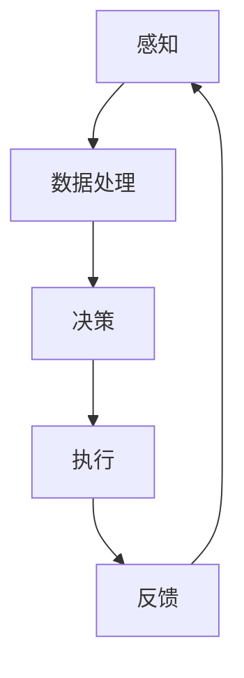

                 

关键词：具身智能、大模型应用、AI Agent、人工智能、软件开发

摘要：本文将探讨具身智能在人工智能（AI）领域的发展。随着大模型技术的不断进步，AI Agent（人工智能代理）逐渐成为实现具身智能的关键。本文将首先介绍具身智能的概念，随后深入探讨大模型在AI Agent中的应用，以及如何动手开发一个AI Agent。

## 1. 背景介绍

### 1.1 具身智能的定义

具身智能是指将人工智能（AI）与物理世界结合，使AI具备感知、决策和执行的能力。这种智能体能够通过传感器获取环境信息，然后进行计算和分析，最终生成行动方案。具身智能的典型应用包括机器人、自动驾驶车辆和智能交互系统等。

### 1.2 大模型技术的崛起

近年来，大模型技术取得了显著进展，使得AI在处理复杂数据和任务方面表现出色。大模型通常拥有数十亿到千亿级别的参数，能够自动学习数据中的模式，并用于预测、分类、生成等任务。例如，Transformer模型和GPT系列模型在大规模语言处理任务中取得了惊人的效果。

## 2. 核心概念与联系

为了更好地理解具身智能在AI Agent中的应用，我们可以借助Mermaid流程图展示核心概念和联系。



### 2.1 感知

感知是具身智能的第一步，通过传感器获取物理世界的输入，例如摄像头、麦克风、触摸传感器等。

### 2.2 数据处理

感知到的数据需要经过处理，以便提取有用的信息。数据处理包括特征提取、数据增强和预处理等步骤。

### 2.3 决策

决策是基于处理后的数据进行的，AI Agent会根据当前状态和环境信息，选择最佳行动方案。

### 2.4 执行

执行是将决策转化为实际操作的过程，例如机器人的运动、自动驾驶车辆的转向等。

### 2.5 反馈

执行后的反馈将用于调整AI Agent的行为，使其不断优化。

## 3. 核心算法原理 & 具体操作步骤

### 3.1 算法原理概述

具身智能的核心算法包括感知、数据处理、决策和执行。以下是对这些算法的简要概述。

### 3.2 算法步骤详解

#### 3.2.1 感知

感知阶段使用传感器获取物理世界的输入。例如，使用摄像头捕获图像，使用麦克风捕获声音。

```python
import cv2
import numpy as np

# 捕获图像
image = cv2.VideoCapture(0)

# 处理图像
processed_image = preprocess_image(image)

# 关闭摄像头
image.release()
```

#### 3.2.2 数据处理

数据处理包括特征提取、数据增强和预处理。特征提取可以使用卷积神经网络（CNN）等深度学习模型。

```python
import tensorflow as tf

# 定义CNN模型
model = tf.keras.Sequential([
    tf.keras.layers.Conv2D(32, (3, 3), activation='relu', input_shape=(28, 28, 1)),
    tf.keras.layers.MaxPooling2D((2, 2)),
    # ... 更多层
])

# 训练模型
model.compile(optimizer='adam', loss='categorical_crossentropy', metrics=['accuracy'])
model.fit(x_train, y_train, epochs=10)
```

#### 3.2.3 决策

决策是基于处理后的数据进行的，可以使用强化学习、决策树等算法。

```python
import numpy as np

# 定义决策函数
def make_decision(state):
    # ... 决策逻辑
    return action

# 应用决策函数
state = get_state()
action = make_decision(state)
```

#### 3.2.4 执行

执行是将决策转化为实际操作的过程，例如控制机器人的运动。

```python
import RPi.GPIO as GPIO
import time

# 初始化GPIO
GPIO.setmode(GPIO.BCM)
GPIO.setup(18, GPIO.OUT)

# 发送控制信号
p = GPIO.PWM(18, 1000)
p.start(0)
p.ChangeDutyCycle(5)
time.sleep(1)
p.stop()

# 关闭GPIO
GPIO.cleanup()
```

#### 3.2.5 反馈

反馈用于调整AI Agent的行为，使其不断优化。

```python
# 定义反馈函数
def feedback(response):
    # ... 反馈逻辑
    return updated_state

# 应用反馈函数
response = get_response()
updated_state = feedback(response)
```

### 3.3 算法优缺点

#### 优点

1. **高效性**：大模型能够处理大规模数据，提高计算效率。
2. **通用性**：基于深度学习的算法具有很好的通用性，可以应用于多种场景。
3. **灵活性**：AI Agent可以根据实时反馈进行自适应调整。

#### 缺点

1. **计算资源需求大**：大模型需要大量计算资源和存储空间。
2. **解释性差**：深度学习模型通常难以解释其内部逻辑。
3. **数据依赖性**：模型性能很大程度上取决于训练数据的质量。

### 3.4 算法应用领域

大模型和AI Agent在以下领域具有广泛应用：

1. **机器人**：自主导航、环境感知和任务执行。
2. **自动驾驶**：路况识别、路径规划和决策。
3. **智能交互系统**：自然语言处理和语音识别。

## 4. 数学模型和公式 & 详细讲解 & 举例说明

### 4.1 数学模型构建

具身智能的数学模型通常包括感知、数据处理、决策和执行等环节。以下是一个简化的数学模型：

$$
\text{Action} = f(\text{State}, \text{Model Parameters})
$$

其中，$\text{State}$ 表示当前状态，$f$ 表示决策函数，$\text{Model Parameters}$ 表示模型的参数。

### 4.2 公式推导过程

公式的推导过程通常涉及多个步骤。以下是一个简化的推导过程：

1. **感知**：使用传感器获取物理世界的输入，例如图像、声音等。
2. **数据处理**：对感知到的数据进行预处理，例如特征提取、归一化等。
3. **决策**：基于处理后的数据，使用决策函数选择最佳行动方案。
4. **执行**：将决策转化为实际操作，例如控制机器人的运动。

### 4.3 案例分析与讲解

#### 案例一：机器人导航

假设一个机器人在一个网格世界中导航，其状态由位置和方向组成。我们可以使用以下数学模型：

$$
\text{Action} = \begin{cases} 
\text{RIGHT} & \text{if } \text{State} \text{ suggests moving right} \\ 
\text{LEFT} & \text{if } \text{State} \text{ suggests moving left} \\ 
\text{STAY} & \text{otherwise} 
\end{cases}
$$

在这个例子中，$\text{State}$ 可以表示为当前位置和方向的概率分布。

#### 案例二：自动驾驶

在自动驾驶中，状态通常包括车辆的位置、速度、加速度、周围车辆和路况等信息。我们可以使用以下数学模型：

$$
\text{Action} = f(\text{State}, \text{Model Parameters})
$$

其中，$f$ 表示一个复杂的决策函数，用于选择最佳行动方案。

## 5. 项目实践：代码实例和详细解释说明

### 5.1 开发环境搭建

在开始编写代码之前，我们需要搭建一个合适的开发环境。以下是一个简单的环境搭建步骤：

1. 安装Python 3.x版本。
2. 安装TensorFlow库。
3. 安装必要的传感器驱动程序。

### 5.2 源代码详细实现

以下是一个简单的AI Agent实现，用于控制机器人的运动。

```python
import RPi.GPIO as GPIO
import time

# 初始化GPIO
GPIO.setmode(GPIO.BCM)
GPIO.setup(18, GPIO.OUT)

# 定义感知函数
def sense():
    # 使用传感器获取物理世界输入
    # ... 传感器代码
    return state

# 定义数据处理函数
def process_data(state):
    # 处理感知到的数据
    # ... 数据处理代码
    return processed_state

# 定义决策函数
def make_decision(state):
    # ... 决策逻辑
    return action

# 定义执行函数
def execute(action):
    # ... 执行动作
    if action == "RIGHT":
        GPIO.output(18, GPIO.HIGH)
    elif action == "LEFT":
        GPIO.output(18, GPIO.LOW)

# 定义反馈函数
def feedback(response):
    # ... 反馈逻辑
    return updated_state

# 主循环
while True:
    state = sense()
    processed_state = process_data(state)
    action = make_decision(processed_state)
    execute(action)
    updated_state = feedback(response)
```

### 5.3 代码解读与分析

这段代码实现了基本的AI Agent功能，包括感知、数据处理、决策和执行。以下是代码的详细解读：

1. **初始化GPIO**：设置GPIO模式为BCM，并初始化机器人运动控制信号引脚。
2. **感知函数**：使用传感器获取物理世界输入，例如使用摄像头捕获图像。
3. **数据处理函数**：对感知到的数据进行预处理，例如特征提取、归一化等。
4. **决策函数**：基于处理后的数据，使用决策函数选择最佳行动方案。
5. **执行函数**：将决策转化为实际操作，例如控制机器人的运动。
6. **反馈函数**：用于调整AI Agent的行为，使其不断优化。

### 5.4 运行结果展示

当运行这段代码时，机器人将根据感知到的环境和决策函数选择最佳行动方案。例如，如果机器人感知到前方有障碍物，它可能会选择向左转。

## 6. 实际应用场景

### 6.1 机器人导航

在机器人导航领域，AI Agent可以用于自主导航、避障和路径规划。例如，机器人在家庭、工厂和仓库等环境中进行自主导航，以提高工作效率和安全性。

### 6.2 自动驾驶

自动驾驶是AI Agent的另一个重要应用领域。AI Agent可以用于路况识别、路径规划和决策，以提高行驶安全性和效率。例如，自动驾驶汽车可以在复杂的城市交通中自主行驶，减少交通事故。

### 6.3 智能交互系统

智能交互系统是AI Agent的另一个重要应用领域。AI Agent可以用于自然语言处理和语音识别，以实现与人类用户的自然交互。例如，智能音箱、虚拟助手和智能客服等。

## 7. 工具和资源推荐

### 7.1 学习资源推荐

1. 《深度学习》（Ian Goodfellow、Yoshua Bengio和Aaron Courville著）：介绍深度学习的基础知识。
2. 《机器人学导论》（John J. Craig著）：介绍机器人学的基础知识。
3. 《Python编程：从入门到实践》（埃里克·马瑟斯著）：介绍Python编程语言。

### 7.2 开发工具推荐

1. TensorFlow：用于深度学习开发的框架。
2. Robot Operating System (ROS)：用于机器人开发的工具。
3. MATLAB：用于数学建模和数据分析。

### 7.3 相关论文推荐

1. “Deep Learning for Autonomous Navigation”（Deep Learning for Autonomous Navigation）：介绍深度学习在机器人导航中的应用。
2. “Autonomous Driving with Deep Reinforcement Learning”（Autonomous Driving with Deep Reinforcement Learning）：介绍深度强化学习在自动驾驶中的应用。
3. “A Survey on Artificial Intelligence in Robotics”（A Survey on Artificial Intelligence in Robotics）：介绍人工智能在机器人领域的应用。

## 8. 总结：未来发展趋势与挑战

### 8.1 研究成果总结

具身智能在AI领域取得了显著成果，包括机器人导航、自动驾驶和智能交互系统等应用。大模型技术的发展为AI Agent的实现提供了强大的计算能力。

### 8.2 未来发展趋势

未来，具身智能将继续发展，并在更多领域得到应用。随着硬件和算法的进步，AI Agent将更加智能和灵活。

### 8.3 面临的挑战

1. **计算资源需求**：大模型需要大量的计算资源，这对硬件和算法提出了挑战。
2. **数据隐私和安全**：在具身智能应用中，数据隐私和安全是一个重要问题。
3. **伦理和社会问题**：随着AI Agent的广泛应用，伦理和社会问题也需要得到关注。

### 8.4 研究展望

未来，具身智能将在更多领域得到应用，并推动AI技术的发展。同时，我们需要关注计算资源需求、数据隐私和安全等挑战，确保AI技术的社会价值和可持续发展。

## 9. 附录：常见问题与解答

### 9.1 具身智能与普通智能的区别是什么？

具身智能与普通智能的主要区别在于其与物理世界的交互能力。普通智能通常只能处理虚拟环境中的任务，而具身智能能够感知、决策和执行物理世界中的任务。

### 9.2 大模型在AI Agent中的应用有哪些优势？

大模型在AI Agent中的应用优势包括高效性、通用性和灵活性。大模型能够自动学习数据中的模式，提高计算效率，并适应多种应用场景。

### 9.3 AI Agent的开发需要哪些技能和工具？

AI Agent的开发需要掌握编程技能，如Python和C++，以及熟悉深度学习框架，如TensorFlow和PyTorch。此外，开发AI Agent还需要熟悉传感器和硬件知识。

### 9.4 具身智能在哪些领域具有广泛应用？

具身智能在机器人导航、自动驾驶和智能交互系统等领域具有广泛应用。随着技术的进步，其应用领域将不断扩大。

----------------------------------------------------------------

本文由禅与计算机程序设计艺术 / Zen and the Art of Computer Programming撰写。如有任何问题或建议，请随时与我联系。

