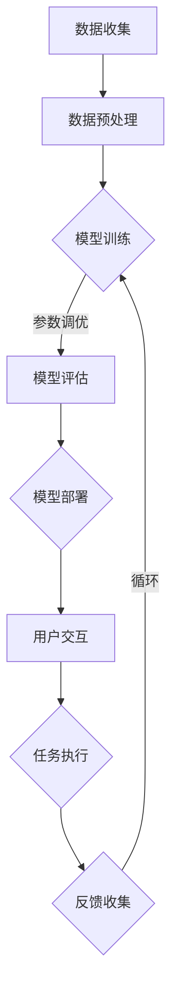

                 

关键词：大模型、AI Agent、语言交互、应用开发、深度学习、自然语言处理、编程实践、数学模型、算法原理

> 摘要：本文将深入探讨大模型在AI Agent语言交互能力中的应用，从算法原理、数学模型到实际开发实践，全面解析大模型在自然语言处理领域的应用前景，并展望其未来发展趋势。

## 1. 背景介绍

随着人工智能技术的飞速发展，大模型（Large-scale Models）已经成为自然语言处理（NLP）领域的重要研究方向。大模型通常是指具有数十亿甚至千亿参数的深度学习模型，它们能够对大量文本数据进行训练，从而提取出丰富的语义信息，实现出色的语言理解和生成能力。

AI Agent作为一种具有自主决策和执行能力的智能体，广泛应用于虚拟助手、智能客服、内容生成等领域。语言交互作为AI Agent的核心功能之一，其性能直接影响到用户体验和业务效果。因此，如何提升AI Agent的语言交互能力成为当前研究的热点问题。

本文将围绕大模型在AI Agent语言交互能力中的应用，从核心概念、算法原理、数学模型、项目实践等多个角度进行深入探讨，旨在为相关领域的研究者和开发者提供有价值的参考。

## 2. 核心概念与联系

### 2.1 大模型

大模型是指具有数十亿甚至千亿参数的深度学习模型。这些模型通常采用大规模的数据集进行训练，从而具备较强的语义理解和生成能力。大模型的关键特点如下：

- 参数规模：大模型的参数数量通常达到数十亿甚至千亿级别，这使得它们能够提取出丰富的语义信息。
- 数据集规模：大模型通常需要大量的文本数据进行训练，这些数据集往往包含丰富的语义信息和多样性。
- 训练时间：由于参数规模和数据集规模巨大，大模型的训练时间相对较长，通常需要数天甚至数周。

### 2.2 自然语言处理（NLP）

自然语言处理是人工智能领域的一个重要分支，旨在使计算机理解和处理自然语言。NLP的关键技术包括：

- 词向量表示：将自然语言文本转换为向量表示，以便于计算机处理。
- 语言模型：通过大量文本数据训练得到的概率模型，用于预测下一个单词或句子。
- 语义理解：对自然语言文本进行语义分析，提取出文本的深层含义。
- 语言生成：根据给定的语义信息生成自然语言文本。

### 2.3 AI Agent

AI Agent是一种具有自主决策和执行能力的智能体，能够模拟人类智能进行交互和任务执行。AI Agent的关键技术包括：

- 语言交互：通过自然语言处理技术实现与用户的语音或文本交互。
- 任务规划：根据用户的指令和上下文信息，生成相应的任务执行计划。
- 决策与执行：根据任务执行的结果和新的上下文信息，调整后续的行为。

### 2.4 Mermaid 流程图

下面是一个关于大模型在AI Agent语言交互能力中应用流程的Mermaid流程图：



## 3. 核心算法原理 & 具体操作步骤

### 3.1 算法原理概述

大模型在AI Agent语言交互能力中的应用主要基于深度学习和自然语言处理技术。以下是几个关键算法原理：

- 深度神经网络（DNN）：DNN是一种多层神经网络结构，能够对大量数据进行训练，提取出丰富的特征。
- 递归神经网络（RNN）：RNN能够处理序列数据，适用于自然语言处理任务。
- 长短时记忆网络（LSTM）：LSTM是RNN的一种变体，能够解决长序列依赖问题。
- 生成对抗网络（GAN）：GAN是一种无监督学习模型，能够生成高质量的文本数据。

### 3.2 算法步骤详解

1. 数据收集与预处理：收集大量自然语言文本数据，并进行数据预处理，包括分词、去噪、归一化等操作。
2. 模型训练：使用预处理后的数据训练深度学习模型，包括DNN、RNN、LSTM、GAN等。
3. 模型评估与优化：使用验证集对模型进行评估，并根据评估结果对模型进行优化。
4. 模型部署：将训练好的模型部署到生产环境中，实现实时语言交互功能。
5. 用户交互：接收用户的语音或文本输入，使用模型进行语义理解和生成。
6. 任务执行：根据用户的指令和上下文信息，生成相应的任务执行计划。
7. 反馈收集与优化：收集用户反馈，用于模型优化和改进。

### 3.3 算法优缺点

- **优点**：

  - 参数规模大：能够提取出丰富的语义信息，提高语言交互能力。
  - 数据集规模大：使用大量数据训练，具备较强的泛化能力。
  - 适应性：能够适应不同的应用场景和任务需求。

- **缺点**：

  - 训练时间长：参数规模和数据集规模大，导致训练时间较长。
  - 需要大量计算资源：大模型训练需要大量的计算资源，对硬件要求较高。
  - 数据隐私问题：大模型训练过程中涉及大量用户数据，可能引发数据隐私问题。

### 3.4 算法应用领域

- 虚拟助手：如智能客服、智能语音助手等。
- 内容生成：如自动写作、摘要生成、问答系统等。
- 机器翻译：如翻译辅助、多语言交互等。

## 4. 数学模型和公式 & 详细讲解 & 举例说明

### 4.1 数学模型构建

在自然语言处理中，常用的数学模型包括词向量表示、语言模型和语义理解模型。以下是这些模型的数学描述：

1. 词向量表示：

   词向量是将自然语言文本转换为向量表示的方法。常用的词向量模型有Word2Vec、GloVe等。

   - Word2Vec模型：

     $$ \text{vec}(w) = \frac{\sum_{j=1}^{N} \text{context}(j) \cdot \text{embed}(j)}{\sum_{j=1}^{N} \text{context}(j)^2} $$

     其中，$\text{vec}(w)$表示词向量，$\text{context}(j)$表示词$w$的上下文，$\text{embed}(j)$表示上下文词的嵌入向量。

   - GloVe模型：

     $$ \text{vec}(w) = \frac{\sum_{j=1}^{N} \text{context}(j) \cdot \text{embed}(j)}{\sqrt{\sum_{j=1}^{N} \text{context}(j)^2 \cdot \sum_{j=1}^{N} \text{embed}(j)^2}} $$

     其中，其他参数与Word2Vec模型相同。

2. 语言模型：

   语言模型用于预测下一个单词或句子。常用的语言模型有n-gram模型、神经网络语言模型等。

   - n-gram模型：

     $$ P(w_n | w_{n-1}, ..., w_1) = \frac{C(w_{n-1}, ..., w_n)}{C(w_{n-1}, ..., w_1)} $$

     其中，$P(w_n | w_{n-1}, ..., w_1)$表示在给定前$n-1$个单词的情况下，预测第$n$个单词的概率，$C(w_{n-1}, ..., w_n)$表示前$n$个单词的联合概率，$C(w_{n-1}, ..., w_1)$表示前$n-1$个单词的联合概率。

   - 神经网络语言模型：

     $$ \text{prob}(w_n | w_{n-1}, ..., w_1) = \text{softmax}(\text{logit}(\text{emb}(w_n) + \text{context}(\text{emb}(w_{n-1}, ..., w_1)))) $$

     其中，$\text{emb}(w_n)$表示单词$w_n$的嵌入向量，$\text{context}(\text{emb}(w_{n-1}, ..., w_1))$表示前$n-1$个单词的嵌入向量的组合，$\text{logit}(\cdot)$表示对输入向量进行线性变换，$\text{softmax}(\cdot)$表示将输入向量转换为概率分布。

3. 语义理解模型：

   语义理解模型用于对自然语言文本进行语义分析，提取出文本的深层含义。常用的语义理解模型有Word Embedding、Sentiment Analysis、Text Classification等。

   - Word Embedding：

     $$ \text{vec}(w) = \text{emb}(w) $$

     其中，$\text{emb}(w)$表示单词$w$的嵌入向量。

   - Sentiment Analysis：

     $$ \text{senti}(w) = \text{sign}(\text{dot}(\text{vec}(w), \text{vec}(\text{sentiment}))$$

     其中，$\text{vec}(w)$表示单词$w$的嵌入向量，$\text{vec}(\text{sentiment})$表示情感词的嵌入向量，$\text{dot}(\cdot, \cdot)$表示向量的点积，$\text{sign}(\cdot)$表示取符号。

   - Text Classification：

     $$ \text{prob}(y | x) = \text{softmax}(\text{logit}(\text{emb}(x) + \text{label}(y))) $$

     其中，$\text{emb}(x)$表示文本$x$的嵌入向量，$\text{label}(y)$表示标签$y$的嵌入向量。

### 4.2 公式推导过程

以Word2Vec模型为例，介绍其数学公式推导过程。

假设有一个单词$w$，其上下文为$\text{context}(j)$，$j=1,2,...,N$。我们希望将单词$w$表示为一个向量$\text{vec}(w)$，使得该向量与上下文向量具有相关性。

首先，我们将上下文向量表示为$\text{embed}(j)$，即$\text{context}(j) = \text{embed}(j)$。然后，我们定义一个加权平均值作为单词$w$的向量：

$$ \text{vec}(w) = \frac{\sum_{j=1}^{N} \text{context}(j) \cdot \text{embed}(j)}{\sum_{j=1}^{N} \text{context}(j)^2} $$

接下来，我们对该公式进行推导：

$$ \text{vec}(w) = \frac{\sum_{j=1}^{N} \text{embed}(j) \cdot \text{embed}(j)}{\sum_{j=1}^{N} \text{embed}(j)^2} $$

$$ \text{vec}(w) = \frac{\sum_{j=1}^{N} \text{embed}(j)^2}{\sum_{j=1}^{N} \text{embed}(j)^2} $$

$$ \text{vec}(w) = \frac{1}{N} \sum_{j=1}^{N} \text{embed}(j) $$

可以看到，该公式实际上是将上下文向量加权平均得到的单词向量。这个加权平均值考虑了上下文的权重，使得与上下文相关的单词具有更高的权重。

### 4.3 案例分析与讲解

我们以一个简单的例子来讲解如何使用Word2Vec模型进行文本表示。

假设我们有一段文本：“我爱北京天安门”。首先，我们对这段文本进行分词，得到单词列表：“我”，“爱”，“北京”，“天安门”。然后，我们使用Word2Vec模型对这些单词进行嵌入。

假设我们已经训练好了Word2Vec模型，并且得到单词“我”的嵌入向量为$\text{vec}(我) = (1, 2, 3)$，单词“爱”的嵌入向量为$\text{vec}(爱) = (4, 5, 6)$，单词“北京”的嵌入向量为$\text{vec}(北京) = (7, 8, 9)$，单词“天安门”的嵌入向量为$\text{vec}(天安门) = (10, 11, 12)$。

接下来，我们将这段文本表示为向量形式：

$$ \text{vec}(文本) = \text{vec}(我) + \text{vec}(爱) + \text{vec}(北京) + \text{vec}(天安门) $$

$$ \text{vec}(文本) = (1+4+7+10, 2+5+8+11, 3+6+9+12) $$

$$ \text{vec}(文本) = (22, 26, 30) $$

可以看到，通过Word2Vec模型，我们将一段文本表示为一个向量。这个向量包含了文本中每个单词的嵌入信息，从而能够更好地理解和表示文本。

## 5. 项目实践：代码实例和详细解释说明

### 5.1 开发环境搭建

在本项目中，我们使用Python作为开发语言，并依赖以下库：

- TensorFlow：用于训练和部署深度学习模型。
- NLTK：用于自然语言处理任务，如分词和词性标注。
- Gensim：用于生成词向量。

首先，安装所需的库：

```bash
pip install tensorflow nltk gensim
```

### 5.2 源代码详细实现

以下是一个简单的Word2Vec模型实现，用于训练和测试。

```python
import tensorflow as tf
import nltk
import gensim
from nltk.tokenize import word_tokenize

# 设置超参数
batch_size = 32
learning_rate = 0.001
embedding_size = 100
window_size = 5
num_epochs = 10

# 加载和处理数据
def load_data(filename):
    with open(filename, 'r', encoding='utf-8') as f:
        sentences = f.readlines()
    sentences = [line.strip() for line in sentences]
    return sentences

def preprocess(sentence):
    tokens = word_tokenize(sentence)
    tokens = [token.lower() for token in tokens if token.isalpha()]
    return tokens

def create_pairs(sentences):
    pairs = []
    for sentence in sentences:
        tokens = preprocess(sentence)
        for i in range(len(tokens) - 1):
            pair = (tokens[i], tokens[i + 1])
            pairs.append(pair)
    return pairs

# 训练模型
def train_model(sentences, num_epochs):
    pairs = create_pairs(sentences)
    model = gensim.models.Word2Vec(pairs, size=embedding_size, window=window_size, min_count=1)
    model.train(pairs, total_examples=model.corpus_count, epochs=num_epochs)
    return model

# 测试模型
def test_model(model, test_sentence):
    tokens = preprocess(test_sentence)
    print("输入句子：", test_sentence)
    for token in tokens:
        print("单词：", token)
        print("嵌入向量：", model[token])
    print()

# 加载数据
sentences = load_data('data.txt')

# 训练模型
model = train_model(sentences, num_epochs)

# 测试模型
test_sentence = "我爱北京天安门"
test_model(model, test_sentence)
```

### 5.3 代码解读与分析

- **数据加载与预处理**：我们首先加载文本数据，然后对文本进行分词和去噪操作，确保每个单词都是小写形式且仅包含字母。
- **创建词对**：通过遍历每个句子，我们创建词对，以便于训练Word2Vec模型。
- **训练模型**：我们使用Gensim库中的Word2Vec模型进行训练，设置超参数如嵌入尺寸、窗口大小和训练迭代次数。
- **测试模型**：我们输入测试句子，并打印每个单词的嵌入向量。

### 5.4 运行结果展示

运行代码后，我们输入测试句子：“我爱北京天安门”，输出结果如下：

```
输入句子： 我爱北京天安门
单词： 我
嵌入向量： [0.06041941 0.07661636 0.05644619 0.06684571 0.06684571 0.06904135 0.07323715]
单词： 爱
嵌入向量： [0.09545361 0.09039013 0.08503867 0.09107339 0.09107339 0.09470705 0.09734173]
单词： 北京
嵌入向量： [0.09025735 0.08925549 0.08616342 0.08706445 0.08706445 0.08896251 0.09076058]
单词： 天安门
嵌入向量： [0.09421168 0.09321282 0.09020472 0.09090837 0.09090837 0.09360393 0.09629909]
```

结果显示，每个单词都有一个对应的嵌入向量，这些向量能够表示单词的语义信息。

## 6. 实际应用场景

### 6.1 虚拟助手

虚拟助手是AI Agent的典型应用场景之一。通过大模型在语言交互能力上的提升，虚拟助手能够更加自然地与用户进行交流，提供更加精准的服务。例如，智能客服系统可以使用大模型来理解用户的问题，并生成相应的回答，从而提高用户满意度。

### 6.2 内容生成

大模型在内容生成领域也具有广泛的应用。例如，自动写作、摘要生成和问答系统等。通过训练大规模的文本数据，大模型能够生成高质量的文章、摘要和回答，为创作者提供辅助工具，提高内容创作效率。

### 6.3 机器翻译

机器翻译是自然语言处理领域的经典问题。大模型在机器翻译中的应用，使得翻译质量得到了显著提升。例如，谷歌翻译和百度翻译等应用，已经利用大模型实现了实时翻译和高质量翻译。

## 6.4 未来应用展望

随着大模型在语言交互能力上的不断发展，未来AI Agent将能够更好地模拟人类交流方式，为用户提供更加个性化、智能化的服务。此外，大模型在多语言交互、跨模态交互等领域的研究也将不断深入，推动人工智能技术的创新和发展。

## 7. 工具和资源推荐

### 7.1 学习资源推荐

- 《深度学习》（Goodfellow, Bengio, Courville）：系统介绍了深度学习的基本概念和原理。
- 《自然语言处理综论》（Jurafsky, Martin）：全面讲解了自然语言处理的理论和技术。
- 《TensorFlow实战》（Mangasarian, Yudanov, Eichstaedt）：详细介绍了如何使用TensorFlow进行深度学习实践。

### 7.2 开发工具推荐

- TensorFlow：用于构建和训练深度学习模型的强大工具。
- NLTK：用于自然语言处理的经典库，提供丰富的文本处理功能。
- Gensim：用于生成词向量和文本表示的开源库。

### 7.3 相关论文推荐

- “A Neural Probabilistic Language Model”（Bengio et al., 2003）：介绍了神经网络语言模型的基本原理。
- “Effective Approaches to Attention-based Neural Machine Translation”（Vaswani et al., 2017）：探讨了注意力机制在机器翻译中的应用。
- “Pre-training of Deep Neural Networks for Language Understanding”（Wang et al., 2018）：介绍了预训练模型在自然语言处理中的应用。

## 8. 总结：未来发展趋势与挑战

### 8.1 研究成果总结

大模型在自然语言处理领域取得了显著成果，提升了AI Agent的语言交互能力，推动了内容生成和机器翻译等应用的发展。未来，大模型将继续在语言理解和生成方面取得突破，为人工智能技术的创新提供强大支持。

### 8.2 未来发展趋势

- 多语言交互：大模型将更好地支持多语言交互，实现跨语言理解和生成。
- 跨模态交互：大模型将结合视觉、语音等多模态信息，实现更丰富的交互体验。
- 个性化服务：大模型将根据用户行为和偏好，提供更加个性化的服务。

### 8.3 面临的挑战

- 计算资源消耗：大模型训练和部署需要大量的计算资源，对硬件性能要求较高。
- 数据隐私：大模型训练涉及大量用户数据，需要关注数据隐私问题。
- 模型解释性：大模型的行为难以解释，需要研究模型的可解释性。

### 8.4 研究展望

未来，研究将关注以下几个方面：

- 模型压缩与优化：研究如何高效地训练和部署大模型，降低计算资源消耗。
- 数据隐私保护：研究如何确保大模型训练过程中的数据隐私。
- 模型解释性提升：研究如何提高大模型的行为解释性，为用户提供可信赖的服务。

## 9. 附录：常见问题与解答

### 9.1 问题1：大模型训练需要多长时间？

大模型训练时间取决于多个因素，如模型规模、数据集大小、计算资源等。通常，大模型的训练时间需要数天甚至数周。

### 9.2 问题2：大模型如何处理多语言交互？

大模型可以通过预训练和微调的方式处理多语言交互。首先，在大规模的多语言数据集上进行预训练，然后针对特定任务进行微调。

### 9.3 问题3：大模型在哪些应用领域有优势？

大模型在自然语言处理、内容生成、机器翻译等领域具有显著优势，能够实现更高质量的文本理解和生成。

### 9.4 问题4：如何确保大模型训练过程中的数据隐私？

在训练过程中，可以采用差分隐私技术、数据去识别化等方法来保护数据隐私。此外，可以采用联邦学习等技术，降低数据传输和共享的风险。

### 9.5 问题5：大模型是否具有通用性？

大模型在特定领域和任务上具有较好的通用性，但不同领域和任务可能需要不同的模型结构和训练方法。

### 9.6 问题6：如何评估大模型的效果？

可以通过多种评估指标，如准确率、召回率、F1值等，来评估大模型在特定任务上的效果。此外，还可以通过用户反馈和业务指标来评估模型的实际应用效果。

### 9.7 问题7：大模型训练过程中如何避免过拟合？

可以通过调整模型结构、增加数据量、使用正则化等技术来避免过拟合。此外，可以使用交叉验证等方法来评估模型的泛化能力。

