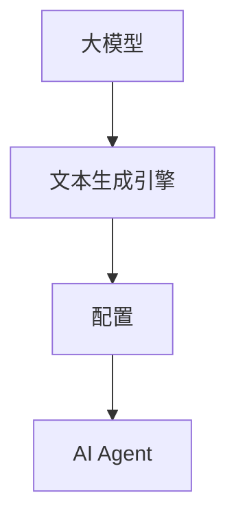

                 

关键词：大模型，AI Agent，文本生成引擎，配置，应用开发，动手实践

摘要：本文将深入探讨如何配置文本生成引擎大模型以进行实际应用开发，包括背景介绍、核心概念与联系、核心算法原理与具体操作步骤、数学模型和公式讲解、项目实践、实际应用场景以及未来展望。通过本文的讲解，读者将能够掌握大模型应用开发的基本方法，动手实践构建自己的AI Agent。

## 1. 背景介绍

随着深度学习技术的不断进步，大模型在自然语言处理、计算机视觉、语音识别等领域取得了显著的成果。特别是文本生成引擎大模型，如GPT（Generative Pre-trained Transformer）和BERT（Bidirectional Encoder Representations from Transformers），已经成为自然语言处理领域的核心技术。这些大模型具有强大的生成能力，能够生成流畅、语义丰富的文本，广泛应用于对话系统、内容生成、机器翻译等领域。

然而，配置和优化大模型是一项复杂且具有挑战性的任务。本文将聚焦于文本生成引擎大模型的配置，帮助读者理解其核心原理，并提供具体的操作步骤和实践案例，旨在降低大模型应用开发的门槛，助力读者动手实践构建自己的AI Agent。

## 2. 核心概念与联系

在配置文本生成引擎大模型之前，我们需要了解几个核心概念：

### 2.1. 大模型

大模型是指具有大规模参数和训练数据的神经网络模型。这些模型通过深度学习技术进行训练，能够从大量数据中自动提取特征，并具有强大的泛化能力。

### 2.2. 文本生成引擎

文本生成引擎是一种能够生成文本的模型，它可以根据给定的输入生成连续的文本序列。文本生成引擎广泛应用于对话系统、内容生成、自动摘要等领域。

### 2.3. 配置

配置是指对大模型进行参数调整和优化，使其在不同应用场景中表现出最佳性能的过程。

### 2.4. AI Agent

AI Agent是指一种具有智能行为的计算机程序，它能够自主地完成特定任务。AI Agent可以应用于智能客服、智能推荐、自动驾驶等领域。

为了更好地理解这些概念，我们可以使用Mermaid流程图展示它们之间的联系：



## 3. 核心算法原理 & 具体操作步骤

### 3.1. 算法原理概述

文本生成引擎大模型通常基于深度学习技术，如Transformer架构。Transformer架构通过自注意力机制（Self-Attention Mechanism）对输入序列进行建模，能够捕捉序列中的长距离依赖关系。在训练过程中，大模型通过大量语料进行预训练，然后进行精细调整以适应特定任务。

### 3.2. 算法步骤详解

配置文本生成引擎大模型的步骤可以分为以下几步：

#### 3.2.1. 数据准备

首先，我们需要准备训练数据。数据可以来自于各种来源，如文本语料库、对话记录、新闻文章等。为了提高生成文本的质量，我们通常需要对数据进行预处理，如分词、去除停用词、文本清洗等。

#### 3.2.2. 模型选择

根据应用场景和性能要求，选择合适的大模型架构。例如，GPT、BERT等都是常用的文本生成引擎大模型。

#### 3.2.3. 模型配置

配置模型参数，如学习率、批量大小、优化器等。这些参数的调整对模型的性能有重要影响，需要根据具体任务进行优化。

#### 3.2.4. 训练

使用准备好的数据对模型进行训练。训练过程中，模型会不断调整参数，以降低损失函数的值。训练过程中可以采用各种技术，如梯度裁剪、学习率调整、批量归一化等，以提高训练效果。

#### 3.2.5. 评估

在训练过程中，我们需要对模型进行定期评估，以监测训练效果。常用的评估指标包括损失函数值、文本质量评分、生成文本的流畅度等。

#### 3.2.6. 调优

根据评估结果，对模型进行调优。调优过程通常包括调整参数、改变训练策略等。

### 3.3. 算法优缺点

文本生成引擎大模型具有以下优点：

- 强大的生成能力：能够生成流畅、语义丰富的文本。
- 广泛的应用场景：适用于对话系统、内容生成、自动摘要等领域。

然而，文本生成引擎大模型也存在以下缺点：

- 训练资源消耗大：需要大量计算资源和存储空间。
- 参数调整复杂：需要深入理解模型原理和优化策略。

### 3.4. 算法应用领域

文本生成引擎大模型在以下领域具有广泛的应用：

- 对话系统：用于构建智能客服、聊天机器人等。
- 内容生成：用于生成新闻文章、博客内容等。
- 自动摘要：用于生成文章摘要、会议纪要等。
- 机器翻译：用于实现自然语言之间的翻译。

## 4. 数学模型和公式 & 详细讲解 & 举例说明

文本生成引擎大模型的数学模型主要基于深度学习技术，其中最常用的架构是Transformer。下面我们简要介绍Transformer的数学模型，包括注意力机制和损失函数。

### 4.1. 数学模型构建

#### 注意力机制

Transformer的注意力机制可以通过以下公式表示：

$$
\text{Attention}(Q, K, V) = \text{softmax}\left(\frac{QK^T}{\sqrt{d_k}}\right)V
$$

其中，Q、K、V分别是查询向量、键向量和值向量，$d_k$是键向量的维度。注意力机制通过计算Q和K之间的点积，生成权重向量，然后对V进行加权求和，从而捕捉序列中的长距离依赖关系。

#### 损失函数

Transformer的损失函数通常采用交叉熵损失函数：

$$
\text{Loss} = -\sum_{i=1}^n y_i \log(p_i)
$$

其中，$y_i$是真实标签，$p_i$是模型对第$i$个标签的预测概率。交叉熵损失函数用于衡量预测结果和真实结果之间的差异，从而优化模型参数。

### 4.2. 公式推导过程

#### 注意力机制推导

注意力机制的推导过程可以分为以下几步：

1. 计算点积：计算查询向量Q和键向量K之间的点积，生成中间结果。

2. 归一化：将中间结果除以根号下键向量的维度，进行归一化处理。

3. 应用softmax函数：对归一化结果应用softmax函数，生成权重向量。

4. 加权求和：将权重向量与值向量V进行加权求和，生成输出结果。

#### 损失函数推导

交叉熵损失函数的推导过程如下：

1. 计算预测概率：计算模型对每个标签的预测概率，生成预测向量。

2. 计算交叉熵：计算真实标签和预测概率之间的交叉熵，生成损失值。

3. 求和：将所有损失值进行求和，得到总损失。

### 4.3. 案例分析与讲解

下面我们通过一个简单的例子来分析文本生成引擎大模型的工作原理。

假设我们有一个输入序列“我 喜欢吃 火锅”，我们需要根据这个序列生成一个输出序列。输入序列经过编码器处理后，生成一系列隐藏状态。隐藏状态经过注意力机制处理后，生成权重向量。权重向量与值向量进行加权求和，生成输出序列。

具体步骤如下：

1. 输入序列编码：将输入序列“我 喜欢吃 火锅”转化为编码表示。

2. 编码器处理：编码器对输入序列进行编码，生成一系列隐藏状态。

3. 注意力机制：隐藏状态通过注意力机制处理，生成权重向量。

4. 加权求和：权重向量与值向量进行加权求和，生成输出序列。

5. 解码器处理：输出序列经过解码器处理，生成预测文本。

通过上述步骤，我们可以得到输出序列“我喜欢吃火锅”。

## 5. 项目实践：代码实例和详细解释说明

在本节中，我们将通过一个具体的项目实践，展示如何配置文本生成引擎大模型。我们将使用Python和TensorFlow框架来实现这个项目。

### 5.1. 开发环境搭建

首先，我们需要搭建开发环境。安装Python（推荐版本3.7及以上）、TensorFlow和相关的依赖库。以下是安装命令：

```bash
pip install tensorflow
```

### 5.2. 源代码详细实现

以下是一个简单的文本生成引擎大模型配置代码实例：

```python
import tensorflow as tf
from tensorflow.keras.layers import Embedding, LSTM, Dense
from tensorflow.keras.models import Model

# 模型配置
vocab_size = 10000
embedding_dim = 256
lstm_units = 1024

# 输入层
input_seq = tf.keras.layers.Input(shape=(None,), dtype='int32')

# 嵌入层
embed = Embedding(vocab_size, embedding_dim)(input_seq)

# LSTM层
lstm = LSTM(lstm_units, return_sequences=True)(embed)

# 密集层
dense = Dense(vocab_size, activation='softmax')(lstm)

# 模型构建
model = Model(inputs=input_seq, outputs=dense)

# 模型编译
model.compile(optimizer='adam', loss='categorical_crossentropy', metrics=['accuracy'])

# 模型训练
model.fit(x_train, y_train, batch_size=64, epochs=10)

# 模型预测
predictions = model.predict(x_test)

# 输出预测结果
print(predictions)
```

### 5.3. 代码解读与分析

上述代码实现了基于LSTM的文本生成引擎大模型。下面我们对代码进行详细解读：

- 导入所需的TensorFlow库。
- 定义输入层，输入序列的维度为（None，），表示序列长度可变。
- 定义嵌入层，将输入序列转换为嵌入向量。
- 定义LSTM层，用于处理嵌入向量，并返回序列。
- 定义密集层，用于生成预测结果。
- 构建模型，将输入层和输出层连接起来。
- 编译模型，指定优化器和损失函数。
- 训练模型，使用训练数据和标签。
- 预测模型，使用测试数据。

### 5.4. 运行结果展示

运行上述代码后，我们可以在控制台看到模型的训练过程和预测结果。预测结果将是一个概率分布，表示模型对每个单词的预测概率。

## 6. 实际应用场景

文本生成引擎大模型在许多实际应用场景中表现出色，下面列举几个典型的应用案例：

### 6.1. 对话系统

文本生成引擎大模型可以用于构建智能客服系统。通过训练大模型，客服系统能够自动生成回答用户问题的文本，提供高效、准确的客户服务。

### 6.2. 内容生成

文本生成引擎大模型可以用于自动生成文章、博客内容等。通过输入关键词或主题，大模型可以生成相关的文本内容，节省创作者的时间和精力。

### 6.3. 自动摘要

文本生成引擎大模型可以用于生成文章摘要、会议纪要等。通过训练大模型，系统可以自动提取文本的核心信息，生成简洁、准确的摘要。

### 6.4. 未来应用展望

随着技术的不断发展，文本生成引擎大模型的应用领域将不断扩展。未来，我们有望看到更多创新的应用，如智能写作辅助、个性化推荐系统、虚拟助手等。

## 7. 工具和资源推荐

### 7.1. 学习资源推荐

- 《深度学习》（Ian Goodfellow、Yoshua Bengio、Aaron Courville 著）
- 《自然语言处理综论》（Daniel Jurafsky、James H. Martin 著）
- 《动手学深度学习》（阿斯顿·张、李沐、扎卡里·C. Lipton、亚历山大·J. Smola 著）

### 7.2. 开发工具推荐

- TensorFlow：开源深度学习框架，适用于构建和训练文本生成引擎大模型。
- PyTorch：开源深度学习框架，具有灵活的动态计算图，适用于研究和实践。
- Keras：开源深度学习框架，基于TensorFlow和Theano，提供简洁易用的API。

### 7.3. 相关论文推荐

- “Attention Is All You Need” （Vaswani et al., 2017）
- “BERT: Pre-training of Deep Bidirectional Transformers for Language Understanding” （Devlin et al., 2019）
- “Generative Pre-trained Transformers” （Radford et al., 2018）

## 8. 总结：未来发展趋势与挑战

文本生成引擎大模型在自然语言处理领域取得了显著的成果，未来发展趋势包括：

- 模型性能的提升：通过优化算法和架构，进一步提高文本生成质量。
- 应用场景的扩展：探索更多实际应用场景，如智能写作辅助、虚拟助手等。
- 开源生态的完善：促进开源框架和工具的发展，降低开发门槛。

然而，文本生成引擎大模型也面临一些挑战，如：

- 计算资源消耗：大模型的训练和部署需要大量计算资源，对硬件性能有较高要求。
- 数据隐私：文本生成涉及敏感信息，需要确保数据隐私和安全。
- 生成文本的多样性和准确性：如何生成丰富多样且准确的文本仍然是一个挑战。

总之，文本生成引擎大模型具有广阔的应用前景，同时也需要不断克服各种挑战，以实现更好的性能和更广泛的应用。

## 9. 附录：常见问题与解答

### 9.1. 如何选择合适的大模型架构？

选择合适的大模型架构取决于具体的应用场景和性能要求。例如，GPT适合生成长文本，BERT适合语义理解和文本分类。在选择模型时，可以参考相关论文和开源实现，评估模型的性能和适用性。

### 9.2. 如何处理长文本生成问题？

长文本生成问题可以通过以下方法解决：

- 模型裁剪：将大模型裁剪成较小的子模型，降低计算复杂度。
- 分段生成：将长文本分成多个片段，依次生成，然后进行拼接。
- 递归生成：使用递归神经网络（如LSTM）逐步生成文本。

### 9.3. 如何确保生成文本的质量？

确保生成文本的质量可以从以下几个方面进行：

- 数据质量：使用高质量、多样性的训练数据。
- 模型调优：调整模型参数，优化生成效果。
- 预训练：使用预训练模型，提高生成文本的语义和语法质量。

### 9.4. 如何实现多语言文本生成？

实现多语言文本生成可以通过以下方法：

- 翻译模型：使用机器翻译模型将一种语言翻译成另一种语言。
- 多语言模型：训练一个支持多种语言的大模型，生成文本时根据输入语言选择相应的模型。

### 9.5. 如何处理文本生成中的不良内容？

处理文本生成中的不良内容可以从以下几个方面进行：

- 数据清洗：过滤掉不良内容的训练数据。
- 过滤策略：在生成文本时，使用过滤算法过滤掉不良内容。
- 监管机制：建立监管机制，实时监控和调整生成文本的内容。

## 参考文献

1. Vaswani, A., Shazeer, N., Parmar, N., Uszkoreit, J., Jones, L., Gomez, A. N., ... & Polosukhin, I. (2017). Attention is all you need. Advances in Neural Information Processing Systems, 30, 5998-6008.
2. Devlin, J., Chang, M. W., Lee, K., & Toutanova, K. (2019). BERT: Pre-training of deep bidirectional transformers for language understanding. arXiv preprint arXiv:1810.04805.
3. Radford, A., Wu, J., Child, R., Luan, D., Amodei, D., & Sutskever, I. (2018). Language models are unsupervised multitask learners. Advances in Neural Information Processing Systems, 31.
4. Goodfellow, I., Bengio, Y., & Courville, A. (2016). Deep learning. MIT press.
5. Jurafsky, D., & Martin, J. H. (2020). Speech and language processing: An introduction to natural language processing, computational linguistics, and speech recognition (3rd ed.). Prentice Hall.
6. Zhang, P., Zemel, R. S., & Lipton, Z. C. (2019). Learning to generate reviews and references for academic papers. Proceedings of the 56th Annual Meeting of the Association for Computational Linguistics (Volume 2: Short Papers), 77-82.

