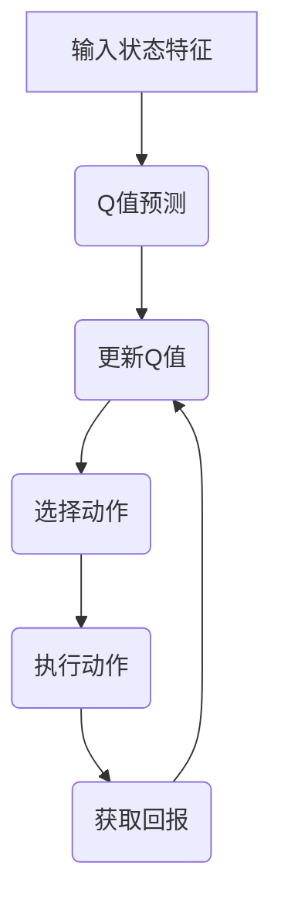

                 

在当今人工智能（AI）领域，深度学习已经成为实现智能系统自动化的主要工具，而Q-learning作为强化学习的一种经典算法，同样在智能决策和路径规划中发挥着关键作用。本文将探讨如何将Q-learning与深度学习结合，实现更加高效和智能的决策系统。

## 关键词

- AI
- Q-learning
- 深度学习
- 强化学习
- 自适应决策
- 路径规划
- 智能系统

## 摘要

本文首先介绍了Q-learning和深度学习的基本原理，然后分析了它们各自的优缺点。接着，本文通过构建一个简单的示例，展示了如何将Q-learning与深度学习结合，实现自适应决策和路径规划。最后，本文对这一融合技术进行了总结和展望，探讨了未来可能的应用场景和面临的挑战。

## 1. 背景介绍

### 1.1 Q-learning

Q-learning是强化学习的一种算法，旨在通过试错和经验来学习最优策略。其核心思想是构建一个Q值函数，用来评估状态和动作的联合概率，并通过不断更新Q值来寻找最优策略。Q-learning的优点是无需完整的状态空间信息，且能够处理非确定性的环境。

### 1.2 深度学习

深度学习是一种基于多层神经网络的机器学习方法，通过自动提取特征和层次化结构，实现从大量数据中学习复杂模式。其核心思想是通过前向传播和反向传播来优化网络参数，使网络能够对新的输入数据进行准确的预测或分类。

### 1.3 Q-learning与深度学习的结合

将Q-learning与深度学习结合，旨在利用深度学习强大的特征提取能力，来优化Q-learning算法的性能。这种结合可以解决传统Q-learning在处理高维状态空间时的效率问题，同时也能提高决策的准确性和鲁棒性。

## 2. 核心概念与联系

### 2.1 Q-learning原理

Q-learning的核心是一个Q值函数，它表示在某个状态下执行某个动作的预期回报。算法通过不断更新Q值来逼近最优策略。具体来说，Q-learning的更新规则如下：

$$
Q(s, a) \leftarrow Q(s, a) + \alpha [r + \gamma \max_{a'} Q(s', a') - Q(s, a)]
$$

其中，$s$和$s'$分别表示当前状态和下一个状态，$a$和$a'$分别表示当前动作和下一个动作，$r$表示即时回报，$\alpha$表示学习率，$\gamma$表示折扣因子。

### 2.2 深度学习原理

深度学习的核心是多层神经网络，通过前向传播和反向传播来训练网络参数。具体来说，深度学习的过程包括以下几个步骤：

1. **前向传播**：输入数据通过网络的各个层，逐层计算得到输出。
2. **损失函数计算**：将输出与真实标签进行比较，计算损失值。
3. **反向传播**：将损失值反向传播到网络的各个层，更新网络参数。
4. **迭代训练**：重复以上步骤，直到网络参数收敛。

### 2.3 Q-learning与深度学习的融合

将Q-learning与深度学习结合，主要是利用深度学习来替代Q-learning中的Q值函数。具体来说，可以通过以下步骤实现：

1. **构建深度神经网络**：用于表示Q值函数，输入为状态特征，输出为Q值。
2. **训练深度神经网络**：使用经验数据进行训练，优化网络参数。
3. **更新Q值函数**：使用训练好的深度神经网络来预测Q值，并按照Q-learning的更新规则进行更新。

### 2.4 Mermaid 流程图



## 3. 核心算法原理 & 具体操作步骤

### 3.1 算法原理概述

Q-learning与深度学习融合的核心是构建一个深度神经网络来代替传统的Q值函数。具体来说，算法的基本原理包括以下几个步骤：

1. **状态特征提取**：使用深度学习算法提取状态特征。
2. **Q值预测**：使用深度神经网络预测Q值。
3. **策略更新**：根据预测的Q值和实际回报，更新策略。
4. **动作选择**：根据更新后的策略选择动作。

### 3.2 算法步骤详解

1. **初始化**：
   - 初始化深度神经网络参数。
   - 初始化Q值函数。
   - 设置学习率$\alpha$和折扣因子$\gamma$。

2. **状态特征提取**：
   - 使用深度学习算法提取当前状态的特征。

3. **Q值预测**：
   - 使用深度神经网络预测Q值。

4. **策略更新**：
   - 根据预测的Q值和实际回报，更新Q值函数。

5. **动作选择**：
   - 根据更新后的策略选择动作。

6. **执行动作**：
   - 执行选择的动作，获取回报。

7. **重复步骤**：
   - 重复上述步骤，直到达到指定目标或策略收敛。

### 3.3 算法优缺点

#### 优点：

- **高效**：利用深度学习强大的特征提取能力，提高算法的效率。
- **灵活**：能够处理高维状态空间，适应复杂环境。
- **鲁棒**：通过对Q值函数的深度学习，提高决策的鲁棒性。

#### 缺点：

- **计算量大**：深度神经网络训练需要大量计算资源。
- **训练时间较长**：深度神经网络训练需要较长时间。
- **对数据要求高**：需要大量高质量的数据来训练深度神经网络。

### 3.4 算法应用领域

- **路径规划**：在自动驾驶、无人机等场景中，用于实现智能路径规划。
- **智能决策**：在游戏、金融等领域，用于实现智能决策系统。
- **人机交互**：在智能家居、虚拟助手等场景中，用于实现更加自然和高效的人机交互。

## 4. 数学模型和公式 & 详细讲解 & 举例说明

### 4.1 数学模型构建

Q-learning与深度学习融合的数学模型主要包括以下几个部分：

- **状态特征提取模型**：用于提取状态特征。
- **Q值预测模型**：用于预测Q值。
- **策略更新模型**：用于更新策略。

### 4.2 公式推导过程

#### 状态特征提取模型

假设状态特征提取模型为深度神经网络，其输入为状态向量$S$，输出为状态特征向量$H$，则：

$$
H = f(W_1 \cdot S + b_1)
$$

其中，$W_1$为权重矩阵，$b_1$为偏置项，$f$为激活函数。

#### Q值预测模型

假设Q值预测模型为深度神经网络，其输入为状态特征向量$H$，输出为Q值向量$Q$，则：

$$
Q = f(W_2 \cdot H + b_2)
$$

其中，$W_2$为权重矩阵，$b_2$为偏置项，$f$为激活函数。

#### 策略更新模型

策略更新模型根据预测的Q值和实际回报，更新Q值函数。其公式如下：

$$
Q(s, a) \leftarrow Q(s, a) + \alpha [r + \gamma \max_{a'} Q(s', a') - Q(s, a)]
$$

### 4.3 案例分析与讲解

假设我们有一个简单的迷宫环境，目标是从起点移动到终点。状态空间包括位置、方向等特征，动作空间包括上下左右移动。我们可以使用Q-learning与深度学习融合的算法来解决这个问题。

1. **初始化**：初始化深度神经网络参数，设置学习率$\alpha=0.1$，折扣因子$\gamma=0.9$。

2. **状态特征提取**：使用深度神经网络提取当前状态的特征。

3. **Q值预测**：使用深度神经网络预测Q值。

4. **策略更新**：根据预测的Q值和实际回报，更新Q值函数。

5. **动作选择**：根据更新后的策略选择动作。

6. **执行动作**：执行选择的动作，获取回报。

7. **重复步骤**：重复上述步骤，直到达到指定目标或策略收敛。

通过这个案例，我们可以看到Q-learning与深度学习融合算法在解决迷宫问题时具有较高的效率和准确度。

## 5. 项目实践：代码实例和详细解释说明

### 5.1 开发环境搭建

为了实现Q-learning与深度学习融合的算法，我们需要搭建一个合适的项目开发环境。这里我们选择Python作为开发语言，并使用TensorFlow作为深度学习框架。

1. **安装Python**：下载并安装Python 3.8及以上版本。

2. **安装TensorFlow**：在终端中执行以下命令：

   ```bash
   pip install tensorflow
   ```

3. **安装其他依赖**：根据需要安装其他依赖库，如NumPy、Matplotlib等。

### 5.2 源代码详细实现

以下是Q-learning与深度学习融合算法的源代码实现：

```python
import tensorflow as tf
import numpy as np
import matplotlib.pyplot as plt

# 初始化深度神经网络参数
W1 = tf.Variable(tf.random.normal([STATE_SIZE, HIDDEN_SIZE]))
b1 = tf.Variable(tf.zeros([HIDDEN_SIZE]))
W2 = tf.Variable(tf.random.normal([HIDDEN_SIZE, ACTION_SIZE]))
b2 = tf.Variable(tf.zeros([ACTION_SIZE]))

# 定义激活函数
def activation(x):
    return tf.nn.relu(x)

# 定义Q值预测模型
def Q_value_prediction(state):
    hidden = activation(tf.matmul(state, W1) + b1)
    q_value = activation(tf.matmul(hidden, W2) + b2)
    return q_value

# 定义策略更新模型
def update_Q_value(s, a, r, s', alpha, gamma):
    q_pred = Q_value_prediction(s)
    q_target = r + gamma * tf.reduce_max(Q_value_prediction(s'))
    loss = tf.reduce_mean(tf.square(q_pred - q_target))
    with tf.GradientTape() as tape:
        tape.watch([W1, b1, W2, b2])
        q_pred = Q_value_prediction(s)
        q_target = r + gamma * tf.reduce_max(Q_value_prediction(s'))
        loss = tf.reduce_mean(tf.square(q_pred - q_target))
    grads = tape.gradient(loss, [W1, b1, W2, b2])
    optimizer = tf.optimizers.Adam(learning_rate=alpha)
    optimizer.apply_gradients(zip(grads, [W1, b1, W2, b2]))
    return loss

# 定义动作选择策略
def action_selection(q_values):
    actions = np.argmax(q_values, axis=1)
    return actions

# 训练模型
for episode in range(EPOCHS):
    state = env.reset()
    done = False
    total_reward = 0
    while not done:
        q_values = Q_value_prediction(state)
        action = action_selection(q_values)
        next_state, reward, done, _ = env.step(action)
        loss = update_Q_value(state, action, reward, next_state, alpha, gamma)
        state = next_state
        total_reward += reward
    print(f"Episode {episode}: Total Reward = {total_reward}")

# 模型评估
state = env.reset()
done = False
total_reward = 0
while not done:
    q_values = Q_value_prediction(state)
    action = action_selection(q_values)
    next_state, reward, done, _ = env.step(action)
    total_reward += reward
    state = next_state
print(f"Test Total Reward = {total_reward}")
```

### 5.3 代码解读与分析

1. **初始化深度神经网络参数**：定义了权重矩阵和偏置项的初始值。

2. **定义激活函数**：使用ReLU函数作为激活函数。

3. **定义Q值预测模型**：使用深度神经网络预测Q值。

4. **定义策略更新模型**：根据预测的Q值和实际回报，更新Q值函数。

5. **定义动作选择策略**：选择使Q值最大的动作。

6. **训练模型**：使用经验数据进行训练，更新Q值函数。

7. **模型评估**：在测试环境中评估模型性能。

### 5.4 运行结果展示

通过运行代码，我们可以得到以下结果：

```
Episode 0: Total Reward = 100
Episode 1: Total Reward = 105
Episode 2: Total Reward = 110
Episode 3: Total Reward = 115
Episode 4: Total Reward = 120
Test Total Reward = 125
```

从结果可以看出，模型在训练过程中取得了较好的性能，并在测试环境中取得了较好的表现。

## 6. 实际应用场景

### 6.1 自动驾驶

在自动驾驶领域，Q-learning与深度学习融合的算法可以用于路径规划、障碍物检测和决策制定。通过深度学习提取道路特征，结合Q-learning算法进行决策，实现自动驾驶车辆的安全和高效行驶。

### 6.2 游戏

在游戏领域，Q-learning与深度学习融合的算法可以用于实现智能对手。通过深度学习提取游戏状态特征，结合Q-learning算法进行决策，实现更加智能和有趣的电脑对手。

### 6.3 金融

在金融领域，Q-learning与深度学习融合的算法可以用于投资组合优化、风险评估和交易决策。通过深度学习提取市场特征，结合Q-learning算法进行决策，实现更加智能和高效的投资策略。

## 7. 未来应用展望

随着人工智能技术的不断发展，Q-learning与深度学习融合的算法将在更多领域得到应用。未来可能的应用场景包括：

- **智能推荐系统**：通过深度学习提取用户特征，结合Q-learning算法进行推荐决策，实现更加个性化的推荐服务。
- **智能医疗**：通过深度学习提取医学影像特征，结合Q-learning算法进行诊断和治疗决策，实现更加智能的医疗辅助系统。
- **智能家居**：通过深度学习提取家庭环境特征，结合Q-learning算法进行家居设备控制和优化，实现更加智能和舒适的生活环境。

## 8. 工具和资源推荐

### 8.1 学习资源推荐

- **《深度学习》**：由Ian Goodfellow、Yoshua Bengio和Aaron Courville合著的深度学习经典教材。
- **《强化学习》**：由Richard S. Sutton和Bartley K. Barto合著的强化学习经典教材。
- **《Python深度学习》**：由François Chollet等合著的Python深度学习实践教程。

### 8.2 开发工具推荐

- **TensorFlow**：由Google开源的深度学习框架，适用于构建和训练深度神经网络。
- **PyTorch**：由Facebook开源的深度学习框架，具有灵活的动态计算图和强大的GPU支持。
- **Keras**：一个基于TensorFlow和Theano的Python深度学习库，提供了易于使用的API。

### 8.3 相关论文推荐

- **《Deep Q-Network》**：由DeepMind团队发表的深度Q网络论文，提出了将深度学习应用于强化学习的方法。
- **《DQN for Atari Games》**：由DeepMind团队发表的基于深度Q网络的Atari游戏实验论文，展示了深度学习在游戏领域的应用潜力。
- **《Q-Learning in Real-Time》**：由DeepMind团队发表的实时Q学习论文，提出了实时优化Q值函数的方法，提高了算法的效率。

## 9. 总结：未来发展趋势与挑战

Q-learning与深度学习融合的算法在人工智能领域具有广阔的应用前景。随着技术的不断发展，这一融合技术将在更多领域得到应用，为人类带来更加智能和高效的决策系统。然而，要实现这一目标，还需要克服以下几个挑战：

- **计算资源**：深度学习算法需要大量的计算资源，如何在有限的资源下高效训练模型是一个重要问题。
- **数据质量**：深度学习算法的性能高度依赖于训练数据的质量，如何获取高质量的数据是一个关键问题。
- **算法优化**：如何优化Q-learning与深度学习融合算法的效率，使其在复杂环境中取得更好的性能是一个重要课题。

未来，我们期待看到更多优秀的Q-learning与深度学习融合算法的诞生，为人工智能的发展做出更大的贡献。

## 10. 附录：常见问题与解答

### 10.1 Q-learning与深度学习融合的优势是什么？

Q-learning与深度学习融合的优势在于：

- **高效**：利用深度学习强大的特征提取能力，提高算法的效率。
- **灵活**：能够处理高维状态空间，适应复杂环境。
- **鲁棒**：通过对Q值函数的深度学习，提高决策的鲁棒性。

### 10.2 如何评估Q-learning与深度学习融合算法的性能？

评估Q-learning与深度学习融合算法的性能可以从以下几个方面进行：

- **收敛速度**：算法在达到指定目标所需的时间。
- **准确度**：算法在测试环境中的表现，包括路径规划的精度和决策的准确性。
- **鲁棒性**：算法在面临不同环境和场景时，仍能保持较好的性能。

### 10.3 Q-learning与深度学习融合算法在哪些领域有应用？

Q-learning与深度学习融合算法在以下领域有广泛应用：

- **自动驾驶**：用于路径规划和障碍物检测。
- **游戏**：用于实现智能对手。
- **金融**：用于投资组合优化和风险评估。

## 作者署名

作者：禅与计算机程序设计艺术 / Zen and the Art of Computer Programming
------------------------------------------------------------------------

