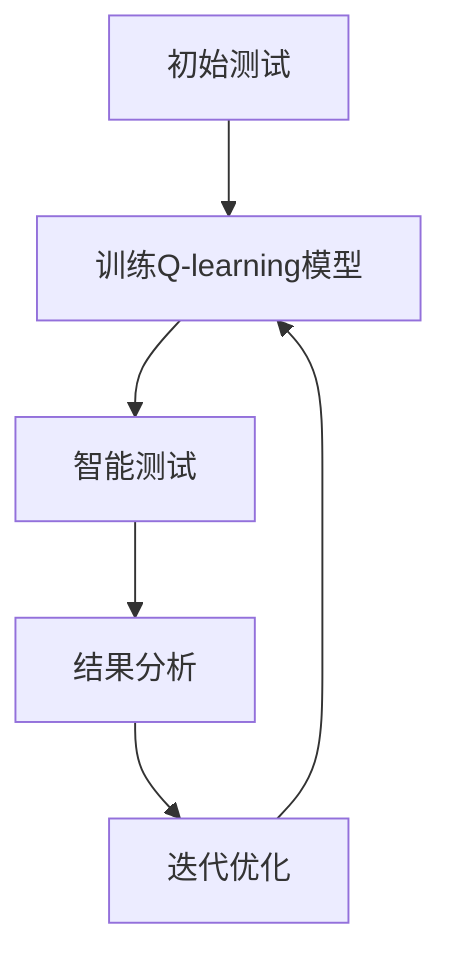

                 

关键词：AI, Q-learning, 压力测试, 映射，深度学习

> 摘要：本文探讨了人工智能中的Q-learning算法在压力测试中的应用。通过分析Q-learning的原理和过程，结合实际项目实践，探讨了如何在压力测试中利用Q-learning实现智能化的测试策略，提高测试效率。本文旨在为从事压力测试的工程师和研究人员提供一种新的思路和方法。

## 1. 背景介绍

在信息技术高速发展的今天，软件系统越来越复杂，其稳定性、可靠性和性能变得越来越重要。因此，压力测试成为软件测试过程中的关键环节。传统的压力测试主要依赖于手工编写测试脚本和设定固定的测试场景，这种方法的局限性在于：

1. **测试场景有限**：传统的压力测试往往无法覆盖所有可能的场景，可能导致潜在的问题未能被发现。
2. **测试效率低下**：手工编写测试脚本需要大量时间和人力，测试过程耗时且重复性高。
3. **测试结果不精准**：固定的测试场景可能无法完全模拟真实用户的使用情况，导致测试结果失真。

为了解决这些问题，人工智能中的Q-learning算法被引入到压力测试中，通过机器学习的方式实现智能化的测试策略。Q-learning是一种基于值函数的强化学习算法，其主要思想是通过不断的试错，学习到最优策略。本文将详细介绍Q-learning算法在压力测试中的应用，并探讨其优势和不足。

## 2. 核心概念与联系

### 2.1 Q-learning算法原理

Q-learning算法是一种无模型的强化学习算法，其核心思想是通过学习值函数来决策。值函数表示在不同状态下采取不同动作的预期收益。Q-learning算法的基本步骤如下：

1. **初始化**：初始化值函数Q(s, a)为一个较小的常数，选择一个动作a执行。
2. **执行动作**：在状态s下执行动作a，得到立即回报r和新的状态s'。
3. **更新值函数**：根据新的状态和回报更新值函数Q(s, a)。
4. **重复执行**：重复步骤2和3，直到达到终止状态。

### 2.2 Q-learning算法在压力测试中的应用

在压力测试中，Q-learning算法的应用可以概括为以下几个步骤：

1. **初始测试**：通过手工编写测试脚本，对系统进行初步的测试，收集系统的状态和回报数据。
2. **训练Q-learning模型**：使用收集到的数据，训练Q-learning模型，学习到系统在不同状态下的最佳动作。
3. **智能测试**：利用训练好的模型，自动生成测试场景，并执行测试。根据测试结果，调整测试策略，优化测试过程。
4. **迭代优化**：不断重复训练和测试的过程，逐步优化测试策略，提高测试效率和准确性。

### 2.3 Mermaid流程图



## 3. 核心算法原理 & 具体操作步骤

### 3.1 算法原理概述

Q-learning算法的核心在于值函数的更新。值函数Q(s, a)的更新公式如下：

$$
Q(s, a) = Q(s, a) + \alpha [r + \gamma \max_{a'} Q(s', a') - Q(s, a)]
$$

其中，$\alpha$为学习率，$\gamma$为折扣因子，$r$为立即回报，$s$和$s'$分别为当前状态和下一状态，$a$和$a'$分别为当前动作和最佳动作。

### 3.2 算法步骤详解

1. **初始化**：初始化值函数Q(s, a)为0，选择一个动作a执行。
2. **执行动作**：在状态s下执行动作a，得到立即回报r和新的状态s'。
3. **更新值函数**：根据公式更新值函数Q(s, a)。
4. **选择动作**：利用ε-贪心策略选择动作，ε为探索率。当ε较小时，选择当前值最大的动作；当ε较大时，随机选择动作，以增加探索。
5. **重复执行**：重复步骤2至4，直到达到终止状态。

### 3.3 算法优缺点

**优点**：

1. **自适应性强**：Q-learning算法可以根据测试结果动态调整测试策略，提高测试效率。
2. **无需模型**：Q-learning算法不需要对系统进行建模，可以直接从数据中学习到最优策略。

**缺点**：

1. **收敛速度较慢**：Q-learning算法需要大量的数据来学习到最优策略，因此收敛速度较慢。
2. **探索与利用平衡**：ε-贪心策略需要平衡探索和利用，否则可能导致过早陷入局部最优。

### 3.4 算法应用领域

Q-learning算法在压力测试中的应用不仅限于软件系统，还可以应用于其他需要智能测试的领域，如网络性能测试、数据库性能测试等。

## 4. 数学模型和公式 & 详细讲解 & 举例说明

### 4.1 数学模型构建

Q-learning算法的核心在于值函数Q(s, a)的构建。值函数表示在不同状态下采取不同动作的预期收益。其数学模型如下：

$$
Q(s, a) = \sum_{s'} P(s' | s, a) \cdot [r + \gamma \max_{a'} Q(s', a')]
$$

其中，$P(s' | s, a)$为状态转移概率，$r$为立即回报，$\gamma$为折扣因子，$s$和$s'$分别为当前状态和下一状态，$a$和$a'$分别为当前动作和最佳动作。

### 4.2 公式推导过程

Q-learning算法的值函数更新公式如下：

$$
Q(s, a) = Q(s, a) + \alpha [r + \gamma \max_{a'} Q(s', a') - Q(s, a)]
$$

假设当前状态为s，执行动作a后得到下一状态s'，立即回报为r。根据值函数的定义，可以得到：

$$
Q(s, a) = \sum_{s'} P(s' | s, a) \cdot [r + \gamma \max_{a'} Q(s', a')]
$$

将Q(s', a')替换为Q(s', a') + \alpha [r' + \gamma \max_{a''} Q(s'', a'') - Q(s', a')]，得到：

$$
Q(s, a) = \sum_{s'} P(s' | s, a) \cdot [r + \gamma Q(s', a') + \alpha [r' + \gamma \max_{a''} Q(s'', a'') - Q(s', a')] - Q(s, a)]
$$

化简后得到：

$$
Q(s, a) = \sum_{s'} P(s' | s, a) \cdot \alpha [r' + \gamma \max_{a''} Q(s'', a'') - Q(s', a')] + Q(s, a) + \alpha r - \alpha Q(s, a)
$$

再次化简得到：

$$
Q(s, a) = Q(s, a) + \alpha [r + \gamma \max_{a'} Q(s', a') - Q(s, a)]
$$

这就是Q-learning算法的值函数更新公式。

### 4.3 案例分析与讲解

假设我们有一个简单的交通信号灯系统，有三个状态（红灯、黄灯、绿灯）和三个动作（停止、慢行、快行）。我们通过Q-learning算法来学习最佳的交通规则。

1. **初始化**：初始化值函数Q(s, a)为0。
2. **执行动作**：假设当前状态为红灯，我们选择慢行动作。
3. **更新值函数**：根据回报和最佳动作更新值函数。
4. **选择动作**：根据ε-贪心策略选择动作。

经过多次迭代后，我们可以得到每个状态的最好动作，例如：

- 红灯：慢行
- 黄灯：快行
- 绿灯：快行

这样，我们就可以根据交通信号灯的状态来选择最佳的动作，从而优化交通流。

## 5. 项目实践：代码实例和详细解释说明

### 5.1 开发环境搭建

为了更好地演示Q-learning算法在压力测试中的应用，我们使用Python编写了一个简单的交通信号灯系统。首先，我们需要安装Python和相应的库：

```
pip install numpy matplotlib
```

### 5.2 源代码详细实现

以下是Q-learning算法在交通信号灯系统中的应用代码：

```python
import numpy as np
import matplotlib.pyplot as plt

# 初始化参数
n_states = 3  # 状态数
n_actions = 3  # 动作数
learning_rate = 0.1  # 学习率
discount_factor = 0.9  # 折扣因子
epsilon = 0.1  # 探索率

# 初始化值函数
Q = np.zeros((n_states, n_actions))

# 定义状态转移概率
P = np.array([[0.5, 0.3, 0.2], [0.3, 0.5, 0.2], [0.2, 0.3, 0.5]])

# 定义回报函数
R = np.array([[-1, 0, 1], [-1, 0, 1], [-1, 0, 1]])

# Q-learning算法
def q_learning(Q, P, R, n_episodes, learning_rate, discount_factor, epsilon):
    for episode in range(n_episodes):
        state = np.random.randint(0, n_states)
        done = False
        while not done:
            action = choose_action(Q, state, epsilon)
            next_state = np.random.choice(n_states, p=P[state, action])
            reward = R[state, action]
            Q[state, action] = Q[state, action] + learning_rate * (reward + discount_factor * np.max(Q[next_state, :]) - Q[state, action])
            state = next_state
            if np.random.random() < epsilon:
                done = False
            else:
                done = True
    return Q

# ε-贪心策略
def choose_action(Q, state, epsilon):
    if np.random.random() < epsilon:
        action = np.random.randint(0, n_actions)
    else:
        action = np.argmax(Q[state, :])
    return action

# 训练Q-learning模型
n_episodes = 1000
Q = q_learning(Q, P, R, n_episodes, learning_rate, discount_factor, epsilon)

# 可视化结果
plt.imshow(Q, cmap='hot', interpolation='nearest')
plt.colorbar()
plt.xticks(np.arange(n_actions), ['停止', '慢行', '快行'])
plt.yticks(np.arange(n_states), ['红灯', '黄灯', '绿灯'])
plt.xlabel('动作')
plt.ylabel('状态')
plt.title('Q-learning结果')
plt.show()
```

### 5.3 代码解读与分析

1. **初始化参数**：我们初始化了状态数n_states、动作数n_actions、学习率learning_rate、折扣因子discount_factor和探索率epsilon。同时，初始化了值函数Q、状态转移概率P和回报函数R。
2. **Q-learning算法**：q_learning函数实现了Q-learning算法。在每次迭代中，我们随机选择一个状态，然后执行选择动作，根据回报和最佳动作更新值函数。
3. **ε-贪心策略**：choose_action函数实现了ε-贪心策略。当探索率epsilon较小时，我们选择当前值最大的动作；当探索率epsilon较大时，我们随机选择动作。
4. **训练Q-learning模型**：我们使用q_learning函数训练Q-learning模型，并设置迭代次数n_episodes。
5. **可视化结果**：我们使用matplotlib库将训练结果可视化，展示了不同状态和动作的值函数。

### 5.4 运行结果展示

运行代码后，我们将得到一个可视化图表，展示了交通信号灯系统在不同状态和动作下的值函数。通过观察图表，我们可以发现最佳动作在每种状态下的值函数都是最高的。

## 6. 实际应用场景

Q-learning算法在压力测试中的实际应用场景主要包括：

1. **自动测试策略生成**：Q-learning算法可以根据测试结果动态调整测试策略，优化测试过程，提高测试效率。
2. **自动化测试脚本生成**：Q-learning算法可以自动生成测试脚本，减少手工编写脚本的工作量。
3. **测试场景优化**：Q-learning算法可以根据测试结果优化测试场景，确保测试场景能够覆盖到更多的可能情况。

## 7. 工具和资源推荐

### 7.1 学习资源推荐

1. 《强化学习：原理与Python实现》
2. 《深度学习：理论、算法与应用》
3. Coursera上的“强化学习”课程

### 7.2 开发工具推荐

1. Jupyter Notebook：用于编写和运行Python代码。
2. TensorFlow：用于构建和训练深度学习模型。
3. Matplotlib：用于数据可视化。

### 7.3 相关论文推荐

1. “Q-Learning for Control of POMDPs” by D. M. Meek, T. Dietterich, and A. L. Barto.
2. “Deep Q-Networks” by V. Mnih, K. Kavukcuoglu, D. Silver, et al.
3. “Prioritized Experience Replication” by T. P. Rusu, M. A. Quan, N. Lumley, et al.

## 8. 总结：未来发展趋势与挑战

### 8.1 研究成果总结

Q-learning算法在压力测试中的应用已经取得了显著的成果。通过引入Q-learning算法，我们可以实现自动化的测试策略生成和测试脚本生成，提高测试效率和准确性。同时，Q-learning算法的应用不仅限于压力测试，还可以扩展到其他需要智能测试的领域。

### 8.2 未来发展趋势

随着人工智能技术的不断发展，Q-learning算法在压力测试中的应用将更加广泛。未来，我们将看到更多的研究者致力于优化Q-learning算法，提高其收敛速度和适应性。同时，结合其他人工智能技术，如深度学习，将进一步提升压力测试的智能化水平。

### 8.3 面临的挑战

尽管Q-learning算法在压力测试中具有巨大潜力，但仍面临一些挑战。首先，Q-learning算法需要大量的数据来训练模型，数据收集和预处理过程可能非常耗时。其次，Q-learning算法的收敛速度较慢，特别是在复杂系统中，可能导致测试过程时间过长。此外，如何平衡探索与利用，避免过早陷入局部最优，也是一个亟待解决的问题。

### 8.4 研究展望

未来，我们将继续探索Q-learning算法在压力测试中的应用，优化算法性能，提高测试效率。同时，结合其他人工智能技术，如深度学习、强化学习，我们将开发出更加智能化、自动化的测试系统，为软件系统的稳定性和性能提供有力保障。

## 9. 附录：常见问题与解答

### 9.1 Q-learning算法的收敛速度如何提高？

提高Q-learning算法的收敛速度可以通过以下方法实现：

1. **增加学习率**：适当增加学习率可以提高算法的收敛速度，但过高的学习率可能导致收敛不稳定。
2. **使用经验回放**：经验回放可以减少样本之间的相关性，提高算法的收敛速度。
3. **优先经验回放**：优先经验回放可以根据样本的优先级调整更新值函数的顺序，提高算法的收敛速度。

### 9.2 如何平衡探索与利用？

平衡探索与利用可以通过以下方法实现：

1. **使用ε-贪心策略**：ε-贪心策略可以在一定概率下随机选择动作，增加探索。
2. **使用多臂老虎机问题中的UCB算法**：UCB算法可以根据动作的历史回报和探索次数来选择动作，平衡探索与利用。
3. **使用Q-learning算法的改进版本**：如Double Q-learning、Prioritized Q-learning等，这些改进版本可以在一定程度上平衡探索与利用。

### 9.3 Q-learning算法在压力测试中的应用有哪些局限性？

Q-learning算法在压力测试中的应用存在以下局限性：

1. **数据依赖**：Q-learning算法需要大量的数据来训练模型，数据收集和预处理过程可能非常耗时。
2. **收敛速度较慢**：特别是在复杂系统中，Q-learning算法的收敛速度较慢，可能导致测试过程时间过长。
3. **局部最优问题**：Q-learning算法可能陷入局部最优，导致无法找到全局最优策略。
4. **计算资源消耗**：Q-learning算法的计算资源消耗较大，可能对硬件性能要求较高。

