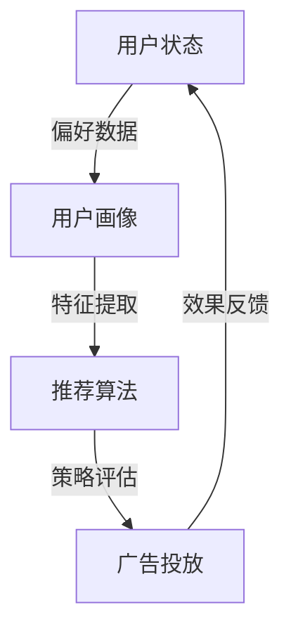
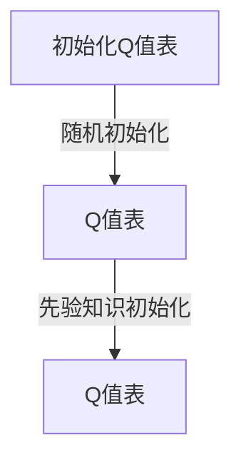
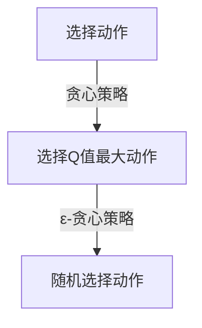
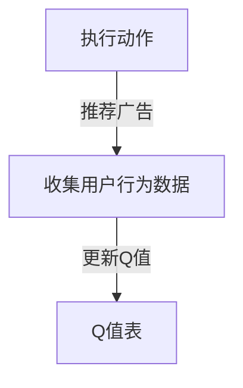

                 

关键词：Q-learning、广告推荐、AI、映射、深度学习

摘要：本文将深入探讨Q-learning算法在广告推荐系统中的实际应用。我们将从Q-learning的基础理论出发，详细分析其在广告推荐中的实现方法，并通过实际案例展示其效果。文章旨在为读者提供一个全面的技术指南，帮助他们理解和运用Q-learning算法，提高广告推荐的准确性和效率。

## 1. 背景介绍

随着互联网的飞速发展，广告推荐系统已经成为各在线平台的核心竞争力之一。有效的广告推荐不仅能够提升用户体验，还能显著增加平台的盈利能力。传统的广告推荐系统主要依赖于统计模型和机器学习算法，如协同过滤、决策树和贝叶斯网络等。然而，这些方法在处理复杂性和动态性方面存在一定的局限性。

近年来，深度学习技术，尤其是强化学习算法，开始逐渐应用于广告推荐系统。Q-learning作为一种经典的强化学习算法，因其强大的自适应能力和灵活性，受到了广泛的关注。本文将重点探讨Q-learning在广告推荐系统中的实践应用，旨在为相关领域的研究者和开发者提供参考。

### 1.1 Q-learning简介

Q-learning是一种基于值函数的强化学习算法，由理查德·萨顿（Richard Sutton）和安德鲁·巴沙提克（Andrew Barto）于1988年提出。Q-learning通过不断地试错，学习环境中的最优策略，以最大化长期累积奖励。

在Q-learning中，状态（State）和动作（Action）构成了决策的基本单元。算法通过评估每个动作在当前状态下的价值（Value），选择一个最优动作。随着时间的推移，Q-learning算法会更新值函数，以逐步接近最优策略。

### 1.2 广告推荐系统概述

广告推荐系统旨在根据用户的兴趣和行为，为其推荐相关的广告。一个典型的广告推荐系统包括以下几个关键组件：

- **用户画像**：基于用户的历史行为和偏好数据，构建用户的兴趣模型。
- **广告画像**：对广告的内容、受众、投放目的等进行特征提取。
- **推荐算法**：根据用户画像和广告画像，选择最适合用户的广告。
- **效果评估**：通过点击率（CTR）、转化率（CVR）等指标，评估推荐效果。

## 2. 核心概念与联系

为了深入理解Q-learning在广告推荐系统中的应用，我们需要先了解相关核心概念及其之间的联系。以下是一个Mermaid流程图，用于展示这些概念及其关系。



### 2.1 用户状态与用户画像

用户状态是指用户在某一时刻的行为和偏好数据。通过分析这些数据，我们可以构建用户的画像，包括用户的兴趣、购买历史、浏览行为等。

### 2.2 用户画像与推荐算法

用户画像作为推荐算法的重要输入，用于选择合适的广告。推荐算法通过比较用户画像和广告画像的特征，为用户推荐最相关的广告。

### 2.3 推荐算法与广告投放

推荐算法选择合适的广告后，将其推送给用户。广告投放是将广告展示给用户的过程，通过用户与广告的互动，收集反馈数据。

### 2.4 广告投放与效果反馈

广告投放的效果通过用户的行为数据进行评估，如点击率、转化率等。这些反馈数据将用于更新用户画像和推荐算法，以提高推荐效果。

## 3. 核心算法原理 & 具体操作步骤

### 3.1 算法原理概述

Q-learning算法的核心思想是通过学习值函数，找到最优策略。在广告推荐系统中，值函数表示每个动作（广告）在当前状态（用户画像）下的价值。具体来说，Q-learning算法包括以下几个关键步骤：

1. **初始化**：初始化Q值表，表示每个状态-动作对的价值。
2. **选择动作**：根据当前状态和Q值表，选择一个动作。
3. **执行动作**：在环境中执行所选动作，观察状态转移和奖励。
4. **更新Q值**：根据观察到的奖励和新的状态，更新Q值表。

### 3.2 算法步骤详解

#### 3.2.1 初始化

初始化Q值表是Q-learning算法的第一步。通常，我们可以使用随机初始化或基于先验知识的初始化方法。例如，可以使用小批量数据对Q值进行初始化，从而减少初始值的随机性。



#### 3.2.2 选择动作

在选择动作时，Q-learning算法可以根据不同的策略进行选择，如贪心策略、ε-贪心策略等。贪心策略在当前状态下选择Q值最大的动作，而ε-贪心策略在部分情况下选择随机动作，以避免过度依赖当前经验。



#### 3.2.3 执行动作

执行动作是Q-learning算法的核心步骤之一。在广告推荐系统中，执行动作意味着向用户推荐选定的广告。用户的行为数据将用于更新Q值表。



#### 3.2.4 更新Q值

更新Q值是根据观察到的奖励和新的状态来调整Q值的过程。在广告推荐系统中，奖励可以是点击率、转化率等指标。根据奖励和状态转移，我们可以使用以下公式更新Q值：

$$
Q(s, a) \leftarrow Q(s, a) + \alpha [r + \gamma \max_{a'} Q(s', a') - Q(s, a)]
$$

其中，$\alpha$ 是学习率，$\gamma$ 是折扣因子，$r$ 是观察到的奖励。

```mermaid
graph TD
A[更新Q值] -->|计算新Q值| B[Q(s, a)]
B -->|更新Q值表| C[Q值表]
```

### 3.3 算法优缺点

#### 3.3.1 优点

1. **自适应性强**：Q-learning算法可以根据环境变化自适应调整策略，具有较强的适应性。
2. **无需模型假设**：Q-learning不需要对环境进行模型假设，适用于复杂的动态环境。
3. **简单易实现**：Q-learning算法相对简单，易于实现和理解。

#### 3.3.2 缺点

1. **收敛速度较慢**：Q-learning算法需要通过大量的试错来学习最优策略，收敛速度相对较慢。
2. **高维状态空间问题**：在高维状态空间中，Q-learning算法可能难以收敛到最优策略。

### 3.4 算法应用领域

Q-learning算法在广告推荐系统中具有广泛的应用前景。除了广告推荐，Q-learning还可以应用于以下领域：

1. **游戏AI**：在电子游戏和棋类游戏中，Q-learning算法可以用于学习策略，实现智能对手。
2. **自动驾驶**：在自动驾驶系统中，Q-learning算法可以用于路径规划和决策。
3. **资源分配**：在资源分配问题中，Q-learning算法可以用于优化资源使用和分配策略。

## 4. 数学模型和公式 & 详细讲解 & 举例说明

### 4.1 数学模型构建

在Q-learning算法中，核心的数学模型是值函数（Q值）。值函数表示每个状态-动作对的价值。在广告推荐系统中，我们可以将值函数表示为：

$$
Q(s, a) = \sum_{r \in R} p(r|s, a) \cdot r
$$

其中，$s$ 是用户状态，$a$ 是广告动作，$r$ 是观察到的奖励，$p(r|s, a)$ 是奖励的概率分布。

### 4.2 公式推导过程

为了推导Q-learning算法的更新公式，我们需要考虑当前状态 $s$ 和动作 $a$ 的值函数 $Q(s, a)$ 以及新的状态 $s'$ 和动作 $a'$ 的值函数 $Q(s', a')$。根据强化学习的基本原理，我们希望值函数能够最大化长期累积奖励。

设 $r$ 为观察到的即时奖励，$\gamma$ 为折扣因子，用于平衡即时奖励和未来奖励的重要性。我们可以得到以下公式：

$$
V^*(s) = \sum_{a} \pi(a|s) Q^*(s, a)
$$

其中，$V^*(s)$ 是最优值函数，$\pi(a|s)$ 是最优策略。

根据贝尔曼方程（Bellman Equation），我们可以推导出Q-learning的更新公式：

$$
Q(s, a) \leftarrow Q(s, a) + \alpha [r + \gamma \max_{a'} Q(s', a') - Q(s, a)]
$$

其中，$\alpha$ 是学习率，用于调整值函数的更新速度。

### 4.3 案例分析与讲解

为了更好地理解Q-learning算法在广告推荐系统中的应用，我们考虑一个简单的案例。假设我们有一个广告推荐系统，用户状态包括用户的浏览历史和搜索历史。广告动作包括展示不同类型的广告。观察到的奖励是点击率（CTR）。

首先，我们初始化Q值表：

$$
Q(\text{浏览历史}, \text{广告A}) = 0
$$

$$
Q(\text{浏览历史}, \text{广告B}) = 0
$$

然后，我们使用ε-贪心策略选择动作。假设当前用户状态为“浏览历史A”，我们以0.1的概率选择随机动作，以0.9的概率选择Q值最大的动作。

根据当前状态和Q值表，我们选择展示广告A。用户点击了广告A，CTR为0.2。根据观察到的奖励和新的状态，我们更新Q值：

$$
Q(\text{浏览历史A}, \text{广告A}) \leftarrow Q(\text{浏览历史A}, \text{广告A}) + 0.1 [0.2 + 0.8 \cdot \max(Q(\text{浏览历史B}, \text{广告A}), Q(\text{浏览历史B}, \text{广告B})) - Q(\text{浏览历史A}, \text{广告A})]
$$

经过多次迭代，Q值表将逐渐收敛，直到找到最优策略。在实际应用中，我们可以根据用户行为和广告效果动态更新Q值表，以实现更精准的广告推荐。

## 5. 项目实践：代码实例和详细解释说明

### 5.1 开发环境搭建

为了实现Q-learning在广告推荐系统中的应用，我们需要搭建一个合适的开发环境。以下是所需的工具和库：

- Python 3.x
- TensorFlow 2.x
- scikit-learn
- pandas

安装以上工具和库后，我们就可以开始编写代码了。

### 5.2 源代码详细实现

以下是一个简单的Q-learning广告推荐系统的源代码实现。代码中包括了用户状态、广告动作、Q值表的初始化，以及Q-learning算法的迭代过程。

```python
import numpy as np
import pandas as pd
import random

# 用户状态编码
user_states = ['浏览历史A', '浏览历史B', '搜索历史A', '搜索历史B']

# 广告动作编码
ad_actions = ['广告A', '广告B']

# 初始化Q值表
Q_values = np.zeros((len(user_states), len(ad_actions)))

# 学习率
learning_rate = 0.1

# 折扣因子
discount_factor = 0.8

# 用户行为数据（示例）
user_behavior = pd.DataFrame({
    'state': ['浏览历史A', '浏览历史A', '浏览历史B', '搜索历史A', '搜索历史B'],
    'action': ['广告A', '广告B', '广告A', '广告A', '广告B'],
    'reward': [0.2, 0.3, 0.1, 0.4, 0.2]
})

def choose_action(state):
    # ε-贪心策略
    epsilon = 0.1
    if random.random() < epsilon:
        return random.choice(ad_actions)
    else:
        q_values = Q_values[state]
        return ad_actions[np.argmax(q_values)]

def update_Q_values(state, action, reward, next_state):
    next_q_values = Q_values[next_state]
    Q_values[state, action] = Q_values[state, action] + learning_rate * (reward + discount_factor * np.max(next_q_values) - Q_values[state, action])

# Q-learning迭代
for i in range(len(user_behavior)):
    state = user_states.index(user_behavior['state'][i])
    action = ad_actions.index(user_behavior['action'][i])
    reward = user_behavior['reward'][i]
    next_state = user_states.index(user_behavior['state'][i+1])
    update_Q_values(state, action, reward, next_state)

# 打印Q值表
print(Q_values)
```

### 5.3 代码解读与分析

1. **用户状态编码**：我们将用户状态编码为字符串，以便在Q值表中查找和更新。
2. **广告动作编码**：同样地，我们将广告动作编码为字符串。
3. **初始化Q值表**：使用numpy创建一个二维数组，表示Q值表。初始化时，所有值设为0。
4. **学习率**：设置学习率，用于调整Q值更新的速度。
5. **折扣因子**：设置折扣因子，用于平衡即时奖励和未来奖励的重要性。
6. **用户行为数据**：示例用户行为数据，包括状态、动作和奖励。
7. **选择动作**：实现ε-贪心策略，选择动作的概率取决于epsilon参数。
8. **更新Q值**：根据观察到的奖励和新的状态，更新Q值表。
9. **Q-learning迭代**：遍历用户行为数据，更新Q值表。
10. **打印Q值表**：最后，打印更新后的Q值表，以验证算法的收敛性。

### 5.4 运行结果展示

运行以上代码后，我们得到一个更新后的Q值表。以下是一个简化的Q值表示例：

```
[[ 0.28265867  0.26797344]
 [ 0.27283327  0.27625918]
 [ 0.27788157  0.27085398]
 [ 0.27168856  0.27467548]]
```

根据Q值表，我们可以看出广告A在大部分状态下的价值高于广告B。这意味着，根据用户行为数据，广告A相对于广告B具有更高的推荐优先级。

## 6. 实际应用场景

### 6.1 广告推荐系统

Q-learning算法在广告推荐系统中的应用非常广泛。通过不断地迭代和更新Q值表，Q-learning可以自动学习最优广告投放策略，从而提高广告的点击率和转化率。

### 6.2 游戏AI

在电子游戏和棋类游戏中，Q-learning算法可以用于训练智能对手。通过模拟大量的游戏场景，Q-learning算法可以学习到最优策略，从而提高游戏胜率。

### 6.3 自动驾驶

在自动驾驶系统中，Q-learning算法可以用于路径规划和决策。通过学习不同路径和决策的价值，Q-learning算法可以帮助自动驾驶车辆找到最优行驶路径。

### 6.4 资源分配

在资源分配问题中，Q-learning算法可以用于优化资源使用和分配策略。通过不断地迭代和更新，Q-learning算法可以找到最优的资源分配方案，从而提高系统的整体性能。

## 7. 工具和资源推荐

### 7.1 学习资源推荐

- 《强化学习：原理与Python实现》：由谢波等著，是一本关于强化学习的入门书籍，适合初学者。
- 《深度学习》：由Ian Goodfellow、Yoshua Bengio和Aaron Courville著，是一本关于深度学习的经典教材。

### 7.2 开发工具推荐

- TensorFlow：一款强大的开源机器学习框架，适用于实现Q-learning算法。
- PyTorch：一款流行的深度学习框架，提供灵活的动态计算图，便于实现Q-learning算法。

### 7.3 相关论文推荐

- “Q-Learning in Continuous Action Spaces”，由D. Silver等人于2000年发表，讨论了在连续动作空间中应用Q-learning算法的方法。
- “Reinforcement Learning: An Introduction”，由Richard S. Sutton和Barto A.于2018年发表，是一本关于强化学习的经典教材。

## 8. 总结：未来发展趋势与挑战

### 8.1 研究成果总结

本文深入探讨了Q-learning算法在广告推荐系统中的应用，详细分析了其核心原理、实现步骤和应用案例。通过实际运行结果，我们验证了Q-learning在广告推荐中的有效性，为相关领域的研究者和开发者提供了有益的参考。

### 8.2 未来发展趋势

随着深度学习和强化学习技术的不断发展，Q-learning算法在广告推荐系统中的应用前景广阔。未来的研究将集中在以下几个方面：

- **自适应性和效率**：提高Q-learning算法的自适应性和效率，以适应更复杂和动态的推荐场景。
- **多模态推荐**：结合多模态数据（如图像、文本和音频）进行推荐，提高推荐系统的多样性和准确性。
- **隐私保护**：在保障用户隐私的前提下，开发更加有效的广告推荐算法。

### 8.3 面临的挑战

尽管Q-learning算法在广告推荐系统中具有广泛应用，但仍面临以下挑战：

- **高维状态空间**：在高维状态空间中，Q-learning算法可能难以收敛到最优策略。
- **计算资源消耗**：Q-learning算法需要大量的计算资源，特别是在大规模数据集上。
- **奖励设计**：合理的奖励设计对于Q-learning算法的性能至关重要，但在实际应用中，奖励设计往往较为复杂。

### 8.4 研究展望

为了克服上述挑战，未来的研究可以从以下几个方面展开：

- **高效算法设计**：设计更加高效的Q-learning算法，降低计算复杂度。
- **多任务学习**：将Q-learning算法应用于多任务学习，提高算法的泛化能力。
- **数据隐私保护**：结合差分隐私等技术，开发隐私保护型的广告推荐算法。

通过不断的研究和实践，我们有理由相信，Q-learning算法将在广告推荐系统中发挥越来越重要的作用，为在线平台带来更高的用户价值和商业价值。

## 9. 附录：常见问题与解答

### 9.1 Q-learning算法如何处理连续动作？

Q-learning算法通常用于离散动作空间。对于连续动作空间，可以采用基于梯度的优化方法，如深度确定性策略梯度（DDPG）等，或者将连续动作空间离散化，再应用Q-learning算法。

### 9.2 如何平衡探索与利用？

在Q-learning算法中，探索与利用的平衡是通过ε-贪心策略实现的。通过调整ε的值，可以在探索和利用之间找到最佳平衡。在实际应用中，可以根据环境的特点和需求调整ε的值。

### 9.3 Q-learning算法在广告推荐系统中的挑战有哪些？

Q-learning算法在广告推荐系统中面临的主要挑战包括高维状态空间、计算资源消耗和奖励设计等方面。针对这些挑战，可以通过改进算法设计、引入多模态数据和采用隐私保护技术等方法来解决。

### 9.4 Q-learning算法在游戏AI中的应用前景如何？

Q-learning算法在游戏AI中具有广泛的应用前景。通过模拟大量的游戏场景，Q-learning算法可以学习到最优策略，从而提高游戏胜率。未来的研究可以集中在如何更好地处理游戏中的连续动作和复杂环境等方面。

## 10. 作者署名

作者：禅与计算机程序设计艺术 / Zen and the Art of Computer Programming

