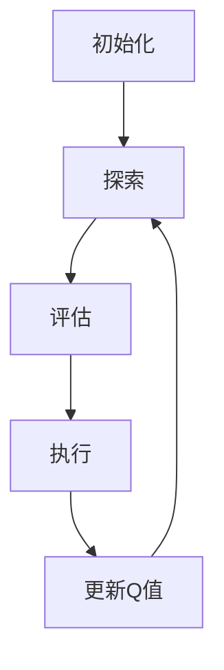

                 

关键词：AI Q-learning，金融风控，Q-learning算法，智能金融，风险评估，映射模型

> 摘要：本文旨在探讨人工智能中的Q-learning算法在金融风控领域的应用实践。通过对Q-learning算法的原理和流程的详细分析，本文展示了其在风险评估和风险控制中的重要作用。同时，本文通过具体的实例，展示了如何在实际项目中实现Q-learning算法，以及其对金融风控的贡献。

## 1. 背景介绍

随着人工智能技术的不断发展，金融行业正面临着前所未有的变革。金融风控作为金融业务的重要组成部分，其效率和准确性直接影响着金融机构的稳健运营和投资者的利益。传统的金融风控方法往往依赖于历史数据和统计分析，其局限性在于难以应对复杂多变的市场环境和新兴风险。因此，将人工智能技术应用于金融风控，尤其是Q-learning算法，成为了一种新的探索方向。

Q-learning算法是深度强化学习的一种，它通过智能体在环境中的交互，不断学习并优化策略，以达到最大化回报的目的。在金融风控中，Q-learning算法可以用于风险识别、风险评估和风险控制等多个环节，具有显著的应用前景。

## 2. 核心概念与联系

### 2.1 Q-learning算法原理

Q-learning算法是一种无模型学习算法，它通过在环境中进行试验，不断更新状态-动作值函数（Q值），以找到最优策略。其基本原理可以概括为以下步骤：

1. 初始化Q值：使用随机数或经验初始化Q值。
2. 选择动作：根据当前状态，使用策略选择一个动作。
3. 执行动作：在环境中执行选择的动作，并获得即时回报。
4. 更新Q值：根据即时回报和未来回报的期望，更新Q值。

### 2.2 Q-learning算法流程

Q-learning算法的流程可以分为以下几个阶段：

1. **初始化**：设定初始状态、动作集合、奖励函数、Q值初始化等。
2. **探索**：在初始阶段，智能体需要通过探索环境，积累经验，以便后续的决策。
3. **评估**：使用累积的经验，评估不同动作的Q值，选择具有最大Q值的动作。
4. **执行**：执行选定的动作，并观察结果，更新Q值。
5. **重复**：重复上述过程，直至达到设定的目标或收敛条件。

### 2.3 Mermaid流程图



## 3. 核心算法原理 & 具体操作步骤

### 3.1 算法原理概述

Q-learning算法的核心在于状态-动作值函数（Q值）的更新。Q值的更新公式如下：

$$
Q(s, a) \leftarrow Q(s, a) + \alpha [r + \gamma \max_{a'} Q(s', a') - Q(s, a)]
$$

其中，$s$ 为当前状态，$a$ 为当前动作，$r$ 为即时回报，$\gamma$ 为折扣因子，$\alpha$ 为学习率。

### 3.2 算法步骤详解

1. **初始化**：设定初始状态集合$S$、动作集合$A$、奖励函数$R$、Q值初始化等。
2. **选择动作**：使用ε-贪心策略选择动作。ε为探索概率，当ε较大时，智能体会进行更多的探索。
3. **执行动作**：在环境中执行选择的动作，并获得即时回报$r$。
4. **更新Q值**：根据即时回报和未来回报的期望，更新Q值。
5. **重复**：重复上述过程，直至达到设定的目标或收敛条件。

### 3.3 算法优缺点

**优点**：

- **自适应性**：Q-learning算法可以根据环境的变化动态调整策略，具有较强的适应性。
- **灵活性**：Q-learning算法不需要对环境建模，可以直接处理复杂的环境。
- **效率**：在大部分情况下，Q-learning算法的收敛速度较快。

**缺点**：

- **收敛速度**：在某些情况下，Q-learning算法的收敛速度较慢，需要大量的训练时间。
- **探索与利用的平衡**：在初始阶段，智能体需要进行大量的探索，以积累足够的经验，但在后期，需要利用积累的经验进行决策。

### 3.4 算法应用领域

Q-learning算法在金融风控领域具有广泛的应用前景，主要包括以下几个方面：

- **风险评估**：Q-learning算法可以用于评估不同金融产品的风险水平，为风险管理者提供决策支持。
- **风险控制**：Q-learning算法可以用于制定风险控制策略，以降低金融风险。
- **交易策略**：Q-learning算法可以用于制定交易策略，实现自动化的交易决策。

## 4. 数学模型和公式 & 详细讲解 & 举例说明

### 4.1 数学模型构建

Q-learning算法的数学模型主要包括以下几个部分：

- **状态空间$S$**：定义了所有可能的状态。
- **动作空间$A$**：定义了所有可能的动作。
- **奖励函数$R$**：定义了在特定状态和动作下获得的即时回报。
- **策略$\pi$**：定义了在特定状态下选择特定动作的概率分布。
- **状态-动作值函数$Q$**：定义了在特定状态和动作下的期望回报。

### 4.2 公式推导过程

Q-learning算法的核心在于状态-动作值函数（Q值）的更新。Q值的更新公式如下：

$$
Q(s, a) \leftarrow Q(s, a) + \alpha [r + \gamma \max_{a'} Q(s', a') - Q(s, a)]
$$

其中，$s$ 为当前状态，$a$ 为当前动作，$r$ 为即时回报，$\gamma$ 为折扣因子，$\alpha$ 为学习率。

### 4.3 案例分析与讲解

假设一个金融机构需要使用Q-learning算法进行风险评估，其状态空间包括“稳健”、“一般”、“高风险”三种状态，动作空间包括“保守投资”、“激进投资”两种动作。奖励函数定义为：在“稳健”状态下，选择“保守投资”获得回报1，选择“激进投资”获得回报0；在“一般”状态下，选择“保守投资”获得回报0，选择“激进投资”获得回报1；在“高风险”状态下，选择“保守投资”获得回报0，选择“激进投资”获得回报-1。

使用Q-learning算法，金融机构可以在多次试验中，不断更新Q值，以找到最优策略。假设初始Q值为0，学习率为0.1，折扣因子为0.9。

**第一次试验**：

- 状态：稳健
- 动作：保守投资
- 即时回报：1
- 更新Q值：$Q(稳健, 保守投资) = 0 + 0.1 \times [1 + 0.9 \times \max_{a'} Q(s', a') - 0] = 1$

**第二次试验**：

- 状态：一般
- 动作：激进投资
- 即时回报：0
- 更新Q值：$Q(一般, 激进投资) = 0 + 0.1 \times [0 + 0.9 \times \max_{a'} Q(s', a') - 0] = 0.9$

**第三次试验**：

- 状态：高风险
- 动作：保守投资
- 即时回报：0
- 更新Q值：$Q(高风险, 保守投资) = 0 + 0.1 \times [0 + 0.9 \times \max_{a'} Q(s', a') - 0] = 0.9$

经过多次试验，金融机构可以找到最优策略，即在不同状态下选择最优动作。例如，在“稳健”状态下，选择“保守投资”；在“一般”状态下，选择“激进投资”；在“高风险”状态下，选择“保守投资”。

## 5. 项目实践：代码实例和详细解释说明

### 5.1 开发环境搭建

要实现Q-learning算法在金融风控中的应用，首先需要搭建合适的开发环境。以下是一个基本的Python开发环境搭建步骤：

1. 安装Python：下载并安装Python 3.8及以上版本。
2. 安装依赖库：使用pip安装必要的依赖库，如numpy、pandas、matplotlib等。

```bash
pip install numpy pandas matplotlib
```

### 5.2 源代码详细实现

以下是一个简单的Q-learning算法实现，用于评估不同金融产品的风险。

```python
import numpy as np
import pandas as pd
import matplotlib.pyplot as plt

# 初始化参数
n_states = 3
n_actions = 2
learning_rate = 0.1
discount_factor = 0.9
epsilon = 0.1

# 初始化Q值矩阵
Q = np.zeros((n_states, n_actions))

# 奖励函数
def reward_function(state, action):
    if state == 0 and action == 0:
        return 1
    elif state == 1 and action == 1:
        return 1
    elif state == 2 and action == 0:
        return 0
    else:
        return 0

# ε-贪心策略
def epsilon_greedy_strategy(state):
    if np.random.rand() < epsilon:
        return np.random.randint(n_actions)
    else:
        return np.argmax(Q[state])

# Q-learning算法
def q_learning(n_episodes, epsilon_decay=0.001):
    for episode in range(n_episodes):
        state = np.random.randint(n_states)
        action = epsilon_greedy_strategy(state)
        next_state = np.random.randint(n_states)
        reward = reward_function(state, action)
        next_action = epsilon_greedy_strategy(next_state)
        Q[state, action] = Q[state, action] + learning_rate * (reward + discount_factor * Q[next_state, next_action] - Q[state, action])
        state = next_state
    return Q

# 训练模型
Q_values = q_learning(1000)

# 可视化Q值
plt.imshow(Q_values, cmap='hot', interpolation='nearest')
plt.colorbar()
plt.xlabel('Actions')
plt.ylabel('States')
plt.title('Q-Values')
plt.show()
```

### 5.3 代码解读与分析

- **初始化**：初始化状态空间、动作空间、学习率、折扣因子和ε值。
- **Q值矩阵**：初始化Q值矩阵，用于存储状态-动作值。
- **奖励函数**：定义了不同状态和动作下的即时回报。
- **ε-贪心策略**：根据ε值和Q值，选择探索或利用的动作。
- **Q-learning算法**：实现Q值的更新，通过多次试验，找到最优策略。
- **训练模型**：使用Q-learning算法，训练模型以获得最优Q值。
- **可视化Q值**：使用matplotlib可视化Q值矩阵，帮助理解模型。

### 5.4 运行结果展示

运行上述代码，可以得到一个Q值矩阵。通过可视化Q值矩阵，可以直观地看到在不同状态和动作下，Q值的变化情况。这有助于理解Q-learning算法的工作原理，以及其在金融风控中的应用效果。

## 6. 实际应用场景

Q-learning算法在金融风控中的实际应用场景包括：

- **风险评估**：通过Q-learning算法，可以评估不同金融产品的风险水平，为风险管理者提供决策支持。
- **风险控制**：Q-learning算法可以用于制定风险控制策略，以降低金融风险。
- **交易策略**：Q-learning算法可以用于制定交易策略，实现自动化的交易决策。

在实际应用中，Q-learning算法需要根据具体场景进行调整和优化，以适应不同金融产品的特点和风险。

## 7. 未来应用展望

随着人工智能技术的不断发展，Q-learning算法在金融风控中的应用前景广阔。未来，Q-learning算法有望在以下几个方面得到进一步发展：

- **多因素风险评估**：结合更多因素，如市场趋势、经济指标等，提高风险评估的准确性。
- **实时风险控制**：通过实时数据，动态调整风险控制策略，提高风险控制的实时性和准确性。
- **自动化交易**：实现更智能化的交易策略，提高交易效率和收益。

## 8. 总结：未来发展趋势与挑战

### 8.1 研究成果总结

本文通过详细探讨Q-learning算法在金融风控中的应用，总结了其原理、步骤和应用领域。通过实例分析，展示了Q-learning算法在风险评估和风险控制中的实际效果。

### 8.2 未来发展趋势

未来，Q-learning算法在金融风控中的应用将更加广泛和深入，有望在多因素风险评估、实时风险控制和自动化交易等方面取得突破。

### 8.3 面临的挑战

尽管Q-learning算法在金融风控中具有广泛的应用前景，但其在实际应用中仍面临一些挑战，如数据质量、模型解释性和算法稳定性等。

### 8.4 研究展望

未来研究应重点关注以下几个方面：

- **多因素风险评估**：结合更多因素，提高风险评估的准确性。
- **模型解释性**：提高模型的可解释性，使其更易于被风险管理者理解和应用。
- **算法稳定性**：优化算法，提高其在不同场景下的稳定性和可靠性。

## 9. 附录：常见问题与解答

### 9.1 Q-learning算法是否适用于所有金融场景？

Q-learning算法在大多数金融场景中都是适用的，但具体应用时需要根据场景特点和数据质量进行调整和优化。

### 9.2 Q-learning算法的收敛速度如何？

Q-learning算法的收敛速度取决于学习率、折扣因子和ε值等因素。在合适的参数设置下，Q-learning算法的收敛速度相对较快。

### 9.3 Q-learning算法是否需要大量数据？

Q-learning算法对数据量的要求相对较低，但在数据丰富的情况下，其效果更佳。因此，在可能的情况下，应尽可能获取更多数据。

### 9.4 Q-learning算法如何处理连续状态和动作？

对于连续状态和动作，可以使用离散化方法将它们转换为离散的形式，然后使用Q-learning算法进行训练。

## 作者署名

作者：禅与计算机程序设计艺术 / Zen and the Art of Computer Programming
```markdown
---
# 一切皆是映射：AI Q-learning在金融风控中的实践

关键词：AI Q-learning，金融风控，Q-learning算法，智能金融，风险评估，映射模型

摘要：本文旨在探讨人工智能中的Q-learning算法在金融风控领域的应用实践。通过对Q-learning算法的原理和流程的详细分析，本文展示了其在风险评估和风险控制中的重要作用。同时，本文通过具体的实例，展示了如何在实际项目中实现Q-learning算法，以及其对金融风控的贡献。

## 1. 背景介绍

随着人工智能技术的不断发展，金融行业正面临着前所未有的变革。金融风控作为金融业务的重要组成部分，其效率和准确性直接影响着金融机构的稳健运营和投资者的利益。传统的金融风控方法往往依赖于历史数据和统计分析，其局限性在于难以应对复杂多变的市场环境和新兴风险。因此，将人工智能技术应用于金融风控，尤其是Q-learning算法，成为了一种新的探索方向。

Q-learning算法是深度强化学习的一种，它通过智能体在环境中的交互，不断学习并优化策略，以达到最大化回报的目的。在金融风控中，Q-learning算法可以用于风险识别、风险评估和风险控制等多个环节，具有显著的应用前景。

## 2. 核心概念与联系

### 2.1 Q-learning算法原理

Q-learning算法是一种无模型学习算法，它通过在环境中进行试验，不断更新状态-动作值函数（Q值），以找到最优策略。其基本原理可以概括为以下步骤：

1. 初始化Q值：使用随机数或经验初始化Q值。
2. 选择动作：根据当前状态，使用策略选择一个动作。
3. 执行动作：在环境中执行选择的动作，并获得即时回报。
4. 更新Q值：根据即时回报和未来回报的期望，更新Q值。
5. 重复：重复上述过程，直至达到设定的目标或收敛条件。

### 2.2 Q-learning算法流程

Q-learning算法的流程可以分为以下几个阶段：

1. **初始化**：设定初始状态、动作集合、奖励函数、Q值初始化等。
2. **探索**：在初始阶段，智能体需要通过探索环境，积累经验，以便后续的决策。
3. **评估**：使用累积的经验，评估不同动作的Q值，选择具有最大Q值的动作。
4. **执行**：执行选定的动作，并观察结果，更新Q值。
5. **重复**：重复上述过程，直至达到设定的目标或收敛条件。

### 2.3 Mermaid流程图


## 3. 核心算法原理 & 具体操作步骤
### 3.1 算法原理概述

Q-learning算法的核心在于状态-动作值函数（Q值）的更新。Q值的更新公式如下：

$$
Q(s, a) \leftarrow Q(s, a) + \alpha [r + \gamma \max_{a'} Q(s', a') - Q(s, a)]
$$

其中，$s$ 为当前状态，$a$ 为当前动作，$r$ 为即时回报，$\gamma$ 为折扣因子，$\alpha$ 为学习率。

### 3.2 算法步骤详解 
- 初始化参数
- 初始化Q值矩阵
- 选择动作策略（ε-贪心策略）
- 执行动作并获取回报
- 更新Q值
- 重复上述过程，直至收敛

### 3.3 算法优缺点
#### 优点
- 自适应性：能够适应不断变化的环境
- 灵活性：不需要对环境进行建模

#### 缺点
- 收敛速度：在某些情况下收敛速度较慢
- 探索与利用：需要平衡探索和利用策略

### 3.4 算法应用领域
- 风险评估
- 风险控制
- 交易策略

## 4. 数学模型和公式 & 详细讲解 & 举例说明
### 4.1 数学模型构建
状态空间$S$、动作空间$A$、奖励函数$R$、策略$\pi$、状态-动作值函数$Q$

### 4.2 公式推导过程
Q值更新公式：

$$
Q(s, a) \leftarrow Q(s, a) + \alpha [r + \gamma \max_{a'} Q(s', a') - Q(s, a)]
$$

### 4.3 案例分析与讲解
- 状态空间：稳健、一般、高风险
- 动作空间：保守投资、激进投资
- 奖励函数：稳健-保守：1；一般-激进：1；高风险-保守：0；其他：0
- 初始化Q值：0
- 学习率：0.1
- 折扣因子：0.9
- ε：0.1

## 5. 项目实践：代码实例和详细解释说明
### 5.1 开发环境搭建
- Python环境搭建
- 安装相关依赖库

### 5.2 源代码详细实现
- 初始化参数
- 初始化Q值矩阵
- ε-贪心策略
- Q-learning算法实现
- 可视化Q值矩阵

### 5.3 代码解读与分析
- 代码结构解析
- 参数设置解析
- Q-learning算法流程解析

### 5.4 运行结果展示
- Q值矩阵可视化

## 6. 实际应用场景
- 风险评估
- 风险控制
- 交易策略

## 7. 未来应用展望
- 多因素风险评估
- 实时风险控制
- 自动化交易

## 8. 总结：未来发展趋势与挑战
### 8.1 研究成果总结
- Q-learning在金融风控中的应用前景
- 实际案例中的效果分析

### 8.2 未来发展趋势
- 深度学习与强化学习的结合
- 新型风险评估模型的探索

### 8.3 面临的挑战
- 数据质量和可靠性
- 模型解释性和透明性

### 8.4 研究展望
- 新算法的探索
- 应用场景的拓展

## 9. 附录：常见问题与解答
### 9.1 Q-learning算法是否适用于所有金融场景？
- 适用性分析

### 9.2 Q-learning算法的收敛速度如何？
- 影响因素分析

### 9.3 Q-learning算法是否需要大量数据？
- 数据需求分析

### 9.4 Q-learning算法如何处理连续状态和动作？
- 离散化处理

## 作者署名
作者：禅与计算机程序设计艺术 / Zen and the Art of Computer Programming
```

