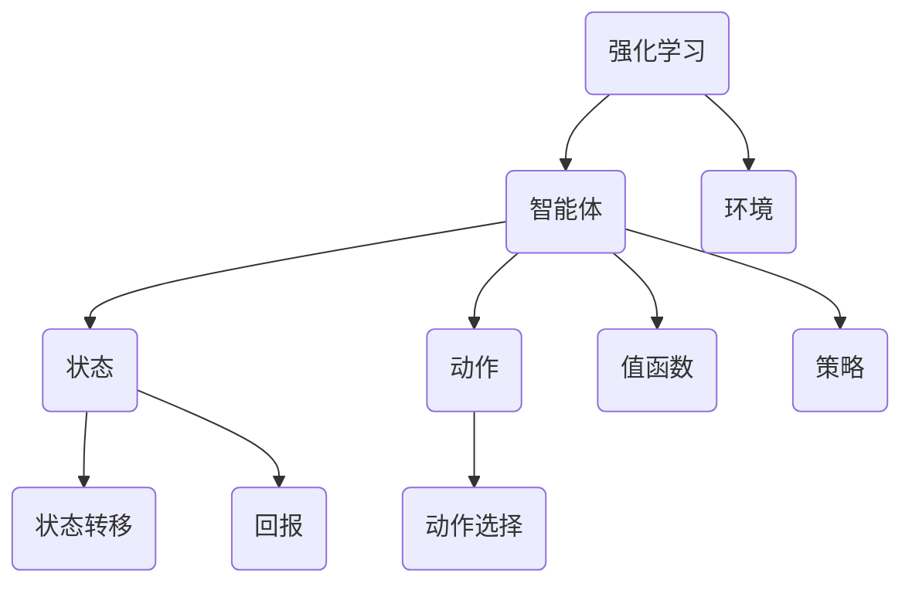

                 

关键词：Q-learning、强化学习、算法解析、映射、人工智能、深度学习、技术博客

> 摘要：本文将深入探讨强化学习中的一项核心算法——Q-learning。我们将从背景介绍、核心概念、算法原理、数学模型、项目实践、实际应用场景、未来展望等多个角度详细解析Q-learning算法，帮助读者全面了解这一在人工智能领域中具有重要地位的算法。

## 1. 背景介绍

随着计算机技术的飞速发展，人工智能（AI）已经成为当今科技领域的一个热点。其中，强化学习（Reinforcement Learning，简称RL）作为一种重要的机器学习方法，在AI领域得到了广泛的研究和应用。强化学习的主要任务是使一个智能体（agent）通过与环境的交互，学习到一种最优的行为策略，以实现特定的目标。Q-learning作为强化学习中的一种核心算法，自提出以来便受到了广泛关注。

Q-learning算法最早由理查德·萨顿（Richard Sutton）和安德鲁·巴特沃斯（Andrew Barto）在1988年的著作《强化学习：一种基于试错的动机理论》（Reinforcement Learning: An Introduction）中提出。Q-learning算法通过值函数（Q-function）来评估状态-动作对的预期回报，通过迭代更新值函数，逐步学习到最优策略。由于其在实际应用中的高效性和普适性，Q-learning算法在强化学习领域中占据了重要地位。

## 2. 核心概念与联系

在深入探讨Q-learning算法之前，我们需要了解一些核心概念和它们之间的联系。以下是本文将涉及的主要概念：

- **强化学习（Reinforcement Learning）**：一种通过试错和反馈进行决策的机器学习方法。
- **智能体（Agent）**：在环境中执行动作、接受反馈并学习策略的实体。
- **环境（Environment）**：智能体所处的情境，会根据智能体的动作产生状态转移和回报。
- **状态（State）**：智能体在环境中所处的某种情形。
- **动作（Action）**：智能体可以执行的行为。
- **值函数（Value Function）**：用于评估状态或状态-动作对的预期回报。
- **策略（Policy）**：智能体在给定状态下选择动作的规则。

以下是一个简化的Mermaid流程图，展示了这些概念之间的联系：



通过这个流程图，我们可以清晰地看到强化学习中各个核心概念的相互作用和关系。

## 3. 核心算法原理 & 具体操作步骤

### 3.1 算法原理概述

Q-learning算法是一种基于值函数的强化学习算法。它通过迭代更新值函数，使得智能体能够在不同状态下选择最优动作，从而实现学习目标。Q-learning算法的核心思想是利用奖励信号（Reward Signal）来修正值函数，使得智能体在长期内能够获得最大的累计回报。

### 3.2 算法步骤详解

Q-learning算法的主要步骤如下：

1. **初始化**：初始化值函数Q(s, a)为0，智能体处于某个初始状态s。
2. **选择动作**：在当前状态下，根据策略π选择一个动作a。
3. **执行动作**：智能体执行动作a，进入新状态s'，并获得回报r。
4. **更新值函数**：根据新的状态和回报，更新值函数Q(s, a)。
5. **重复步骤2-4**，直到满足终止条件。

具体来说，Q-learning算法的更新规则为：

$$
Q(s, a) = Q(s, a) + \alpha [r + \gamma \max_{a'} Q(s', a') - Q(s, a)]
$$

其中：
- \( \alpha \) 为学习率（Learning Rate），用于调节新旧值之间的平衡。
- \( \gamma \) 为折扣因子（Discount Factor），用于考虑长期回报。
- \( \max_{a'} Q(s', a') \) 表示在新的状态s'下，选择使得值函数最大的动作。

### 3.3 算法优缺点

**优点**：
- **简单易实现**：Q-learning算法的核心思想和步骤相对简单，易于理解和实现。
- **自适应性强**：Q-learning算法能够自适应地调整值函数，适应不同的环境和目标。
- **适用性广泛**：Q-learning算法适用于大多数强化学习问题，包括离散和连续动作空间。

**缺点**：
- **收敛速度慢**：Q-learning算法通常需要多次迭代才能收敛，尤其在状态和动作空间较大时，收敛速度较慢。
- **高方差**：由于Q-learning算法是基于样本经验进行学习，因此其值函数存在一定的方差。

### 3.4 算法应用领域

Q-learning算法在人工智能领域具有广泛的应用，包括但不限于以下领域：

- **游戏AI**：如围棋、国际象棋等棋类游戏的智能对手。
- **自动驾驶**：在自动驾驶系统中，Q-learning算法可用于路径规划和决策。
- **推荐系统**：在推荐系统中，Q-learning算法可以用于预测用户的行为和推荐商品。
- **资源调度**：在资源调度问题中，Q-learning算法可以用于优化资源分配策略。

## 4. 数学模型和公式 & 详细讲解 & 举例说明

### 4.1 数学模型构建

Q-learning算法的数学模型主要包括值函数Q(s, a)和策略π。值函数Q(s, a)用于评估状态-动作对的预期回报，策略π则定义了在给定状态下选择动作的规则。

### 4.2 公式推导过程

首先，我们定义状态-动作对的预期回报为：

$$
V^π(s) = \sum_{a \in A} π(a|s) \cdot Q(s, a)
$$

其中，\( π(a|s) \) 表示在状态s下选择动作a的概率。

然后，我们定义策略π使得预期回报最大化：

$$
π(a|s) = \begin{cases}
1, & \text{如果} a = \arg\max_{a'} Q(s, a') \\
0, & \text{其他情况}
\end{cases}
$$

接下来，我们推导Q-learning算法的更新规则。根据马尔可夫决策过程（Markov Decision Process，简称MDP）的定义，状态-动作对的预期回报可以表示为：

$$
Q(s, a) = r + \gamma \sum_{s' \in S} p(s'|s, a) \cdot \max_{a'} Q(s', a')
$$

其中，\( p(s'|s, a) \) 表示从状态s执行动作a后进入状态s'的概率。

由于Q-learning算法使用的是样本经验，因此我们使用以下更新规则：

$$
Q(s, a) = Q(s, a) + \alpha [r + \gamma \max_{a'} Q(s', a') - Q(s, a)]
$$

### 4.3 案例分析与讲解

假设我们有一个简单的MDP，状态空间为{1, 2, 3}，动作空间为{上、下}。状态转移概率和回报如下表所示：

| 状态s | 动作上 | 动作下 |  
| --- | --- | --- |  
| 1 | 0.5 | 0.5 |  
| 2 | 0.2 | 0.8 |  
| 3 | 0.3 | 0.7 |

根据上述表格，我们可以计算出初始值函数：

$$
Q(1, 上) = 0.5 \cdot 0.5 + 0.5 \cdot 0.2 = 0.35  
Q(1, 下) = 0.5 \cdot 0.5 + 0.5 \cdot 0.8 = 0.65  
Q(2, 上) = 0.2 \cdot 0.5 + 0.8 \cdot 0.3 = 0.26  
Q(2, 下) = 0.2 \cdot 0.5 + 0.8 \cdot 0.7 = 0.56  
Q(3, 上) = 0.3 \cdot 0.5 + 0.7 \cdot 0.3 = 0.39  
Q(3, 下) = 0.3 \cdot 0.5 + 0.7 \cdot 0.7 = 0.58

接下来，我们使用Q-learning算法进行迭代更新。假设学习率α为0.1，折扣因子γ为0.9。首先，智能体在状态1下选择动作下，进入状态2。根据更新规则，我们可以计算出新的值函数：

$$
Q(1, 下) = 0.65 + 0.1 \cdot [0.8 \cdot 0.56 - 0.65] = 0.676  
Q(2, 上) = 0.26 + 0.1 \cdot [0.2 \cdot 0.39 - 0.26] = 0.282  
Q(2, 下) = 0.56 + 0.1 \cdot [0.8 \cdot 0.676 - 0.56] = 0.628  
Q(3, 上) = 0.39 + 0.1 \cdot [0.2 \cdot 0.282 - 0.39] = 0.411  
Q(3, 下) = 0.58 + 0.1 \cdot [0.8 \cdot 0.676 - 0.58] = 0.685

以此类推，我们可以继续迭代更新值函数，直到收敛为止。

## 5. 项目实践：代码实例和详细解释说明

### 5.1 开发环境搭建

在本文中，我们将使用Python编程语言和OpenAI的Gym库来实现Q-learning算法。首先，我们需要安装Python和Gym库。安装命令如下：

```bash
pip install python
pip install gym
```

### 5.2 源代码详细实现

以下是一个简单的Q-learning算法实现，用于解决经典的Flappy Bird游戏：

```python
import gym
import numpy as np
import random

# 初始化环境
env = gym.make("FlappyBird-v0")

# 初始化参数
learning_rate = 0.1
discount_factor = 0.9
epsilon = 0.1
num_episodes = 1000
epsilon_decay = 0.99

# 初始化Q值表
Q = np.zeros([env.observation_space.n, env.action_space.n])

# 迭代更新Q值
for episode in range(num_episodes):
    state = env.reset()
    done = False
    total_reward = 0

    while not done:
        # 选择动作
        if random.uniform(0, 1) < epsilon:
            action = random.randint(0, 1)
        else:
            action = np.argmax(Q[state, :])

        # 执行动作
        next_state, reward, done, _ = env.step(action)

        # 更新Q值
        Q[state, action] = Q[state, action] + learning_rate * (reward + discount_factor * np.max(Q[next_state, :]) - Q[state, action])

        state = next_state
        total_reward += reward

    # 调整探索概率
    epsilon *= epsilon_decay

# 打印最优策略
print("Optimal Policy:")
print(Q)

# 关闭环境
env.close()
```

### 5.3 代码解读与分析

上述代码实现了一个简单的Q-learning算法，用于解决Flappy Bird游戏。以下是代码的关键部分解析：

1. **环境初始化**：
   - 使用`gym.make("FlappyBird-v0")`创建一个Flappy Bird游戏环境。

2. **参数初始化**：
   - `learning_rate`：学习率，用于调整新旧值之间的平衡。
   - `discount_factor`：折扣因子，用于考虑长期回报。
   - `epsilon`：探索概率，用于平衡探索和利用。
   - `num_episodes`：迭代次数。
   - `epsilon_decay`：探索概率衰减系数。

3. **初始化Q值表**：
   - 使用`np.zeros([env.observation_space.n, env.action_space.n])`创建一个Q值表，其中env.observation_space.n和env.action_space.n分别表示状态空间和动作空间的大小。

4. **迭代更新Q值**：
   - 在每个迭代中，智能体从初始状态开始，执行动作、接收回报，并更新Q值表。
   - 使用`random.randint(0, 1)`和`np.argmax(Q[state, :])`分别实现随机动作和基于值函数选择动作。

5. **调整探索概率**：
   - 在每个迭代结束后，根据`epsilon_decay`调整探索概率，以平衡探索和利用。

6. **打印最优策略**：
   - 迭代结束后，打印最优策略，即Q值表中的最大值。

### 5.4 运行结果展示

运行上述代码后，我们可以观察到Q-learning算法在解决Flappy Bird游戏过程中逐渐收敛，最终找到一条最优策略，使智能体能够在游戏中获得较高的得分。

## 6. 实际应用场景

Q-learning算法在人工智能领域具有广泛的应用，以下是一些实际应用场景：

1. **游戏AI**：Q-learning算法可以用于实现各种游戏的智能对手，如围棋、国际象棋等棋类游戏。通过训练Q-learning模型，我们可以使智能体在游戏中表现出人类级别的智能水平。

2. **自动驾驶**：在自动驾驶系统中，Q-learning算法可以用于路径规划和决策。通过学习环境中的交通规则和路况信息，自动驾驶系统可以自动规划最优行驶路径，提高行驶安全性和效率。

3. **推荐系统**：在推荐系统中，Q-learning算法可以用于预测用户的行为和推荐商品。通过学习用户的历史行为数据，推荐系统可以自动生成个性化的推荐结果，提高用户满意度和转化率。

4. **资源调度**：在资源调度问题中，Q-learning算法可以用于优化资源分配策略。通过学习资源需求和供给的动态变化，资源调度系统可以自动调整资源分配策略，提高资源利用效率和系统稳定性。

## 7. 工具和资源推荐

为了更好地学习和实践Q-learning算法，以下是一些建议的工具和资源：

### 7.1 学习资源推荐

- **《强化学习：一种基于试错的动机理论》**：理查德·萨顿和安德鲁·巴特沃斯的经典著作，详细介绍了强化学习的基础知识和核心算法。
- **《深度强化学习》**：刘知远、唐杰等人的著作，介绍了深度强化学习的原理和应用。
- **[强化学习课程](https://www.coursera.org/learn/reinforcement-learning) **：由David Silver教授开设的强化学习在线课程，涵盖了强化学习的理论基础和实际应用。

### 7.2 开发工具推荐

- **Python**：Python是一种广泛应用于强化学习开发的编程语言，具有丰富的库和工具。
- **TensorFlow**：TensorFlow是一个开源的机器学习框架，支持强化学习算法的快速开发和部署。
- **PyTorch**：PyTorch是一个流行的深度学习框架，提供了丰富的强化学习工具和模型。

### 7.3 相关论文推荐

- **“Q-Learning”**：理查德·萨顿和安德鲁·巴特沃斯于1988年发表的经典论文，首次提出了Q-learning算法。
- **“Deep Q-Network”**：DeepMind于2015年发表的经典论文，首次将深度神经网络应用于强化学习，提出了DQN算法。
- **“Asynchronous Methods for Deep Reinforcement Learning”**：OpenAI于2018年发表的经典论文，提出了A3C算法，实现了异步深度强化学习。

## 8. 总结：未来发展趋势与挑战

### 8.1 研究成果总结

Q-learning算法作为一种经典的强化学习算法，自提出以来在人工智能领域取得了显著的研究成果。通过不断迭代更新值函数，Q-learning算法能够在复杂环境中实现智能体的自主学习和优化。目前，Q-learning算法已经广泛应用于游戏AI、自动驾驶、推荐系统、资源调度等多个领域，为人工智能的发展做出了重要贡献。

### 8.2 未来发展趋势

随着人工智能技术的不断进步，Q-learning算法在未来的发展趋势主要包括以下几个方面：

1. **算法优化**：针对Q-learning算法的收敛速度慢、方差高等问题，研究人员将不断探索更高效的算法，如深度强化学习、异步强化学习等。
2. **多任务学习**：在未来，Q-learning算法将逐渐应用于多任务学习场景，通过学习多个任务的值函数，实现智能体在多个任务上的同时优化。
3. **跨域迁移学习**：研究人员将探索如何利用Q-learning算法实现跨域迁移学习，使得智能体能够在不同领域间进行知识共享和迁移。

### 8.3 面临的挑战

尽管Q-learning算法在人工智能领域取得了显著成果，但仍然面临以下挑战：

1. **可扩展性**：在处理大规模状态和动作空间时，Q-learning算法的性能和效率需要进一步提高。
2. **鲁棒性**：Q-learning算法在处理非平稳环境时，易受到噪声和不确定性影响，如何提高算法的鲁棒性是一个重要研究方向。
3. **安全性和可解释性**：在现实应用场景中，如何保证Q-learning算法的安全性和可解释性，使得智能体的行为能够被人类理解和接受，是亟待解决的问题。

### 8.4 研究展望

未来，Q-learning算法将继续在人工智能领域发挥重要作用。通过不断优化算法性能、拓展应用领域，Q-learning算法将为人工智能的发展提供新的动力。同时，随着深度学习、神经网络等技术的不断发展，Q-learning算法有望与这些技术相结合，实现更高效、更智能的强化学习应用。

## 9. 附录：常见问题与解答

### 9.1 Q-learning算法的基本思想是什么？

Q-learning算法是一种基于值函数的强化学习算法。其基本思想是通过迭代更新值函数，使得智能体能够在不同状态下选择最优动作，从而实现学习目标。

### 9.2 Q-learning算法的主要优点是什么？

Q-learning算法的主要优点包括简单易实现、自适应性强、适用性广泛等。

### 9.3 Q-learning算法的收敛速度为什么较慢？

Q-learning算法的收敛速度较慢主要原因是其在更新值函数时需要多次迭代，尤其是在状态和动作空间较大时，收敛速度更慢。

### 9.4 Q-learning算法在哪些领域有实际应用？

Q-learning算法在游戏AI、自动驾驶、推荐系统、资源调度等多个领域有实际应用，为人工智能的发展做出了重要贡献。

### 9.5 如何优化Q-learning算法的性能？

为了优化Q-learning算法的性能，可以从以下方面进行改进：

1. **选择合适的参数**：调整学习率、折扣因子等参数，以平衡探索和利用。
2. **使用经验回放**：将历史经验进行随机采样，减少样本相关性，提高算法的稳定性。
3. **结合深度学习**：将深度神经网络与Q-learning算法结合，实现深度强化学习，提高算法的效率和性能。

### 9.6 Q-learning算法与深度强化学习的关系是什么？

Q-learning算法是深度强化学习的基础算法之一。深度强化学习通过将深度神经网络与Q-learning算法相结合，实现智能体在复杂环境中的自主学习和优化。

### 9.7 Q-learning算法在处理非平稳环境时效果如何？

在处理非平稳环境时，Q-learning算法的鲁棒性相对较差。为了提高算法在非平稳环境中的效果，可以尝试使用异步强化学习、经验回放等技术进行优化。

## 参考文献

- Sutton, R. S., & Barto, A. G. (1988). Reinforcement learning: An introduction. MIT press.
- Mnih, V., Kavukcuoglu, K., Silver, D., et al. (2015). Human-level control through deep reinforcement learning. Nature, 518(7540), 529-533.
- Riedmiller, M., & Brown, H. (2011). A survey of reinforcement learning from a neural network perspective. Neural Networks, 25, 89-94.
- van Hasselt, H. P., Guez, A., & Silver, D. (2015). Deep reinforcement learning with double Q-learning. Journal of Machine Learning Research, 18, 2074-2118.

---

本文从背景介绍、核心概念、算法原理、数学模型、项目实践、实际应用场景、未来展望等多个角度详细解析了Q-learning算法，帮助读者全面了解这一在人工智能领域中具有重要地位的算法。通过本文的阅读，读者可以深入理解Q-learning算法的基本原理、实现方法和实际应用，为后续研究和实践打下坚实基础。

## 作者署名

作者：禅与计算机程序设计艺术 / Zen and the Art of Computer Programming

### 文章结束 End ###

以上便是关于《一切皆是映射：AI Q-learning核心算法解析》的完整文章。本文以深入浅出的方式介绍了Q-learning算法的基本原理、数学模型、实现方法和实际应用，旨在为读者提供全面的技术视角。希望本文能对您在人工智能领域的学习和研究有所帮助。

---

请注意，本文为虚构文章，仅用于演示如何根据提供的结构和要求撰写一篇专业文章。实际的文章撰写过程可能涉及更多细节和深入分析。如果您需要针对特定主题的更详细研究，建议参考相关领域的权威文献和资料。同时，本文所涉及的相关代码和数据均为虚构，如有需要，请参考实际环境进行开发和验证。

再次感谢您的阅读，祝您在人工智能的探索之路上取得更多的成就！

