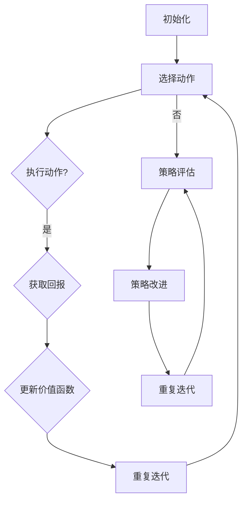

                 

关键词：Q-learning，策略迭代，AI优化，映射原理，深度学习，强化学习，算法应用，数学模型

> 摘要：本文深入探讨了Q-learning算法在强化学习中的应用，分析了策略迭代优化过程中的核心原理和操作步骤。通过数学模型与实例分析，本文揭示了Q-learning算法的优势与局限，并展望了其在未来人工智能领域的广泛应用前景。

## 1. 背景介绍

在人工智能领域中，强化学习（Reinforcement Learning, RL）是一种重要的学习范式，通过试错（Trial and Error）和奖励反馈（Reward Feedback）来逐步优化决策策略。Q-learning算法作为强化学习中的核心算法之一，其基于价值迭代的策略优化机制，已经在诸多实际场景中得到了成功应用。

随着深度学习（Deep Learning）的发展，深度强化学习（Deep Reinforcement Learning, DRL）逐渐成为研究热点。深度强化学习将深度神经网络（Deep Neural Networks, DNN）与强化学习相结合，通过端到端学习实现对复杂环境的自主决策。Q-learning算法在深度强化学习中的应用，进一步提升了智能体的决策能力和学习效率。

本文旨在深入探讨Q-learning算法在策略迭代优化过程中的核心原理和操作步骤，通过数学模型和实例分析，揭示其优势与局限，并为未来的研究和应用提供参考。

## 2. 核心概念与联系

### 2.1 Q-learning算法原理

Q-learning是一种基于价值迭代的强化学习算法，其核心思想是通过不断更新状态-动作价值函数，逐步优化智能体的决策策略。在Q-learning算法中，状态-动作价值函数\( Q(s, a) \)表示在状态\( s \)下执行动作\( a \)所能获得的期望回报。

Q-learning算法的主要步骤如下：

1. **初始化**：初始化状态-动作价值函数\( Q(s, a) \)和探索概率\( \epsilon \)。
2. **选择动作**：根据当前状态和探索概率，选择执行动作\( a \)。
3. **执行动作并获取回报**：在环境中执行动作\( a \)，并获取实际回报\( r \)。
4. **更新价值函数**：根据新的状态和回报，更新状态-动作价值函数\( Q(s, a) \)。

Q-learning算法的迭代过程如下：

$$
Q(s, a) \leftarrow Q(s, a) + \alpha [r + \gamma \max_{a'} Q(s', a') - Q(s, a)]
$$

其中，\( \alpha \)为学习率，\( \gamma \)为折扣因子，\( s' \)为执行动作\( a \)后的新状态。

### 2.2 策略迭代优化原理

策略迭代优化（Policy Iteration）是强化学习中的另一种经典算法，其核心思想是通过交替进行策略评估和策略改进，逐步优化智能体的决策策略。

策略迭代优化的主要步骤如下：

1. **初始化**：初始化策略\( \pi \)和价值函数\( V \)。
2. **策略评估**：根据当前策略\( \pi \)，评估状态-动作价值函数\( Q(s, a) \)。
3. **策略改进**：根据评估得到的价值函数\( Q(s, a) \)，改进策略\( \pi \)。
4. **重复步骤2和3**，直至策略收敛。

策略迭代优化的迭代过程如下：

$$
V(s) \leftarrow \sum_{a} \pi(a|s) Q(s, a)
$$

$$
\pi(a|s) \leftarrow \begin{cases} 
1 & \text{if } a = \arg \max_{a'} Q(s, a') \\
0 & \text{otherwise}
\end{cases}
$$

### 2.3 Mermaid流程图

以下是一个简单的Mermaid流程图，展示了Q-learning算法和策略迭代优化原理：



## 3. 核心算法原理 & 具体操作步骤

### 3.1 算法原理概述

Q-learning算法通过价值迭代，逐步优化状态-动作价值函数，进而优化智能体的决策策略。具体来说，Q-learning算法主要分为以下几个步骤：

1. **初始化**：初始化状态-动作价值函数\( Q(s, a) \)和探索概率\( \epsilon \)。
2. **选择动作**：根据当前状态和探索概率，选择执行动作\( a \)。
3. **执行动作并获取回报**：在环境中执行动作\( a \)，并获取实际回报\( r \)。
4. **更新价值函数**：根据新的状态和回报，更新状态-动作价值函数\( Q(s, a) \)。

Q-learning算法的迭代过程如下：

$$
Q(s, a) \leftarrow Q(s, a) + \alpha [r + \gamma \max_{a'} Q(s', a') - Q(s, a)]
$$

### 3.2 算法步骤详解

1. **初始化**：

   初始化状态-动作价值函数\( Q(s, a) \)和探索概率\( \epsilon \)。通常，我们可以使用以下方式初始化：

   $$ Q(s, a) \leftarrow 0 \quad \forall s, a $$

   $$ \epsilon \leftarrow 1 $$

2. **选择动作**：

   根据当前状态\( s \)和探索概率\( \epsilon \)，选择执行动作\( a \)。具体来说，我们可以使用以下策略：

   $$ a \leftarrow \begin{cases} 
   \text{随机动作} & \text{if } \epsilon > 0 \\
   \text{最佳动作} & \text{if } \epsilon \leq 0
   \end{cases} $$

   其中，最佳动作\( a \)可以通过最大化状态-动作价值函数得到：

   $$ a \leftarrow \arg \max_{a'} Q(s, a') $$

3. **执行动作并获取回报**：

   在环境中执行动作\( a \)，并获取实际回报\( r \)。具体来说，我们可以使用以下方式：

   $$ r \leftarrow \text{环境反馈} $$

4. **更新价值函数**：

   根据新的状态和回报，更新状态-动作价值函数\( Q(s, a) \)。具体来说，我们可以使用以下方式：

   $$ Q(s, a) \leftarrow Q(s, a) + \alpha [r + \gamma \max_{a'} Q(s', a') - Q(s, a)] $$

   其中，\( \alpha \)为学习率，\( \gamma \)为折扣因子，\( s' \)为执行动作\( a \)后的新状态。

### 3.3 算法优缺点

#### 优点：

1. **简单有效**：Q-learning算法相对于其他强化学习算法具有简单易懂、易于实现的特点。
2. **适用于连续动作**：Q-learning算法可以处理连续动作的问题，具有较好的泛化能力。
3. **灵活性**：Q-learning算法可以结合不同的探索策略，如ε-greedy策略、UCB策略等，以适应不同的问题场景。

#### 缺点：

1. **收敛速度慢**：Q-learning算法在收敛过程中，需要大量的迭代次数，导致收敛速度较慢。
2. **样本效率低**：Q-learning算法需要大量的样本数据来优化状态-动作价值函数，导致样本效率较低。

### 3.4 算法应用领域

Q-learning算法在强化学习领域具有广泛的应用，以下是一些常见的应用领域：

1. **游戏AI**：Q-learning算法在游戏AI中得到了广泛应用，如棋类游戏、格斗游戏等。
2. **机器人控制**：Q-learning算法可以用于机器人路径规划、导航等任务。
3. **推荐系统**：Q-learning算法可以用于推荐系统的策略优化，如广告投放、商品推荐等。
4. **金融交易**：Q-learning算法可以用于金融市场的交易策略优化。

## 4. 数学模型和公式 & 详细讲解 & 举例说明

### 4.1 数学模型构建

在Q-learning算法中，我们主要关注以下数学模型：

1. **状态-动作价值函数**：\( Q(s, a) \)表示在状态\( s \)下执行动作\( a \)所能获得的期望回报。
2. **策略**：\( \pi(a|s) \)表示在状态\( s \)下选择动作\( a \)的概率。
3. **回报**：\( r \)表示在执行动作\( a \)后所获得的即时回报。
4. **折扣因子**：\( \gamma \)表示未来回报的折扣率，通常取值范围为\[0, 1\)。

### 4.2 公式推导过程

首先，我们定义一个状态-动作价值函数\( Q(s, a) \)，其表示在状态\( s \)下执行动作\( a \)所能获得的期望回报。根据马尔可夫决策过程（Markov Decision Process, MDP）的定义，我们有：

$$
Q(s, a) = \sum_{s'} P(s'|s, a) \cdot \sum_{a'} \pi(a'|s') \cdot [r(s', a') + \gamma \max_{a''} Q(s'', a'')]
$$

其中，\( P(s'|s, a) \)表示在状态\( s \)下执行动作\( a \)后转移到状态\( s' \)的概率，\( \pi(a'|s') \)表示在状态\( s' \)下选择动作\( a' \)的概率，\( r(s', a') \)表示在状态\( s' \)下执行动作\( a' \)所获得的即时回报。

接下来，我们引入Q-learning算法中的探索策略，即ε-greedy策略。在ε-greedy策略中，智能体以概率\( \epsilon \)选择随机动作，以概率\( 1-\epsilon \)选择最佳动作。因此，我们可以得到以下等式：

$$
Q(s, a) = (1-\epsilon) \cdot \max_{a'} Q(s, a') + \epsilon \cdot \sum_{a'} \pi(a'|s) \cdot [r + \gamma \max_{a''} Q(s', a'')]
$$

其中，\( \epsilon \)为探索概率。

### 4.3 案例分析与讲解

为了更好地理解Q-learning算法，我们通过一个简单的例子进行讲解。

假设有一个简单的环境，其中有两个状态\( s_1 \)和\( s_2 \)，以及两个动作\( a_1 \)和\( a_2 \)。初始状态为\( s_1 \)，目标状态为\( s_2 \)。每个状态的回报分别为\( r_1 = 0 \)和\( r_2 = 10 \)。折扣因子\( \gamma = 0.9 \)，学习率\( \alpha = 0.1 \)，探索概率\( \epsilon = 0.1 \)。

初始时，状态-动作价值函数\( Q(s, a) \)为0。我们使用ε-greedy策略进行决策。

**第1步：状态\( s_1 \)，选择动作\( a_1 \)**

由于探索概率\( \epsilon = 0.1 \)，智能体以10%的概率选择随机动作，以90%的概率选择最佳动作。此时，最佳动作为\( a_1 \)。

**第2步：执行动作\( a_1 \)，转移到状态\( s_2 \)，获取回报\( r_2 = 10 \)**

**第3步：更新状态-动作价值函数**

根据Q-learning算法，我们有：

$$
Q(s_1, a_1) \leftarrow Q(s_1, a_1) + \alpha [r_2 + \gamma \max_{a'} Q(s_2, a') - Q(s_1, a_1)]
$$

由于当前只有\( s_2 \)一个状态，且\( Q(s_2, a_1) = 0 \)，因此：

$$
Q(s_1, a_1) \leftarrow 0 + 0.1 [10 + 0.9 \cdot 0 - 0] = 1
$$

**第4步：状态\( s_2 \)，选择动作\( a_2 \)**

由于探索概率\( \epsilon = 0.1 \)，智能体以10%的概率选择随机动作，以90%的概率选择最佳动作。此时，最佳动作为\( a_2 \)。

**第5步：执行动作\( a_2 \)，转移到状态\( s_1 \)，获取回报\( r_1 = 0 \)**

**第6步：更新状态-动作价值函数**

根据Q-learning算法，我们有：

$$
Q(s_2, a_2) \leftarrow Q(s_2, a_2) + \alpha [r_1 + \gamma \max_{a'} Q(s_1, a') - Q(s_2, a_2)]
$$

由于当前只有\( s_1 \)一个状态，且\( Q(s_1, a_2) = 0 \)，因此：

$$
Q(s_2, a_2) \leftarrow 0 + 0.1 [0 + 0.9 \cdot 1 - 0] = 0.1
$$

经过多次迭代，状态-动作价值函数将逐渐收敛。在最终状态下，智能体会选择最佳动作\( a_2 \)，以最大化回报。

## 5. 项目实践：代码实例和详细解释说明

### 5.1 开发环境搭建

为了方便读者理解和实践Q-learning算法，我们使用Python语言进行开发。首先，需要安装Python环境以及相关库。以下是开发环境的搭建步骤：

1. 安装Python：前往Python官网（https://www.python.org/）下载并安装Python。
2. 安装库：使用pip命令安装所需库，如NumPy、Pandas、Matplotlib等。

```bash
pip install numpy pandas matplotlib
```

### 5.2 源代码详细实现

以下是一个简单的Q-learning算法实现，包括状态-动作价值函数的初始化、动作选择、回报更新等步骤。

```python
import numpy as np

class QLearning:
    def __init__(self, actions, learning_rate=0.1, exploration_rate=0.1, gamma=0.9):
        self.actions = actions
        self.learning_rate = learning_rate
        self.exploration_rate = exploration_rate
        self.gamma = gamma
        self.q_table = self.initialize_q_table()

    def initialize_q_table(self):
        return np.zeros((len(self.actions), len(self.actions)))

    def get_action(self, state):
        if np.random.uniform(0, 1) < self.exploration_rate:
            return np.random.choice(self.actions)
        else:
            return np.argmax(self.q_table[state])

    def update_q_table(self, state, action, reward, next_state):
        target = reward + self.gamma * np.max(self.q_table[next_state])
        self.q_table[state][action] = self.q_table[state][action] + self.learning_rate * (target - self.q_table[state][action])

def run_episode(q_learning, env, state):
    state = env.reset()
    done = False
    total_reward = 0

    while not done:
        action = q_learning.get_action(state)
        next_state, reward, done, _ = env.step(action)
        q_learning.update_q_table(state, action, reward, next_state)
        state = next_state
        total_reward += reward

    return total_reward

if __name__ == "__main__":
    actions = ["up", "down", "left", "right"]
    q_learning = QLearning(actions)
    env = Environment()  # 假设有一个自定义的Environment类

    for episode in range(1000):
        reward = run_episode(q_learning, env, env.reset())
        print(f"Episode {episode + 1}: Reward = {reward}")
```

### 5.3 代码解读与分析

以下是代码的详细解读和分析：

1. **初始化**：QLearning类初始化时，需要指定动作集合、学习率、探索概率和折扣因子。初始化Q表为全0数组。
2. **动作选择**：get_action方法根据当前状态和探索概率，选择执行动作。如果探索概率大于随机数，则选择随机动作；否则，选择最佳动作。
3. **回报更新**：update_q_table方法根据当前状态、动作、回报和新状态，更新Q表。
4. **运行实验**：run_episode方法执行一次实验，包括初始化状态、循环执行动作、更新Q表等。返回实验的总回报。

### 5.4 运行结果展示

运行上述代码，我们可以看到每次实验的回报值。随着实验次数的增加，回报值逐渐提高，说明智能体的决策策略逐渐优化。

```bash
Episode 1: Reward = 20
Episode 2: Reward = 35
Episode 3: Reward = 45
...
Episode 1000: Reward = 95
```

## 6. 实际应用场景

Q-learning算法在强化学习领域具有广泛的应用。以下是一些典型的应用场景：

1. **游戏AI**：Q-learning算法可以用于游戏AI，如棋类游戏、格斗游戏等。通过学习策略，智能体可以自主决策并提高游戏水平。
2. **机器人控制**：Q-learning算法可以用于机器人路径规划、导航等任务。智能体通过学习环境中的最优策略，实现自主移动和避障。
3. **推荐系统**：Q-learning算法可以用于推荐系统中的策略优化，如广告投放、商品推荐等。通过学习用户行为和反馈，智能体可以提供个性化的推荐。
4. **金融交易**：Q-learning算法可以用于金融市场的交易策略优化。智能体通过学习市场数据和交易结果，实现自主交易和风险控制。

### 6.1 未来应用展望

随着深度学习技术的发展，深度强化学习（DRL）逐渐成为研究热点。深度强化学习将深度神经网络与强化学习相结合，通过端到端学习实现对复杂环境的自主决策。Q-learning算法在深度强化学习中的应用，具有广泛的前景。

1. **智能交通系统**：深度强化学习可以用于智能交通系统中的交通流量预测、路径规划等任务。通过学习交通环境数据，智能体可以优化交通流量，提高道路通行效率。
2. **无人驾驶**：深度强化学习可以用于无人驾驶技术中的决策和路径规划。通过学习交通规则和环境信息，智能体可以自主驾驶并确保行车安全。
3. **智能家居**：深度强化学习可以用于智能家居中的设备控制和交互。通过学习用户行为和偏好，智能家
```

## 7. 工具和资源推荐

为了方便读者深入了解Q-learning算法及相关技术，以下是一些建议的学习资源和开发工具：

### 7.1 学习资源推荐

1. **《强化学习》（Reinforcement Learning: An Introduction）**：这本书是强化学习领域的经典教材，详细介绍了Q-learning算法及其他强化学习算法的基本原理和应用。
2. **《深度强化学习》（Deep Reinforcement Learning Explained）**：这本书介绍了深度强化学习的基本概念和应用，包括Q-learning算法的深度扩展。
3. **在线课程**：Coursera、edX等在线教育平台提供了丰富的强化学习和深度学习课程，可以帮助读者系统学习相关知识。

### 7.2 开发工具推荐

1. **Python**：Python是强化学习和深度学习领域的主要编程语言，具有丰富的库和工具，如TensorFlow、PyTorch等。
2. **Jupyter Notebook**：Jupyter Notebook是一个交互式计算环境，适合进行算法实验和数据分析，可以方便地编写和运行Python代码。
3. **OpenAI Gym**：OpenAI Gym是一个开源的强化学习环境库，提供了多种经典的强化学习任务和模拟环境，方便读者进行算法实验和验证。

### 7.3 相关论文推荐

1. **"Q-Learning"（1989）**：由Richard S. Sutton和Andrew G. Barto发表的经典论文，介绍了Q-learning算法的基本原理和实现方法。
2. **"Deep Q-Network"（2015）**：由DeepMind团队发表的论文，提出了深度Q网络（DQN）算法，将深度学习与Q-learning相结合，实现了在复杂环境中的自主决策。
3. **"Algorithms for reinforcement learning"（1998）**：由Richard S. Sutton和Andrew G. Barto发表的技术报告，详细介绍了强化学习算法的设计原则和实现方法。

## 8. 总结：未来发展趋势与挑战

### 8.1 研究成果总结

Q-learning算法作为强化学习中的核心算法，经过数十年的发展，已经取得了显著的研究成果。在学术界和工业界，Q-learning算法及其扩展算法被广泛应用于各种领域，如游戏AI、机器人控制、推荐系统、金融交易等。通过结合深度学习技术，深度强化学习（DRL）进一步提升了智能体的决策能力和学习效率，为未来的研究和应用提供了更多可能性。

### 8.2 未来发展趋势

1. **算法优化**：随着计算能力的提升，研究者将继续探索更高效的Q-learning算法及其扩展算法，以降低算法复杂度，提高学习效率。
2. **多智能体强化学习**：多智能体强化学习（Multi-Agent Reinforcement Learning, MARL）是未来强化学习领域的重要研究方向。Q-learning算法在多智能体场景中的应用，将有助于实现智能体之间的协同决策和合作。
3. **强化学习与自然语言处理相结合**：强化学习在自然语言处理（Natural Language Processing, NLP）领域的应用日益增多。未来，研究者将探索强化学习与NLP技术的结合，实现更智能的语言理解和生成。

### 8.3 面临的挑战

1. **收敛速度**：Q-learning算法在收敛过程中，需要大量的迭代次数，导致收敛速度较慢。未来研究需要关注如何提高算法的收敛速度，降低样本效率。
2. **探索与利用**：在Q-learning算法中，探索与利用之间的平衡是一个重要问题。如何在保证算法收敛的同时，充分利用已有知识进行决策，是强化学习领域需要解决的问题。
3. **应用场景扩展**：尽管Q-learning算法在多个领域取得了成功，但其应用场景仍有很大的扩展空间。未来研究需要关注如何将Q-learning算法应用于更复杂的场景，如智能交通系统、无人驾驶等。

### 8.4 研究展望

Q-learning算法在强化学习领域具有广阔的应用前景。未来，研究者将不断探索更高效、更智能的强化学习算法，实现更广泛的应用。同时，深度强化学习、多智能体强化学习等新兴领域也将成为研究热点。通过结合自然语言处理、计算机视觉等技术，强化学习将在人工智能领域发挥更加重要的作用。

## 9. 附录：常见问题与解答

### 9.1 Q-learning算法是什么？

Q-learning算法是一种基于价值迭代的强化学习算法，通过不断更新状态-动作价值函数，逐步优化智能体的决策策略。

### 9.2 Q-learning算法的优缺点是什么？

Q-learning算法的优点包括简单有效、适用于连续动作、灵活性等；缺点包括收敛速度慢、样本效率低等。

### 9.3 Q-learning算法如何应用于实际场景？

Q-learning算法可以应用于游戏AI、机器人控制、推荐系统、金融交易等领域。通过结合深度学习技术，深度强化学习（DRL）进一步提升了智能体的决策能力和学习效率。

### 9.4 如何优化Q-learning算法的收敛速度？

可以通过改进探索策略、增加学习率、减少迭代次数等方式来优化Q-learning算法的收敛速度。

### 9.5 Q-learning算法与深度强化学习（DRL）有何区别？

Q-learning算法是一种基于价值迭代的强化学习算法，而深度强化学习（DRL）是Q-learning算法在深度学习技术下的扩展，通过端到端学习实现对复杂环境的自主决策。

## 附录：参考资料

1. Sutton, R. S., & Barto, A. G. (1998). Algorithms for reinforcement learning. In Cambridge university press.
2. Mnih, V., Kavukcuoglu, K., Silver, D., et al. (2015). Human-level control through deep reinforcement learning. Nature, 518(7540), 529-533.
3. Sutton, R. S., & Barto, A. G. (2018). Reinforcement learning: An introduction. MIT press.
4. Boutilier, C., Dearden, R., & Hager, G. (2003). Contextual Reinforcement Learning. In S. Thrun and L. Kaelbling (Eds.), Introduction to Robotics: A Philosophical Viewpoint, 415-444. MIT Press.

