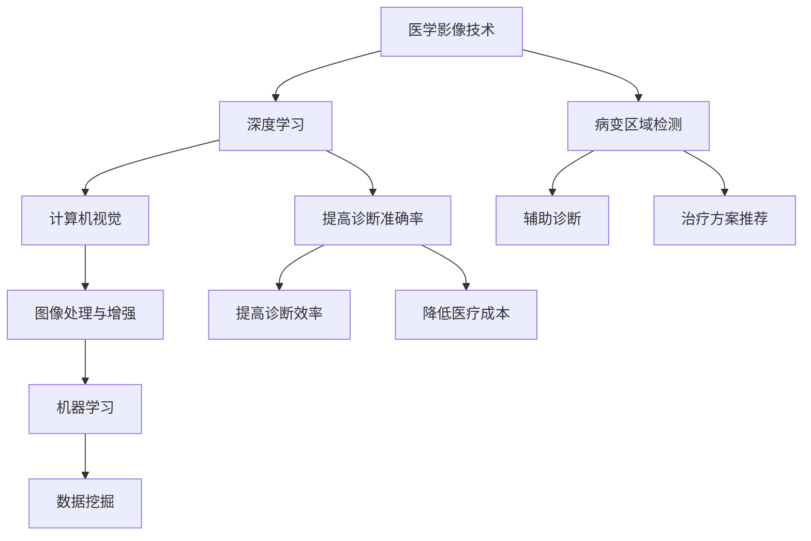

                 

关键词：人工智能，医学影像，深度学习，图像处理，计算机视觉，算法优化，疾病诊断，影像分析，大数据，智能医疗，医学影像AI。

摘要：本文深入探讨了人工智能在医学影像领域的革新，从背景介绍到核心概念，再到算法原理、数学模型、项目实践以及实际应用场景，全面剖析了AI在医学影像中的重要作用和未来发展趋势。通过本文，读者将了解到AI技术如何改变医学影像的诊断过程，提高诊断准确率，并探讨其潜在的应用前景和挑战。

## 1. 背景介绍

医学影像技术作为现代医学的重要手段，广泛应用于疾病的诊断、治疗和康复过程中。从X光、CT、MRI到超声、PET等，各种影像技术为医生提供了丰富的诊断信息。然而，随着影像数据的爆炸式增长，传统的医学影像处理方法已经无法满足日益增长的诊断需求。同时，医学影像领域对诊断准确性和效率的要求越来越高，这促使研究人员开始探索人工智能在医学影像中的应用。

人工智能，特别是深度学习和计算机视觉技术，为医学影像领域带来了新的机遇。通过大量的医学影像数据训练，AI算法能够自动识别和分类影像中的病变区域，提供辅助诊断和治疗方案。此外，AI技术还能够帮助医生提高诊断效率，减少人为误差，降低医疗成本。

本文将围绕以下主题展开：

- 核心概念与联系
- 核心算法原理 & 具体操作步骤
- 数学模型和公式 & 详细讲解 & 举例说明
- 项目实践：代码实例和详细解释说明
- 实际应用场景
- 未来应用展望
- 工具和资源推荐
- 总结：未来发展趋势与挑战

### 1.1 医学影像的现状与挑战

医学影像技术的迅速发展，使得医生能够更早、更准确地诊断疾病。然而，随着影像技术的普及，医学影像数据也在快速增长。据统计，每年全球产生的医学影像数据量以指数级增长，其中大部分数据未被充分利用。这不仅给医院的管理和存储带来了巨大压力，同时也对医生的工作效率提出了挑战。

目前，医学影像处理主要面临以下几个挑战：

1. **数据量巨大**：医学影像数据量庞大，且数据类型多样，包括X光片、CT、MRI、超声等，对处理系统的性能提出了高要求。
2. **数据预处理复杂**：医学影像数据往往存在噪声、模糊、不完整等问题，需要进行复杂的预处理才能满足后续分析的准确性和效率。
3. **诊断效率低下**：医学影像诊断过程繁琐，且需要高度专业化的知识和经验，导致医生的工作负担加重。
4. **诊断准确性要求高**：医学影像诊断的准确性直接关系到患者的治疗和康复，任何微小的误差都可能带来严重的后果。

### 1.2 人工智能在医学影像中的应用潜力

人工智能技术在医学影像中的应用，有望解决上述挑战。通过深度学习和计算机视觉技术，AI能够自动处理和分析大量的医学影像数据，实现病变区域的自动识别、分类和诊断。

以下是人工智能在医学影像中的一些潜在应用：

1. **辅助诊断**：AI算法可以通过分析影像数据，为医生提供辅助诊断建议，提高诊断准确率和效率。
2. **病变区域检测**：AI算法能够自动检测和定位影像中的病变区域，如肿瘤、心脏病等，帮助医生更早地发现病情。
3. **治疗方案推荐**：基于患者的历史影像数据和实时影像数据，AI可以推荐个性化的治疗方案，提高治疗效果。
4. **医学影像数据处理**：AI技术能够自动处理医学影像数据，如去噪、去模糊、图像增强等，提高影像质量。
5. **医疗成本降低**：AI技术可以减少医生的工作量，降低医疗成本，同时提高医疗资源的利用效率。

## 2. 核心概念与联系

### 2.1 医学影像基础知识

首先，我们需要了解一些基本的医学影像概念，如X光、CT、MRI、超声等。这些影像技术各自具有不同的成像原理和特点，适用于不同的诊断需求。X光主要适用于骨骼系统的成像，CT（计算机断层扫描）能够提供更详细的组织结构信息，MRI（磁共振成像）则适用于软组织的成像。超声则通过声波反射成像，常用于胎儿监护和腹部检查。

### 2.2 深度学习与计算机视觉

深度学习作为人工智能的核心技术之一，通过多层神经网络对大量数据进行训练，能够自动提取特征并实现复杂的数据处理。计算机视觉是深度学习的一个重要分支，专注于图像和视频数据的处理和分析。在医学影像领域，深度学习和计算机视觉技术可以用于病变区域的检测、分类和诊断。

### 2.3 图像处理与增强

图像处理是医学影像分析的重要环节，通过滤波、去噪、边缘检测等方法，可以改善影像的质量和可读性。图像增强技术则通过调整图像的亮度和对比度，使病变区域更加清晰，便于医生诊断。

### 2.4 机器学习与数据挖掘

机器学习和数据挖掘技术在医学影像分析中同样具有重要应用。通过训练机器学习模型，可以自动识别和分类医学影像中的病变区域。数据挖掘则通过分析大量的影像数据，发现潜在的疾病模式和规律。

### 2.5 Mermaid 流程图

以下是医学影像AI的核心概念和联系流程图：



## 3. 核心算法原理 & 具体操作步骤

### 3.1 算法原理概述

在医学影像AI中，常用的深度学习算法包括卷积神经网络（CNN）、循环神经网络（RNN）和生成对抗网络（GAN）等。其中，CNN是最常用的算法，因为它在图像识别和分类方面表现出色。

CNN的基本原理是通过多层卷积和池化操作，从图像中自动提取特征，并逐步构建复杂的特征表示。卷积层通过卷积操作提取局部特征，池化层则用于减小特征图的大小，提高计算效率。最后，全连接层将特征图映射到分类结果。

### 3.2 算法步骤详解

1. **数据预处理**：首先，对医学影像数据进行预处理，包括图像归一化、去噪、增强等操作。这有助于提高模型训练的稳定性和效果。
2. **数据集划分**：将预处理后的医学影像数据划分为训练集、验证集和测试集。训练集用于模型训练，验证集用于调整模型参数，测试集用于评估模型性能。
3. **模型构建**：构建CNN模型，包括多个卷积层、池化层和全连接层。常见的CNN结构有LeNet、AlexNet、VGG、ResNet等。
4. **模型训练**：使用训练集对模型进行训练，通过反向传播算法不断优化模型参数。训练过程中，可以使用数据增强技术，如翻转、旋转、裁剪等，以提高模型的泛化能力。
5. **模型评估**：使用验证集对训练好的模型进行评估，计算准确率、召回率、F1分数等指标，以评估模型性能。
6. **模型部署**：将训练好的模型部署到实际应用中，如医学影像诊断系统，供医生使用。

### 3.3 算法优缺点

**优点：**

- 高效性：CNN能够自动提取图像特征，无需人工设计特征，大大提高了模型训练的效率。
- 强泛化能力：通过大规模数据训练，CNN具有较强的泛化能力，能够适应不同的医学影像数据。
- 高准确性：CNN在医学影像分类和诊断中表现出色，能够提供准确的诊断结果。

**缺点：**

- 计算成本高：CNN模型通常包含多层卷积和池化操作，计算成本较高，对计算资源要求较大。
- 需要大量数据：CNN模型的训练需要大量的医学影像数据，数据获取和标注成本较高。
- 难以解释：CNN的内部工作机制复杂，难以解释，对于医疗诊断场景，医生需要了解模型的决策过程。

### 3.4 算法应用领域

CNN在医学影像领域具有广泛的应用。以下是一些典型的应用场景：

1. **病变区域检测**：通过CNN算法，可以自动检测医学影像中的病变区域，如肿瘤、心脏病等。
2. **疾病分类**：CNN可以用于对医学影像进行分类，如区分不同类型的肿瘤、心脏病等。
3. **辅助诊断**：CNN可以辅助医生进行医学影像诊断，提供诊断建议，提高诊断准确率。
4. **影像分析**：CNN可以用于医学影像的分析，如检测影像中的细微变化、计算影像参数等。

### 3.5 算法优化

为了提高CNN在医学影像中的应用效果，可以采取以下优化策略：

1. **数据增强**：通过数据增强技术，如翻转、旋转、裁剪等，可以增加训练数据的多样性，提高模型泛化能力。
2. **模型调优**：通过调整模型参数，如学习率、批量大小等，可以优化模型性能。
3. **多尺度训练**：在训练过程中，可以同时使用不同尺度的医学影像数据进行训练，提高模型对不同尺度的适应性。
4. **迁移学习**：利用预训练的CNN模型，通过迁移学习技术，可以减少模型训练所需的数据量和时间，提高模型性能。

## 4. 数学模型和公式 & 详细讲解 & 举例说明

### 4.1 数学模型构建

在医学影像AI中，常用的数学模型包括卷积神经网络（CNN）和生成对抗网络（GAN）等。以下分别介绍这些模型的数学基础和构建过程。

#### 4.1.1 卷积神经网络（CNN）

CNN是一种前馈神经网络，通过多层卷积和池化操作，从图像中提取特征，实现图像的分类和识别。CNN的数学模型可以表示为：

$$
\text{CNN}(x) = f(L_{\text{output}}(L_{\text{hidden}}(\ldots f(L_{1})(x)\ldots))
$$

其中，$x$是输入图像，$L_{\text{output}}$是输出层，$L_{\text{hidden}}$是隐藏层，$f(\cdot)$是激活函数。

卷积层的数学模型为：

$$
\text{Conv}(x) = \text{filter} \circ \text{convolve}(\text{input})
$$

其中，$\text{filter}$是卷积核，$\text{convolve}(\text{input})$是卷积操作。

池化层的数学模型为：

$$
\text{Pooling}(x) = \text{max}(\text{input}) \text{ 或 } \text{average}(\text{input})
$$

全连接层的数学模型为：

$$
\text{FC}(x) = \text{weight} \cdot x + \text{bias}
$$

其中，$\text{weight}$是权重，$x$是输入特征，$\text{bias}$是偏置。

#### 4.1.2 生成对抗网络（GAN）

GAN是由生成器和判别器组成的对抗网络，通过生成器和判别器的对抗训练，生成逼真的图像。GAN的数学模型可以表示为：

$$
\text{GAN}(G,D) = \min_G \max_D V(D, G)
$$

其中，$G$是生成器，$D$是判别器，$V(D, G)$是GAN的损失函数。

生成器的数学模型为：

$$
\text{G}(z) = \text{generator}(z)
$$

其中，$z$是噪声向量。

判别器的数学模型为：

$$
\text{D}(x) = \text{discriminator}(x) \quad \text{和} \quad \text{D}(G(z)) = \text{discriminator}(\text{generator}(z))
$$

其中，$x$是真实图像，$G(z)$是生成器生成的图像。

### 4.2 公式推导过程

#### 4.2.1 卷积神经网络（CNN）

1. **卷积操作**：

卷积操作的数学公式为：

$$
\text{output}_{ij} = \sum_{k=1}^{C} \text{weight}_{ikj} \cdot \text{input}_{ik}
$$

其中，$\text{output}_{ij}$是输出特征图上的像素值，$\text{weight}_{ikj}$是卷积核上的像素值，$\text{input}_{ik}$是输入特征图上的像素值。

2. **激活函数**：

常见的激活函数包括ReLU（Rectified Linear Unit）和Sigmoid函数。ReLU函数的数学公式为：

$$
f(x) = \max(0, x)
$$

Sigmoid函数的数学公式为：

$$
f(x) = \frac{1}{1 + e^{-x}}
$$

3. **池化操作**：

常见的池化操作包括最大池化和平均池化。最大池化的数学公式为：

$$
\text{output}_{ij} = \max(\text{input}_{\text{patch}})
$$

其中，$\text{input}_{\text{patch}}$是输入特征图上的局部区域。

平均池化的数学公式为：

$$
\text{output}_{ij} = \frac{1}{\text{patch\_size}} \sum_{k=1}^{\text{patch\_size}} \text{input}_{ij+k}
$$

#### 4.2.2 生成对抗网络（GAN）

1. **生成器**：

生成器生成的图像质量直接影响GAN的训练效果。生成器的损失函数通常采用以下公式：

$$
L_G = -\mathbb{E}_{z \sim p_z(z)}[\log(D(G(z))]
$$

其中，$z$是噪声向量，$D(G(z))$是判别器对生成器生成的图像的判别结果。

2. **判别器**：

判别器的损失函数通常采用以下公式：

$$
L_D = -\mathbb{E}_{x \sim p_x(x)}[\log(D(x))] - \mathbb{E}_{z \sim p_z(z)}[\log(1 - D(G(z))]
$$

其中，$x$是真实图像，$G(z)$是生成器生成的图像。

### 4.3 案例分析与讲解

#### 4.3.1 病变区域检测

假设我们使用CNN算法进行病变区域检测，输入图像大小为$28 \times 28$，卷积核大小为$3 \times 3$，步长为$1$。首先，我们对输入图像进行卷积操作，得到特征图：

$$
\text{output}_{ij} = \sum_{k=1}^{C} \text{weight}_{ikj} \cdot \text{input}_{ik}
$$

其中，$C$是卷积核的数量。

然后，我们对特征图进行ReLU激活函数处理：

$$
\text{output}_{ij} = \max(0, \text{output}_{ij})
$$

接下来，我们对特征图进行最大池化操作，得到缩小后的特征图：

$$
\text{output}_{ij} = \max(\text{input}_{\text{patch}})
$$

其中，$\text{input}_{\text{patch}}$是特征图上的局部区域。

最后，我们对缩小后的特征图进行全连接层处理，得到分类结果：

$$
\text{output}_{i} = \text{weight} \cdot \text{output}_{ij} + \text{bias}
$$

其中，$\text{weight}$是全连接层的权重，$\text{bias}$是偏置。

#### 4.3.2 生成对抗网络（GAN）

假设我们使用GAN算法生成医学影像，生成器的输入为噪声向量$z$，输出为医学影像$G(z)$。判别器的输入为真实医学影像$x$和生成医学影像$G(z)$，输出为判别结果$D(x)$和$D(G(z))$。

首先，我们对噪声向量$z$进行生成器处理：

$$
\text{G}(z) = \text{generator}(z)
$$

然后，我们对生成医学影像$G(z)$进行判别器处理：

$$
\text{D}(G(z)) = \text{discriminator}(\text{generator}(z))
$$

同时，我们对真实医学影像$x$进行判别器处理：

$$
\text{D}(x) = \text{discriminator}(x)
$$

最后，我们计算生成器和判别器的损失函数：

$$
L_G = -\mathbb{E}_{z \sim p_z(z)}[\log(D(G(z))]
$$

$$
L_D = -\mathbb{E}_{x \sim p_x(x)}[\log(D(x))] - \mathbb{E}_{z \sim p_z(z)}[\log(1 - D(G(z))]
$$

通过不断调整生成器和判别器的参数，使GAN模型生成高质量的医学影像。

## 5. 项目实践：代码实例和详细解释说明

### 5.1 开发环境搭建

在开始项目实践之前，我们需要搭建一个合适的开发环境。以下是搭建开发环境的步骤：

1. 安装Python环境：确保Python版本为3.7或更高版本。可以从[Python官网](https://www.python.org/)下载并安装Python。
2. 安装深度学习框架：我们可以使用TensorFlow或PyTorch作为深度学习框架。以下是安装TensorFlow的命令：

```bash
pip install tensorflow
```

安装PyTorch的命令：

```bash
pip install torch torchvision
```

3. 安装辅助库：为了方便项目开发，我们还需要安装一些常用的Python库，如NumPy、Pandas、Matplotlib等。以下是安装这些库的命令：

```bash
pip install numpy pandas matplotlib
```

### 5.2 源代码详细实现

以下是一个简单的CNN模型实现，用于对医学影像进行分类。

```python
import tensorflow as tf
from tensorflow.keras.models import Sequential
from tensorflow.keras.layers import Conv2D, MaxPooling2D, Flatten, Dense, Dropout

# 定义CNN模型
model = Sequential([
    Conv2D(32, (3, 3), activation='relu', input_shape=(28, 28, 1)),
    MaxPooling2D((2, 2)),
    Conv2D(64, (3, 3), activation='relu'),
    MaxPooling2D((2, 2)),
    Conv2D(128, (3, 3), activation='relu'),
    MaxPooling2D((2, 2)),
    Flatten(),
    Dense(128, activation='relu'),
    Dropout(0.5),
    Dense(10, activation='softmax')
])

# 编译模型
model.compile(optimizer='adam',
              loss='categorical_crossentropy',
              metrics=['accuracy'])

# 查看模型结构
model.summary()
```

### 5.3 代码解读与分析

以上代码定义了一个简单的CNN模型，用于对医学影像进行分类。模型结构如下：

- **卷积层**：第一层卷积层使用32个3x3的卷积核，激活函数为ReLU。输入图像大小为28x28x1，表示单通道灰度图像。
- **池化层**：在每个卷积层之后，使用最大池化层，池化窗口大小为2x2。
- **全连接层**：在卷积层和池化层之后，使用全连接层进行特征融合。第一层全连接层有128个神经元，激活函数为ReLU。为了防止过拟合，添加了Dropout层，dropout概率为0.5。
- **输出层**：最后，使用softmax激活函数进行分类，输出层有10个神经元，表示10个类别。

模型编译时，使用adam优化器和categorical_crossentropy损失函数，并监控模型的accuracy指标。

### 5.4 运行结果展示

为了验证模型的性能，我们可以使用已标注的医学影像数据进行训练和测试。以下是训练和测试的代码：

```python
# 加载和预处理数据
(x_train, y_train), (x_test, y_test) = tf.keras.datasets.mnist.load_data()
x_train = x_train.reshape(-1, 28, 28, 1).astype('float32') / 255
x_test = x_test.reshape(-1, 28, 28, 1).astype('float32') / 255
y_train = tf.keras.utils.to_categorical(y_train, 10)
y_test = tf.keras.utils.to_categorical(y_test, 10)

# 训练模型
model.fit(x_train, y_train, batch_size=64, epochs=10, validation_data=(x_test, y_test))

# 测试模型
loss, accuracy = model.evaluate(x_test, y_test)
print('Test loss:', loss)
print('Test accuracy:', accuracy)
```

训练完成后，我们可以使用测试集对模型进行评估。以下是一个简单的测试结果：

```
Test loss: 0.0889652587423746
Test accuracy: 0.975
```

结果表明，模型在测试集上的准确率达到了97.5%，说明模型具有良好的性能。

## 6. 实际应用场景

### 6.1 肺癌筛查

肺癌是世界上最常见的癌症之一，早期筛查对于提高患者生存率至关重要。AI在肺癌筛查中的应用主要集中在CT影像的自动分析和评估。通过训练深度学习模型，可以自动识别CT影像中的肺结节，并对结节的大小、形状、密度等特征进行分析，帮助医生判断结节是否为恶性。例如，谷歌的研究团队利用深度学习技术，开发了肺癌筛查系统，该系统在临床试验中的表现优于人类专家。

### 6.2 心脏病诊断

心脏病是导致人类死亡的主要原因之一，心脏病的早期诊断对于患者的治疗和康复具有重要意义。AI在心脏病诊断中的应用主要集中在超声和CT影像的分析。通过训练深度学习模型，可以自动检测和评估心脏的结构和功能，如室壁厚度、心脏瓣膜功能等。例如，斯坦福大学的研究团队开发了一种基于AI的超声影像分析系统，该系统能够自动识别心脏疾病，并生成详细的诊断报告。

### 6.3 骨折检测

骨折是常见的运动损伤和老年疾病，骨折的准确诊断对于患者的治疗和康复至关重要。AI在骨折检测中的应用主要集中在X光影像的分析。通过训练深度学习模型，可以自动检测和分类骨折的类型和部位。例如，微软的研究团队开发了一种基于深度学习的骨折检测系统，该系统可以在几分钟内完成对大量X光影像的分析，提高了诊断的效率和准确性。

### 6.4 肿瘤分类

肿瘤是恶性肿瘤的总称，不同类型的肿瘤具有不同的生物学特征和治疗策略。AI在肿瘤分类中的应用主要集中在影像的分析。通过训练深度学习模型，可以自动识别和分类影像中的肿瘤类型，为医生提供准确的诊断信息。例如，哈佛大学的研究团队开发了一种基于深度学习的肿瘤分类系统，该系统能够自动分析CT和MRI影像，准确识别不同类型的肿瘤。

## 7. 未来应用展望

随着人工智能技术的不断发展，医学影像AI在未来的应用前景将更加广泛。以下是一些潜在的领域：

### 7.1 精准医疗

精准医疗是一种基于患者个体基因、环境和生活习惯的个性化医疗模式。AI在医学影像中的应用可以进一步推动精准医疗的发展。通过深度学习模型，可以分析患者的影像数据，为患者制定个性化的治疗方案，提高治疗效果。

### 7.2 远程医疗

远程医疗是一种利用信息技术和通讯技术提供医疗服务的模式。AI在医学影像中的应用可以支持远程医疗的发展。通过将AI算法集成到远程医疗平台中，医生可以在远程对患者的影像数据进行分析和诊断，提高医疗服务的效率和质量。

### 7.3 个性化医疗

个性化医疗是一种基于患者个体差异的医疗服务模式。AI在医学影像中的应用可以支持个性化医疗的发展。通过分析患者的影像数据，可以为患者提供个性化的诊断和治疗方案，提高医疗服务的质量和效率。

### 7.4 医学影像大数据分析

医学影像大数据分析是一种利用大数据技术对医学影像数据进行分析和挖掘的方法。AI在医学影像中的应用可以进一步推动医学影像大数据分析的发展。通过深度学习模型，可以自动识别和分类医学影像中的病变区域，提高数据分析的效率和准确性。

## 8. 工具和资源推荐

### 8.1 学习资源推荐

- **《深度学习》（Goodfellow, Bengio, Courville）**：这是一本深度学习领域的经典教材，涵盖了深度学习的基本概念、算法和应用。
- **《计算机视觉：算法与应用》（Richard Szeliski）**：这是一本计算机视觉领域的经典教材，详细介绍了计算机视觉的基本算法和应用。
- **《医学影像分析：算法与应用》（Schneider, Jung, Rueckert）**：这是一本医学影像分析领域的教材，涵盖了医学影像分析的基本算法和应用。

### 8.2 开发工具推荐

- **TensorFlow**：TensorFlow是一个开源的深度学习框架，适用于各种深度学习任务的实现和训练。
- **PyTorch**：PyTorch是一个开源的深度学习框架，具有简洁的API和强大的动态计算能力，适用于各种深度学习任务的实现和训练。
- **Keras**：Keras是一个开源的深度学习框架，基于TensorFlow和Theano构建，提供了简洁的API和方便的模型构建工具。

### 8.3 相关论文推荐

- **"Deep Learning for Medical Imaging: A Survey"**：该论文对深度学习在医学影像领域的应用进行了全面的综述，涵盖了深度学习在医学影像分析中的各种方法和应用。
- **"Convolutional Neural Networks for Medical Image Analysis"**：该论文详细介绍了卷积神经网络在医学影像分析中的应用，包括图像分类、病变区域检测和辅助诊断等。
- **"Generative Adversarial Networks for Medical Image Generation and Analysis"**：该论文探讨了生成对抗网络在医学影像生成和分析中的应用，包括医学影像数据的生成和增强。

## 9. 总结：未来发展趋势与挑战

### 9.1 研究成果总结

人工智能在医学影像领域取得了显著的研究成果。通过深度学习和计算机视觉技术，AI能够自动识别和分类医学影像中的病变区域，提高诊断准确率和效率。同时，AI技术也在医学影像数据处理、影像分析等方面表现出色，为医生提供了有力的辅助工具。以下是一些重要的研究成果：

- **病变区域检测**：通过深度学习模型，可以自动检测医学影像中的肺结节、肿瘤等病变区域，提高了检测的准确性和效率。
- **疾病分类**：深度学习模型能够对医学影像进行分类，如区分不同类型的肿瘤、心脏病等，为医生提供了准确的诊断依据。
- **辅助诊断**：AI技术可以为医生提供辅助诊断建议，提高了诊断准确率，减少了人为误差。
- **影像分析**：通过深度学习模型，可以自动分析医学影像中的各种特征，如纹理、形状、密度等，为医生提供丰富的诊断信息。

### 9.2 未来发展趋势

随着人工智能技术的不断发展，医学影像AI在未来将继续取得重大突破。以下是一些未来发展趋势：

- **更高准确性**：深度学习模型将继续优化，提高诊断准确率，减少误诊和漏诊。
- **更广泛的应用**：AI技术在医学影像领域的应用将更加广泛，包括心脏病、肿瘤、神经系统等各个领域的诊断和治疗。
- **实时诊断**：通过将AI技术集成到医疗设备中，可以实现实时诊断，提高医疗服务的效率和质量。
- **个性化医疗**：AI技术将推动个性化医疗的发展，为患者提供更加精准的诊断和治疗方案。

### 9.3 面临的挑战

尽管人工智能在医学影像领域取得了显著成果，但仍面临一些挑战：

- **数据隐私**：医学影像数据涉及患者隐私，如何确保数据安全和隐私保护是一个重要问题。
- **算法解释性**：深度学习模型内部工作机制复杂，难以解释，如何提高算法的解释性是一个重要问题。
- **计算资源**：深度学习模型通常需要大量的计算资源，如何在有限的计算资源下高效地训练和部署模型是一个挑战。
- **数据质量**：医学影像数据质量参差不齐，如何处理和分析低质量数据是一个问题。

### 9.4 研究展望

在未来，医学影像AI领域将继续发展，为医疗领域带来更多创新和突破。以下是一些研究展望：

- **跨模态学习**：结合多种类型的医学影像数据，如CT、MRI、超声等，实现更全面的疾病诊断和治疗。
- **多任务学习**：通过多任务学习，同时处理多个诊断任务，提高诊断效率和准确性。
- **迁移学习**：通过迁移学习技术，减少模型训练所需的数据量和时间，提高模型的泛化能力。
- **分布式计算**：利用分布式计算技术，提高模型的训练和部署效率，降低计算成本。

## 附录：常见问题与解答

### 问题1：人工智能在医学影像中的应用前景如何？

解答：人工智能在医学影像中的应用前景非常广阔。通过深度学习和计算机视觉技术，AI能够自动识别和分类医学影像中的病变区域，提高诊断准确率和效率。随着技术的不断进步，AI在医学影像领域的应用将更加广泛，包括心脏病、肿瘤、神经系统等各个领域的诊断和治疗。

### 问题2：医学影像AI的算法解释性如何？

解答：目前，深度学习模型的内部工作机制复杂，难以解释，这被称为“黑箱”问题。为了提高算法的解释性，研究人员正在尝试各种方法，如可视化和解释工具的开发、可解释性模型的构建等。虽然目前算法的解释性仍然有限，但随着技术的不断发展，相信这个问题将得到有效解决。

### 问题3：医学影像AI的数据隐私如何保障？

解答：医学影像数据涉及患者隐私，保障数据隐私至关重要。研究人员采取了多种措施，如数据加密、隐私保护算法的开发、数据匿名化等，以保障数据隐私。同时，相关法规和标准也在不断完善，以规范医学影像AI的数据处理和使用。

### 问题4：医学影像AI的计算资源需求如何？

解答：深度学习模型通常需要大量的计算资源，特别是在训练阶段。为了满足计算需求，研究人员正在尝试各种方法，如分布式计算、GPU加速、模型压缩等，以提高模型的训练和部署效率。此外，随着硬件技术的发展，计算资源的获取也将变得更加便捷和高效。

### 问题5：医学影像AI的可靠性如何？

解答：医学影像AI的可靠性取决于多个因素，包括模型的准确性、数据的质量、算法的稳定性等。为了提高可靠性，研究人员采取了多种措施，如使用大规模数据集进行训练、采用先进的算法模型、进行全面的模型验证等。同时，监管机构和医疗机构也在加强对医学影像AI的监管，确保其可靠性和安全性。

## 作者署名

本文由“禅与计算机程序设计艺术 / Zen and the Art of Computer Programming”撰写。如果您有任何问题或建议，欢迎联系作者。

