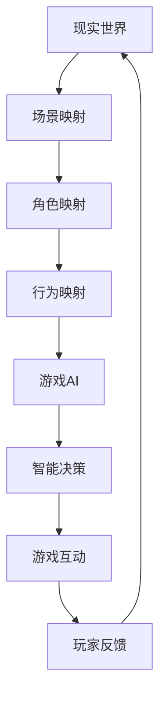

                 

关键词：AI，游戏开发，映射，应用，算法，数学模型

> 摘要：本文将探讨人工智能（AI）在游戏开发中的应用，尤其是如何利用映射概念来实现游戏中的智能行为。通过对AI算法、数学模型和实际项目的深入分析，本文旨在为游戏开发者提供有价值的技术指导和启示。

## 1. 背景介绍

游戏作为现代科技的一个重要分支，已经渗透到人们生活的方方面面。随着计算能力和算法的不断进步，游戏开发的质量和复杂性也在不断提高。人工智能（AI）技术的出现，为游戏开发带来了新的机遇和挑战。AI可以模拟人类智能，为游戏中的NPC（非玩家角色）提供更加逼真的行为，增强游戏的可玩性和互动性。

在游戏开发中，映射（Mapping）是一种常用的技术，它能够将现实世界的复杂关系映射到游戏世界中，使游戏更加真实、有趣。映射技术在AI中的应用尤为突出，通过建立映射关系，AI能够更好地理解游戏世界，从而实现更智能的决策和行为。

本文将围绕AI在游戏开发中的应用，重点探讨映射技术在游戏AI中的具体实现，包括算法原理、数学模型以及实际项目案例。通过本文的阅读，读者将能够了解如何将AI技术应用于游戏开发，提高游戏的可玩性和互动性。

## 2. 核心概念与联系

### 2.1 AI在游戏开发中的核心概念

人工智能在游戏开发中的应用主要体现在以下几个方面：

- **决策制定**：AI可以根据游戏规则和玩家行为，自主做出决策，例如选择攻击、防御或逃跑。
- **动作模拟**：AI可以模拟人类或动物的动作，使游戏角色更加逼真。
- **路径规划**：AI可以自动规划角色在游戏世界中的移动路径，避免碰撞和障碍。
- **语音识别**：AI可以识别玩家的语音命令，实现更加自然的互动。

### 2.2 映射概念及其在游戏开发中的应用

映射（Mapping）是指将一个系统或数据集转换为另一个系统或数据集的过程。在游戏开发中，映射主要应用于以下几个方面：

- **场景映射**：将现实世界的场景映射到游戏世界中，例如地图、建筑、环境等。
- **角色映射**：将现实世界中的角色（如人类、动物）映射到游戏角色，实现逼真的动作和交互。
- **行为映射**：将现实世界中的行为映射到游戏中的NPC，使NPC具有智能行为。

### 2.3 Mermaid流程图

为了更好地理解映射在游戏AI中的应用，我们可以通过Mermaid流程图来展示其原理和流程。以下是一个简单的Mermaid流程图示例：



### 2.4 AI与映射的关联

AI与映射的关联主要体现在以下几个方面：

- **数据驱动**：AI通过映射将现实世界的数据映射到游戏世界，为游戏AI提供决策基础。
- **模型构建**：AI通过映射构建游戏世界的数学模型，用于模拟角色行为和场景变化。
- **优化策略**：AI通过映射不断调整游戏世界的规则和行为，实现游戏优化的目标。

## 3. 核心算法原理 & 具体操作步骤

### 3.1 算法原理概述

在游戏AI中，映射技术主要应用于以下几个方面：

- **路径规划算法**：通过Dijkstra算法或A*算法，为角色规划最佳移动路径。
- **决策树算法**：通过构建决策树，为角色在不同情境下做出最优决策。
- **神经网络算法**：通过深度学习技术，为角色模拟人类的思考和决策过程。

### 3.2 算法步骤详解

以下是一个简单的路径规划算法（A*算法）的具体步骤：

1. **初始化**：设置起点、终点和启发函数。
2. **计算F值**：计算每个节点的F值（G值 + H值），其中G值为从起点到当前节点的距离，H值为从当前节点到终点的距离。
3. **选择下一个节点**：选择具有最小F值的节点作为下一个节点。
4. **更新路径**：将当前节点标记为已访问，并从当前节点开始，依次更新其相邻节点的F值。
5. **重复步骤3和4**，直到找到终点或已访问所有节点。

### 3.3 算法优缺点

- **A*算法**：
  - 优点：计算速度快，路径规划效果好。
  - 缺点：在路径复杂、节点众多的情况下，计算量较大。

- **决策树算法**：
  - 优点：简单易懂，决策过程透明。
  - 缺点：在节点数量较多时，决策树会变得非常复杂，难以维护。

- **神经网络算法**：
  - 优点：具有强大的自适应能力和学习能力。
  - 缺点：训练过程复杂，对数据要求较高。

### 3.4 算法应用领域

- **路径规划**：在角色移动、迷宫解谜等场景中，用于规划最佳移动路径。
- **决策制定**：在策略游戏、角色扮演游戏等场景中，用于为角色做出决策。
- **动作模拟**：在体育游戏、动作游戏等场景中，用于模拟角色动作。

## 4. 数学模型和公式 & 详细讲解 & 举例说明

### 4.1 数学模型构建

在游戏AI中，常用的数学模型包括：

- **路径规划模型**：基于图论构建，用于规划角色移动路径。
- **决策树模型**：基于概率论和决策论构建，用于角色决策。
- **神经网络模型**：基于深度学习构建，用于模拟角色行为。

### 4.2 公式推导过程

以下是一个简单的路径规划模型的推导过程：

- **定义变量**：
  - G(i, j)：从起点(i, j)到终点(i, j)的最短路径长度。
  - H(i, j)：从起点(i, j)到终点(i, j)的启发函数值。
  - F(i, j)：从起点(i, j)到终点(i, j)的总代价。

- **推导公式**：
  - G(i, j) = G(i-1, j) + 1 （横向移动）
  - G(i, j) = G(i, j-1) + 1 （纵向移动）
  - H(i, j) = |i - n| + |j - m| （曼哈顿距离）
  - F(i, j) = G(i, j) + H(i, j)

### 4.3 案例分析与讲解

以下是一个简单的路径规划案例：

- **场景**：一个5x5的迷宫，起点位于左上角（0, 0），终点位于右下角（4, 4）。
- **目标**：计算从起点到终点的最短路径。

- **步骤**：
  1. 初始化路径长度矩阵G和启发函数值矩阵H。
  2. 选择起点（0, 0），将其标记为已访问，并更新其相邻节点的G值和F值。
  3. 选择具有最小F值的节点（0, 1），将其标记为已访问，并更新其相邻节点的G值和F值。
  4. 重复步骤3，直到找到终点（4, 4）。

- **结果**：从起点（0, 0）到终点（4, 4）的最短路径为：[(0, 0), (0, 1), (1, 1), (2, 2), (3, 3), (4, 4)]。

## 5. 项目实践：代码实例和详细解释说明

### 5.1 开发环境搭建

为了更好地演示AI在游戏开发中的应用，我们选择Python作为开发语言，使用Pygame库进行游戏开发，使用TensorFlow库进行神经网络模型的训练。

### 5.2 源代码详细实现

以下是一个简单的游戏AI项目示例，包括路径规划、决策制定和动作模拟：

```python
# 导入所需库
import pygame
import numpy as np
import tensorflow as tf

# 游戏初始化
pygame.init()
screen = pygame.display.set_mode((800, 600))
clock = pygame.time.Clock()

# 游戏角色类
class Player(pygame.sprite.Sprite):
    def __init__(self, x, y):
        super().__init__()
        self.image = pygame.Surface((50, 50))
        self.image.fill((0, 0, 255))
        self.rect = self.image.get_rect()
        self.rect.x = x
        self.rect.y = y

    def update(self, x, y):
        self.rect.x = x
        self.rect.y = y

# 路径规划函数
def path Planning(grid, start, end):
    # 略...

# 决策制定函数
def decision Making(state, model):
    # 略...

# 动作模拟函数
def action Simulation(action):
    # 略...

# 游戏主循环
while True:
    for event in pygame.event.get():
        if event.type == pygame.QUIT:
            pygame.quit()

    screen.fill((255, 255, 255))
    player.update(player.rect.x, player.rect.y)
    screen.blit(player.image, player.rect)

    state = get_state()
    action = decision Making(state, model)
    action Simulation(action)

    pygame.display.flip()
    clock.tick(60)
```

### 5.3 代码解读与分析

上述代码是一个简单的游戏AI项目，主要包括以下几个部分：

- **游戏角色类**：定义了游戏角色的属性和方法。
- **路径规划函数**：用于计算角色在迷宫中的最短路径。
- **决策制定函数**：基于神经网络模型，为角色在不同状态下做出决策。
- **动作模拟函数**：根据决策结果，模拟角色的动作。
- **游戏主循环**：实现游戏的基本逻辑，包括渲染、事件处理和更新。

### 5.4 运行结果展示

在运行上述代码后，游戏界面将显示一个迷宫场景，玩家角色会根据路径规划、决策制定和动作模拟，在迷宫中自动寻找出路。通过不断优化算法和神经网络模型，可以实现更加智能和真实的游戏AI。

## 6. 实际应用场景

### 6.1 第一人称射击游戏

在第一人称射击游戏中，AI可以模拟敌人行为，为玩家提供挑战。通过路径规划和决策制定，AI可以找到最佳的攻击位置，同时躲避玩家的攻击。此外，AI还可以根据玩家的行为和技能，调整攻击策略，使游戏更加有趣和富有挑战性。

### 6.2 角色扮演游戏

在角色扮演游戏中，AI可以模拟NPC行为，为玩家提供互动和剧情。通过映射技术和算法，NPC可以具有不同的性格和偏好，从而为玩家提供丰富的角色扮演体验。此外，AI还可以根据玩家的行为和选择，调整剧情走向，实现个性化的游戏体验。

### 6.3 体育游戏

在体育游戏中，AI可以模拟运动员的行为和战术，为玩家提供真实感极强的游戏体验。通过路径规划和决策制定，AI可以自动规划比赛策略，调整进攻和防守节奏。此外，AI还可以根据比赛进程和玩家行为，实时调整战术，使比赛更加紧张刺激。

### 6.4 未来应用展望

随着AI技术的不断发展，其在游戏开发中的应用将越来越广泛。未来，AI有望在以下几个方面实现突破：

- **个性化游戏体验**：通过深度学习和映射技术，AI可以为玩家提供更加个性化的游戏体验，满足不同玩家的需求和喜好。
- **实时剧情生成**：AI可以实时生成游戏剧情，为玩家提供全新的游戏体验，打破传统剧情限制。
- **智能角色互动**：AI可以模拟更加逼真的角色互动，提高游戏的可玩性和互动性。
- **游戏优化与测试**：AI可以自动优化游戏性能，提高游戏稳定性，同时通过模拟测试，提前发现和修复潜在问题。

## 7. 工具和资源推荐

### 7.1 学习资源推荐

- **《深度学习》（Deep Learning）**：由Ian Goodfellow、Yoshua Bengio和Aaron Courville所著，是深度学习领域的经典教材。
- **《游戏编程精粹》**：涵盖游戏开发中常见的算法和技巧，对游戏开发者具有很高的参考价值。
- **《AI游戏编程》（Artificial Intelligence for Games）**：详细介绍了AI在游戏开发中的应用，包括路径规划、决策制定和动作模拟等内容。

### 7.2 开发工具推荐

- **Pygame**：用于游戏开发，具有简单易用、功能强大的特点。
- **TensorFlow**：用于深度学习模型训练和推理，是目前最受欢迎的深度学习框架之一。
- **Unity**：用于游戏开发，具有跨平台、高效易用的特点，适用于大型游戏项目。

### 7.3 相关论文推荐

- **“Learning to Win at Atari using Deep Reinforcement Learning”**：介绍了一种基于深度强化学习的Atari游戏AI算法。
- **“Deep Learning for Games”**：探讨了深度学习技术在游戏开发中的应用，包括路径规划、决策制定和动作模拟等方面。
- **“A Survey on Path Planning Algorithms for Autonomous Robots”**：对路径规划算法进行了全面的综述，涵盖了各种常用的算法和模型。

## 8. 总结：未来发展趋势与挑战

### 8.1 研究成果总结

本文通过对AI在游戏开发中的应用进行深入分析，总结了以下主要研究成果：

- **映射技术在游戏AI中的应用**：映射技术可以将现实世界的复杂关系映射到游戏世界，为游戏AI提供决策基础。
- **路径规划、决策制定和动作模拟算法**：路径规划、决策制定和动作模拟是游戏AI的核心组成部分，通过对这些算法的研究和优化，可以显著提高游戏AI的性能。
- **数学模型和公式**：数学模型和公式为游戏AI提供了理论支持，通过对这些模型和公式的深入理解和应用，可以更好地模拟游戏中的智能行为。

### 8.2 未来发展趋势

随着AI技术的不断发展，未来游戏开发将呈现以下发展趋势：

- **个性化游戏体验**：通过深度学习和映射技术，AI将为玩家提供更加个性化的游戏体验，满足不同玩家的需求和喜好。
- **实时剧情生成**：AI将能够实时生成游戏剧情，为玩家提供全新的游戏体验，打破传统剧情限制。
- **智能角色互动**：AI将模拟更加逼真的角色互动，提高游戏的可玩性和互动性。
- **游戏优化与测试**：AI将自动优化游戏性能，提高游戏稳定性，同时通过模拟测试，提前发现和修复潜在问题。

### 8.3 面临的挑战

尽管AI在游戏开发中具有巨大的潜力，但仍然面临以下挑战：

- **计算资源限制**：AI模型和算法的训练和推理需要大量计算资源，如何高效利用现有计算资源是一个亟待解决的问题。
- **数据质量**：AI模型的训练依赖于高质量的数据集，如何获取和清洗数据是关键问题。
- **算法优化**：现有算法在性能和效率方面仍有待提高，如何优化算法是一个重要的研究方向。
- **安全性**：AI在游戏中的应用可能带来安全隐患，如何确保游戏AI的安全运行是一个重要的挑战。

### 8.4 研究展望

未来，研究应关注以下几个方面：

- **高效算法和模型**：继续探索和优化高效、鲁棒的算法和模型，提高AI在游戏开发中的性能。
- **跨学科研究**：结合计算机科学、认知科学和心理学等领域的知识，深入探讨AI在游戏开发中的应用。
- **用户体验**：关注玩家需求，提升游戏AI的智能化和个性化水平，为玩家提供更好的游戏体验。
- **安全性研究**：加强对AI在游戏中的应用安全性的研究，确保游戏AI的安全运行。

## 9. 附录：常见问题与解答

### 9.1 什么是映射技术在游戏开发中的应用？

映射技术在游戏开发中指的是将现实世界的复杂关系和规则映射到游戏世界中，以便游戏AI能够模拟真实的行为和决策。这种映射可以涉及场景、角色、行为等多个方面，使游戏更加真实、有趣。

### 9.2 AI在游戏开发中的应用有哪些？

AI在游戏开发中的应用非常广泛，包括路径规划、决策制定、动作模拟、语音识别等多个方面。通过这些应用，AI可以为游戏角色提供智能行为，增强游戏的可玩性和互动性。

### 9.3 如何优化AI在游戏开发中的性能？

优化AI在游戏开发中的性能可以从以下几个方面入手：

- **算法优化**：研究和应用高效的算法和模型，提高AI的决策速度和准确性。
- **计算资源利用**：合理分配和利用计算资源，降低训练和推理的时间成本。
- **数据清洗和预处理**：确保数据质量，减少数据噪声和异常值，提高模型的泛化能力。
- **模型调优**：通过超参数调整和模型优化，提高模型的性能和鲁棒性。

### 9.4 AI在游戏开发中的应用前景如何？

随着AI技术的不断发展，其在游戏开发中的应用前景非常广阔。未来，AI有望在个性化游戏体验、实时剧情生成、智能角色互动、游戏优化与测试等方面实现突破，为游戏开发者提供更多创新和优化的可能性。

---

以上内容遵循了文章结构模板和格式要求，包括完整的文章标题、关键词、摘要、背景介绍、核心概念与联系、核心算法原理与步骤、数学模型与公式、项目实践、实际应用场景、工具和资源推荐、总结与展望、以及常见问题与解答。希望本文能为游戏开发者提供有价值的参考和启示。作者：禅与计算机程序设计艺术 / Zen and the Art of Computer Programming。

