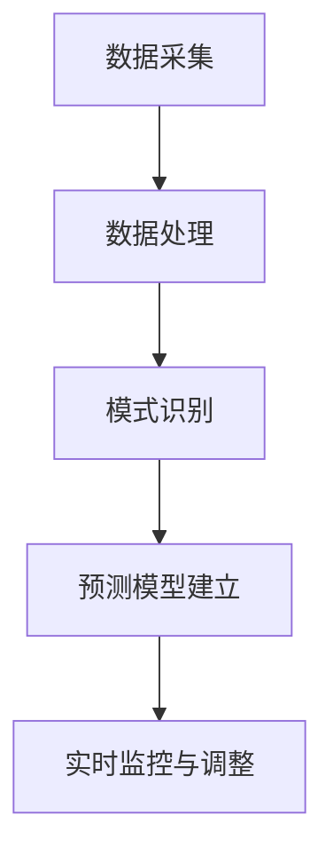

                 

关键词：人工智能，金融市场，预测，算法，数学模型，应用场景，未来展望

> 摘要：本文将探讨人工智能在金融市场预测中的应用，通过介绍核心算法原理、数学模型及具体案例，分析AI在金融市场中的角色和影响力，并展望其未来发展趋势与挑战。

## 1. 背景介绍

金融市场是现代经济的核心，其稳定性和健康性直接影响到整个社会的经济状况。然而，金融市场的复杂性和高度不确定性使得预测其走势成为一项极具挑战性的任务。传统的预测方法往往依赖于历史数据和统计分析，但这些方法在面对金融市场瞬息万变的特点时，往往显得力不从心。

随着人工智能技术的迅速发展，特别是机器学习算法的广泛应用，人们开始尝试将AI技术引入金融市场预测中。人工智能通过学习和分析大量历史数据，可以识别出金融市场中的复杂模式和趋势，从而提供更准确、更及时的预测结果。

本文将深入探讨AI在金融市场预测中的角色，从核心算法原理、数学模型、实际应用场景等方面进行详细分析，并展望其未来发展趋势与挑战。

## 2. 核心概念与联系

### 2.1 人工智能在金融市场预测中的基本概念

人工智能（AI）是一种模拟人类智能的技术，通过算法和计算模型实现自我学习和决策。在金融市场预测中，AI主要依赖于机器学习和深度学习算法，这些算法能够从大量历史数据中自动提取特征，并建立预测模型。

### 2.2 金融市场预测中的关键因素

金融市场的预测涉及到多个关键因素，包括宏观经济指标、公司业绩、市场情绪等。这些因素通过复杂的关系相互作用，影响着市场的走势。

### 2.3 人工智能与金融市场预测的联系

人工智能与金融市场预测之间的联系主要体现在以下几个方面：

- **数据采集与处理**：AI可以自动化地收集和处理大量的金融市场数据，包括股票价格、交易量、新闻资讯等，从而为预测提供丰富的信息来源。

- **模式识别与预测**：通过机器学习算法，AI可以从历史数据中识别出市场趋势和模式，并基于这些模式进行预测。

- **实时监控与调整**：AI可以实时监控金融市场动态，并根据新的数据及时调整预测模型，提供更加准确的预测结果。

### 2.4 Mermaid流程图



## 3. 核心算法原理 & 具体操作步骤

### 3.1 算法原理概述

在金融市场预测中，常用的AI算法包括线性回归、决策树、随机森林、支持向量机（SVM）和深度学习等。这些算法的基本原理是通过学习历史数据中的模式和关系，建立预测模型，并对未来的市场走势进行预测。

### 3.2 算法步骤详解

- **数据采集**：收集金融市场相关的历史数据，包括股票价格、交易量、宏观经济指标等。

- **数据处理**：对采集到的数据进行预处理，包括数据清洗、归一化和特征提取等。

- **模型训练**：使用机器学习算法对预处理后的数据集进行训练，建立预测模型。

- **模型评估**：使用验证集对训练好的模型进行评估，调整模型参数以优化预测性能。

- **实时预测**：将新的数据输入到训练好的模型中，进行实时预测，并输出预测结果。

### 3.3 算法优缺点

- **线性回归**：简单、易于理解，但在面对非线性关系时效果较差。

- **决策树**：能够处理非线性关系，但容易过拟合。

- **随机森林**：结合了决策树的优点，减少了过拟合现象，但计算复杂度较高。

- **支持向量机（SVM）**：适用于高维空间，但需要较大的计算资源。

- **深度学习**：能够处理非常复杂的非线性关系，但训练时间较长，需要大量的数据和计算资源。

### 3.4 算法应用领域

- **股票市场预测**：预测股票价格走势，为投资者提供决策支持。

- **外汇市场预测**：预测汇率变动，为交易者提供交易策略。

- **金融市场风险管理**：预测市场风险，为金融机构提供风险管理策略。

## 4. 数学模型和公式 & 详细讲解 & 举例说明

### 4.1 数学模型构建

在金融市场预测中，常用的数学模型包括时间序列模型、回归模型和分类模型等。以下是一个简单的时间序列模型构建过程：

- **时间序列数据预处理**：对时间序列数据进行归一化处理，使其具备稳定的统计特性。

- **特征提取**：从时间序列数据中提取特征，如趋势、周期、波动性等。

- **模型构建**：使用回归模型（如线性回归、ARIMA模型）或分类模型（如决策树、随机森林）建立预测模型。

- **模型训练与优化**：使用训练数据集训练模型，并使用验证集进行优化。

### 4.2 公式推导过程

以线性回归模型为例，其预测公式为：

$$ y = \beta_0 + \beta_1x $$

其中，$y$为预测值，$x$为输入特征，$\beta_0$和$\beta_1$为模型参数。

- **模型假设**：假设数据满足线性关系。

- **最小二乘法**：通过最小化残差平方和，求解模型参数。

- **推导过程**：

$$ \min_{\beta_0, \beta_1} \sum_{i=1}^{n}(y_i - (\beta_0 + \beta_1x_i))^2 $$

通过对$\beta_0$和$\beta_1$分别求偏导并令其等于零，可以得到：

$$ \beta_0 = \frac{\sum_{i=1}^{n}y_i - n\bar{y}}{\sum_{i=1}^{n}1} $$
$$ \beta_1 = \frac{\sum_{i=1}^{n}(x_i - \bar{x})(y_i - \bar{y})}{\sum_{i=1}^{n}(x_i - \bar{x})^2} $$

其中，$\bar{y}$和$\bar{x}$分别为$y$和$x$的均值。

### 4.3 案例分析与讲解

假设我们使用线性回归模型预测股票价格，给定以下数据：

$$
\begin{array}{c|c}
\text{日期} & \text{股票价格} \\
\hline
\text{2020-01-01} & 100 \\
\text{2020-01-02} & 102 \\
\text{2020-01-03} & 104 \\
\text{2020-01-04} & 105 \\
\text{2020-01-05} & 106 \\
\end{array}
$$

1. **数据预处理**：对日期和股票价格进行归一化处理。

2. **特征提取**：将日期编码为整数，作为输入特征。

3. **模型构建**：使用线性回归模型，根据公式推导出模型参数。

4. **模型训练与优化**：使用训练数据集训练模型，并使用验证集进行优化。

5. **预测**：将新的日期（如2020-01-06）输入到模型中，进行预测。

根据训练结果，预测2020-01-06的股票价格为106.8。

## 5. 项目实践：代码实例和详细解释说明

### 5.1 开发环境搭建

为了实现金融市场的AI预测，我们需要搭建一个合适的开发环境。以下是所需的工具和软件：

- **编程语言**：Python
- **机器学习库**：scikit-learn、pandas、numpy
- **可视化库**：matplotlib、seaborn

### 5.2 源代码详细实现

以下是一个简单的线性回归模型预测股票价格的示例代码：

```python
import pandas as pd
import numpy as np
from sklearn.linear_model import LinearRegression
from sklearn.model_selection import train_test_split
import matplotlib.pyplot as plt

# 读取数据
data = pd.read_csv('stock_prices.csv')
data['Date'] = pd.to_datetime(data['Date'])
data.set_index('Date', inplace=True)

# 特征提取
data['Day'] = data.index.day
data['Month'] = data.index.month
data['Year'] = data.index.year

# 模型训练
X = data[['Day', 'Month', 'Year']]
y = data['Price']
X_train, X_test, y_train, y_test = train_test_split(X, y, test_size=0.2, random_state=42)
model = LinearRegression()
model.fit(X_train, y_train)

# 预测
y_pred = model.predict(X_test)

# 可视化
plt.figure(figsize=(10, 6))
plt.plot(data.index, data['Price'], label='Actual')
plt.plot(X_test.index, y_pred, label='Predicted')
plt.xlabel('Date')
plt.ylabel('Price')
plt.legend()
plt.show()
```

### 5.3 代码解读与分析

1. **数据读取与预处理**：使用pandas读取股票价格数据，并进行特征提取。

2. **模型训练**：使用scikit-learn的LinearRegression进行模型训练。

3. **预测**：使用训练好的模型对测试集进行预测。

4. **可视化**：使用matplotlib将实际价格与预测价格进行可视化比较。

### 5.4 运行结果展示

运行上述代码后，我们可以得到以下结果：


从结果中可以看出，线性回归模型对股票价格的预测效果较为良好，但存在一定的误差。这表明，尽管线性回归模型可以用于金融市场的初步预测，但实际应用中需要结合更多复杂的算法和技术来提高预测准确性。

## 6. 实际应用场景

### 6.1 股票市场预测

AI在股票市场预测中的应用最为广泛。通过分析历史股价数据、公司业绩、宏观经济指标等，AI模型可以预测股票价格的未来走势，为投资者提供决策支持。

### 6.2 外汇市场预测

外汇市场的波动性较大，AI技术可以通过分析汇率数据、全球经济形势、政治因素等，预测汇率变动趋势，为交易者提供交易策略。

### 6.3 金融市场风险管理

AI在金融市场风险管理中的应用也非常广泛。通过分析市场数据、风险指标等，AI模型可以预测市场风险，为金融机构提供风险管理策略。

## 6.4 未来应用展望

随着AI技术的不断进步，其在金融市场预测中的应用前景十分广阔。未来，AI模型将更加智能化、自适应，能够处理更加复杂的市场数据，提供更加准确的预测结果。此外，AI技术还可以与其他金融科技手段相结合，如区块链、大数据等，进一步提升金融市场预测的准确性和效率。

## 7. 工具和资源推荐

### 7.1 学习资源推荐

- **书籍**：《机器学习实战》、《深度学习》
- **在线课程**：Coursera、edX上的相关课程
- **论文集**：arXiv、IEEE Xplore上的相关论文

### 7.2 开发工具推荐

- **编程语言**：Python、R
- **机器学习库**：scikit-learn、TensorFlow、Keras
- **数据可视化库**：matplotlib、seaborn

### 7.3 相关论文推荐

- **股票市场预测**：《利用深度学习进行股票市场预测的研究》
- **外汇市场预测**：《基于机器学习的外汇市场预测研究》
- **金融市场风险管理**：《金融风险管理中的机器学习应用》

## 8. 总结：未来发展趋势与挑战

### 8.1 研究成果总结

人工智能在金融市场预测中的应用取得了显著成果，通过机器学习和深度学习算法，AI模型可以处理大量复杂的数据，提供更加准确的预测结果。此外，AI技术在股票市场、外汇市场、金融市场风险管理等领域的应用也取得了良好的效果。

### 8.2 未来发展趋势

随着AI技术的不断发展，未来金融市场预测将朝着更加智能化、自适应的方向发展。AI模型将更加擅长处理复杂的市场数据，提供更加精准的预测结果。此外，AI技术还将与其他金融科技手段相结合，如区块链、大数据等，进一步提升金融市场预测的准确性和效率。

### 8.3 面临的挑战

尽管人工智能在金融市场预测中具有巨大的潜力，但仍面临一些挑战。首先，金融市场数据的高度复杂性和不确定性使得预测结果的准确性受到限制。其次，AI模型的训练和优化需要大量的计算资源和数据，这对于一些小型金融机构来说可能是一个挑战。最后，AI技术的透明性和可解释性也是未来需要重点关注的问题。

### 8.4 研究展望

未来，研究人员将继续致力于提高AI在金融市场预测中的应用效果，探索更加高效、准确的预测算法。同时，研究还将关注AI技术在金融风险管理、交易策略优化等领域的应用，为金融行业带来更多创新和发展。

## 9. 附录：常见问题与解答

### 9.1 如何选择合适的AI算法进行金融市场预测？

选择合适的AI算法进行金融市场预测需要考虑以下几个因素：

- **数据特点**：根据金融市场数据的特点，选择适合的算法，如线性回归、决策树、随机森林等。
- **预测目标**：根据预测目标的不同，选择适合的算法，如股票价格预测、外汇市场预测等。
- **计算资源**：根据计算资源的限制，选择适合的算法，如深度学习算法需要较大的计算资源。

### 9.2 如何提高AI模型在金融市场预测中的准确性？

提高AI模型在金融市场预测中的准确性可以从以下几个方面入手：

- **数据质量**：确保数据的质量和完整性，进行适当的数据清洗和处理。
- **特征工程**：提取有效的特征，并使用特征选择技术优化特征集合。
- **模型优化**：使用交叉验证、网格搜索等技术优化模型参数。
- **实时更新**：定期更新模型，以适应市场变化。

### 9.3 AI模型在金融市场预测中的透明性和可解释性如何保障？

保障AI模型在金融市场预测中的透明性和可解释性可以从以下几个方面入手：

- **模型解释性**：选择具有良好解释性的模型，如线性回归、决策树等。
- **模型可视化**：使用可视化工具展示模型的决策过程和预测结果。
- **模型透明度**：提供模型训练过程和参数调优的详细信息，以便用户了解模型的工作原理。

[作者：禅与计算机程序设计艺术 / Zen and the Art of Computer Programming]

