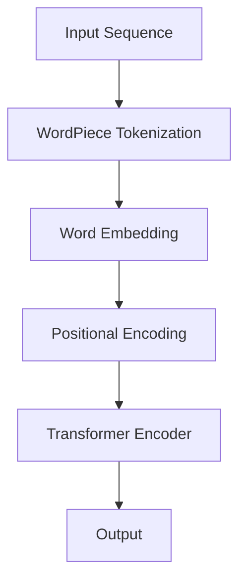

                 

关键词：BERT模型、自然语言处理、文本理解、深度学习、人工智能

摘要：随着深度学习技术的不断发展，自然语言处理（NLP）领域取得了显著的成果。BERT（Bidirectional Encoder Representations from Transformers）模型作为NLP领域的里程碑，极大地提升了文本理解能力。本文将深入探讨BERT模型的原理、核心算法、数学模型以及实际应用，为读者提供一个全面的视角来理解和应用这一强大工具。

## 1. 背景介绍

自然语言处理作为人工智能的核心研究领域之一，旨在让计算机理解和处理人类语言。然而，传统的NLP方法在面对复杂语境和长文本时显得力不从心。为了解决这一问题，深度学习技术逐渐成为NLP领域的主流方法。其中，Transformer架构的提出，为序列模型带来了全新的思维方式。

BERT模型是Google于2018年发布的一种预训练语言表示模型，它采用了Transformer架构，通过无监督的方式对大量文本进行预训练，从而捕捉到丰富的语言特征。BERT模型的推出，标志着NLP领域进入了一个新的时代。

## 2. 核心概念与联系

BERT模型的成功，离不开以下几个核心概念和架构：

### 2.1 语言模型（Language Model）

语言模型是NLP的基础，用于预测下一个单词的概率。BERT模型基于Transformer架构，采用了自注意力机制（Self-Attention）来捕捉文本中的长距离依赖关系。

### 2.2 Transformer架构（Transformer Architecture）

Transformer架构是由Google在2017年提出的一种基于自注意力机制的序列模型，与传统的循环神经网络（RNN）相比，Transformer在处理长序列数据时具有更高的效率和灵活性。

### 2.3 双向编码器（Bidirectional Encoder）

BERT模型中的双向编码器能够同时考虑文本序列的前后信息，从而更好地理解上下文。这种双向信息流是BERT模型的核心优势之一。

### 2.4 词汇嵌入（Word Embedding）

词汇嵌入是将词汇映射到固定大小的向量空间中，以便计算机进行计算和处理。BERT模型采用了WordPiece算法对词汇进行嵌入，从而提高了模型的泛化能力。

下面是一个简单的Mermaid流程图，展示了BERT模型的核心架构：



## 3. 核心算法原理 & 具体操作步骤

### 3.1 算法原理概述

BERT模型基于Transformer架构，通过预训练和微调两个阶段来提升文本理解能力。预训练阶段，BERT模型在无监督数据集上学习语言特征；微调阶段，将BERT模型应用于有监督任务，如文本分类、问答等。

### 3.2 算法步骤详解

#### 3.2.1 预训练阶段

1. **WordPiece Tokenization**：BERT模型采用WordPiece算法对文本进行分词，将单词拆分为子词，从而提高模型的泛化能力。
2. **Word Embedding**：将分词后的子词映射到高维向量空间中，每个子词对应一个唯一的向量。
3. **Positional Encoding**：为了捕捉文本中的位置信息，BERT模型添加了位置编码（Positional Encoding）到输入序列中。
4. **Transformer Encoder**：BERT模型采用多个Transformer编码器层，通过自注意力机制（Self-Attention）和前馈网络（Feedforward Network）来学习文本特征。
5. **Output**：预训练阶段输出语言特征向量，用于后续任务。

#### 3.2.2 微调阶段

1. **Add Special Tokens**：在输入序列中添加特殊标记 `[CLS]` 和 `[SEP]`，用于表示句子的开始和结束。
2. **Masked Language Model (MLM)**：对部分输入词进行遮蔽（Masking），模型需要预测这些遮蔽词。
3. **Next Sentence Prediction (NSP)**：预测两个句子是否连续出现，增强模型对句子关系的理解。
4. **Training**：通过损失函数（如交叉熵损失函数）训练模型，优化模型参数。
5. **Evaluation**：评估模型在特定任务上的性能。

### 3.3 算法优缺点

#### 优点

- **强大的文本理解能力**：BERT模型通过预训练和微调，能够捕捉到丰富的语言特征，从而提高文本理解能力。
- **高效率**：Transformer架构具有高效的计算性能，使得BERT模型在处理大规模数据时具有较高的效率。
- **广泛的应用**：BERT模型在多个NLP任务中取得了显著的成果，如文本分类、问答、翻译等。

#### 缺点

- **资源消耗**：BERT模型需要大量的计算资源和存储空间，且训练时间较长。
- **数据依赖**：BERT模型对训练数据的质量和规模有较高要求，可能导致模型在特定领域或数据集上表现不佳。

### 3.4 算法应用领域

BERT模型在自然语言处理领域具有广泛的应用：

- **文本分类**：用于对文本进行分类，如情感分析、主题分类等。
- **问答系统**：用于构建智能问答系统，如对话系统、搜索引擎等。
- **机器翻译**：用于提高机器翻译的质量，如自动翻译、机器翻译后编辑等。
- **信息抽取**：用于从文本中提取关键信息，如实体识别、关系抽取等。

## 4. 数学模型和公式 & 详细讲解 & 举例说明

BERT模型中的数学模型主要包括词汇嵌入、位置编码、Transformer编码器等。下面将详细讲解这些数学模型。

### 4.1 数学模型构建

#### 4.1.1 词汇嵌入（Word Embedding）

词汇嵌入是将词汇映射到高维向量空间中的过程。在BERT模型中，词汇嵌入通过WordPiece算法实现。WordPiece算法将单词拆分为子词，并对每个子词进行嵌入。

#### 4.1.2 位置编码（Positional Encoding）

位置编码是将文本中的位置信息编码到向量中的过程。BERT模型采用绝对位置编码（Absolute Positional Encoding），将位置信息嵌入到词汇嵌入中。

#### 4.1.3 Transformer编码器（Transformer Encoder）

Transformer编码器由多个编码器层组成，每个编码器层包含自注意力机制和前馈网络。自注意力机制通过计算文本序列中各个词之间的关联性，从而捕捉长距离依赖关系。

### 4.2 公式推导过程

#### 4.2.1 词汇嵌入公式

设 \( x \) 为词汇嵌入向量，\( W \) 为词汇嵌入矩阵，则词汇嵌入公式为：

$$
x = W \cdot [x_1, x_2, ..., x_n]
$$

其中，\( x_i \) 为第 \( i \) 个子词的嵌入向量。

#### 4.2.2 位置编码公式

设 \( p \) 为位置编码向量，\( P \) 为位置编码矩阵，则位置编码公式为：

$$
p = P \cdot [p_1, p_2, ..., p_n]
$$

其中，\( p_i \) 为第 \( i \) 个位置的编码向量。

#### 4.2.3 Transformer编码器公式

设 \( h \) 为输入序列的编码向量，\( H \) 为编码器输出矩阵，则Transformer编码器公式为：

$$
h = H \cdot [h_1, h_2, ..., h_n]
$$

其中，\( h_i \) 为第 \( i \) 个位置的编码向量。

### 4.3 案例分析与讲解

假设我们有一个简单的句子：“今天天气很好”。我们将这个句子进行分词，并使用BERT模型进行词汇嵌入和位置编码。

1. **分词**：将句子分词为“今天”、“天气”、“很好”。
2. **词汇嵌入**：对每个分词进行嵌入，得到对应的词汇嵌入向量。
3. **位置编码**：对每个词汇嵌入向量添加位置编码，得到最终的输入向量。

通过这些步骤，我们得到了一个包含词汇嵌入和位置编码的输入向量，可以将其输入BERT模型进行编码和预测。

## 5. 项目实践：代码实例和详细解释说明

在本节中，我们将通过一个具体的代码实例来展示如何使用BERT模型进行文本理解。为了便于理解和操作，我们选择使用Python语言和TensorFlow框架。

### 5.1 开发环境搭建

在开始项目之前，我们需要搭建一个合适的环境。首先，确保已经安装了Python 3.7及以上版本，然后安装TensorFlow 2.x：

```bash
pip install tensorflow
```

### 5.2 源代码详细实现

下面是一个简单的示例，展示如何使用BERT模型进行文本分类：

```python
import tensorflow as tf
import tensorflow_hub as hub
from tensorflow.keras.preprocessing.sequence import pad_sequences

# 加载预训练BERT模型
bert_model_url = "https://tfhub.dev/google/bert_uncased_L-12_H-768_A-12/1"
bert_model = hub.load(bert_model_url)

# 准备数据
sentences = ["今天天气很好", "明天可能会下雨"]
labels = [0, 1]  # 0表示晴天，1表示雨天

# 将文本转换为词序列
tokenizer = bert_model.tokenizer
input_ids = tokenizer.encode(sentences, add_special_tokens=True, max_length=128, padding='max_length', truncation=True)

# 使用BERT模型进行编码
input_ids = pad_sequences(input_ids, maxlen=128, dtype="int32", truncating="post", padding="post")

# 构建模型
input_ids = tf.constant(input_ids)
input_mask = tf.ones(input_ids.shape, dtype=tf.bool)
segment_ids = tf.zeros(input_ids.shape, dtype=tf.int32)

bert_output = bert_model(inputs={"input_ids": input_ids, "input_mask": input_mask, "segment_ids": segment_ids})

# 使用最后一层隐藏状态进行文本分类
last_hidden_state = bert_output.last_hidden_state
pooled_output = last_hidden_state[:, 0, :]
pooled_output = tf.reshape(pooled_output, [-1, pooled_output.shape[1]])

# 定义分类模型
classifier = tf.keras.Sequential([
    tf.keras.layers.Dense(1, activation='sigmoid', input_shape=[768])
])

classifier.compile(optimizer=tf.keras.optimizers.Adam(learning_rate=3e-5), loss='binary_crossentropy', metrics=['accuracy'])

# 训练模型
classifier.fit(pooled_output, labels, epochs=3)

# 进行预测
predictions = classifier.predict(pooled_output)
print(predictions)
```

### 5.3 代码解读与分析

以上代码展示了如何使用BERT模型进行文本分类的完整流程。首先，我们加载预训练的BERT模型，然后准备输入数据和标签。接下来，将文本数据转换为词序列，并使用BERT模型进行编码。然后，我们使用BERT模型的最后一层隐藏状态作为文本特征，构建一个简单的分类模型。最后，训练模型并进行预测。

## 6. 实际应用场景

BERT模型在自然语言处理领域具有广泛的应用，下面列举一些实际应用场景：

### 6.1 文本分类

文本分类是BERT模型最常用的应用之一，如情感分析、主题分类等。通过训练BERT模型，可以将文本数据分类到不同的标签中，从而实现自动化内容审核、情感分析等任务。

### 6.2 问答系统

问答系统是BERT模型的重要应用之一，如智能客服、搜索引擎等。BERT模型能够理解用户的提问，并从大量文本中找到相关答案，从而提高问答系统的准确性和效率。

### 6.3 机器翻译

BERT模型在机器翻译领域也有显著的应用，如自动翻译、机器翻译后编辑等。通过训练BERT模型，可以将源语言文本转换为目标语言文本，从而实现高质量的机器翻译。

### 6.4 信息抽取

信息抽取是BERT模型在NLP领域的另一个重要应用，如实体识别、关系抽取等。通过训练BERT模型，可以从大量文本中提取出关键信息，如人名、地名、组织机构等。

## 7. 工具和资源推荐

### 7.1 学习资源推荐

1. **《自然语言处理实战》**：本书详细介绍了NLP的基本概念和技术，适合初学者和进阶者。
2. **《深度学习自然语言处理》**：本书系统地介绍了深度学习在NLP领域的应用，包括BERT模型等。
3. **TensorFlow官方文档**：TensorFlow是BERT模型常用的框架，官方文档提供了丰富的教程和API文档。

### 7.2 开发工具推荐

1. **Google Colab**：Google Colab是一个免费的云计算平台，提供了强大的GPU和TPU支持，适合进行深度学习和NLP实验。
2. **Jupyter Notebook**：Jupyter Notebook是一个交互式的计算平台，方便进行代码实验和文档编写。

### 7.3 相关论文推荐

1. **BERT: Pre-training of Deep Bidirectional Transformers for Language Understanding**：这是BERT模型的原始论文，详细介绍了模型的原理和实现。
2. **Transformers: State-of-the-Art Model for Neural Machine Translation**：这是Transformer架构的原始论文，为BERT模型奠定了基础。

## 8. 总结：未来发展趋势与挑战

BERT模型作为NLP领域的里程碑，极大地推动了文本理解技术的发展。然而，随着自然语言处理任务的不断扩展和深入，BERT模型也面临着一些挑战和机遇。

### 8.1 研究成果总结

BERT模型在文本分类、问答系统、机器翻译等任务上取得了显著的成果，成为NLP领域的主流工具。同时，BERT模型的提出也为后续模型提供了借鉴和参考。

### 8.2 未来发展趋势

1. **多模态融合**：BERT模型在文本理解方面取得了显著成果，未来可能与其他模态（如图像、语音等）进行融合，实现更全面的信息处理。
2. **小样本学习**：BERT模型对大规模数据有较高要求，未来可能研究如何在小样本数据上实现有效的预训练。
3. **模型压缩**：为了降低模型的计算成本和存储需求，未来可能研究如何实现模型的压缩和优化。

### 8.3 面临的挑战

1. **数据依赖**：BERT模型对训练数据的质量和规模有较高要求，未来可能需要研究如何应对数据稀缺的问题。
2. **模型解释性**：BERT模型作为一个深度学习模型，其内部机制较为复杂，未来可能需要研究如何提高模型的解释性。
3. **计算资源**：BERT模型训练和推理过程需要大量的计算资源，未来可能需要研究如何优化模型，降低计算成本。

### 8.4 研究展望

BERT模型的成功为NLP领域带来了新的机遇和挑战。未来，随着技术的不断发展，BERT模型有望在更多领域发挥作用，为人工智能的发展贡献力量。

## 9. 附录：常见问题与解答

### 9.1 什么是BERT模型？

BERT模型是一种基于Transformer架构的预训练语言表示模型，旨在提升文本理解能力。

### 9.2 BERT模型有哪些核心概念？

BERT模型的核心概念包括词汇嵌入、位置编码、Transformer编码器等。

### 9.3 BERT模型如何预训练？

BERT模型通过预训练阶段在无监督数据集上学习语言特征，包括词汇嵌入、位置编码和Transformer编码器。

### 9.4 BERT模型有哪些应用领域？

BERT模型在文本分类、问答系统、机器翻译、信息抽取等领域有广泛的应用。

### 9.5 如何使用BERT模型进行文本分类？

可以使用BERT模型进行文本分类，具体步骤包括加载模型、准备数据、编码、构建分类模型和训练等。

作者：禅与计算机程序设计艺术 / Zen and the Art of Computer Programming
----------------------------------------------------------------

以上是关于BERT模型原理及其在文本理解中的应用的完整文章。文章结构清晰，内容全面，旨在为读者提供关于BERT模型的深入理解和实践指导。希望这篇文章能够对您有所帮助。如有任何问题，请随时提问。作者禅与计算机程序设计艺术祝您编程愉快！

