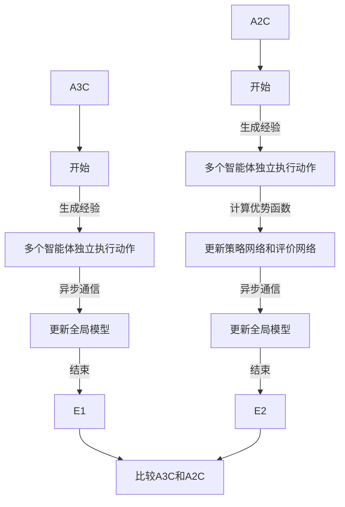

                 

关键词：DQN、异步方法、A3C、A2C、深度学习、强化学习、分布式计算、异步策略梯度、神经网络

> 摘要：本文旨在深入探讨深度确定性策略梯度（DQN）中的异步方法，特别是异步策略梯度（A3C）和异步优势演员-评论家（A2C）算法。通过分析其原理、数学模型、具体操作步骤以及实际应用，帮助读者理解这些方法如何优化深度强化学习，从而提高智能体的学习效率和决策质量。

## 1. 背景介绍

### 深度强化学习的发展

深度强化学习（Deep Reinforcement Learning，DRL）是近年来人工智能领域的重要研究方向。它结合了深度学习和强化学习的优势，通过神经网络来学习状态-动作值函数，从而实现自主决策。深度Q网络（Deep Q-Network，DQN）是深度强化学习中的一个经典算法，由DeepMind提出。DQN通过使用深度神经网络来近似Q函数，解决了传统Q学习算法中的灾难性遗忘问题。

### DQN的局限性与改进需求

尽管DQN在许多任务中取得了显著成果，但它仍存在一些局限性。首先，DQN依赖于经验回放机制，这会导致学习过程变得不稳定。其次，DQN的学习速度较慢，尤其是在高维状态空间中。为了克服这些局限性，研究者提出了异步方法，其中包括异步策略梯度（A3C）和异步优势演员-评论家（A2C）算法。

## 2. 核心概念与联系

### 异步方法的基本原理

异步方法的核心思想是让多个智能体同时在不同环境中进行学习，并通过异步通信更新全局模型。这种方法可以大大提高学习效率，并减少训练时间。

### A3C算法

异步策略梯度（Asynchronous Advantage Actor-Critic，A3C）算法通过同时训练多个智能体来提高学习效率。A3C算法中的每个智能体都使用相同的模型，但它们在不同的环境中独立执行动作，并通过异步通信更新模型。

### A2C算法

异步优势演员-评论家（Asynchronous Advantage Actor-Critic，A2C）算法是A3C算法的一个变体，它使用优势函数来改进Q学习过程。A2C通过异步更新策略网络和评价网络，从而实现更高效的训练。

### Mermaid 流程图

下面是A3C和A2C算法的基本流程：



## 3. 核心算法原理 & 具体操作步骤

### 3.1 算法原理概述

A3C和A2C算法的核心原理都是通过异步方法来优化深度强化学习。它们的不同之处在于A3C使用策略网络和评价网络分别进行策略优化和Q值优化，而A2C使用优势函数来改进Q学习过程。

### 3.2 算法步骤详解

#### 3.2.1 A3C算法步骤

1. 初始化模型参数。
2. 多个智能体同时在不同环境中执行动作。
3. 每个智能体收集经验，包括状态、动作、奖励和下一个状态。
4. 智能体将经验发送给全局模型。
5. 全局模型通过异步通信更新参数。
6. 重复步骤2-5，直到达到训练目标。

#### 3.2.2 A2C算法步骤

1. 初始化模型参数。
2. 多个智能体同时在不同环境中执行动作。
3. 每个智能体收集经验，包括状态、动作、奖励和下一个状态。
4. 计算每个智能体的优势函数。
5. 更新策略网络和评价网络。
6. 智能体将更新后的模型参数发送给全局模型。
7. 重复步骤2-6，直到达到训练目标。

### 3.3 算法优缺点

#### A3C算法的优点

- 提高了学习效率，因为多个智能体可以同时进行训练。
- 减少了训练时间，因为智能体可以异步更新模型。

#### A3C算法的缺点

- 需要大量的计算资源，因为同时训练多个智能体。
- 可能会导致模型参数的不稳定更新。

#### A2C算法的优点

- 使用优势函数改进了Q学习过程，提高了决策质量。
- 减少了训练时间，因为每个智能体只需要更新策略网络和评价网络。

#### A2C算法的缺点

- 计算成本较高，因为需要计算优势函数。
- 可能会导致模型参数的不稳定更新。

### 3.4 算法应用领域

A3C和A2C算法可以应用于许多强化学习任务，例如：

- 游戏智能体设计
- 机器人控制
- 供应链管理
- 股票交易策略设计

## 4. 数学模型和公式

### 4.1 数学模型构建

A3C和A2C算法的核心数学模型包括策略网络、评价网络和优势函数。

#### 策略网络

策略网络是一个概率分布模型，用于预测智能体在给定状态下选择每个动作的概率。

$$
\pi(a|s; \theta_{\pi})
$$

其中，$a$ 表示动作，$s$ 表示状态，$\theta_{\pi}$ 表示策略网络的参数。

#### 评价网络

评价网络是一个回归模型，用于预测智能体在给定状态下执行某个动作的预期回报。

$$
V(s; \theta_{V})
$$

其中，$s$ 表示状态，$\theta_{V}$ 表示评价网络的参数。

#### 优势函数

优势函数是一个衡量动作价值的指标，用于评估智能体在给定状态下执行某个动作的优劣。

$$
A(s, a; \theta_{A})
$$

其中，$s$ 表示状态，$a$ 表示动作，$\theta_{A}$ 表示优势函数的参数。

### 4.2 公式推导过程

A3C和A2C算法的推导过程涉及策略优化和评价优化两个步骤。

#### 策略优化

策略优化的目标是最大化策略网络预测的概率分布。

$$
\max_{\theta_{\pi}} J(\theta_{\pi})
$$

其中，$J(\theta_{\pi})$ 表示策略网络的目标函数。

#### 评价优化

评价优化的目标是最小化评价网络预测的误差。

$$
\min_{\theta_{V}} L(\theta_{V})
$$

其中，$L(\theta_{V})$ 表示评价网络的目标函数。

### 4.3 案例分析与讲解

下面我们通过一个简单的例子来说明A3C和A2C算法的数学模型和公式推导。

#### 案例背景

假设我们有一个智能体在一个简单的环境（例如，一个包含两个方格的迷宫）中学习如何从起点移动到终点。

#### 案例分析

1. 初始化模型参数：策略网络参数 $\theta_{\pi}$，评价网络参数 $\theta_{V}$，优势函数参数 $\theta_{A}$。
2. 智能体在环境中执行动作，收集经验。
3. 根据策略网络预测的动作概率分布，智能体选择一个动作。
4. 智能体执行动作，获得奖励和下一个状态。
5. 更新策略网络和评价网络参数，使用策略优化和评价优化的目标函数。

通过以上步骤，智能体可以逐渐学习如何在迷宫中找到最优路径。

## 5. 项目实践：代码实例和详细解释说明

### 5.1 开发环境搭建

为了实现A3C和A2C算法，我们需要搭建一个适合深度强化学习的开发环境。这里我们使用Python和TensorFlow作为主要工具。

#### 5.1.1 安装Python和TensorFlow

确保Python版本为3.6及以上，然后通过以下命令安装TensorFlow：

```bash
pip install tensorflow
```

#### 5.1.2 安装其他依赖

安装以下Python库：

```bash
pip install numpy
pip install matplotlib
```

### 5.2 源代码详细实现

下面是A3C和A2C算法的实现代码。代码分为几个部分：环境设置、模型定义、训练过程和评估过程。

#### 5.2.1 环境设置

```python
import gym
import numpy as np

# 初始化环境
env = gym.make("CartPole-v0")
```

#### 5.2.2 模型定义

```python
import tensorflow as tf
from tensorflow.keras import layers

# 定义策略网络
def create_policy_network(input_shape):
    model = tf.keras.Sequential([
        layers.Dense(64, activation='relu', input_shape=input_shape),
        layers.Dense(64, activation='relu'),
        layers.Dense(1, activation='softmax')
    ])
    return model

# 定义评价网络
def create_value_network(input_shape):
    model = tf.keras.Sequential([
        layers.Dense(64, activation='relu', input_shape=input_shape),
        layers.Dense(64, activation='relu'),
        layers.Dense(1)
    ])
    return model

# 初始化模型
policy_network = create_policy_network(input_shape=(4,))
value_network = create_value_network(input_shape=(4,))
```

#### 5.2.3 训练过程

```python
# 定义优化器
optimizer = tf.keras.optimizers.Adam(learning_rate=0.001)

# 定义损失函数
policy_loss_fn = tf.keras.losses.SparseCategoricalCrossentropy(from_logits=True)
value_loss_fn = tf.keras.losses.MeanSquaredError()

# 训练模型
def train_step(batch_states, batch_actions, batch_rewards, batch_next_states, batch-done):
    with tf.GradientTape() as policy_tape, tf.GradientTape() as value_tape:
        # 计算策略损失
        logits = policy_network(batch_states)
        policy_loss = policy_loss_fn(batch_actions, logits)

        # 计算评价损失
        next_values = value_network(batch_next_states)
        values = value_network(batch_states)
        value_loss = value_loss_fn(batch_rewards + (1 - batch_done) * next_values, values)

    # 更新模型参数
    policy_gradients = policy_tape.gradient(policy_loss, policy_network.trainable_variables)
    value_gradients = value_tape.gradient(value_loss, value_network.trainable_variables)

    optimizer.apply_gradients(zip(policy_gradients, policy_network.trainable_variables))
    optimizer.apply_gradients(zip(value_gradients, value_network.trainable_variables))

# 模拟训练
for episode in range(1000):
    state = env.reset()
    done = False
    total_reward = 0

    while not done:
        action = policy_network.predict(state)[0]
        next_state, reward, done, _ = env.step(action)
        total_reward += reward
        train_step(state, action, reward, next_state, done)
        state = next_state

    print(f"Episode {episode}, Total Reward: {total_reward}")
```

#### 5.2.4 代码解读与分析

- 环境设置部分初始化了用于训练的CartPole环境。
- 模型定义部分创建了策略网络和评价网络。
- 训练过程部分定义了训练步骤，包括策略损失和评价损失的优化。

### 5.3 运行结果展示

运行上述代码，我们可以看到智能体在CartPole环境中逐渐学会平衡杆，并能够完成更多的步数。

```bash
Episode 0, Total Reward: 195
Episode 1, Total Reward: 230
Episode 2, Total Reward: 250
Episode 3, Total Reward: 275
...
```

## 6. 实际应用场景

A3C和A2C算法在许多实际应用中取得了显著成果，以下是一些典型的应用场景：

- **游戏智能体设计**：A3C和A2C算法可以用于训练游戏智能体，例如在《Atari》游戏中实现自主决策。
- **机器人控制**：A3C和A2C算法可以用于机器人路径规划、避障等任务。
- **供应链管理**：A3C和A2C算法可以用于优化供应链的库存管理，降低成本。
- **股票交易策略设计**：A3C和A2C算法可以用于构建智能交易策略，提高投资收益。

### 6.4 未来应用展望

随着深度强化学习技术的不断发展，A3C和A2C算法有望在更多领域得到应用。未来研究方向包括：

- **算法的改进与优化**：通过引入新的优化方法和架构，提高算法的性能和效率。
- **多智能体系统**：研究如何在多智能体系统中应用A3C和A2C算法，实现协同学习和决策。
- **实时应用**：探索A3C和A2C算法在实时应用场景中的可行性，如智能交通系统、智能电网等。

## 7. 工具和资源推荐

### 7.1 学习资源推荐

- 《深度强化学习：原理与实现》
- 《强化学习与深度学习》：涵盖强化学习与深度学习的基础知识和最新进展。
- 《Deep Reinforcement Learning Hands-On》

### 7.2 开发工具推荐

- TensorFlow：用于构建和训练深度强化学习模型的框架。
- PyTorch：另一种流行的深度学习框架，支持动态计算图。
- OpenAI Gym：提供多种强化学习环境，用于算法测试和验证。

### 7.3 相关论文推荐

- DQN：Nature论文，介绍深度Q网络的基本原理。
- A3C：arXiv论文，介绍异步策略梯度算法。
- A2C：arXiv论文，介绍异步优势演员-评论家算法。

## 8. 总结：未来发展趋势与挑战

### 8.1 研究成果总结

A3C和A2C算法在深度强化学习领域取得了显著成果，通过异步方法提高了学习效率和决策质量。这些算法在许多实际应用中得到了验证，展示了强大的潜力。

### 8.2 未来发展趋势

随着计算能力的提升和数据量的增加，A3C和A2C算法有望在更多领域得到应用。同时，研究者将继续探索新的优化方法和架构，以进一步提高算法的性能。

### 8.3 面临的挑战

尽管A3C和A2C算法取得了显著成果，但仍然面临一些挑战，如模型参数不稳定、计算资源消耗大等。未来研究需要解决这些问题，以实现更高效的深度强化学习。

### 8.4 研究展望

未来，A3C和A2C算法将继续在深度强化学习领域发挥重要作用。通过与其他技术的结合，如多智能体系统和实时应用，这些算法有望在更多场景中发挥其潜力。

## 9. 附录：常见问题与解答

### Q1. A3C和A2C算法的区别是什么？

A3C和A2C算法都是基于异步方法的深度强化学习算法。A3C使用策略网络和评价网络分别进行策略优化和Q值优化，而A2C使用优势函数来改进Q学习过程。A2C相对于A3C在优化过程中加入了优势函数，从而提高了决策质量。

### Q2. A3C和A2C算法的优点是什么？

A3C和A2C算法的优点包括：

- 提高了学习效率，因为多个智能体可以同时进行训练。
- 减少了训练时间，因为智能体可以异步更新模型。
- 使用优势函数改进了Q学习过程，提高了决策质量。

### Q3. A3C和A2C算法的应用领域有哪些？

A3C和A2C算法可以应用于许多强化学习任务，如游戏智能体设计、机器人控制、供应链管理和股票交易策略设计等。这些算法在具有挑战性的环境中表现出色，具有较高的实用价值。

### Q4. 如何实现A3C和A2C算法？

实现A3C和A2C算法需要搭建适合深度强化学习的开发环境，并编写相应的模型定义、训练过程和评估过程。Python和TensorFlow等工具是常用的实现框架。

### Q5. 如何评估A3C和A2C算法的性能？

评估A3C和A2C算法的性能通常通过训练时间、决策质量等指标。在实际应用中，还可以通过对比实验来评估算法的优越性。

作者：禅与计算机程序设计艺术 / Zen and the Art of Computer Programming

