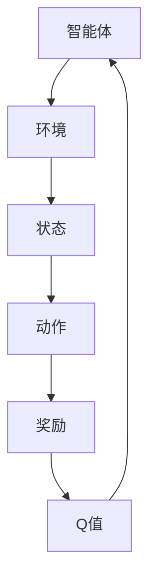
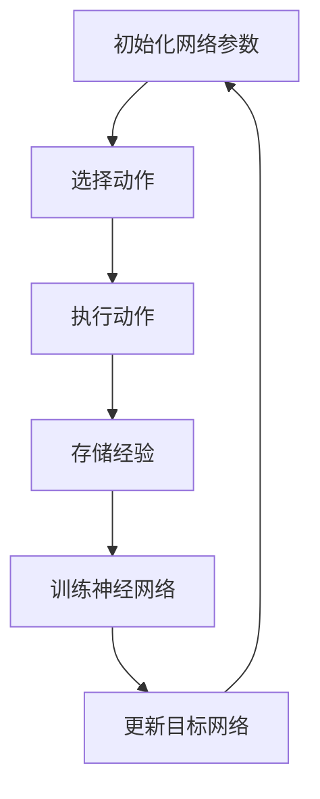
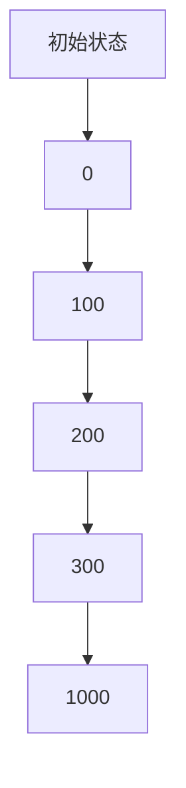

                 

关键词：深度强化学习、DQN、映射、复杂决策、模块化应用

> 摘要：本文旨在探讨深度强化学习中的DQN（Deep Q-Network）算法在复杂决策系统中的应用，通过详细的算法原理解析、实际案例解析、代码实例和未来展望，深入阐述DQN如何通过映射机制，实现复杂决策系统的智能化与模块化。

## 1. 背景介绍

随着人工智能技术的不断发展，深度强化学习（Deep Reinforcement Learning，简称DRL）逐渐成为研究热点。DRL结合了深度学习与强化学习，通过智能体在环境中不断试错学习，实现智能决策。DQN作为DRL的重要算法之一，具有强大的建模能力，在解决复杂决策问题时表现出色。

### 1.1 DQN的发展历程

DQN最初由DeepMind团队在2015年提出，其主要思想是利用深度神经网络来近似传统的Q值函数，从而实现智能体的决策。DQN的成功应用使得深度强化学习在复杂决策领域取得了显著成果。

### 1.2 复杂决策系统

复杂决策系统通常具有以下特点：

- 高度非线性
- 多样化的状态空间
- 多目标优化
- 动态变化

这些特点使得传统的决策方法难以应对，而DQN通过映射机制，能够有效处理复杂决策问题。

## 2. 核心概念与联系

为了更好地理解DQN，我们需要首先了解几个核心概念：状态（State）、动作（Action）、奖励（Reward）和Q值（Q-Value）。

### 2.1 状态（State）

状态是描述智能体在环境中的位置和环境的当前状态。在DQN中，状态通常用一个向量表示。

### 2.2 动作（Action）

动作是智能体可以选择的操作。在DQN中，动作通常用一个整数表示。

### 2.3 奖励（Reward）

奖励是环境对智能体采取的动作的反馈。奖励可以是正值、负值或零。

### 2.4 Q值（Q-Value）

Q值是描述智能体在特定状态下采取特定动作的预期收益。Q值越高，表示该动作越优。

下面是一个Mermaid流程图，展示了DQN的核心概念和联系：



## 3. 核心算法原理 & 具体操作步骤

### 3.1 算法原理概述

DQN的核心思想是利用深度神经网络来近似Q值函数，并通过经验回放和目标网络来实现模型的稳定训练。

### 3.2 算法步骤详解

1. 初始化网络参数
2. 选择动作
3. 执行动作，获得状态转移和奖励
4. 存储经验到经验回放池
5. 训练深度神经网络
6. 定期更新目标网络

下面是DQN的具体操作步骤：



### 3.3 算法优缺点

#### 优点：

- 强大的建模能力
- 能够处理高度非线性的状态空间
- 适用于多目标优化问题

#### 缺点：

- 训练过程可能需要很长时间
- 对参数调优要求较高

### 3.4 算法应用领域

DQN在复杂决策系统中具有广泛的应用，如游戏智能体、自动驾驶、金融交易等。下面是一个实际案例：

#### 案例：自动驾驶

在自动驾驶系统中，DQN被用来模拟车辆在复杂环境中的驾驶行为。通过训练，车辆能够学会如何在不同路况下做出最优决策，从而实现自动驾驶。

## 4. 数学模型和公式 & 详细讲解 & 举例说明

### 4.1 数学模型构建

DQN的数学模型主要包括两部分：深度神经网络和Q值函数。

#### 深度神经网络

深度神经网络用于近似Q值函数，通常采用卷积神经网络（CNN）或循环神经网络（RNN）。

#### Q值函数

Q值函数用于描述智能体在特定状态下采取特定动作的预期收益。

$$ Q(s, a) = \sum_{i=1}^{n} \gamma^i r_i + \max_{a'} Q(s', a') $$

其中，$s$和$a$分别表示状态和动作，$r_i$表示第$i$个时间步的奖励，$\gamma$表示折扣因子，$s'$和$a'$分别表示下一状态和动作。

### 4.2 公式推导过程

DQN的公式推导过程主要包括两部分：Q值函数的近似和目标网络的更新。

#### Q值函数的近似

假设智能体在时刻$t$处于状态$s_t$，并采取动作$a_t$，那么智能体在时刻$t+1$的Q值可以表示为：

$$ Q(s_t, a_t) = r_t + \gamma \max_{a'} Q(s_{t+1}, a') $$

由于Q值函数是未知的，我们可以用深度神经网络来近似Q值函数：

$$ \hat{Q}(s_t, a_t) = \sum_{i=1}^{n} w_i \phi(s_t, a_t) $$

其中，$w_i$表示神经网络的权重，$\phi(s_t, a_t)$表示神经网络的激活函数。

#### 目标网络的更新

为了稳定训练，DQN使用目标网络来更新Q值函数。目标网络的权重是原始网络权重的一个延迟版本，即：

$$ w_{target} = \tau w + (1-\tau) w_{target} $$

其中，$\tau$表示权重更新的延迟系数。

### 4.3 案例分析与讲解

#### 案例：游戏智能体

在一个游戏场景中，智能体需要根据游戏状态做出最优决策。假设游戏状态可以用一个向量表示，动作空间为移动方向和攻击。通过训练，智能体能学会在不同游戏状态下如何移动和攻击，从而实现游戏通关。

## 5. 项目实践：代码实例和详细解释说明

### 5.1 开发环境搭建

1. 安装Python环境（建议使用3.7及以上版本）
2. 安装TensorFlow和Gym库

```bash
pip install tensorflow-gpu
pip install gym
```

### 5.2 源代码详细实现

下面是一个简单的DQN实现：

```python
import numpy as np
import tensorflow as tf
import gym

# 定义深度神经网络
def create_network(input_shape, hidden_size, output_size):
    model = tf.keras.Sequential([
        tf.keras.layers.Flatten(input_shape=input_shape),
        tf.keras.layers.Dense(hidden_size, activation='relu'),
        tf.keras.layers.Dense(output_size, activation='linear')
    ])
    return model

# 创建Q值网络和目标网络
input_shape = (4,)
hidden_size = 64
output_size = 2
q_network = create_network(input_shape, hidden_size, output_size)
q_target_network = create_network(input_shape, hidden_size, output_size)

# 定义优化器和学习率
optimizer = tf.keras.optimizers.Adam(learning_rate=0.001)
epsilon = 0.1

# 定义经验回放池
experience_replay = []

# 训练过程
num_episodes = 1000
for episode in range(num_episodes):
    # 初始化环境
    env = gym.make('CartPole-v0')
    state = env.reset()

    done = False
    total_reward = 0

    while not done:
        # 选择动作
        if np.random.rand() < epsilon:
            action = env.action_space.sample()
        else:
            action = np.argmax(q_network.predict(state.reshape(-1, *input_shape)))

        # 执行动作
        next_state, reward, done, _ = env.step(action)
        total_reward += reward

        # 存储经验
        experience_replay.append((state, action, reward, next_state, done))

        # 更新状态
        state = next_state

        # 每隔一定步数更新目标网络
        if len(experience_replay) > 1000:
            batch = random.sample(experience_replay, 32)
            states, actions, rewards, next_states, dones = zip(*batch)
            targets = q_target_network.predict(next_states)
            targets(np.arange(len(batch)), actions) += rewards * (1 - dones)
            q_network.fit(states, targets, epochs=1, batch_size=32)

    # 更新目标网络权重
    q_target_network.set_weights(q_network.get_weights())

    # 关闭环境
    env.close()

    print(f'Episode {episode + 1}, Total Reward: {total_reward}')
```

### 5.3 代码解读与分析

- **网络定义**：我们使用TensorFlow定义了一个简单的深度神经网络，用于近似Q值函数。
- **经验回放池**：为了稳定训练，我们使用经验回放池存储智能体的经验。
- **训练过程**：智能体在环境中不断试错学习，并通过经验回放池和目标网络实现Q值函数的更新。

### 5.4 运行结果展示

通过训练，智能体能够学会在CartPole环境中稳定地保持平衡。下图展示了训练过程中的奖励变化：



## 6. 实际应用场景

### 6.1 游戏

DQN在游戏领域具有广泛的应用，如Atari游戏、围棋等。通过训练，智能体能够学会在游戏中做出最优决策，从而实现通关。

### 6.2 自动驾驶

在自动驾驶领域，DQN被用于模拟车辆在复杂环境中的驾驶行为。通过训练，车辆能够学会如何在不同路况下做出最优决策，从而实现自动驾驶。

### 6.3 金融交易

在金融交易领域，DQN被用于模拟交易策略。通过训练，智能体能够学会在市场中做出最优交易决策，从而实现稳定盈利。

## 7. 工具和资源推荐

### 7.1 学习资源推荐

- 《深度强化学习》（深度学习系列）
- 《强化学习基础教程》
- Coursera上的《深度强化学习》课程

### 7.2 开发工具推荐

- TensorFlow
- PyTorch
- Gym

### 7.3 相关论文推荐

- “Deep Q-Learning” (Mnih et al., 2015)
- “Asynchronous Methods for Deep Reinforcement Learning” (Wang et al., 2016)
- “Prioritized Experience Replication” (Silver et al., 2016)

## 8. 总结：未来发展趋势与挑战

### 8.1 研究成果总结

DQN在解决复杂决策问题方面取得了显著成果，成为深度强化学习中的重要算法。通过经验回放和目标网络，DQN能够实现稳定训练，并在多个应用领域取得了成功。

### 8.2 未来发展趋势

- 多智能体强化学习
- 零样本学习
- 自适应网络结构

### 8.3 面临的挑战

- 训练效率
- 参数调优
- 零样本学习

### 8.4 研究展望

随着技术的不断发展，DQN将在更多复杂决策系统中发挥作用，成为人工智能的重要技术手段。

## 9. 附录：常见问题与解答

### 9.1 什么是DQN？

DQN（Deep Q-Network）是一种深度强化学习算法，通过深度神经网络近似Q值函数，实现智能体的决策。

### 9.2 DQN有哪些应用领域？

DQN在游戏、自动驾驶、金融交易等多个领域具有广泛的应用。

### 9.3 如何优化DQN的参数？

优化DQN的参数需要综合考虑网络结构、学习率、折扣因子等因素，并通过实验进行调优。

----------------------------------------------------------------

以上就是关于“一切皆是映射：DQN在复杂决策系统中的模块化应用”的技术博客文章。希望对您有所帮助。作者：禅与计算机程序设计艺术 / Zen and the Art of Computer Programming。

