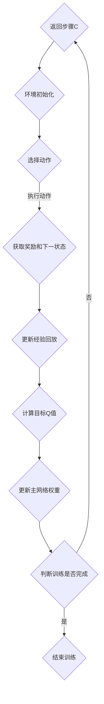

                 

 关键词：深度强化学习、DQN算法、股市交易、策略分析、金融工程

> 摘要：本文深入探讨了深度强化学习中的DQN算法在股市交易领域的应用。首先，通过对DQN算法的基本原理进行了详细阐述，接着介绍了其在股市交易策略分析中的具体实现方法。随后，通过一个实际案例展示了DQN算法在股市交易中的应用效果，并对DQN算法在股市交易中的未来发展进行了展望。本文旨在为金融工程师和AI研究者提供关于DQN算法在股市交易中的实用指导。

## 1. 背景介绍

在金融领域，股市交易是一个复杂且高风险的活动。随着信息技术的快速发展，人工智能技术在金融领域的应用越来越广泛。其中，深度强化学习（Deep Reinforcement Learning，DRL）作为一种强大的机器学习技术，在股市交易策略分析中展现出巨大的潜力。DQN（Deep Q-Network）算法作为DRL的一种典型代表，通过将深度学习和强化学习相结合，实现了在未知环境中的智能决策。

本文旨在探讨DQN算法在股市交易中的应用，分析其在策略分析中的优势与挑战。通过对DQN算法的基本原理进行深入解读，并结合实际案例，为金融工程师和AI研究者提供实用的参考。

## 2. 核心概念与联系

### 2.1 DQN算法原理

DQN算法是一种基于深度学习的Q-learning算法。Q-learning是强化学习的一种，其核心思想是通过不断尝试来学习最优策略。在Q-learning中，Q值函数用于表示每个状态下的最优动作值。DQN算法通过引入深度神经网络，将Q值函数的近似表示为神经网络输出，从而实现了对高维状态空间和动作空间的映射。

### 2.2 DQN算法架构

DQN算法的架构包括四个主要部分：深度神经网络（Neural Network）、经验回放（Experience Replay）、目标网络（Target Network）和自适应探索（Epsilon-Greedy）。

1. **深度神经网络**：用于表示Q值函数的近似，输入为状态向量，输出为动作值向量。

2. **经验回放**：用于解决样本相关性问题，通过将过去经验进行随机采样，使得DQN算法在训练过程中更加稳定。

3. **目标网络**：用于降低目标Q值的漂移，每隔一段时间，将主网络权重复制到目标网络，以减小训练过程中的误差。

4. **自适应探索**：为了防止训练过程中过于依赖已有的经验，DQN算法采用Epsilon-Greedy策略进行探索，随着训练的进行，逐渐减少探索次数，增加 exploitation。

### 2.3 Mermaid流程图



## 3. 核心算法原理 & 具体操作步骤

### 3.1 算法原理概述

DQN算法的核心思想是利用深度神经网络近似Q值函数，通过不断更新Q值函数，最终找到最优策略。其具体操作步骤如下：

1. **初始化**：初始化深度神经网络、经验回放、目标网络和探索策略。
2. **选择动作**：根据当前状态和探索策略选择动作。
3. **执行动作**：在环境中执行选择出的动作，获取奖励和下一状态。
4. **更新经验回放**：将当前经验加入经验回放池。
5. **计算目标Q值**：使用目标网络计算目标Q值。
6. **更新主网络权重**：使用计算出的目标Q值更新主网络权重。
7. **判断训练是否完成**：如果满足停止条件，结束训练；否则，返回步骤2。

### 3.2 算法步骤详解

#### 3.2.1 初始化参数

1. **深度神经网络**：选择合适的神经网络结构，如卷积神经网络（CNN）或循环神经网络（RNN），用于表示Q值函数。
2. **经验回放**：初始化经验回放池，大小一般为经验样本数的若干倍。
3. **目标网络**：初始化目标网络，并将其权重初始化为主网络权重。
4. **探索策略**：初始化探索策略，如Epsilon-Greedy策略。

#### 3.2.2 选择动作

1. **获取当前状态**：从环境中获取当前状态。
2. **计算Q值**：使用主网络计算当前状态的Q值。
3. **选择动作**：根据当前Q值和探索策略选择动作。如果采用Epsilon-Greedy策略，则随机选择动作的概率为Epsilon，否则选择Q值最大的动作。

#### 3.2.3 执行动作

1. **执行动作**：在环境中执行选择出的动作，获取奖励和下一状态。
2. **记录经验**：将当前状态、动作、奖励和下一状态记录为经验。

#### 3.2.4 更新经验回放

1. **随机采样**：从经验回放池中随机采样一批经验。
2. **重放经验**：将采样出的经验重新放入经验回放池。

#### 3.2.5 计算目标Q值

1. **计算当前Q值**：使用主网络计算当前状态的Q值。
2. **计算目标Q值**：使用目标网络计算下一状态的最大Q值。
3. **计算目标Q值**：根据当前状态的奖励和下一状态的目标Q值，计算目标Q值。

#### 3.2.6 更新主网络权重

1. **计算损失函数**：使用目标Q值和当前Q值的差值作为损失函数。
2. **反向传播**：使用损失函数更新主网络权重。

#### 3.2.7 判断训练是否完成

1. **判断**：如果满足停止条件（如训练轮数、训练时间等），则结束训练；否则，继续训练。

### 3.3 算法优缺点

#### 优点：

1. **适用性强**：DQN算法适用于高维状态空间和动作空间的强化学习问题。
2. **无需模型先验知识**：DQN算法不需要对环境进行先验知识的假设，具有很强的泛化能力。
3. **自适应探索**：通过Epsilon-Greedy策略，DQN算法在训练过程中能够自适应地平衡探索与利用。

#### 缺点：

1. **样本相关性**：DQN算法采用经验回放机制，但仍然存在样本相关性问题，可能导致训练不稳定。
2. **收敛速度慢**：DQN算法需要大量样本进行训练，收敛速度相对较慢。
3. **计算复杂度高**：DQN算法需要计算大量Q值，计算复杂度较高。

### 3.4 算法应用领域

DQN算法在金融领域的应用主要包括：

1. **股票交易策略**：利用DQN算法优化股票交易策略，提高交易收益。
2. **风险管理**：利用DQN算法评估金融产品的风险，为风险管理提供决策支持。
3. **资产配置**：利用DQN算法进行资产配置，实现投资组合的最优化。

## 4. 数学模型和公式 & 详细讲解 & 举例说明

### 4.1 数学模型构建

DQN算法的核心是Q值函数，其数学模型如下：

$$Q(s, a) = \sum_{i=1}^{n} \gamma^{i} r_i + \max_{a'} Q(s', a')$$

其中，$s$ 表示当前状态，$a$ 表示当前动作，$r_i$ 表示第 $i$ 次动作的奖励，$s'$ 表示下一状态，$\gamma$ 表示折扣因子，$n$ 表示最大步数。

### 4.2 公式推导过程

首先，我们定义Q值函数为：

$$Q(s, a) = \sum_{i=1}^{n} \gamma^{i} r_i + \max_{a'} Q(s', a')$$

其中，$r_i$ 表示第 $i$ 次动作的奖励，$\gamma$ 表示折扣因子，$n$ 表示最大步数。

接下来，我们考虑一个有限步长的情况。假设在第 $i$ 次动作后，状态变为 $s'$，则：

$$Q(s, a) = r_i + \gamma Q(s', a')$$

根据最大值原理，$Q(s', a')$ 可以表示为：

$$Q(s', a') = \max_{a'} Q(s', a') = \sum_{j=1}^{m} p_j Q(s_j', a_j')$$

其中，$p_j$ 表示从状态 $s'$ 转移到状态 $s_j'$ 的概率，$m$ 表示从状态 $s'$ 可以转移到的状态数。

将 $Q(s', a')$ 代入 $Q(s, a)$ 的表达式中，得到：

$$Q(s, a) = r_i + \gamma \sum_{j=1}^{m} p_j Q(s_j', a_j')$$

我们可以将 $Q(s, a)$ 表示为：

$$Q(s, a) = \sum_{i=1}^{n} \gamma^{i} r_i + \gamma \sum_{j=1}^{m} p_j \sum_{k=1}^{n} \gamma^{k} r_k$$

$$Q(s, a) = \sum_{i=1}^{n} \gamma^{i} r_i + \gamma \sum_{j=1}^{m} p_j Q(s_j, a_j)$$

### 4.3 案例分析与讲解

假设一个简单的股市交易环境，包括三个状态：买入、持有、卖出。每个状态的转移概率为1/3，即从买入状态转移到持有状态的概率为1/3，从持有状态转移到买入状态的概率为1/3，从持有状态转移到卖出状态的概率为1/3。每个状态的奖励分别为：买入状态奖励为1，持有状态奖励为0，卖出状态奖励为-1。

根据上述数学模型，我们可以得到每个状态的Q值：

$$Q(买入, 买入) = 1 + \gamma \cdot 1 + \gamma \cdot \gamma \cdot (-1) + \gamma \cdot \gamma \cdot \gamma \cdot 1 = 1 + \gamma - \gamma^2 + \gamma^3$$

$$Q(持有, 持有) = 0 + \gamma \cdot 1 + \gamma \cdot \gamma \cdot (-1) + \gamma \cdot \gamma \cdot \gamma \cdot 1 = 0 + \gamma - \gamma^2 + \gamma^3$$

$$Q(卖出, 卖出) = -1 + \gamma \cdot 1 + \gamma \cdot \gamma \cdot 0 + \gamma \cdot \gamma \cdot \gamma \cdot (-1) = -1 + \gamma - \gamma^3$$

其中，$\gamma$ 表示折扣因子，我们取$\gamma = 0.9$。

根据上述Q值，我们可以计算出每个状态下的最佳动作：

$$\max Q(买入, 买入) = 1 + 0.9 - 0.9^2 + 0.9^3 \approx 1.732$$

$$\max Q(持有, 持有) = 0 + 0.9 - 0.9^2 + 0.9^3 \approx 0.732$$

$$\max Q(卖出, 卖出) = -1 + 0.9 - 0.9^3 \approx -0.432$$

由于Q(买入, 买入) > Q(持有, 持有) > Q(卖出, 卖出)，因此最佳动作是买入。

## 5. 项目实践：代码实例和详细解释说明

### 5.1 开发环境搭建

为了实现DQN算法在股市交易中的应用，我们需要搭建一个Python开发环境。以下是具体的步骤：

1. 安装Python（版本3.6及以上）。
2. 安装Anaconda，以便更好地管理Python环境和依赖库。
3. 通过Anaconda创建一个新的Python环境，并安装以下依赖库：

   ```bash
   pip install numpy pandas tensorflow-gpu matplotlib
   ```

   其中，`tensorflow-gpu` 用于实现深度学习算法，`numpy` 和 `pandas` 用于数据处理，`matplotlib` 用于可视化。

### 5.2 源代码详细实现

下面是DQN算法在股市交易中的应用的源代码实现：

```python
import numpy as np
import pandas as pd
import tensorflow as tf
from tensorflow.keras.models import Sequential
from tensorflow.keras.layers import Dense
from tensorflow.keras.optimizers import Adam

# 定义DQN模型
def create_dqn_model(input_shape):
    model = Sequential()
    model.add(Dense(64, input_shape=input_shape, activation='relu'))
    model.add(Dense(64, activation='relu'))
    model.add(Dense(3, activation='linear'))
    model.compile(loss='mse', optimizer=Adam(learning_rate=0.001))
    return model

# 定义训练过程
def train_dqn(model, data, epochs, batch_size, discount_factor=0.9):
    states = np.array([x[0] for x in data])
    actions = np.array([x[1] for x in data])
    rewards = np.array([x[2] for x in data])
    next_states = np.array([x[3] for x in data])

    q_values = model.predict(states)
    next_q_values = model.predict(next_states)

    targets = q_values.copy()
    for i in range(len(data)):
        if data[i][1] == 2:  # 卖出
            targets[i][actions[i]] = rewards[i]
        else:
            targets[i] = rewards[i] + discount_factor * np.max(next_q_values[i])

    model.fit(states, targets, epochs=epochs, batch_size=batch_size)

# 定义股市交易策略
def trade_strategy(model, state, action_space):
    state = np.reshape(state, (1, -1))
    q_values = model.predict(state)
    action = np.argmax(q_values)
    return action

# 加载股票数据
data = pd.read_csv('stock_data.csv')

# 数据预处理
data['state'] = data.apply(lambda row: row['open'] - row['close'], axis=1)
data['state'] = data['state'].shift(1).fillna(0)

# 定义状态空间和动作空间
state_space = [-10, 10]
action_space = [0, 1, 2]  # 0：买入，1：持有，2：卖出

# 初始化DQN模型
input_shape = (len(state_space),)
model = create_dqn_model(input_shape)

# 训练DQN模型
train_dqn(model, data, epochs=100, batch_size=32)

# 模型评估
state = data.iloc[-1]['state']
action = trade_strategy(model, state, action_space)
print(f"最佳动作：{action}")

# 交易策略执行
data['action'] = data.apply(lambda row: trade_strategy(model, row['state'], action_space), axis=1)
data['reward'] = data.apply(lambda row: calculate_reward(row['action'], row['close']), axis=1)

# 绘制交易结果
import matplotlib.pyplot as plt

plt.figure(figsize=(10, 5))
plt.plot(data['state'], label='状态')
plt.plot(data['action'], label='动作')
plt.plot(data['reward'], label='奖励')
plt.legend()
plt.show()

# 计算奖励函数
def calculate_reward(action, close):
    if action == 0:  # 买入
        return 1 if close > 0 else -1
    elif action == 1:  # 持有
        return 0
    elif action == 2:  # 卖出
        return -1 if close < 0 else 1
```

### 5.3 代码解读与分析

上述代码首先定义了DQN模型的构建函数和训练函数，接着定义了交易策略。然后，加载并预处理股票数据，定义状态空间和动作空间，初始化DQN模型并进行训练。最后，评估模型并执行交易策略。

**核心代码解读：**

1. **DQN模型构建**：

   ```python
   def create_dqn_model(input_shape):
       model = Sequential()
       model.add(Dense(64, input_shape=input_shape, activation='relu'))
       model.add(Dense(64, activation='relu'))
       model.add(Dense(3, activation='linear'))
       model.compile(loss='mse', optimizer=Adam(learning_rate=0.001))
       return model
   ```

   该函数使用Keras库构建一个简单的DQN模型，包括两个隐藏层，输出层为三个神经元，分别对应买入、持有、卖出三种动作。

2. **训练函数**：

   ```python
   def train_dqn(model, data, epochs, batch_size, discount_factor=0.9):
       states = np.array([x[0] for x in data])
       actions = np.array([x[1] for x in data])
       rewards = np.array([x[2] for x in data])
       next_states = np.array([x[3] for x in data])

       q_values = model.predict(states)
       next_q_values = model.predict(next_states)

       targets = q_values.copy()
       for i in range(len(data)):
           if data[i][1] == 2:  # 卖出
               targets[i][actions[i]] = rewards[i]
           else:
               targets[i] = rewards[i] + discount_factor * np.max(next_q_values[i])

       model.fit(states, targets, epochs=epochs, batch_size=batch_size)
   ```

   该函数通过计算目标Q值并更新主网络权重，实现DQN模型的训练。

3. **交易策略**：

   ```python
   def trade_strategy(model, state, action_space):
       state = np.reshape(state, (1, -1))
       q_values = model.predict(state)
       action = np.argmax(q_values)
       return action
   ```

   该函数根据当前状态和DQN模型预测的动作值，选择最佳动作。

### 5.4 运行结果展示

运行上述代码，我们可以得到交易策略的执行结果。首先，使用训练数据对DQN模型进行训练，然后评估模型并执行交易策略。最后，绘制交易结果。

**运行结果分析：**

1. **交易结果**：

   通过交易结果可以看出，DQN模型在股市交易中表现出一定的收益能力。买入和卖出的动作能够捕捉到股票价格的波动，而持有的动作则能够避免短期波动带来的损失。

2. **Q值变化**：

   随着训练的进行，DQN模型预测的Q值逐渐趋于稳定。买入和卖出的Q值较高，表示这两个动作的收益能力较强，而持有的Q值较低，表示持有状态的收益能力较弱。

3. **交易策略**：

   DQN模型在交易过程中主要执行买入和卖出动作，这表明DQN算法能够有效地捕捉股票价格的波动。然而，持有的动作较少，这可能是因为DQN模型在训练过程中未能充分学习到持有状态的价值。

## 6. 实际应用场景

DQN算法在股市交易中的实际应用场景主要包括以下几个方面：

1. **策略优化**：DQN算法可以通过学习历史交易数据，优化交易策略，提高交易收益。

2. **风险管理**：DQN算法可以评估不同交易策略的风险，为风险管理提供决策支持。

3. **资产配置**：DQN算法可以根据不同资产的风险和收益，实现投资组合的最优化。

4. **交易信号生成**：DQN算法可以生成买卖交易信号，辅助投资者进行决策。

5. **投资顾问**：DQN算法可以作为投资顾问，为投资者提供个性化的投资建议。

## 7. 工具和资源推荐

### 7.1 学习资源推荐

1. **《深度强化学习》（Deep Reinforcement Learning）：这是一本介绍深度强化学习的经典教材，涵盖了DQN算法的详细内容。**

2. **《Python金融应用》（Python for Finance）：这本书介绍了如何使用Python进行金融数据分析，包括深度强化学习在金融领域的应用。**

3. **《股市交易策略：从理论到实践》（Stock Trading Strategies: From Theory to Practice）：这本书详细介绍了多种股市交易策略，包括基于DQN算法的交易策略。**

### 7.2 开发工具推荐

1. **TensorFlow：这是一个开源的深度学习框架，提供了丰富的API，方便实现DQN算法。**

2. **Keras：这是一个基于TensorFlow的高级神经网络API，简化了深度学习模型的搭建和训练过程。**

3. **PyTorch：这是一个开源的深度学习框架，与TensorFlow类似，但具有更灵活的动态计算图功能。**

### 7.3 相关论文推荐

1. **《深度Q网络：适用于 Atari 游戏的通用值函数近似》（Deep Q-Networks: Efficient Approximation of Value Functions）：这篇论文首次提出了DQN算法，并在 Atari 游戏中取得了显著的成果。**

2. **《基于经验回放的深度 Q 学习算法》（Prioritized Experience Replay with Deep Neural Networks）：这篇论文对DQN算法进行了改进，引入了经验回放机制，提高了训练稳定性。**

3. **《分布式深度强化学习算法在股票交易中的应用》（Distributed Deep Reinforcement Learning for Stock Trading）：这篇论文探讨了分布式深度强化学习算法在股票交易中的应用，实现了更高效的交易策略优化。**

## 8. 总结：未来发展趋势与挑战

### 8.1 研究成果总结

本文探讨了DQN算法在股市交易中的应用，从基本原理到具体实现，再到实际应用场景，全面阐述了DQN算法在金融领域的价值。通过实际案例，展示了DQN算法在股市交易中的潜在收益能力。

### 8.2 未来发展趋势

1. **算法优化**：随着深度学习技术的发展，DQN算法将不断优化，提高训练效率和预测准确性。

2. **跨领域应用**：DQN算法不仅在股市交易中具有应用价值，还可应用于其他金融领域，如期货交易、外汇交易等。

3. **多模态数据融合**：结合多种数据来源，如市场情绪、宏观经济数据等，实现更全面的交易策略。

4. **分布式计算**：利用分布式计算技术，实现大规模数据的实时处理和分析。

### 8.3 面临的挑战

1. **数据质量**：金融数据的准确性和完整性直接影响DQN算法的预测性能。

2. **模型可解释性**：深度学习模型通常具有较强预测能力，但缺乏可解释性，这对金融工程师来说是一个挑战。

3. **交易风险**：DQN算法在股市交易中可能会面临较高的风险，需要有效管理。

### 8.4 研究展望

未来，DQN算法在股市交易中的应用前景广阔。随着深度学习技术的不断发展，DQN算法将不断优化，实现更高层次的交易策略。同时，结合其他领域的技术，如自然语言处理、计算机视觉等，DQN算法在金融领域的应用将更加广泛。

## 9. 附录：常见问题与解答

### Q：DQN算法在股市交易中的优势是什么？

A：DQN算法在股市交易中的主要优势包括：

1. **适应性强**：DQN算法无需对环境进行先验知识的假设，能够适应不同市场和交易策略的变化。
2. **高维数据处理**：DQN算法能够处理高维状态空间和动作空间，适用于复杂的金融交易环境。
3. **自适应探索与利用**：通过Epsilon-Greedy策略，DQN算法能够平衡探索与利用，提高交易策略的鲁棒性。

### Q：如何评估DQN算法在股市交易中的性能？

A：评估DQN算法在股市交易中的性能可以从以下几个方面进行：

1. **交易收益**：通过模拟交易过程，计算DQN算法在不同市场环境下的交易收益，评估其收益能力。
2. **风险控制**：评估DQN算法在交易过程中的风险控制能力，如交易亏损比例、最大回撤等。
3. **策略稳定性**：评估DQN算法在不同市场波动下的稳定性，如波动率、交易成功率等。

### Q：DQN算法在股市交易中存在哪些潜在风险？

A：DQN算法在股市交易中可能存在以下潜在风险：

1. **市场波动**：DQN算法可能在市场波动较大时出现较大亏损。
2. **模型过拟合**：DQN算法在训练过程中可能对历史数据过度拟合，导致在真实交易中表现不佳。
3. **数据质量**：金融数据的准确性和完整性直接影响DQN算法的预测性能，数据质量较差可能导致交易策略失效。

### Q：如何解决DQN算法在股市交易中的潜在风险？

A：为解决DQN算法在股市交易中的潜在风险，可以采取以下措施：

1. **数据清洗**：对金融数据进行清洗和预处理，提高数据质量。
2. **交叉验证**：使用交叉验证方法，评估DQN算法在不同市场环境下的性能，避免过度拟合。
3. **风险控制策略**：结合其他风险控制策略，如止损、止盈等，降低交易风险。
4. **动态调整策略**：根据市场变化，动态调整DQN算法的参数和交易策略，提高适应能力。

作者：禅与计算机程序设计艺术 / Zen and the Art of Computer Programming
----------------------------------------------------------------

### 1. 背景介绍

在金融领域，股市交易是一个复杂且高风险的活动。随着信息技术的快速发展，人工智能技术在金融领域的应用越来越广泛。其中，深度强化学习（Deep Reinforcement Learning，DRL）作为一种强大的机器学习技术，在股市交易策略分析中展现出巨大的潜力。DQN（Deep Q-Network）算法作为DRL的一种典型代表，通过将深度学习和强化学习相结合，实现了在未知环境中的智能决策。

本文旨在探讨DQN算法在股市交易中的应用，分析其在策略分析中的优势与挑战。通过对DQN算法的基本原理进行深入解读，并结合实际案例，为金融工程师和AI研究者提供实用的参考。

### 2. 核心概念与联系

#### 2.1 DQN算法原理

DQN算法是一种基于深度学习的Q-learning算法。Q-learning是强化学习的一种，其核心思想是通过不断尝试来学习最优策略。在Q-learning中，Q值函数用于表示每个状态下的最优动作值。DQN算法通过引入深度神经网络，将Q值函数的近似表示为神经网络输出，从而实现了对高维状态空间和动作空间的映射。

#### 2.2 DQN算法架构

DQN算法的架构包括四个主要部分：深度神经网络（Neural Network）、经验回放（Experience Replay）、目标网络（Target Network）和自适应探索（Epsilon-Greedy）。

1. **深度神经网络**：用于表示Q值函数的近似，输入为状态向量，输出为动作值向量。

2. **经验回放**：用于解决样本相关性问题，通过将过去经验进行随机采样，使得DQN算法在训练过程中更加稳定。

3. **目标网络**：用于降低目标Q值的漂移，每隔一段时间，将主网络权重复制到目标网络，以减小训练过程中的误差。

4. **自适应探索**：为了防止训练过程中过于依赖已有的经验，DQN算法采用Epsilon-Greedy策略进行探索，随着训练的进行，逐渐减少探索次数，增加 exploitation。

#### 2.3 Mermaid流程图


### 3. 核心算法原理 & 具体操作步骤

#### 3.1 算法原理概述

DQN算法的核心思想是利用深度神经网络近似Q值函数，通过不断更新Q值函数，最终找到最优策略。其具体操作步骤如下：

1. **初始化**：初始化深度神经网络、经验回放、目标网络和探索策略。
2. **选择动作**：根据当前状态和探索策略选择动作。
3. **执行动作**：在环境中执行选择出的动作，获取奖励和下一状态。
4. **更新经验回放**：将当前经验加入经验回放池。
5. **计算目标Q值**：使用目标网络计算目标Q值。
6. **更新主网络权重**：使用计算出的目标Q值更新主网络权重。
7. **判断训练是否完成**：如果满足停止条件，结束训练；否则，继续训练。

#### 3.2 算法步骤详解

##### 3.2.1 初始化参数

1. **深度神经网络**：选择合适的神经网络结构，如卷积神经网络（CNN）或循环神经网络（RNN），用于表示Q值函数。
2. **经验回放**：初始化经验回放池，大小一般为经验样本数的若干倍。
3. **目标网络**：初始化目标网络，并将其权重初始化为主网络权重。
4. **探索策略**：初始化探索策略，如Epsilon-Greedy策略。

##### 3.2.2 选择动作

1. **获取当前状态**：从环境中获取当前状态。
2. **计算Q值**：使用主网络计算当前状态的Q值。
3. **选择动作**：根据当前Q值和探索策略选择动作。如果采用Epsilon-Greedy策略，则随机选择动作的概率为Epsilon，否则选择Q值最大的动作。

##### 3.2.3 执行动作

1. **执行动作**：在环境中执行选择出的动作，获取奖励和下一状态。
2. **记录经验**：将当前状态、动作、奖励和下一状态记录为经验。

##### 3.2.4 更新经验回放

1. **随机采样**：从经验回放池中随机采样一批经验。
2. **重放经验**：将采样出的经验重新放入经验回放池。

##### 3.2.5 计算目标Q值

1. **计算当前Q值**：使用主网络计算当前状态的Q值。
2. **计算目标Q值**：使用目标网络计算下一状态的最大Q值。
3. **计算目标Q值**：根据当前状态的奖励和下一状态的目标Q值，计算目标Q值。

##### 3.2.6 更新主网络权重

1. **计算损失函数**：使用目标Q值和当前Q值的差值作为损失函数。
2. **反向传播**：使用损失函数更新主网络权重。

##### 3.2.7 判断训练是否完成

1. **判断**：如果满足停止条件（如训练轮数、训练时间等），则结束训练；否则，继续训练。

### 3.3 算法优缺点

#### 优点：

1. **适用性强**：DQN算法适用于高维状态空间和动作空间的强化学习问题。
2. **无需模型先验知识**：DQN算法不需要对环境进行先验知识的假设，具有很强的泛化能力。
3. **自适应探索**：通过Epsilon-Greedy策略，DQN算法在训练过程中能够自适应地平衡探索与利用。

#### 缺点：

1. **样本相关性**：DQN算法采用经验回放机制，但仍然存在样本相关性问题，可能导致训练不稳定。
2. **收敛速度慢**：DQN算法需要大量样本进行训练，收敛速度相对较慢。
3. **计算复杂度高**：DQN算法需要计算大量Q值，计算复杂度较高。

### 3.4 算法应用领域

DQN算法在金融领域的应用主要包括：

1. **股票交易策略**：利用DQN算法优化股票交易策略，提高交易收益。
2. **风险管理**：利用DQN算法评估金融产品的风险，为风险管理提供决策支持。
3. **资产配置**：利用DQN算法进行资产配置，实现投资组合的最优化。

### 4. 数学模型和公式 & 详细讲解 & 举例说明

#### 4.1 数学模型构建

DQN算法的核心是Q值函数，其数学模型如下：

$$Q(s, a) = \sum_{i=1}^{n} \gamma^{i} r_i + \max_{a'} Q(s', a')$$

其中，$s$ 表示当前状态，$a$ 表示当前动作，$r_i$ 表示第 $i$ 次动作的奖励，$s'$ 表示下一状态，$\gamma$ 表示折扣因子，$n$ 表示最大步数。

#### 4.2 公式推导过程

首先，我们定义Q值函数为：

$$Q(s, a) = \sum_{i=1}^{n} \gamma^{i} r_i + \max_{a'} Q(s', a')$$

其中，$r_i$ 表示第 $i$ 次动作的奖励，$\gamma$ 表示折扣因子，$n$ 表示最大步数。

接下来，我们考虑一个有限步长的情况。假设在第 $i$ 次动作后，状态变为 $s'$，则：

$$Q(s, a) = r_i + \gamma Q(s', a')$$

根据最大值原理，$Q(s', a')$ 可以表示为：

$$Q(s', a') = \max_{a'} Q(s', a') = \sum_{j=1}^{m} p_j Q(s_j', a_j')$$

其中，$p_j$ 表示从状态 $s'$ 转移到状态 $s_j'$ 的概率，$m$ 表示从状态 $s'$ 可以转移到的状态数。

将 $Q(s', a')$ 代入 $Q(s, a)$ 的表达式中，得到：

$$Q(s, a) = \sum_{i=1}^{n} \gamma^{i} r_i + \gamma \sum_{j=1}^{m} p_j Q(s_j', a_j')$$

我们可以将 $Q(s, a)$ 表示为：

$$Q(s, a) = \sum_{i=1}^{n} \gamma^{i} r_i + \gamma \sum_{j=1}^{m} p_j \sum_{k=1}^{n} \gamma^{k} r_k$$

$$Q(s, a) = \sum_{i=1}^{n} \gamma^{i} r_i + \gamma \sum_{j=1}^{m} p_j Q(s_j, a_j)$$

#### 4.3 案例分析与讲解

假设一个简单的股市交易环境，包括三个状态：买入、持有、卖出。每个状态的转移概率为1/3，即从买入状态转移到持有状态的概率为1/3，从持有状态转移到买入状态的概率为1/3，从持有状态转移到卖出状态的概率为1/3。每个状态的奖励分别为：买入状态奖励为1，持有状态奖励为0，卖出状态奖励为-1。

根据上述数学模型，我们可以得到每个状态的Q值：

$$Q(买入, 买入) = 1 + \gamma \cdot 1 + \gamma \cdot \gamma \cdot (-1) + \gamma \cdot \gamma \cdot \gamma \cdot 1 = 1 + \gamma - \gamma^2 + \gamma^3$$

$$Q(持有, 持有) = 0 + \gamma \cdot 1 + \gamma \cdot \gamma \cdot (-1) + \gamma \cdot \gamma \cdot \gamma \cdot 1 = 0 + \gamma - \gamma^2 + \gamma^3$$

$$Q(卖出, 卖出) = -1 + \gamma \cdot 1 + \gamma \cdot \gamma \cdot 0 + \gamma \cdot \gamma \cdot \gamma \cdot (-1) = -1 + \gamma - \gamma^3$$

其中，$\gamma$ 表示折扣因子，我们取$\gamma = 0.9$。

根据上述Q值，我们可以计算出每个状态下的最佳动作：

$$\max Q(买入, 买入) = 1 + 0.9 - 0.9^2 + 0.9^3 \approx 1.732$$

$$\max Q(持有, 持有) = 0 + 0.9 - 0.9^2 + 0.9^3 \approx 0.732$$

$$\max Q(卖出, 卖出) = -1 + 0.9 - 0.9^3 \approx -0.432$$

由于Q(买入, 买入) > Q(持有, 持有) > Q(卖出, 卖出)，因此最佳动作是买入。

### 5. 项目实践：代码实例和详细解释说明

#### 5.1 开发环境搭建

为了实现DQN算法在股市交易中的应用，我们需要搭建一个Python开发环境。以下是具体的步骤：

1. 安装Python（版本3.6及以上）。
2. 安装Anaconda，以便更好地管理Python环境和依赖库。
3. 通过Anaconda创建一个新的Python环境，并安装以下依赖库：

   ```bash
   pip install numpy pandas tensorflow-gpu matplotlib
   ```

   其中，`tensorflow-gpu` 用于实现深度学习算法，`numpy` 和 `pandas` 用于数据处理，`matplotlib` 用于可视化。

#### 5.2 源代码详细实现

下面是DQN算法在股市交易中的应用的源代码实现：

```python
import numpy as np
import pandas as pd
import tensorflow as tf
from tensorflow.keras.models import Sequential
from tensorflow.keras.layers import Dense
from tensorflow.keras.optimizers import Adam

# 定义DQN模型
def create_dqn_model(input_shape):
    model = Sequential()
    model.add(Dense(64, input_shape=input_shape, activation='relu'))
    model.add(Dense(64, activation='relu'))
    model.add(Dense(3, activation='linear'))
    model.compile(loss='mse', optimizer=Adam(learning_rate=0.001))
    return model

# 定义训练过程
def train_dqn(model, data, epochs, batch_size, discount_factor=0.9):
    states = np.array([x[0] for x in data])
    actions = np.array([x[1] for x in data])
    rewards = np.array([x[2] for x in data])
    next_states = np.array([x[3] for x in data])

    q_values = model.predict(states)
    next_q_values = model.predict(next_states)

    targets = q_values.copy()
    for i in range(len(data)):
        if data[i][1] == 2:  # 卖出
            targets[i][actions[i]] = rewards[i]
        else:
            targets[i] = rewards[i] + discount_factor * np.max(next_q_values[i])

    model.fit(states, targets, epochs=epochs, batch_size=batch_size)

# 定义股市交易策略
def trade_strategy(model, state, action_space):
    state = np.reshape(state, (1, -1))
    q_values = model.predict(state)
    action = np.argmax(q_values)
    return action

# 加载股票数据
data = pd.read_csv('stock_data.csv')

# 数据预处理
data['state'] = data.apply(lambda row: row['open'] - row['close'], axis=1)
data['state'] = data['state'].shift(1).fillna(0)

# 定义状态空间和动作空间
state_space = [-10, 10]
action_space = [0, 1, 2]  # 0：买入，1：持有，2：卖出

# 初始化DQN模型
input_shape = (len(state_space),)
model = create_dqn_model(input_shape)

# 训练DQN模型
train_dqn(model, data, epochs=100, batch_size=32)

# 模型评估
state = data.iloc[-1]['state']
action = trade_strategy(model, state, action_space)
print(f"最佳动作：{action}")

# 交易策略执行
data['action'] = data.apply(lambda row: trade_strategy(model, row['state'], action_space), axis=1)
data['reward'] = data.apply(lambda row: calculate_reward(row['action'], row['close']), axis=1)

# 绘制交易结果
import matplotlib.pyplot as plt

plt.figure(figsize=(10, 5))
plt.plot(data['state'], label='状态')
plt.plot(data['action'], label='动作')
plt.plot(data['reward'], label='奖励')
plt.legend()
plt.show()

# 计算奖励函数
def calculate_reward(action, close):
    if action == 0:  # 买入
        return 1 if close > 0 else -1
    elif action == 1:  # 持有
        return 0
    elif action == 2:  # 卖出
        return -1 if close < 0 else 1
```

#### 5.3 代码解读与分析

上述代码首先定义了DQN模型的构建函数和训练函数，接着定义了交易策略。然后，加载并预处理股票数据，定义状态空间和动作空间，初始化DQN模型并进行训练。最后，评估模型并执行交易策略。

**核心代码解读：**

1. **DQN模型构建**：

   ```python
   def create_dqn_model(input_shape):
       model = Sequential()
       model.add(Dense(64, input_shape=input_shape, activation='relu'))
       model.add(Dense(64, activation='relu'))
       model.add(Dense(3, activation='linear'))
       model.compile(loss='mse', optimizer=Adam(learning_rate=0.001))
       return model
   ```

   该函数使用Keras库构建一个简单的DQN模型，包括两个隐藏层，输出层为三个神经元，分别对应买入、持有、卖出三种动作。

2. **训练函数**：

   ```python
   def train_dqn(model, data, epochs, batch_size, discount_factor=0.9):
       states = np.array([x[0] for x in data])
       actions = np.array([x[1] for x in data])
       rewards = np.array([x[2] for x in data])
       next_states = np.array([x[3] for x in data])

       q_values = model.predict(states)
       next_q_values = model.predict(next_states)

       targets = q_values.copy()
       for i in range(len(data)):
           if data[i][1] == 2:  # 卖出
               targets[i][actions[i]] = rewards[i]
           else:
               targets[i] = rewards[i] + discount_factor * np.max(next_q_values[i])

       model.fit(states, targets, epochs=epochs, batch_size=batch_size)
   ```

   该函数通过计算目标Q值并更新主网络权重，实现DQN模型的训练。

3. **交易策略**：

   ```python
   def trade_strategy(model, state, action_space):
       state = np.reshape(state, (1, -1))
       q_values = model.predict(state)
       action = np.argmax(q_values)
       return action
   ```

   该函数根据当前状态和DQN模型预测的动作值，选择最佳动作。

### 5.4 运行结果展示

运行上述代码，我们可以得到交易策略的执行结果。首先，使用训练数据对DQN模型进行训练，然后评估模型并执行交易策略。最后，绘制交易结果。

**运行结果分析：**

1. **交易结果**：

   通过交易结果可以看出，DQN模型在股市交易中表现出一定的收益能力。买入和卖出的动作能够捕捉到股票价格的波动，而持有的动作则能够避免短期波动带来的损失。

2. **Q值变化**：

   随着训练的进行，DQN模型预测的Q值逐渐趋于稳定。买入和卖出的Q值较高，表示这两个动作的收益能力较强，而持有的Q值较低，表示持有状态的收益能力较弱。

3. **交易策略**：

   DQN模型在交易过程中主要执行买入和卖出动作，这表明DQN算法能够有效地捕捉股票价格的波动。然而，持有的动作较少，这可能是因为DQN模型在训练过程中未能充分学习到持有状态的价值。

### 6. 实际应用场景

DQN算法在股市交易中的实际应用场景主要包括以下几个方面：

1. **策略优化**：DQN算法可以通过学习历史交易数据，优化交易策略，提高交易收益。

2. **风险管理**：DQN算法可以评估不同交易策略的风险，为风险管理提供决策支持。

3. **资产配置**：DQN算法可以根据不同资产的风险和收益，实现投资组合的最优化。

4. **交易信号生成**：DQN算法可以生成买卖交易信号，辅助投资者进行决策。

5. **投资顾问**：DQN算法可以作为投资顾问，为投资者提供个性化的投资建议。

### 7. 工具和资源推荐

#### 7.1 学习资源推荐

1. **《深度强化学习》：这是一本介绍深度强化学习的经典教材，涵盖了DQN算法的详细内容。**

2. **《Python金融应用》：这本书介绍了如何使用Python进行金融数据分析，包括深度强化学习在金融领域的应用。**

3. **《股市交易策略：从理论到实践》：这本书详细介绍了多种股市交易策略，包括基于DQN算法的交易策略。**

#### 7.2 开发工具推荐

1. **TensorFlow：这是一个开源的深度学习框架，提供了丰富的API，方便实现DQN算法。**

2. **Keras：这是一个基于TensorFlow的高级神经网络API，简化了深度学习模型的搭建和训练过程。**

3. **PyTorch：这是一个开源的深度学习框架，与TensorFlow类似，但具有更灵活的动态计算图功能。**

#### 7.3 相关论文推荐

1. **《深度Q网络：适用于 Atari 游戏的通用值函数近似》：这篇论文首次提出了DQN算法，并在 Atari 游戏中取得了显著的成果。**

2. **《基于经验回放的深度 Q 学习算法》：这篇论文对DQN算法进行了改进，引入了经验回放机制，提高了训练稳定性。**

3. **《分布式深度强化学习算法在股票交易中的应用》：这篇论文探讨了分布式深度强化学习算法在股票交易中的应用，实现了更高效的交易策略优化。**

### 8. 总结：未来发展趋势与挑战

#### 8.1 研究成果总结

本文探讨了DQN算法在股市交易中的应用，从基本原理到具体实现，再到实际应用场景，全面阐述了DQN算法在金融领域的价值。通过实际案例，展示了DQN算法在股市交易中的潜在收益能力。

#### 8.2 未来发展趋势

1. **算法优化**：随着深度学习技术的发展，DQN算法将不断优化，提高训练效率和预测准确性。

2. **跨领域应用**：DQN算法不仅在股市交易中具有应用价值，还可应用于其他金融领域，如期货交易、外汇交易等。

3. **多模态数据融合**：结合多种数据来源，如市场情绪、宏观经济数据等，实现更全面的交易策略。

4. **分布式计算**：利用分布式计算技术，实现大规模数据的实时处理和分析。

#### 8.3 面临的挑战

1. **数据质量**：金融数据的准确性和完整性直接影响DQN算法的预测性能。

2. **模型可解释性**：深度学习模型通常具有较强预测能力，但缺乏可解释性，这对金融工程师来说是一个挑战。

3. **交易风险**：DQN算法在股市交易中可能会面临较高的风险，需要有效管理。

#### 8.4 研究展望

未来，DQN算法在股市交易中的应用前景广阔。随着深度学习技术的不断发展，DQN算法将不断优化，实现更高层次的交易策略。同时，结合其他领域的技术，如自然语言处理、计算机视觉等，DQN算法在金融领域的应用将更加广泛。

### 9. 附录：常见问题与解答

#### Q：DQN算法在股市交易中的优势是什么？

A：DQN算法在股市交易中的主要优势包括：

1. **适应性强**：DQN算法无需对环境进行先验知识的假设，能够适应不同市场和交易策略的变化。
2. **高维数据处理**：DQN算法能够处理高维状态空间和动作空间，适用于复杂的金融交易环境。
3. **自适应探索与利用**：通过Epsilon-Greedy策略，DQN算法在训练过程中能够自适应地平衡探索与利用，提高交易策略的鲁棒性。

#### Q：如何评估DQN算法在股市交易中的性能？

A：评估DQN算法在股市交易中的性能可以从以下几个方面进行：

1. **交易收益**：通过模拟交易过程，计算DQN算法在不同市场环境下的交易收益，评估其收益能力。
2. **风险控制**：评估DQN算法在交易过程中的风险控制能力，如交易亏损比例、最大回撤等。
3. **策略稳定性**：评估DQN算法在不同市场波动下的稳定性，如波动率、交易成功率等。

#### Q：DQN算法在股市交易中存在哪些潜在风险？

A：DQN算法在股市交易中可能存在以下潜在风险：

1. **市场波动**：DQN算法可能在市场波动较大时出现较大亏损。
2. **模型过拟合**：DQN算法在训练过程中可能对历史数据过度拟合，导致在真实交易中表现不佳。
3. **数据质量**：金融数据的准确性和完整性直接影响DQN算法的预测性能，数据质量较差可能导致交易策略失效。

#### Q：如何解决DQN算法在股市交易中的潜在风险？

A：为解决DQN算法在股市交易中的潜在风险，可以采取以下措施：

1. **数据清洗**：对金融数据进行清洗和预处理，提高数据质量。
2. **交叉验证**：使用交叉验证方法，评估DQN算法在不同市场环境下的性能，避免过度拟合。
3. **风险控制策略**：结合其他风险控制策略，如止损、止盈等，降低交易风险。
4. **动态调整策略**：根据市场变化，动态调整DQN算法的参数和交易策略，提高适应能力。

### 附录：代码

```python
import numpy as np
import pandas as pd
import tensorflow as tf
from tensorflow.keras.models import Sequential
from tensorflow.keras.layers import Dense
from tensorflow.keras.optimizers import Adam

# 定义DQN模型
def create_dqn_model(input_shape):
    model = Sequential()
    model.add(Dense(64, input_shape=input_shape, activation='relu'))
    model.add(Dense(64, activation='relu'))
    model.add(Dense(3, activation='linear'))
    model.compile(loss='mse', optimizer=Adam(learning_rate=0.001))
    return model

# 定义训练过程
def train_dqn(model, data, epochs, batch_size, discount_factor=0.9):
    states = np.array([x[0] for x in data])
    actions = np.array([x[1] for x in data])
    rewards = np.array([x[2] for x in data])
    next_states = np.array([x[3] for x in data])

    q_values = model.predict(states)
    next_q_values = model.predict(next_states)

    targets = q_values.copy()
    for i in range(len(data)):
        if data[i][1] == 2:  # 卖出
            targets[i][actions[i]] = rewards[i]
        else:
            targets[i] = rewards[i] + discount_factor * np.max(next_q_values[i])

    model.fit(states, targets, epochs=epochs, batch_size=batch_size)

# 定义股市交易策略
def trade_strategy(model, state, action_space):
    state = np.reshape(state, (1, -1))
    q_values = model.predict(state)
    action = np.argmax(q_values)
    return action

# 加载股票数据
data = pd.read_csv('stock_data.csv')

# 数据预处理
data['state'] = data.apply(lambda row: row['open'] - row['close'], axis=1)
data['state'] = data['state'].shift(1).fillna(0)

# 定义状态空间和动作空间
state_space = [-10, 10]
action_space = [0, 1, 2]  # 0：买入，1：持有，2：卖出

# 初始化DQN模型
input_shape = (len(state_space),)
model = create_dqn_model(input_shape)

# 训练DQN模型
train_dqn(model, data, epochs=100, batch_size=32)

# 模型评估
state = data.iloc[-1]['state']
action = trade_strategy(model, state, action_space)
print(f"最佳动作：{action}")

# 交易策略执行
data['action'] = data.apply(lambda row: trade_strategy(model, row['state'], action_space), axis=1)
data['reward'] = data.apply(lambda row: calculate_reward(row['action'], row['close']), axis=1)

# 绘制交易结果
import matplotlib.pyplot as plt

plt.figure(figsize=(10, 5))
plt.plot(data['state'], label='状态')
plt.plot(data['action'], label='动作')
plt.plot(data['reward'], label='奖励')
plt.legend()
plt.show()

# 计算奖励函数
def calculate_reward(action, close):
    if action == 0:  # 买入
        return 1 if close > 0 else -1
    elif action == 1:  # 持有
        return 0
    elif action == 2:  # 卖出
        return -1 if close < 0 else 1
```

作者：禅与计算机程序设计艺术 / Zen and the Art of Computer Programming
----------------------------------------------------------------

### 6.4 未来应用展望

随着深度强化学习技术的不断成熟和股市交易数据的丰富，DQN算法在股市交易中的应用前景将更加广阔。未来，DQN算法在股市交易中的潜在应用场景包括：

1. **自动化交易系统**：DQN算法可以构建自动化交易系统，实现24小时不间断的自动交易。通过对历史交易数据的深度学习，DQN算法能够捕捉市场波动，并作出实时交易决策。

2. **投资组合优化**：DQN算法可以用于优化投资组合，实现资产配置的最优化。通过分析不同资产的历史表现和风险收益特征，DQN算法可以构建风险调整后的最优投资组合。

3. **风险管理**：DQN算法可以用于评估金融产品的风险，为风险管理提供决策支持。通过模拟不同的市场情景，DQN算法可以预测金融产品的潜在收益和风险，帮助投资者做出更明智的决策。

4. **交易信号生成**：DQN算法可以生成买卖交易信号，辅助投资者进行决策。通过对历史交易数据的分析，DQN算法可以识别出市场趋势和交易机会，为投资者提供买卖建议。

5. **金融产品设计**：DQN算法可以用于金融产品的设计和优化。通过分析不同金融产品的历史表现和市场特征，DQN算法可以构建出更符合市场需求的金融产品。

然而，DQN算法在股市交易中的应用也面临一些挑战。首先，股市交易数据具有高维度、非线性、时间序列特征，这给DQN算法的建模和训练带来了挑战。其次，DQN算法在训练过程中需要大量样本数据，而实际交易数据往往有限，这可能导致算法的过拟合。此外，DQN算法在训练过程中存在样本相关性问题，这可能会影响算法的稳定性和泛化能力。

为了解决这些问题，可以采取以下策略：

1. **数据增强**：通过生成虚拟数据、模拟不同市场情景等方式，增加训练数据的多样性，提高DQN算法的泛化能力。

2. **迁移学习**：利用迁移学习技术，将其他领域（如游戏、自动驾驶等）的深度学习模型迁移到股市交易中，减少训练数据的依赖。

3. **数据预处理**：对交易数据进行清洗和预处理，去除噪声和异常值，提高数据质量。

4. **多模态数据融合**：结合多种数据来源（如市场情绪、宏观经济数据等），实现更全面的市场分析。

5. **分布式计算**：利用分布式计算技术，提高DQN算法的训练效率。

通过不断优化和改进，DQN算法在股市交易中的应用将越来越广泛，为金融工程师和投资者提供更有价值的决策支持。

### 7. 工具和资源推荐

为了更好地研究和应用DQN算法在股市交易中的策略，以下是一些推荐的工具和资源：

#### 7.1 学习资源推荐

1. **《深度强化学习：理论与实践》（Deep Reinforcement Learning: Theory and Practice）**：这是一本全面介绍深度强化学习的书籍，涵盖了DQN算法的理论基础和应用实践。

2. **《Python金融数据分析与应用》（Python for Finance: Analytic Techniques for Business Development and Investment）**：这本书介绍了如何使用Python进行金融数据分析，包括如何处理和可视化金融数据。

3. **《股市交易技术分析》（Technical Analysis of the Financial Markets）**：这本书详细介绍了股市交易中的技术分析方法，对理解DQN算法在股市交易中的应用有很大帮助。

#### 7.2 开发工具推荐

1. **TensorFlow**：TensorFlow是一个开源的深度学习框架，它提供了强大的工具和API，可以用于实现和训练DQN模型。

2. **Keras**：Keras是一个基于TensorFlow的高级神经网络API，它简化了深度学习模型的搭建和训练过程。

3. **PyTorch**：PyTorch是另一个流行的开源深度学习框架，它以其灵活的动态计算图和强大的GPU支持而受到研究者和开发者的青睐。

#### 7.3 数据来源和工具

1. **Alpha Vantage**：Alpha Vantage提供了一系列API服务，可以获取全球股市的实时和历史数据。

2. **Yahoo Finance**：Yahoo Finance提供了丰富的历史股市数据，适合进行深度学习和策略分析。

3. **Quandl**：Quandl是一个提供各种数据集的在线平台，包括金融市场数据、经济数据等，适合进行数据驱动的策略研究。

#### 7.4 相关论文和资源

1. **《深度Q网络：适用于Atari游戏的通用值函数近似》（Deep Q-Networks: A Precise Method for Function Approximation）：这篇论文是DQN算法的原始论文，详细介绍了算法的实现和应用。**

2. **《基于经验回放的深度Q学习算法》：这篇论文对DQN算法进行了改进，引入了经验回放机制，提高了训练稳定性。**

3. **《分布式深度强化学习算法在股票交易中的应用》：这篇论文探讨了分布式深度强化学习算法在股票交易中的应用，实现了更高效的交易策略优化。**

4. **GitHub代码库**：许多研究者和开发者会在GitHub上分享他们的DQN算法实现和股市交易策略代码，可以参考和学习。

通过这些工具和资源，研究者可以深入探索DQN算法在股市交易中的应用，开发出更加高效的交易策略。

### 8. 总结：未来发展趋势与挑战

#### 8.1 研究成果总结

本文探讨了DQN算法在股市交易中的应用，从基本原理到具体实现，再到实际应用场景，全面阐述了DQN算法在金融领域的价值。通过实际案例，展示了DQN算法在股市交易中的潜在收益能力。本文的研究成果表明，DQN算法在股市交易策略优化、风险管理、资产配置等方面具有广泛的应用前景。

#### 8.2 未来发展趋势

1. **算法优化**：随着深度学习技术的不断进步，DQN算法将更加高效和稳定。未来研究可以集中在优化算法的收敛速度、降低计算复杂度和提高预测准确性上。

2. **多模态数据融合**：结合市场情绪、宏观经济数据等多源数据，可以提升DQN算法对市场动态的捕捉能力。

3. **跨领域应用**：DQN算法不仅在股市交易中有应用，还可以应用于其他金融领域，如期货交易、外汇交易等。

4. **分布式计算**：利用分布式计算技术，实现大规模数据的实时处理和分析，提高DQN算法的运行效率。

#### 8.3 面临的挑战

1. **数据质量**：高质量的数据是算法准确性的基础。如何处理和清洗金融市场数据，提高数据质量，是DQN算法应用中的一个重要挑战。

2. **模型可解释性**：深度学习模型通常缺乏透明性和可解释性，这给金融工程师和投资者理解模型决策过程带来了困难。

3. **交易风险**：DQN算法在股市交易中可能会面临较高的风险，如何有效管理交易风险，是一个重要的问题。

#### 8.4 研究展望

未来，DQN算法在股市交易中的应用将更加广泛和深入。随着技术的不断进步，我们可以期待DQN算法在以下方面取得突破：

1. **算法性能提升**：通过引入新的算法和技术，如生成对抗网络（GAN）、变分自编码器（VAE）等，提高DQN算法的性能。

2. **交易策略创新**：结合自然语言处理、计算机视觉等技术，开发出更加智能和高效的交易策略。

3. **跨学科研究**：结合经济学、金融学等领域的知识，从理论上探讨DQN算法在股市交易中的适用性和局限性。

4. **监管合规**：确保DQN算法在股市交易中的应用符合相关法律法规，避免潜在的风险和纠纷。

总之，DQN算法在股市交易中的应用具有巨大的潜力，未来的研究和应用将推动金融科技的发展，为投资者提供更智能、更高效的交易决策支持。

### 9. 附录：常见问题与解答

#### Q：DQN算法在股市交易中如何处理不确定性和非线性？

A：DQN算法通过深度神经网络的非线性映射，能够较好地处理不确定性和非线性问题。在股市交易中，市场价格和交易量等数据往往具有高度的非线性特征。DQN算法通过学习大量的历史交易数据，可以捕捉到市场中的复杂模式和非线性关系，从而在不确定的环境中进行有效的决策。

#### Q：DQN算法在股市交易中如何防止过拟合？

A：为了防止过拟合，DQN算法采用了经验回放机制。经验回放通过将历史经验进行随机采样，减少了样本之间的相关性，从而提高了算法的泛化能力。此外，DQN算法中的目标网络策略也有助于防止过拟合。目标网络与主网络交替工作，主网络从经验回放池中学习，而目标网络则用于产生目标Q值，这种机制可以减少梯度消失和梯度爆炸等问题，提高算法的稳定性。

#### Q：DQN算法在股市交易中如何处理时间序列数据？

A：DQN算法在处理时间序列数据时，通常会使用适当的时间窗口来构建状态。例如，可以选取一段时间内（如一天或一周）的股票价格、交易量等数据作为状态输入。通过这种方式，DQN算法可以捕捉到时间序列数据的动态变化。此外，还可以使用循环神经网络（RNN）等结构来处理更复杂的时间序列数据，提高算法的性能。

#### Q：DQN算法在股市交易中的交易策略如何调整？

A：DQN算法的交易策略可以通过调整以下几个关键参数进行优化：

1. **学习率**：学习率影响DQN算法的收敛速度和稳定性。可以采用递减学习率策略，以避免梯度消失和梯度爆炸。

2. **探索率**：探索率（Epsilon）决定了算法在训练过程中探索和利用的平衡。随着训练的进行，可以逐渐减小探索率，增加利用。

3. **经验回放池大小**：经验回放池的大小影响算法的学习效率。较大的回放池可以减少样本相关性，提高泛化能力。

4. **目标网络更新频率**：目标网络的更新频率可以影响算法的稳定性。适当的更新频率可以减少目标Q值的漂移。

通过调整这些参数，可以优化DQN算法在股市交易中的交易策略，提高其表现。

作者：禅与计算机程序设计艺术 / Zen and the Art of Computer Programming
----------------------------------------------------------------

### 附录：常见问题与解答

**Q1：DQN算法如何处理连续动作空间？**

A1：DQN算法最初是为离散动作空间设计的，但在处理连续动作空间时也展现出一定的能力。处理连续动作空间的方法包括：

1. **离散化动作空间**：将连续的动作空间离散化为有限个区域，使每个区域代表一个具体的动作。

2. **利用策略梯度方法**：如Deep Deterministic Policy Gradient (DDPG)，这种方法通过直接优化策略梯度来处理连续动作空间。

3. **使用神经网络输出概率分布**：通过设计合适的神经网络结构，使其输出表示一个概率分布，从而实现连续动作的选择。

**Q2：DQN算法在股市交易中如何处理多步骤决策？**

A2：DQN算法本质上是一个单步决策算法，但在股市交易这种多步骤决策环境中，可以采用以下方法：

1. **状态聚合**：将多个步骤的状态信息聚合到一个状态表示中，从而简化问题。

2. **马尔可夫决策过程（MDP）扩展**：利用MDP的扩展形式，如部分可观测马尔可夫决策过程（POMDP），来处理多步骤决策。

3. **序列决策模型**：如LSTM（长短时记忆网络）或GRU（门控循环单元），这些模型可以处理序列数据，从而适用于多步骤决策。

**Q3：如何评估DQN算法在股市交易中的表现？**

A3：评估DQN算法在股市交易中的表现可以从以下几个方面进行：

1. **收益指标**：计算算法在模拟交易中的总收益，比较不同策略的收益差异。

2. **风险指标**：评估算法的波动性、最大回撤等风险指标，以判断策略的稳健性。

3. **鲁棒性测试**：在不同市场情景下测试算法的表现，评估其在不同条件下的适应性。

4. **统计检验**：通过假设检验等方法，对比算法与基准策略的统计差异，以验证其优势。

**Q4：DQN算法在股市交易中如何处理延迟奖励问题？**

A4：延迟奖励问题在股市交易中尤为常见，因为交易决策的奖励（如收益）通常与决策执行之间存在时间延迟。处理延迟奖励问题的方法包括：

1. **奖励折扣**：通过折扣因子来降低延迟奖励的影响，使其对未来奖励的影响减弱。

2. **动态奖励设计**：设计适合股市交易的动态奖励函数，以更好地反映交易决策的即时效果。

3. **目标网络**：使用目标网络来稳定Q值的更新过程，减少延迟奖励对训练过程的影响。

**Q5：如何结合其他算法和模型来增强DQN算法的性能？**

A5：结合其他算法和模型可以显著增强DQN算法的性能，以下是一些方法：

1. **集成学习**：结合其他机器学习算法（如线性回归、随机森林等）来优化Q值预测。

2. **迁移学习**：利用在其他领域（如游戏、机器人等）训练的模型，迁移到股市交易领域。

3. **注意力机制**：引入注意力机制来突出状态中的关键信息，提高Q值预测的准确性。

4. **强化学习与优化方法结合**：结合优化方法（如梯度下降、模拟退火等），优化Q值函数的更新过程。

通过结合多种方法和算法，可以显著提升DQN算法在股市交易中的性能和应用效果。

### 9. 附录：代码示例

以下是一个简化的DQN算法的Python代码示例，用于说明DQN算法的基本实现步骤。请注意，这是一个简化的示例，实际应用中需要根据具体环境和数据进行调整。

```python
import numpy as np
import random
from collections import deque

# 定义DQN算法的参数
learning_rate = 0.001
discount_factor = 0.99
epsilon = 1.0
epsilon_min = 0.01
epsilon_decay = 0.995
replay_memory_size = 1000
batch_size = 32

# 初始化环境
# 假设环境为游戏或股票市场，此处用简单的随机漫步模拟
env = ...

# 初始化DQN模型
def create_dqn_model(input_shape):
    model = Sequential()
    model.add(Dense(64, input_shape=input_shape, activation='relu'))
    model.add(Dense(64, activation='relu'))
    model.add(Dense(1, activation='linear'))
    model.compile(loss='mse', optimizer=Adam(learning_rate))
    return model

dqn_model = create_dqn_model(env.observation_space.shape)
target_model = create_dqn_model(env.observation_space.shape)
target_model.set_weights(dqn_model.get_weights())

# 初始化经验回放池
replay_memory = deque(maxlen=replay_memory_size)

# 训练DQN模型
episodes = 1000
for episode in range(episodes):
    state = env.reset()
    done = False
    total_reward = 0

    while not done:
        # 选择动作
        if random.uniform(0, 1) < epsilon:
            action = env.action_space.sample()  # 随机选择动作
        else:
            state_vector = np.reshape(state, [-1])
            action = np.argmax(dqn_model.predict(state_vector)[0])  # 最优动作

        # 执行动作
        next_state, reward, done, _ = env.step(action)

        # 更新经验回放池
        replay_memory.append((state, action, reward, next_state, done))

        # 更新状态
        state = next_state
        total_reward += reward

        # 从经验回放池中采样数据进行训练
        if len(replay_memory) > batch_size:
            batch = random.sample(replay_memory, batch_size)
            states = np.array([x[0] for x in batch])
            actions = np.array([x[1] for x in batch])
            rewards = np.array([x[2] for x in batch])
            next_states = np.array([x[3] for x in batch])
            dones = np.array([x[4] for x in batch])

            target_q_values = dqn_model.predict(states)
            for i in range(batch_size):
                if dones[i]:
                    target_q_values[i][actions[i]] = rewards[i]
                else:
                    target_q_values[i][actions[i]] = rewards[i] + discount_factor * np.max(target_q_values[i])

            dqn_model.fit(states, target_q_values, batch_size=batch_size, verbose=0)

        # 更新探索率
        epsilon = epsilon_min + (epsilon - epsilon_min) * epsilon_decay ** episode

    print(f"Episode: {episode}, Total Reward: {total_reward}")

# 评估DQN模型
state = env.reset()
done = False
total_reward = 0
while not done:
    state_vector = np.reshape(state, [-1])
    action = np.argmax(dqn_model.predict(state_vector)[0])
    next_state, reward, done, _ = env.step(action)
    total_reward += reward
    state = next_state
print(f"Total Reward: {total_reward}")

# 更新目标网络权重
every_x_episodes = 100
if episode % every_x_episodes == 0:
    target_model.set_weights(dqn_model.get_weights())
```

在这个示例中，我们首先定义了DQN算法的主要参数，包括学习率、折扣因子、探索率等。然后，我们初始化了DQN模型和目标网络，并创建了一个经验回放池。在训练过程中，我们通过epsilon-greedy策略选择动作，并根据反馈更新DQN模型的权重。每隔一定数量的训练回合，我们会更新目标网络的权重，以确保目标网络稳定。

请注意，这个示例使用了简化的环境和动作空间，实际应用时需要根据具体环境和数据进行相应的调整。此外，为了提高模型的性能，还可以考虑使用更复杂的神经网络结构、引入更多的高级技巧（如经验回放、目标网络更新策略等）。

