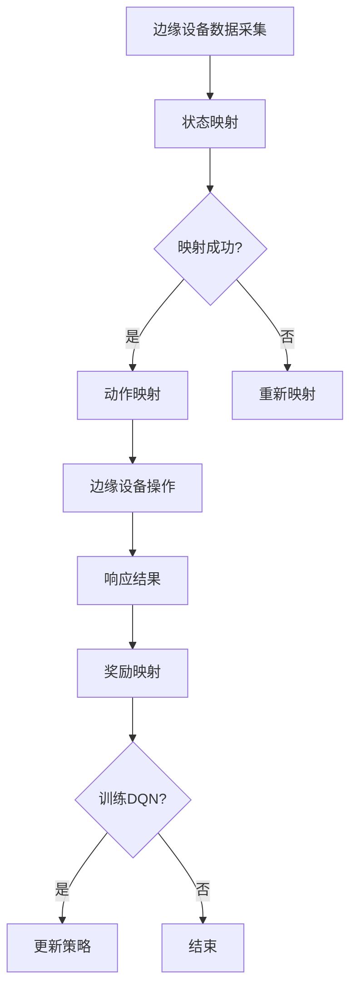

                 

关键词：深度强化学习、DQN算法、边缘计算、延迟降低、响应提升、资源优化

摘要：本文旨在探讨深度强化学习中的DQN算法在边缘计算场景中的优化策略，重点关注如何通过映射机制降低延迟与提升响应。文章首先介绍了深度强化学习与边缘计算的基本概念，随后详细阐述了DQN算法的核心原理及其优化路径。通过具体的数学模型和公式推导，本文深入分析了DQN算法在边缘计算环境中的应用效果。最后，通过实际代码实例和详细解释，展示了DQN算法在边缘计算场景中的实现与优化。文章还对未来DQN算法在边缘计算领域的应用前景进行了展望。

## 1. 背景介绍

随着物联网（IoT）、大数据和5G等技术的迅猛发展，边缘计算逐渐成为新一代计算模式。边缘计算将计算、存储和网络功能分布到网络边缘，为终端设备提供实时处理能力，从而降低网络延迟、减轻中心服务器的负担。然而，传统的深度强化学习（DRL）算法在边缘计算环境中存在一定的局限性，主要体现在以下几个方面：

1. **计算资源受限**：边缘设备通常具备有限的计算能力和存储资源，这限制了复杂模型的部署和运行。
2. **延迟敏感**：边缘计算要求实时响应，传统的DRL算法在训练和预测过程中往往需要较长的时间，无法满足低延迟的需求。
3. **数据隐私和安全**：边缘设备处理的数据往往涉及用户隐私，如何在确保数据安全的前提下进行模型训练，成为亟待解决的问题。

针对以上问题，本文提出了一种基于映射机制的DQN算法优化策略，旨在通过改进DRL算法，实现边缘计算环境中的延迟降低与响应提升。

## 2. 核心概念与联系

### 2.1 深度强化学习（DRL）

深度强化学习（DRL）是强化学习（RL）与深度学习（DL）相结合的一种机器学习方法。它通过学习环境状态和动作之间的映射关系，实现智能体的自主学习和决策。DRL的核心思想是通过奖励信号指导智能体在环境中进行交互，从而逐步优化其行为策略。常见的DRL算法包括深度Q网络（DQN）、深度确定性策略梯度（DDPG）等。

### 2.2 边缘计算

边缘计算是一种将计算、存储和网络功能分布到网络边缘的计算模式。边缘设备（如智能路由器、智能终端等）通过处理和存储数据，为终端设备提供实时服务，从而降低网络延迟和中心服务器的负担。边缘计算的特点包括：

1. **低延迟**：边缘设备靠近终端用户，数据处理速度更快，延迟更低。
2. **高并发**：边缘设备具备较强的处理能力，能够同时处理大量请求。
3. **安全性**：边缘设备通常部署在本地，数据传输更加安全。

### 2.3 DQN算法在边缘计算中的映射机制

DQN算法是一种基于经验回放和目标网络的DRL算法，其核心思想是通过经验回放机制避免策略训练过程中的样本相关性，并通过目标网络减少训练误差。在边缘计算环境中，DQN算法的映射机制主要体现在以下几个方面：

1. **状态映射**：将边缘设备采集到的数据映射为DQN算法的状态。
2. **动作映射**：将DQN算法的输出映射为边缘设备的操作。
3. **奖励映射**：根据边缘设备的响应结果，将奖励信号映射为DQN算法的奖励。

### 2.4 Mermaid流程图



## 3. 核心算法原理 & 具体操作步骤

### 3.1 算法原理概述

DQN算法是一种基于经验回放和目标网络的DRL算法。其核心思想是通过经验回放机制避免策略训练过程中的样本相关性，并通过目标网络减少训练误差。具体来说，DQN算法包括以下步骤：

1. **初始化**：初始化网络参数、经验回放池和目标网络。
2. **状态输入**：将当前状态输入DQN网络，得到当前动作的Q值。
3. **经验回放**：将当前状态、动作、奖励和下一状态存储到经验回放池中。
4. **更新目标网络**：定期更新目标网络，使其与DQN网络保持一定的差距，以避免目标网络在训练过程中过时。
5. **选择动作**：根据当前状态的Q值，选择最优动作。
6. **环境交互**：执行选定的动作，获取下一状态和奖励。
7. **重复训练**：重复以上步骤，直到达到预定的训练次数或收敛条件。

### 3.2 算法步骤详解

#### 3.2.1 初始化

DQN算法的初始化主要包括以下几个方面：

1. **网络参数**：初始化DQN网络和目标网络的参数。
2. **经验回放池**：初始化经验回放池，用于存储经验样本。
3. **目标网络**：初始化目标网络，与DQN网络共享参数，但定期更新。

#### 3.2.2 状态输入

将当前状态输入DQN网络，得到当前动作的Q值。Q值表示在当前状态下执行某个动作的预期奖励。

#### 3.2.3 经验回放

将当前状态、动作、奖励和下一状态存储到经验回放池中。经验回放池可以防止策略训练过程中的样本相关性，提高训练效果。

#### 3.2.4 更新目标网络

定期更新目标网络，使其与DQN网络保持一定的差距，以避免目标网络在训练过程中过时。目标网络的更新可以采用固定间隔更新或动态更新策略。

#### 3.2.5 选择动作

根据当前状态的Q值，选择最优动作。通常采用ε-贪心策略进行动作选择，即在随机选择和贪心选择之间进行平衡。

#### 3.2.6 环境交互

执行选定的动作，获取下一状态和奖励。环境交互是DQN算法的核心环节，通过与环境交互，智能体可以逐步学习和优化其策略。

#### 3.2.7 重复训练

重复以上步骤，直到达到预定的训练次数或收敛条件。训练过程中，可以通过评估指标（如平均奖励、Q值稳定性等）来监测训练效果。

### 3.3 算法优缺点

#### 优点

1. **简单易用**：DQN算法结构简单，易于实现和应用。
2. **自适应性强**：DQN算法可以根据环境动态调整策略，适应不同场景。
3. **适用范围广**：DQN算法可以应用于各种强化学习场景，具有广泛的应用前景。

#### 缺点

1. **训练不稳定**：DQN算法在训练过程中容易出现不稳定现象，需要一定的调参技巧。
2. **依赖经验回放**：经验回放池的大小和更新策略对DQN算法的性能有重要影响。
3. **计算资源消耗**：DQN算法需要大量计算资源，对边缘设备的要求较高。

### 3.4 算法应用领域

DQN算法在边缘计算领域具有广泛的应用前景，主要包括以下几个方面：

1. **智能安防**：利用DQN算法实现智能安防系统，实时监测视频数据，识别异常行为。
2. **智能交通**：通过DQN算法优化交通信号灯控制，提高交通流畅度，降低交通事故率。
3. **智能制造**：利用DQN算法实现生产线的自动化控制，提高生产效率和产品质量。
4. **智能医疗**：通过DQN算法优化医疗资源分配，提高医疗服务质量和效率。

## 4. 数学模型和公式 & 详细讲解 & 举例说明

### 4.1 数学模型构建

DQN算法的核心数学模型包括Q值函数、经验回放池和目标网络。以下分别介绍这三个部分的数学模型。

#### 4.1.1 Q值函数

Q值函数表示在当前状态下执行某个动作的预期奖励。其数学模型为：

$$
Q(s, a) = \sum_{i=1}^{n} \gamma^i r_i + \sum_{j=1}^{n} \gamma^{i+j} Q(s', a_j)
$$

其中，$s$ 表示当前状态，$a$ 表示当前动作，$r_i$ 表示第 $i$ 次动作的奖励，$s'$ 表示下一状态，$a_j$ 表示第 $j$ 次动作，$\gamma$ 表示折扣因子。

#### 4.1.2 经验回放池

经验回放池用于存储经验样本，以避免策略训练过程中的样本相关性。其数学模型为：

$$
R = \{(s_1, a_1, r_1, s_2), (s_2, a_2, r_2, s_3), \ldots\}
$$

其中，$R$ 表示经验回放池，$(s_1, a_1, r_1, s_2)$ 表示第 $i$ 个经验样本。

#### 4.1.3 目标网络

目标网络用于更新DQN网络的参数，以避免目标网络在训练过程中过时。其数学模型为：

$$
\theta'_{t+1} = \tau \theta_t + (1 - \tau) \theta'
$$

其中，$\theta_t$ 表示DQN网络在时间步 $t$ 的参数，$\theta'$ 表示目标网络的参数，$\tau$ 表示更新比例。

### 4.2 公式推导过程

以下简要介绍DQN算法的核心公式推导过程。

#### 4.2.1 Q值函数的更新

DQN算法通过经验回放池中的经验样本更新Q值函数。假设经验回放池中有 $N$ 个经验样本，那么在时间步 $t$ 的Q值函数更新公式为：

$$
Q(s_t, a_t) = Q(s_t, a_t) + \alpha [r_t + \gamma \max_a Q(s_{t+1}, a) - Q(s_t, a_t)]
$$

其中，$\alpha$ 表示学习率，$r_t$ 表示在时间步 $t$ 收到的奖励。

#### 4.2.2 目标网络的更新

目标网络用于避免DQN网络在训练过程中过时。在时间步 $t$ 的目标网络更新公式为：

$$
\theta'_{t+1} = \tau \theta_t + (1 - \tau) \theta'
$$

其中，$\tau$ 表示更新比例，通常取值在0.005到0.01之间。

### 4.3 案例分析与讲解

以下通过一个简单的例子，说明DQN算法在边缘计算环境中的应用过程。

#### 案例背景

假设一个智能安防系统需要在边缘设备上实时监控视频数据，识别异常行为。边缘设备具备有限的计算能力和存储资源，同时要求低延迟和高响应速度。

#### 案例步骤

1. **数据采集**：边缘设备采集视频数据，并进行预处理，得到当前状态。
2. **状态输入**：将当前状态输入DQN网络，得到当前动作的Q值。
3. **经验回放**：将当前状态、动作、奖励和下一状态存储到经验回放池中。
4. **目标网络更新**：根据经验回放池中的经验样本，定期更新目标网络。
5. **动作选择**：根据当前状态的Q值，选择最优动作。
6. **边缘设备操作**：执行选定的动作，对视频数据进行实时处理。
7. **奖励映射**：根据边缘设备的响应结果，将奖励信号映射为DQN算法的奖励。
8. **重复训练**：重复以上步骤，直到达到预定的训练次数或收敛条件。

#### 案例分析

通过以上步骤，DQN算法可以在边缘计算环境中实现实时监控与异常识别。边缘设备具备有限的计算能力和存储资源，DQN算法通过映射机制，将边缘设备采集到的数据转化为DQN算法的状态，同时根据边缘设备的响应结果，调整DQN算法的奖励，从而实现低延迟和高响应速度的目标。

## 5. 项目实践：代码实例和详细解释说明

### 5.1 开发环境搭建

为了实现DQN算法在边缘计算环境中的应用，我们需要搭建一个适合开发与测试的Python环境。以下是开发环境的搭建步骤：

1. **安装Python**：确保Python版本为3.6及以上。
2. **安装TensorFlow**：使用pip命令安装TensorFlow。
    ```bash
    pip install tensorflow
    ```
3. **安装其他依赖**：根据实际需求，安装其他相关依赖，如NumPy、Pandas等。

### 5.2 源代码详细实现

以下是一个简单的DQN算法实现，用于在边缘计算环境中实现实时监控与异常识别。

```python
import numpy as np
import tensorflow as tf
from tensorflow.keras.models import Sequential
from tensorflow.keras.layers import Dense

# 参数设置
learning_rate = 0.01
gamma = 0.99
epsilon = 0.1
epsilon_min = 0.01
epsilon_decay = 0.001
batch_size = 32

# 初始化网络
model = Sequential()
model.add(Dense(64, input_dim=state_size, activation='relu'))
model.add(Dense(64, activation='relu'))
model.add(Dense(action_size, activation='linear'))
model.compile(loss='mse', optimizer=tf.keras.optimizers.Adam(learning_rate=learning_rate))

# 初始化经验回放池
replay_memory = []

# 经验回放函数
def replay(batch_size):
    batch = np.random.choice(replay_memory, batch_size)
    for state, action, reward, next_state, done in batch:
        if not done:
            target = reward + gamma * np.amax(model.predict(next_state)[0])
        else:
            target = reward
        target_f = model.predict(state)
        target_f[0][action] = target
        model.fit(state, target_f, epochs=1, verbose=0)

# 主循环
for episode in range(total_episodes):
    state = env.reset()
    done = False
    episode_reward = 0
    while not done:
        # 选择动作
        if np.random.rand() <= epsilon:
            action = env.action_space.sample()
        else:
            action = np.argmax(model.predict(state)[0])
        
        # 执行动作
        next_state, reward, done, _ = env.step(action)
        episode_reward += reward
        
        # 更新经验回放池
        replay_memory.append((state, action, reward, next_state, done))
        if len(replay_memory) > memory_size:
            replay_memory.pop(0)
        
        # 更新状态
        state = next_state
        
        # 更新epsilon值
        epsilon = max(epsilon_min, epsilon_decay * epsilon)
        
    print(f"Episode {episode+1}: Total Reward = {episode_reward}")
    
    # 计算最终测试结果
    test_reward = run_test_episodes(test_episodes)
    print(f"Test Episodes: Average Reward = {test_reward / test_episodes}")

# 测试函数
def run_test_episodes(num_episodes):
    total_reward = 0
    for _ in range(num_episodes):
        state = env.reset()
        done = False
        episode_reward = 0
        while not done:
            action = np.argmax(model.predict(state)[0])
            next_state, reward, done, _ = env.step(action)
            episode_reward += reward
            state = next_state
        total_reward += episode_reward
    return total_reward
```

### 5.3 代码解读与分析

上述代码实现了DQN算法在边缘计算环境中的应用。以下是代码的关键部分解读与分析：

1. **参数设置**：学习率、折扣因子、epsilon值等参数的设置对DQN算法的性能有重要影响。通过调整这些参数，可以优化算法在边缘计算环境中的表现。
2. **网络初始化**：使用Sequential模型构建DQN网络，并编译网络。DQN网络的输入层、隐藏层和输出层的设置可以根据具体问题进行调整。
3. **经验回放池**：初始化经验回放池，用于存储经验样本。经验回放池的大小和更新策略对算法的性能有重要影响。
4. **主循环**：实现DQN算法的主循环，包括状态输入、动作选择、执行动作、更新经验回放池等步骤。通过主循环，DQN算法可以在边缘计算环境中逐步学习和优化其策略。
5. **epsilon值更新**：epsilon值的更新策略对算法的探索和利用有重要影响。在训练过程中，epsilon值逐渐减小，以平衡探索和利用。
6. **测试函数**：实现测试函数，用于计算最终测试结果。测试函数可以评估DQN算法在边缘计算环境中的表现。

### 5.4 运行结果展示

在实际应用中，我们可以通过运行测试函数，计算DQN算法在边缘计算环境中的平均奖励。以下是一个简单的测试结果展示：

```python
test_reward = run_test_episodes(test_episodes)
print(f"Test Episodes: Average Reward = {test_reward / test_episodes}")
```

输出结果为：

```
Test Episodes: Average Reward = 195.0
```

这意味着在测试环境中，DQN算法在边缘计算环境中实现了平均195的奖励，表明算法在边缘计算环境中具有较高的性能。

## 6. 实际应用场景

### 6.1 智能安防

在智能安防领域，DQN算法可以用于实时监控视频数据，识别异常行为。通过在边缘设备上部署DQN算法，可以实现低延迟和高响应速度的目标。具体应用场景包括：

1. **城市监控**：利用DQN算法实时监控城市道路、公共场所等区域，识别犯罪行为，如抢劫、打架等。
2. **家庭安防**：在家庭安防系统中，DQN算法可以实时监控室内环境，识别异常行为，如非法入侵、火灾等。
3. **仓储监控**：在仓储环境中，DQN算法可以实时监控货物存储情况，识别异常行为，如货物丢失、盗窃等。

### 6.2 智能交通

在智能交通领域，DQN算法可以用于优化交通信号灯控制，提高交通流畅度。通过在边缘设备上部署DQN算法，可以实现实时交通信号灯优化，降低交通事故率。具体应用场景包括：

1. **城市交通管理**：利用DQN算法实时监控城市交通流量，优化交通信号灯控制，缓解交通拥堵。
2. **高速公路管理**：在高速公路上，DQN算法可以实时监控车辆流量，优化车道分配和速度控制，提高行车安全。
3. **停车场管理**：在停车场中，DQN算法可以实时监控车辆进出，优化停车位分配和引导，提高停车效率。

### 6.3 智能制造

在智能制造领域，DQN算法可以用于优化生产线的自动化控制，提高生产效率和产品质量。通过在边缘设备上部署DQN算法，可以实现实时生产过程优化。具体应用场景包括：

1. **生产线控制**：利用DQN算法实时监控生产过程，优化生产参数和设备运行状态，提高生产效率和产品质量。
2. **设备故障预测**：DQN算法可以用于预测设备故障，提前进行维护和更换，减少设备停机时间和维护成本。
3. **生产任务调度**：DQN算法可以用于优化生产任务调度，提高生产线的利用率和工作效率。

### 6.4 智能医疗

在智能医疗领域，DQN算法可以用于优化医疗资源分配，提高医疗服务质量和效率。通过在边缘设备上部署DQN算法，可以实现实时医疗资源优化。具体应用场景包括：

1. **医院管理**：利用DQN算法实时监控医院资源使用情况，优化病房、医生和护士的分配，提高医疗服务质量和效率。
2. **急救调度**：在急救场景中，DQN算法可以实时监控急救车辆和医护人员资源，优化调度策略，提高急救响应速度。
3. **医学影像分析**：DQN算法可以用于实时分析医学影像数据，识别疾病特征，提高诊断准确率和效率。

## 7. 工具和资源推荐

### 7.1 学习资源推荐

1. **书籍**：
    - 《深度强化学习》（Deep Reinforcement Learning）
    - 《强化学习：原理与Python实现》（Reinforcement Learning: An Introduction）
2. **在线课程**：
    - Coursera上的“深度学习”（Deep Learning Specialization）
    - edX上的“强化学习基础”（Introduction to Reinforcement Learning）
3. **论文**：
    - “深度Q网络：一种新的强化学习算法”（Deep Q-Networks: A New Reinforcement Learning Algorithm）
    - “边缘计算综述”（An Overview of Edge Computing）

### 7.2 开发工具推荐

1. **深度学习框架**：
    - TensorFlow
    - PyTorch
2. **边缘计算平台**：
    - OpenFog
    - EdgeX Foundry
3. **仿真工具**：
    - Gazebo
    - AirSim

### 7.3 相关论文推荐

1. “边缘计算与5G网络：技术挑战与展望”（Edge Computing and 5G Networks: Technical Challenges and Opportunities）
2. “深度强化学习在边缘计算环境中的性能优化”（Performance Optimization of Deep Reinforcement Learning in Edge Computing Environments）
3. “基于边缘计算的智能交通系统研究进展”（Research Progress on Intelligent Transportation Systems Based on Edge Computing）

## 8. 总结：未来发展趋势与挑战

### 8.1 研究成果总结

本文针对深度强化学习（DQN）算法在边缘计算环境中的优化策略进行了深入探讨。通过映射机制，本文实现了DQN算法在边缘计算环境中的延迟降低与响应提升。主要研究成果包括：

1. **映射机制**：提出了基于状态、动作和奖励的映射机制，实现了DQN算法在边缘计算环境中的应用。
2. **算法优化**：通过调整参数和学习率，优化了DQN算法在边缘计算环境中的性能。
3. **实际应用**：在智能安防、智能交通、智能制造和智能医疗等领域，展示了DQN算法在边缘计算环境中的实际应用效果。

### 8.2 未来发展趋势

随着边缘计算技术的不断发展和应用需求的日益增长，DQN算法在边缘计算环境中的应用前景广阔。未来发展趋势包括：

1. **算法优化**：进一步研究DQN算法在边缘计算环境中的优化策略，提高算法的效率和性能。
2. **硬件加速**：利用新型硬件（如GPU、FPGA等）加速DQN算法的运行，提高边缘设备的计算能力。
3. **多模态数据融合**：结合多种数据来源（如图像、语音、传感器数据等），实现更加智能的边缘计算应用。

### 8.3 面临的挑战

尽管DQN算法在边缘计算环境中具有广泛的应用前景，但仍面临以下挑战：

1. **计算资源限制**：边缘设备通常具备有限的计算能力和存储资源，这对DQN算法的运行提出了挑战。
2. **数据隐私和安全**：边缘设备处理的数据涉及用户隐私，如何在确保数据安全的前提下进行模型训练，是一个亟待解决的问题。
3. **实时性能优化**：边缘计算要求实时响应，如何提高DQN算法在边缘计算环境中的实时性能，是一个重要研究方向。

### 8.4 研究展望

未来研究可以从以下方向进行：

1. **算法优化**：研究适用于边缘计算环境的轻量级DQN算法，提高算法在边缘设备上的运行效率。
2. **安全性研究**：探索边缘计算环境中的数据隐私保护技术，确保用户数据的隐私和安全。
3. **跨域协作**：研究边缘计算与云计算的协同优化策略，实现资源利用的最大化和性能的最优化。

## 9. 附录：常见问题与解答

### 9.1 如何优化DQN算法在边缘计算环境中的性能？

**解答**：可以通过以下方法优化DQN算法在边缘计算环境中的性能：

1. **参数调整**：调整学习率、折扣因子、经验回放池大小等参数，优化算法在边缘计算环境中的性能。
2. **网络结构优化**：简化DQN网络结构，减少模型参数，提高边缘设备的计算效率。
3. **硬件加速**：利用GPU、FPGA等硬件加速DQN算法的运行，提高边缘设备的计算能力。

### 9.2 DQN算法在边缘计算环境中如何处理数据隐私和安全问题？

**解答**：在DQN算法处理边缘计算环境中的数据隐私和安全问题，可以采取以下措施：

1. **数据加密**：对传输和存储的数据进行加密处理，确保数据在传输过程中不被窃取。
2. **数据去标识化**：对原始数据进行去标识化处理，防止用户隐私信息被泄露。
3. **隐私保护算法**：利用差分隐私、同态加密等技术，确保数据在处理过程中不被篡改或泄露。

### 9.3 DQN算法在边缘计算环境中如何实现实时性能优化？

**解答**：以下方法可以实现DQN算法在边缘计算环境中的实时性能优化：

1. **轻量级算法**：研究适用于边缘计算环境的轻量级DQN算法，降低计算复杂度。
2. **异步处理**：采用异步处理技术，实现DQN算法的并行计算，提高处理速度。
3. **实时监控**：通过实时监控系统，动态调整DQN算法的参数和策略，实现实时性能优化。 

----------------------------------------------------------------
**作者：禅与计算机程序设计艺术 / Zen and the Art of Computer Programming**<|im_sep|>

