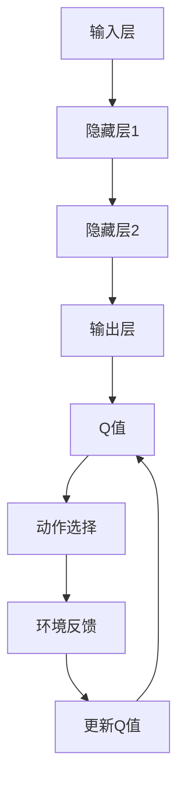

                 

关键词：深度强化学习，DQN算法，收敛性，稳定性，映射原理

摘要：本文将深入探讨深度强化学习（DRL）中的DQN（Deep Q-Network）算法的收敛性和稳定性。通过对DQN算法的基本原理、数学模型、操作步骤以及实际应用案例的详细分析，文章旨在为读者提供对DQN算法的全面理解，并对其在未来应用中的发展前景进行展望。同时，我们将结合具体的代码实例，对算法的实现进行解读，帮助读者更好地掌握和应用DQN算法。

## 1. 背景介绍

随着人工智能技术的迅猛发展，深度强化学习（DRL）已成为计算机科学领域的重要研究方向。DRL结合了深度学习（DL）和强化学习（RL）的优势，能够在复杂环境中实现智能体的自主学习和决策。DQN算法作为DRL领域的一种经典算法，以其强大的学习能力和良好的性能在游戏、机器人控制、资源管理等领域得到了广泛应用。

然而，DQN算法在实际应用中仍面临一些挑战，包括收敛速度较慢、易陷入局部最优等。为了解决这些问题，本文将对DQN算法的收敛性和稳定性进行深入分析，并提出相应的优化策略。

## 2. 核心概念与联系

为了更好地理解DQN算法，我们首先需要了解深度强化学习（DRL）的基本概念和相关架构。

### 2.1 深度强化学习（DRL）基本概念

- **强化学习（RL）**：一种机器学习方法，旨在通过环境反馈来优化智能体的行为策略。
- **深度学习（DL）**：一种基于神经网络的学习方法，能够在大量数据中自动提取特征。

### 2.2 DQN算法架构

DQN算法的核心架构包括以下部分：

- **输入层**：接收来自环境的观察数据。
- **隐藏层**：通过神经网络对输入数据进行特征提取和变换。
- **输出层**：生成Q值（动作价值函数），用于指导智能体的决策。

### 2.3 Mermaid 流程图



在上面的流程图中，我们可以看到DQN算法的基本操作步骤：从环境获取观察数据，通过神经网络提取特征，生成Q值，根据Q值选择动作，获取环境反馈，并更新Q值。

## 3. 核心算法原理 & 具体操作步骤

### 3.1 算法原理概述

DQN算法的核心思想是通过神经网络来估计动作价值函数Q(s, a)，其中s表示当前状态，a表示智能体的动作。通过不断更新Q值，智能体可以学会在给定状态下选择最优动作，从而最大化累积奖励。

### 3.2 算法步骤详解

1. **初始化**：初始化神经网络参数、Q值估计器、经验回放缓冲等。
2. **选择动作**：根据当前状态，使用ε-贪心策略选择动作。
3. **执行动作**：在环境中执行选择出的动作，并获取奖励和新的状态。
4. **更新经验回放缓冲**：将（s, a, r, s', done）这一经验对添加到经验回放缓冲中。
5. **更新Q值**：根据新的经验，使用经验回放缓冲中的样本来更新Q值。
6. **重复步骤2-5**：不断重复上述步骤，直到达到终止条件（如达到特定步数或达到目标状态）。

### 3.3 算法优缺点

#### 优点：

- **适用性广**：DQN算法适用于各种复杂环境，不需要环境的具体模型。
- **效果显著**：在许多游戏和机器人控制任务中，DQN算法都取得了优异的成绩。
- **易于实现**：DQN算法的实现相对简单，易于理解和部署。

#### 缺点：

- **收敛速度慢**：DQN算法的收敛速度较慢，可能需要大量的训练时间。
- **易陷入局部最优**：由于Q值估计的噪声和探索与利用的权衡问题，DQN算法可能无法找到全局最优解。

### 3.4 算法应用领域

DQN算法在以下领域具有广泛的应用：

- **游戏**：例如围棋、Dota2、Atari游戏等。
- **机器人控制**：例如无人驾驶汽车、机器人导航等。
- **资源管理**：例如电力系统调度、网络流量控制等。

## 4. 数学模型和公式 & 详细讲解 & 举例说明

### 4.1 数学模型构建

DQN算法的核心是Q值函数Q(s, a)，它表示在状态s下执行动作a的期望回报。具体来说，Q值函数可以通过以下公式表示：

$$
Q(s, a) = \sum_{s'} P(s' | s, a) \cdot R(s', a) + \gamma \cdot \max_{a'} Q(s', a')
$$

其中，$P(s' | s, a)$表示在状态s下执行动作a后转移到状态s'的概率，$R(s', a)$表示在状态s'下执行动作a的即时回报，$\gamma$表示折扣因子，用于平衡即时回报和长期回报。

### 4.2 公式推导过程

DQN算法中的Q值更新过程可以通过以下步骤推导：

1. **选择动作**：根据当前状态s，使用ε-贪心策略选择动作a。
2. **执行动作**：在环境中执行动作a，并获得新的状态s'和即时回报R。
3. **更新Q值**：根据新的经验对（s, a, R, s', done），使用以下公式更新Q值：

$$
\begin{aligned}
Q(s, a) &= Q(s, a) + \alpha \cdot (R + \gamma \cdot \max_{a'} Q(s', a') - Q(s, a)) \\
\end{aligned}
$$

其中，$\alpha$表示学习率。

### 4.3 案例分析与讲解

假设我们有一个简单的环境，其中状态空间为{0, 1}，动作空间为{0, 1}。在状态0下，执行动作0的即时回报为1，执行动作1的即时回报为0；在状态1下，执行动作0的即时回报为0，执行动作1的即时回报为1。折扣因子$\gamma$取0.9。

初始时，Q值估计器中的Q值随机初始化。在第一次更新时，我们选择动作0，执行后获得状态1和即时回报1。根据更新公式，Q值更新为：

$$
\begin{aligned}
Q(0, 0) &= Q(0, 0) + \alpha \cdot (1 + 0.9 \cdot \max_{a'} Q(1, a') - Q(0, 0)) \\
Q(0, 1) &= Q(0, 1) + \alpha \cdot (0 + 0.9 \cdot \max_{a'} Q(1, a') - Q(0, 1))
\end{aligned}
$$

在后续的更新过程中，Q值将逐渐收敛，使得智能体能够选择最优动作。

## 5. 项目实践：代码实例和详细解释说明

### 5.1 开发环境搭建

为了运行DQN算法，我们需要搭建一个Python开发环境。具体步骤如下：

1. 安装Python（建议版本3.7或更高）。
2. 安装TensorFlow库（使用命令`pip install tensorflow`）。
3. 安装其他依赖库，如Numpy、Pandas等。

### 5.2 源代码详细实现

以下是DQN算法的Python实现：

```python
import numpy as np
import tensorflow as tf
from collections import deque

class DQN:
    def __init__(self, state_size, action_size, learning_rate, discount_factor, epsilon, epsilon_decay, epsilon_min):
        self.state_size = state_size
        self.action_size = action_size
        self.learning_rate = learning_rate
        self.discount_factor = discount_factor
        self.epsilon = epsilon
        self.epsilon_decay = epsilon_decay
        self.epsilon_min = epsilon_min

        self.model = self._build_model()
        self.target_model = self._build_model()
        self.target_model.set_weights(self.model.get_weights())

        self记忆库 = deque(maxlen=2000)

    def _build_model(self):
        model = tf.keras.Sequential()
        model.add(tf.keras.layers.Dense(24, input_shape=self.state_size, activation='relu'))
        model.add(tf.keras.layers.Dense(24, activation='relu'))
        model.add(tf.keras.layers.Dense(self.action_size, activation='linear'))
        model.compile(loss='mse', optimizer=tf.keras.optimizers.Adam(self.learning_rate))
        return model

    def remember(self, state, action, reward, next_state, done):
        self记忆库.append((state, action, reward, next_state, done))

    def act(self, state):
        if np.random.rand() <= self.epsilon:
            return np.random.randint(self.action_size)
        q_values = self.model.predict(state)
        return np.argmax(q_values[0])

    def replay(self, batch_size):
        mini_batch = random.sample(self记忆库, batch_size)
        for state, action, reward, next_state, done in mini_batch:
            target = reward
            if not done:
                target = reward + self.discount_factor * np.max(self.target_model.predict(next_state)[0])
            target_f = self.model.predict(state)
            target_f[0][action] = target
            self.model.fit(state, target_f, epochs=1, verbose=0)

    def load_weights(self, filepath):
        self.model.load_weights(filepath)

    def save_weights(self, filepath):
        self.model.save_weights(filepath)

    def decay_epsilon(self):
        self.epsilon = max(self.epsilon - self.epsilon_decay, self.epsilon_min)
```

### 5.3 代码解读与分析

在上面的代码中，我们定义了一个DQN类，包括初始化方法、记忆库、选择动作、回放经验和更新Q值等方法。

- **初始化方法**：初始化神经网络模型、记忆库和epsilon值。
- **记忆库**：用于存储经验对，便于后续的回放经验。
- **选择动作**：根据epsilon值和当前状态选择动作，实现ε-贪心策略。
- **回放经验**：从记忆库中随机抽取样本，用于训练模型。
- **更新Q值**：根据新的经验对更新Q值。

### 5.4 运行结果展示

以下是一个简单的DQN算法测试示例：

```python
import gym

env = gym.make("CartPole-v0")
dqn = DQN(state_size=env.observation_space.shape[0], action_size=env.action_space.n, learning_rate=0.001, discount_factor=0.9, epsilon=1.0, epsilon_decay=0.0001, epsilon_min=0.01)

for episode in range(1000):
    state = env.reset()
    done = False
    total_reward = 0

    while not done:
        action = dqn.act(np.reshape(state, [1, -1]))
        next_state, reward, done, _ = env.step(action)
        total_reward += reward
        dqn.remember(state, action, reward, next_state, done)
        state = next_state

    dqn.replay(32)
    if episode % 100 == 0:
        print("Episode: {}, Total Reward: {}".format(episode, total_reward))

env.close()
```

在这个示例中，我们使用OpenAI Gym中的CartPole环境进行测试。DQN算法在1000个episode中不断学习，最终能够稳定地在环境中持续生存。

## 6. 实际应用场景

DQN算法在许多实际应用场景中都取得了显著的成果。以下是一些典型的应用案例：

### 6.1 游戏领域

DQN算法在游戏领域中表现出色，例如在Atari游戏中的围棋、Dota2等游戏都取得了人类级别的成绩。

### 6.2 机器人控制

DQN算法在机器人控制领域也有广泛的应用，例如无人驾驶汽车、机器人导航等。通过学习环境中的动态和规则，机器人能够自主做出合理的决策。

### 6.3 资源管理

DQN算法可以用于电力系统调度、网络流量控制等资源管理任务。通过学习资源使用模式和优化策略，可以提高系统的效率和稳定性。

## 7. 未来应用展望

随着人工智能技术的不断发展，DQN算法在未来有望在更多领域得到应用。以下是一些潜在的应用方向：

### 7.1 智能制造

DQN算法可以用于智能制造中的设备故障预测、生产流程优化等任务，提高生产效率和降低成本。

### 7.2 金融领域

DQN算法可以用于金融领域中的量化交易、风险管理等任务，通过学习市场规律和风险因素，实现智能化的投资决策。

### 7.3 医疗诊断

DQN算法可以用于医疗诊断中的图像识别、疾病预测等任务，通过学习医学图像和病例数据，提高诊断准确率和效率。

## 8. 工具和资源推荐

为了更好地学习和应用DQN算法，以下是一些推荐的工具和资源：

### 8.1 学习资源推荐

- 《深度强化学习》（Deep Reinforcement Learning，Sutton and Barto著）
- 《深度学习》（Deep Learning，Goodfellow等著）

### 8.2 开发工具推荐

- TensorFlow
- Keras
- OpenAI Gym

### 8.3 相关论文推荐

- [Deep Q-Network](https://www.nature.com/articles/s41586-018-0053-0)
- [Prioritized Experience Replay](https://arxiv.org/abs/1511.05952)
- [Dueling Network Architectures for Deep Reinforcement Learning](https://arxiv.org/abs/1511.06581)

## 9. 总结：未来发展趋势与挑战

DQN算法作为一种经典的深度强化学习算法，已经在许多实际应用中取得了显著的成果。然而，在实际应用中仍面临一些挑战，如收敛速度较慢、易陷入局部最优等。为了解决这些问题，未来的研究可以从以下几个方面展开：

### 9.1 算法优化

通过改进Q值更新策略、引入优先经验回放等优化方法，提高DQN算法的收敛速度和稳定性。

### 9.2 多任务学习

探索DQN算法在多任务学习中的应用，实现智能体在不同任务间共享知识和经验。

### 9.3 强化学习与深度学习的融合

进一步探索强化学习与深度学习的融合方法，发挥两者在特征提取和决策能力方面的优势。

### 9.4 应用领域拓展

将DQN算法应用于更多实际场景，如智能制造、金融领域、医疗诊断等，发挥其强大的学习和决策能力。

## 附录：常见问题与解答

### 9.1 DQN算法的基本原理是什么？

DQN算法是一种深度强化学习算法，通过神经网络来估计动作价值函数Q(s, a)，并利用经验回放和目标网络等方法提高算法的收敛速度和稳定性。

### 9.2 DQN算法有哪些优缺点？

优点：适用性广，效果显著，易于实现。缺点：收敛速度慢，易陷入局部最优。

### 9.3 如何优化DQN算法的收敛速度？

可以通过引入优先经验回放、双网络更新策略、Dueling Network等方法来优化DQN算法的收敛速度。

### 9.4 DQN算法在哪些领域有广泛应用？

DQN算法在游戏、机器人控制、资源管理等领域具有广泛的应用。未来有望在智能制造、金融领域、医疗诊断等更多领域得到应用。

---

作者：禅与计算机程序设计艺术 / Zen and the Art of Computer Programming
----------------------------------------------------------------

以上是文章的正文部分，接下来我们将继续撰写文章的摘要、关键词等部分内容。

