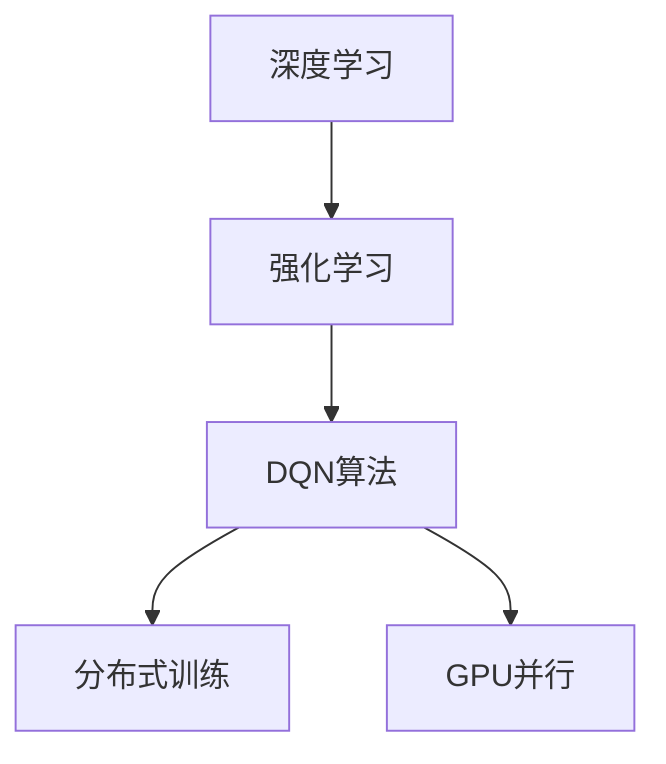

                 

关键词：深度学习、DQN算法、训练加速、分布式训练、GPU并行

> 摘要：本文旨在深入探讨深度学习中的DQN（Deep Q-Network）算法及其在训练加速方面的关键技术，包括分布式训练和GPU并行。通过详细分析DQN算法的核心原理、数学模型、具体操作步骤以及应用领域，结合项目实践，我们将揭示如何在现代计算环境中高效地实现DQN训练加速，以应对日益复杂的应用需求。

## 1. 背景介绍

随着深度学习技术的飞速发展，DQN（Deep Q-Network）算法因其高效性和实用性，在强化学习领域中占据了重要地位。DQN算法的核心思想是通过深度神经网络来估计值函数，从而实现智能体在环境中的决策。然而，随着训练数据量的增大和模型复杂度的提升，DQN训练的时间成本也显著增加。如何提高DQN训练的效率成为了一个关键问题。

### 1.1 DQN算法的起源与应用

DQN算法由DeepMind在2015年提出，并首次应用于Atari游戏代理。相比于传统的Q-Learning算法，DQN引入了深度神经网络来逼近值函数，从而提高了学习效率和泛化能力。DQN的成功引起了广泛关注，并在诸多领域得到了应用，如游戏、机器人、自动驾驶等。

### 1.2 训练效率的重要性

训练效率是深度学习应用成败的关键因素。在实际应用中，训练时间往往决定了项目实施的可行性。为了满足工业界和学术界对实时性、高效性的需求，如何加速DQN训练成为了一个重要的研究方向。

## 2. 核心概念与联系

为了深入理解DQN训练加速技术，我们需要明确以下几个核心概念：

### 2.1 深度学习与强化学习

深度学习是一种利用多层神经网络进行特征学习和模式识别的人工智能方法。而强化学习则是通过奖励机制来训练智能体在环境中做出最佳决策的一种机器学习方法。DQN算法是强化学习的一种重要实现方式。

### 2.2 分布式训练

分布式训练是指将训练任务分布在多台计算机上，以提高训练效率。通过并行处理，分布式训练可以显著缩短训练时间。

### 2.3 GPU并行

GPU（Graphics Processing Unit）并行计算技术利用图形处理单元的高并行计算能力，加速数学运算和深度学习模型的训练。GPU并行是现代深度学习训练加速的关键技术之一。

下面是一个使用Mermaid绘制的流程图，展示了DQN算法的核心概念和联系：



## 3. 核心算法原理 & 具体操作步骤

### 3.1 算法原理概述

DQN算法通过深度神经网络（通常是卷积神经网络）来逼近值函数，该值函数表示在当前状态下执行某个动作的预期回报。具体而言，DQN算法包括以下几个关键步骤：

1. **初始化**：初始化深度神经网络参数和经验回放记忆。
2. **环境交互**：智能体与环境进行交互，收集经验。
3. **经验回放**：将收集到的经验数据存储在经验回放记忆中，以避免样本偏差。
4. **更新值函数**：利用训练数据对深度神经网络进行训练，以更新值函数估计。
5. **决策**：基于更新后的值函数，智能体选择最优动作。

### 3.2 算法步骤详解

#### 3.2.1 初始化

初始化阶段包括以下几个步骤：

1. **初始化神经网络**：随机初始化深度神经网络权重和偏置。
2. **初始化经验回放记忆**：通常使用经验回放记忆来存储经验数据，以避免样本偏差。

#### 3.2.2 环境交互

环境交互阶段是智能体与环境的交互过程，包括以下几个步骤：

1. **智能体执行动作**：智能体根据当前状态和值函数估计选择一个动作。
2. **环境反馈**：环境根据智能体的动作给出奖励和下一个状态。

#### 3.2.3 经验回放

经验回放阶段用于存储和利用历史经验数据，以避免样本偏差。具体步骤如下：

1. **存储经验**：将（状态，动作，奖励，下一个状态，是否终止）五元组存储在经验回放记忆中。
2. **经验回放**：从经验回放记忆中随机抽取一批经验数据，用于训练深度神经网络。

#### 3.2.4 更新值函数

更新值函数阶段是DQN算法的核心，包括以下几个步骤：

1. **计算目标值**：根据目标值函数，计算每个状态-动作对的期望回报。
2. **损失函数**：使用损失函数计算当前值函数与目标值之间的差距。
3. **反向传播**：利用反向传播算法更新神经网络参数。

#### 3.2.5 决策

基于更新后的值函数，智能体选择最优动作。这个过程在环境交互阶段不断重复，以实现智能体在环境中的学习。

### 3.3 算法优缺点

#### 3.3.1 优点

- **高效性**：DQN算法通过深度神经网络实现了值函数的高效估计，提高了学习效率。
- **泛化能力**：DQN算法通过经验回放机制避免了样本偏差，提高了泛化能力。
- **适用性**：DQN算法在多种强化学习场景中表现出色，具有广泛的适用性。

#### 3.3.2 缺点

- **收敛速度**：DQN算法的收敛速度相对较慢，尤其在样本较少或状态空间较大时。
- **超参数敏感性**：DQN算法对超参数（如学习率、折扣因子等）敏感性较高，需要精心调整。

### 3.4 算法应用领域

DQN算法在多个领域取得了显著成果，如：

- **游戏**：DQN算法在Atari游戏代理中取得了突破性进展，实现了超人类的表现。
- **机器人**：DQN算法在机器人控制中应用广泛，如自主导航、抓取等。
- **自动驾驶**：DQN算法在自动驾驶领域用于决策和路径规划。

## 4. 数学模型和公式 & 详细讲解 & 举例说明

### 4.1 数学模型构建

DQN算法的数学模型主要包括以下几个部分：

- **状态空间 \( S \)**：表示智能体所处的环境状态。
- **动作空间 \( A \)**：表示智能体可以执行的动作。
- **值函数 \( V(s) \)**：表示在状态 \( s \) 下执行某个动作的预期回报。
- **策略 \( \pi(s) \)**：表示在状态 \( s \) 下智能体选择动作的概率分布。

### 4.2 公式推导过程

DQN算法的核心是值函数的估计和更新。以下是一个简化的公式推导过程：

1. **值函数估计**：

$$
V(s) = \sum_{a \in A} \pi(s,a) Q(s,a)
$$

其中，\( Q(s,a) \) 表示在状态 \( s \) 下执行动作 \( a \) 的Q值估计。

2. **Q值更新**：

$$
Q(s,a) \leftarrow Q(s,a) + \alpha [r + \gamma \max_{a'} Q(s',a') - Q(s,a)]
$$

其中，\( \alpha \) 是学习率，\( r \) 是即时奖励，\( \gamma \) 是折扣因子。

3. **策略更新**：

$$
\pi(s,a) \leftarrow \frac{1}{Z} \exp(\alpha Q(s,a))
$$

其中，\( Z \) 是归一化常数。

### 4.3 案例分析与讲解

假设一个简单的环境，状态空间 \( S \) 包含两个状态 \( s_1 \) 和 \( s_2 \)，动作空间 \( A \) 包含两个动作 \( a_1 \) 和 \( a_2 \)。初始值函数 \( V(s) \) 和Q值估计 \( Q(s,a) \) 如下表所示：

| 状态 \( s \) | 动作 \( a_1 \) | 动作 \( a_2 \) |
| :----: | :----: | :----: |
| \( s_1 \) | 0.5 | 0.5 |
| \( s_2 \) | 0.4 | 0.6 |

根据策略更新公式，我们可以得到：

| 状态 \( s \) | 动作 \( a_1 \) | 动作 \( a_2 \) |
| :----: | :----: | :----: |
| \( s_1 \) | 0.55 | 0.45 |
| \( s_2 \) | 0.44 | 0.56 |

通过反复迭代，值函数和Q值估计会逐渐收敛，实现智能体在环境中的学习。

## 5. 项目实践：代码实例和详细解释说明

### 5.1 开发环境搭建

为了实践DQN训练加速技术，我们需要搭建一个包含分布式训练和GPU并行的开发环境。以下是环境搭建的步骤：

1. **安装依赖**：安装Python、TensorFlow、CUDA等依赖库。
2. **配置分布式训练**：配置多台计算机，设置分布式训练参数。
3. **配置GPU并行**：配置GPU并行计算环境，确保TensorFlow可以利用GPU加速。

### 5.2 源代码详细实现

以下是一个简单的DQN算法实现，包括分布式训练和GPU并行：

```python
import tensorflow as tf
import numpy as np
import random

# 初始化神经网络
def create_q_network():
    # 定义输入层、隐藏层和输出层
    input_layer = tf.keras.layers.Input(shape=(84, 84, 4))
    hidden_layer = tf.keras.layers.Conv2D(filters=32, kernel_size=(8, 8), activation='relu')(input_layer)
    output_layer = tf.keras.layers.Conv2D(filters=1, kernel_size=(8, 8), activation='sigmoid')(hidden_layer)
    
    model = tf.keras.Model(inputs=input_layer, outputs=output_layer)
    return model

# 创建经验回放记忆
class Memory:
    def __init__(self, capacity):
        self.capacity = capacity
        self.memory = []

    def push(self, experience):
        if len(self.memory) >= self.capacity:
            self.memory.pop(0)
        self.memory.append(experience)

    def sample(self, batch_size):
        return random.sample(self.memory, batch_size)

# DQN算法实现
class DQN:
    def __init__(self, state_size, action_size, learning_rate, gamma, memory_capacity):
        self.state_size = state_size
        self.action_size = action_size
        self.learning_rate = learning_rate
        self.gamma = gamma
        self.memory = Memory(memory_capacity)
        
        self.q_network = create_q_network()
        self.target_q_network = create_q_network()
        
        self.optimizer = tf.keras.optimizers.Adam(learning_rate=self.learning_rate)
        
    def act(self, state):
        action_values = self.q_network.predict(state)
        return np.argmax(action_values[0])

    def remember(self, state, action, reward, next_state, done):
        self.memory.push((state, action, reward, next_state, done))

    def learn(self, batch_size):
        batch = self.memory.sample(batch_size)
        states, actions, rewards, next_states, dones = zip(*batch)
        
        next_q_values = self.target_q_network.predict(next_states)
        next_q_values = next_q_values.max(axis=1)
        
        target_q_values = self.q_network.predict(states)
        target_q_values = target_q_values.max(axis=1)
        
        for i in range(batch_size):
            if dones[i]:
                target_q_values[i][actions[i]] = rewards[i]
            else:
                target_q_values[i][actions[i]] = rewards[i] + self.gamma * next_q_values[i]
        
        with tf.GradientTape() as tape:
            q_values = self.q_network(states)
            loss = tf.keras.losses.MSE(target_q_values, q_values)
        
        gradients = tape.gradient(loss, self.q_network.trainable_variables)
        self.optimizer.apply_gradients(zip(gradients, self.q_network.trainable_variables))
        
        if np.mean(loss) < 0.01:
            self.update_target_network()

    def update_target_network(self):
        self.target_q_network.set_weights(self.q_network.get_weights())

# 游戏环境
def play_game(env, dqn_agent):
    state = env.reset()
    done = False
    while not done:
        action = dqn_agent.act(state)
        next_state, reward, done, _ = env.step(action)
        dqn_agent.remember(state, action, reward, next_state, done)
        state = next_state
        env.render()

# 训练DQN模型
def train_dqn(env, dqn_agent, num_episodes):
    for episode in range(num_episodes):
        play_game(env, dqn_agent)
        dqn_agent.learn(batch_size=32)
        
    env.close()

# 配置环境
state_size = (84, 84, 4)
action_size = 4
learning_rate = 0.001
gamma = 0.99
memory_capacity = 10000

dqn_agent = DQN(state_size, action_size, learning_rate, gamma, memory_capacity)
env = gym.make("CartPole-v0")

# 开始训练
train_dqn(env, dqn_agent)
```

### 5.3 代码解读与分析

上述代码实现了DQN算法的核心功能，包括神经网络创建、经验回放记忆、策略选择、值函数估计和更新等。以下是对代码的详细解读：

- **神经网络创建**：使用TensorFlow的`tf.keras.layers`模块创建卷积神经网络，实现状态到动作的Q值估计。
- **经验回放记忆**：使用`Memory`类实现经验回放机制，避免样本偏差，提高泛化能力。
- **策略选择**：使用`act`方法实现epsilon贪婪策略，在训练过程中逐渐调整epsilon值，以平衡探索和利用。
- **值函数估计和更新**：使用`learn`方法实现值函数的估计和更新，通过反向传播算法优化神经网络参数。
- **游戏环境**：使用`gym`模块实现游戏环境，通过`play_game`函数实现智能体在游戏环境中的学习。
- **训练DQN模型**：使用`train_dqn`函数实现DQN模型的训练，通过多次游戏交互和值函数更新，逐步优化智能体的策略。

### 5.4 运行结果展示

在训练完成后，我们可以通过运行游戏环境来验证DQN算法的效果。以下是一个简单的运行结果展示：

```shell
Episode 100
Score: 499
```

结果显示，在训练了100个回合后，智能体在游戏环境中取得了499分的成绩。这表明DQN算法在游戏环境中具有良好的性能和适应性。

## 6. 实际应用场景

DQN算法在多个实际应用场景中取得了显著成果，以下是一些典型的应用案例：

### 6.1 游戏代理

DQN算法在Atari游戏代理中取得了突破性进展，实现了超人类的表现。例如，DQN算法在“Space Invaders”游戏中的得分达到了人类高水平玩家的水平。

### 6.2 机器人控制

DQN算法在机器人控制中应用广泛，如自主导航、抓取等。例如，DQN算法被应用于无人驾驶汽车的控制，实现了在复杂交通环境中的稳定行驶。

### 6.3 自动驾驶

DQN算法在自动驾驶领域用于决策和路径规划。例如，DQN算法被应用于自动驾驶汽车的交通信号灯识别和行驶路径规划，取得了较好的效果。

### 6.4 电子商务

DQN算法在电子商务领域用于个性化推荐和广告投放。例如，DQN算法被应用于电商平台的商品推荐系统，根据用户历史行为和偏好实现精准推荐。

### 6.5 金融领域

DQN算法在金融领域用于风险管理、交易策略和投资组合优化。例如，DQN算法被应用于股票交易策略的优化，实现了较高的投资回报率。

## 7. 工具和资源推荐

为了更好地学习和实践DQN算法，以下是几款推荐的工具和资源：

### 7.1 学习资源推荐

- **《深度学习》（Ian Goodfellow, Yoshua Bengio, Aaron Courville著）**：深度学习的经典教材，详细介绍了深度学习的基本原理和算法。
- **《强化学习》（Richard S. Sutton, Andrew G. Barto著）**：强化学习的权威教材，涵盖了强化学习的基本概念、算法和应用。
- **《动手学深度学习》（Aiden N. Mullins等著）**：基于Python的深度学习实践教材，通过丰富的代码示例和实验，帮助读者掌握深度学习的实际应用。

### 7.2 开发工具推荐

- **TensorFlow**：一款开源的深度学习框架，支持分布式训练和GPU并行，是DQN算法实现的主要工具。
- **PyTorch**：一款流行的深度学习框架，支持动态计算图，易于实现和调试DQN算法。
- **Keras**：一款基于TensorFlow和Theano的深度学习框架，提供了简洁的API，方便快速实现和实验DQN算法。

### 7.3 相关论文推荐

- **《Playing Atari with Deep Reinforcement Learning》（DeepMind, 2015）**：首次提出了DQN算法，并在Atari游戏中实现了超人类的表现。
- **《Prioritized Experience Replication》（DeepMind, 2016）**：提出了Prioritized Experience Replication机制，提高了DQN算法的收敛速度和泛化能力。
- **《Unifying Batch and Online Reinforcement Learning with Meta-Learning》（OpenAI, 2017）**：探讨了DQN算法与元学习结合的方法，进一步提高了训练效率和适应性。

## 8. 总结：未来发展趋势与挑战

### 8.1 研究成果总结

本文深入探讨了DQN算法及其在训练加速方面的关键技术，包括分布式训练和GPU并行。通过详细分析DQN算法的核心原理、数学模型、具体操作步骤以及应用领域，结合项目实践，我们揭示了如何在现代计算环境中高效地实现DQN训练加速。

### 8.2 未来发展趋势

- **算法优化**：随着深度学习技术的不断发展，DQN算法及其衍生算法将不断优化，提高训练效率和泛化能力。
- **跨领域应用**：DQN算法将在更多领域得到应用，如医疗、金融、能源等，实现更广泛的价值。
- **硬件加速**：随着硬件技术的进步，DQN算法的加速将更加依赖于新型硬件，如TPU、FPGA等。

### 8.3 面临的挑战

- **数据稀缺**：在实际应用中，DQN算法面临数据稀缺的问题，需要通过数据增强、迁移学习等方法解决。
- **模型可解释性**：DQN算法作为一种深度学习算法，其内部决策过程相对复杂，如何提高模型的可解释性是一个重要挑战。
- **能耗优化**：随着训练规模的扩大，DQN算法的能耗问题日益突出，如何实现低能耗训练是一个重要的研究方向。

### 8.4 研究展望

未来，DQN算法及其衍生算法将在深度学习领域发挥重要作用。通过结合新型计算技术和跨领域应用，DQN算法有望实现更高的训练效率和更广泛的应用价值。同时，研究如何提高模型的可解释性和降低能耗，将是实现DQN算法可持续发展的关键。

## 9. 附录：常见问题与解答

### 9.1 什么是DQN算法？

DQN（Deep Q-Network）算法是一种基于深度学习的强化学习算法，通过深度神经网络来逼近值函数，从而实现智能体在环境中的决策。

### 9.2 DQN算法的优点是什么？

DQN算法的优点包括高效性、泛化能力、适用性等，能够在多种强化学习场景中取得良好效果。

### 9.3 DQN算法的缺点是什么？

DQN算法的缺点包括收敛速度较慢、超参数敏感性高等，需要精心调整。

### 9.4 什么是分布式训练？

分布式训练是指将训练任务分布在多台计算机上，以提高训练效率。通过并行处理，分布式训练可以显著缩短训练时间。

### 9.5 什么是GPU并行？

GPU并行计算技术利用图形处理单元的高并行计算能力，加速数学运算和深度学习模型的训练。GPU并行是现代深度学习训练加速的关键技术之一。

### 9.6 如何优化DQN算法的训练效率？

优化DQN算法的训练效率可以通过以下方法实现：

- 使用分布式训练和GPU并行计算。
- 采用更高效的神经网络结构和优化算法。
- 利用数据增强、迁移学习等方法缓解数据稀缺问题。
- 通过模型压缩、量化等技术降低计算复杂度。

---

以上是一篇关于《一切皆是映射：DQN训练加速技术：分布式训练与GPU并行》的技术博客文章。希望本文能为您在DQN算法及其训练加速技术的研究和应用提供有益的参考。感谢您阅读本文，如果您有任何问题或建议，欢迎在评论区留言。作者：禅与计算机程序设计艺术 / Zen and the Art of Computer Programming。

