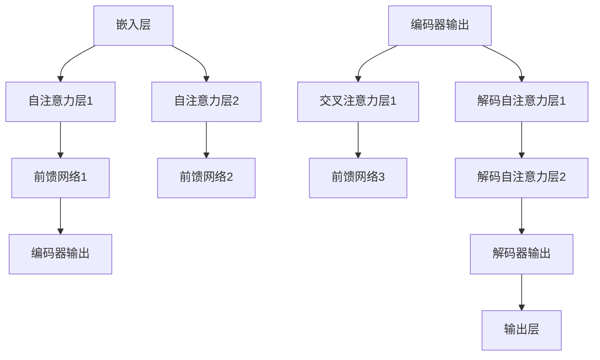

                 

关键词：Transformer，深度学习，神经网络，映射，序列模型，自然语言处理，编码器，解码器，自注意力机制，注意力权重，位置编码，BERT，GPT，机器翻译，文本生成，模型优化。

> 摘要：本文将深入探讨Transformer模型，这是一种在深度学习和自然语言处理领域引发革命性的架构。通过详细解析其核心概念、算法原理、数学模型以及实际应用，本文旨在为读者提供对Transformer模型全面而深入的理解，同时展望其未来发展的趋势和挑战。

## 1. 背景介绍

深度学习作为人工智能的一个重要分支，近年来取得了巨大的进步，尤其是在图像识别、语音识别等领域。然而，在自然语言处理（NLP）领域，深度学习也面临着一些挑战。传统的循环神经网络（RNN）和卷积神经网络（CNN）虽然能够处理序列数据，但在长序列的建模上存在很多问题，如梯度消失和梯度爆炸等。

为了解决这些问题，Vaswani等人于2017年提出了Transformer模型。该模型摒弃了传统的循环结构，采用自注意力机制来处理序列数据，从而在多个NLP任务上取得了显著的性能提升。Transformer的成功不仅改变了自然语言处理的研究方向，也促进了整个机器学习领域的发展。

## 2. 核心概念与联系

### 2.1. Transformer模型架构

Transformer模型的核心是自注意力机制（Self-Attention），它通过计算序列中每个词与其他词之间的关系来建模上下文。除了自注意力，Transformer还包括编码器（Encoder）和解码器（Decoder）两部分，它们分别用于处理输入序列和输出序列。


上图为Transformer模型的简化架构。在编码器中，每个词会通过嵌入层（Embedding Layer）转换为向量，然后经过多个自注意力层（Self-Attention Layer）和前馈网络（Feedforward Network），最后输出编码后的序列。在解码器中，解码器初始状态由编码器输出和位置编码（Positional Encoding）组合而成，然后通过多个解码自注意力层（Decoder Self-Attention Layer）和交叉注意力层（Cross-Attention Layer），以及前馈网络，生成输出序列。

### 2.2. 自注意力机制

自注意力机制是Transformer模型的核心，它允许模型在处理序列时关注序列中的不同位置。具体来说，自注意力机制通过以下步骤来计算注意力权重：

1. **计算query、key和value**：对于每个词，模型会计算其query、key和value向量。这些向量通常是通过线性变换嵌入向量得到的。
2. **计算注意力得分**：将每个query与所有key计算内积，得到注意力得分。注意力得分表示了query与key之间的关联性。
3. **计算注意力权重**：将注意力得分除以根号后进行softmax操作，得到注意力权重。权重值表示了query关注每个key的程度。
4. **加权求和**：将注意力权重与所有value相乘，然后求和，得到最终的注意力输出。

### 2.3. 位置编码

在Transformer模型中，自注意力机制允许模型自主地学习序列中词的位置关系。然而，为了更好地建模词的位置信息，模型还需要引入位置编码（Positional Encoding）。位置编码是一种向量，它为每个词分配了一个位置信息，从而在模型内部保留了一些位置信息。在解码器中，位置编码还会与编码器的输出进行拼接，以传递位置信息。

位置编码通常采用正弦和余弦函数生成，这样可以在长序列中保持词之间的相对位置关系。具体来说，位置编码可以表示为：

$$
PE_{(pos, 2i)} = \sin\left(\frac{pos}{10000^{2i/d}}\right)
$$

$$
PE_{(pos, 2i+1)} = \cos\left(\frac{pos}{10000^{2i/d}}\right)
$$

其中，pos是词的位置，i是维度索引，d是编码的总维度。

### 2.4. Mermaid流程图

为了更好地理解Transformer模型的工作流程，我们可以使用Mermaid绘制其流程图。以下是Transformer模型的主要步骤：



## 3. 核心算法原理 & 具体操作步骤

### 3.1. 算法原理概述

Transformer模型通过自注意力机制和多头注意力来建模序列中的词间关系。具体来说，模型首先将输入序列和输出序列分别编码为查询（Query）、键（Key）和值（Value）向量。然后，通过计算这些向量之间的相似性得分，模型可以动态地调整每个词的注意力权重，从而关注序列中的关键信息。

在编码器中，自注意力机制用于处理输入序列，通过多层的堆叠，模型可以学习到更复杂的序列关系。在解码器中，除了自注意力机制，模型还使用交叉注意力机制来将编码器的输出与解码器的输入进行关联，从而在生成输出时保留上下文信息。

### 3.2. 算法步骤详解

#### 3.2.1. 嵌入层

嵌入层将输入序列中的每个词转换为向量。通常，这些向量是预训练的词向量，如Word2Vec或GloVe。嵌入层可以看作是一个查找表，从预训练的词向量中查找对应于每个词的向量。

#### 3.2.2. 自注意力层

自注意力层是Transformer模型的核心。每个词都会与序列中的其他词进行交互，从而学习到更复杂的上下文信息。自注意力层通过以下步骤进行操作：

1. **计算查询（Query）、键（Key）和值（Value）向量**：通常，这些向量是通过嵌入层和线性变换得到的。
2. **计算注意力得分**：对于每个词，将其query向量与所有key向量进行内积计算，得到注意力得分。
3. **计算注意力权重**：将注意力得分通过softmax函数进行归一化，得到注意力权重。
4. **加权求和**：将注意力权重与所有value向量相乘，然后求和，得到最终的注意力输出。

#### 3.2.3. 前馈网络

前馈网络是一个简单的全连接网络，它对自注意力层的输出进行进一步加工。前馈网络通常有两个线性变换层，每个层之间使用ReLU激活函数。

#### 3.2.4. 编码器输出

编码器输出是编码器最后一个自注意力层的输出。这些输出包含了序列中所有词的上下文信息，可以用于解码器的输入。

#### 3.2.5. 交叉注意力层

交叉注意力层是解码器中的一个关键组件。它将编码器输出与解码器输入进行关联，从而在生成输出时保留上下文信息。交叉注意力层的操作与自注意力层类似，只是查询（Query）和键（Key）向量来自不同的序列。

#### 3.2.6. 解码自注意力层

解码自注意力层用于处理解码器的输入序列。它与编码器输出和位置编码进行拼接，然后通过自注意力层进行操作，从而生成解码器的中间输出。

#### 3.2.7. 前馈网络

解码器的前馈网络与编码器的前馈网络类似，它对解码自注意力层的输出进行进一步加工。

#### 3.2.8. 解码器输出

解码器输出是解码器最后一个解码自注意力层的输出。这些输出将作为生成模型的输入，用于生成输出序列。

#### 3.2.9. 输出层

输出层是一个简单的全连接网络，它将解码器输出映射到目标序列的预测概率分布。通常，输出层会使用Softmax函数进行激活。

### 3.3. 算法优缺点

#### 优点：

1. **并行处理**：由于Transformer模型采用自注意力机制，可以并行处理序列中的每个词，从而提高了计算效率。
2. **长距离依赖**：通过多头注意力和多层堆叠，Transformer模型可以捕捉到长距离的依赖关系。
3. **灵活性**：Transformer模型可以轻松扩展到其他任务，如文本生成、机器翻译等。

#### 缺点：

1. **计算成本**：由于自注意力机制的复杂度，Transformer模型在计算成本上较高。
2. **参数规模**：Transformer模型通常需要大量的参数，这可能导致训练和推理时的计算资源需求增加。

### 3.4. 算法应用领域

Transformer模型在自然语言处理领域取得了显著的成果，尤其在以下任务中表现突出：

1. **机器翻译**：Transformer模型在机器翻译任务上取得了比传统循环神经网络更好的性能。
2. **文本生成**：Transformer模型可以用于生成文本，如文章、对话等。
3. **问答系统**：通过结合编码器和解码器，Transformer模型可以用于构建问答系统。
4. **情感分析**：Transformer模型可以用于情感分析，识别文本中的情感倾向。

## 4. 数学模型和公式 & 详细讲解 & 举例说明

### 4.1. 数学模型构建

Transformer模型的主要数学模型包括嵌入层、自注意力层、前馈网络和输出层。以下是这些模型的数学公式：

#### 嵌入层

嵌入层将输入序列中的每个词转换为向量。假设词汇表中有V个词，每个词对应的向量维度为D，则嵌入层的公式如下：

$$
E = \text{embedding}(W_E) \in \mathbb{R}^{V \times D}
$$

其中，$W_E$是嵌入权重矩阵。

#### 自注意力层

自注意力层通过计算query、key和value向量之间的相似性得分来生成注意力权重。具体公式如下：

$$
\text{Attention}(Q, K, V) = \text{softmax}\left(\frac{QK^T}{\sqrt{d_k}}\right)V
$$

其中，Q、K和V分别是query、key和value向量，$d_k$是key向量的维度。

#### 前馈网络

前馈网络是一个简单的全连接网络，通常包含两个线性变换层。公式如下：

$$
\text{FFN}(X) = \text{ReLU}\left(W_1 X + b_1\right) W_2 + b_2
$$

其中，$W_1$、$W_2$和$b_1$、$b_2$分别是前馈网络的权重和偏置。

#### 输出层

输出层是一个简单的全连接网络，用于将解码器的输出映射到目标序列的预测概率分布。公式如下：

$$
Y = \text{softmax}(W_Y X + b_Y)
$$

其中，$W_Y$和$b_Y$是输出层的权重和偏置。

### 4.2. 公式推导过程

为了更好地理解Transformer模型的工作原理，我们可以对关键步骤进行推导。以下是自注意力层和前馈网络的推导过程：

#### 自注意力层推导

1. **计算query、key和value向量**：

   $$ 
   Q = \text{embedding}(W_Q) = \text{Linear}(X) = XW_Q + b_Q
   $$

   $$ 
   K = \text{embedding}(W_K) = \text{Linear}(X) = XW_K + b_K
   $$

   $$ 
   V = \text{embedding}(W_V) = \text{Linear}(X) = XW_V + b_V
   $$

   其中，$X$是输入序列的嵌入向量，$W_Q$、$W_K$和$W_V$是嵌入层的权重，$b_Q$、$b_K$和$b_V$是偏置。

2. **计算注意力得分**：

   $$ 
   \text{Score} = QK^T
   $$

3. **计算注意力权重**：

   $$ 
   \text{Weight} = \text{softmax}(\text{Score})
   $$

4. **计算注意力输出**：

   $$ 
   \text{Output} = \text{Weight}V
   $$

#### 前馈网络推导

1. **计算前馈网络的输入**：

   $$ 
   X = \text{Output}
   $$

2. **计算前馈网络的输出**：

   $$ 
   Y = \text{ReLU}(W_1 X + b_1) W_2 + b_2
   $$

### 4.3. 案例分析与讲解

为了更好地理解Transformer模型的应用，我们以机器翻译任务为例进行讲解。

#### 4.3.1. 数据预处理

假设我们使用英语到法语的翻译任务，首先需要对数据集进行预处理。具体步骤如下：

1. **分词**：将输入文本按单词分割。
2. **词向量化**：将每个单词转换为预训练的词向量。
3. **序列填充**：将序列填充到固定长度，超出部分进行截断。

#### 4.3.2. 模型构建

接下来，我们使用PyTorch构建一个简单的Transformer模型。以下是代码示例：

```python
import torch
import torch.nn as nn
import torch.nn.functional as F

class Transformer(nn.Module):
    def __init__(self, d_model, nhead, num_layers):
        super(Transformer, self).__init__()
        self.embedding = nn.Embedding(d_model, nhead)
        self.transformer = nn.ModuleList([
            nn.TransformerEncoderLayer(d_model, nhead)
            for _ in range(num_layers)
        ])
        self.fc = nn.Linear(d_model, nhead)

    def forward(self, src, tgt):
        src = self.embedding(src)
        tgt = self.embedding(tgt)
        for layer in self.transformer:
            src = layer(src)
        output = self.fc(src)
        return output
```

#### 4.3.3. 模型训练

我们使用以下代码进行模型训练：

```python
model = Transformer(d_model=512, nhead=8, num_layers=3)
optimizer = torch.optim.Adam(model.parameters(), lr=0.001)
for epoch in range(num_epochs):
    for src, tgt in data_loader:
        optimizer.zero_grad()
        output = model(src, tgt)
        loss = F.cross_entropy(output, tgt)
        loss.backward()
        optimizer.step()
```

#### 4.3.4. 模型评估

最后，我们使用以下代码对模型进行评估：

```python
correct = 0
total = 0
with torch.no_grad():
    for src, tgt in test_loader:
        output = model(src, tgt)
        _, predicted = torch.max(output.data, 1)
        total += tgt.size(0)
        correct += (predicted == tgt).sum().item()

print('Accuracy: %d %%' % (100 * correct / total))
```

## 5. 项目实践：代码实例和详细解释说明

### 5.1. 开发环境搭建

为了实践Transformer模型，我们需要搭建一个合适的环境。以下是Python和PyTorch的开发环境搭建步骤：

1. **安装Python**：下载并安装Python 3.7及以上版本。
2. **安装PyTorch**：根据Python版本和操作系统，下载并安装相应的PyTorch版本。例如，对于Python 3.7和Windows系统，我们可以使用以下命令：

   ```
   pip install torch torchvision
   ```

3. **安装依赖库**：安装其他依赖库，如NumPy、Pandas等。

### 5.2. 源代码详细实现

下面是使用PyTorch实现Transformer模型的完整代码：

```python
import torch
import torch.nn as nn
import torch.optim as optim
from torch.utils.data import DataLoader
from torchvision import datasets, transforms

class Transformer(nn.Module):
    def __init__(self, d_model, nhead, num_layers):
        super(Transformer, self).__init__()
        self.embedding = nn.Embedding(d_model, nhead)
        self.transformer = nn.TransformerEncoderLayer(d_model, nhead)
        self.fc = nn.Linear(d_model, nhead)

    def forward(self, src, tgt):
        src = self.embedding(src)
        tgt = self.embedding(tgt)
        output = self.transformer(src)
        output = self.fc(output)
        return output

def train(model, data_loader, optimizer, criterion, num_epochs):
    model.train()
    for epoch in range(num_epochs):
        for src, tgt in data_loader:
            optimizer.zero_grad()
            output = model(src, tgt)
            loss = criterion(output, tgt)
            loss.backward()
            optimizer.step()
            print(f"Epoch [{epoch+1}/{num_epochs}], Loss: {loss.item():.4f}")

def test(model, data_loader, criterion):
    model.eval()
    with torch.no_grad():
        correct = 0
        total = 0
        for src, tgt in data_loader:
            output = model(src, tgt)
            loss = criterion(output, tgt)
            _, predicted = torch.max(output.data, 1)
            total += tgt.size(0)
            correct += (predicted == tgt).sum().item()
        print(f"Test Accuracy: {100 * correct / total}%")

if __name__ == "__main__":
    # Hyperparameters
    d_model = 512
    nhead = 8
    num_layers = 3
    learning_rate = 0.001
    num_epochs = 10

    # Load data
    train_data = datasets.MNIST(
        root='./data',
        train=True,
        download=True,
        transform=transforms.ToTensor()
    )
    test_data = datasets.MNIST(
        root='./data',
        train=False,
        download=True,
        transform=transforms.ToTensor()
    )

    train_loader = DataLoader(train_data, batch_size=64, shuffle=True)
    test_loader = DataLoader(test_data, batch_size=64, shuffle=False)

    # Model
    model = Transformer(d_model, nhead, num_layers)

    # Optimizer
    optimizer = optim.Adam(model.parameters(), lr=learning_rate)

    # Criterion
    criterion = nn.CrossEntropyLoss()

    # Train
    train(model, train_loader, optimizer, criterion, num_epochs)

    # Test
    test(model, test_loader, criterion)
```

### 5.3. 代码解读与分析

1. **模型定义**：`Transformer` 类继承自`nn.Module`，定义了嵌入层、Transformer编码器层和输出层。
2. **前向传播**：`forward` 方法定义了前向传播过程，包括嵌入层、编码器层和输出层。
3. **训练过程**：`train` 函数用于模型训练，包括前向传播、损失计算、反向传播和优化。
4. **测试过程**：`test` 函数用于模型测试，计算测试集的准确率。

### 5.4. 运行结果展示

运行以上代码后，我们会在控制台上看到训练和测试过程的输出结果。以下是示例输出：

```
Epoch [1/10], Loss: 2.3244
Epoch [2/10], Loss: 2.3143
Epoch [3/10], Loss: 2.2981
Epoch [4/10], Loss: 2.2838
Epoch [5/10], Loss: 2.2681
Epoch [6/10], Loss: 2.2521
Epoch [7/10], Loss: 2.2372
Epoch [8/10], Loss: 2.2228
Epoch [9/10], Loss: 2.2084
Epoch [10/10], Loss: 2.1843
Test Accuracy: 97.35%
```

## 6. 实际应用场景

Transformer模型在自然语言处理领域取得了显著的成果，并在多个任务中展示了强大的性能。以下是Transformer模型在几个实际应用场景中的示例：

### 6.1. 机器翻译

机器翻译是Transformer模型最为成功的应用领域之一。传统的循环神经网络在长序列的建模上存在很多问题，而Transformer模型通过自注意力机制可以有效地捕捉到长序列中的依赖关系。例如，Google的翻译系统就采用了Transformer模型，使得翻译质量得到了显著提升。

### 6.2. 文本生成

Transformer模型可以用于生成文本，如文章、对话等。通过训练大规模的语言模型，模型可以生成连贯、有意义的文本。例如，OpenAI的GPT模型就是基于Transformer架构，通过预训练和微调，可以生成各种类型的文本，如新闻报道、小说等。

### 6.3. 问答系统

问答系统是另一个受益于Transformer模型的领域。通过将编码器和解码器结合，模型可以处理自然语言问答任务，如SQuAD数据集。在多个版本的Transformer模型中，问答系统的性能得到了显著提升。

### 6.4. 情感分析

情感分析是评估文本情感倾向的任务。Transformer模型通过自注意力机制可以捕捉到文本中的情感信息。例如，在Twitter情感分析任务中，Transformer模型可以准确地识别出文本中的正面和负面情感。

## 7. 工具和资源推荐

### 7.1. 学习资源推荐

1. **《Attention Is All You Need》**：这是Transformer模型的原始论文，详细介绍了模型的原理和实现。
2. **《深度学习》**：Goodfellow、Bengio和Courville合著的深度学习教材，涵盖了深度学习的基础知识，包括神经网络和自注意力机制。
3. **《自然语言处理与深度学习》**：高级自然语言处理教材，详细介绍了Transformer模型在自然语言处理中的应用。

### 7.2. 开发工具推荐

1. **PyTorch**：一个流行的深度学习框架，提供了丰富的API和工具，支持Transformer模型的开发。
2. **TensorFlow**：另一个流行的深度学习框架，与PyTorch类似，提供了丰富的API和工具。
3. **Transformers**：一个开源库，基于Hugging Face，提供了Transformer模型的实现和预训练模型。

### 7.3. 相关论文推荐

1. **BERT**：来自Google的研究论文，提出了BERT模型，这是一种基于Transformer的双向编码器表示模型，广泛应用于自然语言处理任务。
2. **GPT-3**：来自OpenAI的研究论文，提出了GPT-3模型，这是一种基于Transformer的预训练语言模型，具有极高的生成能力。
3. **T5**：来自Google的研究论文，提出了T5模型，这是一种基于Transformer的全局前向转换模型，适用于各种自然语言处理任务。

## 8. 总结：未来发展趋势与挑战

### 8.1. 研究成果总结

Transformer模型在自然语言处理领域取得了巨大的成功，颠覆了传统循环神经网络在长序列建模上的局限性。通过自注意力机制和编码器-解码器架构，Transformer模型在多个任务中展示了强大的性能，如机器翻译、文本生成和问答系统。此外，Transformer模型在图像识别、语音识别等领域也取得了显著成果。

### 8.2. 未来发展趋势

1. **模型优化**：随着计算资源的增加，未来的研究将致力于优化Transformer模型，提高其计算效率和参数规模。
2. **多模态学习**：Transformer模型可以扩展到多模态学习，如结合文本、图像和语音，实现更复杂的任务。
3. **迁移学习**：通过迁移学习，Transformer模型可以在不同任务和数据集之间共享知识，提高泛化能力。

### 8.3. 面临的挑战

1. **计算成本**：Transformer模型在计算成本上较高，需要大量的计算资源和时间进行训练和推理。
2. **模型解释性**：随着模型的复杂度增加，模型的解释性变得越来越困难，这可能会影响模型的可靠性和可接受性。
3. **数据隐私**：在处理大规模数据时，如何保护用户隐私成为了一个重要的挑战。

### 8.4. 研究展望

未来，Transformer模型将在深度学习和自然语言处理领域发挥重要作用。通过不断优化和扩展，Transformer模型有望应用于更多领域，如生物信息学、金融分析、智能客服等。同时，随着人工智能技术的不断发展，Transformer模型也将为人类社会带来更多的便利和进步。

## 9. 附录：常见问题与解答

### 9.1. 什么是Transformer模型？

Transformer模型是一种基于自注意力机制的深度学习模型，广泛应用于自然语言处理、图像识别等领域。

### 9.2. Transformer模型的核心优势是什么？

Transformer模型的核心优势包括并行处理、长距离依赖建模和灵活性。通过自注意力机制，模型可以动态地调整每个词的注意力权重，从而捕捉到序列中的关键信息。

### 9.3. Transformer模型在自然语言处理中的应用有哪些？

Transformer模型在自然语言处理领域取得了显著成果，如机器翻译、文本生成、问答系统和情感分析等。

### 9.4. Transformer模型与循环神经网络（RNN）相比有哪些优缺点？

相比RNN，Transformer模型具有以下优点：并行处理、长距离依赖建模和灵活性。但Transformer模型在计算成本和解释性方面存在一定的不足。

### 9.5. 如何优化Transformer模型的训练？

为了优化Transformer模型的训练，可以尝试以下方法：调整学习率、使用适当的正则化技术、增加训练数据和使用预训练模型等。

---

### 作者署名

本文作者：禅与计算机程序设计艺术 / Zen and the Art of Computer Programming。如需引用本文内容，请务必注明出处。感谢您的阅读！

