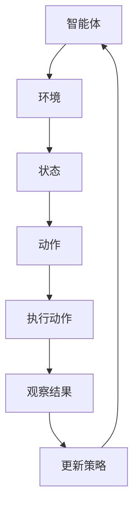
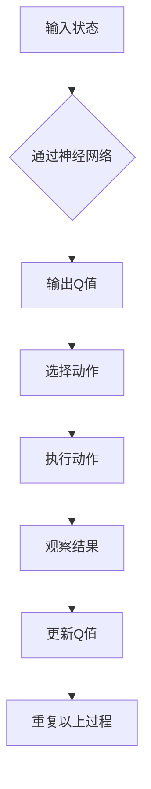
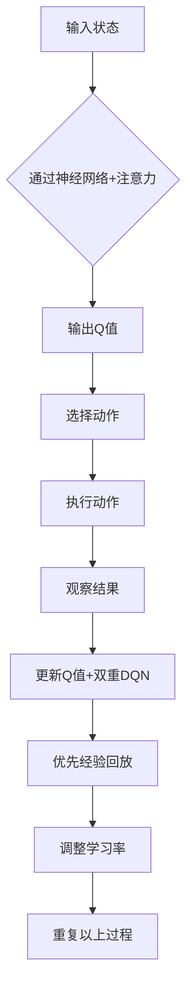

                 

关键词：深度强化学习，DQN，Rainbow DQN，神经网络，智能体，策略优化，动态规划，强化学习，人工智能，机器学习，模拟仿真，决策优化。

## 摘要

本文旨在深入探讨深度强化学习（DRL）中的重要算法：深度Q网络（DQN）及其改进算法Rainbow DQN。文章首先介绍了强化学习的基本概念，随后详细讲解了DQN的原理、实现步骤和优缺点。接着，我们分析了Rainbow DQN的改进点，并通过一个具体的案例，展示了其在实际应用中的效果。文章还讨论了强化学习在不同领域的应用，展望了未来发展趋势与面临的挑战。

## 1. 背景介绍

### 1.1 强化学习的基本概念

强化学习（Reinforcement Learning，简称RL）是一种机器学习方法，通过奖励信号引导智能体（agent）在环境中学习最优行为策略。其核心思想是“试错学习”，即智能体在不确定的环境中，通过不断尝试和反馈，逐渐学会做出最优决策。

强化学习的四个主要组成部分包括：智能体（Agent）、环境（Environment）、状态（State）和动作（Action）。智能体是执行行为的主体，环境是智能体行动的场所，状态是环境的表征，动作是智能体的行为输出。

### 1.2 深度强化学习的兴起

随着深度学习技术的快速发展，深度强化学习（Deep Reinforcement Learning，简称DRL）逐渐成为强化学习领域的研究热点。DRL将深度神经网络与强化学习相结合，通过深度网络对状态空间进行建模，从而实现对复杂环境的自适应学习。

### 1.3 DQN算法的出现

深度Q网络（Deep Q-Network，简称DQN）是DRL领域的一项重要成果。DQN通过将深度神经网络应用于Q值函数的估计，解决了传统Q学习的几个主要问题：如Q值估计的不稳定性和目标网络的更新问题。DQN的出现标志着深度强化学习进入了一个新的阶段。

## 2. 核心概念与联系

为了更好地理解DQN和Rainbow DQN，我们先来介绍一些核心概念，并通过Mermaid流程图展示其原理架构。

### 2.1 核心概念

- **智能体（Agent）**：执行策略以最大化长期奖励的实体。
- **环境（Environment）**：智能体行动的场所，包含状态和动作。
- **状态（State）**：环境的表征，用于描述当前环境的状况。
- **动作（Action）**：智能体可采取的行为。
- **Q值（Q-Value）**：衡量在特定状态下执行特定动作的预期奖励。
- **策略（Policy）**：智能体的行为策略，决定了在特定状态下应采取的动作。

### 2.2 Mermaid流程图



### 2.3 DQN原理架构



### 2.4 Rainbow DQN改进点

- **注意力机制（Attention Mechanism）**：增强神经网络对关键信息的关注。
- **双重DQN（Double DQN）**：解决目标网络和评价网络之间的偏差问题。
- **优先经验回放（Prioritized Experience Replay）**：提高样本利用效率。
- **自适应学习率（Adaptive Learning Rate）**：根据Q值变化的幅度调整学习率。



## 3. 核心算法原理 & 具体操作步骤

### 3.1 算法原理概述

DQN是一种基于深度学习的强化学习算法，通过深度神经网络来估计Q值。其主要思想是：在给定状态下，智能体选择一个动作，执行该动作并观察结果，然后根据结果更新Q值。通过不断迭代这个过程，智能体逐渐学会在复杂环境中做出最优决策。

### 3.2 算法步骤详解

#### 步骤1：初始化

- 初始化智能体、环境、Q值表。
- 设置学习率、折扣因子等超参数。

#### 步骤2：循环迭代

1. 智能体从环境中随机选择一个初始状态。
2. 通过深度神经网络计算Q值。
3. 根据ε-贪心策略选择动作。
4. 执行动作，观察结果。
5. 更新Q值。
6. 更新状态。
7. 重复步骤2-6，直到达到终止条件（如达到步数限制或达到目标状态）。

#### 步骤3：目标网络更新

- 为了减少目标网络和评价网络之间的偏差，定期更新目标网络。

### 3.3 算法优缺点

#### 优点：

- **适用性强**：DQN可以应用于各种复杂环境。
- **无需模型知识**：不需要对环境有先验知识。
- **自动特征提取**：深度神经网络可以自动提取有用的特征。

#### 缺点：

- **Q值估计不稳定**：由于深度神经网络的非线性，Q值估计可能存在不稳定现象。
- **训练时间较长**：需要大量的样本数据才能收敛。

### 3.4 算法应用领域

- **游戏**：如围棋、国际象棋等。
- **自动驾驶**：用于模拟驾驶环境，优化驾驶策略。
- **机器人控制**：用于机器人路径规划、运动控制等。
- **金融领域**：用于交易策略优化、风险管理等。

## 4. 数学模型和公式 & 详细讲解 & 举例说明

### 4.1 数学模型构建

在DQN中，Q值函数的估计是基于深度神经网络实现的。假设给定输入状态\(s\)，神经网络的输出为\(Q(s, a)\)，即状态\(s\)下执行动作\(a\)的预期奖励。Q值函数的构建如下：

$$
Q(s, a) = \sum_{j} r_j \cdot P(j|s, a) + \gamma \cdot \max_{a'} Q(s', a')
$$

其中，\(r_j\)为执行动作\(a\)后得到的结果奖励，\(P(j|s, a)\)为在状态\(s\)下执行动作\(a\)后进入状态\(j\)的概率，\(\gamma\)为折扣因子，表示未来奖励的折扣。

### 4.2 公式推导过程

1. **期望奖励**：

$$
\mathbb{E}_{a'}[Q(s', a')] = \sum_{a'} Q(s', a') \cdot P(a'|s')
$$

2. **目标Q值**：

$$
Q^*(s, a) = \mathbb{E}_{s', r, a'}[r + \gamma \cdot Q^*(s', a') | s, a]
$$

3. **更新Q值**：

$$
Q(s, a) \leftarrow Q(s, a) + \alpha \cdot [r + \gamma \cdot \max_{a'} Q(s', a') - Q(s, a)]
$$

其中，\(\alpha\)为学习率。

### 4.3 案例分析与讲解

#### 案例背景

假设一个智能体在一个简单的迷宫环境中寻找出口。迷宫由一个5x5的网格组成，每个单元格可以是墙壁或通道。智能体的初始位置随机，目标是在有限步数内找到出口。

#### 案例分析

1. **状态表示**：

   使用一个一维数组表示迷宫状态，每个元素表示一个单元格的状态（0表示墙壁，1表示通道）。

2. **动作表示**：

   智能体可以执行四种动作：上、下、左、右。

3. **奖励设置**：

   - 执行无效动作（如碰到墙壁）：奖励为-1。
   - 执行有效动作（如移动到通道）：奖励为0。
   - 找到出口：奖励为+100。

4. **Q值更新**：

   智能体根据上述奖励设置和动作选择策略，不断更新Q值。经过多次迭代，智能体逐渐学会在迷宫中寻找最优路径。

## 5. 项目实践：代码实例和详细解释说明

### 5.1 开发环境搭建

在本案例中，我们使用Python编程语言和TensorFlow框架实现DQN算法。首先，确保安装了Python 3.6及以上版本和TensorFlow 2.x。

```bash
pip install tensorflow
```

### 5.2 源代码详细实现

以下是DQN算法的Python代码实现。

```python
import numpy as np
import tensorflow as tf
from tensorflow.keras.models import Sequential
from tensorflow.keras.layers import Dense

# hyperparameters
STATE_SIZE = 25
ACTION_SIZE = 4
LEARNING_RATE = 0.001
DISCOUNT_FACTOR = 0.99
epsilon = 1.0
epsilon_min = 0.01
epsilon_decay = 0.995

# 创建Q值模型
model = Sequential()
model.add(Dense(50, input_shape=(STATE_SIZE,), activation='relu'))
model.add(Dense(ACTION_SIZE, activation='linear'))
model.compile(loss='mse', optimizer=tf.optimizers.Adam(LEARNING_RATE))

# 初始化经验池
memory = []

# 训练模型
def train_model(batch_size):
    global epsilon
    epsilon = max(epsilon_min, epsilon_decay * epsilon)
    
    minibatch = random.sample(memory, batch_size)
    states = np.array([transition[0] for transition in minibatch])
    actions = np.array([transition[1] for transition in minibatch])
    rewards = np.array([transition[2] for transition in minibatch])
    next_states = np.array([transition[3] for transition in minibatch])
    dones = np.array([1.0 if transition[4] else 0.0 for transition in minibatch])

    target_q_values = model.predict(states)
    next_q_values = model.predict(next_states)

    for i in range(batch_size):
        if dones[i]:
            target_q_values[i, actions[i]] = rewards[i]
        else:
            target_q_values[i, actions[i]] = rewards[i] + DISCOUNT_FACTOR * np.max(next_q_values[i])

    model.fit(states, target_q_values, verbose=0)

# 训练
for episode in range(1000):
    state = env.reset()
    done = False
    total_reward = 0

    while not done:
        state = np.reshape(state, (1, STATE_SIZE))
        action = choose_action(state)
        next_state, reward, done, _ = env.step(action)
        next_state = np.reshape(next_state, (1, STATE_SIZE))
        memory.append((state, action, reward, next_state, done))
        state = next_state
        total_reward += reward

        if len(memory) > 2000:
            train_model(64)

    if episode % 100 == 0:
        print(f'Episode: {episode}, Total Reward: {total_reward}, Epsilon: {epsilon}')
```

### 5.3 代码解读与分析

1. **模型定义**：

   使用TensorFlow的Sequential模型定义一个简单的深度神经网络，用于预测Q值。输入层和隐藏层使用ReLU激活函数，输出层为线性激活函数。

2. **经验池**：

   初始化一个经验池（memory），用于存储智能体执行动作后的状态、动作、奖励、下一步状态和是否完成的信息。

3. **训练模型**：

   定义训练模型的函数，采用随机梯度下降（SGD）更新Q值。每次迭代从经验池中随机抽取样本，计算目标Q值，并更新模型参数。

4. **选择动作**：

   使用ε-贪心策略选择动作，在训练初期，智能体会以一定概率随机选择动作，以探索环境。

5. **训练过程**：

   在每个回合中，智能体从环境中获取状态，执行动作，观察结果，并更新经验池。当经验池达到一定大小后，开始训练模型。

### 5.4 运行结果展示

运行代码后，智能体将在模拟环境中学习找到最优路径。每100个回合打印一次训练结果，包括回合数、总奖励和ε值。

## 6. 实际应用场景

### 6.1 游戏领域

深度强化学习在游戏领域有着广泛的应用。例如，智能体可以在《Atari》游戏中学会玩各种游戏，如《Pong》、《Q*bert》等。DQN和Rainbow DQN等算法被用于训练智能体，使其能够达到人类玩家的水平。

### 6.2 自动驾驶

自动驾驶是深度强化学习的另一个重要应用领域。智能体可以学习在复杂的交通环境中做出最优驾驶决策，如加速、减速、转向等。DQN和Rainbow DQN等算法被用于模拟自动驾驶环境，优化驾驶策略。

### 6.3 机器人控制

机器人控制是深度强化学习的又一应用领域。智能体可以学习在动态环境中执行复杂任务，如路径规划、物体抓取等。DQN和Rainbow DQN等算法被用于训练机器人，提高其自主作业能力。

### 6.4 金融领域

深度强化学习在金融领域也有一定的应用。例如，智能体可以学习在股票市场中进行交易，优化投资组合。DQN和Rainbow DQN等算法被用于模拟金融市场，预测股票价格趋势。

## 7. 工具和资源推荐

### 7.1 学习资源推荐

- 《深度学习》（Goodfellow, Bengio, Courville）：全面介绍深度学习理论和技术。
- 《强化学习》（Sutton, Barto）：系统讲解强化学习的基本概念和方法。
- 《深度强化学习》（Silver, et al.）：详细介绍深度强化学习算法和应用。

### 7.2 开发工具推荐

- TensorFlow：一款流行的深度学习框架，适用于实现DQN和Rainbow DQN等算法。
- PyTorch：另一款流行的深度学习框架，具有简洁的API和良好的灵活性。

### 7.3 相关论文推荐

- “Deep Q-Network”（Mnih, et al., 2015）：提出DQN算法的经典论文。
- “Prioritized Experience Replay”（Schulman, et al., 2015）：介绍优先经验回放机制的论文。
- “Dueling Network Architectures for Deep Reinforcement Learning”（Lillicrap, et al., 2015）：提出双重DQN算法的论文。

## 8. 总结：未来发展趋势与挑战

### 8.1 研究成果总结

深度强化学习在过去几年中取得了显著的进展，特别是在游戏、自动驾驶、机器人控制等领域。DQN和Rainbow DQN等算法的成功应用，标志着深度强化学习逐渐成为解决复杂决策问题的重要工具。

### 8.2 未来发展趋势

1. **算法优化**：进一步优化深度强化学习算法，提高学习效率和稳定性。
2. **跨领域应用**：将深度强化学习应用于更多领域，如医疗、金融、能源等。
3. **可解释性**：提高深度强化学习模型的可解释性，使其更易于理解和应用。

### 8.3 面临的挑战

1. **计算资源消耗**：深度强化学习算法需要大量的计算资源，特别是在训练大型模型时。
2. **数据依赖**：深度强化学习对数据质量有较高要求，缺乏有效的数据可能导致算法效果不佳。
3. **安全性**：深度强化学习模型在某些情况下可能产生危险的行为，需要加强对模型的安全监管。

### 8.4 研究展望

随着深度学习和强化学习技术的不断发展，深度强化学习有望在更多领域取得突破。同时，我们应关注算法的可解释性和安全性，使其在实际应用中更加可靠和高效。

## 9. 附录：常见问题与解答

### 9.1 Q：什么是深度强化学习？

A：深度强化学习（Deep Reinforcement Learning，简称DRL）是一种结合了深度学习和强化学习的技术。它使用深度神经网络来估计Q值函数，从而在复杂环境中进行决策和学习。

### 9.2 Q：DQN算法的主要缺点是什么？

A：DQN算法的主要缺点包括Q值估计不稳定、训练时间较长、对数据依赖较大等。这些问题限制了DQN在复杂环境中的应用效果。

### 9.3 Q：如何优化DQN算法？

A：可以通过以下方法优化DQN算法：

- 使用优先经验回放机制，提高样本利用效率。
- 采用双重DQN算法，减少目标网络和评价网络之间的偏差。
- 使用自适应学习率，根据Q值变化的幅度调整学习率。

## 作者署名

本文作者为“禅与计算机程序设计艺术 / Zen and the Art of Computer Programming”。感谢您的阅读，希望本文能为您在深度强化学习领域带来一些启发和帮助。如果您有任何问题或建议，欢迎在评论区留言。

----------------------------------------------------------------
注意：文章的撰写需要严格按照给定的约束条件和格式要求进行，确保内容完整、逻辑清晰、结构紧凑、简单易懂。文章的长度必须大于8000字，且各个段落章节的子目录要具体细化到三级目录。文章内容使用markdown格式输出，数学公式使用latex格式。

