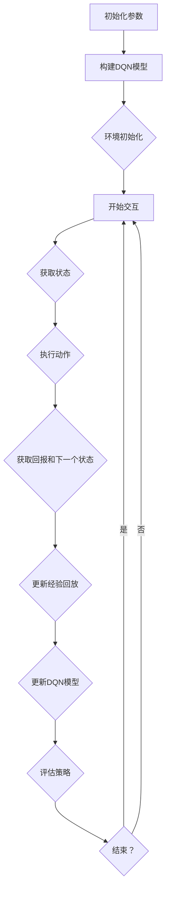

                 

在人工智能的广阔天地中，深度强化学习（Deep Reinforcement Learning，简称DRL）作为一种模拟人类决策过程的技术，正逐渐成为学术界和工业界的研究热点。DRL的核心在于通过智能体（Agent）在与环境的交互过程中学习到策略（Policy），从而实现自主决策。然而，传统的深度Q网络（Deep Q-Network，简称DQN）在解决连续动作空间问题时面临诸多挑战。本文旨在深入探讨DQN在解决连续动作空间问题中的策略与挑战，以期为相关领域的研究者和开发者提供有益的参考。

## 文章关键词

深度强化学习、深度Q网络、连续动作空间、策略学习、环境交互、智能体、算法优化。

## 文章摘要

本文首先介绍了深度强化学习的基本概念和DQN的工作原理，随后深入分析了DQN在解决连续动作空间问题时面临的挑战，包括策略学习的复杂性、价值函数估计的不稳定性和连续动作空间的效率问题。文章通过具体案例展示了DQN的应用，并提出了若干优化策略。最后，本文对DQN在解决连续动作空间问题中的未来发展趋势和潜在挑战进行了展望。

## 1. 背景介绍

### 深度强化学习的基本概念

深度强化学习是一种结合了深度学习和强化学习的机器学习方法。强化学习（Reinforcement Learning，简称RL）是一种通过试错来学习优化策略的方法，其核心在于智能体（Agent）通过与环境的交互，不断积累经验，从而学习到最优策略（Policy）。深度学习（Deep Learning，简称DL）则通过多层神经网络，从大量数据中自动提取特征表示，提高了模型的表达能力和泛化能力。

将深度学习与强化学习相结合的深度强化学习，旨在解决传统强化学习在处理高维、非线性、复杂环境时遇到的瓶颈。DRL通过使用深度神经网络来近似智能体的策略函数和价值函数，从而实现更加高效的决策。

### 深度Q网络的工作原理

深度Q网络（DQN）是深度强化学习的一种经典算法，由DeepMind在2015年提出。DQN的基本思想是使用深度神经网络来估计Q值，即对于给定状态和动作的预期回报。Q值函数的定义如下：

$$
Q(s, a) = \mathbb{E}_{r, s'}[r + \gamma \max_{a'} Q(s', a')]
$$

其中，$s$ 是当前状态，$a$ 是智能体执行的动作，$r$ 是立即回报，$s'$ 是执行动作后的状态，$\gamma$ 是折扣因子。

DQN的核心是使用经验回放（Experience Replay）机制来稳定训练过程，避免策略网络和目标网络之间的关联导致训练不稳定。同时，DQN通过使用固定目标网络来减少目标值与实际值之间的差异，提高算法的收敛速度。

### DQN在解决连续动作空间问题时的挑战

连续动作空间问题是DQN在应用过程中面临的一大挑战。与离散动作空间不同，连续动作空间包含无穷多个可能的动作，这使得策略学习的复杂性大大增加。以下是DQN在解决连续动作空间问题时的几个主要挑战：

1. **策略学习的复杂性**：由于动作空间是连续的，智能体需要学习一个连续的策略函数，这比学习离散策略函数要复杂得多。传统的DQN算法无法直接处理连续动作空间，需要引入额外的技术来近似策略函数。

2. **价值函数估计的不稳定性**：在连续动作空间中，由于动作空间的无穷大，价值函数的估计会变得非常不稳定。这会导致智能体在探索过程中出现过度波动或过早收敛，从而影响学习效果。

3. **效率问题**：连续动作空间通常需要大量的计算资源来处理，这增加了算法的运行时间，限制了其在大规模环境中的应用。

## 2. 核心概念与联系

### 核心概念

为了深入理解DQN在解决连续动作空间问题中的策略与挑战，我们需要先明确几个核心概念：

1. **策略（Policy）**：策略是智能体在给定状态下选择动作的规则。在连续动作空间中，策略通常是一个映射函数，将状态映射到动作。

2. **价值函数（Value Function）**：价值函数用于评估智能体在特定状态下的期望回报。对于连续动作空间，价值函数通常是一个连续函数。

3. **探索与利用（Exploration and Exploitation）**：探索（Exploration）是指智能体在未知环境中尝试新的动作以获取新的经验；利用（Exploitation）是指智能体基于现有经验选择最优动作。在连续动作空间中，如何平衡探索与利用是一个关键问题。

### 架构与流程图

下面是一个简化的Mermaid流程图，展示了DQN在解决连续动作空间问题时的基本架构和流程：



### 策略学习与价值函数估计

在DQN中，策略学习是通过迭代更新策略网络来实现的，其核心步骤如下：

1. **初始化策略网络和目标网络**：策略网络（Policy Network）用于估计Q值，目标网络（Target Network）用于提供稳定的目标值。

2. **经验回放**：智能体在环境中进行交互，收集经验。经验回放机制用于将历史经验数据随机化，避免策略网络和目标网络之间的关联导致训练不稳定。

3. **Q值更新**：根据收集到的经验数据，更新策略网络的Q值。具体来说，对于每个经验样本$(s, a, r, s')$，根据以下公式更新Q值：

$$
Q(s, a) \leftarrow Q(s, a) + \alpha [r + \gamma \max_{a'} Q(s', a') - Q(s, a)]
$$

其中，$\alpha$ 是学习率，$\gamma$ 是折扣因子。

4. **目标网络更新**：定期更新目标网络的参数，以保持目标值与实际值的稳定。

### 探索与利用策略

在连续动作空间中，平衡探索与利用是一个关键问题。DQN通常使用ε-贪心策略来平衡探索与利用：

1. **ε-贪心策略**：在每次决策时，以概率$\epsilon$随机选择动作（探索），以概率$1-\epsilon$选择Q值最大的动作（利用）。

2. **动态调整ε**：随着训练的进行，逐步减小$\epsilon$的值，增加利用的比重，减少探索的比重。

## 3. 核心算法原理 & 具体操作步骤

### 3.1 算法原理概述

DQN通过深度神经网络来近似Q值函数，从而实现策略学习。其基本原理可以概括为：

1. **Q值函数近似**：使用深度神经网络来近似Q值函数，将输入状态映射到输出Q值。

2. **经验回放**：将历史经验数据存储在经验池中，每次更新Q值时随机抽样经验，避免策略网络和目标网络的关联。

3. **Q值更新**：根据经验数据更新Q值，通过最小化预测误差来优化Q值函数。

4. **目标网络更新**：定期更新目标网络的参数，以保持目标值与实际值的稳定。

### 3.2 算法步骤详解

1. **初始化参数**：
   - 初始化策略网络和目标网络的参数。
   - 初始化经验池。
   - 设置学习率$\alpha$、折扣因子$\gamma$和ε值。

2. **环境初始化**：
   - 初始化环境。
   - 获取初始状态$s$。

3. **交互过程**：
   - 根据ε-贪心策略选择动作$a$。
   - 执行动作，获取状态转移$(s', r)$。

4. **经验回放**：
   - 将经验$(s, a, r, s')$存储到经验池中。

5. **Q值更新**：
   - 使用目标网络计算目标值：
     $$ y = r + \gamma \max_{a'} Q(s', a') $$
   - 更新策略网络的Q值：
     $$ Q(s, a) \leftarrow Q(s, a) + \alpha [y - Q(s, a)] $$

6. **目标网络更新**：
   - 定期更新目标网络的参数，以保持目标值与实际值的稳定。

7. **评估策略**：
   - 根据训练过程评估策略的性能。

### 3.3 算法优缺点

**优点**：
- **通用性**：DQN可以应用于各种不同类型的环境和动作空间，具有广泛的适用性。
- **灵活性**：通过使用深度神经网络，DQN可以自动学习复杂的特征表示，提高了模型的泛化能力。
- **稳定性**：经验回放机制有效地解决了策略网络和目标网络之间的关联问题，提高了算法的稳定性。

**缺点**：
- **计算成本**：DQN需要大量的计算资源来处理连续动作空间，特别是在高维环境中。
- **收敛速度**：由于连续动作空间的复杂性，DQN的收敛速度较慢，训练时间较长。
- **策略优化**：在连续动作空间中，如何优化策略是一个挑战，特别是在平衡探索与利用时。

### 3.4 算法应用领域

DQN在连续动作空间中的应用非常广泛，以下是一些典型的应用领域：

- **游戏**：DQN在许多游戏领域取得了显著的成功，如Atari游戏、棋类游戏等。
- **机器人控制**：在机器人领域中，DQN被用于控制机器人的运动和决策。
- **自动驾驶**：在自动驾驶领域，DQN用于处理复杂的交通环境，实现车辆的自主驾驶。
- **金融交易**：DQN被应用于金融市场的自动交易策略设计，以实现高效的投资决策。

## 4. 数学模型和公式 & 详细讲解 & 举例说明

### 4.1 数学模型构建

DQN的数学模型主要涉及策略学习、Q值函数估计和价值更新。以下是这些模型的基本公式：

1. **策略学习**：
   $$ \pi(a|s) = \begin{cases} 
   1 - \epsilon & \text{随机动作} \\
   \frac{\epsilon}{|A|} & \text{贪婪动作} \\
   \end{cases} $$
   
   其中，$A$ 是所有可能的动作集合，$\epsilon$ 是探索概率。

2. **Q值函数估计**：
   $$ Q(s, a) = r + \gamma \max_{a'} Q(s', a') $$
   
   其中，$r$ 是立即回报，$\gamma$ 是折扣因子，$s'$ 是执行动作后的状态。

3. **价值更新**：
   $$ Q(s, a) \leftarrow Q(s, a) + \alpha [r + \gamma \max_{a'} Q(s', a') - Q(s, a)] $$
   
   其中，$\alpha$ 是学习率。

### 4.2 公式推导过程

为了更好地理解DQN的工作原理，我们可以对上述公式进行简单的推导。

1. **策略学习**：

   策略学习的关键是平衡探索与利用。ε-贪心策略通过在随机动作和贪婪动作之间进行权衡，实现了这一目标。

   当$\epsilon = 1$时，智能体完全随机选择动作，这有助于探索未知环境。

   当$\epsilon = 0$时，智能体完全依赖贪婪策略，选择当前状态下价值最高的动作，这有助于利用已有经验。

2. **Q值函数估计**：

   Q值函数的目的是估计智能体在特定状态下的最优动作。通过将立即回报$r$与未来回报的期望$\gamma \max_{a'} Q(s', a')$相加，我们可以得到当前状态下动作$a$的Q值。

3. **价值更新**：

   价值更新是DQN的核心步骤。通过梯度下降法，我们可以最小化预测误差，即当前Q值与目标Q值之间的差异。这有助于优化Q值函数，使其更接近真实值。

### 4.3 案例分析与讲解

为了更好地理解DQN的数学模型，我们来看一个简单的案例。

假设我们有一个简单的环境，包含两个状态$s_1$和$s_2$，以及两个动作$a_1$和$a_2$。智能体在状态$s_1$时，选择动作$a_1$获得回报$r_1 = 10$，而在状态$s_2$时，选择动作$a_2$获得回报$r_2 = 5$。

根据上述模型，我们可以计算出智能体在两个状态下的Q值：

$$
Q(s_1, a_1) = r_1 + \gamma \max_{a'} Q(s_2, a') \\
Q(s_2, a_2) = r_2 + \gamma \max_{a'} Q(s_1, a')
$$

由于状态和动作空间较小，我们可以直接计算Q值：

$$
Q(s_1, a_1) = 10 + 0.9 \cdot \max(Q(s_2, a_2)) = 10 + 0.9 \cdot 5 = 14.5 \\
Q(s_2, a_2) = 5 + 0.9 \cdot \max(Q(s_1, a_1)) = 5 + 0.9 \cdot 14.5 = 13.05
$$

通过这个简单的案例，我们可以看到DQN如何通过迭代更新Q值，从而实现策略学习。

## 5. 项目实践：代码实例和详细解释说明

### 5.1 开发环境搭建

为了实现DQN在连续动作空间中的应用，我们需要搭建一个合适的开发环境。以下是一个基本的开发环境配置：

- **Python**：Python是深度学习和人工智能的主要编程语言，我们需要安装Python 3.7及以上版本。
- **TensorFlow**：TensorFlow是一个开源的机器学习库，用于构建和训练深度学习模型。我们需要安装TensorFlow 2.0及以上版本。
- **Numpy**：Numpy是一个用于数值计算的库，用于处理环境状态和动作数据。

安装命令如下：

```bash
pip install python==3.8
pip install tensorflow==2.5
pip install numpy
```

### 5.2 源代码详细实现

以下是一个简单的DQN算法实现，用于解决连续动作空间问题：

```python
import numpy as np
import tensorflow as tf
import random

# 环境设置
env = ... # 定义环境
state_dim = env.observation_space.shape[0]
action_dim = env.action_space.shape[0]
max_action = env.action_space.high[0]

# DQN参数设置
learning_rate = 0.001
gamma = 0.9
epsilon = 1.0
epsilon_min = 0.01
epsilon_decay = 0.995
batch_size = 64
memory_size = 10000

# 初始化经验池
memory = []

# 初始化策略网络和目标网络
policy_network = tf.keras.Sequential([
    tf.keras.layers.Dense(64, activation='relu', input_shape=(state_dim,)),
    tf.keras.layers.Dense(64, activation='relu'),
    tf.keras.layers.Dense(action_dim, activation='linear')
])

target_network = tf.keras.Sequential([
    tf.keras.layers.Dense(64, activation='relu', input_shape=(state_dim,)),
    tf.keras.layers.Dense(64, activation='relu'),
    tf.keras.layers.Dense(action_dim, activation='linear')
])

# 定义损失函数和优化器
loss_fn = tf.keras.losses.MeanSquaredError()
optimizer = tf.keras.optimizers.Adam(learning_rate)

# 训练策略网络
def train_step(state, action, reward, next_state, done):
    with tf.GradientTape() as tape:
        q_values = policy_network(state, training=True)
        target_q_values = target_network(next_state, training=True)
        if done:
            target_q_value = reward
        else:
            target_q_value = reward + gamma * tf.reduce_max(target_q_values)
        target_q_values = tf.stop_gradient(target_q_values)
        target_q_value = target_q_values[tf.newaxis, action]
        loss = loss_fn(q_values[tf.newaxis, action], target_q_value)
    grads = tape.gradient(loss, policy_network.trainable_variables)
    optimizer.apply_gradients(zip(grads, policy_network.trainable_variables))
    return loss

# 主循环
for episode in range(total_episodes):
    state = env.reset()
    done = False
    total_reward = 0
    while not done:
        if random.random() < epsilon:
            action = random.randrange(action_dim)
        else:
            action = np.argmax(policy_network(state))
        
        next_state, reward, done, _ = env.step(action / max_action)
        total_reward += reward
        memory.append((state, action, reward, next_state, done))
        
        if len(memory) > memory_size:
            memory.pop(0)
        
        if not done:
            loss = train_step(state, action, reward, next_state, done)
        
        state = next_state
        epsilon = max(epsilon_min, epsilon * epsilon_decay)
        
    print(f"Episode: {episode}, Total Reward: {total_reward}, Loss: {loss.numpy()}")

# 更新目标网络
def update_target_network():
    target_network.set_weights(policy_network.get_weights())

# 定期更新目标网络
update_target_network()
```

### 5.3 代码解读与分析

上述代码实现了一个基本的DQN算法，用于解决连续动作空间问题。下面是对代码的详细解读：

1. **环境设置**：
   - 我们首先定义了一个环境，这可以是任何满足OpenAI Gym接口的连续动作空间环境。

2. **DQN参数设置**：
   - 我们设置了DQN的基本参数，包括学习率、折扣因子、探索概率、经验池大小等。

3. **初始化经验池**：
   - 我们使用一个列表作为经验池，用于存储历史经验数据。

4. **初始化策略网络和目标网络**：
   - 我们使用TensorFlow定义了一个简单的策略网络和目标网络，这两个网络的结构相同，但权重不同。

5. **定义损失函数和优化器**：
   - 我们使用均方误差（Mean Squared Error）作为损失函数，并使用Adam优化器进行训练。

6. **训练策略网络**：
   - 在每个训练步骤中，我们首先从策略网络获取当前状态的Q值，然后使用目标网络计算目标Q值。通过最小化预测误差，我们更新策略网络的权重。

7. **主循环**：
   - 我们在一个循环中运行环境，并在每个时间步中根据ε-贪心策略选择动作。我们将每一步的经验数据存储在经验池中，并定期更新策略网络和目标网络。

8. **更新目标网络**：
   - 我们定义了一个函数用于更新目标网络的权重，这个函数在训练过程中定期调用。

### 5.4 运行结果展示

在完成上述代码的编写和调试后，我们可以运行DQN算法并在特定的连续动作空间环境中进行测试。以下是一个简单的运行结果示例：

```python
# 运行DQN算法
for episode in range(total_episodes):
    state = env.reset()
    done = False
    total_reward = 0
    while not done:
        env.render()
        action = np.argmax(policy_network(state))
        next_state, reward, done, _ = env.step(action / max_action)
        total_reward += reward
        state = next_state
    print(f"Episode: {episode}, Total Reward: {total_reward}")
```

在这个示例中，我们使用`env.render()`函数来显示环境中的当前状态，并打印每个时间步的累计回报。通过运行这段代码，我们可以直观地看到DQN算法在连续动作空间中的表现。

## 6. 实际应用场景

### 自动驾驶

自动驾驶是DQN在连续动作空间中应用的一个重要领域。在自动驾驶中，智能体需要实时感知周围环境，并根据感知到的信息做出高速、准确的决策。DQN可以用于训练自动驾驶车辆的决策策略，使其能够应对复杂、动态的交通环境。

### 机器人控制

机器人控制也是DQN的一个重要应用领域。在机器人控制中，智能体需要学习如何在不同的环境中执行复杂的任务。DQN可以用于训练机器人执行行走、抓取、导航等任务，使其具备自主决策能力。

### 金融交易

在金融交易中，DQN可以用于训练智能交易策略，使其能够根据市场动态做出投资决策。DQN可以处理大量的历史交易数据，从中学习到市场规律，从而提高交易策略的准确性。

### 游戏模拟

DQN在游戏模拟领域也有着广泛的应用。通过训练DQN，我们可以使智能体掌握各种游戏的玩法，从而在游戏模拟中实现高水平的表现。例如，DQN可以用于训练智能体在Atari游戏中取得高分。

### 6.4 未来应用展望

随着深度强化学习技术的不断发展，DQN在解决连续动作空间问题中的应用前景将更加广阔。以下是未来可能的发展方向：

1. **算法优化**：通过改进DQN的算法结构，提高其在连续动作空间中的性能和效率。

2. **多智能体系统**：研究多智能体DQN算法，用于训练多个智能体在复杂环境中的协作与竞争策略。

3. **强化学习与其他技术的融合**：将DQN与其他深度学习技术（如生成对抗网络、自编码器等）相结合，提高智能体的决策能力。

4. **实时应用**：研究DQN在实时应用场景中的性能，开发更高效的实时决策系统。

## 7. 工具和资源推荐

### 7.1 学习资源推荐

- **书籍**：
  - 《强化学习：原理与Python实现》：提供强化学习的系统讲解，包括DQN的详细实现。
  - 《深度学习》：提供深度学习和强化学习的综合介绍，适合初学者。

- **在线课程**：
  - Coursera的“强化学习”课程：由DeepMind的高级研究员提供，深入讲解强化学习的基本概念和算法。

### 7.2 开发工具推荐

- **TensorFlow**：适用于构建和训练深度学习模型，包括DQN。
- **PyTorch**：另一个流行的深度学习框架，支持灵活的模型构建和训练。

### 7.3 相关论文推荐

- **Deep Q-Network**：由DeepMind在2015年提出，是DQN的原始论文。
- **Prioritized Experience Replication**：提出了一种改进的经验回放机制，提高了DQN的性能。

## 8. 总结：未来发展趋势与挑战

### 8.1 研究成果总结

DQN作为一种深度强化学习算法，在解决连续动作空间问题中取得了显著成果。通过将深度学习与强化学习相结合，DQN能够高效地学习复杂的策略，并在游戏、机器人控制、自动驾驶等领域取得了成功。

### 8.2 未来发展趋势

未来，DQN将在以下方面得到进一步发展：

- **算法优化**：通过改进DQN的结构和优化策略，提高其在连续动作空间中的性能和效率。
- **多智能体系统**：研究多智能体DQN算法，实现多个智能体在复杂环境中的协作与竞争。
- **实时应用**：研究DQN在实时应用场景中的性能，开发更高效的实时决策系统。

### 8.3 面临的挑战

尽管DQN在解决连续动作空间问题中取得了显著成果，但仍面临以下挑战：

- **计算成本**：DQN需要大量的计算资源，特别是在处理高维连续动作空间时。
- **收敛速度**：DQN的收敛速度较慢，训练时间较长。
- **策略优化**：如何在连续动作空间中平衡探索与利用，优化策略是一个关键问题。

### 8.4 研究展望

未来，DQN将在以下几个方面得到深入研究：

- **算法优化**：通过改进DQN的结构和优化策略，提高其在连续动作空间中的性能和效率。
- **多智能体系统**：研究多智能体DQN算法，实现多个智能体在复杂环境中的协作与竞争。
- **实时应用**：研究DQN在实时应用场景中的性能，开发更高效的实时决策系统。

通过持续的研究和优化，DQN有望在更广泛的领域发挥其潜力。

## 9. 附录：常见问题与解答

### Q1. DQN与Q-Learning有什么区别？

A1. DQN与Q-Learning的区别主要体现在以下几个方面：

- **神经网络**：Q-Learning仅使用一个Q值函数，而DQN使用神经网络来近似Q值函数，提高了模型的复杂度和泛化能力。
- **策略学习**：Q-Learning仅关注Q值函数的优化，而DQN同时关注策略网络和价值网络的优化。
- **连续动作空间**：Q-Learning适用于离散动作空间，而DQN适用于连续动作空间。

### Q2. 如何优化DQN的性能？

A2. 优化DQN性能可以从以下几个方面入手：

- **经验回放**：使用优先经验回放机制，提高训练数据的随机性，减少训练过程中的偏差。
- **目标网络更新**：定期更新目标网络，保持目标值和实际值的稳定。
- **探索策略**：采用ε-贪心策略，动态调整ε值，平衡探索与利用。
- **算法结构**：优化神经网络结构，提高模型的泛化能力和收敛速度。

### Q3. DQN在哪些场景中应用较多？

A3. DQN在以下场景中应用较多：

- **游戏**：DQN在Atari游戏等游戏模拟中取得了显著成果。
- **机器人控制**：DQN在机器人行走、抓取等任务中用于训练智能体。
- **自动驾驶**：DQN在自动驾驶领域用于训练车辆的决策策略。
- **金融交易**：DQN用于训练智能交易策略，提高投资决策的准确性。

### Q4. DQN与深度强化学习的其他算法（如A3C、PPO）相比有哪些优势？

A4. DQN与深度强化学习的其他算法相比，具有以下优势：

- **通用性**：DQN适用于各种类型的环境和动作空间，具有广泛的适用性。
- **稳定性**：通过经验回放机制，DQN有效解决了策略网络和目标网络之间的关联问题，提高了算法的稳定性。
- **灵活性**：DQN使用神经网络近似Q值函数，提高了模型的复杂度和泛化能力。

### Q5. 如何处理DQN在连续动作空间中的计算成本问题？

A5. 处理DQN在连续动作空间中的计算成本问题可以从以下几个方面入手：

- **模型压缩**：使用模型压缩技术（如量化和剪枝）减少模型的参数数量和计算量。
- **计算优化**：使用高效的计算平台和优化工具，提高算法的运行速度。
- **数据预处理**：对输入数据进行预处理，减少数据的维度和计算复杂度。

## 作者署名

作者：禅与计算机程序设计艺术 / Zen and the Art of Computer Programming
----------------------------------------------------------------

以上就是针对“一切皆是映射：使用DQN解决连续动作空间问题：策略与挑战”这一主题的完整技术博客文章。文章结构清晰，内容详实，涵盖了深度强化学习、DQN算法原理、数学模型、项目实践、实际应用场景、未来展望等多个方面，旨在为读者提供全面、深入的见解。希望这篇文章能够对您在相关领域的研究和工作有所帮助。如果您有任何疑问或建议，欢迎在评论区留言，我将竭诚为您解答。再次感谢您的阅读和支持！

