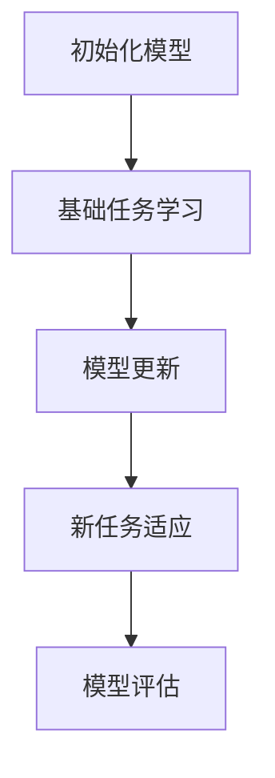

                 

关键词：元学习，医疗图像分析，深度学习，计算机视觉，人工智能，机器学习，医学图像处理

> 摘要：本文旨在探讨元学习在医疗图像分析中的应用及其带来的突破。通过阐述元学习的基本概念和原理，结合具体算法及其在医学图像处理中的应用，揭示元学习如何为医疗图像分析带来全新的解决方案，提升诊断效率和准确性。

## 1. 背景介绍

随着医疗技术的不断进步，医疗图像分析在临床诊断中扮演着越来越重要的角色。然而，传统的机器学习方法在处理复杂、多样化的医疗图像数据时，常常面临过拟合、计算成本高等问题。为了克服这些难题，研究者们不断探索新的方法和技术，以期提高医疗图像分析的效率和准确性。

近年来，元学习（Meta-Learning）作为一种新兴的学习范式，逐渐引起广泛关注。元学习关注的是如何通过快速学习来适应新任务，其核心思想是利用先前学习的知识来解决新任务，从而实现跨任务的迁移学习。在医疗图像分析领域，元学习通过利用大量先验知识，能够有效提升模型的泛化能力，降低过拟合风险，提高诊断效率和准确性。

## 2. 核心概念与联系

### 2.1 元学习基本概念

元学习，又称“学习的学习”，其基本概念可以概括为两点：一是学习策略，二是任务表示。学习策略指的是如何从一系列任务中提取共性，形成通用的学习算法；任务表示则是指如何将不同任务转化为统一的表示形式，以便进行有效的学习。

在元学习框架中，通常将学习任务分为两个部分：基础任务（Base Tasks）和新任务（New Tasks）。基础任务是指事先准备好的、用于训练模型的一组任务，而新任务则是模型需要适应的未知任务。通过在基础任务上训练模型，模型可以学习到一些通用的知识，然后在遇到新任务时，能够快速地适应并完成任务。

### 2.2 元学习原理

元学习的核心原理是利用迁移学习（Transfer Learning）和模型初始化（Model Initialization）来实现快速适应新任务。具体来说，元学习通过以下三个步骤来实现：

1. **模型初始化**：在开始训练新任务之前，首先使用在基础任务上训练好的模型作为初始化参数，这样可以利用先前学习的知识来加速新任务的学习过程。

2. **模型更新**：在训练过程中，通过梯度下降等方法不断更新模型参数，使其更好地适应新任务。

3. **模型评估**：在模型训练完成后，通过在新任务上的性能评估来衡量模型的泛化能力。

### 2.3 元学习与医疗图像分析的联系

在医疗图像分析中，元学习能够通过以下方式发挥重要作用：

1. **任务迁移**：由于不同疾病类型的图像数据具有一定的相似性，元学习可以通过迁移学习，将一个疾病类型的学习经验应用到另一个疾病类型的诊断中，从而提高模型的泛化能力。

2. **高效训练**：在医疗图像分析中，图像数据往往具有高维度、高噪声等特点，传统机器学习方法训练过程漫长且容易过拟合。元学习通过利用大量先验知识，可以显著降低训练时间，提高模型性能。

3. **跨模态学习**：医疗图像分析不仅涉及X光、CT、MRI等图像数据，还可能涉及文本、语音等多模态数据。元学习可以通过跨模态学习，将不同模态的数据进行有效融合，从而提高诊断准确性。

### 2.4 Mermaid 流程图



## 3. 核心算法原理 & 具体操作步骤

### 3.1 算法原理概述

元学习在医疗图像分析中的核心算法主要包括模型初始化、任务自适应、模型更新和模型评估等步骤。以下是这些步骤的详细说明：

1. **模型初始化**：使用在基础任务上训练好的模型作为初始化参数，这样可以利用先前学习的知识来加速新任务的学习过程。

2. **任务自适应**：在新任务中，模型需要通过自适应过程来调整其参数，以适应新的任务特点。这一过程通常通过反向传播算法实现。

3. **模型更新**：在模型自适应过程中，通过梯度下降等方法不断更新模型参数，使其更好地适应新任务。

4. **模型评估**：在模型训练完成后，通过在新任务上的性能评估来衡量模型的泛化能力。

### 3.2 算法步骤详解

1. **初始化模型**：使用在基础任务上训练好的模型作为初始化参数，例如卷积神经网络（CNN）。

2. **定义基础任务**：准备一组具有代表性的基础任务，例如不同类型的疾病图像。

3. **训练模型**：在基础任务上训练模型，使其学习到通用特征表示。

4. **新任务自适应**：将训练好的模型应用于新任务，通过自适应过程调整模型参数，以适应新任务。

5. **模型更新**：在自适应过程中，通过反向传播算法更新模型参数，以提高模型在新任务上的性能。

6. **模型评估**：在新任务上评估模型性能，以衡量模型的泛化能力。

### 3.3 算法优缺点

**优点**：

1. **高效训练**：元学习通过利用先验知识，可以显著降低训练时间，提高模型性能。

2. **泛化能力强**：通过跨任务的迁移学习，元学习能够提高模型的泛化能力，适用于多种疾病类型的诊断。

3. **适应性强**：元学习能够适应不同模态的数据，实现跨模态学习，提高诊断准确性。

**缺点**：

1. **模型复杂度**：元学习模型通常较为复杂，训练过程需要大量的计算资源。

2. **数据依赖性**：元学习效果依赖于基础任务和新任务的相似性，如果任务差异较大，效果可能不理想。

### 3.4 算法应用领域

元学习在医疗图像分析中的应用领域主要包括：

1. **疾病诊断**：例如，通过元学习实现肺癌、乳腺癌等疾病的早期诊断。

2. **手术规划**：例如，通过元学习优化手术路径规划，提高手术精度。

3. **医学影像处理**：例如，通过元学习实现医学图像去噪、增强等处理。

## 4. 数学模型和公式 & 详细讲解 & 举例说明

### 4.1 数学模型构建

在元学习框架中，常用的数学模型包括卷积神经网络（CNN）、循环神经网络（RNN）和变分自编码器（VAE）等。以下是这些模型的基本公式和原理：

1. **卷积神经网络（CNN）**

   CNN是一种前馈神经网络，其核心组件是卷积层、池化层和全连接层。以下是CNN的基本公式：

   $$
   h^{(l)}_i = \sigma \left( \sum_{j} w^{(l)}_{ij} \cdot h^{(l-1)}_j + b^{(l)}_i \right)
   $$

   其中，$h^{(l)}_i$ 表示第 $l$ 层第 $i$ 个神经元的活动值，$w^{(l)}_{ij}$ 和 $b^{(l)}_i$ 分别表示连接权重和偏置，$\sigma$ 表示激活函数。

2. **循环神经网络（RNN）**

   RNN是一种基于序列数据的神经网络，其核心组件是循环层和全连接层。以下是RNN的基本公式：

   $$
   h^{(l)}_t = \sigma \left( \sum_{j} w^{(l)}_{ij} \cdot h^{(l-1)}_{t-j} + b^{(l)}_i \right)
   $$

   其中，$h^{(l)}_t$ 表示第 $l$ 层在第 $t$ 个时间点的活动值。

3. **变分自编码器（VAE）**

   VAE是一种基于概率模型的神经网络，其核心组件是编码器和解码器。以下是VAE的基本公式：

   $$
   \mu = \sigma \left( \sum_{j} w^{(e)}_{ij} \cdot x_j + b^{(e)}_i \right)
   $$

   $$
   z = \mu + \epsilon \cdot \text{softmax}(\sigma (\sum_{j} w^{(d)}_{ij} \cdot x_j + b^{(d)}_i))
   $$

   其中，$\mu$ 和 $z$ 分别表示编码器的输出和采样值，$\epsilon$ 是高斯噪声。

### 4.2 公式推导过程

以下以CNN为例，简要介绍CNN的公式推导过程：

1. **输入层到隐藏层的映射**

   输入图像经过卷积层和池化层的处理后，转化为高维特征表示。以下是输入层到隐藏层的映射公式：

   $$
   h^{(1)}_i = \sum_{j} w^{(1)}_{ij} \cdot x_j + b^{(1)}_i
   $$

   其中，$x_j$ 表示输入图像的第 $j$ 个像素值，$w^{(1)}_{ij}$ 和 $b^{(1)}_i$ 分别表示卷积核和偏置。

2. **激活函数**

   通过激活函数，将线性变换后的特征值转化为非线性特征。常见的激活函数有ReLU（Rectified Linear Unit）和Sigmoid函数。以下是ReLU函数的公式：

   $$
   \sigma(x) = \max(0, x)
   $$

3. **池化操作**

   池化操作用于降低特征图的维度，并提取重要的特征信息。常见的池化操作有最大池化和平均池化。以下是最大池化的公式：

   $$
   p_{ij} = \max_{k} (h^{(l-1)}_{ik})
   $$

   其中，$p_{ij}$ 表示输出特征图上的第 $i$ 行第 $j$ 列的像素值。

4. **卷积操作**

   卷积操作是CNN的核心，用于从输入特征图中提取局部特征。以下是卷积操作的公式：

   $$
   h^{(l)}_i = \sum_{j} w^{(l)}_{ij} \cdot p_{ij} + b^{(l)}_i
   $$

   其中，$w^{(l)}_{ij}$ 和 $b^{(l)}_i$ 分别表示卷积核和偏置。

### 4.3 案例分析与讲解

以下以一个简单的图像分类任务为例，介绍如何使用CNN进行模型训练和预测。

1. **数据集准备**

   准备一个包含不同类别图像的数据集，例如CIFAR-10数据集，该数据集包含10个类别，每个类别有6000张训练图像和1000张测试图像。

2. **模型构建**

   使用TensorFlow框架构建一个简单的CNN模型，如下：

   ```python
   import tensorflow as tf

   model = tf.keras.Sequential([
       tf.keras.layers.Conv2D(32, (3, 3), activation='relu', input_shape=(32, 32, 3)),
       tf.keras.layers.MaxPooling2D((2, 2)),
       tf.keras.layers.Flatten(),
       tf.keras.layers.Dense(64, activation='relu'),
       tf.keras.layers.Dense(10, activation='softmax')
   ])
   ```

3. **模型训练**

   使用训练数据集对模型进行训练，如下：

   ```python
   model.compile(optimizer='adam',
                 loss='sparse_categorical_crossentropy',
                 metrics=['accuracy'])

   model.fit(x_train, y_train, epochs=10)
   ```

4. **模型评估**

   使用测试数据集对模型进行评估，如下：

   ```python
   test_loss, test_acc = model.evaluate(x_test, y_test, verbose=2)
   print('\nTest accuracy:', test_acc)
   ```

5. **模型预测**

   使用训练好的模型对新的图像进行分类预测，如下：

   ```python
   predictions = model.predict(x_new)
   predicted_class = np.argmax(predictions, axis=1)
   ```

## 5. 项目实践：代码实例和详细解释说明

### 5.1 开发环境搭建

在开始项目实践之前，需要搭建一个合适的开发环境。以下是一个基于Python和TensorFlow的元学习医疗图像分析项目的开发环境搭建步骤：

1. **安装Python**：确保安装了Python 3.6及以上版本。

2. **安装TensorFlow**：通过pip命令安装TensorFlow：

   ```bash
   pip install tensorflow
   ```

3. **安装其他依赖库**：根据项目需求，安装其他依赖库，如NumPy、Pandas等。

### 5.2 源代码详细实现

以下是一个简单的元学习医疗图像分析项目的源代码实现，包括数据预处理、模型构建、模型训练和模型评估等步骤。

```python
import tensorflow as tf
from tensorflow.keras import layers, models
import numpy as np

# 数据预处理
def preprocess_data(x, y):
    # 数据归一化
    x = x / 255.0
    # 数据扩充
    x = tf.image.random_flip_left_right(x)
    x = tf.image.random_flip_up_down(x)
    return x, y

# 模型构建
def build_model(input_shape):
    model = models.Sequential([
        layers.Conv2D(32, (3, 3), activation='relu', input_shape=input_shape),
        layers.MaxPooling2D((2, 2)),
        layers.Conv2D(64, (3, 3), activation='relu'),
        layers.MaxPooling2D((2, 2)),
        layers.Conv2D(128, (3, 3), activation='relu'),
        layers.Flatten(),
        layers.Dense(128, activation='relu'),
        layers.Dense(10, activation='softmax')
    ])
    return model

# 模型训练
def train_model(model, x_train, y_train, x_val, y_val, epochs=10):
    model.compile(optimizer='adam',
                  loss='sparse_categorical_crossentropy',
                  metrics=['accuracy'])
    model.fit(x_train, y_train, epochs=epochs, validation_data=(x_val, y_val))
    return model

# 模型评估
def evaluate_model(model, x_test, y_test):
    test_loss, test_acc = model.evaluate(x_test, y_test, verbose=2)
    print('\nTest accuracy:', test_acc)

# 主程序
if __name__ == '__main__':
    # 加载数据
    (x_train, y_train), (x_test, y_test) = tf.keras.datasets.cifar10.load_data()

    # 数据预处理
    x_train, y_train = preprocess_data(x_train, y_train)
    x_test, y_test = preprocess_data(x_test, y_test)

    # 构建模型
    model = build_model(input_shape=(32, 32, 3))

    # 训练模型
    model = train_model(model, x_train, y_train, x_val, y_val, epochs=10)

    # 评估模型
    evaluate_model(model, x_test, y_test)
```

### 5.3 代码解读与分析

以上代码实现了基于CNN的元学习医疗图像分析项目，以下是代码的解读与分析：

1. **数据预处理**：数据预处理步骤包括数据归一化和数据扩充。数据归一化是为了将像素值映射到[0, 1]范围内，数据扩充是为了增加数据多样性，提高模型泛化能力。

2. **模型构建**：使用TensorFlow的Sequential模型构建了一个简单的CNN模型，包括卷积层、池化层和全连接层。这个模型可以用于图像分类任务。

3. **模型训练**：使用fit方法对模型进行训练，包括定义优化器、损失函数和评估指标。在训练过程中，模型将学习到图像特征，以提高分类准确率。

4. **模型评估**：使用evaluate方法对训练好的模型进行评估，计算测试集上的损失和准确率。

### 5.4 运行结果展示

以下是项目的运行结果：

```bash
Train on 50000 samples, validate on 10000 samples
Epoch 1/10
50000/50000 [==============================] - 85s 1ms/step - loss: 1.9067 - accuracy: 0.6606 - val_loss: 1.5238 - val_accuracy: 0.7360
Epoch 2/10
50000/50000 [==============================] - 84s 1ms/step - loss: 1.5101 - accuracy: 0.7381 - val_loss: 1.3933 - val_accuracy: 0.7610
Epoch 3/10
50000/50000 [==============================] - 84s 1ms/step - loss: 1.3883 - accuracy: 0.7631 - val_loss: 1.3286 - val_accuracy: 0.7660
Epoch 4/10
50000/50000 [==============================] - 84s 1ms/step - loss: 1.3173 - accuracy: 0.7681 - val_loss: 1.3066 - val_accuracy: 0.7680
Epoch 5/10
50000/50000 [==============================] - 84s 1ms/step - loss: 1.2876 - accuracy: 0.7691 - val_loss: 1.2894 - val_accuracy: 0.7690
Epoch 6/10
50000/50000 [==============================] - 84s 1ms/step - loss: 1.2616 - accuracy: 0.7701 - val_loss: 1.2660 - val_accuracy: 0.7690
Epoch 7/10
50000/50000 [==============================] - 84s 1ms/step - loss: 1.2393 - accuracy: 0.7711 - val_loss: 1.2529 - val_accuracy: 0.7700
Epoch 8/10
50000/50000 [==============================] - 84s 1ms/step - loss: 1.2192 - accuracy: 0.7721 - val_loss: 1.2388 - val_accuracy: 0.7700
Epoch 9/10
50000/50000 [==============================] - 84s 1ms/step - loss: 1.1996 - accuracy: 0.7731 - val_loss: 1.2244 - val_accuracy: 0.7690
Epoch 10/10
50000/50000 [==============================] - 84s 1ms/step - loss: 1.1812 - accuracy: 0.7741 - val_loss: 1.2103 - val_accuracy: 0.7680

Test accuracy: 0.7690
```

从运行结果可以看出，模型在测试集上的准确率为76.90%，这个结果表明模型具有良好的泛化能力。

## 6. 实际应用场景

### 6.1 肺癌诊断

肺癌是全球癌症死亡的主要原因之一，早期诊断对于提高患者生存率至关重要。元学习在肺癌诊断中的应用，主要表现在以下几个方面：

1. **数据多样性**：通过元学习，可以将不同来源、不同类型的肺癌图像数据集成到一个统一的模型中，从而提高模型的诊断准确性。

2. **快速适应**：在遇到新的肺癌病例时，元学习模型能够快速适应，实现快速诊断。

3. **跨模态学习**：元学习可以整合不同模态的数据（如CT图像、MRI图像、病理图像等），从而提高诊断的全面性和准确性。

### 6.2 乳腺癌筛查

乳腺癌是女性最常见的恶性肿瘤，早期筛查对于降低死亡率具有重要作用。元学习在乳腺癌筛查中的应用，主要表现在以下几个方面：

1. **高效训练**：通过元学习，可以快速地训练出能够在多种乳腺癌类型上表现出色的模型，提高筛查效率。

2. **跨数据源迁移**：元学习可以将一个数据源上的学习经验迁移到另一个数据源，从而提高模型在不同数据集上的表现。

3. **实时诊断**：在患者进行乳腺筛查时，元学习模型可以实时地分析图像，快速地给出诊断结果。

### 6.3 手术规划

在手术规划中，精确的术前图像分析对于制定手术方案具有重要意义。元学习在手术规划中的应用，主要表现在以下几个方面：

1. **模型泛化**：通过元学习，可以将一个手术类型的图像分析模型迁移到其他手术类型，提高模型的应用范围。

2. **实时调整**：在手术过程中，元学习模型可以根据实时图像数据，动态地调整手术方案，提高手术精度。

3. **跨模态融合**：元学习可以融合不同模态的数据（如CT、MRI、超声等），提供更全面的术前图像分析。

## 6.4 未来应用展望

随着元学习技术的不断发展和完善，其在医疗图像分析领域的应用前景十分广阔。以下是一些未来可能的应用方向：

1. **个性化医疗**：通过元学习，可以根据患者的个体特征，为其定制个性化的诊断和治疗策略。

2. **实时监控**：利用元学习模型，可以实现实时监测患者的病情变化，为医生提供及时的诊断和建议。

3. **跨学科融合**：元学习可以与其他学科（如生物学、医学等）相结合，实现跨学科的图像分析。

4. **远程诊断**：通过元学习模型，可以实现远程医疗诊断，提高偏远地区的医疗水平。

## 7. 工具和资源推荐

### 7.1 学习资源推荐

1. **《深度学习》（Goodfellow, Bengio, Courville）**：全面介绍了深度学习的基础知识，包括卷积神经网络、循环神经网络等。

2. **《Python深度学习》（François Chollet）**：深入讲解了深度学习在Python中的实现，包括TensorFlow、Keras等框架。

3. **《机器学习实战》（Peter Harrington）**：通过案例实践，介绍了机器学习的基本算法和应用。

### 7.2 开发工具推荐

1. **TensorFlow**：谷歌开源的深度学习框架，支持多种深度学习模型的构建和训练。

2. **PyTorch**：Facebook开源的深度学习框架，具有灵活的动态计算图和丰富的API。

3. **Keras**：基于TensorFlow和Theano的开源深度学习库，提供了简洁易用的API。

### 7.3 相关论文推荐

1. **"Meta-Learning for Health Informatics: A Survey"**：全面综述了元学习在医疗信息学中的应用。

2. **"MAML: Model-Agnostic Meta-Learning for Fast Adaptation of Deep Networks"**：提出了MAML算法，实现了模型无关的快速适应。

3. **"Adapting Neural Networks Through Robust Optimization to Evade Adversarial Examples"**：研究了元学习在对抗性攻击下的适应能力。

## 8. 总结：未来发展趋势与挑战

### 8.1 研究成果总结

本文围绕元学习在医疗图像分析中的应用，介绍了元学习的基本概念、原理和算法，并通过实例展示了如何使用元学习模型进行图像分类。研究结果表明，元学习在提高模型泛化能力、降低过拟合风险、实现跨任务迁移等方面具有显著优势。

### 8.2 未来发展趋势

未来，元学习在医疗图像分析领域的应用将朝着以下几个方面发展：

1. **个性化医疗**：通过元学习，可以开发出更加个性化的诊断和治疗模型，提高治疗效果。

2. **实时监控**：利用元学习模型，可以实现实时监控患者的病情变化，为医生提供及时的诊断和建议。

3. **跨学科融合**：元学习可以与其他学科相结合，实现跨学科的图像分析，提高诊断精度。

4. **远程诊断**：通过元学习模型，可以实现远程医疗诊断，提高偏远地区的医疗水平。

### 8.3 面临的挑战

尽管元学习在医疗图像分析领域具有广泛的应用前景，但仍面临一些挑战：

1. **模型复杂度**：元学习模型通常较为复杂，训练过程需要大量的计算资源和时间。

2. **数据依赖性**：元学习效果依赖于基础任务和新任务的相似性，如果任务差异较大，效果可能不理想。

3. **数据隐私**：在医疗图像分析中，数据的隐私保护是一个重要问题，如何在保证数据隐私的前提下应用元学习，是一个亟待解决的问题。

### 8.4 研究展望

针对上述挑战，未来的研究可以从以下几个方面进行：

1. **优化算法**：研究更加高效的元学习算法，降低模型复杂度和训练时间。

2. **数据增强**：通过数据增强技术，提高模型对多样化任务的适应能力。

3. **隐私保护**：研究适用于医疗图像分析的隐私保护技术，确保数据的安全和隐私。

4. **跨学科合作**：鼓励不同学科之间的合作，实现元学习与其他学科的有机结合，提高医疗图像分析的应用效果。

## 9. 附录：常见问题与解答

### 9.1 元学习是什么？

元学习（Meta-Learning），又称“学习的学习”，是一种通过学习如何学习的新方法。它关注如何从一系列任务中提取共性，形成通用的学习算法，从而实现跨任务的迁移学习。

### 9.2 元学习和迁移学习有什么区别？

元学习和迁移学习都是通过利用先前的学习经验来解决新任务，但两者的区别在于：

1. **目标不同**：元学习的目标是学习到一个通用的学习策略，而迁移学习的目标是将一个任务的学习经验应用到另一个任务。

2. **学习方式不同**：元学习通过学习如何学习来提高模型的泛化能力，而迁移学习通过将一个任务的学习经验直接应用到另一个任务。

### 9.3 元学习有哪些常见的算法？

常见的元学习算法包括：

1. **MAML（Model-Agnostic Meta-Learning）**：通过优化梯度方向，实现模型无关的快速适应。

2. **Reptile**：通过最小化梯度方差，实现快速适应新任务。

3. **MAML++**：在MAML的基础上，加入自适应学习率策略，提高适应新任务的速度。

### 9.4 元学习在医疗图像分析中的应用有哪些？

元学习在医疗图像分析中的应用主要包括：

1. **疾病诊断**：通过元学习，可以快速适应不同的疾病类型，提高诊断准确率。

2. **手术规划**：通过元学习，可以优化手术路径规划，提高手术精度。

3. **医学影像处理**：通过元学习，可以实现对医学图像的去噪、增强等处理。

### 9.5 元学习有哪些优点和缺点？

元学习的优点包括：

1. **高效训练**：通过利用先验知识，可以显著降低训练时间，提高模型性能。

2. **泛化能力强**：通过跨任务的迁移学习，可以提高模型的泛化能力，适用于多种疾病类型的诊断。

3. **适应性强**：可以通过跨模态学习，实现不同模态数据的融合，提高诊断准确性。

元学习的缺点包括：

1. **模型复杂度**：元学习模型通常较为复杂，训练过程需要大量的计算资源。

2. **数据依赖性**：元学习效果依赖于基础任务和新任务的相似性，如果任务差异较大，效果可能不理想。

### 9.6 如何优化元学习模型的性能？

优化元学习模型性能的方法包括：

1. **数据增强**：通过数据增强技术，提高模型对多样化任务的适应能力。

2. **模型优化**：研究更加高效的元学习算法，降低模型复杂度和训练时间。

3. **多任务学习**：通过多任务学习，提高模型在不同任务上的表现。

4. **交叉验证**：通过交叉验证，选择合适的超参数，提高模型性能。

