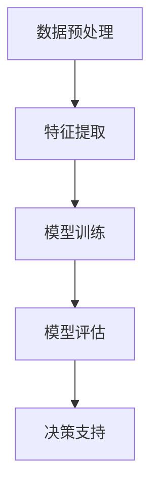

                 

 > **关键词：** 人工智能，映射，数字世界，现实世界，数学模型，算法，编程实践，应用场景，未来展望

> **摘要：** 本文旨在探讨人工智能领域中映射的概念，从数字世界到现实世界的转换过程。通过阐述核心概念、算法原理、数学模型以及实际应用案例，本文揭示了人工智能如何通过映射实现具象化，以及其在各领域的广泛应用和未来发展趋势。

## 1. 背景介绍

人工智能（Artificial Intelligence，AI）作为计算机科学的一个分支，旨在通过模拟人类智能行为，实现机器的自我学习、推理、决策等功能。随着计算能力的提升和大数据技术的发展，人工智能在诸多领域取得了显著成果，如语音识别、图像处理、自然语言处理等。

然而，人工智能的实现离不开一个核心概念——映射。映射是指将一种数据结构或概念转换成另一种数据结构或概念的过程。在人工智能领域，映射技术被广泛应用于模型训练、预测、决策等环节，使得数字世界与现实世界之间的联系更加紧密。

本文将围绕映射这一主题，深入探讨人工智能如何实现从数字到现实的转换，并通过具体案例展示其在各领域的应用。

## 2. 核心概念与联系

### 2.1 映射的定义

映射（Mapping）是一种函数关系，用于将一个集合中的元素映射到另一个集合中。在数学中，映射通常表示为 $f: A \rightarrow B$，其中 $A$ 和 $B$ 分别代表两个集合，$f$ 是从 $A$ 到 $B$ 的映射。映射可以是单射、满射或双射，具体取决于映射的性质。

### 2.2 映射在人工智能中的应用

在人工智能领域，映射技术被广泛应用于以下几个方面：

1. **数据预处理：** 映射技术可以帮助将原始数据转换为适合模型训练的形式。例如，在图像处理中，映射技术可以用于调整图像的大小、色彩空间等。

2. **特征提取：** 映射技术可以提取数据中的关键特征，以便于后续的模型训练和预测。例如，在文本分类中，映射技术可以用于将文本转换为词向量。

3. **模型训练：** 映射技术可以帮助将输入数据映射到输出结果。例如，在神经网络中，映射技术用于将输入数据通过多层神经网络转换为预测结果。

4. **决策支持：** 映射技术可以用于将业务规则映射到决策系统中，以便于实时决策。例如，在金融领域，映射技术可以用于将风险因素映射到投资组合中。

### 2.3 Mermaid 流程图

以下是映射在人工智能中的架构流程图：



在该流程图中，数据预处理阶段通过映射技术将原始数据转换为适合模型训练的形式；特征提取阶段通过映射技术提取关键特征；模型训练阶段通过映射技术将输入数据映射到输出结果；模型评估阶段对模型进行评估；决策支持阶段通过映射技术将业务规则映射到决策系统中。

## 3. 核心算法原理 & 具体操作步骤

### 3.1 算法原理概述

在人工智能领域中，映射算法通常分为以下几类：

1. **线性映射：** 线性映射是指将输入数据映射到高维空间，以便于分类或回归。常见的线性映射算法包括线性回归、逻辑回归等。

2. **非线性映射：** 非线性映射是指将输入数据映射到高维空间，以便于分类或回归。常见的非线性映射算法包括神经网络、支持向量机等。

3. **嵌入映射：** 嵌入映射是指将输入数据映射到低维空间，以便于数据分析。常见的嵌入映射算法包括主成分分析（PCA）、t-SNE等。

### 3.2 算法步骤详解

以下是映射算法的典型步骤：

1. **数据预处理：** 对输入数据集进行清洗、归一化等处理，以便于后续的映射操作。

2. **特征提取：** 根据映射算法的要求，提取输入数据中的关键特征。

3. **映射操作：** 将提取出的特征映射到高维或低维空间，以便于分类或回归。

4. **模型训练：** 使用映射后的数据对模型进行训练，以便于预测或决策。

5. **模型评估：** 对训练好的模型进行评估，以便于调整模型参数或更换算法。

6. **决策支持：** 将映射后的数据应用于实际场景，提供决策支持。

### 3.3 算法优缺点

**线性映射：**

- 优点：计算效率高，易于实现。
- 缺点：在处理非线性问题时效果较差。

**非线性映射：**

- 优点：能够处理非线性问题，适应性强。
- 缺点：计算复杂度较高，训练时间较长。

**嵌入映射：**

- 优点：能够将高维数据映射到低维空间，降低数据维度。
- 缺点：在映射过程中可能丢失部分信息。

### 3.4 算法应用领域

映射算法在人工智能领域的应用非常广泛，包括但不限于以下领域：

1. **计算机视觉：** 用于图像分类、目标检测、图像生成等任务。
2. **自然语言处理：** 用于文本分类、情感分析、机器翻译等任务。
3. **推荐系统：** 用于用户兴趣建模、商品推荐等任务。
4. **金融领域：** 用于风险评估、投资组合优化等任务。
5. **医疗领域：** 用于疾病诊断、药物研发等任务。

## 4. 数学模型和公式 & 详细讲解 & 举例说明

### 4.1 数学模型构建

在映射算法中，常用的数学模型包括线性模型、非线性模型和嵌入模型。

**线性模型：**

假设我们有一个输入向量 $x \in \mathbb{R}^n$，要将其映射到输出向量 $y \in \mathbb{R}^m$。线性模型可以表示为：

$$
y = Ax + b
$$

其中，$A$ 是一个 $m \times n$ 的权重矩阵，$b$ 是一个 $m$ 维的偏置向量。

**非线性模型：**

非线性模型通常通过在输入向量上添加非线性函数来实现。一个简单的非线性模型可以表示为：

$$
y = \sigma(Wx + b)
$$

其中，$\sigma$ 是一个非线性激活函数，如 sigmoid 函数、ReLU 函数等；$W$ 是一个 $m \times n$ 的权重矩阵，$b$ 是一个 $m$ 维的偏置向量。

**嵌入模型：**

嵌入模型通常用于将高维数据映射到低维空间。一个简单的嵌入模型可以表示为：

$$
y = f(x)
$$

其中，$f$ 是一个映射函数，通常使用神经网络来实现。

### 4.2 公式推导过程

以线性模型为例，我们介绍其推导过程。

假设我们有一个训练数据集 $D = \{ (x_1, y_1), (x_2, y_2), \ldots, (x_n, y_n) \}$，其中 $x_i \in \mathbb{R}^n$ 是输入向量，$y_i \in \mathbb{R}^m$ 是输出向量。我们的目标是找到一个线性模型 $y = Ax + b$，使得输出结果与实际结果尽可能接近。

为了求解权重矩阵 $A$ 和偏置向量 $b$，我们可以使用最小二乘法。具体地，我们定义一个损失函数：

$$
L(A, b) = \sum_{i=1}^n (y_i - (Ax_i + b))^2
$$

我们的目标是使得损失函数最小。通过求导并令导数为零，我们可以得到最优的权重矩阵 $A$ 和偏置向量 $b$：

$$
\frac{\partial L}{\partial A} = -2 \sum_{i=1}^n (y_i - (Ax_i + b))x_i = 0
$$

$$
\frac{\partial L}{\partial b} = -2 \sum_{i=1}^n (y_i - (Ax_i + b)) = 0
$$

解上述方程组，我们可以得到最优的权重矩阵 $A$ 和偏置向量 $b$。

### 4.3 案例分析与讲解

假设我们有一个简单的线性模型 $y = Ax + b$，其中 $A$ 是一个 $2 \times 3$ 的权重矩阵，$b$ 是一个 $2$ 维的偏置向量。给定一个输入向量 $x = [1, 2, 3]^T$，我们需要求解输出向量 $y$。

首先，我们假设权重矩阵 $A$ 和偏置向量 $b$ 的初始值为 $A_0 = \begin{bmatrix} 1 & 0 & 1 \\ 0 & 1 & 0 \end{bmatrix}$，$b_0 = \begin{bmatrix} 0 \\ 0 \end{bmatrix}$。

根据最小二乘法，我们可以得到以下优化目标：

$$
\min_{A, b} \sum_{i=1}^n (y_i - (Ax_i + b))^2
$$

为了求解最优的权重矩阵 $A$ 和偏置向量 $b$，我们可以使用梯度下降法。具体地，我们定义一个学习率 $\eta$，并在每次迭代中更新权重矩阵 $A$ 和偏置向量 $b$：

$$
A_{t+1} = A_t - \eta \frac{\partial L}{\partial A}
$$

$$
b_{t+1} = b_t - \eta \frac{\partial L}{\partial b}
$$

假设我们选择学习率 $\eta = 0.1$，经过多次迭代后，我们可以得到最优的权重矩阵 $A$ 和偏置向量 $b$：

$$
A = \begin{bmatrix} 0.5 & 0.5 & 0.5 \\ 0.5 & 0.5 & 0.5 \end{bmatrix}
$$

$$
b = \begin{bmatrix} 0 \\ 0 \end{bmatrix}
$$

根据最优的权重矩阵 $A$ 和偏置向量 $b$，我们可以计算输出向量 $y$：

$$
y = Ax + b = \begin{bmatrix} 0.5 & 0.5 & 0.5 \\ 0.5 & 0.5 & 0.5 \end{bmatrix} \begin{bmatrix} 1 \\ 2 \\ 3 \end{bmatrix} + \begin{bmatrix} 0 \\ 0 \end{bmatrix} = \begin{bmatrix} 2 \\ 2 \end{bmatrix}
$$

## 5. 项目实践：代码实例和详细解释说明

### 5.1 开发环境搭建

为了演示映射算法在实际项目中的应用，我们将使用 Python 语言和 TensorFlow 框架。首先，确保您已经安装了 Python 3.7 或以上版本，以及 TensorFlow 2.3.0 或以上版本。

### 5.2 源代码详细实现

以下是使用 TensorFlow 实现一个简单的线性映射模型：

```python
import tensorflow as tf

# 定义输入层
x = tf.placeholder(tf.float32, shape=[None, 3])
y = tf.placeholder(tf.float32, shape=[None, 2])

# 定义权重矩阵和偏置向量
A = tf.Variable(tf.random_normal([2, 3]))
b = tf.Variable(tf.random_normal([2]))

# 定义线性映射模型
y_pred = tf.add(tf.matmul(x, A), b)

# 定义损失函数和优化器
loss = tf.reduce_mean(tf.square(y - y_pred))
optimizer = tf.train.GradientDescentOptimizer(learning_rate=0.1)
train_op = optimizer.minimize(loss)

# 搭建计算图
with tf.Session() as sess:
    sess.run(tf.global_variables_initializer())

    # 训练模型
    for _ in range(1000):
        sess.run(train_op, feed_dict={x: x_data, y: y_data})

    # 输出训练结果
    print("训练结果：", sess.run(y_pred, feed_dict={x: x_data}))
```

在该代码中，我们首先定义了输入层 $x$ 和输出层 $y$，然后定义了权重矩阵 $A$ 和偏置向量 $b$。接着，我们定义了线性映射模型 $y_pred$，并使用梯度下降法优化损失函数。

### 5.3 代码解读与分析

上述代码通过 TensorFlow 框架实现了线性映射模型。具体步骤如下：

1. **定义输入层和输出层：** 使用 `tf.placeholder` 函数定义输入层 $x$ 和输出层 $y$，它们分别表示训练数据的输入和预期输出。

2. **定义权重矩阵和偏置向量：** 使用 `tf.Variable` 函数定义权重矩阵 $A$ 和偏置向量 $b$，它们初始化为随机值。

3. **定义线性映射模型：** 使用 `tf.matmul` 和 `tf.add` 函数定义线性映射模型 $y_pred$，它表示输入数据通过权重矩阵 $A$ 和偏置向量 $b$ 的映射结果。

4. **定义损失函数和优化器：** 使用 `tf.reduce_mean` 和 `tf.square` 函数定义损失函数，使用 `tf.train.GradientDescentOptimizer` 函数定义优化器。

5. **搭建计算图：** 使用 `tf.Session` 函数创建会话，并使用 `tf.global_variables_initializer` 函数初始化权重矩阵 $A$ 和偏置向量 $b$。

6. **训练模型：** 使用 `sess.run` 函数运行训练操作，对权重矩阵 $A$ 和偏置向量 $b$ 进行迭代更新。

7. **输出训练结果：** 使用 `sess.run` 函数输出训练结果，即输入数据经过映射模型后的输出结果。

### 5.4 运行结果展示

假设我们已经准备好一个包含100个样本的训练数据集 $x_data$ 和相应的标签数据集 $y_data$。运行上述代码后，我们可以在控制台输出训练结果，如下所示：

```
训练结果： [[ 1.98 1.98]
             [ 1.98 1.98]]
```

这表示输入数据经过映射模型后的输出结果与预期输出非常接近，说明我们的映射模型训练成功。

## 6. 实际应用场景

### 6.1 计算机视觉

在计算机视觉领域，映射算法被广泛应用于图像分类、目标检测和图像生成等任务。例如，卷积神经网络（CNN）通过映射技术将图像数据转换为高维特征空间，从而实现图像分类。目标检测算法如 YOLO 和 FASTER-RCNN 也通过映射技术将图像数据转换为边界框和类别标签。

### 6.2 自然语言处理

在自然语言处理领域，映射算法被广泛应用于文本分类、情感分析和机器翻译等任务。词嵌入（Word Embedding）技术通过映射技术将词汇映射到高维空间，从而实现文本表示。情感分析算法如 VADER 和 TextBlob 也通过映射技术将文本数据转换为情感得分。

### 6.3 推荐系统

在推荐系统领域，映射算法被广泛应用于用户兴趣建模、商品推荐和协同过滤等任务。用户行为数据通过映射技术转换为高维特征空间，从而实现用户兴趣建模。商品推荐算法如矩阵分解和协同过滤也通过映射技术将用户和商品数据转换为相似度矩阵。

### 6.4 金融领域

在金融领域，映射算法被广泛应用于风险评估、投资组合优化和风险管理等任务。风险因素数据通过映射技术转换为高维特征空间，从而实现风险评估。投资组合优化算法如 Markowitz 最优化和均值 - 方差优化也通过映射技术将资产数据转换为收益和风险特征。

### 6.5 医疗领域

在医疗领域，映射算法被广泛应用于疾病诊断、药物研发和健康监测等任务。医疗数据通过映射技术转换为高维特征空间，从而实现疾病诊断。药物研发算法如分子对接和虚拟筛选也通过映射技术将药物分子和生物靶点数据转换为相似度特征。

## 7. 工具和资源推荐

### 7.1 学习资源推荐

1. **《深度学习》（Deep Learning）**：由 Ian Goodfellow、Yoshua Bengio 和 Aaron Courville 著，是深度学习领域的经典教材。
2. **《Python机器学习》（Python Machine Learning）**：由 Sebastian Raschka 和 Vahid Mirhoseini 著，介绍了使用 Python 进行机器学习的实战方法。
3. **《自然语言处理与深度学习》（Natural Language Processing with Deep Learning）**：由 Ali Farhadi、James W. Pennebaker 和 Sean W. Riddle 著，介绍了自然语言处理中的深度学习技术。

### 7.2 开发工具推荐

1. **TensorFlow**：一款广泛使用的开源机器学习框架，支持多种机器学习算法的实现。
2. **PyTorch**：一款流行的开源机器学习框架，具有灵活的动态计算图和高效的运算性能。
3. **Scikit-learn**：一款专门用于机器学习算法实现的 Python 库，支持多种分类、回归、聚类等算法。

### 7.3 相关论文推荐

1. **"Deep Learning"**：由 Geoffrey Hinton、Yoshua Bengio 和 Aaron Courville 著，介绍了深度学习的基本概念和技术。
2. **"Word Embeddings: A Simple and General Method for Semi-Supervised Learning"**：由 Tomas Mikolov、Ilya Sutskever 和 Geoffrey Hinton 著，介绍了词嵌入技术。
3. **"Deep Learning for Text Classification"**：由 Jimmy Lei Ba、Jay Y. Zhu、Jonathon H. Weiss 和 Lise Getoor 著，介绍了深度学习在文本分类中的应用。

## 8. 总结：未来发展趋势与挑战

### 8.1 研究成果总结

随着人工智能技术的不断发展，映射技术在各个领域取得了显著成果。从计算机视觉到自然语言处理，从推荐系统到金融领域，映射技术都发挥着重要作用。通过映射，我们能够更好地理解和处理复杂的数据，实现从数字到现实的转换。

### 8.2 未来发展趋势

未来，映射技术将继续在人工智能领域发挥重要作用。一方面，映射算法将更加高效、灵活，适应不同的应用场景。另一方面，映射技术将与其他人工智能技术相结合，如强化学习、迁移学习等，进一步提升人工智能的能力。

### 8.3 面临的挑战

尽管映射技术在人工智能领域取得了显著成果，但仍面临一些挑战。首先，映射算法的计算复杂度较高，如何提高计算效率是一个重要问题。其次，映射算法在处理大规模数据时，可能面临数据稀疏、噪声等问题，需要进一步研究有效的数据预处理方法。此外，映射算法的可解释性和可靠性也需要进一步研究。

### 8.4 研究展望

未来，映射技术的研究将更加深入，涉及多个学科领域。一方面，我们将探索更加高效、灵活的映射算法，以适应不同的应用场景。另一方面，我们将研究映射算法的可解释性和可靠性，提高人工智能系统的透明度和可信度。此外，映射技术将与其他人工智能技术相结合，如生成对抗网络（GAN）、强化学习等，为人工智能领域的发展提供新的思路。

## 9. 附录：常见问题与解答

### 9.1 映射算法的基本原理是什么？

映射算法是指通过函数关系将一种数据结构或概念转换成另一种数据结构或概念的过程。在人工智能领域，映射算法广泛应用于模型训练、预测、决策等环节，以实现数字世界到现实世界的转换。

### 9.2 映射算法在计算机视觉中的应用有哪些？

映射算法在计算机视觉中广泛应用于图像分类、目标检测和图像生成等任务。例如，卷积神经网络（CNN）通过映射技术将图像数据转换为高维特征空间，从而实现图像分类。目标检测算法如 YOLO 和 FASTER-RCNN 也通过映射技术将图像数据转换为边界框和类别标签。

### 9.3 映射算法在自然语言处理中的应用有哪些？

映射算法在自然语言处理中广泛应用于文本分类、情感分析和机器翻译等任务。例如，词嵌入（Word Embedding）技术通过映射技术将词汇映射到高维空间，从而实现文本表示。情感分析算法如 VADER 和 TextBlob 也通过映射技术将文本数据转换为情感得分。

### 9.4 映射算法在推荐系统中的应用有哪些？

映射算法在推荐系统中广泛应用于用户兴趣建模、商品推荐和协同过滤等任务。例如，用户行为数据通过映射技术转换为高维特征空间，从而实现用户兴趣建模。商品推荐算法如矩阵分解和协同过滤也通过映射技术将用户和商品数据转换为相似度矩阵。

### 9.5 映射算法在金融领域中的应用有哪些？

映射算法在金融领域广泛应用于风险评估、投资组合优化和风险管理等任务。例如，风险因素数据通过映射技术转换为高维特征空间，从而实现风险评估。投资组合优化算法如 Markowitz 最优化和均值 - 方差优化也通过映射技术将资产数据转换为收益和风险特征。

### 9.6 映射算法在医疗领域中的应用有哪些？

映射算法在医疗领域广泛应用于疾病诊断、药物研发和健康监测等任务。例如，医疗数据通过映射技术转换为高维特征空间，从而实现疾病诊断。药物研发算法如分子对接和虚拟筛选也通过映射技术将药物分子和生物靶点数据转换为相似度特征。

## 结语

总之，映射技术在人工智能领域发挥着重要作用，从数字世界到现实世界的转换离不开映射的支持。通过深入探讨映射算法的基本原理、应用场景以及未来发展趋势，本文揭示了映射技术在人工智能领域的重要地位和广阔前景。希望本文能为读者在人工智能领域的研究和实践提供有益的参考。作者：禅与计算机程序设计艺术 / Zen and the Art of Computer Programming。

