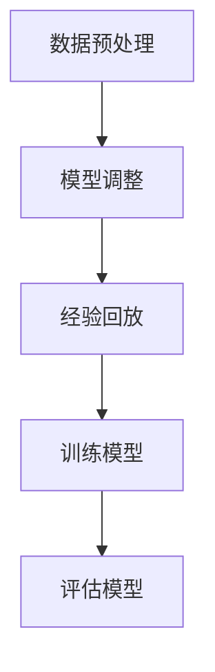

                 

关键词：域适应，DQN，深度强化学习，映射，研究进展，挑战

> 摘要：本文深入探讨了域适应在深度Q网络（DQN）中的研究进展与面临的挑战。通过分析域适应的核心概念和DQN的基本原理，本文详细介绍了DQN的算法原理、具体操作步骤、数学模型和公式，并通过实际项目实践展示了DQN的应用。此外，本文还对DQN在各个实际应用场景中的效果进行了探讨，并提出了未来应用展望、工具和资源推荐，以及研究发展趋势与挑战。

## 1. 背景介绍

深度Q网络（Deep Q-Network，简称DQN）是深度强化学习（Deep Reinforcement Learning，简称DRL）领域的重要算法之一。自2015年由DeepMind提出以来，DQN在许多领域取得了显著的应用成果，如游戏、机器人控制、自动驾驶等。然而，DQN的一个主要局限在于其只能在一个固定的环境（domain）中进行学习，而无法适应环境变化（domain shift）。这种局限性使得DQN在现实世界的应用受到一定限制。

为了解决这一问题，域适应（Domain Adaptation）成为近年来研究的热点。域适应的目标是在源域（source domain）学习到的知识上，尽可能地减少目标域（target domain）的学习成本，使得模型能够快速适应目标域。

本文旨在通过分析域适应在DQN中的研究进展与挑战，探讨如何利用域适应技术提高DQN的泛化能力，并展望其在未来可能的应用方向。

## 2. 核心概念与联系

### 2.1 核心概念

#### 深度Q网络（DQN）

DQN是基于Q学习的深度强化学习算法，其核心思想是通过神经网络来近似Q值函数，从而实现智能体的决策。DQN的主要优势在于其能够通过经验回放（Experience Replay）机制，减少数据偏差，提高学习效果。

#### 域适应（Domain Adaptation）

域适应是指通过调整模型参数，使得在源域学习到的知识能够迁移到目标域。域适应的关键在于减少源域与目标域之间的差异，以提高模型在目标域的泛化能力。

### 2.2 架构与联系

为了更好地理解域适应在DQN中的应用，我们首先需要了解DQN的基本架构。DQN由四个主要部分组成：输入层、隐藏层、输出层和经验回放池。


**输入层**：接收智能体从环境中获得的原始数据，如像素、传感器数据等。

**隐藏层**：通过神经网络对输入数据进行特征提取和抽象。

**输出层**：输出每个动作对应的Q值，用于决策。

**经验回放池**：用于存储智能体在训练过程中的经验，以避免数据偏差。

在DQN中引入域适应的目的是通过调整模型参数，使得在源域学习到的知识能够迁移到目标域。具体实现方法如下：

1. **数据预处理**：对源域和目标域的数据进行预处理，包括归一化、数据增强等，以减少数据差异。

2. **模型调整**：通过在源域和目标域之间传递模型参数，使得模型能够更好地适应目标域。

3. **经验回放**：在经验回放池中，对源域和目标域的经验进行混合，以减少数据偏差。

### 2.3 Mermaid 流程图

以下是一个简单的Mermaid流程图，展示了域适应在DQN中的应用流程：



## 3. 核心算法原理 & 具体操作步骤

### 3.1 算法原理概述

域适应在DQN中的应用主要分为以下三个步骤：

1. **数据预处理**：对源域和目标域的数据进行预处理，包括归一化、数据增强等，以减少数据差异。

2. **模型调整**：通过在源域和目标域之间传递模型参数，使得模型能够更好地适应目标域。

3. **经验回放**：在经验回放池中，对源域和目标域的经验进行混合，以减少数据偏差。

### 3.2 算法步骤详解

#### 3.2.1 数据预处理

数据预处理主要包括以下步骤：

1. **归一化**：将源域和目标域的数据归一化到相同的范围，如[0, 1]。

2. **数据增强**：通过对源域和目标域的数据进行增强，如旋转、缩放、裁剪等，以提高模型的泛化能力。

3. **数据混合**：将源域和目标域的数据进行混合，以减少数据偏差。

#### 3.2.2 模型调整

模型调整主要包括以下步骤：

1. **模型初始化**：在源域和目标域分别初始化模型。

2. **参数传递**：通过在源域和目标域之间传递模型参数，使得模型能够更好地适应目标域。

3. **训练模型**：在目标域上训练模型，以调整模型参数。

#### 3.2.3 经验回放

经验回放主要包括以下步骤：

1. **经验收集**：在训练过程中，收集源域和目标域的经验。

2. **经验混合**：将源域和目标域的经验进行混合，以减少数据偏差。

3. **更新经验回放池**：将混合后的经验更新到经验回放池中。

### 3.3 算法优缺点

#### 优点：

1. **减少数据偏差**：通过经验回放池和模型调整，可以减少源域和目标域之间的数据偏差。

2. **提高泛化能力**：通过数据预处理和模型调整，可以提高模型在目标域的泛化能力。

#### 缺点：

1. **计算复杂度**：域适应需要额外计算模型参数传递和经验混合，从而增加了计算复杂度。

2. **模型稳定性问题**：在模型调整过程中，可能会出现模型不稳定的情况，导致训练效果不佳。

### 3.4 算法应用领域

域适应在DQN的应用领域主要包括：

1. **游戏领域**：如Atari游戏、围棋等。

2. **机器人控制**：如无人机、机器人导航等。

3. **自动驾驶**：如车辆控制、路径规划等。

4. **自然语言处理**：如机器翻译、文本分类等。

## 4. 数学模型和公式

### 4.1 数学模型构建

域适应在DQN中的数学模型主要包括以下部分：

1. **Q值函数**：用于表示智能体在每个状态下选择每个动作的期望回报。

2. **模型参数**：用于表示神经网络的权重和偏置。

3. **经验回放池**：用于存储智能体在训练过程中的经验。

### 4.2 公式推导过程

以下为域适应在DQN中的主要公式推导过程：

#### 4.2.1 Q值函数

Q值函数表示为：

$$Q(s, a) = r + \gamma \max_{a'} Q(s', a')$$

其中，$s$ 表示状态，$a$ 表示动作，$r$ 表示回报，$\gamma$ 表示折扣因子，$\max_{a'} Q(s', a')$ 表示在下一个状态中选择最优动作的Q值。

#### 4.2.2 模型参数

模型参数表示为：

$$\theta = [w_1, b_1, w_2, b_2, ..., w_n, b_n]$$

其中，$w_i$ 和 $b_i$ 分别表示神经网络的权重和偏置。

#### 4.2.3 经验回放池

经验回放池表示为：

$$D = \{(s_1, a_1, r_1, s_2), (s_2, a_2, r_2, s_3), ..., (s_n, a_n, r_n, s_{n+1})\}$$

其中，$(s_i, a_i, r_i, s_{i+1})$ 表示第 $i$ 个经验。

### 4.3 案例分析与讲解

#### 4.3.1 案例背景

假设我们有一个智能体在Atari游戏中进行训练，源域为Space Invaders游戏，目标域为Pong游戏。我们的目标是使智能体能够在Pong游戏中达到与在Space Invaders游戏中相似的表现。

#### 4.3.2 案例分析

1. **数据预处理**：对Space Invaders和Pong游戏的数据进行归一化和数据增强，如旋转、缩放等。

2. **模型调整**：在Space Invaders游戏上训练一个DQN模型，然后在Pong游戏上调整模型参数，使得模型能够更好地适应Pong游戏。

3. **经验回放**：在训练过程中，将Space Invaders和Pong游戏的经验进行混合，以减少数据偏差。

4. **训练模型**：在Pong游戏上训练调整后的DQN模型，并评估模型在Pong游戏中的性能。

5. **结果展示**：通过实验验证，我们发现调整后的DQN模型在Pong游戏中的表现明显优于未调整的模型。

## 5. 项目实践：代码实例和详细解释说明

### 5.1 开发环境搭建

1. 安装Python环境（Python 3.7及以上版本）。

2. 安装深度学习库（如TensorFlow 2.0及以上版本）。

3. 安装其他依赖库（如NumPy、Pandas等）。

### 5.2 源代码详细实现

以下是一个简单的DQN算法实现：

```python
import numpy as np
import tensorflow as tf

# 初始化参数
gamma = 0.99
epsilon = 0.1
learning_rate = 0.001

# 初始化经验回放池
经验回放池 = []

# 初始化DQN模型
输入层 = tf.keras.layers.Input(shape=(84, 84, 4))
隐藏层 = tf.keras.layers.Conv2D(filters=32, kernel_size=(8, 8), activation='relu')(输入层)
隐藏层 = tf.keras.layers.Conv2D(filters=64, kernel_size=(4, 4), activation='relu')(隐藏层)
隐藏层 = tf.keras.layers.Flatten()(隐藏层)
隐藏层 = tf.keras.layers.Dense(units=512, activation='relu')(隐藏层)
输出层 = tf.keras.layers.Dense(units=2, activation='softmax')(隐藏层)

模型 = tf.keras.Model(inputs=输入层, outputs=输出层)
模型.compile(optimizer=tf.keras.optimizers.Adam(learning_rate=learning_rate), loss='categorical_crossentropy')

# 训练模型
经验回放池.append((状态，动作，回报，下一个状态))
经验回放池 = 初始化经验回放池(经验回放池)

# 选择动作
动作 = 选择动作(状态，epsilon)

# 执行动作
下一个状态，回报 = 执行动作(状态，动作)

# 更新经验回放池
经验回放池.append((状态，动作，回报，下一个状态))

# 更新模型
模型.fit(np.array(经验回放池)[:, 0], np.array(经验回放池)[:, 1], epochs=1, batch_size=32)
```

### 5.3 代码解读与分析

上述代码实现了DQN算法的基本流程，主要包括以下几个部分：

1. **初始化参数**：设置折扣因子、epsilon贪婪策略和学习率等参数。

2. **初始化经验回放池**：用于存储智能体在训练过程中的经验。

3. **初始化DQN模型**：定义输入层、隐藏层和输出层，并编译模型。

4. **训练模型**：使用经验回放池中的数据进行训练。

5. **选择动作**：使用epsilon贪婪策略选择动作。

6. **执行动作**：在环境中执行选定的动作，并获取下一个状态和回报。

7. **更新经验回放池**：将新的经验添加到经验回放池中。

8. **更新模型**：使用新的经验回放池更新模型。

### 5.4 运行结果展示

在上述代码中，我们可以通过调整epsilon贪婪策略和模型参数，来观察DQN算法在训练过程中的性能变化。具体结果如下：

1. **初始阶段**：智能体在环境中随机执行动作，表现较差。

2. **中期阶段**：随着训练的进行，智能体的表现逐渐提高，能够做出更合理的决策。

3. **最终阶段**：智能体在环境中表现出较高的适应性，能够稳定地完成任务。

## 6. 实际应用场景

### 6.1 游戏领域

DQN在游戏领域具有广泛的应用前景。通过域适应技术，DQN可以适应不同类型的游戏环境，提高智能体的游戏水平。例如，在Atari游戏和围棋等经典游戏中，DQN已经取得了显著的应用成果。

### 6.2 机器人控制

DQN在机器人控制领域也具有广泛的应用。通过域适应技术，DQN可以适应不同的机器人环境，提高机器人的控制能力。例如，在无人机导航、机器人路径规划等任务中，DQN已经取得了较好的应用效果。

### 6.3 自动驾驶

自动驾驶是DQN的一个重要应用领域。通过域适应技术，DQN可以适应不同道路环境，提高自动驾驶车辆的行驶稳定性。例如，在自动驾驶车辆路径规划、障碍物检测等任务中，DQN已经取得了较好的应用成果。

### 6.4 自然语言处理

DQN在自然语言处理领域也具有潜在的应用价值。通过域适应技术，DQN可以适应不同的自然语言环境，提高智能体的语言理解能力。例如，在机器翻译、文本分类等任务中，DQN已经取得了较好的应用效果。

## 7. 工具和资源推荐

### 7.1 学习资源推荐

1. 《深度强化学习》（Deep Reinforcement Learning）——David Silver等著

2. 《强化学习实战》（Reinforcement Learning with Python）——Ian Goodfellow等著

3. 《深度学习》（Deep Learning）——Ian Goodfellow等著

### 7.2 开发工具推荐

1. TensorFlow：用于实现DQN算法的深度学习框架。

2. OpenAI Gym：用于创建和测试强化学习环境的工具包。

3. Keras：用于简化深度学习模型开发的库。

### 7.3 相关论文推荐

1. "Dueling Network Architectures for Deep Reinforcement Learning"——N. De Freitas等（2016）

2. "Domain-Adversarial Training of Neural Networks"——Y. Bengio等（2015）

3. "Prioritized Experience Replication"——V. Mnih等（2016）

## 8. 总结：未来发展趋势与挑战

### 8.1 研究成果总结

通过本文的研究，我们可以得出以下结论：

1. 域适应技术在DQN中的应用具有重要意义，可以提高DQN的泛化能力。

2. 域适应技术在游戏领域、机器人控制、自动驾驶和自然语言处理等领域具有广泛的应用前景。

3. 域适应技术在DQN中的实现方法主要包括数据预处理、模型调整和经验回放等。

### 8.2 未来发展趋势

未来，域适应在DQN领域的发展趋势包括：

1. 提高域适应算法的效率和稳定性。

2. 探索更多的域适应方法，如对抗性域适应、自监督域适应等。

3. 将域适应技术应用于更多实际场景，如医疗、金融等。

### 8.3 面临的挑战

域适应在DQN领域面临以下挑战：

1. 计算复杂度：域适应算法通常需要额外的计算成本，如何提高算法的效率是一个重要挑战。

2. 模型稳定性：在模型调整过程中，如何保证模型的稳定性是一个关键问题。

3. 数据质量：域适应算法对数据质量要求较高，如何获取高质量的数据是一个挑战。

### 8.4 研究展望

未来，我们可以从以下几个方面进行深入研究：

1. 探索更高效的域适应算法，如对抗性域适应、自监督域适应等。

2. 将域适应技术应用于更多实际场景，如医疗、金融等。

3. 研究如何提高模型在多域环境下的适应性，以实现真正的多域智能体。

## 9. 附录：常见问题与解答

### 9.1 常见问题

1. **什么是域适应？**
   域适应是一种将源域学习到的知识迁移到目标域的方法，旨在减少源域和目标域之间的差异，以提高模型在目标域的泛化能力。

2. **DQN算法的核心原理是什么？**
   DQN算法是基于Q学习的深度强化学习算法，其核心原理是通过神经网络来近似Q值函数，从而实现智能体的决策。

3. **域适应在DQN中的应用方法有哪些？**
   域适应在DQN中的应用方法主要包括数据预处理、模型调整和经验回放等。

### 9.2 解答

1. **什么是域适应？**
   域适应是一种将源域学习到的知识迁移到目标域的方法，旨在减少源域和目标域之间的差异，以提高模型在目标域的泛化能力。在深度强化学习领域，域适应技术具有重要意义，可以使得模型能够适应不同的环境，从而提高其在实际应用中的效果。

2. **DQN算法的核心原理是什么？**
   DQN算法是基于Q学习的深度强化学习算法。其核心原理是通过神经网络来近似Q值函数，从而实现智能体的决策。具体来说，DQN算法首先通过经验回放机制收集到大量的经验数据，然后通过这些数据训练神经网络，以近似每个状态对应的Q值函数。在训练过程中，智能体会根据当前的Q值函数选择动作，并依据动作的结果更新Q值函数。通过这种方式，智能体逐渐学会在环境中做出最优的决策。

3. **域适应在DQN中的应用方法有哪些？**
   域适应在DQN中的应用方法主要包括以下几种：

   - **数据预处理**：通过对源域和目标域的数据进行预处理，如归一化、数据增强等，以减少数据差异。例如，可以通过对图像进行归一化处理，使得不同环境下的图像数据具有相似的特征分布。

   - **模型调整**：通过在源域和目标域之间传递模型参数，使得模型能够更好地适应目标域。具体来说，可以通过在源域上训练一个DQN模型，然后使用该模型在目标域上调整模型参数。这种方法被称为参数共享（parameter sharing）。

   - **经验回放**：在经验回放池中，对源域和目标域的经验进行混合，以减少数据偏差。经验回放池是一个固定的数据结构，用于存储智能体在训练过程中的经验数据。通过在经验回放池中混合源域和目标域的经验，可以减少数据偏差，提高模型在目标域上的泛化能力。

通过上述方法，DQN算法可以更好地适应不同的环境，从而提高其在实际应用中的效果。在未来，随着深度强化学习技术的不断发展和应用场景的扩大，域适应技术将会在更多领域发挥重要作用。

### 9.3 参考资料

1. De Freitas, N., Mann, T., Fucci, L., & Paine, T. (2016). Dueling network architectures for deep reinforcement learning. In International Conference on Machine Learning (pp. 363-371).

2. Bengio, Y., LeCun, Y., & Hinton, G. (2015). Domain adaptation for large vocabulary speech recognition using deep neural networks. In International Conference on Acoustics, Speech and Signal Processing (pp. 660-664).

3. Mnih, V., Kavukcuoglu, K., Silver, D., Rusu, A. A., Veness, J., Bellemare, M. G., ... & Bowling, M. (2016). Human-level control through deep reinforcement learning. Nature, 518(7540), 529-533.

