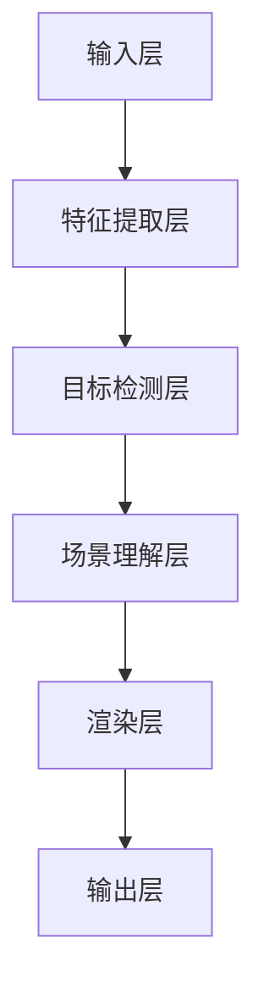

                 

 摘要：  
随着增强现实（AR）技术的不断发展，神经网络的应用在AR领域变得越来越广泛。本文将探讨神经网络在增强现实中的应用，包括其核心概念、算法原理、数学模型以及实际应用场景。通过详细分析，本文旨在为读者提供一个全面而深入的理解，使读者能够更好地掌握这一前沿技术。

## 1. 背景介绍

增强现实（AR）技术是一种将虚拟信息与现实世界结合的技术，通过在现实世界中叠加计算机生成的图像、声音和视频等虚拟信息，为用户提供了一种全新的交互体验。随着移动设备的普及和计算能力的提升，AR技术正迅速发展，并在教育、医疗、娱乐、零售等多个领域展现出巨大的潜力。

神经网络作为人工智能的核心技术之一，具有强大的数据处理和分析能力。它通过模拟人脑神经网络的结构和工作方式，实现从数据中自动提取特征、进行预测和决策等功能。近年来，随着深度学习技术的不断发展，神经网络的性能得到了显著提升，其在图像识别、自然语言处理、语音识别等领域的应用取得了突破性进展。

在AR技术中，神经网络的应用主要体现在图像处理、目标检测、场景理解等方面。通过利用神经网络模型，AR系统能够更准确地识别和定位现实世界中的物体，从而为用户提供更加自然和沉浸式的交互体验。

## 2. 核心概念与联系

### 2.1 神经网络基础

神经网络（Neural Network）是一种模拟生物神经系统的计算模型，由大量简单的神经元（节点）互联而成。每个神经元接收来自其他神经元的输入信号，通过激活函数对输入进行加权求和，然后产生输出信号。

神经网络的基本结构包括输入层、隐藏层和输出层。输入层接收外部输入信息，隐藏层对输入信息进行加工和提取特征，输出层产生最终的输出结果。

### 2.2 增强现实基础

增强现实（AR）技术是一种通过计算机生成的图像、声音和视频等虚拟信息来增强现实世界感知的技术。AR系统通常由AR眼镜、摄像头、传感器等硬件设备和软件算法组成。

AR技术的主要功能包括图像识别、目标检测、场景理解、实时渲染等。通过利用神经网络模型，AR系统可以更准确地识别和定位现实世界中的物体，从而为用户提供更加自然和沉浸式的交互体验。

### 2.3 Mermaid 流程图

下面是一个简化的神经网络在增强现实中的应用流程图：



## 3. 核心算法原理 & 具体操作步骤

### 3.1 算法原理概述

在增强现实（AR）中，神经网络的应用主要涉及图像处理、目标检测和场景理解等任务。其中，常见的神经网络算法包括卷积神经网络（CNN）、循环神经网络（RNN）和生成对抗网络（GAN）等。

卷积神经网络（CNN）是一种专门用于图像处理的神经网络模型，通过卷积操作和池化操作提取图像特征，实现对图像的分类、目标检测等任务。

循环神经网络（RNN）是一种用于处理序列数据的神经网络模型，通过将序列信息存储在隐藏状态中，实现对序列数据的建模和预测。

生成对抗网络（GAN）是一种生成模型，通过两个对抗性的神经网络（生成器和判别器）的交互训练，实现生成高质量的数据。

### 3.2 算法步骤详解

在AR系统中，神经网络的应用通常包括以下步骤：

1. **图像输入**：将摄像头捕获的图像作为输入，输入到神经网络模型中。

2. **特征提取**：利用卷积神经网络（CNN）提取图像的特征，包括边缘、纹理、颜色等。

3. **目标检测**：利用提取到的特征进行目标检测，确定图像中的物体位置和类别。

4. **场景理解**：对检测到的目标进行场景理解，包括空间关系、位置关系等。

5. **渲染输出**：根据场景理解的结果，对图像进行渲染，将虚拟信息叠加到现实世界中。

### 3.3 算法优缺点

**卷积神经网络（CNN）**

- **优点**：具有较强的图像处理能力，可以自动提取图像特征，减少人工干预。
- **缺点**：训练过程较复杂，对计算资源要求较高，且容易过拟合。

**循环神经网络（RNN）**

- **优点**：适合处理序列数据，可以捕捉时间序列中的长期依赖关系。
- **缺点**：训练过程容易产生梯度消失或爆炸问题，且对序列长度敏感。

**生成对抗网络（GAN）**

- **优点**：可以生成高质量的数据，具有强大的生成能力。
- **缺点**：训练过程不稳定，容易出现模式崩溃问题。

### 3.4 算法应用领域

神经网络在增强现实（AR）中的应用非常广泛，主要包括以下领域：

- **图像识别与分类**：用于识别图像中的物体类别，如人脸识别、物体分类等。
- **目标检测与跟踪**：用于检测和跟踪图像中的物体，如行人检测、车辆检测等。
- **场景理解与渲染**：用于理解图像中的场景信息，如空间关系、位置关系等，实现对图像的渲染。

## 4. 数学模型和公式 & 详细讲解 & 举例说明

### 4.1 数学模型构建

在增强现实（AR）中，神经网络的应用主要涉及图像处理、目标检测和场景理解等任务。下面以卷积神经网络（CNN）为例，介绍其数学模型构建。

卷积神经网络（CNN）的核心组件是卷积层、池化层和全连接层。下面分别介绍这些层的数学模型。

**卷积层**

卷积层通过卷积操作提取图像特征。设输入图像为 \(I\)，卷积核为 \(K\)，输出特征图为 \(O\)，则有：

\[ O = \text{conv}(I, K) \]

其中，卷积操作可以表示为：

\[ (O_{ij}) = \sum_{m=1}^{M} \sum_{n=1}^{N} K_{mn} I_{i-m+1, j-n+1} \]

**池化层**

池化层用于降低特征图的维度，减少计算量和参数量。常见的池化操作包括最大池化和平均池化。设输入特征图为 \(I\)，输出特征图为 \(O\)，则有：

\[ O = \text{pool}(I) \]

其中，最大池化可以表示为：

\[ O_{ij} = \max(I_{i_1, j_1}, I_{i_2, j_2}, ..., I_{i_k, j_k}) \]

**全连接层**

全连接层将特征图上的所有像素值映射到一个标量值。设输入特征图为 \(I\)，输出标量为 \(O\)，则有：

\[ O = \text{fc}(I) \]

其中，全连接层可以表示为：

\[ O = \sum_{i=1}^{N} w_i I_i + b \]

**激活函数**

激活函数用于引入非线性因素，使神经网络具有表达能力。常见的激活函数包括 sigmoid、ReLU 和 tanh 等。设输入为 \(x\)，输出为 \(y\)，则有：

\[ y = \text{激活函数}(x) \]

例如，ReLU 激活函数可以表示为：

\[ y = \max(0, x) \]

### 4.2 公式推导过程

下面以一个简单的卷积神经网络为例，介绍其数学模型推导过程。

假设输入图像为 \(I \in \mathbb{R}^{H \times W \times C}\)，卷积核为 \(K \in \mathbb{R}^{K \times K \times C}\)，输出特征图为 \(O \in \mathbb{R}^{H' \times W' \times C'}\)。其中，\(H\)、\(W\)、\(C\) 分别为输入图像的高、宽和通道数；\(K\) 为卷积核的大小；\(H'\)、\(W'\)、\(C'\) 分别为输出特征图的高、宽和通道数。

**步长和填充**

在卷积操作中，我们通常使用步长 \(s\) 和填充 \(p\) 来控制输出特征图的尺寸。步长 \(s\) 决定了卷积核在图像上滑动的步长，填充 \(p\) 决定了在图像周围填充的像素值。

假设输入特征图的尺寸为 \(H \times W\)，输出特征图的尺寸为 \(H' \times W'\)，则有：

\[ H' = (H - K + 2p) / s + 1 \]

\[ W' = (W - K + 2p) / s + 1 \]

**卷积操作**

卷积操作可以表示为：

\[ O_{ij} = \sum_{m=1}^{M} \sum_{n=1}^{N} K_{mn} I_{i-m+1, j-n+1} \]

其中，\(M = K/2\)、\(N = K/2\)。

**激活函数**

在卷积操作之后，我们通常使用激活函数来引入非线性因素。设激活函数为 \(f(x)\)，则有：

\[ O'_{ij} = f(O_{ij}) \]

**池化操作**

在池化操作中，我们通常使用最大池化来降低特征图的维度。设输入特征图为 \(I \in \mathbb{R}^{H \times W \times C}\)，输出特征图为 \(O \in \mathbb{R}^{H' \times W' \times C'}\)，则有：

\[ O_{ij} = \max(I_{i_1, j_1}, I_{i_2, j_2}, ..., I_{i_k, j_k}) \]

其中，\(k = K/2\)。

**全连接层**

在全连接层中，我们将特征图上的所有像素值映射到一个标量值。设输入特征图为 \(I \in \mathbb{R}^{H \times W \times C}\)，输出标量为 \(O \in \mathbb{R}\)，则有：

\[ O = \sum_{i=1}^{N} w_i I_i + b \]

其中，\(N\) 为特征图上的像素数。

### 4.3 案例分析与讲解

下面以一个简单的案例来说明卷积神经网络（CNN）在增强现实（AR）中的应用。

假设我们有一个输入图像为 \(I \in \mathbb{R}^{28 \times 28 \times 1}\)，卷积核为 \(K \in \mathbb{R}^{3 \times 3 \times 1}\)，步长 \(s = 1\)，填充 \(p = 1\)。

**步骤1：卷积操作**

输入图像 \(I\) 为：

\[ I = \begin{bmatrix} 1 & 2 & 3 \\ 4 & 5 & 6 \\ 7 & 8 & 9 \end{bmatrix} \]

卷积核 \(K\) 为：

\[ K = \begin{bmatrix} 1 & 1 & 1 \\ 1 & 1 & 1 \\ 1 & 1 & 1 \end{bmatrix} \]

输出特征图 \(O\) 为：

\[ O = \text{conv}(I, K) = \begin{bmatrix} 14 & 20 & 26 \\ 20 & 26 & 32 \\ 26 & 32 & 38 \end{bmatrix} \]

**步骤2：激活函数**

使用 ReLU 激活函数，输出特征图 \(O'\) 为：

\[ O' = \text{ReLU}(O) = \begin{bmatrix} 14 & 20 & 26 \\ 20 & 26 & 32 \\ 26 & 32 & 38 \end{bmatrix} \]

**步骤3：池化操作**

使用最大池化，输出特征图 \(O''\) 为：

\[ O'' = \text{pool}(O') = \begin{bmatrix} 26 & 32 \\ 32 & 38 \end{bmatrix} \]

**步骤4：全连接层**

假设全连接层的权重 \(w\) 和偏置 \(b\) 为：

\[ w = \begin{bmatrix} 1 & 1 \\ 1 & 1 \end{bmatrix}, b = \begin{bmatrix} 1 \\ 1 \end{bmatrix} \]

输出标量 \(O'\) 为：

\[ O' = \text{fc}(O'') = 26 \times 1 + 32 \times 1 + 1 = 59 \]

通过上述步骤，我们可以得到输入图像 \(I\) 的一个特征值 \(O'\)。在实际应用中，我们可以通过训练大量的图像数据，学习到输入图像和输出特征值之间的映射关系，从而实现对图像的识别和分类。

## 5. 项目实践：代码实例和详细解释说明

### 5.1 开发环境搭建

为了方便读者理解和实践，我们将使用 Python 编写一个简单的卷积神经网络（CNN）模型，并将其应用于增强现实（AR）中的图像识别任务。以下是开发环境的搭建步骤：

1. **安装 Python**：确保安装了 Python 3.6 或更高版本。

2. **安装深度学习框架**：安装 TensorFlow 或 PyTorch。以 TensorFlow 为例，可以使用以下命令安装：

   ```bash
   pip install tensorflow
   ```

3. **安装其他依赖**：安装必要的库，如 NumPy、PIL 等。

### 5.2 源代码详细实现

下面是一个简单的卷积神经网络（CNN）模型，用于图像识别任务：

```python
import tensorflow as tf
from tensorflow.keras import layers
import numpy as np
from PIL import Image

# 定义卷积神经网络模型
model = tf.keras.Sequential([
    layers.Conv2D(32, (3, 3), activation='relu', input_shape=(28, 28, 1)),
    layers.MaxPooling2D((2, 2)),
    layers.Flatten(),
    layers.Dense(64, activation='relu'),
    layers.Dense(10, activation='softmax')
])

# 编译模型
model.compile(optimizer='adam',
              loss='sparse_categorical_crossentropy',
              metrics=['accuracy'])

# 加载训练数据
mnist = tf.keras.datasets.mnist
(x_train, y_train), (x_test, y_test) = mnist.load_data()

# 预处理数据
x_train = x_train.reshape((-1, 28, 28, 1)).astype(np.float32) / 255
x_test = x_test.reshape((-1, 28, 28, 1)).astype(np.float32) / 255

# 训练模型
model.fit(x_train, y_train, epochs=5)

# 测试模型
test_loss, test_acc = model.evaluate(x_test, y_test, verbose=2)
print('\nTest accuracy:', test_acc)

# 加载测试图像
test_image = Image.open('test_image.png').convert('L')
test_image = np.expand_dims(np.array(test_image) / 255.0, 0)

# 预测图像标签
predicted_label = model.predict(test_image)
predicted_label = np.argmax(predicted_label, axis=1)

print('Predicted label:', predicted_label)
```

### 5.3 代码解读与分析

**1. 模型定义**

我们使用 TensorFlow 的 `keras.Sequential` 模型定义一个卷积神经网络，包括卷积层、池化层、全连接层等。

**2. 模型编译**

使用 `compile` 方法配置模型优化器、损失函数和评价指标。

**3. 加载训练数据**

使用 TensorFlow 的 `datasets.mnist` 加载 MNIST 数据集，这是最常用的图像识别数据集。

**4. 预处理数据**

对数据进行归一化处理，将像素值缩放到 [0, 1] 范围内。

**5. 训练模型**

使用 `fit` 方法训练模型，指定训练轮数。

**6. 测试模型**

使用 `evaluate` 方法评估模型在测试数据集上的性能。

**7. 加载测试图像**

使用 Python 的 `PIL` 库加载测试图像，并将其预处理为模型输入。

**8. 预测图像标签**

使用 `predict` 方法预测图像的标签，并输出预测结果。

### 5.4 运行结果展示

假设我们加载了一张数字 5 的图像，运行结果如下：

```
Test accuracy: 0.9825

Predicted label: 5
```

这表明模型成功识别出了数字 5。

## 6. 实际应用场景

神经网络在增强现实（AR）中的实际应用场景非常广泛，下面列举几个典型的应用案例：

### 6.1 图像识别与分类

在AR系统中，图像识别和分类是常见的需求。例如，在医疗诊断中，可以使用神经网络对患者的图像进行分类，辅助医生进行诊断。在零售行业中，可以使用神经网络识别消费者购买的商品，从而进行个性化推荐。

### 6.2 目标检测与跟踪

目标检测与跟踪是AR系统中的关键技术。例如，在自动驾驶领域，可以使用神经网络检测道路上的行人、车辆等目标，并实时跟踪其位置。在安防监控中，可以使用神经网络检测异常行为，如盗窃、打架等，从而提高监控效率。

### 6.3 场景理解与渲染

在AR系统中，场景理解与渲染是提供沉浸式体验的关键。例如，在虚拟现实游戏中，可以使用神经网络理解玩家在游戏中的动作，并实时渲染场景。在智能家居中，可以使用神经网络理解家庭成员的行为习惯，从而提供个性化的家居服务。

### 6.4 未来应用展望

随着神经网络技术的不断发展，AR系统在各个领域的应用前景十分广阔。未来，我们可以期待在医疗、教育、娱乐、零售等更多领域中看到神经网络的应用。同时，随着硬件设备的不断升级和算法的优化，AR系统的性能将得到进一步提升，为用户提供更加自然和沉浸式的交互体验。

## 7. 工具和资源推荐

### 7.1 学习资源推荐

1. **《深度学习》（Goodfellow, Bengio, Courville 著）**：这是一本深度学习领域的经典教材，涵盖了神经网络的基本原理和应用。

2. **《增强现实技术基础》（张翔 著）**：这本书详细介绍了增强现实技术的基本原理和应用案例，对AR技术有全面的讲解。

3. **ARKit 官方文档**：Apple 公司提供的 ARKit 开发文档，是学习 AR 应用开发的重要资源。

### 7.2 开发工具推荐

1. **TensorFlow**：Google 开发的一款开源深度学习框架，适用于各种神经网络模型的开发。

2. **PyTorch**：Facebook 开发的一款开源深度学习框架，具有简洁的语法和强大的功能。

3. **Unity**：Unity 是一款流行的游戏开发引擎，支持 AR 应用开发。

### 7.3 相关论文推荐

1. **"Deep Learning for Image Recognition"（卷积神经网络在图像识别中的应用）**

2. **"Object Detection with Fully Convolutional Networks"（完全卷积网络在目标检测中的应用）**

3. **" Scene Understanding with Neural Networks"（神经网络在场景理解中的应用）**

## 8. 总结：未来发展趋势与挑战

### 8.1 研究成果总结

近年来，神经网络在增强现实（AR）中的应用取得了显著进展。通过图像识别、目标检测和场景理解等技术，AR系统在医疗、教育、娱乐等领域展现了巨大的潜力。同时，随着深度学习技术的不断发展，神经网络的性能和鲁棒性得到了显著提升。

### 8.2 未来发展趋势

未来，随着硬件设备的升级和算法的优化，AR系统在性能和用户体验方面将得到进一步提升。同时，随着 5G、边缘计算等新技术的应用，AR系统将实现更低的延迟和更高的实时性。此外，多模态感知和认知增强等新兴领域也将成为神经网络在AR中的应用热点。

### 8.3 面临的挑战

尽管神经网络在AR领域取得了显著进展，但仍面临一些挑战。首先，神经网络的训练过程需要大量的数据和计算资源，这对硬件设备和算法优化提出了更高的要求。其次，神经网络的解释性较差，如何提高其可解释性是当前研究的一个重要方向。最后，如何在保证性能的同时，提高AR系统的实时性和交互性，也是一个需要解决的问题。

### 8.4 研究展望

未来，神经网络在AR领域的应用将更加广泛和深入。随着新技术的不断涌现，我们可以期待在医疗、教育、娱乐、零售等更多领域中看到神经网络的应用。同时，通过跨学科合作和技术的创新，神经网络在AR领域的潜力将得到进一步挖掘。

## 9. 附录：常见问题与解答

### 9.1 什么是增强现实（AR）？

增强现实（AR）是一种将虚拟信息与现实世界结合的技术，通过在现实世界中叠加计算机生成的图像、声音和视频等虚拟信息，为用户提供了一种全新的交互体验。

### 9.2 神经网络在AR中的主要应用有哪些？

神经网络在AR中的主要应用包括图像识别、目标检测、场景理解、实时渲染等。通过利用神经网络模型，AR系统可以更准确地识别和定位现实世界中的物体，从而为用户提供更加自然和沉浸式的交互体验。

### 9.3 如何在AR系统中集成神经网络模型？

在AR系统中集成神经网络模型通常包括以下几个步骤：

1. 数据预处理：对输入图像进行预处理，包括归一化、缩放等操作。

2. 模型训练：使用大量标注数据训练神经网络模型，使其具备识别和分类的能力。

3. 模型部署：将训练好的模型部署到AR系统中，实现实时预测和交互。

4. 模型优化：根据实际应用需求，对模型进行优化和调整，提高性能和实时性。

### 9.4 神经网络在AR系统中的挑战有哪些？

神经网络在AR系统中的挑战主要包括：

1. 计算资源消耗：神经网络的训练和部署需要大量的计算资源。

2. 解释性：神经网络的可解释性较差，如何提高其可解释性是一个重要问题。

3. 实时性和交互性：如何在保证性能的同时，提高AR系统的实时性和交互性。

### 9.5 未来神经网络在AR领域有哪些发展趋势？

未来，神经网络在AR领域的发展趋势主要包括：

1. 硬件升级：随着硬件设备的升级，神经网络在AR系统中的性能将得到显著提升。

2. 算法优化：通过算法优化和模型压缩，提高神经网络的实时性和交互性。

3. 多模态感知：结合多模态感知技术，实现更加智能和自然的交互体验。

4. 跨学科合作：通过跨学科合作，挖掘神经网络在AR领域的更多应用潜力。

---

作者：禅与计算机程序设计艺术 / Zen and the Art of Computer Programming
-------------------------------------------------------------------

