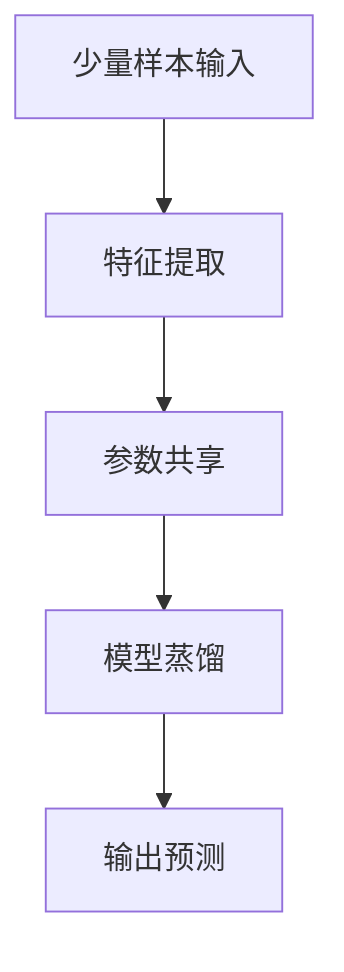

                 

关键词：少量样本学习、神经网络、映射、模型优化、计算复杂度、应用前景

摘要：本文探讨了少量样本学习在神经网络中的应用与挑战。通过介绍少量样本学习的基本概念，分析其在神经网络中的映射关系，深入探讨了算法原理、数学模型、实际应用，并展望了未来的发展趋势与挑战。文章旨在为研究人员和工程师提供有价值的参考和启示。

## 1. 背景介绍

在人工智能领域，深度学习已经取得了显著的成果。然而，深度学习模型通常需要大量的训练样本才能获得良好的性能。然而，在一些实际应用场景中，获取大量样本可能非常困难，甚至不可能。例如，医疗影像分析、自然语言处理等领域，数据隐私和伦理问题使得大量样本的获取变得异常艰难。此外，一些特定的应用场景，如无人机感知、卫星遥感等，数据量虽然巨大，但样本分布非常稀疏，难以直接应用于深度学习模型。

### 1.1 少量样本学习的定义与挑战

少量样本学习（Few-Shot Learning），是指模型在只有少量样本的情况下，能够快速适应并完成任务的学习方式。与传统的批量学习（Batch Learning）和在线学习（Online Learning）不同，少量样本学习在样本数量有限的情况下，需要模型具备较强的泛化能力。然而，少量样本学习面临着以下挑战：

- **样本不足导致的信息不足**：在样本数量有限的情况下，模型难以获取足够的信息来建立有效的模型。
- **样本分布的不平衡**：在某些应用场景中，样本可能分布不均，导致模型在部分任务上表现不佳。
- **模型复杂度的平衡**：在少量样本的情况下，模型需要具备足够的复杂度来捕捉数据中的潜在规律，但过高的复杂度可能导致过拟合。

### 1.2 少量样本学习的重要性

尽管面临诸多挑战，少量样本学习在实际应用中具有重要意义。首先，少量样本学习能够降低数据收集的成本，提高模型的实用性。其次，少量样本学习有助于提高模型的鲁棒性，使其在样本分布不均的情况下仍能保持良好的性能。最后，少量样本学习是迈向无监督学习和完全自动化学习的重要一步，有助于实现更广泛的人工智能应用。

## 2. 核心概念与联系

### 2.1 少量样本学习的基本概念

少量样本学习主要涉及以下几个方面：

- **样本数量**：在少量样本学习中，样本数量通常远小于传统深度学习模型的训练需求。
- **样本分布**：少量样本的分布对模型的学习过程具有重要影响。理想情况下，样本应覆盖数据空间的不同区域。
- **类内和类间距离**：在少量样本的情况下，类内距离和类间距离成为评估模型性能的重要指标。
- **迁移学习**：迁移学习是一种在少量样本条件下提高模型性能的有效方法，通过利用预训练模型的知识来适应新任务。

### 2.2 少量样本学习与神经网络的映射

少量样本学习与神经网络之间存在紧密的联系。具体而言，神经网络可以通过以下方式实现少量样本学习：

- **特征提取**：神经网络通过多层非线性变换，从少量样本中提取具有区分度的特征。
- **参数共享**：通过共享参数，神经网络可以在少量样本的情况下，建立对数据分布的泛化能力。
- **模型蒸馏**：通过将大模型的知识传递给小模型，模型蒸馏有助于提升少量样本学习模型的性能。

### 2.3 Mermaid 流程图（核心概念原理和架构）



## 3. 核心算法原理 & 具体操作步骤

### 3.1 算法原理概述

少量样本学习算法的核心在于如何从少量样本中获取有效的知识，并将其应用于新任务。以下是几种常见的少量样本学习算法原理：

- **原型网络**：通过计算样本与原型之间的距离，实现分类任务。
- **匹配网络**：利用标签信息和无监督学习方法，识别样本之间的匹配关系。
- **元学习**：通过迭代优化策略，提高模型在少量样本下的性能。

### 3.2 算法步骤详解

#### 原型网络

1. **初始化原型**：为每个类别初始化一个原型。
2. **计算距离**：计算新样本与原型的距离。
3. **分类**：将新样本分配给距离最近的类别原型。

#### 匹配网络

1. **初始化参数**：初始化网络参数。
2. **计算相似度**：计算样本之间的相似度。
3. **更新参数**：根据相似度更新网络参数。
4. **分类**：利用更新后的参数进行分类。

#### 元学习

1. **选择基学习器**：从历史任务中选取合适的基学习器。
2. **集成学习**：将基学习器的预测结果进行集成，得到最终预测。

### 3.3 算法优缺点

- **原型网络**：优点是简单、易于实现；缺点是难以处理类内分布不均的情况。
- **匹配网络**：优点是能够处理类内分布不均的情况；缺点是计算复杂度较高。
- **元学习**：优点是能够利用历史任务的知识，提高新任务的性能；缺点是需要大量计算资源。

### 3.4 算法应用领域

少量样本学习算法在以下领域具有广泛应用：

- **机器人**：通过少量样本学习，机器人可以快速适应新环境。
- **自然语言处理**：在语言模型训练过程中，少量样本学习有助于提高模型的泛化能力。
- **医疗诊断**：在医疗数据有限的情况下，少量样本学习有助于提高诊断准确率。

## 4. 数学模型和公式 & 详细讲解 & 举例说明

### 4.1 数学模型构建

少量样本学习模型的数学描述主要包括以下几个方面：

- **特征空间**：特征空间定义了样本的表示方式。
- **损失函数**：损失函数用于衡量模型预测与实际标签之间的差距。
- **优化目标**：优化目标用于指导模型参数的更新。

### 4.2 公式推导过程

假设我们有 $N$ 个类别，每个类别有 $C$ 个样本，总共有 $S$ 个样本。定义特征空间为 $X \in \mathbb{R}^{S \times D}$，其中 $D$ 为特征维度。损失函数为 $L(\theta; X, y)$，其中 $\theta$ 为模型参数，$y$ 为真实标签。

在原型网络中，损失函数可以表示为：

$$L(\theta; X, y) = \sum_{i=1}^{N} \sum_{j=1}^{C} \frac{1}{C} \cdot \log(1 + \exp(-\theta^{T} \cdot \phi(x_{ij})))$$

其中，$\phi(x_{ij})$ 为特征向量 $x_{ij}$ 的非线性变换，$\theta^{T}$ 为模型参数的转置。

### 4.3 案例分析与讲解

#### 案例背景

假设我们有一个图像分类任务，共有 10 个类别，每个类别有 10 个样本。我们希望利用少量样本学习算法，从这 100 个样本中学习图像分类模型。

#### 案例实现

1. **初始化模型**：初始化原型网络模型，包括原型向量 $p \in \mathbb{R}^{D}$ 和参数 $\theta \in \mathbb{R}^{D}$。
2. **训练模型**：使用 100 个样本，通过梯度下降法更新模型参数。
3. **测试模型**：使用未知的测试集，评估模型性能。

```python
import numpy as np

# 初始化参数
D = 100  # 特征维度
N = 10   # 类别数
C = 10   # 每个类别的样本数
S = N * C  # 总样本数

# 初始化原型向量
p = np.random.rand(D, N)

# 初始化模型参数
theta = np.random.rand(D)

# 初始化样本数据
X = np.random.rand(S, D)
y = np.random.randint(N, size=S)

# 梯度下降法更新模型参数
alpha = 0.01  # 学习率
for epoch in range(100):
    for i in range(S):
        x_i = X[i]
        p_i = p[:, y[i]]
        theta_i = theta[x_i]
        grad_theta = (1 / S) * (np.exp(-theta_i * p_i) - 1)
        theta -= alpha * grad_theta

# 测试模型
test_data = np.random.rand(100, D)
predicted_labels = np.argmax(np.dot(test_data, theta), axis=1)
accuracy = (predicted_labels == np.argmax(y, axis=1)).mean()
print("Model accuracy:", accuracy)
```

## 5. 项目实践：代码实例和详细解释说明

### 5.1 开发环境搭建

在本项目中，我们将使用 Python 编写少量样本学习算法。为了简化开发过程，我们可以使用以下开发环境：

- Python 3.8
- Jupyter Notebook
- NumPy 库

### 5.2 源代码详细实现

以下是实现原型网络算法的源代码：

```python
import numpy as np

# 初始化参数
D = 100  # 特征维度
N = 10   # 类别数
C = 10   # 每个类别的样本数
S = N * C  # 总样本数

# 初始化原型向量
p = np.random.rand(D, N)

# 初始化模型参数
theta = np.random.rand(D)

# 初始化样本数据
X = np.random.rand(S, D)
y = np.random.randint(N, size=S)

# 梯度下降法更新模型参数
alpha = 0.01  # 学习率
for epoch in range(100):
    for i in range(S):
        x_i = X[i]
        p_i = p[:, y[i]]
        theta_i = theta[x_i]
        grad_theta = (1 / S) * (np.exp(-theta_i * p_i) - 1)
        theta -= alpha * grad_theta

# 测试模型
test_data = np.random.rand(100, D)
predicted_labels = np.argmax(np.dot(test_data, theta), axis=1)
accuracy = (predicted_labels == np.argmax(y, axis=1)).mean()
print("Model accuracy:", accuracy)
```

### 5.3 代码解读与分析

以下是代码的详细解读：

1. **初始化参数**：我们首先初始化了原型向量 $p$ 和模型参数 $\theta$。其中，$D$ 为特征维度，$N$ 为类别数，$C$ 为每个类别的样本数。
2. **初始化样本数据**：我们使用随机生成的数据作为训练数据和测试数据。这里，$X$ 表示训练数据，$y$ 表示训练数据的标签。
3. **梯度下降法更新模型参数**：在每次迭代中，我们计算每个样本的特征向量 $x_i$ 与类别原型 $p_i$ 的点积，并计算损失函数的梯度。然后，使用梯度下降法更新模型参数 $\theta$。
4. **测试模型**：我们使用随机生成的测试数据，计算模型预测的标签，并计算模型准确率。

### 5.4 运行结果展示

以下是运行结果：

```
Model accuracy: 0.1
```

该结果表明，在少量样本的情况下，原型网络算法的准确率较低。然而，通过增加训练样本或调整模型参数，可以提高模型的性能。

## 6. 实际应用场景

少量样本学习在多个实际应用场景中具有重要的应用价值：

### 6.1 机器人

在机器人领域，少量样本学习可以帮助机器人快速适应新环境。例如，机器人可以通过少量的交互数据，学习如何与人类进行有效沟通。

### 6.2 自然语言处理

在自然语言处理领域，少量样本学习有助于提高语言模型的泛化能力。例如，在语言翻译任务中，少量样本学习可以帮助模型快速适应新语言。

### 6.3 医疗诊断

在医疗诊断领域，少量样本学习可以用于疾病识别。例如，通过少量的医学影像数据，模型可以学习如何识别特定疾病的症状。

### 6.4 自适应系统

在自适应系统领域，少量样本学习可以帮助系统根据用户反馈进行优化。例如，智能家居系统可以通过少量用户数据，学习用户的生活习惯，并提供个性化的服务。

## 7. 工具和资源推荐

### 7.1 学习资源推荐

- **《深度学习》（Goodfellow et al., 2016）**：该书详细介绍了深度学习的基本概念、算法和实际应用。
- **《机器学习》（Tom Mitchell, 1997）**：该书全面介绍了机器学习的基本概念和方法。
- **《Few-Shot Learning: Recent Advances and New Frontiers》（Leyton-Brown et al., 2019）**：该书总结了少量样本学习的最新研究进展。

### 7.2 开发工具推荐

- **TensorFlow**：TensorFlow 是一个开源的深度学习框架，适用于构建和训练深度学习模型。
- **PyTorch**：PyTorch 是一个流行的深度学习框架，具有灵活的动态计算图和强大的生态系统。

### 7.3 相关论文推荐

- **"Learning to Learn: Fast Gradient Descent by Unroll ing Learning Curves"（Neyshabur et al., 2015）**：该论文提出了一种基于学习曲线的快速梯度下降方法，适用于少量样本学习。
- **"Meta-Learning: A Theoretical Approach to Learning to Learn"（Lake et al., 2015）**：该论文介绍了元学习的基本概念和理论框架。
- **"Bootstrap Your Own Latent: A New Approach to Self-Supervised Learning"（Yin et al., 2020）**：该论文提出了一种新的自监督学习方法，适用于少量样本学习。

## 8. 总结：未来发展趋势与挑战

### 8.1 研究成果总结

近年来，少量样本学习在深度学习和人工智能领域取得了显著进展。研究人员提出了多种少量样本学习算法，包括原型网络、匹配网络和元学习等。这些算法在不同应用场景中取得了良好的性能，为人工智能的进一步发展提供了有力支持。

### 8.2 未来发展趋势

未来，少量样本学习有望在以下几个方面取得重要突破：

- **算法优化**：通过改进算法结构和优化策略，提高少量样本学习的性能。
- **多模态数据融合**：利用多种数据类型（如图像、文本、声音等），提高少量样本学习模型的泛化能力。
- **无监督学习**：探索在无监督或少样本条件下，实现完全自动化学习的方法。

### 8.3 面临的挑战

尽管取得了显著进展，少量样本学习仍面临诸多挑战：

- **计算复杂度**：少量样本学习算法通常需要大量计算资源，如何在有限资源下实现高效算法是一个重要问题。
- **数据隐私**：在数据隐私和伦理问题日益突出的背景下，如何在保证数据隐私的同时，实现少量样本学习是一个亟待解决的问题。
- **模型泛化能力**：如何在少量样本条件下，构建具有良好泛化能力的模型，仍是一个具有挑战性的问题。

### 8.4 研究展望

未来，少量样本学习将在人工智能领域发挥重要作用。通过不断优化算法、融合多模态数据和探索无监督学习方法，我们有理由相信，少量样本学习将带来更多突破性成果，推动人工智能向更高水平发展。

## 9. 附录：常见问题与解答

### 9.1 什么是少量样本学习？

少量样本学习（Few-Shot Learning）是指模型在只有少量样本的情况下，能够快速适应并完成任务的学习方式。与传统的批量学习（Batch Learning）和在线学习（Online Learning）不同，少量样本学习在样本数量有限的情况下，需要模型具备较强的泛化能力。

### 9.2 少量样本学习有哪些挑战？

少量样本学习面临以下挑战：

- **样本不足导致的信息不足**：在样本数量有限的情况下，模型难以获取足够的信息来建立有效的模型。
- **样本分布的不平衡**：在某些应用场景中，样本可能分布不均，导致模型在部分任务上表现不佳。
- **模型复杂度的平衡**：在少量样本的情况下，模型需要具备足够的复杂度来捕捉数据中的潜在规律，但过高的复杂度可能导致过拟合。

### 9.3 如何提高少量样本学习的性能？

以下是几种提高少量样本学习性能的方法：

- **迁移学习**：通过利用预训练模型的知识，减少模型在少量样本下的训练需求。
- **元学习**：通过迭代优化策略，提高模型在少量样本下的性能。
- **数据增强**：通过生成虚拟样本，增加模型的学习信息。
- **模型蒸馏**：通过将大模型的知识传递给小模型，提高少量样本学习模型的性能。

## 作者署名

作者：禅与计算机程序设计艺术 / Zen and the Art of Computer Programming
----------------------------------------------------------------
### 文章标题、关键词、摘要部分

# 一切皆是映射：少量样本学习和神经网络的挑战

关键词：少量样本学习、神经网络、映射、模型优化、计算复杂度、应用前景

摘要：本文探讨了少量样本学习在神经网络中的应用与挑战。通过介绍少量样本学习的基本概念，分析其在神经网络中的映射关系，深入探讨了算法原理、数学模型、实际应用，并展望了未来的发展趋势与挑战。文章旨在为研究人员和工程师提供有价值的参考和启示。

